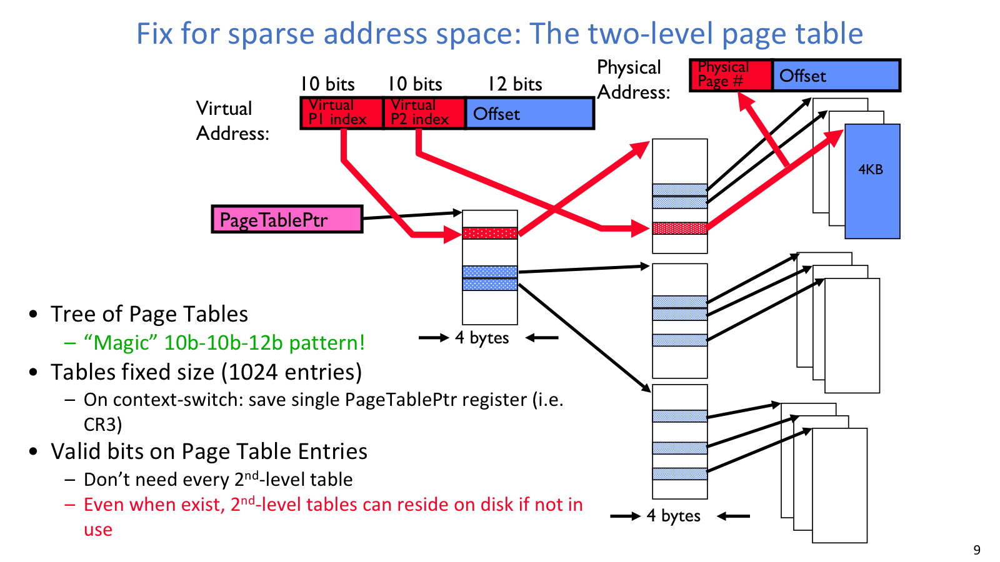
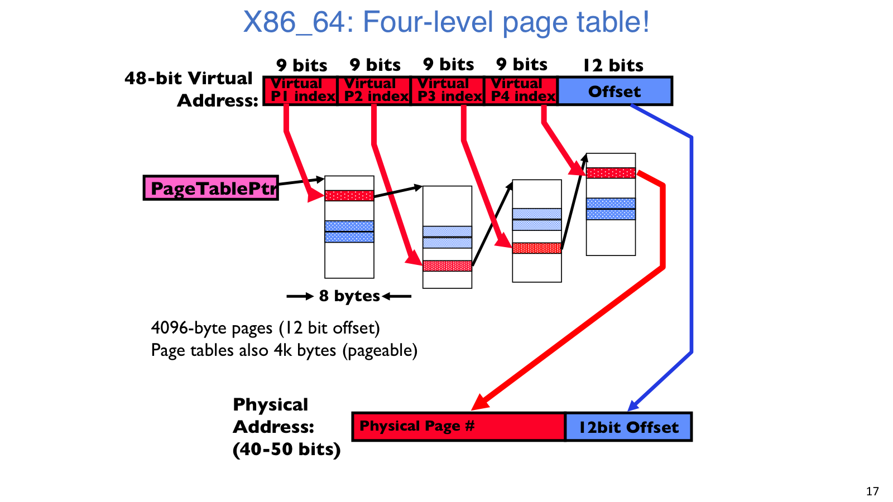
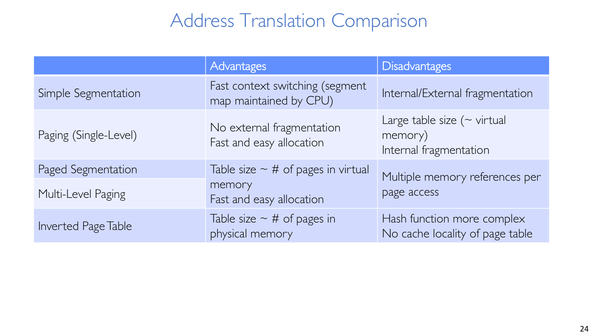
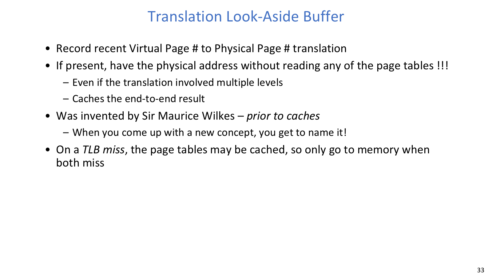
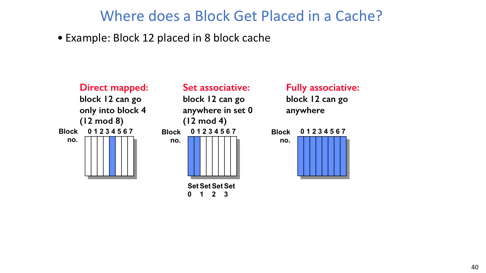

## Simple Page Table

### 问题

simple page table 是一个巨大数组：`VPN` 直接作为索引，PTE 中存 `PPN + flags`。这个结构查找简单，但它的大小由 virtual address space 决定，而不是由进程实际使用多少内存决定。

以 32-bit 地址空间、4KB page 为例：

```text
address space = 2^32 bytes
page size = 4KB = 2^12 bytes
PTE count = 2^32 / 2^12 = 2^20
PTE size = 4 bytes
page table size = 2^20 * 4 = 4MB
```

每个进程 4MB 页表在早期机器上已经很贵。64-bit 地址空间更夸张：若仍用 4KB page，需要 `2^52` 个 PTE，完全不可接受。

### 机制

关键观察是：大部分进程地址空间是 sparse 的。code、heap、stack 和 mmap 区域之间存在大量洞，许多 virtual page 根本没有映射。page table 本质上只是一个 map：

```text
VPN -> PPN + flags
```

既然是 map，它不一定非要用一维数组实现，也可以用树、多级表、hash table 或 inverted page table。

## Multi-Level Page Table



二级页表把 32-bit VA 拆成 `10 | 10 | 12`，说明稀疏地址空间如何节省页表页。

### 机制

二级页表把地址拆成多段索引。例如 32-bit VA、4KB page 可以写成：

```text
Virtual Address = 10-bit L1 index | 10-bit L2 index | 12-bit offset
```

12-bit offset 对应 4KB page。L1 index 找到二级页表页，L2 index 在二级页表页中找到最终 PTE。若某个 L1 entry invalid，就不需要为对应的一大段虚拟地址分配 L2 page table，这正是它节省空间的地方。

### 取舍

multi-level page table 的好处是页表总大小接近实际使用的地址空间，而不是整个 virtual address space。它天然适合 sparse address space，且底层页表页本身也用固定大小 frame 分配。

代价是 TLB miss 后 page table walk 需要多次内存引用。也就是说，multi-level page table 主要节省空间，不是让 TLB hit 更快；在没有 TLB 命中的情况下，它反而让一次翻译更贵。

## x86-64 页表



x86-64 四级页表展示 `9 x 4 + 12 = 48` 的真实位宽来源。



对比表把 segmentation、single-level paging、multi-level paging 和 inverted page table 的取舍放在一起。

### 机制

x86-64 常见虚拟地址使用 48 bits，并通过四级页表完成翻译：

```text
Virtual Address = PML4 index | PDPT index | PD index | PT index | offset
bits            = 9          | 9          | 9        | 9        | 12
```

每级 index 是 9 bits，因为一个 4KB page table page 中可以放：

```text
4096 bytes / 8 bytes per PTE = 512 = 2^9
```

所以四级索引加 offset 是 `9 x 4 + 12 = 48`。

### 取舍

如果继续把 64-bit 全部展开，需要更多层，walk 成本也会更高；真实架构通常只使用 canonical virtual address 的一部分位宽，并随着硬件演进逐渐扩展。

## PTE

### 机制

PTE 可能指向下一级 page table，也可能指向最终 physical page。除此之外，它还包含一组 flags：

| flag | 作用 |
| --- | --- |
| valid | 翻译是否当前有效 |
| read/write/execute | 访问权限 |
| user/kernel | 用户态是否可以访问 |
| dirty/modified | 页是否被写过 |
| reference/use | 页是否最近被访问过 |

`invalid PTE` 不一定代表非法地址。它也可能是 OS 有意设置的入口，让硬件 trap 到内核后处理 demand paging、copy-on-write 或 zero-fill-on-demand。

### 例子

demand paging 只把 active pages 放在内存里，不活跃页放在 disk/backing store。PTE 标 invalid；访问时触发 page fault，OS 再把页调入内存。

copy-on-write 让 `fork` 后的 parent 和 child 先共享同一批 physical pages，并把双方 PTE 标成 read-only。任一方写入时触发 page fault，OS 复制该页、更新 PTE，再恢复写入。

zero-fill-on-demand 防止新分配页泄露旧进程数据。OS 可先不给实际物理页，第一次访问时 fault，再分配并清零一个 frame。

## 翻译方案

| 方案 | 优点 | 缺点 |
| --- | --- | --- |
| Simple segmentation | context switch 快，段表小，符合 code/data/stack 逻辑 | internal/external fragmentation，共享和扩展复杂 |
| Single-level paging | 分配简单，支持 page sharing | 稀疏地址空间下页表巨大 |
| Multi-level paging | sparse address space 友好，可按需分配页表页 | TLB miss 时多次内存访问 |
| Inverted page table | 大小接近 physical memory 大小 | hash 查找复杂，sharing 和别名处理更麻烦 |

这些方案虽然形态不同，但权限边界是一致的：context switch 时至少要切换 page table pointer 和相关 limit；用户进程不能修改自己的 page table，否则可以映射任意物理内存；修改 page table base、segment descriptor table 等状态必须是 kernel mode 特权操作。

## TLB 与 MMU



TLB 图强调它缓存的是地址翻译结果，不是普通数据。

### 问题

MMU 在 CPU 和内存之间做地址翻译。每次 instruction fetch、load、store 都需要翻译地址；如果每次都走多级页表，访存成本会被 page table walk 放大到难以接受。

### 机制

`Translation Lookaside Buffer` 缓存最近的端到端翻译结果：

```text
key   = VPN
value = PPN + protection bits
```

TLB hit 时不访问页表，直接得到 PPN 并检查权限。TLB miss 时才进行 page table walk；如果最终 PTE invalid 或权限不合法，才触发 page fault。

流程可以写成：

```text
CPU 产生 VA
-> 用 VPN 查 TLB
-> hit: 得到 PPN，检查权限，访问 cache/memory
-> miss: page table walk
   -> PTE valid: 填入 TLB，再访问
   -> PTE invalid: page fault，进入 OS
```

需要注意的是，TLB 缓存的是地址翻译，不是数据本身。它通常在 cache 前面，或与 cache lookup 尽量重叠。context switch 后旧 TLB entry 可能把新进程的同名 VPN 错误翻译到旧进程的 PPN，因此要 flush，或使用 ASID/PID 区分地址空间。

## Cache



这张图适合对照三种 placement policy 的查找范围和替换范围。

### 机制

缓存平均访问时间：

```text
AMAT = hit rate * hit time + miss rate * miss time
     = hit time + miss rate * miss penalty
```

cache 访问时，地址通常拆成：

```text
address = tag | index | block offset
```

`block offset` 选择 block 内 byte/word；`index` 选择 cache set；`tag` 确认该 set 中哪一项才是目标数据。

三种 block placement 的区别可以从“一个 block 能放到多少位置”来理解：

| 组织方式 | 放置规则 | 取舍 |
| --- | --- | --- |
| Direct mapped | 每个 block 只能放一个 set | 查找快，但 conflict miss 多 |
| Set associative | 每个 block 可放某个 set 中多路之一 | 冲突和硬件成本折中 |
| Fully associative | 任意 block 可放任意位置 | 冲突少，但并行比较成本高 |

### Replacement 和 Write Policy

direct mapped 没有 replacement 选择，因为只有一个位置。set associative 或 fully associative 才需要 random、LRU 等 replacement policy。

`write-through` 写 cache 时同步写 lower-level memory，简单但写开销高。`write-back` 只写 cache，替换 dirty block 时再写回，性能更好但需要 dirty bit，逻辑更复杂。

## Locality

TLB 和 cache 都依赖 locality。Temporal locality 表示刚访问过的地址很可能很快再访问；spatial locality 表示访问某地址附近数据的概率较高。程序 instruction fetch 通常顺序性强，data access 也常集中在工作集内，因此小而快的缓存可以显著降低平均访问时间。
