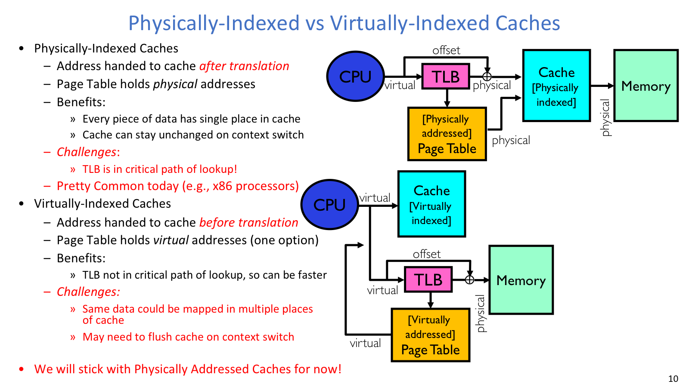
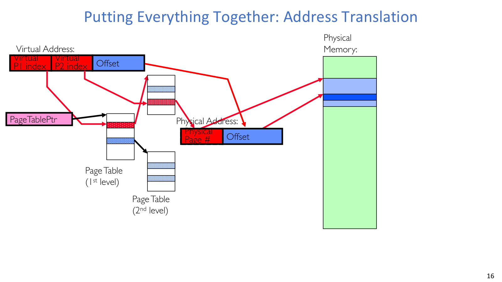
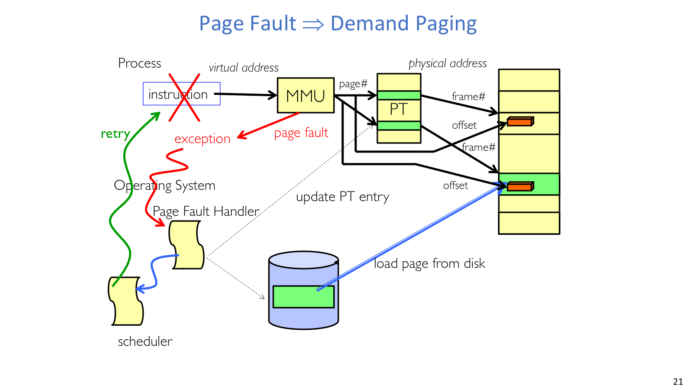
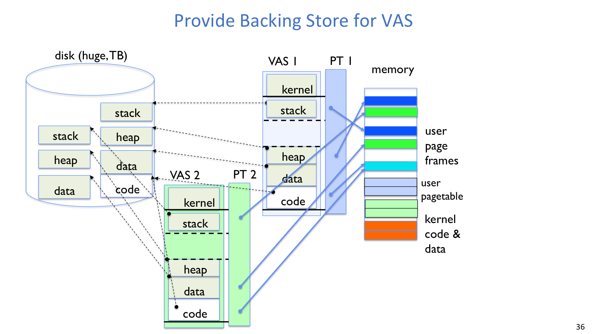
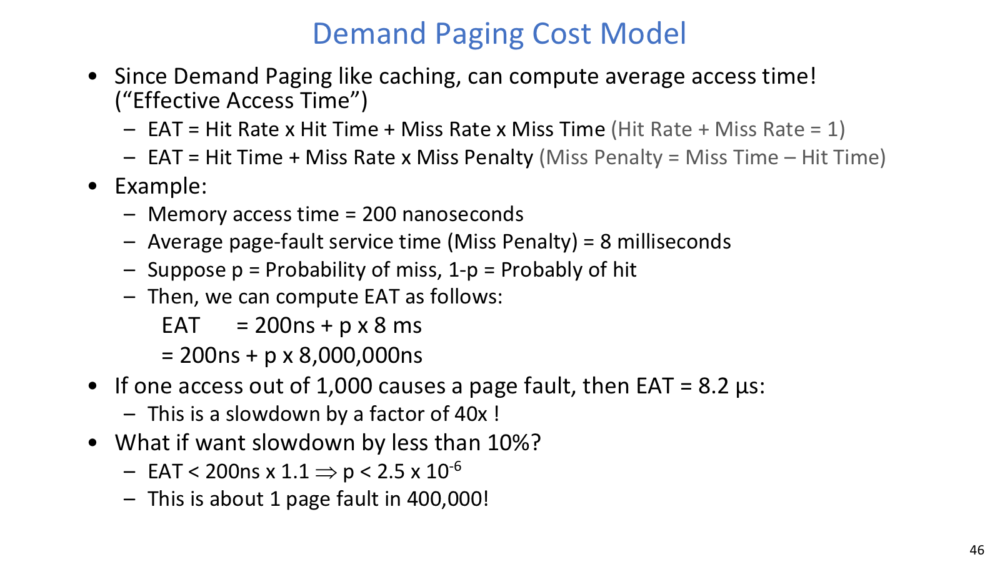

# Lecture 15: TLB/Cache Interaction and Demand Paging

## 导读

本讲把地址翻译落到真实执行路径上：TLB、cache、context switch 和 page fault 如何配合，决定了一次访存到底有多快。physically-indexed cache 简化一致性，但会把 TLB 放进访问路径；virtually-indexed cache 更快，却要面对 synonym 和 context switch 带来的别名问题。

后半讲进入 demand paging。可以把 DRAM 看作 disk 的 cache：页不在内存时触发 page fault，OS 再从 backing store 调入。由于 page fault 代价巨大，working set 和 EAT 模型就很重要，它们解释了为什么很小的 fault rate 也会拖垮性能。

## 本讲地图

| 主题 | 解决的问题 |
| --- | --- |
| Physically vs virtually indexed cache | cache lookup 应该用 PA 还是 VA |
| TLB organization | 如何让翻译缓存足够快、miss 足够少 |
| Context switch and TLB consistency | 地址空间切换后如何避免旧翻译污染新进程 |
| Page fault | 翻译失败时哪些 fault 可修复，哪些应终止进程 |
| Demand paging | 只把活跃页放在 DRAM，其他页留在 disk/backing store |
| Working set and EAT | 用局部性和平均访问时间解释 paging 性能 |

## 正文

一次访存背后可能先查 TLB，再走 page table，也可能触发 page fault。把这条路径连起来，demand paging 才比较好理解。

### TLB 与 Cache



物理索引和虚拟索引 cache 的差别决定了 TLB 是否在 cache lookup 的关键路径上。



地址翻译总图把多级页表、physical memory 和 virtual address 字段放在同一条路径上。

#### 问题

CPU 发出的是 virtual address，cache 最终要拿到数据。关键问题是 cache lookup 应该用 virtual address 还是 physical address。如果必须先完成地址翻译再查 cache，TLB 就进入 critical path；如果先用虚拟地址查 cache，又会引入别名和一致性问题。

#### 机制

`Physically-indexed cache` 使用 physical address 查 cache。它的好处是同一份物理数据在 cache 中只有一个位置，context switch 后 cache 内容可以保留；代价是必须等 TLB 翻译出 PA，TLB lookup 会影响 cache 访问时间。

`Virtually-indexed cache` 使用 virtual address 查 cache，可能与 translation 并行甚至先于 translation。它的好处是更快；问题是同一个 physical page 可能被多个 virtual address 映射到 cache 的不同位置，形成 synonym/alias。context switch 后同名虚拟地址也可能指向不同物理页，因此可能需要 flush cache，或做更复杂的标记。

现代机器常通过 page offset 与 cache index 的位宽设计，让小 L1 cache 的部分 lookup 与 TLB lookup 重叠。

### TLB Organization

#### 机制

TLB entry 通常包含：

| 字段 | 作用 |
| --- | --- |
| VPN | virtual page number |
| PPN | physical page number |
| protection bits | 读写执行、用户/内核等权限 |
| valid bit | entry 是否有效 |
| ASID/PID | 可选，用于区分不同地址空间 |

TLB 很小但必须很快，常见规模约 128-512 entries，现代机器可能更大。由于 TLB miss penalty 很高，TLB 不能有太多 conflict miss；小 TLB 常做成 fully associative。如果 fully associative 太慢，也可以在前面放一个很小的 direct-mapped TLB slice。

#### 取舍

TLB miss 不等于 page fault。miss 只表示翻译缓存里没有，硬件或软件需要走 page table；只有 page table walk 后发现 PTE invalid 或权限不合法，才进入 page fault。

### TLB Consistency

#### 问题

TLB 缓存的是 `VPN -> PPN`。context switch 后 address space 变了，同一个 VPN 可能属于另一个进程。如果继续使用旧 TLB entry，新进程可能错误访问旧进程的物理页。

#### 机制

最简单的方法是 context switch 时 flush/invalidate TLB。这样做安全但昂贵，频繁切换时会让新进程经历一批冷 TLB miss。

更高效的方法是在 TLB entry 中加入 ASID/PID。硬件 lookup 时同时比较 VPN 和 ASID，不同进程的同名 VPN 可以共存。

TLB consistency 不只发生在 context switch。OS 修改 page table 时也必须 invalidate 对应 TLB entry。例如把某个页换出到 disk 后，如果旧 TLB entry 仍有效，硬件可能继续访问已经不该访问的 physical frame。

### Page Fault

#### 问题

page fault 是虚拟到物理翻译失败时发生的同步 fault/trap，不是异步 interrupt。它和当前指令直接相关，OS 修复后通常要重试原指令。因此分析 page fault 时，重点是判断这个 fault 能不能被 OS 修复。

可能原因包括：

| 原因 | 处理 |
| --- | --- |
| PTE marked invalid | 可能非法，也可能是 demand paging/COW/zero-fill |
| privilege level violation | 通常终止或报错 |
| access violation | 例如写 read-only page，可能是 COW，也可能非法 |
| PTE 不存在 | 可能是地址非法或页表需扩展 |
| page 不在内存 | demand paging 调入 |

保护违规通常直接终止进程；可修复 fault 则进入 OS handler，完成分配、调入或复制后再重试原指令。

### Demand Paging

#### 机制

demand paging 把 DRAM 看作 disk 的 cache。现代程序拥有很大的虚拟地址空间，但并不是所有 code/data 都会同时活跃；课件用 90/10 rule 表达这种局部性。

对应关系可以这样看：

| Cache 术语 | Demand paging 对应物 |
| --- | --- |
| block size | 1 page，例如 4KB |
| organization | fully associative，因为虚拟页可放任意 physical frame |
| lookup | 先查 TLB，再 page table walk |
| miss | page fault，从 disk/backing store 取页 |
| replacement | FIFO/RANDOM/MIN/LRU/Clock 等 |
| write policy | write-back，需要 dirty bit |

write policy 必须接近 write-back。若每次写页都同步写 disk，代价不可接受；因此 dirty bit 用来判断 victim page 是否需要写回 backing store。

### Fault Handler



page fault 图展示了 MMU、page table、OS handler 和 disk 之间的控制流。

#### 机制

page fault handler 的流程可以按“判断能否修复、准备 frame、读入目标页、恢复执行”来组织：

```text
1. CPU/MMU 发现 PTE invalid 或权限问题，trap 到 OS。
2. OS 判断 fault 是否可修复：
   - 非法访问：终止进程。
   - COW/stack growth/demand paging：继续处理。
3. 找一个 free frame；如果没有，选择 victim page。
4. 如果 victim dirty，写回 disk/backing store。
5. 将 victim 的 PTE 和相关 TLB entry 设为 invalid。
6. 从 disk/backing store 把目标页读入 frame。
7. 更新 faulting page 的 PTE：valid、PPN、权限、dirty/use 等。
8. 将 faulting thread 放回 ready queue，之后从原 faulting instruction 继续。
```

等待 disk I/O 时，faulting process/thread 进入 wait queue，OS 调度 ready queue 中的其他线程运行。这一点解释了为什么 page fault 对当前指令来说是同步 fault，但系统整体不一定空转等待。

### Backing Store



backing store 图说明 resident pages 与 non-resident pages 都需要被 OS 纳入虚拟地址空间管理。

#### 机制

加载可执行文件时，OS 不必把整个 binary 读入内存。它可以先建立虚拟地址空间、page table 和文件/磁盘位置映射；代码页第一次被执行或访问时，再通过 page fault 加载。

VAS 的常见用途包括：

| 用途 | 机制 |
| --- | --- |
| stack growth | 访问 guard 区域后分配新页并 zero-fill |
| heap growth | 扩展地址空间并按需分配物理页 |
| fork | 复制 page table，COW 共享 parent pages |
| exec | 按需加载 binary |
| mmap | 把文件或 shared region 映射成内存 |

对于 non-resident page，OS 需要从 `(PID, page#)` 找到 disk block：

```text
FindBlock(PID, page#) -> disk_block
```

实现方式可能是利用 PTE spare bits 存 disk location，维护纯软件表，用连续 swap 区的紧凑表示，或用 hash table。

### Working Set Model

#### 问题

程序执行时会在不同阶段访问不同页集合。`working set` 是进程最近一段时间实际访问的页集合。

#### 机制

如果进程分到的 frames 足够容纳当前 working set，page fault rate 就低；如果 working set 放不下，进程会不断 fault，系统大量时间用于 paging，进入 thrashing。working set 是理解 capacity miss、page frame allocation 和后续 thrashing 控制的桥梁。

虚拟内存里一般不强调 conflict miss，因为 demand paging 可视为 fully associative cache：虚拟页可以放到任意 physical frame。更常见的是 compulsory miss、capacity miss，以及进程阶段切换导致的 working set 变化。

### Cost Model



这页把 page fault probability 放进平均访问时间里，用来估算 paging 的真实代价。

#### 例子 / 推导

page fault penalty 比普通内存访问大很多，所以很小的 miss rate 也会让系统明显变慢。公式是：

```text
EAT = hit rate * hit time + miss rate * miss time
    = hit time + miss rate * miss penalty
```

若内存访问时间是 `200 ns`，page-fault service time 是 `8 ms = 8,000,000 ns`，page fault probability 是 `p`：

```text
EAT = 200 ns + p * 8,000,000 ns
```

如果每 1000 次访问有 1 次 page fault：

```text
p = 0.001
EAT = 200 + 8000 = 8200 ns = 8.2 us
```

这大约慢 40 倍。若希望 slowdown 小于 10%：

```text
EAT < 220 ns
p * 8,000,000 < 20
p < 2.5 * 10^-6
```

也就是约 400,000 次访问最多 1 次 page fault。这个数量级说明 demand paging 依赖强局部性；working set 一旦放不下，性能会迅速崩溃。
