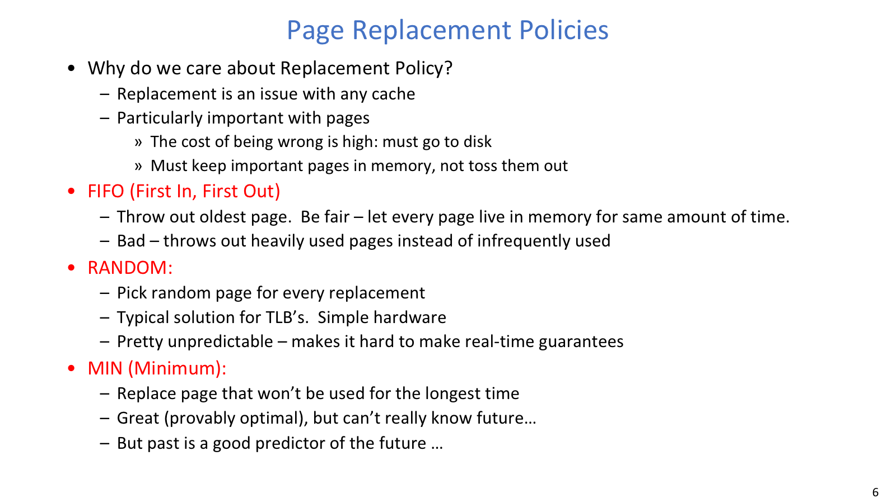
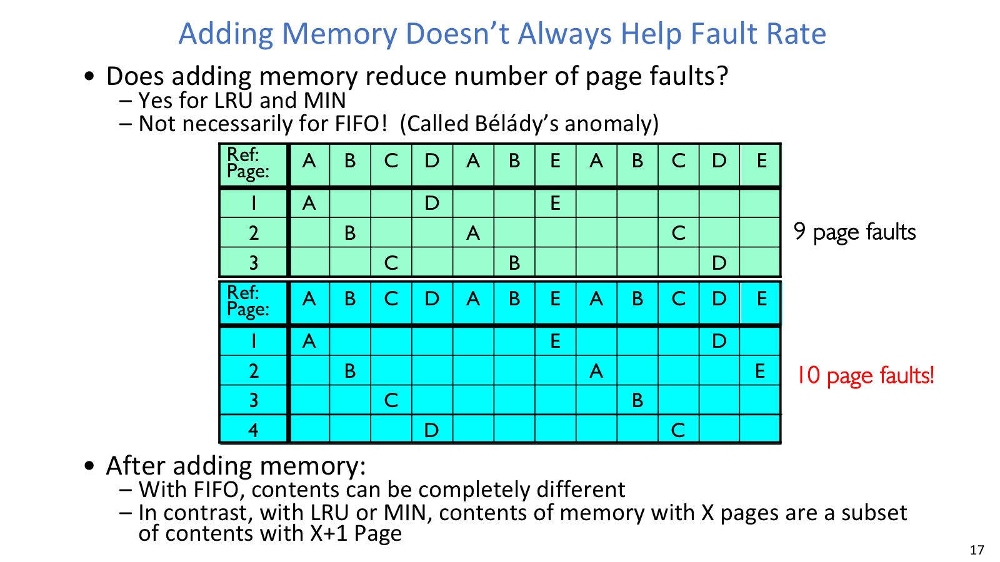
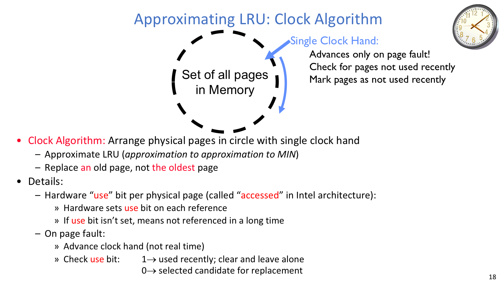
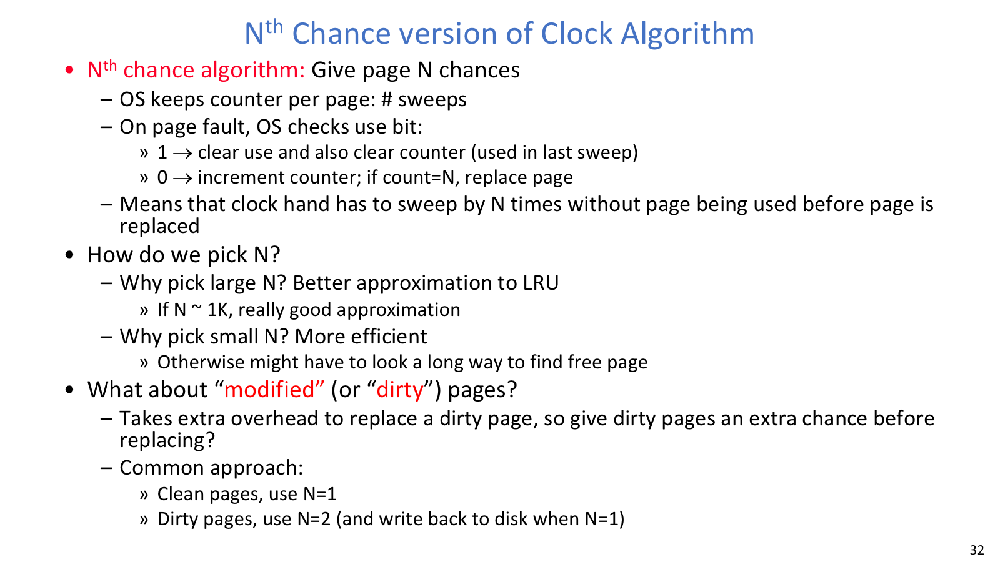
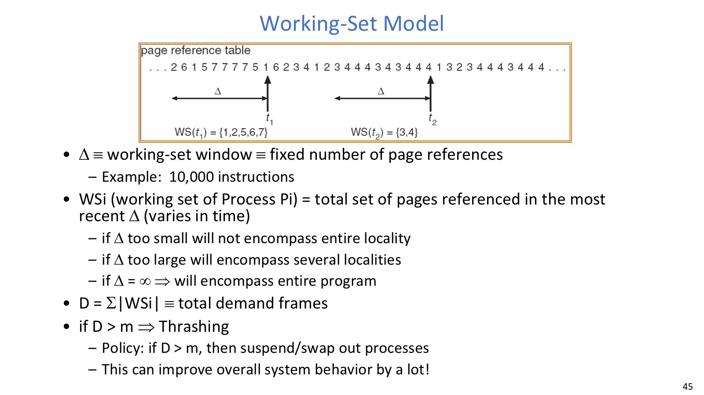

## Page Replacement



这页把 replacement policy 的核心动机讲清楚：page cache 的 miss 代价尤其高。

Demand paging 可以看成一种缓存：virtual page 是缓存块，physical frame 是缓存槽，backing store 是更慢的下一级存储。和 CPU cache 不同，page replacement 的错误代价非常高，因为缺页可能要发起磁盘 I/O，还要阻塞当前进程。

常见策略可以按“是否知道未来”和“实现成本”来读：

| 策略 | 做法 | 优点 | 代价 |
| --- | --- | --- | --- |
| `FIFO` | 替换最早进入内存的页 | 简单、公平 | 可能踢掉热点老页，也可能出现 Belady's anomaly |
| `RANDOM` | 随机选 victim | 极简，硬件或系统实现容易 | 不可预测，难以给实时或尾延迟保证 |
| `MIN/OPT` | 替换未来最久才会再用的页 | 理论最优，是评价其他算法的下界 | 在线系统不知道未来，不能真正实现 |
| `LRU` | 替换过去最久没有使用的页 | locality 下常能近似 MIN | 精确维护访问时间或链表开销很高 |

`MIN` 的价值不是实用，而是给出“最多能好到哪里”的基准。`LRU` 的价值在于相信程序访问具有 temporal locality：过去很久没用的页，未来短时间内也较不可能用到。

## Stack Property



FIFO 不满足 stack property，因此可能出现加内存反而 page faults 更多的 Belady's anomaly。

一个 replacement algorithm 如果满足 `stack property`，那么给它更多 frames 时，较小内存中的页集合总是较大内存中页集合的子集。这样 frame 数增加时 miss rate 不会升高。

`LRU` 和 `MIN` 满足这个性质。`FIFO` 不满足，因为它只看进入内存的时间，不看最近是否被使用。结果就是 Belady's anomaly：某些 reference string 下，增加 frame 数反而让 FIFO faults 变多。

这件事的要点不是“FIFO 总是差”，而是 FIFO 的状态不具有包含关系。更多 frames 会改变进入队列和离开队列的相对历史，从而产生反直觉结果。

## Clock Algorithm



Clock 把所有 resident pages 放成环，用 clock hand 和 use bit 给最近访问页 second chance。

精确 LRU 需要在每次 memory reference 后更新全局状态，这对 OS 来说太贵。Clock Algorithm 用硬件维护的 `use bit/reference bit` 近似“最近是否用过”。

基本流程是：

```text
page fault:
  从 clock hand 当前指向的 frame 开始扫描
  如果 use bit = 1:
    清零 use bit
    hand 前进
    给该页 second chance
  如果 use bit = 0:
    选它作为 victim
    若 dirty，写回或安排写回
    装入新页并更新 PTE/TLB
    hand 前进
```

这套机制的直觉很干净：最近被访问过的页会在第一次扫描中被放过；如果一整圈之后还没再次被访问，说明它在当前 locality 中较冷，可以被替换。

Clock hand 的速度也能反映系统状态。hand 移动慢通常说明 page faults 不多，系统比较健康；hand 转得很快则说明频繁缺页，可能已经接近内存压力或 thrashing。

## N-th Chance



N-th chance Clock 通过 sweep counter 控制一页获得多少次机会，也能区别对待 dirty page。

N-th chance Clock 给每页维护一个 counter。扫描时如果 `use bit = 1`，清 use bit 并清 counter；如果 `use bit = 0`，counter 增加；counter 达到 N 才替换。

N 越大，算法越保守，更接近 LRU，但扫描时间也更长。N 越小，回收更激进，开销更低，但容易误伤刚好短期没被访问的页。

Dirty page 通常值得额外考虑，因为替换 dirty page 需要写回 disk。一个常见做法是给 clean page 较少机会，给 dirty page 较多机会，或者在进入候选状态时先安排后台写回。这样真正需要 victim 时，OS 更可能拿到 clean frame。

硬件不一定直接提供所有 bit，但 OS 仍然可以用权限变化来模拟。没有 `modified bit` 时，可以先把本来允许写的页标成 read-only；第一次写会触发 fault，OS 确认这次写合法后设置软件 dirty bit，再恢复 writable。没有 `use bit` 时，也可以暂时把页标 invalid 或收紧访问权限；下一次访问触发 fault 后，OS 设置软件 use bit，再恢复访问权限。

这类模拟本质上是把硬件状态转化为额外 page faults。它让 OS 在较弱硬件上也能实现近似算法，但代价就是 trap 路径变长，体现的是硬件支持与软件开销之间的取舍。

## Second-Chance List

VAX/VMS 风格的 second-chance list 把内存分成 active list 和 second-chance list。active list 中的页可以正常访问；被挤出的页进入 second-chance list，并被标为 invalid。如果进程再次访问它，触发 fault 后可以快速移回 active list。

second-chance list 为空时接近 FIFO；如果所有页都放在 second-chance list 中，则更接近 LRU，但几乎每次引用都可能 fault，trap 开销太大。因此实际系统会选一个中间大小，用更多 OS 管理开销换更少 disk writes。

OS 还会维护 free frame list。后台 pageout daemon 可以提前扫描、清理、写回 dirty pages，让真正的 page fault 路径不必现场完成所有回收工作。

替换 frame 时还有一个容易被忽略的问题：OS 必须知道哪些 PTE 指向这个 physical frame。shared memory、`fork`、`mmap` 都可能让多个页表项引用同一 frame，所以系统需要 reverse mapping/coremap 之类的数据结构快速找到并失效相关 PTE。

## Frame Allocation

Replacement 可以是 `global replacement`，也可以是 `local replacement`。Global replacement 允许一个进程从全系统 frame 中选 victim，整体利用率可能更高，但进程之间会互相影响；local replacement 只在本进程 frame 内替换，隔离更强，但可能让空闲内存和高压力进程并存。

Frame 分配策略也有不同口味：

| 策略 | 思路 | 适合表达的取舍 |
| --- | --- | --- |
| Equal allocation | 每个进程分到一样多 frame | 简单，但不看进程大小 |
| Proportional allocation | 按进程大小分配 | 更符合 footprint 差异 |
| Priority allocation | 按优先级分配 | 保护重要任务 |
| Page-Fault Frequency | 根据 fault rate 动态调节 | fault rate 高就加 frame，过低则可回收 |

Page-Fault Frequency 的核心是用反馈控制内存：fault rate 高于上阈值，说明进程 frame 不够；fault rate 低于下阈值，说明可能分配过多。

## Thrashing



Working set 把 locality 变成可讨论的集合大小，是解释 thrashing 的关键抽象。

`Thrashing` 指进程忙于把 pages 换进换出，几乎没有实际进展。典型现象是 page fault rate 很高、CPU utilization 很低、disk paging I/O 很高。

根因通常是 working set 放不进物理内存。Working set 是进程在最近一段窗口内实际访问的页集合，它表达了当前 locality 的内存需求。如果 `working set size > allocated frames`，进程就会不断把马上又要用的页踢出去。

应对 thrashing 时，更换 replacement policy 只是表层办法。更根本的是让 working set 重新装得下：可以给进程更多 frames，也可以降低 multiprogramming degree，把一部分进程 swap out；进程之后重新调入时，最好恢复它的 working set。对于 compulsory misses，clustering 或 prefetching 能降低首次访问成本，但它们解决的是冷启动代价，不是内存总量不够的问题。

这也是本讲从“替换哪一页”走向“系统是否给了足够内存”的地方：局部 victim 选择很重要，但如果工作集整体装不下，再聪明的 victim 选择也只是延缓崩溃。
