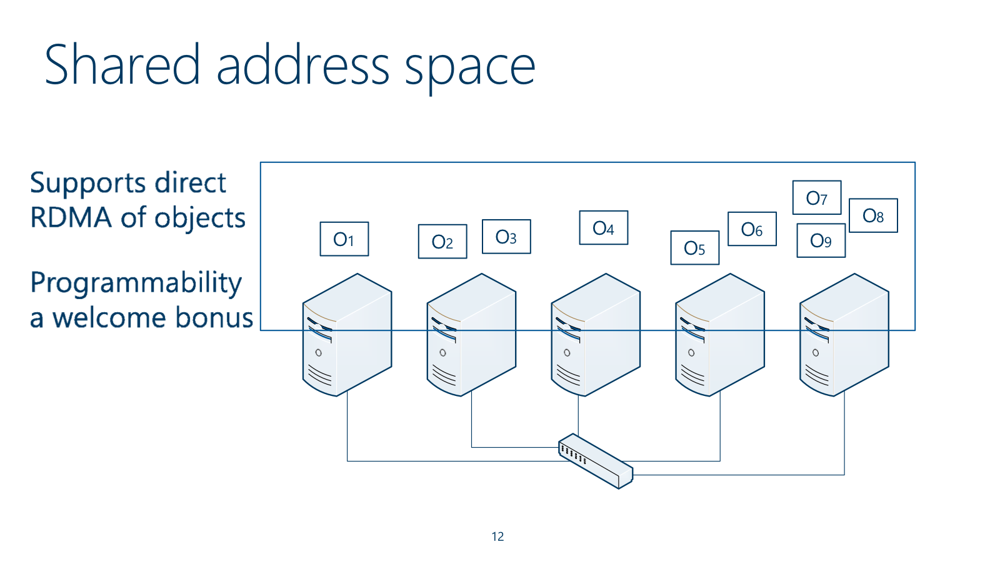
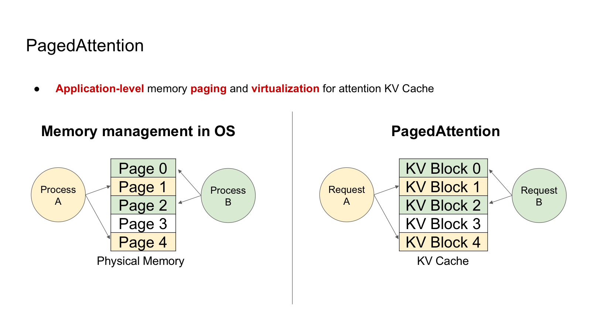
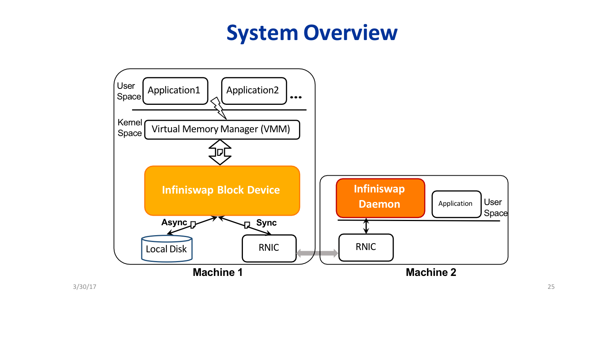
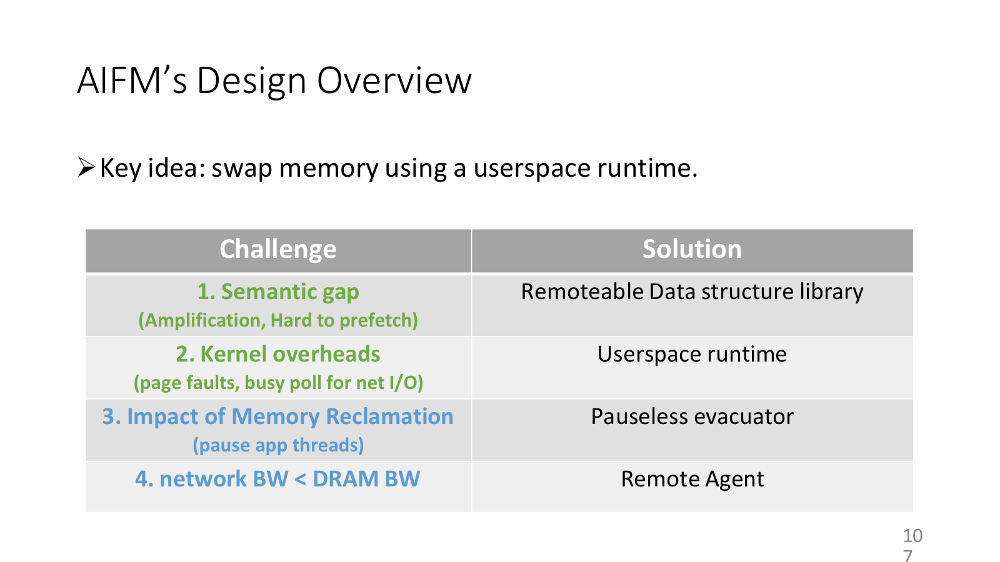
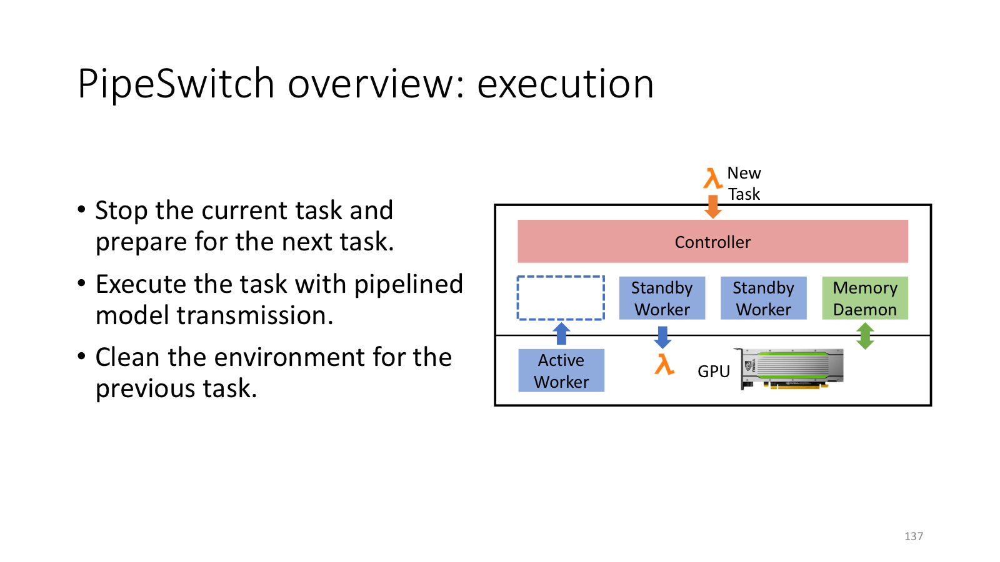
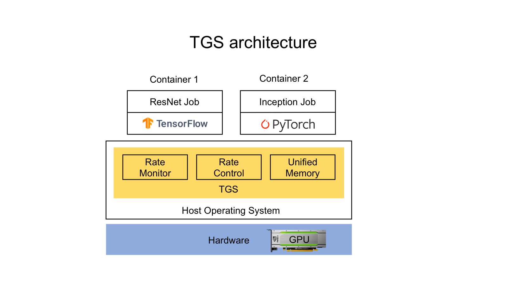

## 内存虚拟化的扩展

传统虚拟内存把磁盘伪装成比 DRAM 更大的地址空间。本讲里的系统反复复用这个思想，但目标资源变了：

| 抽象 | 被映射的东西 | 真实资源 |
| --- | --- | --- |
| OS virtual memory | virtual page | physical frame / disk |
| PagedAttention | logical KV block | physical KV block |
| InfiniSwap | local swap block/slab | remote DRAM |
| AIFM | application object | local memory / far memory |
| TGS | GPU virtual memory | GPU memory / host memory |

这种抽象的好处是统一、弹性和更高利用率；代价是额外 indirection、调度复杂度、故障处理和隔离问题。

## FaRM



FaRM 的关键抽象是把多机内存组织成 shared address space，而不是只暴露 RPC。

FaRM 的背景是数据中心硬件趋势：单机 DRAM 变大，网络延迟降低，RDMA 让 NIC 可以直接读写远端内存，绕过远端 CPU 和大量 kernel 路径。

传统分布式系统把每台机器看成独立节点，跨机器访问通常走 message 或 RPC。FaRM 则试图给程序一个更对称的 shared address space，让远程对象访问更像内存访问。

机制上，FaRM 先用 RDMA read/write 访问远端内存对象，再通过 transactions 以及 lock/validate/update/unlock 这套流程处理并发和一致性。它还需要 locality awareness，把经常一起访问的数据尽量放近，减少远程访问次数。

因此 FaRM 的正确表述不是“用了 RDMA 所以快”，而是：RDMA 提供低延迟 data plane，但系统仍要在上层处理 consistency、transactions、failure 和 locality。硬件把远程读写变便宜了，系统设计并没有因此消失。

## PagedAttention



PagedAttention 把 KV cache 管成类似虚拟内存的 logical/physical block 映射。

LLM inference 的瓶颈不只是计算，还包括 KV cache 管理。自回归生成每产生一个 token，都要保存历史 token 的 key/value states。KV cache 的长度随请求动态增长，batch 中每个 request 长度不同，parallel sampling 和 beam search 又会产生共享 prefix。

旧系统常按请求最大长度预分配连续显存，这方便 kernel 访问，却会造成严重内外碎片。课件给出的关键数字是：只有约 20%-40% 的 KV cache space 真正存放 token states。

PagedAttention 的做法很像虚拟内存：

| OS VM | PagedAttention |
| --- | --- |
| virtual page | logical KV block |
| physical frame | physical KV block |
| page table | block table |
| demand allocation | 按需分配 KV block |
| shared page / COW | shared prefix / copy-on-write KV block |

访问时，attention kernel 通过 block table 读取不连续的 physical KV blocks。新 token 到来时，只需要按需分配新的 block。多个 request 共享 prompt prefix 时，block table 可以指向同一批 physical blocks；真正分叉时再 copy-on-write。

关键取舍在 block size。block 越小，碎片越少，但 block table 和 kernel 访问 overhead 越高；block 越大，管理更简单，但最后一个 block 的 internal fragmentation 更高。课件给出的经验是 block size 16 通常表现较好。PagedAttention 会带来约 10%-15% kernel slowdown，但因为显存效率提升，整体 serving throughput 反而显著提高。

KV block 不够时，vLLM 可以 preempt 请求。恢复方式有两类：`swap` 把 KV cache 换到 CPU/host memory，再换回来；`recompute` 丢弃 KV cache，恢复时重新计算。对 prompt KV 来说，recompute 有时很快，因为可并行重算；小块 swap 则可能受传输开销影响。

## InfiniSwap



这张架构图把 block device、daemon、RDMA remote memory 和本地备份磁盘放在同一条路径里。

InfiniSwap 观察到生产集群里 allocated memory 和 used memory 常有差距。单机可能 OOM 或开始磁盘 swap，但同一集群其他机器还有空闲 DRAM。它的目标是把远端空闲 DRAM 变成本机透明 swap backend。

系统接入点在 OS paging 路径：

```text
Application
  -> OS VMM
  -> Infiniswap Block Device
  -> RDMA remote memory
  -> local disk async backup
```

`Infiniswap Block Device` 在 kernel space 中把远程内存包装成 block device/swap device；`Infiniswap Daemon` 在 user space 管理本机愿意贡献的 memory region；RDMA one-sided read/write 负责 data plane；本地磁盘异步备份用于 fault tolerance。

为了可扩展，InfiniSwap 采用 many-to-many 管理。一台机器可以借多台远端机器的内存，也可以把自己的空闲内存提供给多台机器。直接按 page 管理会产生巨大元数据和 RTT 开销，所以它用更粗粒度的 memory slab。

选择远端机器时，InfiniSwap 不依赖 central controller，而采用 `power of two choices`：随机挑两个候选 daemon，选择更空的一台。这种去中心化策略能在低协调成本下平衡 memory utilization。

它的优点是透明、不改硬件、不改应用，性能明显好于磁盘 swap。局限也来自同一个选择：OS paging 粒度较粗，不懂对象语义；容错、隔离、本地备份磁盘瓶颈仍要处理。

## AIFM



这张图适合看 AIFM 把 library、runtime、evacuator 和 remote agent 分别放在哪一层。

AIFM 同样利用 far memory，但它对 OS paging 型远程内存系统更挑剔。它最在意的是两件事：一是 `semantic gap`，也就是 OS 只知道 page，不知道应用对象和数据结构；二是 `kernel overheads`，因为 page fault、kernel I/O、busy polling 这些路径本身就不便宜。

例如应用只查一个 hash table item，OS paging 可能换入整个 page，造成 read/write amplification；OS 也不知道接下来应该 prefetch 哪些对象。这些浪费不是 RDMA 能直接解决的，它来自抽象层次太低。

AIFM 的折中是牺牲完全透明性，换取应用语义和用户态控制。它要求程序使用 remoteable data structures，如 `RemHashTable`、`RemArray`、`RemList`。runtime 因而能看到对象边界和数据结构语义，做更合适的 prefetch/cache。

围绕这个目标，AIFM 提供 `Remoteable Data Structure Library`，把对象访问暴露给 runtime；`Userspace Runtime` 避免频繁进入 kernel fault 路径，等待远端对象时可以让用户态线程 yield；`Pauseless Evacuator` 在本地内存紧张时把对象迁移到 far memory，尽量不暂停应用线程；`Remote Agent` 则在远端 server 上执行轻量操作，减少把远端数据搬回本地的带宽浪费。

和 InfiniSwap 对比，AIFM 不透明，但粒度更贴近应用对象；InfiniSwap 部署更容易，但受 page 粒度和 kernel 路径限制。

## PipeSwitch



PipeSwitch 把当前任务停止、下一任务准备、流水化模型传输和旧任务清理放进同一条切换路径里。

深度学习负载通常分为 training 和 inference。Training 追求 high throughput，inference 追求 low latency/SLO。传统上把两类任务放在不同 GPU 集群里，结果是整体利用率不高。理想状态是共享 GPU，但 DL context switch 原本很慢，课件例子中 NVIDIA T4 上从 Train BERT 切到 Infer ResNet 可达约 6s。

PipeSwitch 的目标是 fine-grained time-sharing 多个 DL apps，并把 context switching latency 压到 millisecond-scale。

它的核心观察是 DL model 有 layer structure。朴素切换要先通过 PCIe 传完整模型到 GPU，再执行；PipeSwitch 把 model transmission 和 GPU execution 流水化：

```text
传输 layer/group 0
执行 layer/group 0，同时传输 layer/group 1
执行 layer/group 1，同时传输 layer/group 2
...
```

粒度太细会导致大量 PCIe calls 和同步开销，所以 PipeSwitch 使用 layer grouping。最优 grouping 搜索空间很大，论文使用 heuristic pruning。

此外，PipeSwitch 用 Memory Daemon 统一管理 model parameters 和 GPU allocation，并用 active-standby worker switching 把 task cleaning、initialization 和 execution 尽量重叠。`Init.1` 这类与具体任务无关的准备可提前做；`Init.2` 这类和任务相关的 GPU memory allocation 靠近执行时做。

因此 PipeSwitch 的一句话是：利用模型层次结构和流水线，把“传模型”和“跑模型”重叠起来，再用统一内存管理和 standby worker 隐藏切换杂项开销。

## TGS



这张图先看位置：TGS 插在 containers 和 host GPU 之间。

TGS 关注 container clouds 中的 DL training jobs。生产环境 GPU 利用率常很低，原因之一是 GPU 被静态分配给单个 container。已有方案各有短板：AntMan 要改 TensorFlow/PyTorch，不够透明；NVIDIA MPS 不支持 GPU memory oversubscription，隔离弱；NVIDIA MIG 隔离好但分割不灵活、硬件依赖强。

TGS 先把任务分成两种角色：`production job` 不能有性能损失，`opportunistic job` 则是低优先级任务，用来吃掉 spare GPU resources。这个划分决定了后面的策略不是平均共享，而是尽量保护 production，再把剩余资源让给 opportunistic。

架构上，TGS 位于 containers 与 host OS/GPU 之间，包含 `Rate Monitor`、`Rate Control` 和 `Unified Memory`。

Compute sharing 使用 adaptive rate control。TGS 不只看 GPU kernel queue，因为队列状态不一定反映真实剩余资源；它监控 production job 的实际执行速率。如果 production 变慢，就降低 opportunistic kernels 的发射速率；如果 production 没受影响，就把剩余 compute 给 opportunistic。

Memory sharing 使用 CUDA unified memory。多个训练任务总显存需求超过 GPU memory 时，TGS 可以改变 virtual memory mapping，把 opportunistic job 的 GPU memory evict 到 host memory。这样 production job 被保护，opportunistic job 承担主要性能损失。

TGS 的设计目标是四个同时成立：transparency、high GPU utilization、performance isolation、fault isolation。它把 GPU sharing 从应用框架层下沉到 OS/容器附近，但仍借助 CUDA unified memory 这样的底层机制。

## 系统层次对比

这讲最值得记住的不是每篇论文的数字，而是层次选择：

| 维度 | 更透明的一侧 | 更懂语义的一侧 |
| --- | --- | --- |
| Remote memory | InfiniSwap：OS/block device，不改应用 | AIFM：userspace runtime + data structures |
| KV cache | 传统连续预分配：kernel 简单 | PagedAttention：block table + COW，管理复杂但省显存 |
| GPU sharing | MPS/MIG：系统或硬件支持 | AntMan/TGS/PipeSwitch：更贴近 DL workload 行为 |

动态增长、碎片、共享 prefix、换出、远端资源和低利用率，都可以重新表述为 paging、indirection 或 virtualization 问题。
