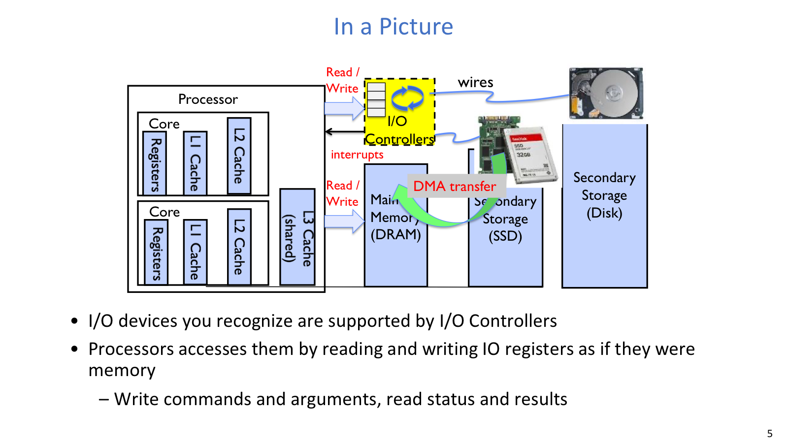
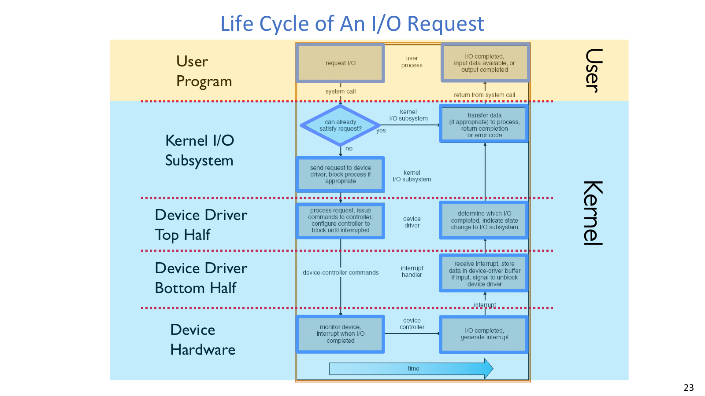
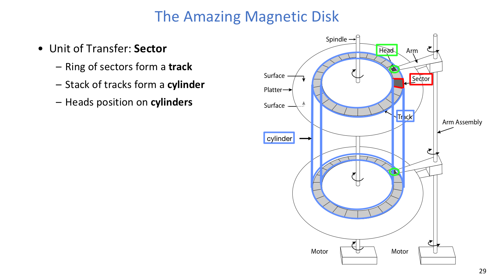
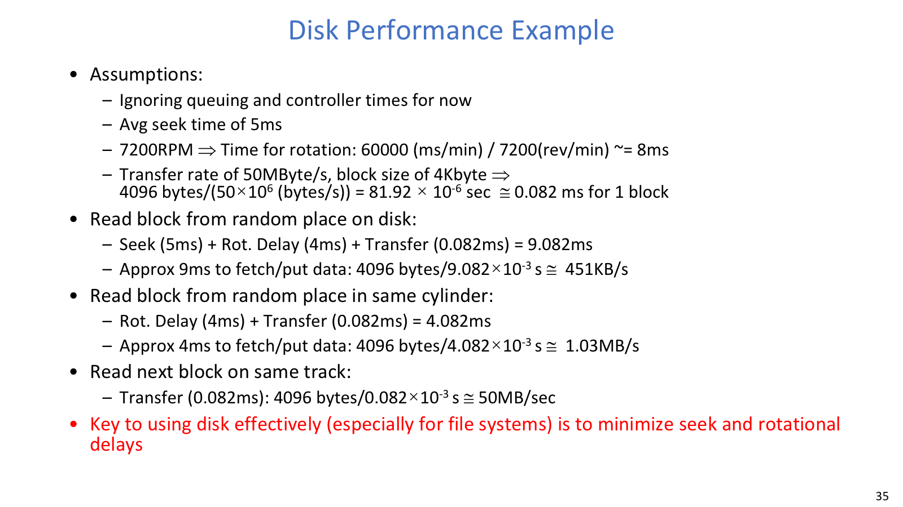
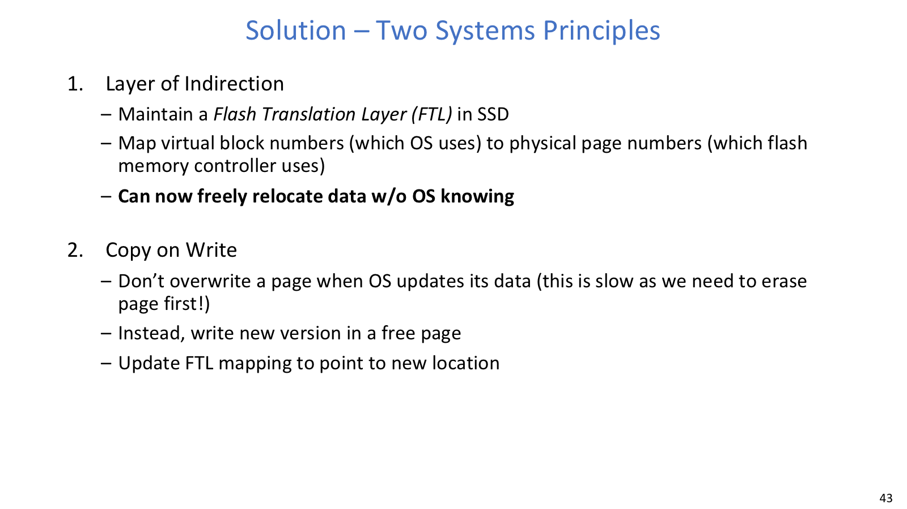

## I/O 接口与传输

### I/O Subsystem

I/O 设备在速度、数据粒度和访问模式上差异很大。速度可以从极慢输入设备跨到高速网络/存储；数据粒度可能是 byte、block 或 packet；访问模式可能是 sequential、random，也可能只支持特定顺序。设备还会失败，完成时间也未必可预测，因此内核需要在统一接口与设备特性之间完成翻译。

OS 的目标是给用户提供稳定接口，同时在快设备上不产生过高 per-byte overhead，在慢设备上不让 CPU 白等。

### Bus / PCIe

`bus` 是硬件设备之间通信的一组 wires 加 protocol。它包含 control lines、address lines、data lines，还需要仲裁、寻址和握手协议。好处是多个设备可以共享一套连接；代价是同一时刻通常只有一个 transaction，其他设备必须等待。

传统 `PCI` 是 parallel bus，多设备共享地址/数据线。`PCI Express` 名字仍叫 bus，但更像一组 fast serial lanes：设备可按需要使用多个 lane，慢设备不必和快设备强行共享同一条并行总线。底层 interconnect 从 PCI 变为 PCIe 后，上层设备 API 仍可保持稳定。

CPU 通常不直接理解设备细节，而是和 `device controller` 交互。controller 提供 control/status/data registers 或 request queues；CPU 访问这些寄存器时，可以走 `Port-mapped I/O`，也就是使用专门的 `in/out` 指令，例如 x86 的 `out 0x21, AL`；也可以走 `Memory-mapped I/O (MMIO)`，把设备寄存器映射到物理地址空间，再用普通 `load/store` 访问。

MMIO 不是“真的内存”。写这些地址会触发设备行为，所以必须由内核控制映射和权限。

### PIO 与 DMA



`Programmed I/O (PIO)` 中，每个 byte/word 都经由 CPU 的 `in/out` 或 `load/store` 搬运。它硬件简单、编程直接，但 CPU cycles 消耗和数据量成正比，大块 I/O 很亏。

`Direct Memory Access (DMA)` 则让 controller 直接在设备和 main memory 之间搬数据。OS/driver 负责告诉 controller 内存地址、长度、方向和命令；数据搬运完成后，controller 设置状态并通知 OS。

DMA 的标准流程可以写成：

```text
CPU/driver:
  写 command + memory address + length + direction
  启动 DMA

Controller:
  直接在 device 和 main memory 之间搬 block
  完成或出错后更新 status

OS:
  通过 interrupt 或 polling 得知完成
  检查 status，唤醒等待线程
```

DMA 免去了 CPU 逐字节搬运数据的工作。CPU 仍要配置 controller、处理完成事件，并保证内存一致性和权限安全。

### Interrupt / Polling

OS 需要知道 I/O operation 何时完成、是否出错。`Interrupt` 让设备主动打断 CPU，适合不可预测、低频事件；缺点是 interrupt overhead 高。`Polling` 让 OS 定期读取 status register，单次检查开销低，适合高频或短时间内连续事件；但事件稀疏时会浪费 CPU cycles。

实际系统常混用。高速网卡可能对第一个 packet 发 interrupt 唤醒内核，随后内核 poll hardware queue，直到 queue 清空。这样既避免长期空转，又能在 burst 中减少 interrupt 次数。

| 场景 | 更合适的方式 | 原因 |
| --- | --- | --- |
| 键盘输入、偶发 I/O 完成 | interrupt | 事件稀疏，polling 浪费 |
| 高速网卡连续收包 | interrupt + polling | 第一个事件唤醒，后续批量处理 |
| 设备很快且马上完成 | polling | 等 interrupt 可能更贵 |
| 高频完成队列 | polling 或混合 | 降低 interrupt storm |

### Device Driver



`device driver` 是内核中直接和设备硬件交互的 device-specific code。它向 kernel I/O subsystem 提供标准内部接口，所以同一个 OS 可以面对不同硬件。

一次请求的生命周期通常是：

```text
User program
  -> syscall
  -> kernel I/O subsystem
  -> driver top half
  -> controller registers / DMA setup
  -> device hardware
  -> interrupt / polling
  -> driver bottom half
  -> wake up user thread
```

`Top half` 在系统调用路径中运行，处理 `open()`、`close()`、`read()`、`write()`、`ioctl()` 等，发起 I/O，并在需要时让线程 sleep。`Bottom half` 在 interrupt routine 或 deferred handler 中运行，处理完成事件、继续输出下一块、唤醒等待 I/O 的线程。

`ioctl()` 用于设备特有配置，但不能替代通用 read/write 接口。OS 仍需要 block device、character device、network device 等标准接口来隐藏设备差异。

### Timing 接口

I/O timing 对用户程序有三种常见表现。`Blocking` 接口让调用者等待，直到数据 ready 或设备 ready；`Non-blocking` 接口会立即返回，告诉用户完成了多少，也可能只是说明暂时没有数据；`Asynchronous` 接口同样立即返回，但之后由 kernel 完成传输并通知用户。

这三类接口的差异在于等待发生在哪里：用户线程、用户事件循环，还是 kernel 后台路径。调用 `read()` 时，也要根据等待位置选择合适的接口模式。

## 存储设备

### HDD





HDD 的基本结构包括 sector、track、cylinder、head/arm。一次读写通常先付 `seek time`，让磁头移动到正确 track/cylinder；接着付 `rotational latency`，等待目标 sector 转到磁头下；最后才是 `transfer time`，也就是 sector 经过磁头并被传输的时间。

总延迟常写成：

```text
Disk latency = queueing time + controller time + seek time + rotational latency + transfer time
```

如果模型忽略 queueing/controller，就只算后三项。RPM 转换为旋转时间的公式是：

```text
one rotation time = 60000 ms / RPM
average rotational latency = one rotation time / 2
transfer time = block size / transfer rate
```

例如 7200 RPM 的一圈约 `60000 / 7200 = 8.33 ms`，平均 rotational latency 约 `4.17 ms`。如果 seek time 是 5 ms，4KB block 在 50MB/s 下 transfer 只约 0.08 ms。随机读慢的主因不是 transfer，而是 seek + rotation。

HDD controller 还会隐藏很多复杂性：ECC 修复小错误，sector sparing 把坏扇区透明映射到备用扇区，slip sparing 尽量保留顺序性，track skewing 让换 track 后不必等一整圈。

### SSD



SSD 没有 seek 和 rotational delay，随机读可以很快。问题在写入：NAND flash 通常只能写空 page，erase 的单位是更大的 block，而且 erase 很慢、次数有限。

OS 看到的仍常是类似 HDD 的 4KB block interface，但 SSD 内部不能对小 page 原地覆盖。它的解决办法可以概括成两条系统原则：`Layer of Indirection` 让 `Flash Translation Layer (FTL)` 把 OS 的 logical/virtual block number 映射到 flash physical page；`Copy on Write` 则让更新写到新的 free physical page，再更新 mapping，并把旧 page 标为 invalid。

后台 `garbage collection (GC)` 会回收 invalid pages 所在的 erase block；`wear leveling` 把写入分散到不同 blocks，避免热点块过早磨损。

SSD 读取没有机械延迟，写入却受 erase-before-write 和有限擦写寿命约束。
