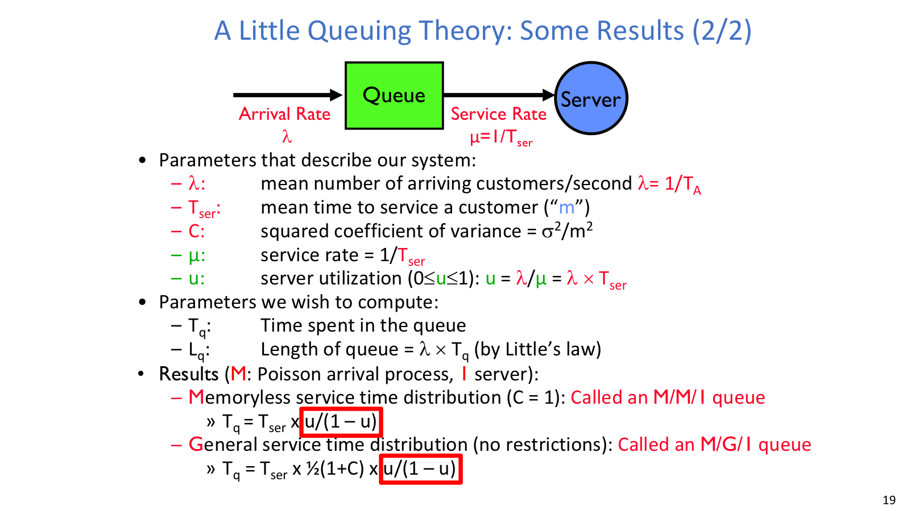
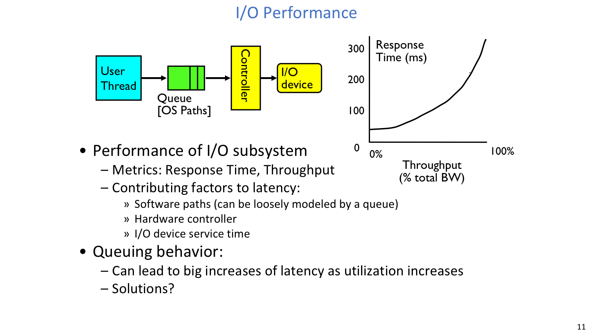
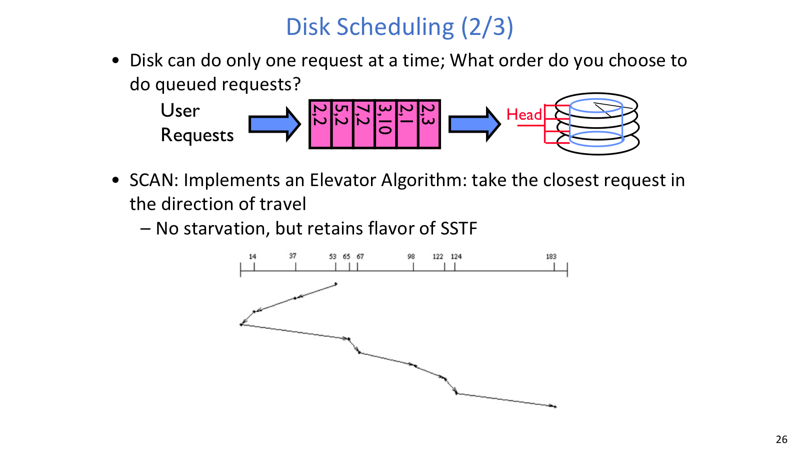
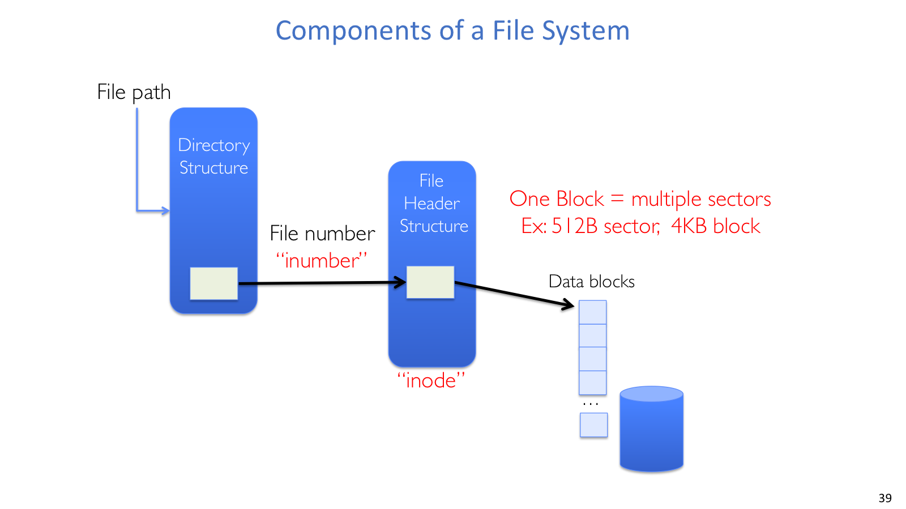
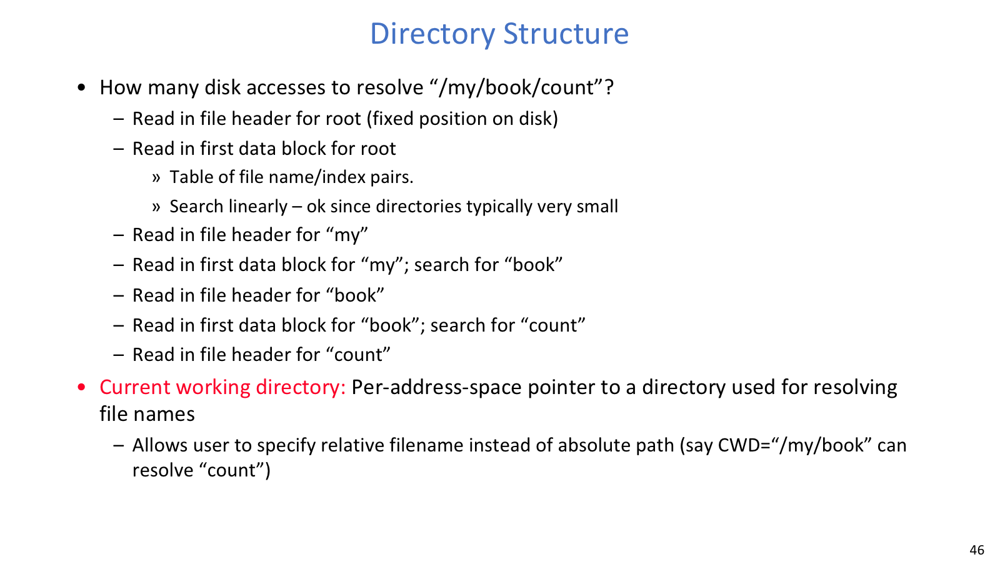

## I/O 性能

### 基本指标

`Response time/latency` 是完成一次 operation 需要多久；`bandwidth/throughput` 是单位时间完成多少 operation 或传多少数据。不同系统使用不同单位：operations 用 `op/s`，文件和存储用 `MB/s`，网络常用 `Mb/s`，计算用 `GFLOP/s`。

I/O subsystem 的 latency 主要来自 software path、hardware controller 和 I/O device service time。software path 往往可以近似看成 queue；controller 负责把请求翻译成设备动作；真正落到设备上时，还要付出 service time。

吞吐接近满载不代表延迟低。利用率升高时，请求越来越可能遇到前面的请求，queueing delay 会非线性增长。尤其在 utilization 接近 1 时，服务时间本身可能没变，但排队时间会迅速主导响应时间。

### Bursty Workload

在简单 deterministic world 中，请求按固定间隔到达，service time 固定。如果两次请求之间有足够空隙，queue delay 很小。

现实 I/O 更常是 bursty world：平均 arrival rate 可能不高，但请求集中到达时，大多数请求都会排队。Burst 会增加 latency；队列中积累的请求也给 reorder、batch、piggyback 留出了空间，可以提高设备效率。

### Queueing Theory



指数分布常用来建模随机 interarrival time：

```text
f(x) = lambda * e^(-lambda x)
mean interval = 1 / lambda
```

它的重要性质是 `memoryless`：已经等了多久不影响还要等多久。这只是模型近似，不代表所有真实设备都 memoryless。

常用符号如下：

| 符号 | 含义 |
| --- | --- |
| `lambda` | arrival rate，平均每秒到达请求数 |
| `TA` | average interarrival time，`lambda = 1 / TA` |
| `Tser` | mean service time |
| `mu` | service rate，`mu = 1 / Tser` |
| `u` | utilization，`u = lambda / mu = lambda * Tser` |
| `C` | squared coefficient of variance |
| `Tq` | average time in queue |
| `Lq` | average queue length |
| `Tsys` | average response time，`Tsys = Tq + Tser` |

在单 server、长期 steady state、queue 无上限、arrival memoryless 的假设下：

```text
M/M/1: Tq = Tser * u / (1 - u)

M/G/1: Tq = Tser * 1/2 * (1 + C) * u / (1 - u)

Little's law: Lq = lambda * Tq
```

如果 `u >= 1`，系统不稳定，不能套用 steady-state 下的有界队列结果。

一个典型计算流程是：先统一单位，算 `u = lambda * Tser`，再按给定的服务时间分布选 M/M/1 或 M/G/1，最后用 `Tsys = Tq + Tser` 得到总响应时间。常见错误是把 `Tq` 当成总时间，或者把 `u` 写成 `lambda / Tser`。

### I/O 优化



改善 I/O 性能前应先定位瓶颈。`Speed` 是直接让软件路径、controller 或设备 service 更快；`Parallelism` 是增加独立 bus、controller、disk 或 queue；`Overlap` 则是在等待 I/O 时做其他有用工作。瓶颈明确后，应优先提升对应的 service rate。

Queue 本身也可以被利用：它能 absorb bursts，也给 reorder、batching、piggyback 留出空间。另一方面，`Admission control` 会限制进入系统的请求数，用有限 queue 控制 delay。它能避免 queue 无限增长，但也会引入公平性问题；如果控制不好，低优先级请求可能长期进不来，或者系统在高压下出现 livelock 风险。

### Disk Scheduling



磁盘一次只能处理一个 request，队列里有多个 request 时必须选择服务顺序。策略需要权衡 head movement、starvation、rotation 和 workload pattern。

| 算法 | 规则 | 优点 | 代价 |
| --- | --- | --- | --- |
| FIFO | 按到达顺序服务 | 公平、简单 | 可能来回 seek 很远 |
| SSTF | 选离当前 head 最近的请求 | 通常减少 seek | 远处请求可能 starvation |
| SCAN | 沿当前方向服务，像电梯一样到头再反向 | 避免 starvation，保留局部性 | 中间 cylinder 可能更占便宜 |
| C-SCAN | 只朝一个方向服务，回程跳过请求 | 比 SCAN 更均衡 | 回程不服务，可能多移动 |

画 disk scheduling 题时，先标当前 head position 和 pending requests。FIFO 直接按到达顺序；SSTF 每步选最近；SCAN/C-SCAN 必须写清扫描方向。在真实系统里，“shortest seek”还常要考虑 rotational delay，因为 rotation 可能和 seek 一样重要。

### I/O 共性

Network I/O 是 packets，disk I/O 是 blocks，但 queueing、batching、overlap、kernel overhead 的原则相通。云系统里 storage 常通过 datacenter network 访问，因此 network stack 也会影响 storage performance。

优化方向包括更好的分布式抽象、优化 kernel TCP/IP stack、kernel bypass/user-space network stack，以及 NIC offload，例如 RDMA、SmartNIC、DPU。

## 文件系统

### 抽象

底层硬件提供 block interface：HDD 通过 sector/LBA 访问，SSD 内部有 FTL，但 OS 仍常看到 block-like interface。File system 的工作是把 block array 转换成用户理解的 files、directories、names、protection、reliability 和 free space management。

用户眼中的 file 是 durable data structure；UNIX system call view 中 file 是 collection of bytes；OS internal view 中 file 是 collection of blocks。小范围读写也必须转化为 block I/O。比如读 bytes 2-12 时，内核要读入所在 block，再返回对应 byte range；写 bytes 2-12 时，也通常要先读入 block，修改相关部分，再把 block 写回。

block 是 logical transfer unit，sector 是 physical transfer unit；UNIX block 常见大小是 4KB。

### 内部状态



文件系统至少要维护四类信息：哪些 blocks 属于哪个 file，directory 中哪些 name 对应哪些 file，哪些 disk blocks 是 free 的，以及这些 metadata 自己存在哪里。文件内容、索引路径和空闲空间状态都要持久保存。

典型组件链路是：

```text
file path
  -> directory structure
  -> file number / inumber
  -> file header / inode
  -> data blocks
```

`open()` 做 name resolution，把 pathname 翻译成 file number。`read()`/`write()` 后续主要使用 file number/inode 和 offset 找 data block，而不是重新依赖文件名。

### fd / inode

用户进程看到的是 `file descriptor`，例如 `open("foo.txt")` 返回 3。fd 是 per-process table 的 index，不是文件本身。

Kernel 中有 `open file description`，记录 inumber、current position、flags 等。更准确地说，它记的是 `inumber`，不是 pathname。因为文件名之后可能被 link、unlink 或 rename，但已经打开的文件仍应按原来的 file object 继续读写。

系统通常还维护 system-wide in-memory inode table。同一个文件被多次 open，in-memory inode 通常只保留一份，不同 open file descriptions 可以共享它。

### Directory



Directory 是 specialized file，内容是 `<file name, file number>` pairs。常见系统调用包括 `open`、`creat`、`readdir`、`mkdir`、`rmdir`、`link`、`unlink`。普通用户程序通常不应 raw write directory bytes，否则会破坏目录结构不变量。

解析 `/my/book/count` 的大致过程是：

1. 从 root inode 开始，root inode 在固定位置。
2. 读 root directory data block，搜索 `my`。
3. 得到 `my` 的 inumber，读 `my` inode。
4. 读 `my` directory block，搜索 `book`。
5. 得到 `book` 的 inumber，读 `book` inode。
6. 读 `book` directory block，搜索 `count`。
7. 得到 `count` 的 inumber，读最终 file inode。

Relative path 则从当前进程的 current working directory 开始解析。CWD 可以看成 per-address-space pointer。

### 文件大小

文件系统设计必须同时照顾小文件和大文件。经验观察是：大多数 files 很小，但大多数 bytes 属于 large files。这意味着小文件需要低 metadata overhead 和快速打开；大文件需要高吞吐 sequential access 和可扩展的索引结构。

文件系统还要在目录查找、inode 索引、free map、缓存、顺序性、可靠性和 crash consistency 之间取舍。
