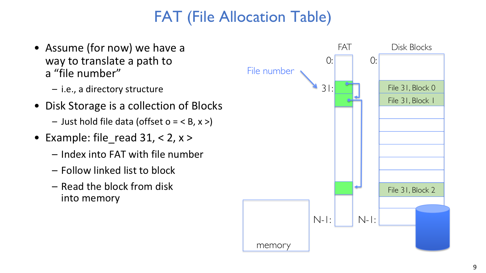
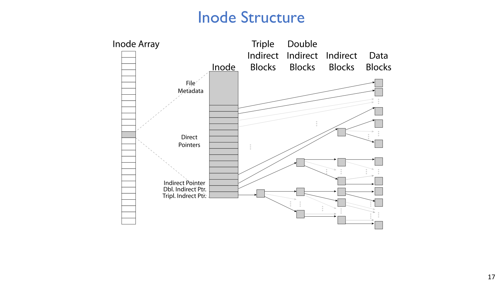
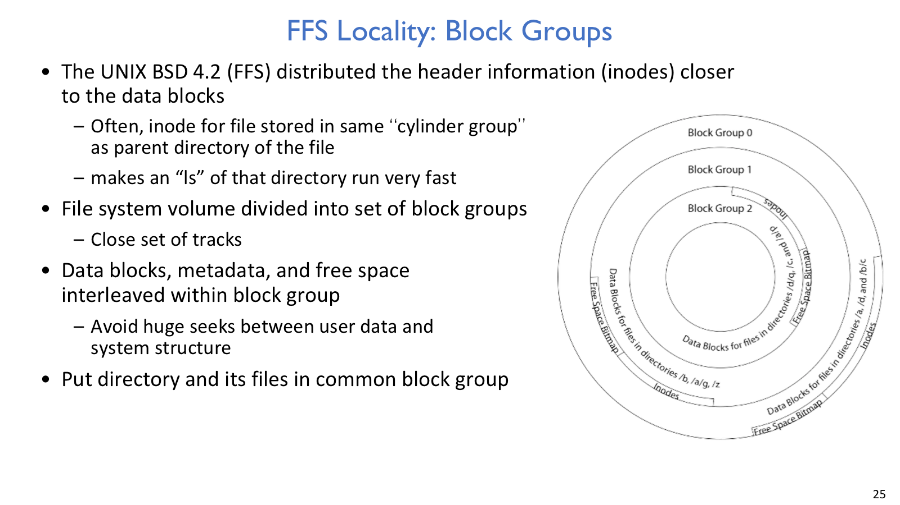
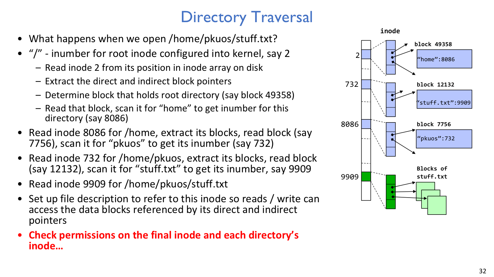
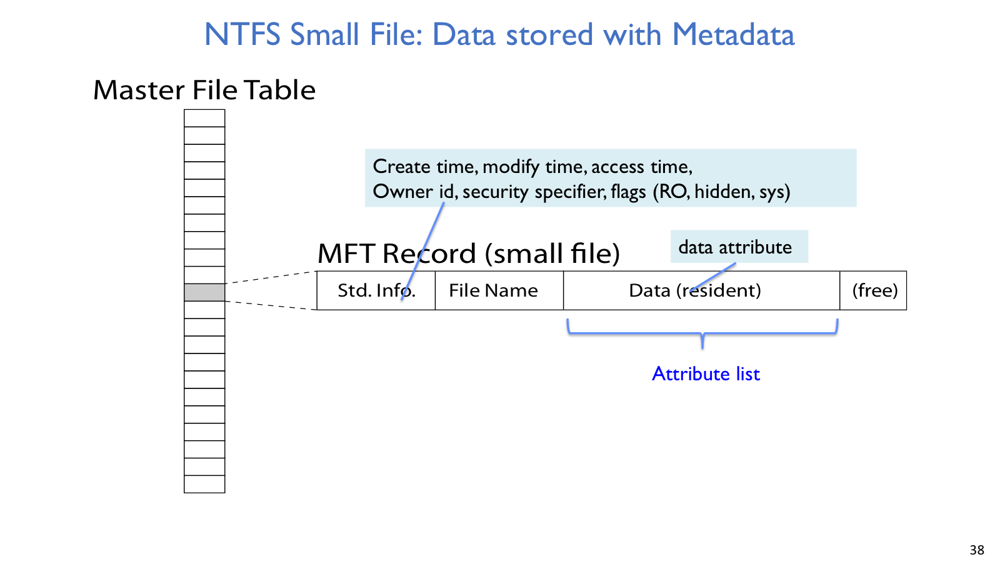

## FAT



FAT 的核心是从 file number 进入表，再沿链表追踪文件的 disk blocks。

### 问题

FAT 的设计从一个很朴素的模型开始：磁盘是一堆 fixed-size blocks，文件是一串 blocks，directory 能把文件名翻译成 file number。这个 file number 不是文件内容本身，而是 File Allocation Table 中链表头的 index。

读取 `file_read(31, <2, x>)` 时，系统先用 `31` 查 FAT，找到文件链表的起点，再沿 FAT entry 走到 logical block 2，对应的 disk block 被读入内存后，才返回 block 内 offset `x` 的字节。offset 可以拆成：

```text
offset = <logical block number, offset within block>
```

### 机制

FAT entry 本身很小，但语义很关键：它既可以指向下一个 block，也可以标记 end-of-file 或 free。格式化磁盘时，普通 format 可能清零数据块并把 FAT entries 标为 free；quick format 通常主要重置 FAT，因此旧数据块可能还在，只是文件系统不再认为它们可达。

directory 在 FAT 中也是一个文件，内容是 `<file_name, file_number>` mappings。FAT 的一个重要差异是：不少 file attributes 存在 directory entry 里，而不是跟独立 inode 绑定。root directory 位于磁盘上的约定位置；普通 directory 查找常是 linear search。

### 取舍

FAT 的顺序访问很自然，只要沿链表向后走即可；但随机访问第 `n` 个 logical block 时，系统仍要从链表头追 `n` 步，所以复杂度是 `O(n)`。block 不要求连续，这让分配简单、外部连续空间压力较小；反过来，文件内容也可能散落在磁盘各处，seek 成本会被放大。总的来说，FAT 适合结构简单和小规模场景，不适合大文件随机访问密集的 workload。

## Unix inode



inode 把文件 metadata 和 block index structure 收在一起，是 Unix 文件系统支持 hard link 与多级索引的基础。



FFS 把 inode、data 和 free space 分散到 block groups 中，用布局换局部性。

### 问题

FAT 把文件的 block mapping 放在全局表里，并用链表表达文件内容。Unix 文件系统换了一个抽象：`inumber` 是 inode array 的 index；inode 是文件的持久 metadata 和 block index structure。

这样做有两个直接好处。第一，metadata 跟文件对象绑定，而不是跟某个名字绑定。第二，多个 directory entries 可以指向同一个 inode，这就是 hard link 的基础。

### 机制

inode 中保存 permissions、owner、timestamps、size 以及指向 data blocks 的 pointers。权限常用 UGO x RWX 表示，即 owner/user、group、others 对 read/write/execute 的权限；`SetUID` 和 `SetGID` 让程序执行时使用文件 owner/group 的权限。

inode 的 block pointers 是一个不对称树：前面若干个 direct pointers 直接指向 data blocks，后面用 single、double、triple indirect pointers 扩展大文件容量。典型例子是 12 个 direct pointers、4KB block：

```text
12 * 4KB = 48KB
```

如果 pointer 是 4B，一个 4KB indirect block 能放：

```text
4096 / 4 = 1024 pointers
```

于是 single indirect 约 4MB，double indirect 约 4GB，triple indirect 约 4TB。这个结构的用意很清楚：小文件读 inode 后可以直接定位 data block；大文件虽然多一层索引开销，但能扩展到很大。

### 例子 / 推导

若一个 inode 有 10 个 direct pointers，block 是 1KB，一个 indirect block 能放 256 个 pointers，并假设 inode 已经在 open 时读入或 cache：

- logical block 5：走 direct pointer，只读 data block。
- logical block 23：进入 single indirect，读 indirect block 再读 data block。
- logical block 340：进入 double indirect，读 double indirect block、single indirect block、data block。

如果没有特别说明 inode 已在内存中，要额外把读取 inode 的一次 disk access 算进去。

## Berkeley FFS

### 问题

早期 Unix 把 inode/header 集中放在磁盘特定区域。这样小文件访问会在 inode 区和 data 区之间来回 seek；如果磁盘局部损坏集中命中 header 区，也会破坏大量文件的可恢复性。另一个现实问题是：创建文件时通常不知道最终大小，append 增长很常见，系统很难一开始就分配完美连续空间。

### 机制

Berkeley FFS 保留 inode 和多级索引结构，但改变布局策略。文件系统 volume 被分成多个 block groups，每个 group 内同时包含 data blocks、metadata、free bitmap 和 inode information。文件的 inode 尽量放在 parent directory 所在 group 附近，directory 和其中的 files 也尽量落在同一 group。

在这个布局之上，FFS 还做了几件经典优化。它把 block size 从 1024B 增大到 4096B，提高顺序吞吐；用 bitmap allocation 替代 free list，让 allocator 更容易寻找连续 free blocks；文件扩展时则优先在当前 group 中寻找 successive blocks。为了让这些策略长期有效，FFS 还会保留约 10% free space，给 contiguous placement 留出余地；面对 rotational delay，则可以用 skip-sector positioning 或 read ahead 缓解等待。

### 取舍

FFS 的优点是局部性强，小目录下的 inode、directory blocks 和 file data 更可能一起被读到，`ls` 和小文件访问更快；bitmap 和 block group 也降低 fragmentation。代价是 tiny file 仍可能需要 inode 加 data block，空间利用不如把小文件直接塞进 metadata 的设计；大文件若本来可以用少量 extents 表达，多级 pointer tree 也不如 extent 紧凑。

## Links



打开一个绝对路径时，系统要一级一级读取目录 inode 和目录内容。

### Hard link

hard link 是 directory 中 name 到 inode/file number 的 mapping。文件创建时，第一个名字就是第一个 hard link；`link()` 可以增加新的名字；`unlink()` 只是删除一个 name-to-inode mapping 并减少 link count。文件内容真正可回收通常需要两个条件：link count 变成 0，并且没有 open file description 仍引用它。

这解释了一个常见现象：删除原文件名不等于删除文件内容。名字只是入口，只要还有另一个 hard link 指向同一 inode，内容仍可访问。

### Symbolic link

symbolic link 自己也是一个文件，但它保存的是 destination path name，而不是目标 inode number。普通 directory entry 更像：

```text
<file name, file #>
```

symbolic link 更像：

```text
<file name, destination file name>
```

每次访问 symbolic link 时，OS 都要重新 lookup destination path。因此它可以跨文件系统，但如果目标被删除或移动，就会变成 dangling link。

### Path traversal

打开 `/home/pkuos/stuff.txt` 时，kernel 从固定 root inode number 开始，例如 inode 2。它读取 root inode，找到 root directory blocks，在目录内容中搜索 `home`，得到 `/home` 的 inumber；再读 `/home` 的 inode 和 directory block，搜索 `pkuos`；最后找到 `stuff.txt` 的 inode，建立 open file description。每一级目录和最终文件都涉及权限检查。

早期 directory 是 list/array of `<file_name, inode>` entries，大目录 linear search 很慢。FreeBSD、NetBSD、OpenBSD 等实现会用 B-tree 或 dirhash 一类结构优化大目录查找。

## NTFS



这页先看 file record 的内部布局。

### 机制

NTFS 的中心是 Master File Table。每个 MFT entry 大约 1KB，文件被描述为一组 `<attribute:value>` pairs：standard information、file name、data、security information 等都可以是 attribute。

小文件的 data 可以 resident in MFT，也就是直接放在 MFT entry 里；中等文件的 data attribute 可以保存 variable-length extents，例如 `<start block, size>`；大文件或高度碎片化文件可以让一个 MFT entry 指向更多 MFT records，保存更多 extent lists。

### 取舍

extent 对连续文件非常紧凑，比一个 block 一个 pointer 更省 metadata。resident small file 则避免了 inode 加 data block 的额外跳转。NTFS directory 使用 B-tree，file number 标识 MFT entry；同一个 MFT entry 可以有多个 file name attributes，因此也能表达 hard link。换句话说，NTFS 把“小文件直接放近一点”和“大文件用范围描述”放进了同一套 metadata 模型里。

## 文件系统布局对比

| 维度 | FAT | Unix inode / FFS | NTFS |
| --- | --- | --- | --- |
| block mapping | FAT linked list | direct + indirect pointer tree | variable-length extents |
| metadata 位置 | 很多 attributes 在 directory entry | inode | MFT attributes |
| random access | 沿链表追踪，差 | 多级索引，较好 | extent 对连续文件很紧凑 |
| small file | 结构简单 | inode + data block 可能浪费 | data 可 resident in MFT |
| locality | 弱 | block groups + bitmap | extent、MFT、B-tree directory |
| link 语义 | 受 directory entry 设计影响 | inode link count 支持 hard link | 多个 file name attributes 支持 hard link |
