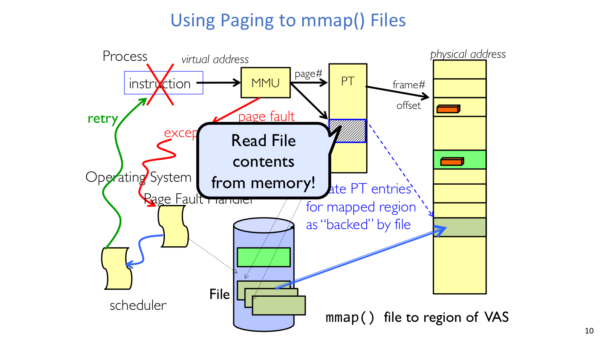
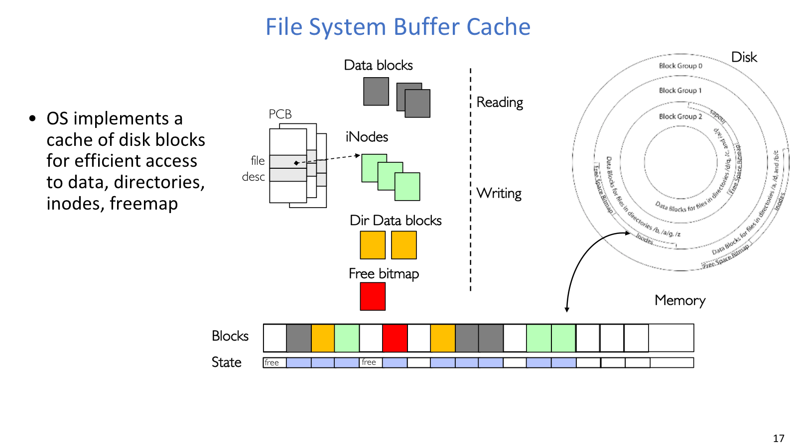
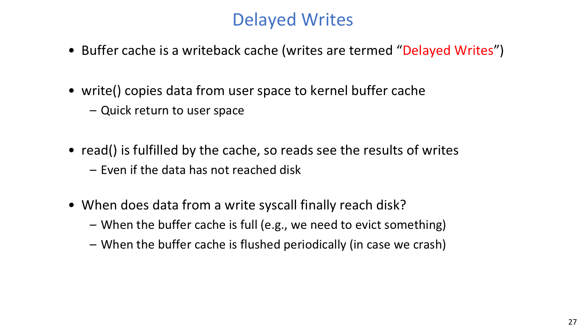
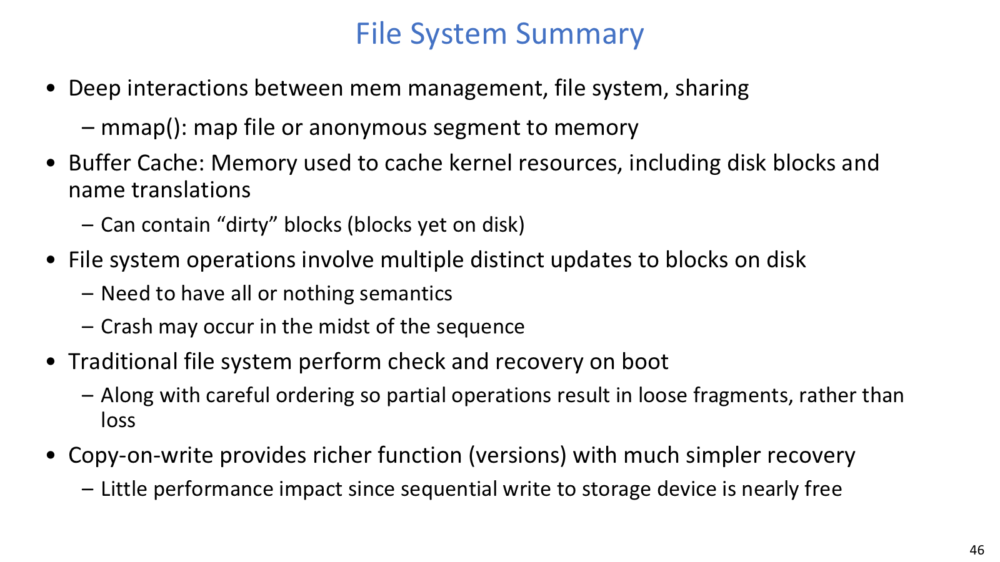
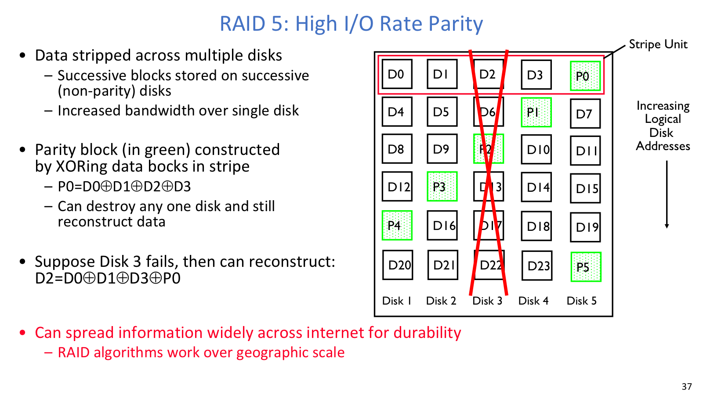

## mmap



`mmap()` 把文件页接入 page table，真正的数据读取由 page fault 触发。

### 问题

传统文件 I/O 通过 `read()` / `write()` 在用户 buffer 和 kernel/file buffer 之间显式 copy，每次调用都要跨系统调用边界。`mmap()` 的目标是把文件映射到进程虚拟地址空间的一段 region，让程序通过普通 load/store 访问文件内容。

这个接口之所以自然，是因为虚拟内存已经有一套成熟机制：page table、page fault、page replacement、dirty page。`mmap()` 做的事情，就是把文件系统变成这些机制的 backing store 之一。

### 机制

调用 `mmap()` 时，OS 不一定立刻读入整个文件。它可以先在 page table 中建立 file-backed PTE，标记这些虚拟页对应某个 file offset。进程第一次访问该地址时：

1. MMU 查 page table。
2. 如果页不在内存，触发 page fault。
3. page fault handler 根据 PTE 中的 file backing 信息，从文件读对应 page 到 frame。
4. OS 更新 PTE。
5. faulting instruction 被重试。

`MAP_SHARED` 和 `MAP_PRIVATE` 是理解行为的关键。`MAP_SHARED` 下，对映射区的写入最终会反映到 backing file 或被其他共享映射看到；`MAP_PRIVATE` 常配合 copy-on-write，修改不会直接覆盖原文件。

### 例子

课件中的代码先打开文件，再执行：

```c
mfile = mmap(0, 10000,
             PROT_READ | PROT_WRITE,
             MAP_FILE | MAP_SHARED,
             myfd, 0);
puts(mfile);
strcpy(mfile + 20, "Let's write over it");
```

`puts(mfile)` 看似只是读内存，实际可能触发 page fault，把文件页读进内存。`strcpy` 修改 mapped memory；因为 mapping 是 `MAP_SHARED` 且有 `PROT_WRITE`，这些 dirty file-backed pages 之后会写回文件。需要注意的是，`close(fd)` 不等于立刻 unmap，也不等于所有 dirty pages 已经落盘。

## Buffer cache



这张图把 buffer cache 放在内存和磁盘之间，方便看出 metadata 也会经过这层缓存。

### 问题

kernel 必须把 disk blocks 拷到 main memory 才能查看或修改它们。如果每次 `open()`、`read()`、`write()` 都同步访问磁盘，文件系统会被 seek、rotational delay 和设备吞吐限制拖慢。buffer cache 就是 OS 用来缓存文件系统 blocks 的软件 cache。

它缓存的不只是 file data blocks，也包括 directory blocks、inodes、free bitmap / freemap，以及 name translation 相关信息。也就是说，路径查找、metadata 更新和普通文件读写都会经过这层 cache。

### open / read / write

`open()` 常从 directory lookup 开始：读取目录 block，搜索 `<name, inumber>`，找到 inode，创建 file descriptor 和 open file description。目录 block 和 inode 都可以留在 cache 中，重复打开同一路径会快很多。

`read()` 从 fd 找到 open file description，再从 in-memory inode 走 index structure 找 data block。如果目标 data block 不在 cache，OS 从 disk load；随后从 kernel cache copy 用户需要的 bytes 到 user buffer。

`write()` 类似 read，但更容易牵扯多块 metadata：如果写超出当前文件大小，可能要 allocate new blocks，更新 free bitmap，更新 inode size/block pointers，修改 data block，并把相关 cache blocks 标成 dirty。

### Eviction and replacement

cache block 可能处于 free、being read、in use、dirty、being written 等 transitional states。clean block 可以直接丢弃；dirty block 必须先写回 disk。因为 OS 内部可能有指针指向 cache block，eviction 还要保证不能把正在使用的数据结构悄悄移走。

buffer cache 由 OS software 实现，不像 CPU cache/TLB 那样由硬件自动管理，所以 full LRU 的维护成本相对可接受。LRU 对很多 workload 有效，但 large file scan 会污染 cache，把只用一次的数据挤掉真正热的数据。实际系统会结合 read-ahead、use-once hint 或应用提示来避免这种问题。

## Prefetch / delayed write



`write()` 快速返回时，修改可能只是进入 kernel buffer cache，还没有写入 disk。

### Prefetching

文件访问常有顺序性，read ahead prefetching 会提前读取后续 blocks。这样做能减少应用等待，也让 disk scheduler 有更多请求可重排。风险是 prefetch 太多会抢占其他应用 I/O，太少又无法隐藏 seek 和 rotational delay。

### Delayed writes

buffer cache 是 writeback cache，因此文件系统写入常是 delayed writes。`write()` 返回时，数据通常只是从 user space copy 到 kernel buffer cache，并标记为 dirty。应用之后 `read()` 可以从 cache 读到刚写的数据，即使 disk 上仍是旧内容。

dirty blocks 真正落盘通常发生在三种时机：cache 满了，必须 evict dirty block；OS 周期性 flush，以缩短 crash 丢失窗口；或者应用显式调用 `fsync` / sync 类接口。这里需要注意的是，`write()` 的返回值只说明 kernel 接收了这次写入，并不等价于数据已经进入 stable storage。

性能收益很大：`write()` 可以快速返回；disk scheduler 能积累多个 writes，用 elevator algorithm 排序；delayed block allocation 也可能让连续写更容易分配到 contiguous blocks。短命文件甚至可能在被删除前从未真正写到 disk。

风险也同样清楚：crash 时 dirty data 或 dirty metadata 可能丢失。如果 directory entry、inode、free bitmap 的一部分写回了，另一部分没写回，文件系统可能出现不可达 inode、leaked blocks、错误大小或坏指针。

## 两套缓存

buffer cache 和 demand paging 都在“内存不够时缓存 backing store 内容”，但对象和风险不同。

| 维度 | Demand paging | Buffer cache |
| --- | --- | --- |
| 缓存对象 | virtual memory pages | disk blocks、inodes、directories、freemap |
| 替换策略 | full LRU 太贵，常用 Clock 近似 | full LRU 更可行 |
| dirty 处理 | dirty pages 写回 swap 或 file | dirty blocks 周期性写回 disk |
| 核心风险 | working set、page fault 频率 | crash 后 persistent state consistency |

两者还会争内存。太多内存给 file system cache，应用可用内存减少，可能增加 paging；太少内存给 cache，文件访问会频繁打到 disk。现代 OS 常动态调整两者边界，让 paging 和 file access 的 disk access rate 保持平衡。

## 可靠性词表



RAID 之后还需要文件系统层面的 careful ordering 或 copy-on-write。

这组三个词容易混，但它们关注的时间尺度不同。`Availability` 是系统现在能接受并处理请求的概率，常用几个 9 衡量；`Durability` 是 fault 后数据仍能保存或恢复的能力；`Reliability` 更强，强调系统在一段时间内正确执行功能，通常包含 availability、security、fault tolerance 和 durability。

一个关机但磁盘完好的系统可能 durable 但 not available；一个在线但返回错误数据的系统可能 available 但 not reliable。

## RAID / erasure code



RAID5 用 XOR parity 在容量、读带宽和单盘容错之间折中。

### RAID1

RAID 是 data storage virtualization：用多个 physical disks 构成一个 logical disk，并在 reliability、performance 和 capacity 之间折中。RAID1 mirroring 是最直接的做法，把每个 disk 完整复制到 shadow disk。它的 capacity overhead 是 100%，写入要写多个副本，但读取可以从任一副本读，也可以并行服务多个 read。disk failure 后，替换新盘并从 mirror copy 即可恢复。

### RAID5

RAID5 把数据条带化到多个 disks，并为每个 stripe 维护 parity block。parity 用 XOR：

```text
P0 = D0 xor D1 xor D2 xor D3
```

如果 `D2` 所在 disk 丢失，可以重构：

```text
D2 = D0 xor D1 xor D3 xor P0
```

RAID5 比 RAID1 容量效率更高，也能提升读带宽，但只能容忍一个 disk failure。到了大盘时代，rebuild 时间会变得很长；在重建窗口里，如果第二块盘再坏，整个 array 就会进入危险状态。

### RAID6 and erasure coding

RAID 可以看作 erasure code：系统知道哪些 disks 坏了，就把缺失 disk 当作 erasure。RAID6 能在一个 stripe 中容忍 2 块盘失败。更一般的 Reed-Solomon codes 可描述为：

```text
m data fragments
generate n - m extra fragments
tolerate n - m failures
```

erasure coding 也可用于跨地域复制：durability 高，因为很难同时毁掉所有 fragments；read availability 也高，因为只需读到足够多 fragments；但 write availability 和 consistency 会变难，尤其当写入要求多个副本同步确认时。

## RAID 的边界

RAID 能抵抗 disk media failure，却不能保证文件系统永远处在一致状态。原因在于，power failure 或 software crash 可能发生在一个 logical file operation 中间，而这个 operation 可能涉及 inode、indirect block、data block、free bitmap、directory block 等多块物理 blocks。

本讲最后给出两个大方向：

| 方法 | 代表 | 思路 |
| --- | --- | --- |
| Careful ordering and recovery | FAT、FFS + `fsck` | 按安全顺序写，crash 后扫描并清理 |
| Versioning and copy-on-write | ZFS | 不覆盖旧版本，写新结构，最后切换版本入口 |

careful ordering 的直觉是先构造数据和 metadata，最后再把 pointer 或 directory entry link 到 namespace。COW 的直觉则是旧版本在新版本 ready 之前不被破坏。这两个方向会在下一讲展开成 transactions、journaling 和 distributed decision making。
