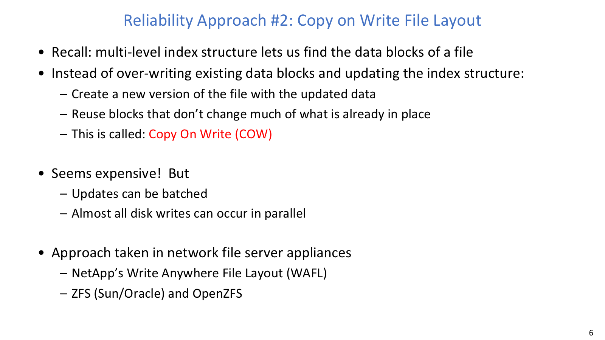
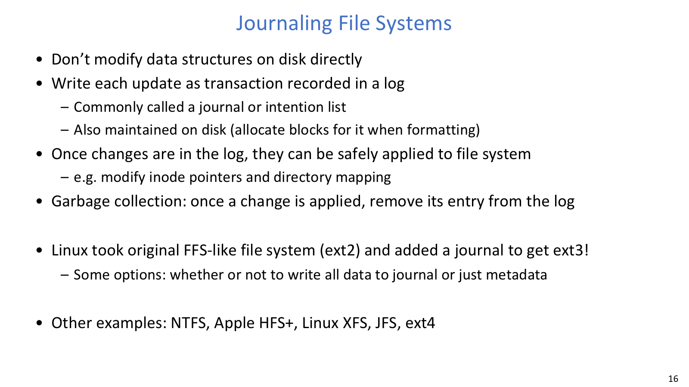
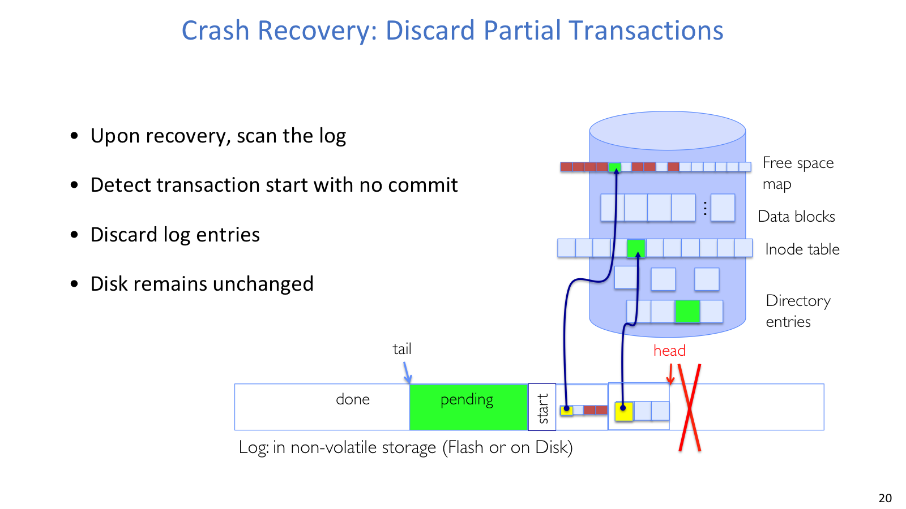
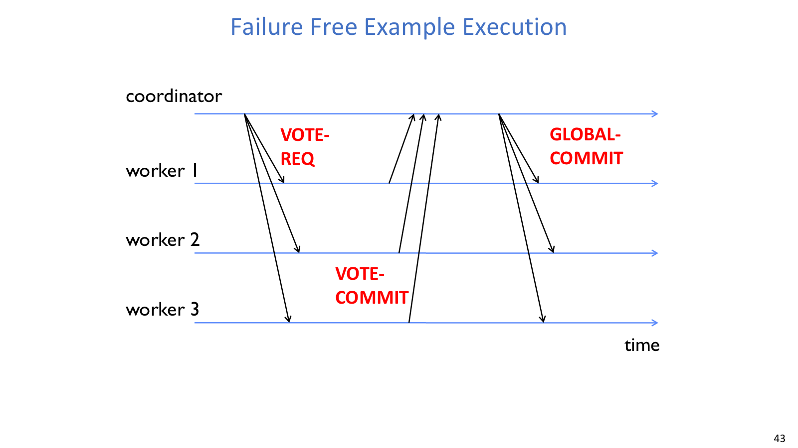
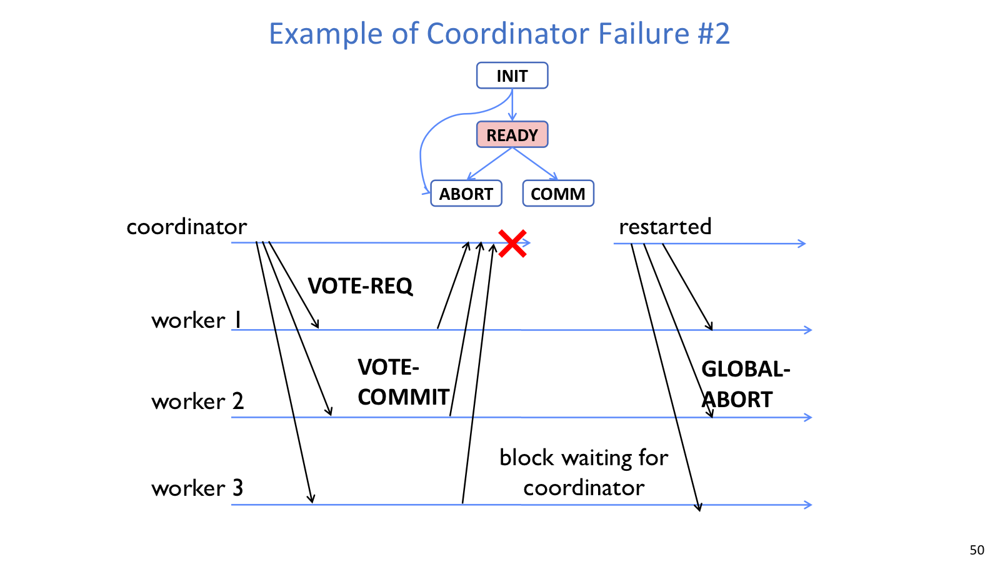

## Ordering

### 问题

文件系统创建一个文件可能要做很多块更新：allocate data block、write data block、allocate inode、write inode block、update bitmap、update directory、update directory modify time。crash 可以发生在任意一步，因此恢复机制必须能够识别、清理或完成磁盘上残留的中间状态。

一个经典判断题是：如果要保存一块 data 和一个指向它的 directory entry / pointer，且每次写都是 atomic，应该先写 data 还是 pointer？

答案是先写 data，再写 pointer。先写 pointer 后 crash，namespace 已经暴露了一个可能还没写好的 block，用户会看到垃圾内容。先写 data 后 crash，最多留下 unreachable data block，recovery 可以通过扫描清理。

### 机制

careful ordering 把多块更新排成安全顺序，让每个中间状态都更容易恢复。FFS + `fsck` 的恢复大致是一次全局整理：先 scan inode table，寻找 unlinked files；对无法从 directory 到达的 inode，删除或放入 `lost+found`；再比较 free block bitmap 和 inode trees，并扫描 directories，修复缺失或不一致的 metadata。

它的代价也明显：`fsck` 时间常与 disk size 成正比，大磁盘会让全盘扫描非常慢。

## COW / ZFS



### 问题

careful ordering 仍然会原地修改旧结构，所以 recovery 需要理解很多中间状态。Copy-on-write 不覆盖 existing data blocks 或 index structure，旧版本在新版本完成前一直保持完整。

### 机制

如果文件用 tree of blocks 表示，更新某个 leaf 时，只需要重写从 changed leaf 到 root 的路径，也就是 leading fringe。未改变的 subtree 继续共享旧 blocks。最后一步切换 root pointer 或 version pointer，新版本才变成可见版本。

ZFS/OpenZFS 是代表系统。它使用 variable sized blocks，范围从 512B 到 128KB；pointer 中保存 version number；free space 用 extents tree 表示；多个 writes 可以先 buffer，再一起创建新版本。COW 的成本是写放大和 metadata 更新变多，但顺序写、batching 和共享未变 blocks 可以缓解这部分开销。

## Transactions

### 问题

transaction 是 atomic sequence of reads and writes，把系统从一个 consistent state 带到另一个 consistent state。它和 critical section 的关系很近：critical section 让内存中共享数据结构的更新看起来 atomic；transaction 把这种 atomic update 扩展到 stable storage。

典型结构是：

```text
BEGIN transaction
  do updates
  if failure/conflict -> rollback
COMMIT transaction
```

`begin` 分配 transaction id；`rollback` 撤销失败路径；`commit` 声明这一组更新应该持久生效。

### Log 的基本思想

log 利用一个更小的 atomic action：append/write 一个 log item。只要 log 中出现 durable commit record，recovery 就知道这组更新必须生效；如果只有 start 和 update records，没有 commit record，就不能把它视为成功。这样一来，判断 transaction 是否完成就不必重新理解所有文件系统结构，只需要看 log 中有没有越过 commit 这条线。

log 中常见记录包括：

- start transaction record
- update records
- commit transaction record

commit record 是 recovery 的分界线。

## Journaling





### 机制

journaling file system 不直接把每个 metadata 修改写到最终位置，而是先把 update 作为 transaction 记入 journal，也叫 intention list。journal 本身在 non-volatile storage 上。只有 journal 中的 transaction 安全后，文件系统才把修改 apply 到真实结构，例如 inode pointers、directory mapping、free map。

创建文件时，非日志化路径可能是：

```text
find free data blocks
find free inode entry
find directory entry insertion point
write free map
write inode entry
write directory entry
```

任意一步 crash 都可能留下 map、inode、directory 不一致。日志化路径则先写 log：

```text
[log] write map update
[log] write inode update
[log] write dirent update
[log] write commit record
eventually replay/apply to real file system structures
```

recovery 时扫描 log：

```text
if transaction has START but no COMMIT:
    discard log entries
if transaction has START and COMMIT:
    redo/apply transaction
```

### 取舍

journaling 的好处是多个 physical operations 被当作一个 logical unit，crash 后要么全部出现，要么全部不出现。成本是写放大：如果 data 也 journal，可能要写两次，一次写 log，一次写目标位置。因此现代文件系统常只 journal metadata，file contents 直接写到目标位置。

log-structured filesystem 和 journaled filesystem 不同。前者的数据最终就留在 log-style layout 中；后者仍有普通文件系统布局，journal 主要服务 recovery。

## Distributed systems

### 为什么分布式

分布式系统把多台 physically separate computers 组合起来完成任务。便宜机器可以横向扩展，节点故障后可由其他机器接手，多处存储也能提高 durability。

更多机器和网络依赖也可能降低 availability；任一节点 crash 都可能影响 shared state，攻击面也随之扩大。单机内由 lock 或 test-and-set 解决的问题，跨机器后会变成 message protocol 和 durable decision 问题。

`transparency` 是把复杂性藏在简单接口后面。常见目标包括 location transparency、migration transparency、replication transparency、concurrency transparency、parallelism transparency 和 fault tolerance transparency。

### Protocol

protocol 是通信约定，至少包括两层含义：`syntax` 规定消息格式、发送和接收顺序；`semantics` 规定消息含义，以及收到消息或 timer expires 时该做什么。

协议常被画成 state machine 或 message transaction diagram。分布式节点没有 shared memory，常用 abstraction 是 `Send(message, mbox)` 和 `Receive(buffer, mbox)`。receiver 不会收到半条 message，但 message 可能延迟、丢失，节点也可能 crash。

## Consensus

consensus problem 要求所有 nodes propose a value，一些 nodes 可能 crash and stop responding，最终所有 remaining nodes decide 同一个 proposed value。在存储系统里，这个 value 常是 `commit` 或 `abort`。

Two Generals' Paradox 说明：在不可靠网络上，两个将军无法通过可能丢失的 messenger 保证“同时行动且双方都确定对方也确定”。即使消息最终都到了，也无法确认最后一个 ack 是否到达。因此分布式协议不能依赖 perfect simultaneity，而要记录可恢复的 durable decision。

## 2PC





### 问题

2PC 不解决 Two Generals 的 simultaneous action。它解决 distributed transaction 中多个机器最终一致 commit 或 abort 的问题。角色是 one coordinator 和 N workers / participants。commit 条件是 unanimous approval：只有所有 workers 都 vote commit，global decision 才能是 commit。

每台机器都需要 stable log。crash recovery 时，节点先读 log，恢复 crash 前已经做出的 promise：自己是否 vote commit、是否已看到 global decision。没有这份 durable state，节点重启后就无法知道自己还能不能单方面 abort。

### Prepare phase

1. coordinator 发送 `VOTE-REQ` 给所有 workers。
2. worker 判断自己是否 ready。
3. 若 ready，worker 写 stable log，记录 prepared / vote commit，然后发送 `VOTE-COMMIT`。
4. 若 not ready，worker 写 abort log，发送 `VOTE-ABORT`，并立即 abort。
5. coordinator 如果收到任一 abort 或 timeout，就选择 global abort。

### Commit phase

如果 coordinator 收到所有 N 个 `VOTE-COMMIT`：

1. coordinator 写 `COMMIT` 到本地 stable log。
2. coordinator 广播 `GLOBAL-COMMIT`。
3. workers 收到后 commit，写 log，回复 ACK。
4. coordinator 收齐 ACK 后记录完成。

如果有 abort：

1. coordinator 写 `ABORT`。
2. coordinator 广播 `GLOBAL-ABORT`。
3. workers abort 并记录。

高层伪代码可以写成：

```text
Coordinator:
  send VOTE-REQ to all workers
  if receive VOTE-COMMIT from all N:
      log GLOBAL-COMMIT
      send GLOBAL-COMMIT
  else:
      log GLOBAL-ABORT
      send GLOBAL-ABORT

Worker:
  wait for VOTE-REQ
  if ready:
      log VOTE-COMMIT / READY
      send VOTE-COMMIT
      wait for GLOBAL-*
  else:
      log VOTE-ABORT
      send VOTE-ABORT
      abort
```

### State machines and failures

coordinator 的主要状态是 `INIT`、`WAIT`、`ABORT`、`COMMIT`。在 `WAIT` 中收到任何 `VOTE-ABORT` 或 timeout，就 global abort；收到所有 `VOTE-COMMIT`，才 global commit。

worker 的主要状态是 `INIT`、`READY`、`ABORT`、`COMMIT`。在 `INIT` 中还没有承诺，可以 timeout abort；在 `READY` 中已经写 log 并 vote commit，不能自行 abort，因为 coordinator 可能已经决定 commit，只是消息还没送达。

恢复规则如下：

| 节点 | log/state | 恢复动作 |
| --- | --- | --- |
| Coordinator | INIT / WAIT / ABORT | abort |
| Coordinator | COMMIT | commit |
| Worker | INIT / ABORT | abort |
| Worker | COMMIT | commit |
| Worker | READY | ask coordinator |

2PC 的核心缺点就是 blocking。典型场景是：worker B 写了 prepared to commit 并发送 yes vote，随后 B crash；coordinator A 也 crash。B 恢复后看到自己已经 vote yes，不能自行 abort，因为 A 可能已经写了 commit。B 必须等待 A 恢复或询问到 global decision，期间可能持有 locks 或 pinned pages。
