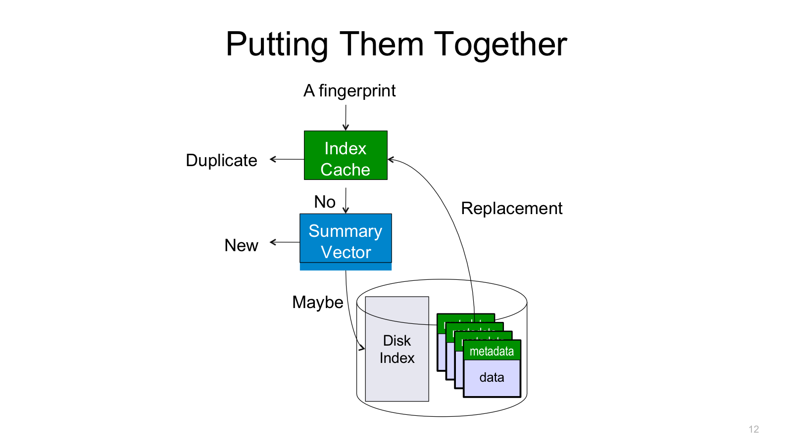
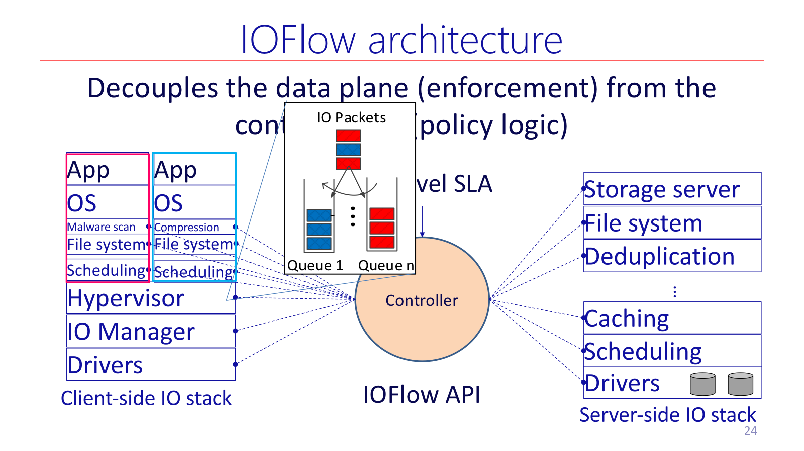
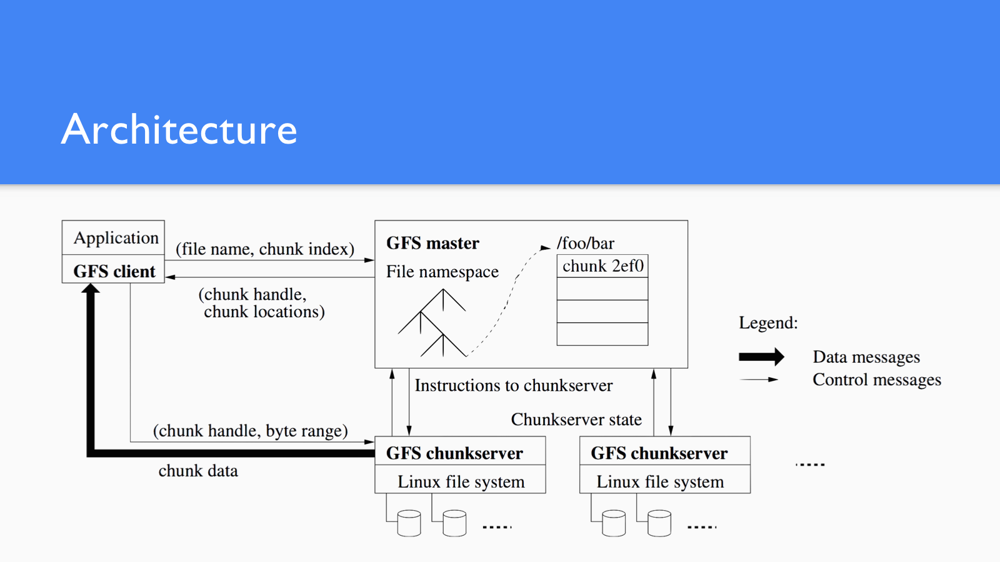
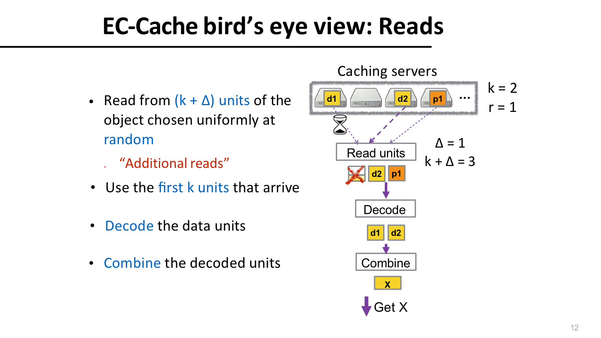
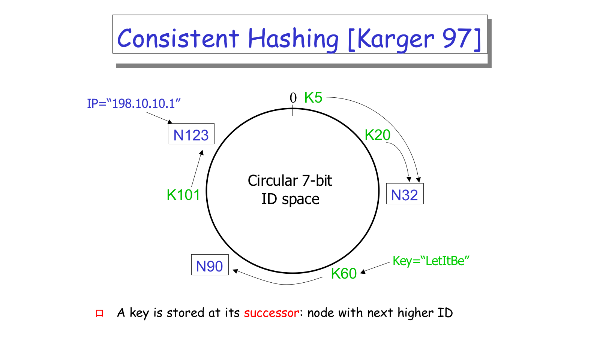

## Data Domain



Data Domain 的三件套共同目标是减少 fingerprint lookup 的磁盘访问。

### 问题

Deduplication 是一种 global compression。普通 gzip/zip 一类 local compression 通常只在一个文件的小 sliding window 内找重复，课件给的量级大约是 `2-3x` 压缩；deduplication 跨很多文件和备份流找重复 segment，备份场景中可能达到 `10-50x`。

典型 workload 是 backup storage。第一次 full backup 之后，incremental backup 和下一次 full backup 会包含大量旧数据。系统把输入 data stream 切成 segments，计算 fingerprint，再查全局 fingerprint index：见过的 segment 不再写 data，只记录引用；没见过的 segment 才写入 container。

朴素方案会被 index 打爆。课件给了一个关键数量级：

```text
80TB / 8KB segments * 20B fingerprint = 200GB index
```

如果每个 fingerprint lookup 都随机读磁盘，dedup 的吞吐会被磁盘 I/O 限死。

### 机制

Data Domain 的三个技术都服务于同一个目标：避免 fingerprint index 成为 disk bottleneck。

`Summary Vector` 是 RAM 中的 Bloom-filter-style 近似结构，用很少内存判断 segment 是否肯定没见过。如果 summary vector 说 `no`，这个 segment 一定是新数据，可以跳过磁盘 index lookup；如果说 `maybe`，才继续查更精确的 cache 或 disk index。它有 false positive，所以不能把 `maybe` 当成 duplicate。

`Stream-Informed Segment Layout` 利用 duplicate locality。同一个 backup stream 中相邻 segments 往往未来也会一起出现，因此系统把相邻 segments 放入同一批 containers，并把 data 与 metadata/index data 一起组织，让未来重复流访问时更局部。

`Locality Preserved Caching (LPC)` 不随机缓存单个 fingerprint。Disk Index 保存所有 `<fingerprint, containerID>`；Index Cache 只缓存部分映射。cache miss 时，系统查 disk index 找到 containerID，然后把整个 container 的 metadata 载入 cache。因为 layout 保留了 duplicate locality，后续 fingerprints 很可能命中同一 container metadata。

### 取舍

Summary Vector 的 false positive 会带来额外 lookup，但不影响正确性；stream locality 对备份 workload 很有效，但假设未来重复流与历史流有相近顺序；LPC 牺牲一点缓存粒度，换取成批加载带来的局部性。

## IOFlow



IOFlow 用 controller 管 policy，用 data-plane queues 执行 enforcement。

### 问题

企业数据中心里，应用跑在多个 VMs 上，VM-to-VM traffic 和 VM-to-storage traffic 走不同网络，storage stack 又跨 SMB、hypervisor、block layer、storage server 等很多层。用户想要的是 SLA，例如某租户获得 bandwidth `B`，某类 I/O 有更高 priority，或某些 I/O 绕过 malware scanner。

传统路径难点在于：各层独立配置，缺少统一 storage control plane；不同层看到的对象名字也不同，高层 SLA 很难变成路径上每个 enforcement point 的动作。

### 机制

IOFlow 的思路类似 storage 版 SDN：

- control plane：centralized controller，负责 policy logic 和 SLA enforcement 决策。
- data plane：路径上的 programmable queues，负责 classification、servicing、routing。
- IOFlow API：连接 controller 和 queues。

Storage flow 定义为：

```text
<{VMs}, {File Operations}, {Files}, {Shares}>  ---> SLA
```

它不是单个 TCP connection，而是所有满足某个 SLA 的 storage requests。IOFlow API 的三个动作是：

| API 动作 | 形式 | 作用 |
| --- | --- | --- |
| Classification | `IO Header -> Queue` | 把 I/O 请求分到对应 queue |
| Queue servicing | `Queue -> <token rate, priority, queue size>` | 控制速率、优先级和排队 |
| Routing | `Queue -> Next-hop` | 决定下一跳路径 |

Flow name resolution 是 IOFlow 的核心细节。一个 SLA 可能写成 `<VM4, *, *, \\share\dataset> -> Bandwidth B`，但 VM 层、SMB client、hypervisor、block layer、storage server 看到的名字都不同。controller 必须把高层 flow 翻译成每层能识别的 IO Header 和 queue rule。

只看 bytes 或 IOPS 并不足以做好限流。8KB read 和 8KB write 的设备成本可能不同；8KB write 和 64KB read 都是一条 I/O，但成本也不同；RAM、SSD、disk 的 cost model 更不一样。IOFlow 因此用 empirical cost model，把 token bucket 限在“成本”上，而不是只限 payload bytes。这样 policy 才能贴近真实设备瓶颈。

### 取舍

centralized controller 有全局视角，能做 max-min fair sharing，让 aggregate SLA 在多个 VMs 之间 work-conserving 地动态分配。代价是 controller 要收集 demand、下发规则，并控制 data-plane queue 数和排队次数，避免 overhead 把收益吃掉。

## GFS



GFS 的 single master 管 metadata，clients 直接访问 chunkservers 传输数据。

### 问题

GFS 的假设不是 POSIX 小文件 workload，而是 Google 早期数据处理场景：

- 节点频繁失败。
- 文件巨大，常见 multi-GB。
- 大多数修改是 append 到文件末尾，random overwrite 很少。
- 高 sustained bandwidth 比 low latency 更重要。
- 多个 clients 可能并发 append 到同一个文件。

这些假设解释了 single master、64MB chunk、record append、lease 等设计。换句话说，GFS 从一开始就不是为了让每个小操作最低延迟，而是为了让大规模顺序数据处理在故障常态下继续跑。

### 架构

GFS 提供 `create`、`delete`、`open`、`close`、`read`、`write`，还提供 `snapshot` 和 `record append`。它的核心架构是 single master + chunkservers。master 管 namespace、ACL、file-to-chunk mapping、chunk locations、chunk leases、garbage collection 和 load balancing；chunkservers 把 chunks 存成 local Linux files。

最重要的原则是 control flow 和 data flow 解耦：

1. Client 向 master 请求 metadata，例如 chunk handle 和 replica locations。
2. Client 直接和 chunkservers 读写 file data。
3. Master 不在 data path 上，因此 single master 不应成为正常数据吞吐瓶颈。

Master 的 operation log 是 metadata 的唯一持久记录，也定义并发 metadata operations 的 serialized order。master crash 后 replay log 恢复状态；为了减少启动时间，会周期性 checkpoint。

### Chunks and leases

GFS chunk 是固定大小，默认 64MB，每个 chunk 有 immutable、globally unique 的 64-bit chunk handle，默认复制 3 份。大 chunk 的优点是减少 client-master 交互、降低 master metadata 量、便于 persistent TCP connection；缺点是 internal fragmentation，小文件可能只有少数 chunks，容易 hot spot。

写入时，master 不给每次 write 排序，而是给某个 replica 授予 chunk lease，使其成为 primary。流程是：

1. Client 问 master：chunk replicas 在哪里，谁是 primary。
2. 如无有效 lease，master 选择一个 replica 授予 lease，并增加 chunk version number。
3. Client 把 data push 到所有 replicas，不一定先给 primary。
4. replicas ack 收到 data 后，client 把 write request 发给 primary。
5. primary 决定 modifications 的 serialization order，并本地 apply。
6. primary 把 write request 和 order 转发给 secondaries。
7. secondaries 按同一顺序 apply，回复 primary。
8. primary 回复 client success 或 error。

如果 primary 成功但某些 secondaries 失败，就可能出现 inconsistent replica state，client 可重试。lease 过期机制避免两个 primary 同时排序同一 chunk。

## EC-Cache



EC-Cache 读取 `k+Delta` 个 units，只等待最先返回的 `k` 个。

### 问题

Data-intensive clusters 依赖 distributed in-memory caching；从内存读通常比从 disk/SSD 快很多。Alluxio/Tachyon 这类系统的问题是 imbalance 很常见：object popularity skew、background network imbalance、failures/unavailabilities 都会让某些 cache servers 过载，带来 high read latency 和 tail latency。

传统方案是 selective replication：热门对象多放几份副本。它直观有效，但 memory overhead 只能整数倍增长，热点预测不总准确，对 tail latency 的控制也有限。

### 机制

EC-Cache 把对象 split 成 `k` 个 data units，再 encode 生成 `r` 个 parity units。只要拿到任意 `k` 个 units，就能 decode 原对象：

```text
k data units + r parity units = k+r units
any k out of k+r units can reconstruct the object
```

写路径：

1. object split into `k` data units。
2. encode 生成 `r` parity units。
3. 把 `k+r` 个 units cache 到不同 servers。

读路径：

1. client 从 `k + Delta` 个 units 发起读取。
2. 使用最先返回的 `k` 个 units。
3. decode 得到 data units。
4. combine 得到原对象。

`Delta=1` 很重要。没有 additional reads 时，object splitting 的 parallel reads 可能降低 median latency，但 straggler 会拉高 tail latency；多读一个 unit 后，慢节点不一定拖住整个 request。

### 取舍

EC-Cache 使用 erasure coding 的目的不是传统 storage 的 space-efficient fault tolerance，而是 caching layer 的 load balancing 和 read latency。within-object coding 让 data 和 parity 都能参与分散负载；backend caching servers 不需要知道 EC，逻辑主要在 client library 中。代价是 encode/decode overhead 和额外 read bandwidth。

## Chord



Chord 把 key 和 node 都映射到环上，key 由顺时针 successor 负责。

### 问题

Chord 解决的是 P2P 系统的 lookup：

```text
Lookup(key) -> IP address
```

Chord 本身不存数据，它提供 peer-to-peer hash lookup service。中心化方案如 Napster lookup 简单，但 server 需要 `O(M)` state，且是 single point of failure。naive flooding 没有中心点，但 worst-case 是 `O(N)` messages per lookup。

### 机制

Chord 使用 `m-bit identifier space`，把 key 和 node 都 hash 到同一个环：

```text
key identifier = SHA-1(key)
node identifier = SHA-1(IP address)
```

consistent hashing 的规则是：

```text
A key is stored at its successor:
the node with the next higher ID on the identifier circle.
```

如果每个节点知道所有其他节点，lookup 可以 `O(1)`，但每个节点要 `O(N)` state。basic lookup 让每个节点只知道 successor，state 很小，但 lookup 可能沿环走 `O(N)` hops。

Finger table 是核心优化。每个 node 维护指数距离的 fingers：

```text
finger i points to successor of n + 2^i
```

查找时每一步尽量向目标 key 前进一大段，因此 lookup 是 `O(log N)` messages，state per node 也是 `O(log N)`。

### Membership

node join 的标准三步是：

1. initialize all fingers of new node。
2. update fingers of existing nodes。
3. transfer keys from successor to new node。

更 lazy 的做法是先初始化 successor，然后周期性检查 successor/predecessor，周期性 refresh finger table entries。Chord 的假设是没有 malicious participants；membership 变化很频繁时，routing table maintenance 是持续成本。

## 系统方案对比

| 系统 | 面对的瓶颈 | 朴素方案的问题 | 核心机制 | 代价 / 限制 |
| --- | --- | --- | --- | --- |
| Data Domain Dedup | huge fingerprint index + disk bottleneck | 每个 fingerprint 都查磁盘 | summary vector、stream-informed layout、LPC | Bloom filter false positive；依赖 duplicate locality |
| IOFlow | 深 I/O path 下 SLA 难执行 | 各层独立配置，bytes/IOPS 不代表成本 | controller、IO Header、queues、cost model | 需要 name resolution 和规则下发 |
| GFS | 大文件分布式读写与频繁故障 | POSIX 小 block FS 不适合批处理 | single master、chunkservers、operation log、lease | master 是设计风险；小文件可能 hot spot |
| EC-Cache | cache load imbalance 和 tail latency | selective replication 粒度粗 | within-object EC、read `k+Delta` | 有编码开销和额外 reads |
| Chord | P2P key lookup 可扩展性 | 中心化单点；flooding `O(N)` | consistent hashing、successor、finger table | 需要维护 routing state，假设非恶意节点 |

## 控制平面、局部性与元数据

`Control plane vs data plane` 在 IOFlow 和 GFS 中最明显。IOFlow 的 controller 算 SLA policy，queues 执行；GFS 的 master 管 metadata 和 lease，clients 直接和 chunkservers 传输 data。Chord 没有集中控制平面，而是每个节点维护局部 routing state。

`Locality` 在不同系统中含义不同。Data Domain 利用 duplicate locality，把相邻重复 segments 的 metadata 放近；GFS 用大 chunk 和 persistent connection 利用大文件顺序访问；EC-Cache 则故意打散对象，用 any-k decode 把负载分散；Chord 的 locality 是 ID ring 上“顺时针更接近目标”。

`Metadata scale` 是每个系统都绕不开的主题。Data Domain 的 fingerprint index 太大，必须过滤和缓存；GFS 把 metadata 放 master 内存，所以 chunk 要大；Chord 控制每节点 routing metadata 为 `O(log N)`；IOFlow 则要把跨层名字解析成可执行的 IO Header。现代存储系统的设计重点已经从“单机上怎么放 block”扩展到了“在大规模系统里如何放置、查找、调度和恢复数据”。
