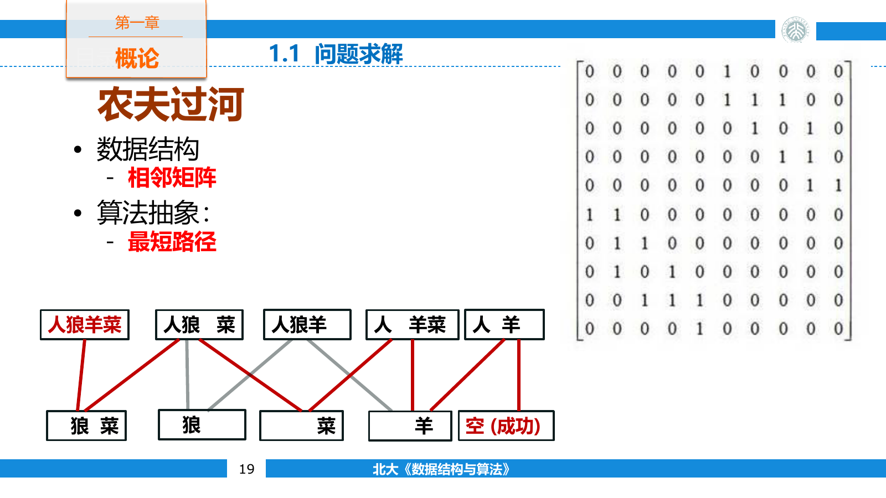

## 从问题到程序

程序设计不是把自然语言逐句翻译成代码。题目中的人物、动作和限制要先变成可以精确表示的对象，再由程序处理这些对象。

一个问题通常要经过三层抽象：

- **问题抽象**：删去与求解无关的背景，确定输入、输出和限制。
- **数据抽象**：找出对象之间的关系，决定用什么数据结构表示。
- **算法抽象**：规定数据上执行哪些操作，以及这些操作的先后顺序。

农夫带狼、羊和白菜过河时，每个对象只可能位于左岸或右岸。用四个二进制位依次表示农夫、狼、羊和白菜的位置，`0101` 就是一种完整局面。若农夫与羊不在同一岸，而狼或白菜与羊同岸，这个局面不合法。

把每个合法局面看作顶点，把一次合法渡河看作边，过河问题就变成从 `0000` 到 `1111` 的路径搜索。



这次建模完成了两次取舍。四位整数代替了四个对象的自然语言描述；图只保留局面之间能否一步到达，不关心“渡河”这个故事。之后无论使用邻接矩阵还是邻接表，无论采用深度优先还是广度优先，处理的都是同一个图模型。

### 数据与类型

数据元素除了值，还有类型。类型限定了值域以及允许执行的操作。例如整数可以比较和做算术运算，指针保存地址并支持间接访问，结构体把若干字段组合成一个整体。

基础类型可以继续组成更复杂的类型：

- 数组保存一组同类型元素，并用下标定位。
- 结构体把不同类型的字段组织成一条记录。
- 指针把一个对象与另一个存储位置关联起来。
- 类在数据之外再封装一组操作，并限制外部能直接访问的状态。

指针本身也是一个值。链表结点中的 `next` 保存后继结点的地址，而不是把后继结点嵌在当前结点中。地址关系使逻辑上相邻的结点可以分散在内存各处，也带来了空指针、悬空指针和内存释放等问题。

### 数据结构

数据结构由数据对象、对象之间的关系、存储表示和操作集合共同构成。只列出数据元素而不描述关系，还不能确定该如何访问或修改它们。

按照逻辑关系，常见结构可以分为三类：

- 线性结构中，除首尾元素外，每个元素只有一个直接前驱和一个直接后继。
- 树结构中，一个结点可以拥有多个后继，但除根外通常只有一个直接前驱。
- 图结构允许任意两个顶点之间建立关系。

线性表可以形式化为数据集合 $K$ 与关系 $R$ 。若

$$
K=\{a_0,a_1,\ldots,a_{n-1}\}
$$

并且

$$
R=\{\langle a_0,a_1\rangle,\langle a_1,a_2\rangle,\ldots,\langle a_{n-2},a_{n-1}\rangle\}
$$

那么关系 $R$ 只说明元素之间的先后次序，并没有规定这些元素在内存中是否连续。

逻辑结构要经过一次存储映射才能落到机器上。同一张线性关系既可以映射到连续数组，也可以映射为一组带指针的结点。常见的存储组织包括顺序存储、链式存储、索引存储和散列存储。

存储方式由操作决定。顺序表能在常数时间内按下标访问，却要移动元素才能在中间插入；链表已知前驱后只改指针就能插入，却必须从表头逐结点寻找第 $i$ 个元素。数据结构没有脱离操作集合的“最好实现”。

### 抽象数据类型

抽象数据类型（Abstract Data Type，ADT）描述数据对象及其合法操作，不规定操作的具体实现。它可以表示为数据集合与操作集合组成的二元组

$$
\mathrm{ADT}=\langle D,P\rangle
$$

其中 $D$ 表示数据对象， $P$ 表示定义在这些对象上的操作。

以栈为例，接口可以只暴露以下语义：

```cpp
template <class T>
class Stack {
public:
    virtual bool empty() const = 0;
    virtual void push(const T& value) = 0;
    virtual void pop() = 0;
    virtual const T& top() const = 0;
    virtual ~Stack() = default;
};
```

调用者只知道 `push` 后新元素位于栈顶，`pop` 删除当前栈顶。数组栈与链式栈可以共享这套接口；替换内部表示时，使用栈的表达式求值程序不必跟着改写。

ADT 还应说明操作的前置条件。例如空栈上不能直接读取 `top`，满的定长顺序栈不能继续压入元素。接口若不负责检查，调用者就必须保证条件成立。

### 算法与程序

算法是由有限条规则组成的过程，它把一组合法输入映射为对应输出。程序则是某个算法在具体语言、机器和运行环境中的实现。同一个二分检索算法可以写成递归或循环，也可以用 C++、Python 等不同语言实现。

一个可执行算法至少满足以下条件：

- **有穷性**：执行有限步后终止。
- **确定性**：每一步含义清楚，同一状态下下一步已经确定。
- **可行性**：每一步都能由有限次基本操作完成。
- **输入与输出**：允许没有显式输入，但必须产生与问题目标一致的结果。
- **一般性**：处理一类合法实例，而不是把某个样例答案写死。

算法可以按解决问题的方式分类。穷举直接枚举全部候选；回溯在候选空间中试探并撤销选择；分治把问题拆成规模更小的同类问题；贪心每一步作局部选择；动态规划保存重复子问题的结果。这些方法会在同一个程序中组合出现，例如归并排序用分治组织递归，再用线性扫描合并两个有序段。

## 状态空间与回溯

四皇后问题要求在 $4\times 4$ 棋盘上放置四个皇后，使任意两个皇后不同行、不同列、也不在同一条对角线上。

若按行放置皇后，第 $r$ 层状态只需记录前 $r$ 行各自选了哪一列。每个合法列形成一条向下一层的边；冲突的选择立即被剪掉。完整搜索过程是一棵状态树，叶结点表示成功布局或已经无路可走的失败布局。

```cpp
void searchQueens(int row, std::array<int, 4>& column, int& answer) {
    if (row == 4) {
        ++answer;
        return;
    }

    for (int candidate = 0; candidate < 4; ++candidate) {
        bool valid = true;
        for (int previous = 0; previous < row; ++previous) {
            if (column[previous] == candidate ||
                std::abs(column[previous] - candidate) == row - previous) {
                valid = false;
                break;
            }
        }
        if (!valid) continue;

        column[row] = candidate;
        searchQueens(row + 1, column, answer);
    }
}
```

数组 `column` 保存从根到当前状态的路径。递归返回上一层时，下一次赋值会覆盖当前行的旧选择，因此这里不需要额外清空。若状态中还修改了不能被覆盖的数据，就要在递归返回后显式恢复。

### 检索示例

顺序检索从一端开始逐项比较。一个常见写法是在数组边界外预留监视哨，把待查值临时放到该位置。

```cpp
int sequentialSearch(std::vector<int>& data, int target) {
    data[0] = target;
    int index = static_cast<int>(data.size()) - 1;

    while (data[index] != target) {
        --index;
    }
    return index;
}
```

这里约定有效元素位于 `data[1]` 到 `data[n]`。循环不再同时判断 `index > 0`，因为最迟会在监视哨处停止；返回 `0` 表示检索失败。监视哨没有改变 $O(n)$ 的增长率，只减少了循环内的一次条件判断。

有序顺序表可以使用二分检索。每次比较中点后，剩余区间缩小一半。

```cpp
int binarySearch(const std::vector<int>& data, int target) {
    int left = 0;
    int right = static_cast<int>(data.size()) - 1;

    while (left <= right) {
        int middle = left + (right - left) / 2;
        if (data[middle] == target) return middle;
        if (data[middle] < target) left = middle + 1;
        else right = middle - 1;
    }
    return -1;
}
```

写成 `left + (right - left) / 2` 可以避免 `left + right` 在大下标时溢出。二分检索依赖有序性和随机访问；把相同逻辑直接套到链表上，每次寻找中点的代价会抵消它的优势。

## 复杂度分析

### 渐近复杂度

复杂度描述输入规模增长时，算法消耗的时间和空间如何变化。它不精确预测某台机器上的秒数，而是忽略机器、编译器和常数因子，保留增长速度。

若存在正常数 $c$ 和 $n_0$ ，使任意 $n\ge n_0$ 都满足

$$
T(n)\le c f(n)
$$

则记作

$$
T(n)=O(f(n))
$$

这个记号给出渐近上界。若从某个规模开始满足 $T(n)\ge c f(n)$ ，则 $T(n)=\Omega(f(n))$ 。上下界同阶时写作 $T(n)=\Theta(f(n))$ 。

`O` 不是“恰好等于”。一个运行时间为 $3n+5$ 的算法既属于 $O(n)$ ，也属于 $O(n^2)$ ，但用 $\Theta(n)$ 能更准确地说明其增长率。

连续执行的两段程序把代价相加，只保留增长较快的一项

$$
O(f(n))+O(g(n))=O(\max\{f(n),g(n)\})
$$

嵌套执行时复杂度相乘。外层循环运行 $n$ 次，内层每次运行 $m$ 次，总时间为 $O(nm)$ 。若内层次数随外层下标变化，则应直接计算求和式，而不是机械地写成两个上界的乘积。

常见增长率由慢到快排列为

$$
1<\log n<n<n\log n<n^2<n^3<2^n<n!
$$

规模较大时，增长率通常比常数优化更影响可处理范围。把 $O(n^2)$ 算法的常数减半，仍然无法长期胜过同一问题的 $O(n\log n)$ 算法。

### 最好、最坏与平均情况

同一规模的不同输入可能经过不同执行路径。顺序检索长度为 $n$ 的表时，目标位于检查起点只需一次比较，目标不存在则需要检查全部元素。因此最好时间为 $\Theta(1)$ ，最坏时间为 $\Theta(n)$ 。

若目标等概率地出现在任一位置，成功检索的平均比较次数为

$$
\frac{1+2+\cdots+n}{n}=\frac{n+1}{2}
$$

平均时间仍为 $\Theta(n)$ 。平均复杂度依赖输入分布；没有合理概率模型时，最坏复杂度给出的保证更明确。

二分检索的区间规模依次变为

$$
n,\frac{n}{2},\frac{n}{4},\ldots,1
$$

最多经过 $\lfloor\log_2 n\rfloor+1$ 次比较即可结束，因此时间复杂度为 $O(\log n)$ 。

### 时间与空间

空间复杂度通常统计输入之外的辅助空间。递归调用使用的栈帧、临时数组和动态申请的结点都属于辅助空间；输出本身是否计入，要根据问题约定说明。

时间与空间经常互换。预先建立索引会占用更多空间，却能减少后续检索时间；哈希表用较低装载因子换取更短的冲突链；归并排序申请辅助数组后能稳定地在线性时间内合并。

数组循环左移 $k$ 位就是一个具体例子。申请长度为 $n$ 的临时数组容易实现，需要 $O(n)$ 辅助空间；也可以依次翻转前 $k$ 个元素、后 $n-k$ 个元素和整个数组，只使用 $O(1)$ 辅助空间。

```cpp
void rotateLeft(std::vector<int>& data, int k) {
    if (data.empty()) return;
    k %= static_cast<int>(data.size());

    std::reverse(data.begin(), data.begin() + k);
    std::reverse(data.begin() + k, data.end());
    std::reverse(data.begin(), data.end());
}
```

三次翻转仍然访问 $O(n)$ 个元素。它没有降低时间复杂度，只把额外空间从 $O(n)$ 降到了 $O(1)$ 。
