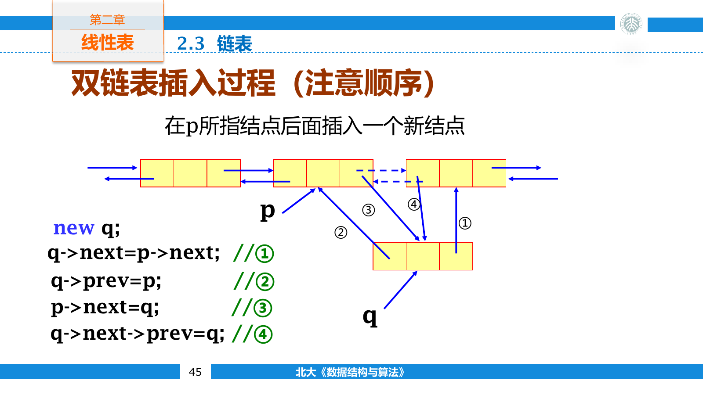

## 线性结构

线性表是由有限个同类型元素组成的有序序列

$$
L=(a_0,a_1,\ldots,a_{n-1})
$$

这里的“有序”指元素之间存在先后关系，并不表示元素值已经按大小排列。 $a_0$ 没有直接前驱， $a_{n-1}$ 没有直接后继，其余元素都只有一个直接前驱和一个直接后继。

线性表可以从三个角度观察

- 逻辑结构回答哪些元素相邻。
- 存储结构回答元素与关系如何放入内存。
- 操作集合回答程序怎样读取和修改它。

同一逻辑结构可以采用不同存储结构。顺序表用物理位置表示前后关系，链表则把后继地址写进结点。

线性结构还可以按访问方式区分。数组支持按下标直接访问；链表只能从已知结点开始顺序访问；索引文件先通过索引定位一个范围，再在范围内继续查找。栈和队列仍是线性表，只是限制了允许插入和删除的位置。

常见操作包括创建、清空、按位置读取、按值查找、插入和删除。比较两种表示时，必须把“寻找操作位置”与“在已知位置修改结构”分开计算。

## 顺序表

顺序表把元素存放在一段连续内存中。若首元素地址为 $\operatorname{Loc}(a_0)$ ，每个元素占用 $s$ 字节，则第 $i$ 个元素的地址为

$$
\operatorname{Loc}(a_i)=\operatorname{Loc}(a_0)+is
$$

地址计算与表长无关，因此按下标访问是 $O(1)$ 时间。连续存储还具有较好的缓存局部性：读取一个元素时，附近的元素常会一起进入高速缓存。

一个定长顺序表至少要保存数组、当前长度和容量

```cpp
template <class T>
class ArrayList {
private:
    T* data;
    int length;
    int capacity;

public:
    explicit ArrayList(int capacity)
        : data(new T[capacity]), length(0), capacity(capacity) {}

    ~ArrayList() {
        delete[] data;
    }

    int size() const {
        return length;
    }

    const T& at(int index) const {
        return data[index];
    }
};
```

这里省略了越界检查。工程实现应保证 $0\le index<length$ ，否则会访问不属于顺序表的内存。

### 插入与删除

向位置 $i$ 插入新元素后，原来的 $a_i$ 到 $a_{n-1}$ 都要向后移动一格。移动必须从尾端开始，否则 `data[i + 1]` 会覆盖尚未搬走的旧值。

```cpp
bool insert(int index, const T& value) {
    if (index < 0 || index > length || length == capacity) {
        return false;
    }

    for (int i = length; i > index; --i) {
        data[i] = data[i - 1];
    }
    data[index] = value;
    ++length;
    return true;
}
```

删除位置 $i$ 后，后缀元素向前移动，循环方向则应从前向后。

```cpp
bool erase(int index) {
    if (index < 0 || index >= length) return false;

    for (int i = index; i + 1 < length; ++i) {
        data[i] = data[i + 1];
    }
    --length;
    return true;
}
```

长度为 $n$ 时，向位置 $i$ 插入需要移动 $n-i$ 个旧元素。若 $n+1$ 个插入位置等概率出现，平均移动次数为

$$
\frac{1}{n+1}\sum_{i=0}^{n}(n-i)=\frac{n}{2}
$$

删除位置 $i$ 需要移动 $n-i-1$ 个元素，平均移动次数为

$$
\frac{1}{n}\sum_{i=0}^{n-1}(n-i-1)=\frac{n-1}{2}
$$

两种操作的平均时间都是 $O(n)$ 。在表尾插入不需要移动已有元素，所以只要容量足够，单次尾插是 $O(1)$ 时间。

### 容量与扩充

固定容量数组在装满后无法继续插入。动态数组会申请更大的连续区域，移动或复制旧元素，再释放原区域。

若每次只增加一个位置，连续插入 $n$ 个元素会发生

$$
1+2+\cdots+(n-1)=O(n^2)
$$

次搬移。按两倍扩容时，搬移发生在容量为 $1,2,4,\ldots$ 的时刻，总搬移次数小于 $2n$ ，因此连续尾插的均摊时间为 $O(1)$ 。均摊复杂度不表示每次操作都快，触发扩容的那一次仍需 $O(n)$ 时间。

顺序存储的空间利用率可以用存储密度描述。若元素本身占用的空间为 $E$ ，整个结构占用空间为 $S$ ，则

$$
\text{density}=\frac{E}{S}
$$

数组几乎不为单个元素附加信息，但未使用的预留容量也会降低密度。

## 链表

### 单链表

链表不要求结点在内存中连续排列。每个结点保存元素和后继指针

```cpp
template <class T>
struct ListNode {
    T value;
    ListNode* next = nullptr;
};
```

若只保存首指针，首部插入可以直接完成

```cpp
template <class T>
void pushFront(ListNode<T>*& head, const T& value) {
    head = new ListNode<T>{value, head};
}
```

已知前驱结点 $p$ 时，在它后面插入新结点只需改变两条链接

```cpp
template <class T>
void insertAfter(ListNode<T>* p, const T& value) {
    p->next = new ListNode<T>{value, p->next};
}
```

右侧的 `p->next` 会先求值并保存到新结点中，然后左侧赋值才覆盖旧链接。若拆成多条语句，也必须先让新结点指向原后继，再修改 $p$ 的后继。

删除后继结点时，要先保存将被释放的地址

```cpp
template <class T>
bool eraseAfter(ListNode<T>* p) {
    if (p == nullptr || p->next == nullptr) return false;

    ListNode<T>* removed = p->next;
    p->next = removed->next;
    delete removed;
    return true;
}
```

链接修改只需 $O(1)$ 时间，但“找到前驱”并不免费。链表无法通过地址公式直接定位第 $i$ 个结点，从表头走到该位置需要 $O(i)$ 时间。因此按下标读取、插入和删除的总复杂度通常仍是 $O(n)$ 。

#### 头结点与边界

不带头结点的链表在删除首元素时必须修改 `head` 本身，在其他位置删除时修改前驱的 `next`。这两种情况操作的变量不同，代码中往往要单独判断首结点。

在首元素之前增加一个不保存有效数据的头结点后， `head` 始终指向这个固定结点，第一个有效元素位于 `head->next`。删除首元素也变成“删除头结点的后继”，与删除其他结点使用同一段代码。

头结点不是逻辑数据的一部分。空表中仍保留头结点，只是 `head->next == nullptr`。它用一个额外结点换取统一的边界处理。

链表代码还要分别检查几类边界

- 空表上不能读取或删除有效元素。
- 尾结点的后继为空，不能继续解引用。
- 删除后不能再通过旧指针访问已释放结点。
- 销毁链表时要逐个保存后继并释放，否则只删除首结点会泄漏余下结点。

```cpp
template <class T>
void clear(ListNode<T>*& head) {
    while (head != nullptr) {
        ListNode<T>* next = head->next;
        delete head;
        head = next;
    }
}
```

### 双向链表

双向链表的结点同时保存前驱和后继。已知某个结点时，可以向两个方向移动，也能在 $O(1)$ 时间内直接删除当前结点。

```cpp
template <class T>
struct DoublyNode {
    T value;
    DoublyNode* prev = nullptr;
    DoublyNode* next = nullptr;
};
```

在结点 $p$ 后插入 `node` 时，需要同时维护新结点与两侧旧结点的链接

```cpp
template <class T>
void insertAfter(DoublyNode<T>* p, DoublyNode<T>* node) {
    node->prev = p;
    node->next = p->next;
    if (p->next != nullptr) {
        p->next->prev = node;
    }
    p->next = node;
}
```

四次赋值存在先后依赖：被覆盖的旧链接要先保存到新结点中，再改动原结点。



删除结点时，前驱的 `next` 要越过它，后继的 `prev` 也要越过它。若表首或表尾没有哨兵，两个方向都要检查空指针。使用首尾哨兵后，每个有效结点都有前驱和后继，删除代码可以不再区分首尾。

### 循环链表

循环链表让尾结点重新指向表头。只要保留尾指针，就能在 $O(1)$ 时间内找到首结点 `tail->next`，也能在尾部插入后继续从头遍历。

带头结点的循环双向链表可以让头结点的 `next` 指向首元素， `prev` 指向尾元素。空表中两个指针都指回头结点，不再需要用空指针表示边界。

循环结构没有天然的遍历终点。循环条件应判断指针是否回到起点，不能继续等待 `nullptr`。

#### 约瑟夫问题

有 $n$ 个人围成一圈，从指定位置开始每次数到第 $m$ 个人便将其移出，随后从下一个人继续计数。循环链表可以直接模拟这个过程。

```cpp
int josephus(int n, int step) {
    std::list<int> people;
    for (int i = 1; i <= n; ++i) people.push_back(i);

    auto current = people.begin();
    while (people.size() > 1) {
        for (int count = 1; count < step; ++count) {
            ++current;
            if (current == people.end()) current = people.begin();
        }

        current = people.erase(current);
        if (current == people.end()) current = people.begin();
    }
    return people.front();
}
```

若 $n=7$ 且 $m=3$ ，移出顺序为 $3,6,2,7,5,1$ ，最后留下 $4$ 。链表模拟会执行与报数次数同阶的移动，时间约为 $O(nm)$ 。只求最后幸存者时，可以用递推式降低到 $O(n)$ 时间

$$
f(1)=0
$$

$$
f(n)=(f(n-1)+m)\bmod n
$$

这里 $f(n)$ 使用从零开始的编号，最终答案若从一编号还要再加一。

## 结构比较与应用

### 顺序表与链表

| 操作 | 顺序表 | 单链表 |
| --- | --- | --- |
| 按下标访问 | $O(1)$ | $O(n)$ |
| 按值查找 | $O(n)$ | $O(n)$ |
| 已知位置后插入 | $O(n)$ | $O(1)$ |
| 已知前驱后删除 | $O(n)$ | $O(1)$ |
| 单个元素附加空间 | 无 | 一个指针 |
| 缓存局部性 | 好 | 较差 |

表中的“已知位置”含义不同。顺序表已经有下标，链表则已经拿到结点指针；若两边都只给逻辑位置 $i$ ，链表还要先走到前驱。

设顺序表容量为 $D$ ，每个元素占 $E$ 字节；链表实际保存 $n$ 个元素，每个指针占 $P$ 字节。忽略容器固定开销时，链表更省空间需要满足

$$
n(P+E)<DE
$$

也就是

$$
n<\frac{DE}{P+E}
$$

数组容量利用率较高时，链表的指针开销反而更大。结点分散分配还会增加分配器元数据和缓存未命中，因此不能只看没有“预留容量”就断定链表省空间。

### 稀疏多项式

指数范围很大而非零项很少时，多项式只需保存系数与指数

```cpp
struct Term {
    double coefficient;
    int exponent;
};
```

例如

$$
3x^{1000}-2x^7+5
$$

只包含三项，没有必要建立长度为 $1001$ 的系数数组。按指数从高到低保存各项后，两个多项式相加可以同时扫描两条序列。

```cpp
std::vector<Term> addPolynomial(
    const std::vector<Term>& left,
    const std::vector<Term>& right) {
    std::vector<Term> result;
    int i = 0;
    int j = 0;

    while (i < static_cast<int>(left.size()) &&
           j < static_cast<int>(right.size())) {
        if (left[i].exponent > right[j].exponent) {
            result.push_back(left[i++]);
        } else if (left[i].exponent < right[j].exponent) {
            result.push_back(right[j++]);
        } else {
            double coefficient = left[i].coefficient + right[j].coefficient;
            if (coefficient != 0) {
                result.push_back({coefficient, left[i].exponent});
            }
            ++i;
            ++j;
        }
    }

    result.insert(result.end(), left.begin() + i, left.end());
    result.insert(result.end(), right.begin() + j, right.end());
    return result;
}
```

指数不同的较大项直接进入结果，指数相同则合并系数，抵消为零的项不保留。若两边分别有 $p$ 项和 $q$ 项，时间复杂度为 $O(p+q)$ ，与指数最大值无关。
