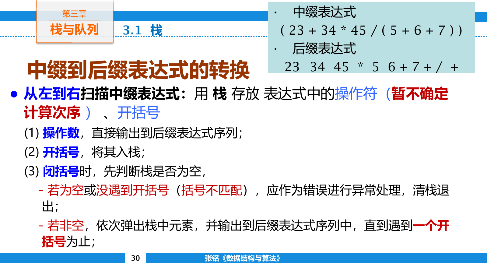

## 栈

栈只允许在同一端插入和删除元素。这个位置称为栈顶，另一端称为栈底。最后进入的元素最先离开，因此栈遵循后进先出（Last In First Out，LIFO）规则。

栈的基本操作有三个：

- `push` 把元素压入栈顶。
- `pop` 删除栈顶元素。
- `top` 读取栈顶元素但不删除。

顺序栈把栈底固定在数组一端，用 `top` 记录当前栈顶位置。若令 `top` 表示已有元素个数，那么有效元素占据 `data[0]` 到 `data[top - 1]`，空栈满足 `top == 0`。

```cpp
template <class T>
class ArrayStack {
private:
    std::vector<T> data;
    int topIndex = 0;

public:
    explicit ArrayStack(int capacity) : data(capacity) {}

    bool empty() const {
        return topIndex == 0;
    }

    bool full() const {
        return topIndex == static_cast<int>(data.size());
    }

    bool push(const T& value) {
        if (full()) return false;
        data[topIndex++] = value;
        return true;
    }

    bool pop() {
        if (empty()) return false;
        --topIndex;
        return true;
    }

    const T& top() const {
        return data[topIndex - 1];
    }
};
```

定长顺序栈装满后继续 `push` 会发生上溢，空栈上执行 `pop` 或 `top` 会发生下溢。这里用返回值报告失败；也可以抛出异常或在调用前检查，接口约定应保持一致。

链式栈把单链表表头作为栈顶。入栈建立新首结点，出栈删除首结点，两者都不需要寻找尾部。

```cpp
template <class T>
class LinkedStack {
private:
    struct Node {
        T value;
        Node* next;
    };

    Node* head = nullptr;

public:
    bool empty() const {
        return head == nullptr;
    }

    void push(const T& value) {
        head = new Node{value, head};
    }

    bool pop() {
        if (empty()) return false;
        Node* removed = head;
        head = head->next;
        delete removed;
        return true;
    }

    const T& top() const {
        return head->value;
    }
};
```

顺序栈的元素连续存放，局部性好，动态数组还能按倍数扩容；链式栈不需要预先估计容量，但每个元素附带一个指针，并承担动态分配开销。两者的基本操作都是 $O(1)$ 时间。

### 出栈序列

栈会限制元素离开的次序。设列车按 `1 2 3 4` 依次进入中转栈，判断一个目标序列是否合法时，可以按输入次序压栈，并在栈顶等于目标当前元素时持续弹出。

目标 `2 1 4 3` 可以实现：压入 `1 2` 后弹出 `2 1`，再压入 `3 4` 并弹出 `4 3`。目标 `3 1 2 4` 不可实现，因为弹出 `3` 后， `2` 仍压在 `1` 上面，不可能先取出 `1`。

```cpp
bool isStackPermutation(const std::vector<int>& target) {
    std::stack<int> station;
    int nextInput = 1;

    for (int value : target) {
        while (nextInput <= static_cast<int>(target.size()) &&
               (station.empty() || station.top() != value)) {
            station.push(nextInput++);
        }

        if (station.empty() || station.top() != value) return false;
        station.pop();
    }
    return true;
}
```

每个编号只入栈和出栈一次，判断过程为 $O(n)$ 时间。

### 表达式

中缀表达式把运算符写在两个操作数之间，计算顺序由优先级、结合性和括号共同决定。后缀表达式把运算符写在操作数之后，计算顺序已经包含在记号排列中，不再需要括号。

中缀表达式

$$
(3+4)\times 5-6
$$

对应的后缀形式为 `3 4 + 5 * 6 -`。

计算后缀表达式时，从左到右扫描记号。操作数直接入栈；遇到二元运算符时，先弹出右操作数，再弹出左操作数，计算后把结果压回栈。

| 读入记号 | 栈中内容 | 操作 |
| --- | --- | --- |
| `3` | `3` | 操作数入栈 |
| `4` | `3 4` | 操作数入栈 |
| `+` | `7` | 计算 $3+4$ |
| `5` | `7 5` | 操作数入栈 |
| `*` | `35` | 计算 $7\times 5$ |
| `6` | `35 6` | 操作数入栈 |
| `-` | `29` | 计算 $35-6$ |

减法和除法不能交换左右操作数。若先弹出的值记作 `right`，后弹出的值记作 `left`，运算应写成 `left op right`。

```cpp
int evaluatePostfix(const std::vector<std::string>& tokens) {
    std::stack<int> values;

    for (const std::string& token : tokens) {
        if (std::isdigit(static_cast<unsigned char>(token[0]))) {
            values.push(std::stoi(token));
            continue;
        }

        int right = values.top();
        values.pop();
        int left = values.top();
        values.pop();

        if (token == "+") values.push(left + right);
        else if (token == "-") values.push(left - right);
        else if (token == "*") values.push(left * right);
        else if (token == "/") values.push(left / right);
    }

    return values.top();
}
```

实际解析器还要检查操作数数量、非法记号、除零和整数溢出。合法二元表达式扫描结束后，栈中应恰好剩一个值。

#### 中缀转后缀

转换过程中，一个栈保存尚未输出的运算符。

- 操作数立即输出。
- 左括号直接入栈。
- 右括号让运算符持续出栈，直到匹配的左括号被删除。
- 左结合运算符到来时，栈顶优先级不低于它的运算符先出栈。
- 输入结束后，栈中剩余运算符依次输出。



以 `a + b * c` 为例，读到 `+` 时栈为 `+`；读到 `*` 时，因为乘法优先级更高，不弹出 `+`；输入结束后先输出 `*` 再输出 `+`，得到 `a b c * +`。

若运算符是右结合的，例如幂运算，遇到同优先级栈顶时不能立即弹出，否则会把 `a ^ b ^ c` 错误地解释成 `(a ^ b) ^ c`。优先级相同是否弹栈取决于当前运算符的结合性。

每个记号最多入栈和出栈各一次，因此转换与后缀求值都是 $O(n)$ 时间。

## 队列

队列在一端插入，在另一端删除。插入的一端称为队尾，删除的一端称为队头。最先进入的元素最先离开，因此队列遵循先进先出（First In First Out，FIFO）规则。

基本操作包括：

- `enqueue` 在队尾加入元素。
- `dequeue` 删除队头元素。
- `front` 读取队头元素。

队列适合表示等待处理的先后次序，例如打印任务、网络请求和图搜索中已经发现但尚未展开的顶点。

若顺序队列只让 `front` 和 `rear` 不断向右移动，删除留下的前部空间无法再次使用。即使数组中仍有空位， `rear` 到达末端后也不能继续插入，这种情况称为假溢出。每次出队后整体前移可以消除空洞，却会让一次出队变成 $O(n)$ 时间。

### 循环队列

循环队列把数组末端与开头视为相邻位置，下标通过取模回绕。若底层数组长度为 $m$ ，下一个位置为

$$
\operatorname{next}(i)=(i+1)\bmod m
$$

只保存 `front` 和 `rear` 时，两个下标相等既可能表示空队列，也可能表示队列恰好装满。常见解决办法有三种：额外保存元素数量、额外保存上一次操作类型，或始终空出一个槽位。

采用空槽方案时， `front` 指向队头元素， `rear` 指向下一次写入位置。判空条件为

$$
\text{empty}\iff front=rear
$$

判满条件为

$$
\text{full}\iff (rear+1)\bmod m=front
$$

长度为 $m$ 的数组最多保存 $m-1$ 个元素。

```cpp
template <class T>
class CircularQueue {
private:
    std::vector<T> data;
    int frontIndex = 0;
    int rearIndex = 0;

public:
    explicit CircularQueue(int capacity) : data(capacity + 1) {}

    bool empty() const {
        return frontIndex == rearIndex;
    }

    bool full() const {
        return (rearIndex + 1) % data.size() == frontIndex;
    }

    bool push(const T& value) {
        if (full()) return false;
        data[rearIndex] = value;
        rearIndex = (rearIndex + 1) % data.size();
        return true;
    }

    bool pop() {
        if (empty()) return false;
        frontIndex = (frontIndex + 1) % data.size();
        return true;
    }

    const T& head() const {
        return data[frontIndex];
    }
};
```

若 `front = 6`， `rear = 2`，数组长度为 $8$ ，队列元素数不能写成 `rear - front`，而应写成

$$
(rear-front+m)\bmod m
$$

这条公式把已经回绕的负差值重新映射到 $0$ 到 $m-1$ 。

### 链式队列

链式队列同时保存队头和队尾指针。只保存队头会让尾插需要遍历整条链；只保存队尾则无法删除首结点。

加入一个哨兵头结点后， `front` 指向哨兵， `rear` 指向最后一个有效结点。空队列满足 `front == rear`。

```cpp
template <class T>
class LinkedQueue {
private:
    struct Node {
        T value;
        Node* next;
    };

    Node* front;
    Node* rear;

public:
    LinkedQueue() {
        front = rear = new Node{};
    }

    bool empty() const {
        return front == rear;
    }

    void push(const T& value) {
        rear->next = new Node{value, nullptr};
        rear = rear->next;
    }

    bool pop() {
        if (empty()) return false;
        Node* removed = front->next;
        front->next = removed->next;
        if (rear == removed) rear = front;
        delete removed;
        return true;
    }

    const T& head() const {
        return front->next->value;
    }
};
```

删除唯一有效结点后， `rear` 不能继续指向已经释放的内存，必须重新指向哨兵。入队和出队都只修改常数条链接，时间为 $O(1)$ 。

### 广度优先搜索

广度优先搜索（Breadth First Search，BFS）把已经发现但尚未展开的状态放入队列。起点先入队；每次取出队头，访问它的所有未发现邻居，并把这些邻居接到队尾。

在无权图中，第 $d$ 层顶点全部出队后，第 $d+1$ 层才会开始处理。因此一个顶点第一次被发现时，记录的路径已经使用最少边数。

农夫过河问题可以用四位状态表示。搜索时从初始状态出发，枚举农夫独自或带一个对象渡河后的新状态，只有安全且未访问的状态才入队。

```cpp
std::vector<int> bfs(int start, int target) {
    std::queue<int> pending;
    std::array<int, 16> previous;
    previous.fill(-1);

    pending.push(start);
    previous[start] = start;

    while (!pending.empty()) {
        int state = pending.front();
        pending.pop();

        if (state == target) break;

        for (int next : legalMoves(state)) {
            if (previous[next] != -1) continue;
            previous[next] = state;
            pending.push(next);
        }
    }

    std::vector<int> path;
    if (previous[target] == -1) return path;

    for (int state = target;; state = previous[state]) {
        path.push_back(state);
        if (state == start) break;
    }
    std::reverse(path.begin(), path.end());
    return path;
}
```

`previous` 同时承担访问标记和路径前驱两个职责。顶点要在入队时标记，若等到出队才标记，同一顶点可能被多个前驱重复加入队列。

图使用邻接表存储时，每个顶点入队至多一次，每条边至多检查常数次，时间复杂度为 $O(|V|+|E|)$ ，额外空间为 $O(|V|)$ 。

## 递归与栈

### 运行栈

函数调用时，运行时系统会保存参数、局部变量、返回地址和必要的寄存器状态。这些信息组成栈帧。调用新函数相当于压入栈帧，函数返回则弹出当前栈帧并恢复调用者状态。

递归函数的每一层都有独立局部变量。计算阶乘时， `factorial(4)` 会依次等待 `factorial(3)`、`factorial(2)` 和 `factorial(1)` 返回，再反向完成乘法。

汉诺塔先把上方 $n-1$ 个盘移到辅助柱，再移动最大盘，最后把 $n-1$ 个盘移到目标柱。移动次数满足

$$
T(n)=2T(n-1)+1
$$

解得

$$
T(n)=2^n-1
$$

递归深度只有 $O(n)$ ，但调用总数为指数级。栈空间和运行时间衡量的是不同对象，不能因为递归深度为线性就把时间也写成线性。

### 显式模拟递归

递归可以改写为显式栈。一个栈帧除了参数，还要记录函数返回后应从哪一步继续执行。

以前序遍历为例，递归过程先处理结点，再递归左子树和右子树。显式栈可以把右孩子先压入、左孩子后压入，使左孩子先被取出。

```cpp
void preorder(TreeNode* root) {
    if (root == nullptr) return;

    std::stack<TreeNode*> pending;
    pending.push(root);

    while (!pending.empty()) {
        TreeNode* node = pending.top();
        pending.pop();
        visit(node);

        if (node->right != nullptr) pending.push(node->right);
        if (node->left != nullptr) pending.push(node->left);
    }
}
```

更复杂的递归函数可能在一次调用中包含多个递归点，此时栈帧还要保存阶段编号。机械转换并不会自动降低复杂度，它只是把系统调用栈换成程序能够控制的容器。递归深度可能超过系统栈上限时，显式栈可以避免栈溢出，也便于暂停和恢复搜索。

## 其他受限结构

### 双端队列与共享栈

双端队列（deque）允许在两端插入和删除，同时具有队列与栈的部分性质。滑动窗口最值会在队尾删除失去竞争力的元素，并从队头移除已经离开窗口的下标。

两个栈也可以共享一个数组。一个栈从左端向右增长，另一个从右端向左增长，只有两个栈顶相邻时才判满。与预先把容量平均切开相比，共享空间能让暂时较大的栈利用另一侧空余容量。
