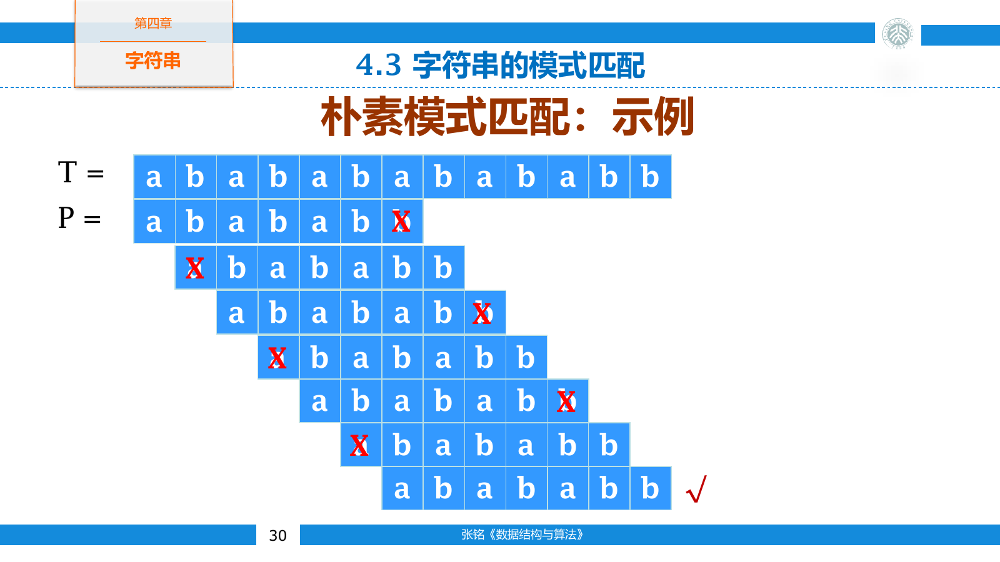
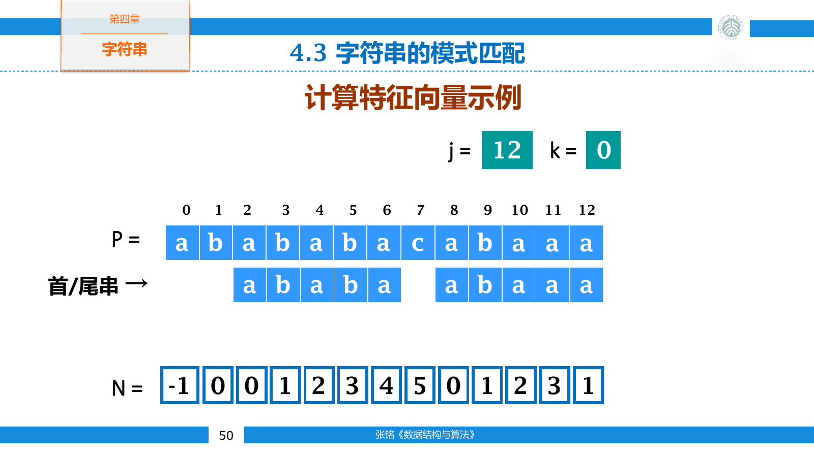
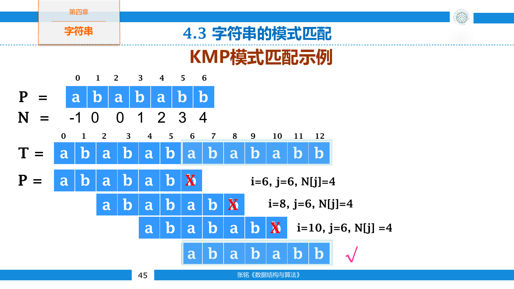
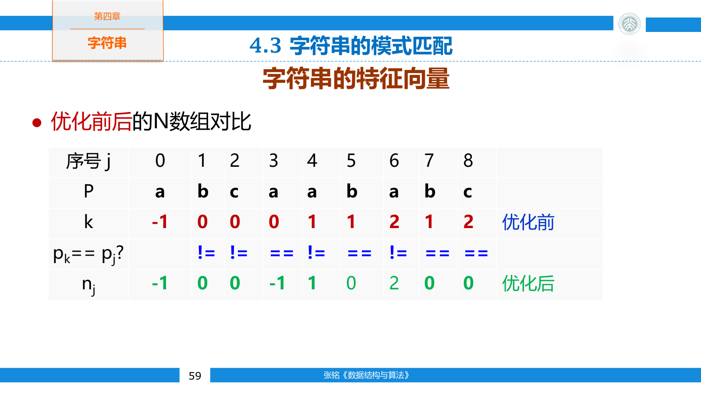

## 字符串

字符串是由某个字符集中的字符组成的有限序列

$$
S=s_0s_1\ldots s_{n-1}
$$

长度为零的字符串称为空串，连续的一段字符称为子串。字符串相等要求长度相同，并且对应位置的字符全部相同。空串与包含一个空格的字符串不同，后者长度为一。

字符串可以看作元素类型为字符的线性表，但常用操作有所不同。求长度、连接、比较、截取子串、寻找字符和模式匹配都比任意位置插入更常见。

字符的编码值决定字典序比较结果。逐字符比较两个字符串时，第一对不同字符的编码顺序决定大小；若较短字符串是较长字符串的前缀，则较短者在前。

### 字符与编码

C 风格字符串使用字符数组保存，并用空字符 `\0` 标记结尾。求长度时必须从首字节扫描到终止符，因此 `strlen` 是 $O(n)$ 时间。若数组没有合法的终止符，相关函数会越界读取。

`std::string` 自行维护长度和容量， `size()` 可以在 $O(1)$ 时间内返回长度。它也能在内容中保存 `\0`，因为字符串边界不依赖终止符。

字符并不总等于一个字节。ASCII 字符可以用单字节表示，UTF-8 则用一到四个字节编码一个 Unicode 码点。 `std::string::size()` 对 UTF-8 文本返回字节数。按字节下标截取时，可能把一个多字节编码从中间切断。

字符数量可能按字节、码点或书写字符计算。带组合附加符号的文本中，一个用户看到的书写字符可能由多个码点组成。传统模式匹配通常把输入当作离散符号序列，只要求每个位置能作相等比较。

### 存储与基本操作

定长字符串可以把长度保存在数组首位、末位或单独字段中。用字段保存长度后，字符串可包含任意字节，代价是每次修改都要同步维护该字段。

```cpp
class FixedString {
private:
    static constexpr int capacity = 256;
    char data[capacity];
    int length = 0;

public:
    int size() const {
        return length;
    }

    char at(int index) const {
        return data[index];
    }
};
```

字符串连接通常要复制右侧全部内容。若在循环中反复执行 `result = result + piece`，每次扩充都可能重抄已经形成的前缀，总代价可能达到平方级。动态字符串预留容量或使用专门的构造缓冲区，可以减少重复分配与复制。

截取长度为 $k$ 的普通字符串需要复制 $O(k)$ 个字符。只读场景也可以用起点和长度构成字符串视图，建立视图只需 $O(1)$ 时间，但原字符串销毁或重新分配后，视图会失效。

## 模式匹配

给定文本 $T$ 和模式 $P$ ，精确模式匹配要寻找起始位置 $s$ ，使所有模式位置都满足

$$
T[s+i]=P[i]
$$

其中 $0\le i<|P|$ 。若文本长度为 $n$ ，模式长度为 $m$ ，合法起点只有 $0$ 到 $n-m$ 。模式比文本长时可以直接判定失败。

空模式的约定因接口而异。许多标准库把它视为在位置零匹配成功；自行实现时应在访问 `pattern[0]` 前先处理这个情况。

### 朴素匹配

朴素算法依次尝试每个起点。匹配途中失配时，文本起点向后移动一位，模式重新从首字符比较。



```cpp
int naiveMatch(const std::string& text, const std::string& pattern) {
    if (pattern.empty()) return 0;

    for (int start = 0;
         start + static_cast<int>(pattern.size()) <=
             static_cast<int>(text.size());
         ++start) {
        int j = 0;
        while (j < static_cast<int>(pattern.size()) &&
               text[start + j] == pattern[j]) {
            ++j;
        }
        if (j == static_cast<int>(pattern.size())) return start;
    }

    return -1;
}
```

文本 `abababababb` 与模式 `abababb` 在起点零比较到第七个字符才失配。起点后移后，朴素算法会再次比较前面已经反复出现的 `abab`。模式具有较长重复前后缀时，重复工作最明显。

最坏情况可以由文本 `aaaaaaaaab` 和模式 `aaaab` 构造。大多数起点都要比较到模式末端才发现失配，比较次数为 $O((n-m+1)m)$ ，简写为 $O(nm)$ 。若每次都在模式首字符失配，则只需 $O(n)$ 次比较。

朴素算法代码短，不需要预处理，适合模式很短或输入规模很小的情况。

### 普通 KMP

KMP 在失配后保留已经匹配部分中仍能使用的后缀。失败数组称为字符串的特征向量，记作 $N$ ，代码中通常写作 `next`。约定 `next[0] = -1`，模式位置 `j` 失配后执行 `j = next[j]`。当 `j == -1` 时，文本指针与模式指针同时右移。

字符串的真前缀不包含字符串本身，真后缀同理。对 `ababa` 而言，前缀 `aba` 与后缀 `aba` 相等，因此它有长度为三的边界。对 `j > 0`，`next[j]` 保存 `pattern[0 ... j - 1]` 的最长边界长度。

普通 `next` 数组按下面的过程构造



```cpp
std::vector<int> buildNext(const std::string& pattern) {
    if (pattern.empty()) return {};

    std::vector<int> next(pattern.size());
    next[0] = -1;

    int j = 0;
    int k = -1;
    while (j + 1 < static_cast<int>(pattern.size())) {
        while (k >= 0 && pattern[j] != pattern[k]) {
            k = next[k];
        }
        ++j;
        ++k;
        next[j] = k;
    }
    return next;
}
```

匹配时，文本下标 `i` 只增不减，失配只沿 `next` 回退模式下标 `j`



```cpp
int kmpMatchByFailure(const std::string& text,
                      const std::string& pattern,
                      const std::vector<int>& failure) {
    if (pattern.empty()) return 0;

    int i = 0;
    int j = 0;
    while (i < static_cast<int>(text.size()) &&
           j < static_cast<int>(pattern.size())) {
        if (j == -1 || text[i] == pattern[j]) {
            ++i;
            ++j;
        } else {
            j = failure[j];
        }
    }
    return j == static_cast<int>(pattern.size()) ? i - j : -1;
}
```

普通 KMP 调用 `kmpMatchByFailure(text, pattern, buildNext(pattern))`。预处理需要 $O(m)$ 时间，匹配需要 $O(n)$ 时间，总时间为 $O(n+m)$ 。

### 优化 KMP

普通 KMP 回退到 `k = next[j]` 后，若 `pattern[j] == pattern[k]`，当前文本字符会再次与相同的字符比较，并得到同样的失配结果。可以跳过这次重复比较，继续沿失败链接回退。

普通数组记作 `next`，优化后的数组记作 `nextval`。若新位置 `j` 与候选位置 `k` 的字符相同，则令 `nextval[j] = nextval[k]`；否则令 `nextval[j] = k`。

```cpp
std::vector<int> buildNextval(const std::string& pattern) {
    if (pattern.empty()) return {};

    std::vector<int> nextval(pattern.size());
    nextval[0] = -1;

    int j = 0;
    int k = -1;
    while (j + 1 < static_cast<int>(pattern.size())) {
        while (k >= 0 && pattern[j] != pattern[k]) {
            k = nextval[k];
        }
        ++j;
        ++k;
        if (pattern[j] == pattern[k]) {
            nextval[j] = nextval[k];
        } else {
            nextval[j] = k;
        }
    }
    return nextval;
}
```

以模式 `abcaababc` 为例，两组特征向量为

```text
index:    0  1  2  3  4  5  6  7  8
pattern:  a  b  c  a  a  b  a  b  c
next:    -1  0  0  0  1  1  2  1  2
nextval: -1  0  0 -1  1  0  2  0  0
```



优化 KMP 仍使用同一个匹配函数，只需改为传入 `buildNextval(pattern)`。它减少了回退后立刻重复失败的比较，最坏时间与额外空间仍分别为 $O(n+m)$ 和 $O(m)$ 。普通 `next` 与 `nextval` 的构造规则不同。

### 其他匹配方法

Boyer-Moore 从模式末端开始比较。失配后，坏字符规则根据该字符在模式中的最右位置移动模式，好后缀规则则利用已经匹配的后缀。普通文本中它常能一次跨过多个位置。

Rabin-Karp 为长度为 $m$ 的窗口维护滚动散列。窗口右移时删去最左字符贡献并加入新字符，更新散列只需 $O(1)$ 时间。散列相等不能证明字符串一定相等，仍要比较原串排除碰撞；同时寻找多个模式时，共享散列计算尤其方便。

有限自动机方法把已匹配的模式前缀长度作为状态，预先计算每个状态读入各字符后的转移。匹配阶段每个字符只查一次表，代价转移到了预处理和状态表空间。

编辑距离允许插入、删除和替换，解决的是近似匹配，不再要求文本片段与模式逐字符相等。它通常使用动态规划，与 KMP 处理的问题不同。
