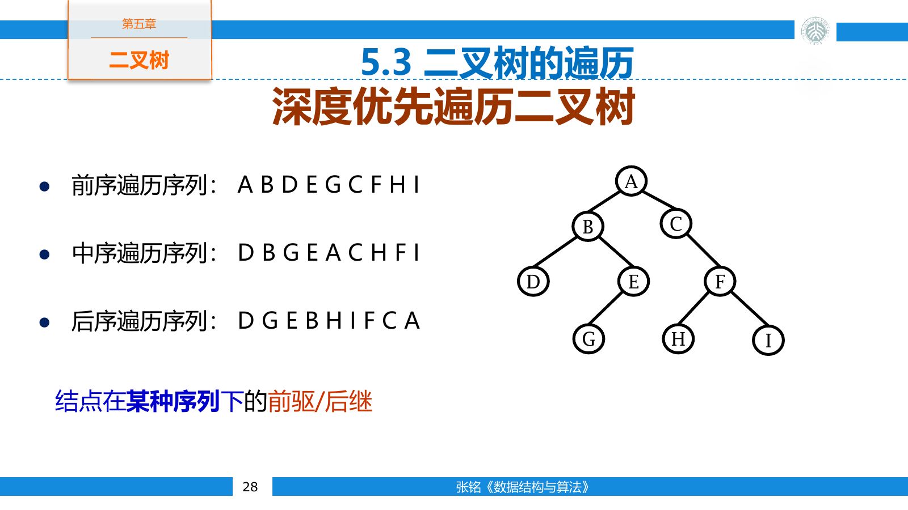
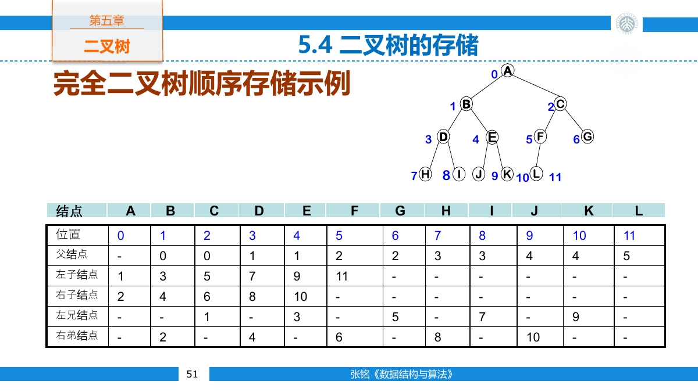
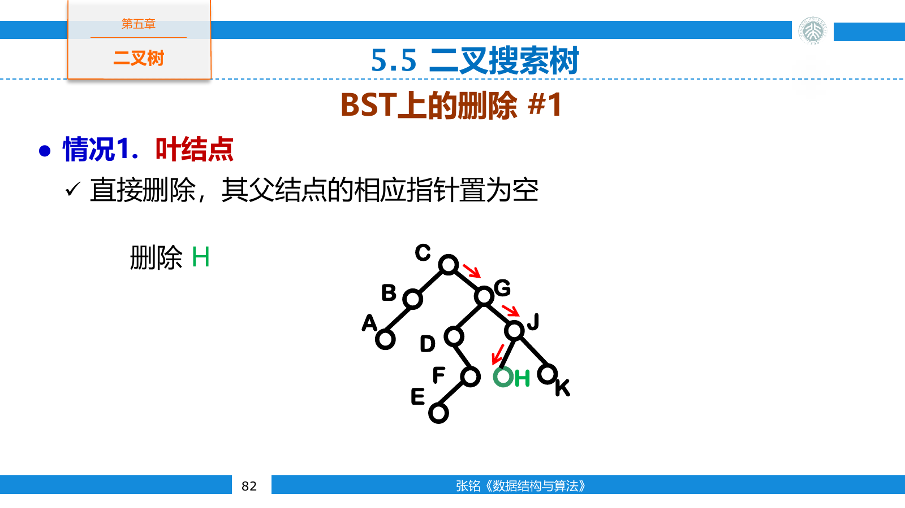
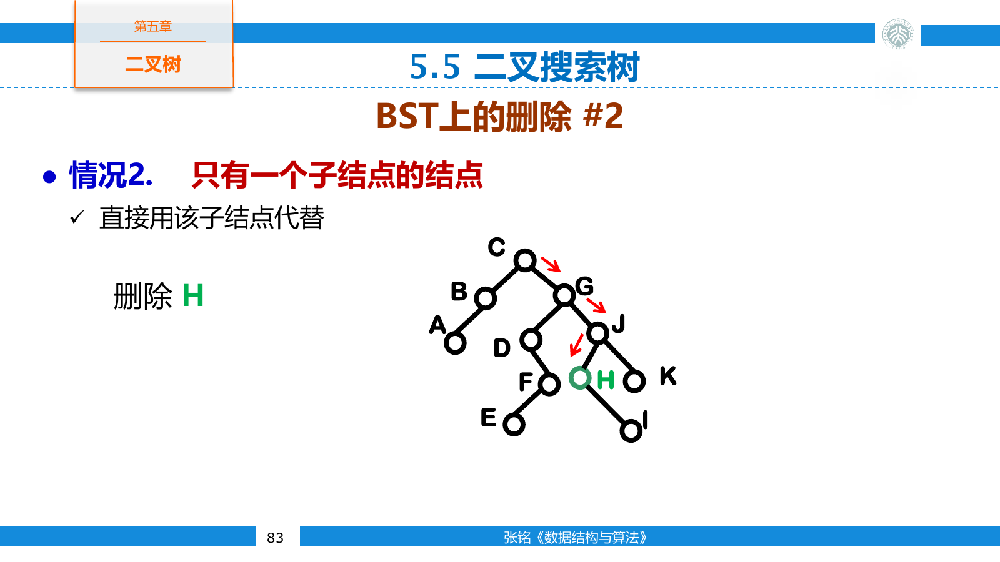
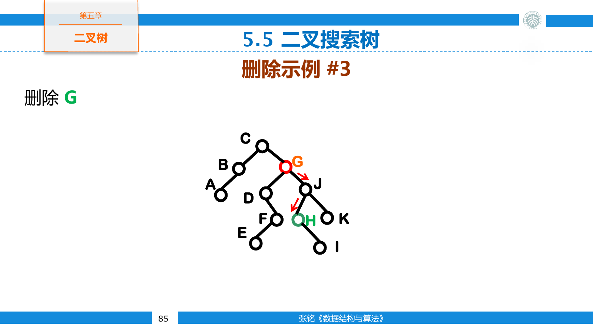
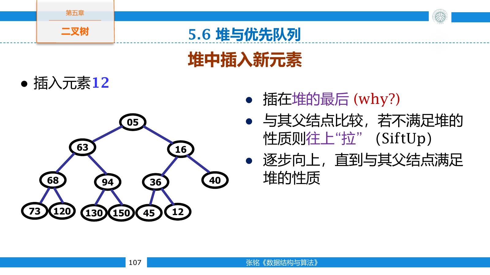
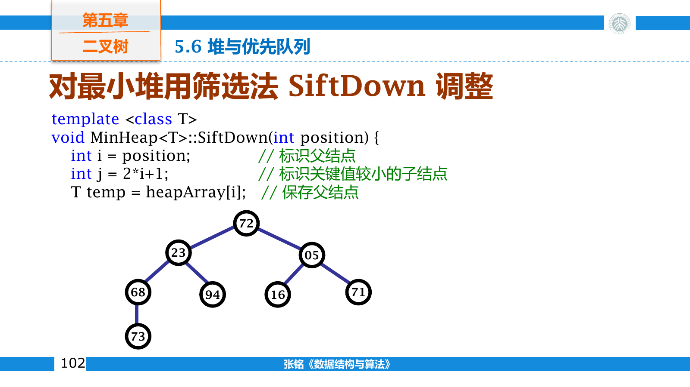
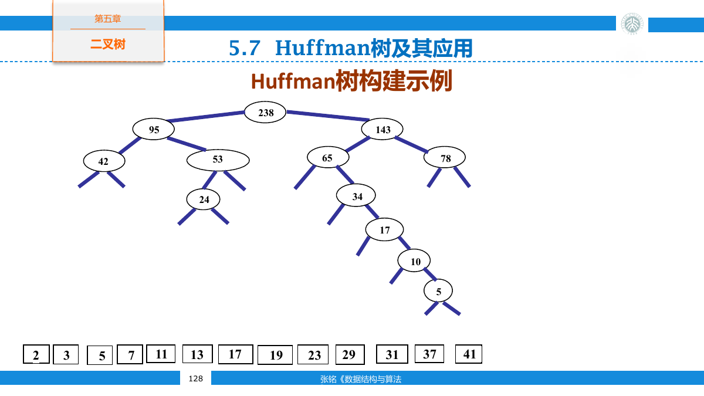

## 二叉树

二叉树是结点的有限集合。它可以为空；非空时由根结点、左子树和右子树组成，并且两棵子树仍是二叉树。

二叉树的左右子树有明确次序。即使一个结点只有一棵子树，也要区分它是左子树还是右子树。因此，度不超过二的有序树并不自动等价于二叉树。

常见形态包括：

- 满二叉树的每个结点要么是叶结点，要么恰有两个非空子树。
- 完美二叉树的所有内部结点都有两个孩子，并且叶结点位于同一层。
- 完全二叉树除最下一层外各层均已填满，最下一层的结点从左向右连续出现。

只有根、只有左子树、只有右子树、左右子树都存在和空树，是递归定义允许的五种基本形态。普通树中一个独生孩子没有左右之分，二叉树中则必须保留方向，所以交换左右子树会得到另一棵二叉树。

“满二叉树”在不同教材中有两种用法：一种要求每个结点的度为零或二，另一种还要求所有叶结点同层。前者称为满二叉树，后者称为完美二叉树。

### 基本性质

根位于第零层时，第 $i$ 层最多有 $2^i$ 个结点。深度为 $k$ 的二叉树最多有

$$
1+2+\cdots+2^k=2^{k+1}-1
$$

个结点。

设叶结点数为 $n_0$ ，只有一个孩子的结点数为 $n_1$ ，有两个孩子的结点数为 $n_2$ 。树中结点总数满足

$$
n=n_0+n_1+n_2
$$

另一方面，除根外每个结点恰好对应一条父边，因此边数也满足

$$
n-1=n_1+2n_2
$$

两式相减得到

$$
n_0=n_2+1
$$

若把每个空子树都补成外部结点，原有结点变成扩充二叉树的内部结点。满二叉树定理说明，外部结点数总比内部结点数多一。因此一棵含 $n$ 个真实结点的非空二叉树共有 $n+1$ 个空链接。

含 $n$ 个结点的完全二叉树高度为

$$
\left\lceil\log_2(n+1)\right\rceil
$$

这里高度按结点层数计算；若把根的深度记为零，最大深度还要减一。

深度为 $k$ 的非空二叉树至少有 $k+1$ 个结点，此时每层只有一个结点，整棵树退化成链。相同结点数下，完全二叉树的高度最小，单支树的高度最大。树上操作写成 $O(h)$ 时，还要继续判断结构能否约束高度 $h$ 。

完全二叉树中，下标小于 $\lfloor n/2\rfloor$ 的结点都是分支结点，其余结点都是叶结点。这个边界正是自底向上建堆从 `n / 2 - 1` 开始的原因。

### 结点与遍历

链式二叉树结点保存数据和两个孩子指针。

```cpp
template <class T>
struct BinaryNode {
    T value;
    BinaryNode* left = nullptr;
    BinaryNode* right = nullptr;
};
```

深度优先遍历根据访问根结点的位置分为三种：

- 前序遍历按根、左子树、右子树的顺序访问。
- 中序遍历按左子树、根、右子树的顺序访问。
- 后序遍历按左子树、右子树、根的顺序访问。



```cpp
template <class T>
void preorder(BinaryNode<T>* root) {
    if (root == nullptr) return;
    visit(root->value);
    preorder(root->left);
    preorder(root->right);
}

template <class T>
void inorder(BinaryNode<T>* root) {
    if (root == nullptr) return;
    inorder(root->left);
    visit(root->value);
    inorder(root->right);
}

template <class T>
void postorder(BinaryNode<T>* root) {
    if (root == nullptr) return;
    postorder(root->left);
    postorder(root->right);
    visit(root->value);
}
```

每个结点只会被进入常数次，所以三种遍历均为 $O(n)$ 时间。递归栈的最大深度等于树高，辅助空间为 $O(h)$ 。

遍历次序不仅用于打印。前序适合在进入结点时完成复制或序列化，后序适合先释放两棵子树再释放根，中序在二叉搜索树上得到有序序列。

```cpp
template <class T>
void destroy(BinaryNode<T>*& root) {
    if (root == nullptr) return;
    destroy(root->left);
    destroy(root->right);
    delete root;
    root = nullptr;
}
```

若先删除根，就会失去两个孩子的地址。后序遍历让每个结点在其后代全部处理完之后才被释放。

### 遍历序列与树形

只给一条前序、中序或后序序列，通常不能唯一恢复二叉树。例如两个结点 `A B` 既可能表示 `B` 是 `A` 的左孩子，也可能表示右孩子。

没有重复值时，前序与中序可以唯一恢复树。前序首元素是根，在中序序列中找到根后，左侧全部属于左子树，右侧全部属于右子树；再按左子树结点数切分前序序列，递归处理两边。

```cpp
BinaryNode<char>* buildFromPreorder(
    const std::string& preorder,
    int preLeft,
    int inLeft,
    int length,
    const std::unordered_map<char, int>& inPosition) {
    if (length == 0) return nullptr;

    char rootValue = preorder[preLeft];
    int rootInorder = inPosition.at(rootValue);
    int leftSize = rootInorder - inLeft;

    auto* root = new BinaryNode<char>{rootValue};
    root->left = buildFromPreorder(
        preorder, preLeft + 1, inLeft, leftSize, inPosition
    );
    root->right = buildFromPreorder(
        preorder,
        preLeft + leftSize + 1,
        rootInorder + 1,
        length - leftSize - 1,
        inPosition
    );
    return root;
}
```

前序与后序都把根放在边界，却不能确定剩余部分怎样划分左右子树，所以一般仍不唯一。若额外知道树是满二叉树，划分才可能确定。

表达式树把操作数放在叶结点，运算符放在分支结点。中序遍历接近中缀表达式，后序遍历直接得到后缀表达式；为了保持原运算顺序，中序输出子树时还要按优先级补括号。

### 非递归遍历

递归调用隐式保存了尚未处理的结点。非递归算法把这些状态显式放入栈中。中序遍历先把整条左链压栈，随后弹出最深结点，再转向它的右子树。

```cpp
template <class T>
void inorderIterative(BinaryNode<T>* root) {
    std::stack<BinaryNode<T>*> pending;
    BinaryNode<T>* current = root;

    while (current != nullptr || !pending.empty()) {
        while (current != nullptr) {
            pending.push(current);
            current = current->left;
        }

        current = pending.top();
        pending.pop();
        visit(current->value);
        current = current->right;
    }
}
```

前序遍历在第一次遇到结点时立刻访问。把右孩子先压栈、左孩子后压栈，便能利用后进先出次序先处理左子树。

```cpp
template <class T>
void preorderIterative(BinaryNode<T>* root) {
    if (root == nullptr) return;

    std::stack<BinaryNode<T>*> pending;
    pending.push(root);

    while (!pending.empty()) {
        BinaryNode<T>* node = pending.top();
        pending.pop();
        visit(node->value);

        if (node->right != nullptr) pending.push(node->right);
        if (node->left != nullptr) pending.push(node->left);
    }
}
```

后序遍历还要区分从左子树返回和从右子树返回。可以为栈帧保存访问阶段，也可以记录上一个被访问的结点；右子树尚未完成时，根结点必须继续留在栈中。

```cpp
template <class T>
void postorderIterative(BinaryNode<T>* root) {
    std::stack<BinaryNode<T>*> pending;
    BinaryNode<T>* current = root;
    BinaryNode<T>* previous = nullptr;

    while (current != nullptr || !pending.empty()) {
        while (current != nullptr) {
            pending.push(current);
            current = current->left;
        }

        BinaryNode<T>* node = pending.top();
        if (node->right != nullptr && node->right != previous) {
            current = node->right;
            continue;
        }

        visit(node->value);
        pending.pop();
        previous = node;
    }
}
```

`previous` 记录刚刚完成的子树根。若它不是当前结点的右孩子，说明右子树还没处理；若它等于右孩子，或当前结点没有右孩子，才可以访问根。

层序遍历按深度从小到大访问结点。队列先保存根，每次弹出队头并依次加入它的非空孩子。

```cpp
template <class T>
void levelOrder(BinaryNode<T>* root) {
    if (root == nullptr) return;

    std::queue<BinaryNode<T>*> pending;
    pending.push(root);

    while (!pending.empty()) {
        BinaryNode<T>* node = pending.front();
        pending.pop();
        visit(node->value);

        if (node->left != nullptr) pending.push(node->left);
        if (node->right != nullptr) pending.push(node->right);
    }
}
```

队列的最大长度由最宽的一层决定，最坏需要 $O(n)$ 辅助空间。

层序遍历还可以计算每层宽度。处理一轮前先读取队列长度，这些结点恰好来自同一层；本轮加入的孩子留给下一轮。完全二叉树的最后一层可能包含约一半结点，因此层序队列的最坏空间确实会达到线性级。

### 顺序存储

完全二叉树的层序编号能够唯一确定结构。使用从零开始的数组时，下标为 $i$ 的结点满足

$$
\operatorname{left}(i)=2i+1
$$

$$
\operatorname{right}(i)=2i+2
$$

非根结点的父结点下标为

$$
\operatorname{parent}(i)=\left\lfloor\frac{i-1}{2}\right\rfloor
$$



普通二叉树若直接使用这种顺序存储，缺失结点仍要留下空槽。树越偏斜，浪费越严重，因此数组表示主要用于完全二叉树，链式表示更适合形状任意的二叉树。

### 线索二叉树

链式二叉树共有 $n+1$ 个空指针。线索二叉树利用这些空域保存某种遍历次序下的前驱或后继，并增加标记位区分孩子链接与线索。

以中序线索为例，若结点没有左孩子，左指针可以指向其中序前驱；若没有右孩子，右指针可以指向其中序后继。这样可以在不使用递归栈的情况下沿中序次序移动。插入、删除和旋转改变局部次序时，相关线索也必须同步更新。

结点要增加两个标记位，说明左右指针究竟指向孩子还是线索。寻找某结点的中序后继时分两种情况：

- 右指针是线索，后继就是它直接指向的结点。
- 右指针是孩子，后继是右子树中最靠左的结点。

```cpp
ThreadNode* inorderNext(ThreadNode* node) {
    if (node->rightThread) return node->right;

    node = node->right;
    while (node != nullptr && !node->leftThread) {
        node = node->left;
    }
    return node;
}
```

线索把原本为空的链接利用起来，但建立线索本身需要一次遍历，树形修改后还要修复前驱与后继关系。频繁旋转的平衡树通常不会采用这种表示。

## 二叉搜索树

二叉搜索树（Binary Search Tree，BST）按检索码组织结点。对任意结点 $x$ ，左子树中的键均小于 $x$ 的键，右子树中的键均大于 $x$ 的键，两棵子树也分别满足 BST 性质。

BST 的中序遍历按键的升序输出。检索从根开始，目标较小时进入左子树，较大时进入右子树。

```cpp
template <class T>
BinaryNode<T>* find(BinaryNode<T>* root, const T& key) {
    while (root != nullptr && root->value != key) {
        root = key < root->value ? root->left : root->right;
    }
    return root;
}
```

插入沿检索路径走到空链接，把新结点接在该位置。操作时间为 $O(h)$ ，其中 $h$ 是树高。随机插入时树高通常接近 $O(\log n)$ ，但递增序列会把普通 BST 退化成长度为 $n$ 的单链，操作也随之退化为 $O(n)$ 。

重复键必须在接口中约定。可以拒绝重复键，可以统一放入某一侧，也可以在结点中保存出现次数。若插入时把相等键放到右侧，检索、删除和中序输出都要遵循相同规则。

```cpp
template <class T>
bool insert(BinaryNode<T>*& root, const T& value) {
    BinaryNode<T>** link = &root;

    while (*link != nullptr) {
        if ((*link)->value == value) return false;
        link = value < (*link)->value
            ? &(*link)->left
            : &(*link)->right;
    }

    *link = new BinaryNode<T>{value};
    return true;
}
```

二级指针 `link` 始终指向当前子树的根指针。走到空链接后，直接给 `*link` 赋值即可，无需另存父结点和左右方向。

删除分为三类：

- 叶结点可以直接移除。
- 只有一个孩子的结点可以由该孩子顶替。
- 有两个孩子的结点可以用中序前驱或中序后继替换，再删除那个至多只有一个孩子的替代结点。







中序前驱是左子树中的最大结点，它大于左子树其余结点，又小于右子树全部结点；用它替换被删键后，BST 的次序不变。使用中序后继时理由对称。

两个孩子都存在时，可以复制后继的键，再删除右子树最左结点。真正释放的结点至多只有一个孩子。

```cpp
template <class T>
bool erase(BinaryNode<T>*& root, const T& key) {
    if (root == nullptr) return false;
    if (key < root->value) return erase(root->left, key);
    if (key > root->value) return erase(root->right, key);

    if (root->left != nullptr && root->right != nullptr) {
        BinaryNode<T>* successor = root->right;
        while (successor->left != nullptr) successor = successor->left;
        root->value = successor->value;
        return erase(root->right, successor->value);
    }

    BinaryNode<T>* removed = root;
    root = root->left != nullptr ? root->left : root->right;
    delete removed;
    return true;
}
```

若结点还保存与键绑定的其他字段，应复制整条记录或交换记录，不能只替换检索码。

## 堆与优先队列

最小堆是一棵完全二叉树，并且每个结点的键都不大于孩子的键。根结点因而保存全局最小值。最大堆把不等号反向，根保存全局最大值。

堆不保证整棵树有序。兄弟之间没有固定大小关系，除根以外的任意结点也不一定是剩余元素中的次小值。

向最小堆插入元素时，先把它放到数组末尾，再沿父链向上交换，直到父结点不大于它。删除堆顶时，用末尾元素覆盖根并缩短数组，再沿较小的孩子向下筛选。

例如向最小堆 `[4, 10, 7, 18, 13]` 插入 `5`。新元素先放到下标五，与父结点 `7` 交换；新的父结点是根 `4`，已经不大于 `5`，调整结束。整个过程中只有插入路径上的结点可能违反堆序。



```cpp
void pushHeap(std::vector<int>& heap, int value) {
    heap.push_back(value);
    int index = static_cast<int>(heap.size()) - 1;

    while (index > 0) {
        int parent = (index - 1) / 2;
        if (heap[parent] <= heap[index]) break;
        std::swap(heap[parent], heap[index]);
        index = parent;
    }
}

int popHeap(std::vector<int>& heap) {
    int answer = heap.front();
    heap.front() = heap.back();
    heap.pop_back();
    if (!heap.empty()) siftDown(heap, 0, heap.size());
    return answer;
}
```



```cpp
void siftDown(std::vector<int>& heap, int index, int size) {
    while (2 * index + 1 < size) {
        int child = 2 * index + 1;
        if (child + 1 < size && heap[child + 1] < heap[child]) {
            ++child;
        }
        if (heap[index] <= heap[child]) break;
        std::swap(heap[index], heap[child]);
        index = child;
    }
}

void buildHeap(std::vector<int>& heap) {
    for (int i = static_cast<int>(heap.size()) / 2 - 1; i >= 0; --i) {
        siftDown(heap, i, heap.size());
    }
}
```

单次插入和删除最多移动一条根到叶的路径，时间为 $O(\log n)$ 。读取堆顶只需 $O(1)$ 时间。

自底向上建堆不是 $n$ 次独立插入。叶结点无需调整，越靠近根的结点虽然可能移动得更远，但数量呈指数减少。总工作量满足

$$
\sum_{h\ge 0}\frac{n}{2^{h+1}}h=O(n)
$$

因此建堆可以在线性时间完成。

优先队列允许按优先级而不是到达顺序取出元素。堆能高效支持读取极值、插入和删除极值，因此是优先队列最常见的实现。

修改任意位置的键时，要先判断堆序可能在哪个方向破坏。最小堆中键变小只需向上筛，键变大只需向下筛。删除任意位置时，可以先用末尾覆盖该位置，再根据它与父结点的关系选择调整方向。

## Huffman 树

前缀编码要求任何字符的编码都不是另一字符编码的前缀。把左边记为零、右边记为一时，字符位于二叉树叶结点，根到叶的路径就是它的编码。前缀性质保证译码时不会产生边界歧义。

设字符权重为 $w_i$ ，叶结点深度为 $d_i$ 。编码后的总位数与带权路径长度成正比

$$
WPL=\sum_i w_i d_i
$$



Huffman 算法反复取出权重最小的两棵树，把它们合并为权重之和的新树，再放回候选集合。最小堆可以让每次取最小和插入都在 $O(\log n)$ 时间内完成，整体复杂度为 $O(n\log n)$ 。

设五个字符的频数为 `a:5, b:2, c:1, d:1, e:1`。算法先合并两个权重一的结点，再把得到的权重二与另一个较小结点继续合并。频率最高的 `a` 会靠近根，低频字符位于更深位置。左右方向可以交换，因此编码串不唯一，但总编码长度相同。

译码从根开始逐位读取。读到零走左边，读到一走右边；抵达叶结点便输出字符并回到根。前缀编码保证抵达叶结点时，不会同时处于另一个更长编码的中间位置。

合并最小权重结点的贪心选择具有最优子结构。任意最优前缀树中，权重最小的两个字符都可以调整到最深层并成为兄弟；把它们缩成一个权重为两者之和的结点后，剩余问题仍是规模更小的最优前缀编码问题。

只有一个字符时，需要为它分配至少一位编码。字符权重相同还可能产生不同形状的 Huffman 树，但它们的带权路径长度相同。

Huffman 编码只利用字符出现频率，没有利用相邻字符之间的相关性。还要把树形或码长表随压缩数据一起保存；文件很小时，这部分元数据可能抵消压缩收益。
