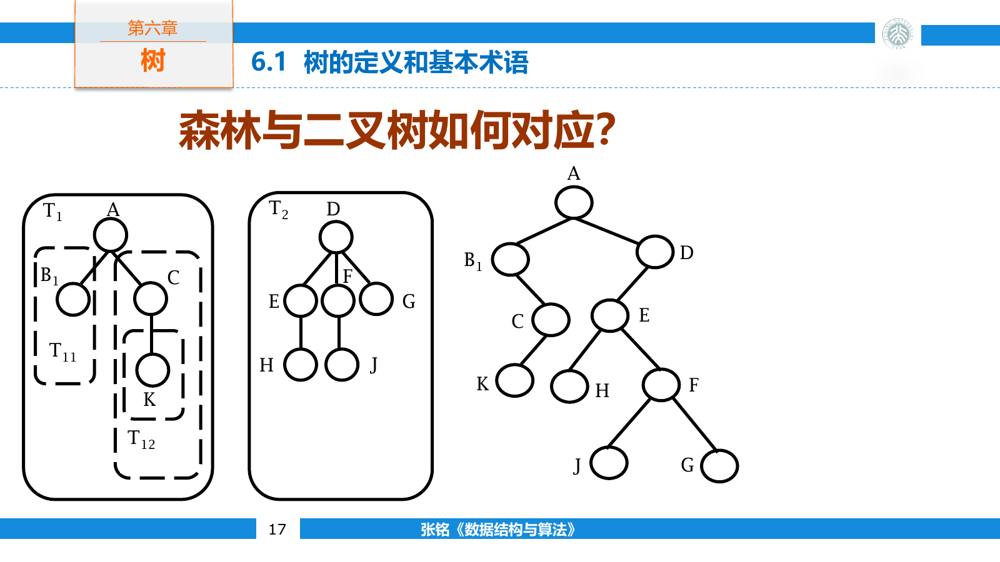
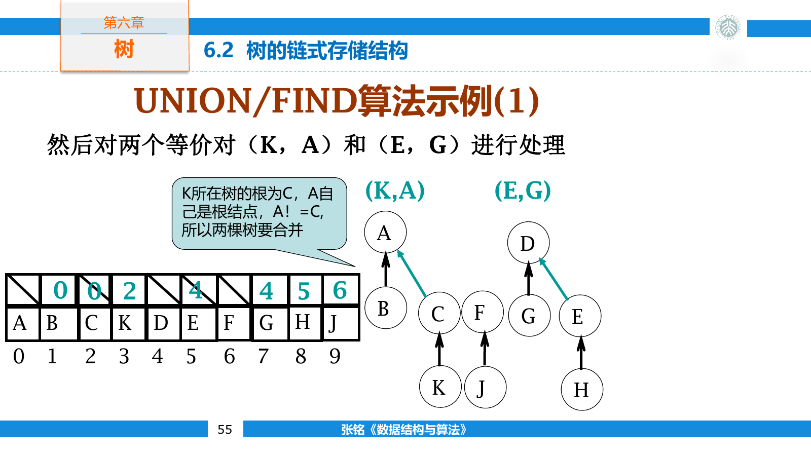

## 树与森林

树是含有有限个结点的集合。非空树有且只有一个根，其余结点被划分为若干互不相交的子树。除根以外，每个结点恰有一个父结点，但可以拥有任意多个孩子。

结点的孩子数称为度。没有孩子的结点是叶结点，其余结点是分支结点。根位于第零层，结点的层数等于父结点层数加一；最大层数称为深度，最大层数加一称为高度。

从根到某个结点经过的结点序列称为路径。结点的祖先位于这条路径上，子孙则位于以该结点为根的子树中。树中任意结点到根的路径唯一，因此含 $n$ 个结点的树恰有 $n-1$ 条边。

森林是若干棵互不相交的树组成的有序集合。删除一棵树的根，它的各棵子树便构成森林；反过来，为森林增加一个共同的根，就能得到一棵树。

### 树的表示

树形图最直观，但文本和内存需要另一种表示。嵌套括号把根写在括号前，把各棵子树依次放在括号内。例如：

```text
A(B(E, F), C, D(G))
```

表示 `A` 有三个孩子 `B C D`， `B` 有两个孩子 `E F`， `D` 有一个孩子 `G`。括号嵌套直接反映递归结构，也适合做树的序列化。

凹入表用缩进表示层次，文件目录常用路径前缀表示祖先关系。不同写法保存的是同一逻辑结构，但支持的操作不同：括号串便于传输，结点链接便于修改，父指针便于向根移动。

#### 左孩子右兄弟

一般树的结点数目不固定，直接为每个结点预留大量孩子指针会浪费空间。左孩子右兄弟表示法只保留两个链接。

- `firstChild` 指向结点的第一个孩子。
- `nextSibling` 指向结点的下一个兄弟。

```cpp
template <class T>
struct TreeNode {
    T value;
    TreeNode* firstChild = nullptr;
    TreeNode* nextSibling = nullptr;
};
```

这两个链接恰好具有二叉树的形状。一般树的第一个孩子对应二叉树的左孩子，后续兄弟对应二叉树的右孩子，因此森林与二叉树之间存在一一对应。



把森林 $F=(T_1,T_2,\ldots,T_m)$ 转为二叉树时，二叉树根取 $T_1$ 的根；根的左子树由 $T_1$ 的子树森林转换而来，右子树由剩余森林 $(T_2,\ldots,T_m)$ 转换而来。

这种表示不仅节省指针，也让一般树复用二叉树的遍历框架。森林的先根遍历对应二叉树的前序遍历，后根遍历对应二叉树的中序遍历。

右指针在转换后的二叉树里表示兄弟，而不是原树中的孩子。二叉树中序先遍历左子树，恰好先处理原结点的全部孩子，然后访问原结点，再沿右链处理兄弟，所以它对应森林的后根次序。

森林根结点之间也通过右兄弟链接相连。若只转换一棵树，它的根在二叉树中没有右孩子；否则右孩子代表森林中的下一棵树。

### 树的遍历

先根遍历先访问根，再依次遍历每棵子树。后根遍历先依次遍历子树，最后访问根。

```cpp
template <class T>
void preorderForest(TreeNode<T>* root) {
    while (root != nullptr) {
        visit(root->value);
        preorderForest(root->firstChild);
        root = root->nextSibling;
    }
}

template <class T>
void postorderForest(TreeNode<T>* root) {
    while (root != nullptr) {
        postorderForest(root->firstChild);
        visit(root->value);
        root = root->nextSibling;
    }
}
```

广度优先遍历需要先把森林中所有树根入队。每次访问一个结点后，再把它的全部孩子按兄弟次序加入队列。

```cpp
template <class T>
void breadthFirst(TreeNode<T>* root) {
    std::queue<TreeNode<T>*> pending;

    for (TreeNode<T>* node = root;
         node != nullptr;
         node = node->nextSibling) {
        pending.push(node);
    }

    while (!pending.empty()) {
        TreeNode<T>* node = pending.front();
        pending.pop();
        visit(node->value);

        for (TreeNode<T>* child = node->firstChild;
             child != nullptr;
             child = child->nextSibling) {
            pending.push(child);
        }
    }
}
```

三种遍历都访问每个结点一次，时间复杂度为 $O(n)$ 。

对括号表示 `A(B(E, F), C, D(G))`，先根序列为 `A B E F C D G`，后根序列为 `E F B C G D A`。层序序列为 `A B C D E F G`。

先根遍历与二叉树前序框架相同；后根遍历与二叉树中序的访问位置相同，但名称不能混用。一般树没有天然的“中根遍历”，因为根的多个孩子之间不存在唯一的中间位置。

### 其他存储方法

子结点表为每个结点保存一条孩子链表，枚举某个结点的所有孩子十分直接。若还要频繁查找父结点，可以额外保存父指针。

```cpp
struct ChildListNode {
    int firstChild = -1;
    int nextSibling = -1;
    int parent = -1;
};
```

同时保存孩子、兄弟和父亲会产生冗余。插入或移动子树时，三组关系必须一致更新；只读结构可以用空间换查询速度，频繁修改的结构则要减少重复状态。

父指针数组只记录每个结点的父结点下标。它能以 $O(1)$ 时间读取父结点，却不便枚举孩子。根结点可以用负值或自身下标表示，负值还可以顺便保存集合大小或秩。

顺序存储可以按先根、后根或层序排列结点，并附加度数、右兄弟下标或子树结束标记。连续存储具有良好的局部性，但插入和删除常需移动大量记录；树形频繁变化时，链接结构可以避开这些整体搬移。

先根序列只保存结点值时无法恢复树形。给每个结点再保存度数，或给“最后一个孩子”附加标记，就能判断一棵子树何时结束。后根序列配合度数也可以恢复：读到度数为 $d$ 的结点时，从工作栈中取出最近完成的 $d$ 棵子树作为它的孩子。

例如后根记录：

```text
E/0 F/0 B/2 C/0 G/0 D/1 A/3
```

读到 `B/2` 时，栈顶的 `E` 与 `F` 成为 `B` 的两个孩子；最后 `A/3` 取走已经形成的 `B C D` 三棵子树。构造过程只需一次线性扫描。

## 并查集

并查集维护一组互不相交的集合，提供两种核心操作：

- `find(x)` 返回元素 $x$ 所在集合的代表元。
- `unite(x, y)` 合并两个元素所属的集合。

每个集合可以表示成一棵父指针树，根就是代表元。两个元素拥有相同根时，它们位于同一集合。



朴素合并可能反复把一棵大树挂到单结点下面，最终形成长链。按大小合并总让较小的树接到较大的树下。一个结点的深度每增加一，所在集合大小至少翻倍，因此树高不会超过 $O(\log n)$ 。

若依次合并 `(0, 1)`、`(2, 3)` 和 `(0, 2)`，前两步形成两个大小为二的集合，第三步把其中一棵根接到另一棵根下。再执行 `find(3)` 时，搜索路径可能是 `3 -> 2 -> 0`；路径压缩后， `3` 和 `2` 都直接指向根 `0`。

路径压缩在执行 `find` 时，把搜索路径上的结点全部直接接到根上。它不会改变集合划分，却会显著加速后续查询。

```cpp
class DisjointSet {
private:
    std::vector<int> parent;
    std::vector<int> size;

public:
    explicit DisjointSet(int n) : parent(n), size(n, 1) {
        std::iota(parent.begin(), parent.end(), 0);
    }

    int find(int x) {
        if (parent[x] != x) {
            parent[x] = find(parent[x]);
        }
        return parent[x];
    }

    bool unite(int x, int y) {
        x = find(x);
        y = find(y);
        if (x == y) return false;

        if (size[x] < size[y]) std::swap(x, y);
        parent[y] = x;
        size[x] += size[y];
        return true;
    }

    bool same(int x, int y) {
        return find(x) == find(y);
    }
};
```

另一种实现把根的 `parent` 保存为集合大小的负值。非根结点保存父下标，根结点满足 `parent[root] < 0`，其绝对值就是集合大小。这样一条数组便能同时承担父指针与权重信息。

```cpp
int findRoot(std::vector<int>& parent, int x) {
    if (parent[x] < 0) return x;
    return parent[x] = findRoot(parent, parent[x]);
}

bool uniteBySize(std::vector<int>& parent, int x, int y) {
    x = findRoot(parent, x);
    y = findRoot(parent, y);
    if (x == y) return false;

    if (parent[x] > parent[y]) std::swap(x, y);
    parent[x] += parent[y];
    parent[y] = x;
    return true;
}
```

负值越小表示集合越大，所以判断条件与普通正数大小数组相反。

按大小或按秩合并与路径压缩同时使用时，连续 $m$ 次操作的总时间为

$$
O(m\alpha(n))
$$

其中 $\alpha$ 是反 Ackermann 函数。在实际可表示的输入规模内， $\alpha(n)$ 的值很小，并查集操作的均摊开销接近常数。

并查集适合处理不断加入等价关系的问题，例如动态连通性、Kruskal 最小生成树和离线合并。它不能直接支持删除关系，因为一条父指针并没有保存集合内部的完整连接结构。

并查集也不保存两个元素为何连通。若还要恢复连接路径或回答集合内部的边信息，需要额外保留生成森林，不能把压缩后的父指针当作原图路径。

## 完全 $k$ 叉树

每个结点至多拥有 $k$ 个孩子的树称为 $k$ 叉树。完全 $k$ 叉树也可以按层序连续存入数组。采用从零开始的下标时，结点 $i$ 的第 $j$ 个孩子下标为

$$
ki+j
$$

其中 $1\le j\le k$ 成立。非根结点 $i$ 的父结点下标为

$$
\left\lfloor\frac{i-1}{k}\right\rfloor
$$

二叉堆只是 $k=2$ 时的特例。增大 $k$ 会降低树高，却会让每层向下筛选比较更多孩子；分支数还会改变数组访问的局部性。

高度为 $h$ 的完美 $k$ 叉树含有的结点数为

$$
1+k+k^2+\cdots+k^h=\frac{k^{h+1}-1}{k-1}
$$

叶结点数为 $k^h$ 。含 $n$ 个结点的完全 $k$ 叉树高度为 $\Theta(\log_k n)$ 。在 $k$ 叉堆中，上浮每层只比较一次父结点，而下沉每层要从至多 $k$ 个孩子中找极值，因此增大 $k$ 对两种操作的影响并不对称。
