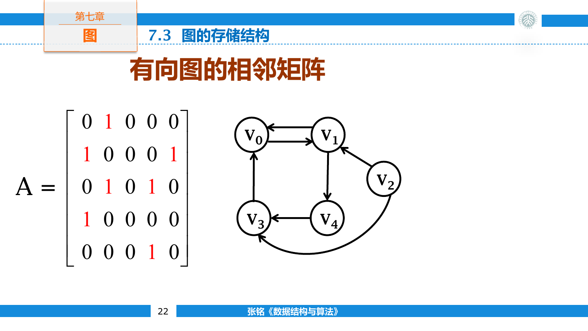
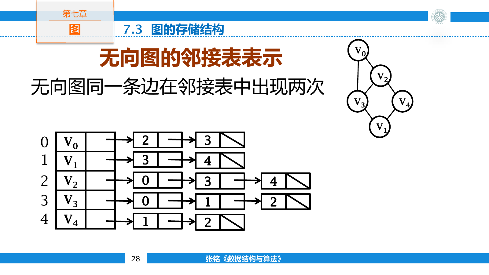
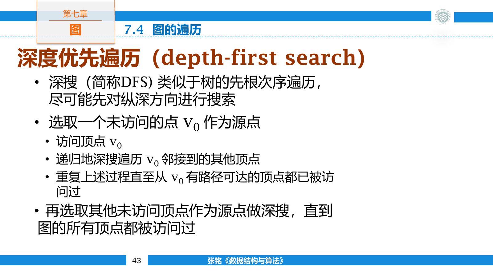
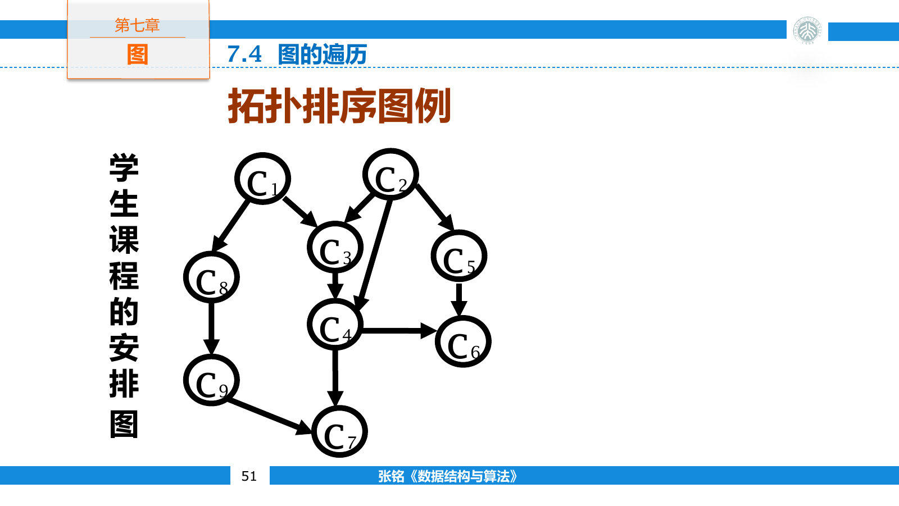
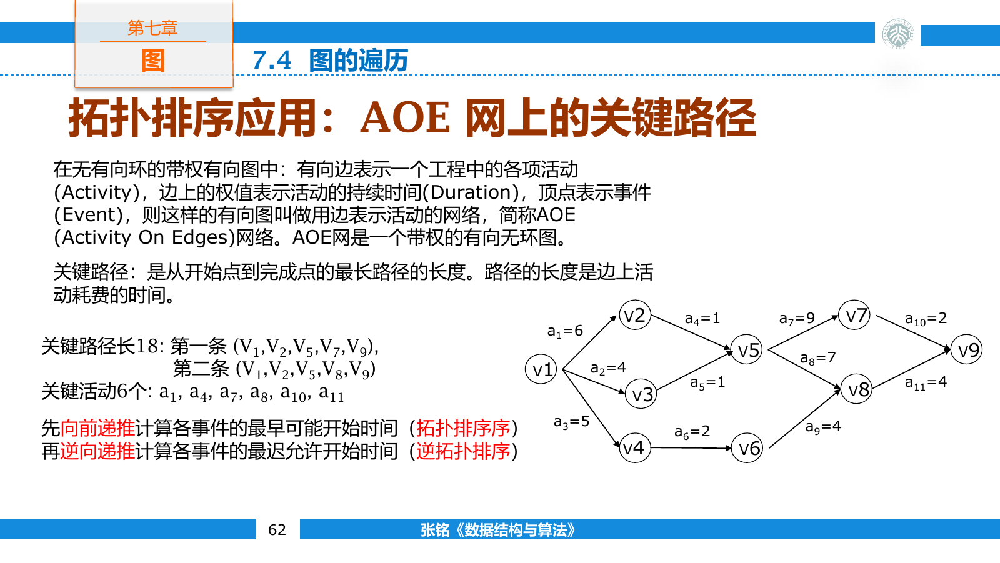
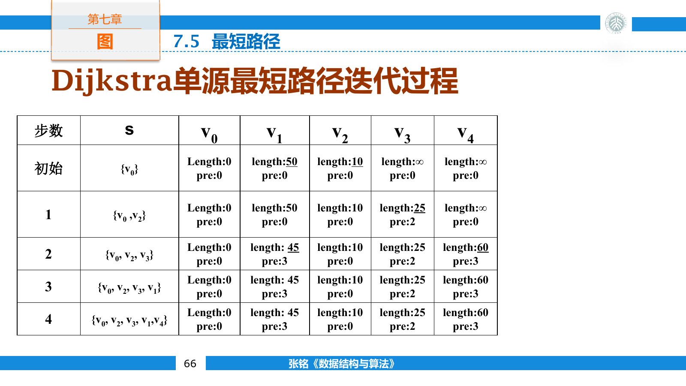
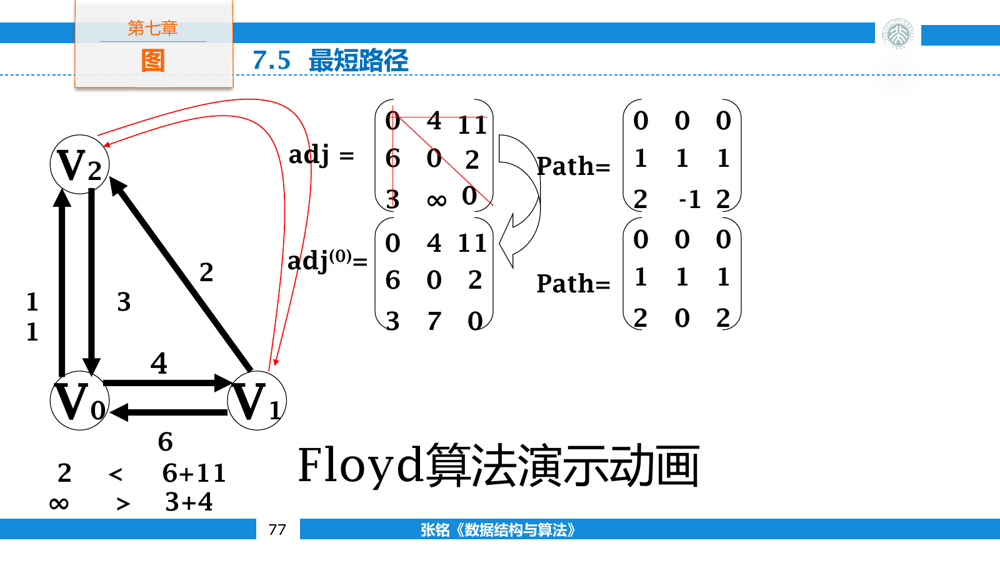
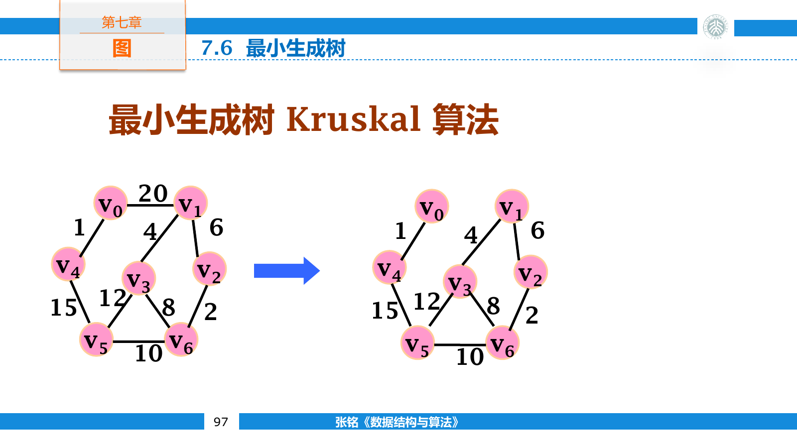
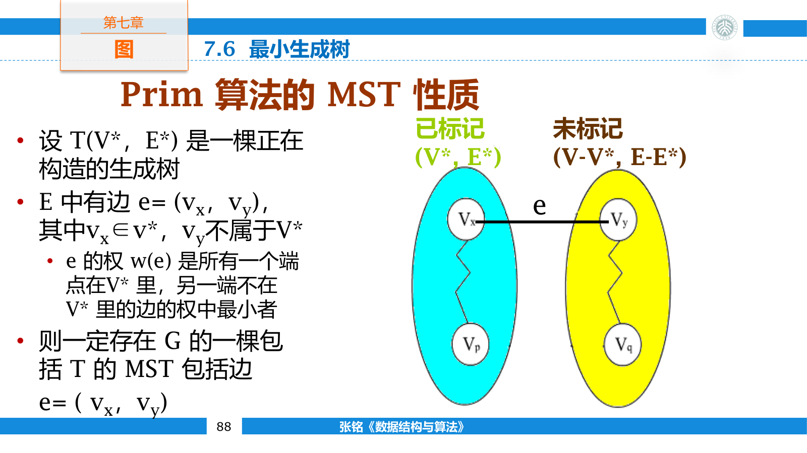
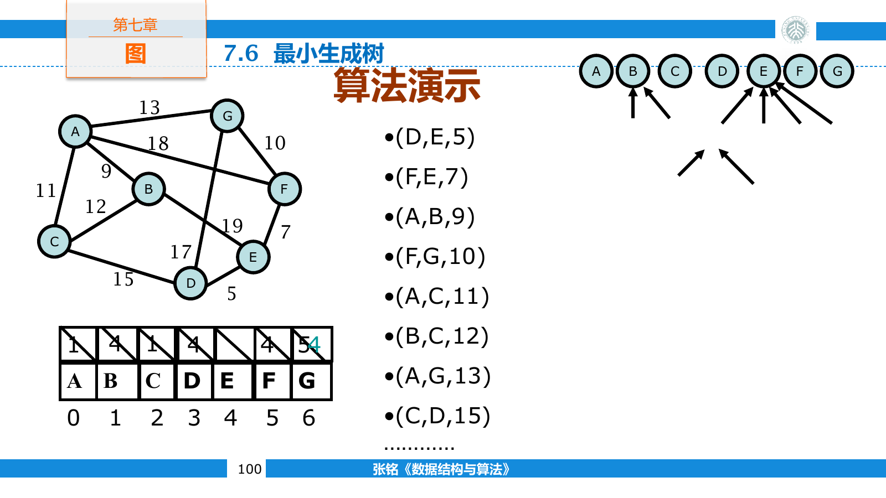

## 图的表示

图由顶点集合和边集合组成

$$
G=(V,E)
$$

无向图的边是一对无序顶点，有向图的边则有明确的起点和终点。边还可以携带距离、费用或容量等权值。

无向图中，与顶点关联的边数称为度。所有顶点的度数之和满足握手定理

$$
\sum_{v\in V}\deg(v)=2|E|
$$

有向图把度分为入度和出度，全部顶点的入度之和与出度之和都等于边数。

顶点序列 $v_0,v_1,\ldots,v_k$ 若满足相邻顶点之间均有边，就构成一条路径。除首尾外不重复经过顶点的路径称为简单路径，首尾相同的简单路径构成环。有向无环图简称 DAG。

无向图中任意两点之间都存在路径时，图是连通的；极大连通子图称为连通分量。有向图中任意两点能够互相到达时，它们强连通；极大强连通子图称为强连通分量。

简单图不含自环和重边。含 $n$ 个顶点的无向简单图至多有 $n(n-1)/2$ 条边，有向简单图至多有 $n(n-1)$ 条边。边数接近这个上界时称为稠密图，远小于平方级时称为稀疏图；这个区分会影响存储结构和算法实现。

图的抽象操作除了增加、删除顶点和边，还要支持枚举邻接点、读取边权和修改标记。算法若只通过这些接口访问图，邻接矩阵与邻接表便可以替换；实际复杂度仍取决于接口在具体表示下的成本。

### 邻接矩阵

含 $n$ 个顶点的图可以用 $n\times n$ 矩阵保存。无权图用零和一表示边是否存在，带权图在对应位置保存边权，并用无穷大或额外标志表示无边。

邻接矩阵始终占用 $O(n^2)$ 空间。检查一条边、增加边和删除边都是 $O(1)$ 时间；枚举一个顶点的所有邻居需要扫描一整行，时间为 $O(n)$ 。

无向图的邻接矩阵关于主对角线对称。有向图中第 $i$ 行的非零项对应顶点 $i$ 的出边，第 $j$ 列的非零项对应顶点 $j$ 的入边。



### 邻接表

邻接表为每个顶点保存一组出边。无向边会在两个端点的表中各出现一次，因此无向图占用 $O(|V|+2|E|)$ 空间，有向图占用 $O(|V|+|E|)$ 空间。

```cpp
struct Edge {
    int to;
    long long weight;
};

using Graph = std::vector<std::vector<Edge>>;
```

邻接表适合稀疏图，可以在与顶点度数成正比的时间内枚举邻居。检查指定两点之间是否有边则需要搜索边表，最坏时间与起点的出度成正比。



十字链表同时串联有向边的入边关系和出边关系，适合频繁沿两个方向遍历的动态图。实际程序中也可以直接同时维护原图和反图，以更简单的代码换取边记录的重复存储。

有向图的十字链表让每条边结点同时出现在起点的出边链和终点的入边链中。边记录至少保存起点、终点、下一条同起点边和下一条同终点边。删除一条边时，两条链都要解除链接。

无向图可以使用邻接多重表。每条边只保存一次，却分别带有连接两个端点边链的指针。它减少了无向边的重复记录，但结构与修改逻辑都比普通邻接表复杂。只需遍历的静态图通常仍直接保存两条有向边。

## 图的遍历

### 深度优先搜索

深度优先搜索（Depth First Search，DFS）沿未访问的边尽量深入，无法继续时回溯。访问标记既能避免环导致的死循环，也能保证每个顶点只被处理一次。

```cpp
void dfs(const Graph& graph, int u, std::vector<bool>& visited) {
    visited[u] = true;
    visit(u);

    for (const Edge& edge : graph[u]) {
        if (!visited[edge.to]) {
            dfs(graph, edge.to, visited);
        }
    }
}
```

图不连通时，仅从一个起点执行 DFS 无法覆盖全部顶点。需要依次检查所有顶点，对每个未访问顶点重新启动搜索。由此得到的多棵 DFS 树共同组成 DFS 森林。

邻接表中每个顶点和每条边只被检查常数次，DFS 的时间复杂度为 $O(|V|+|E|)$ 。邻接矩阵版本需要为每个顶点扫描整行，时间为 $O(|V|^2)$ 。

DFS 的递归进入与退出时间还能描述边的关系。无向图中，遇到已访问且不是父亲的邻居说明存在环。有向图使用三色标记时，指向递归栈中灰色顶点的边称为回边，它同样证明存在有向环。

DFS 森林中的树边记录了第一次发现顶点的来源。若为每个顶点保存进入时间和退出时间，顶点 $u$ 是 $v$ 的祖先当且仅当 $u$ 的时间区间包含 $v$ 的时间区间。这类信息可以继续用于拓扑排序、强连通分量和离线祖先查询。

### 广度优先搜索

广度优先搜索（Breadth First Search，BFS）使用队列保存已发现但尚未展开的顶点。它先访问距离起点一条边的顶点，再访问两条边的顶点，因此能求无权图中的最短路。

```cpp
std::vector<int> bfsDistance(const Graph& graph, int source) {
    std::vector<int> distance(graph.size(), -1);
    std::queue<int> pending;

    distance[source] = 0;
    pending.push(source);

    while (!pending.empty()) {
        int u = pending.front();
        pending.pop();

        for (const Edge& edge : graph[u]) {
            int v = edge.to;
            if (distance[v] != -1) continue;
            distance[v] = distance[u] + 1;
            pending.push(v);
        }
    }

    return distance;
}
```

BFS 与 DFS 的渐近时间相同，区别在于访问次序和保存的边界。DFS 的栈保存一条搜索路径，BFS 的队列保存当前层与下一层的边界。



若还要恢复最短路径，应在顶点第一次入队时记录前驱。目标不可达时距离保持为 `-1`；可达时沿前驱从目标走回源点，再反转序列。

```cpp
std::vector<int> restorePath(
    int source,
    int target,
    const std::vector<int>& previous) {
    if (previous[target] == -1) return {};

    std::vector<int> path;
    for (int vertex = target;; vertex = previous[vertex]) {
        path.push_back(vertex);
        if (vertex == source) break;
    }
    std::reverse(path.begin(), path.end());
    return path;
}
```

BFS 只保证边数最少。边权不同时，经过边更少的路径可能总权值更大，不能继续使用普通队列求带权最短路。

## 有向无环图

### 拓扑排序

DAG 的拓扑序是一个顶点排列，使每条有向边的起点都出现在终点之前。课程依赖、工程先后关系和编译任务都可以表示为拓扑排序问题。

Kahn 算法维护所有当前入度为零的顶点。取出一个顶点后，删除它的出边；某个邻居入度降为零时，再把邻居加入容器。

```cpp
std::vector<int> topologicalSort(const Graph& graph) {
    std::vector<int> indegree(graph.size());
    for (const auto& edges : graph) {
        for (const Edge& edge : edges) {
            ++indegree[edge.to];
        }
    }

    std::queue<int> ready;
    for (int i = 0; i < static_cast<int>(graph.size()); ++i) {
        if (indegree[i] == 0) ready.push(i);
    }

    std::vector<int> order;
    while (!ready.empty()) {
        int u = ready.front();
        ready.pop();
        order.push_back(u);

        for (const Edge& edge : graph[u]) {
            if (--indegree[edge.to] == 0) {
                ready.push(edge.to);
            }
        }
    }

    if (order.size() != graph.size()) return {};
    return order;
}
```

若最后输出的顶点少于 $|V|$ ，剩余子图中每个顶点都有入边，说明图中存在有向环。



把普通队列换成小根堆，可以得到字典序最小的拓扑序。拓扑序不一定唯一；某一步若同时有多个入度为零的顶点，它们之间没有被现有边约束，选择顺序可能产生不同合法结果。若每一步都只有一个可选顶点，拓扑序才唯一。

DFS 也能生成拓扑序。一个顶点的全部后继处理完毕后再把它加入序列，最后将序列反转。此时需要三色标记区分未访问、正在递归栈中和已经完成的顶点；遇到指向“正在访问”顶点的边，就是检测到了环。

### AOE 网与关键路径

活动在边上（Activity On Edge，AOE）的网络用顶点表示事件，用有向边表示活动，边权表示活动持续时间。事件只有在所有入边对应活动完成后才能发生，因此 AOE 网必须是 DAG。

从源事件到汇事件的最长路径长度决定整个工程最早何时结束，这条最长路径称为关键路径。AOE 网是 DAG，拓扑序保证所有边只从前向后，因此不会出现一般图中由正环造成的最长路无界问题。

按拓扑序计算事件最早发生时间 $ve$ 。源点时间为零，每条边 $u\to v$ 的持续时间为 $w$ 时执行

$$
ve[v]=\max(ve[v],ve[u]+w)
$$

汇点的 $ve$ 就是工程最短工期。再按逆拓扑序计算事件最迟发生时间 $vl$ ，所有值先设为工期，并执行

$$
vl[u]=\min(vl[u],vl[v]-w)
$$

对活动边 $u\to v$ ，最早开工时间为 $ve[u]$ ，在不延误总工期的前提下最迟开工时间为 $vl[v]-w$ 。二者相等的活动没有机动时间，属于关键活动。



```cpp
std::vector<std::pair<int, int>> criticalActivities(
    const Graph& graph,
    const std::vector<int>& order) {
    int n = graph.size();
    std::vector<long long> earliest(n);

    for (int u : order) {
        for (const Edge& edge : graph[u]) {
            earliest[edge.to] = std::max(
                earliest[edge.to], earliest[u] + edge.weight
            );
        }
    }

    long long duration = *std::max_element(earliest.begin(), earliest.end());
    std::vector<long long> latest(n, duration);

    for (auto it = order.rbegin(); it != order.rend(); ++it) {
        int u = *it;
        for (const Edge& edge : graph[u]) {
            latest[u] = std::min(
                latest[u], latest[edge.to] - edge.weight
            );
        }
    }

    std::vector<std::pair<int, int>> answer;
    for (int u = 0; u < n; ++u) {
        for (const Edge& edge : graph[u]) {
            if (earliest[u] == latest[edge.to] - edge.weight) {
                answer.push_back({u, edge.to});
            }
        }
    }
    return answer;
}
```

关键活动可能组成多条关键路径。缩短一条关键活动不一定缩短总工期，因为另一条等长关键路径仍可能决定汇点时间。

## 最短路

### 单源最短路

设 `dist[v]` 表示当前已知的源点到 $v$ 的最短距离上界。沿边 $(u,v,w)$ 尝试改进距离的操作称为松弛

$$
dist[v]\leftarrow\min(dist[v],dist[u]+w)
$$

Dijkstra 算法适用于边权非负的图。它反复选取尚未确定且距离最小的顶点 $u$ ，把 $u$ 标记为已确定，再松弛它的所有出边。



```cpp
std::vector<long long> dijkstra(const Graph& graph, int source) {
    const long long inf = std::numeric_limits<long long>::max() / 4;
    std::vector<long long> distance(graph.size(), inf);

    using State = std::pair<long long, int>;
    std::priority_queue<State, std::vector<State>, std::greater<State>> heap;

    distance[source] = 0;
    heap.push({0, source});

    while (!heap.empty()) {
        auto [currentDistance, u] = heap.top();
        heap.pop();
        if (currentDistance != distance[u]) continue;

        for (const Edge& edge : graph[u]) {
            long long candidate = currentDistance + edge.weight;
            if (candidate >= distance[edge.to]) continue;
            distance[edge.to] = candidate;
            heap.push({candidate, edge.to});
        }
    }

    return distance;
}
```

优先队列中可能同时保留同一顶点的多个旧距离。弹出后与 `distance[u]` 比较即可丢弃过期记录，不必实现堆内修改键值。邻接表配合二叉堆的时间复杂度为

$$
O((|V|+|E|)\log |V|)
$$

非负边权保证最小未确定距离不会在以后被改小。只要存在负权边，这个贪心不变量就可能失效，即使图中没有负环也不能继续使用 Dijkstra。含负权边时可以使用 Bellman-Ford；存在从源点可达的负环时，相关顶点不存在有限最短距离。

Dijkstra 确定顶点 $u$ 时，所有尚未确定顶点的暂定距离都不小于 $dist[u]$ 。任何以后才被发现的替代路径必须先经过某个未确定顶点，非负边权使这条路径不可能再降到 $dist[u]$ 以下。负权边允许后续路径越过这一界，贪心结论也就不再成立。

恢复路径时，在每次成功松弛后令 `previous[v] = u`。优先队列中的旧记录可以丢弃，但前驱数组只对应当前最短距离，不能在未改进距离时覆盖。

### 任意两点最短路

Floyd-Warshall 使用动态规划计算所有点对之间的最短距离。令 $d^{(k)}[i][j]$ 表示只允许编号不超过 $k$ 的顶点作为中间点时，从 $i$ 到 $j$ 的最短距离。最短路径要么不经过顶点 $k$ ，要么由经过 $k$ 的两段路径组成

$$
d^{(k)}[i][j]=\min\left(d^{(k-1)}[i][j],d^{(k-1)}[i][k]+d^{(k-1)}[k][j]\right)
$$



状态可以原地压缩成一个二维矩阵

```cpp
void floydWarshall(std::vector<std::vector<long long>>& distance,
                   long long infinity) {
    int n = distance.size();
    for (int k = 0; k < n; ++k) {
        for (int i = 0; i < n; ++i) {
            for (int j = 0; j < n; ++j) {
                if (distance[i][k] == infinity ||
                    distance[k][j] == infinity) {
                    continue;
                }
                distance[i][j] = std::min(
                    distance[i][j],
                    distance[i][k] + distance[k][j]
                );
            }
        }
    }
}
```

实现时需要避免无穷大参与加法导致溢出。Floyd-Warshall 的时间复杂度为 $O(|V|^3)$ ，空间复杂度为 $O(|V|^2)$ 。它允许负权边；若最终出现 $distance[i][i]<0$ ，说明存在可从 $i$ 到达并返回的负环。

路径恢复可以额外保存 `next[i][j]`，表示从 $i$ 前往 $j$ 的最短路第一步。当经过 $k$ 得到更短路径时，令 `next[i][j] = next[i][k]`。之后从 $i$ 开始反复跳到 `next[current][j]`，直到到达 $j$ 。

外层循环必须枚举中间点 $k$ 。若把 $i$ 或 $j$ 放到最外层，原地数组中已经更新与尚未更新的状态会混在一起，不再对应“只允许前 $k$ 个中间点”的动态规划阶段。

## 最小生成树

图的生成树包含全部顶点，并用恰好 $|V|-1$ 条边保持连通。各边权值之和称为生成树的代价，代价最小的生成树称为最小生成树（Minimum-cost Spanning Tree，MST）。

MST 与最短路径解决的是不同问题。最短路径要求某些点对之间的路线最短，MST 只要求全图连通时总边权最小，树中两点之间的路径不一定是原图最短路。



### Prim

把正在构造的生成树记为 $T=(V^\ast,E^\ast)$ 。从任意起点 `s` 开始时，`V*` 只含 `s`，`E*` 为空。随后反复寻找一条最轻边：它的一个端点已经位于 `V*`，另一个端点还在 `V*` 之外。加入这条边及其树外端点后，继续下一轮，直到全部顶点都进入 `V*`。

#### MST 性质

设 `e = (vx, vy)` 是当前跨越已标记与未标记顶点的最轻边，其中 `vx` 位于 `V*`，`vy` 位于 `V*` 之外。MST 性质保证，一定存在一棵同时包含当前部分树 `T` 与边 `e` 的最小生成树。



证明使用交换边。假设所有包含 `T` 的 MST 都不包含 `e`，任取其中一棵 `T'`。由于 `T'` 连通，从 `vx` 到 `vy` 的路径上必有另一条边 `e'` 跨越同一道分界。把 `e` 加入 `T'` 会形成一个环，再从环中删去 `e'`，便得到另一棵生成树 `T''`。

`e` 是所有跨界边中最轻的，因此 `w(e) <= w(e')`，`T''` 的总代价不会大于 `T'`。于是 `T''` 仍是 MST，而且既包含 `T` 又包含 `e`，与假设矛盾。Prim 从一个顶点和零条边开始，每一步都加入一条可以属于某棵 MST 的边，最终得到最小生成树。

#### D 数组实现

`D` 数组维护树外顶点。`D[v].length` 表示当前树连接到 `v` 的最小边权，`D[v].parent` 保存这条边在树内的端点。每加入一个顶点，只需扫描它的邻边并刷新对应的 `D` 值，然后在线性表中找出最小值。

```cpp
struct MstEdge {
    int from;
    int to;
    long long weight;
};

std::vector<MstEdge> prim(const Graph& graph, int start = 0) {
    if (graph.empty()) return {};

    const long long inf = std::numeric_limits<long long>::max() / 4;
    int vertexCount = static_cast<int>(graph.size());
    std::vector<bool> visited(vertexCount, false);
    std::vector<long long> best(vertexCount, inf);
    std::vector<int> parent(vertexCount, -1);
    std::vector<MstEdge> mst;
    mst.reserve(vertexCount - 1);

    best[start] = 0;

    for (int count = 0; count < vertexCount; ++count) {
        int v = -1;
        for (int u = 0; u < vertexCount; ++u) {
            if (!visited[u] &&
                (v == -1 || best[u] < best[v])) {
                v = u;
            }
        }

        if (v == -1 || best[v] == inf) {
            throw std::runtime_error("graph is disconnected");
        }

        visited[v] = true;
        if (parent[v] != -1) {
            mst.push_back({parent[v], v, best[v]});
        }

        for (const Edge& edge : graph[v]) {
            if (!visited[edge.to] && edge.weight < best[edge.to]) {
                best[edge.to] = edge.weight;
                parent[edge.to] = v;
            }
        }
    }

    return mst;
}
```

`best[start]` 的零只负责选出起点，不对应生成树中的边。若某一轮找不到有限的最小值，说明仍有顶点无法从当前连通分量到达，原图不存在覆盖全部顶点的生成树。

直接扫描 `D` 数组寻找最小值需要 $O(|V|^2)$ 时间，所有邻边更新共需 $O(|E|)$ 时间，因此该实现以 $O(|V|^2)$ 为主，适合稠密图。稀疏图可以像 Dijkstra 一样用最小堆维护 `D` 值。

Prim 与 Dijkstra 的框架相似，但 `D` 的含义不同。Dijkstra 保存从源点出发的累积距离；Prim 保存当前树连接到树外顶点的单条最轻边，更新时直接比较 `edge.weight`，不与此前路径相加。

### Kruskal

Kruskal 从没有边的森林开始，把每个顶点看作一个独立的连通分量。所有边按权值从小到大取出：若一条边连接两个不同分量，就把它加入森林并合并这两个分量；若两个端点已经连通，加入该边会形成环，因此直接舍去。所有顶点合并为一个分量后，森林便成为 MST。

候选边保存在最小堆中，顶点所属的连通分量由并查集维护。无向图从邻接表收集边时，同一条边会出现两次，可以只保留 `from < to` 的一份。

```cpp
struct HeavierEdge {
    bool operator()(const MstEdge& left, const MstEdge& right) const {
        return left.weight > right.weight;
    }
};

std::vector<MstEdge> kruskal(int vertexCount,
                             const std::vector<MstEdge>& edges) {
    if (vertexCount == 0) return {};

    std::priority_queue<MstEdge,
                        std::vector<MstEdge>,
                        HeavierEdge> heap;
    for (const MstEdge& edge : edges) {
        heap.push(edge);
    }

    DisjointSet sets(vertexCount);
    std::vector<MstEdge> mst;
    mst.reserve(vertexCount - 1);
    int componentCount = vertexCount;

    while (componentCount > 1) {
        if (heap.empty()) {
            throw std::runtime_error("graph is disconnected");
        }

        MstEdge edge = heap.top();
        heap.pop();
        if (!sets.unite(edge.from, edge.to)) continue;

        mst.push_back(edge);
        --componentCount;
    }

    return mst;
}
```

例如依次检查 `(D,E,5)`、`(F,E,7)`、`(A,B,9)`、`(F,G,10)` 与 `(A,C,11)`。轮到 `(B,C,12)` 时，`B` 与 `C` 已在同一等价类中，这条边会成环，因此跳过；再加入 `(A,G,13)` 后，全部顶点归入同一分量。



路径压缩与按大小合并使并查集的查询、合并开销接近常数。构造出 $|V|-1$ 条树边后即可停止，实际取出的候选边可能只比顶点数略多；最坏情况下仍可能检查几乎全部边，建堆与取边的总复杂度为 $O(|E|\log |E|)$ 。

最小生成树不一定唯一。若所有边权互不相同，MST 一定唯一；存在相同边权时，不同的安全边选择可能得到代价相同的多棵生成树。图不连通时，Prim 会留下不可达顶点，Kruskal 会在等价类尚未合并完时耗尽候选边，此时不存在覆盖全部顶点的 MST。
