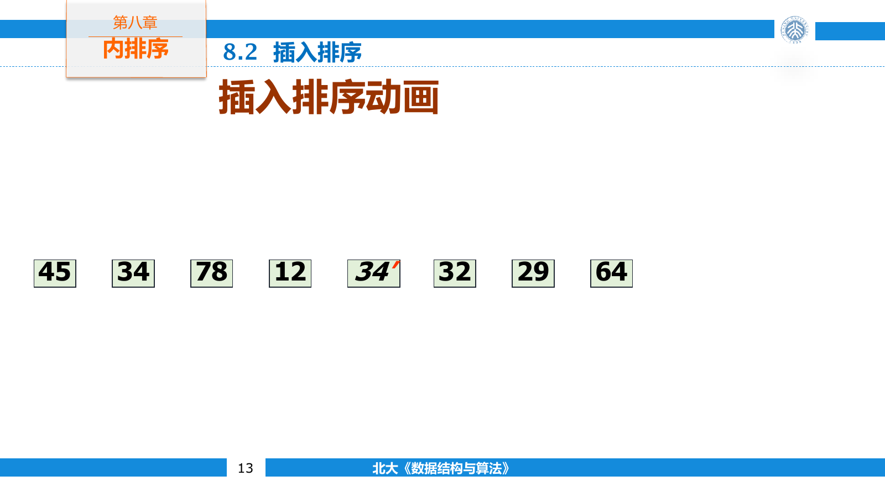
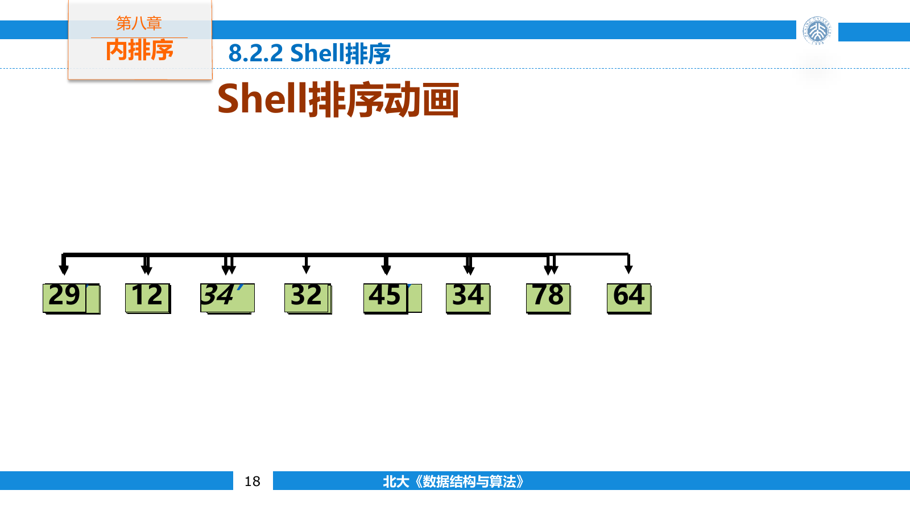
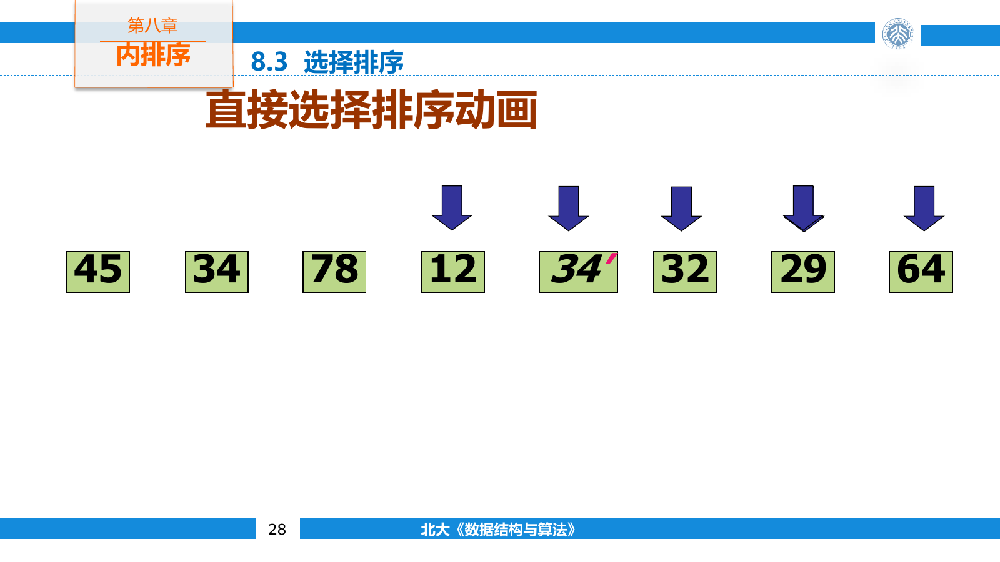
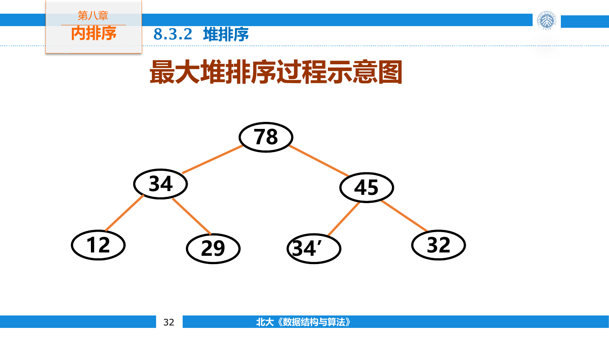
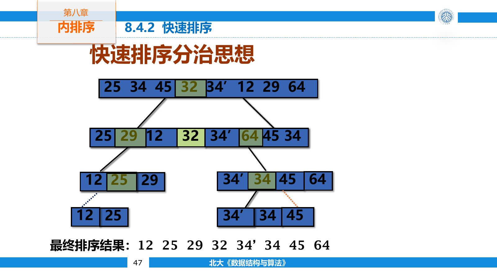
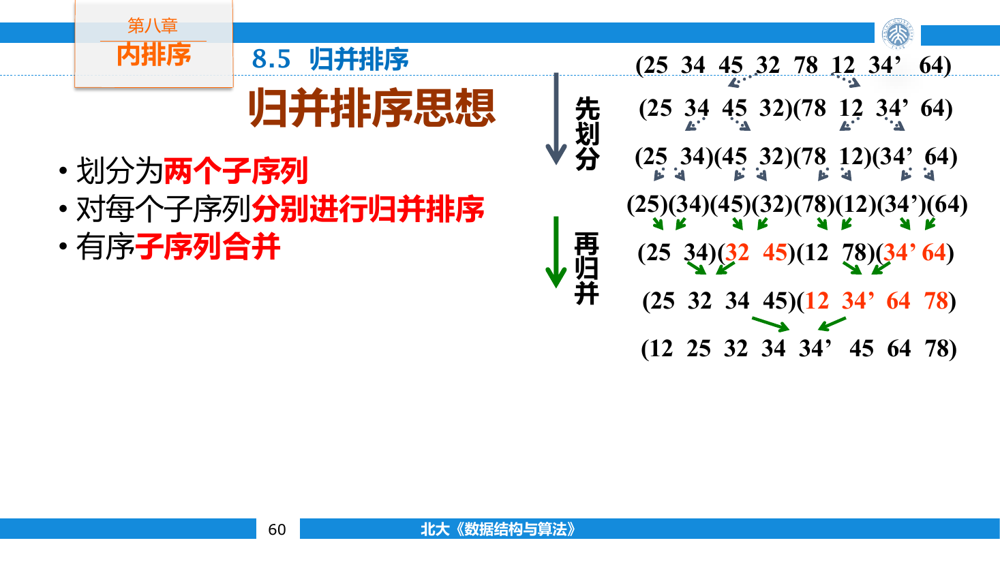
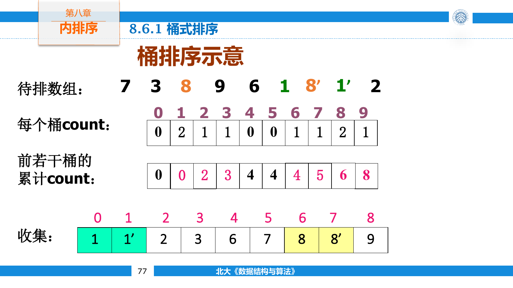
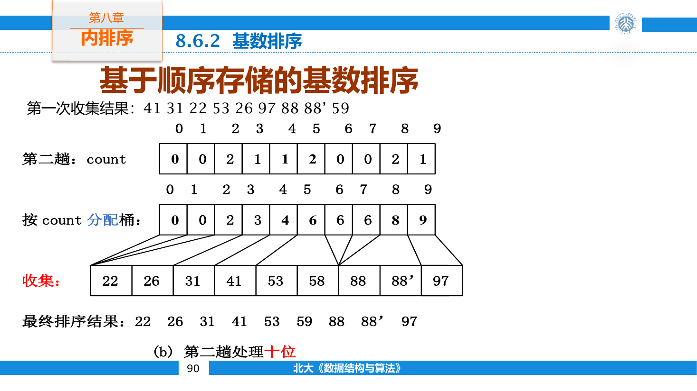
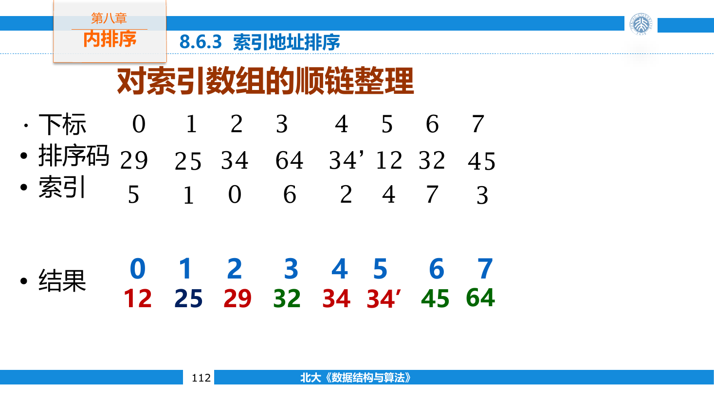
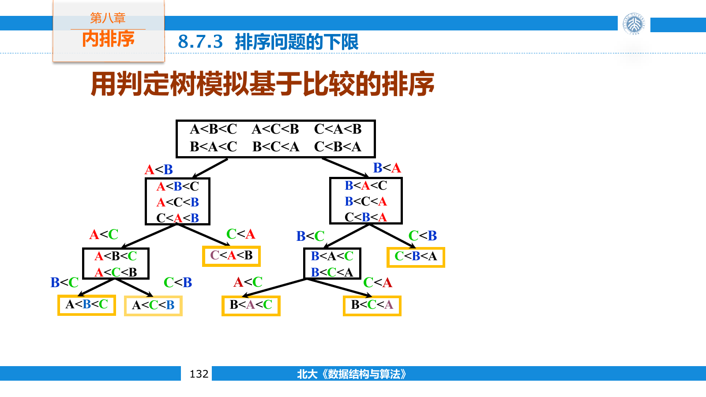

## 排序问题

排序按记录的键重新排列序列，使键值满足单调关系。若全部记录都能放入主存，排序过程称为内排序；数据规模超过内存、必须借助外存时，则属于外排序。

当多个记录具有相同键时，稳定排序会保留它们原来的相对次序。稳定性对多级排序十分重要：先按次要键稳定排序，再按主要键稳定排序，就能得到正确的联合顺序。

比较次数并不是排序的唯一成本。记录移动、辅助空间、稳定性、输入初始状态和记录本身的大小，也会改变实际表现。

排序对象通常是一条完整记录，排序码只是记录中的某个字段。例如学生记录可以按学号、姓名或成绩排序。算法交换的是记录或记录引用，比较的却是选定字段。

稳定性只约束键相同的记录。若原序列中记录 $x$ 位于记录 $y$ 之前，并且两者排序码相等，稳定排序后 $x$ 仍应位于 $y$ 之前。证明稳定性要说明算法不会让相等记录越过彼此；证明不稳定只需给出一个反例。

序列中满足 $i<j$ 且 $a_i>a_j$ 的下标对称为逆序对。正序列的逆序对数量为零，严格逆序列有 $n(n-1)/2$ 个。很多排序算法的移动次数可以用逆序对解释。

## 比较排序

### 直接插入排序

插入排序始终维护一个已经有序的前缀。处理第 $i$ 个元素时，先保存它，再把前缀中所有更大的元素向右移动一格，最后放入空出的插入位置。



```cpp
template <class T>
void insertionSort(std::vector<T>& data) {
    for (int i = 1; i < static_cast<int>(data.size()); ++i) {
        T value = std::move(data[i]);
        int j = i;

        while (j > 0 && value < data[j - 1]) {
            data[j] = std::move(data[j - 1]);
            --j;
        }
        data[j] = std::move(value);
    }
}
```

循环开始时，区间 $[0,i)$ 已经有序；循环结束后，区间 $[0,i]$ 仍包含相同元素并保持有序。这就是算法的循环不变量。

正序输入只需每轮比较一次，时间为 $O(n)$ 。逆序输入需要移动

$$
1+2+\cdots+(n-1)=\frac{n(n-1)}{2}
$$

个元素，时间为 $O(n^2)$ 。插入时只移动严格大于当前值的元素，因此相等元素不会交换相对次序，算法是稳定的。

插入排序在规模小或接近有序的序列上表现很好，常被用作快速排序与归并排序的小区间收尾算法。二分查找可以减少寻找插入位置的比较次数，却无法减少线性移动，所以总体复杂度仍是 $O(n^2)$ 。

对序列 `[5, 2, 4, 6, 1, 3]`，处理 `4` 时有序前缀是 `[2, 5]`。先把 `5` 右移，再把 `4` 放入空位，前缀变成 `[2, 4, 5]`。这里使用“移动后插入”而不是一路交换，可以减少对大记录的写入次数。

每把一个元素向左跨过一个较大元素，就恰好消除一个逆序对，所以插入排序的移动次数为 $\Theta(n+I)$ ，其中 $I$ 是输入逆序对数。近乎有序时 $I$ 很小，这比只写最好 $O(n)$ 、最坏 $O(n^2)$ 更能解释它的实际表现。

### Shell 排序

直接插入排序只能让元素逐格移动。Shell 排序先按较大的间隔把序列分成若干子序列，对每个子序列做插入排序，再逐步缩小间隔，最后以间隔一完成全局排序。



```cpp
template <class T>
void shellSort(std::vector<T>& data) {
    for (int gap = data.size() / 2; gap > 0; gap /= 2) {
        for (int i = gap; i < static_cast<int>(data.size()); ++i) {
            T value = std::move(data[i]);
            int j = i;

            while (j >= gap && value < data[j - gap]) {
                data[j] = std::move(data[j - gap]);
                j -= gap;
            }
            data[j] = std::move(value);
        }
    }
}
```

较大的间隔能让远离目标位置的元素快速移动，最后一轮面对的序列已经接近有序。Shell 排序的复杂度取决于增量序列，不能脱离增量给出唯一紧确界。算法通常只需 $O(1)$ 辅助空间，但跨间隔交换可能改变相等元素的相对顺序，因此不稳定。

间隔为 $g$ 时，下标同余的元素属于同一组。例如 $g=3$ 会分别处理下标 `0,3,6...`、`1,4,7...` 和 `2,5,8...`。一轮结束后只保证每组内部有序，不保证相邻元素有序。

增量序列必须以一结束，否则不同余数类之间永远不会完成比较。简单的不断除二容易实现，但不是唯一选择；Hibbard、Knuth 等序列会避开某些重复工作。Shell 排序的精确界与这些数列有关，不能只根据代码中的两层循环断定为 $O(n^2)$ 。

### 选择排序

直接选择排序维护已经就位的前缀。第 $i$ 轮在后缀中寻找最小元素，并与位置 $i$ 交换。



```cpp
template <class T>
void selectionSort(std::vector<T>& data) {
    for (int i = 0; i < static_cast<int>(data.size()); ++i) {
        int minimum = i;
        for (int j = i + 1; j < static_cast<int>(data.size()); ++j) {
            if (data[j] < data[minimum]) minimum = j;
        }
        std::swap(data[i], data[minimum]);
    }
}
```

无论输入是否有序，它都要进行约 $n^2/2$ 次比较，因此最好、平均和最坏时间均为 $O(n^2)$ 。每轮至多交换一次；记录很大而比较较便宜时，选择排序可以减少数据搬移。

一次远距离交换可能跨过相同键的记录，所以普通选择排序不稳定。

例如记录序列为 `2a, 2b, 1`。第一轮找到 `1` 并与 `2a` 交换，结果成为 `1, 2b, 2a`，两个键为二的记录次序被颠倒。若不是交换，而是取出最小记录并把中间区间整体右移，选择排序可以改成稳定版本，但移动次数会上升。

### 堆排序

堆排序用最大堆维护未排序区间。建立最大堆后，根结点是全局最大元素；把根与末尾交换，缩小堆区间，再向下筛选新的根。



```cpp
template <class T>
void siftDown(std::vector<T>& data, int root, int size) {
    while (2 * root + 1 < size) {
        int child = 2 * root + 1;
        if (child + 1 < size && data[child] < data[child + 1]) {
            ++child;
        }
        if (!(data[root] < data[child])) break;
        std::swap(data[root], data[child]);
        root = child;
    }
}

template <class T>
void heapSort(std::vector<T>& data) {
    for (int i = static_cast<int>(data.size()) / 2 - 1; i >= 0; --i) {
        siftDown(data, i, data.size());
    }

    for (int size = data.size(); size > 1; --size) {
        std::swap(data[0], data[size - 1]);
        siftDown(data, 0, size - 1);
    }
}
```

建堆为 $O(n)$ 时间，随后执行 $n-1$ 次 $O(\log n)$ 的删除极值操作，总时间为 $O(n\log n)$ 。堆排序原地完成，只需 $O(1)$ 额外空间；根与末尾的远距离交换使它不稳定。

### 冒泡排序

冒泡排序反复比较相邻元素，把较大的元素向右交换。每轮结束时，当前未排序区间的最大元素落在末端。

```cpp
template <class T>
void bubbleSort(std::vector<T>& data) {
    for (int end = data.size(); end > 1; --end) {
        bool changed = false;
        for (int i = 1; i < end; ++i) {
            if (data[i] < data[i - 1]) {
                std::swap(data[i], data[i - 1]);
                changed = true;
            }
        }
        if (!changed) break;
    }
}
```

设置交换标志后，正序输入可在 $O(n)$ 时间内结束；平均和最坏时间仍为 $O(n^2)$ 。相等元素不交换，所以算法稳定。

冒泡排序通过相邻交换消除逆序对。每次交换恰好减少一个逆序对，因此移动次数直接受输入逆序程度影响。

### 快速排序

快速排序选择一个枢轴，把区间划分为不大于枢轴和不小于枢轴的两部分，再递归处理两边。划分完成时，至少能确定枢轴的最终位置，或保证两个子区间满足明确的大小关系。



这里使用 Hoare 风格的双指针划分。

```cpp
template <class T>
void quickSort(std::vector<T>& data, int left, int right) {
    if (left >= right) return;

    T pivot = data[left + (right - left) / 2];
    int i = left;
    int j = right;

    while (i <= j) {
        while (data[i] < pivot) ++i;
        while (pivot < data[j]) --j;

        if (i <= j) {
            std::swap(data[i], data[j]);
            ++i;
            --j;
        }
    }

    if (left < j) quickSort(data, left, j);
    if (i < right) quickSort(data, i, right);
}
```

划分本身为线性时间。若每次都接近均分，递归关系为

$$
T(n)=2T(n/2)+O(n)
$$

解得 $T(n)=O(n\log n)$ 。若枢轴反复成为区间极值，递归关系退化为

$$
T(n)=T(n-1)+O(n)
$$

此时总时间为 $O(n^2)$ ，递归栈也可能增长到 $O(n)$ 。

随机选择枢轴、三数取中和三路划分都能降低退化风险。先递归处理较短区间，再用循环处理较长区间，可以把额外栈空间限制在 $O(\log n)$ 。快速排序会跨越远距离交换相等元素，因此通常不稳定。

大量重复键会让普通二路划分产生许多没有意义的递归。三路划分维护小于、等于和大于枢轴的三个区域，等于枢轴的整段不再递归。

```cpp
template <class T>
void quickSortThreeWay(std::vector<T>& data, int left, int right) {
    if (left >= right) return;

    T pivot = data[left];
    int less = left;
    int current = left + 1;
    int greater = right;

    while (current <= greater) {
        if (data[current] < pivot) {
            std::swap(data[less++], data[current++]);
        } else if (pivot < data[current]) {
            std::swap(data[current], data[greater--]);
        } else {
            ++current;
        }
    }

    quickSortThreeWay(data, left, less - 1);
    quickSortThreeWay(data, greater + 1, right);
}
```

循环中三个已确定区间分别是 `[left, less)`、`[less, current)` 与 `(greater, right]`。交换右侧元素后不能立刻增加 `current`，因为换过来的新值还没有分类。

### 归并排序

归并排序把序列分成两半，分别排序后再线性合并。合并时只比较两个有序子序列的首个未处理元素，把较小者放入临时数组。



```cpp
template <class T>
void mergeSort(std::vector<T>& data,
               std::vector<T>& buffer,
               int left,
               int right) {
    if (right - left <= 1) return;

    int middle = left + (right - left) / 2;
    mergeSort(data, buffer, left, middle);
    mergeSort(data, buffer, middle, right);

    int i = left;
    int j = middle;
    int out = left;

    while (i < middle && j < right) {
        if (!(data[j] < data[i])) {
            buffer[out++] = data[i++];
        } else {
            buffer[out++] = data[j++];
        }
    }
    while (i < middle) buffer[out++] = data[i++];
    while (j < right) buffer[out++] = data[j++];

    for (int k = left; k < right; ++k) {
        data[k] = std::move(buffer[k]);
    }
}
```

递归树每层处理 $O(n)$ 个元素，共有 $O(\log n)$ 层，因此最好、平均和最坏时间均为 $O(n\log n)$ 。数组实现需要 $O(n)$ 辅助空间。

当两边键相等时优先取左侧元素，能够保留原始相对次序，所以归并排序稳定。链表归并只需修改链接，不必申请等长数组；外排序也以归并为核心，因为它能顺序读写外存。

归并排序也可以自底向上执行。先把相邻的单元素段两两合并，再依次合并长度为二、四、八的有序段。它省去了递归调用，并且更容易扩展到链表与外存顺串。

```cpp
for (int width = 1; width < n; width *= 2) {
    for (int left = 0; left < n; left += 2 * width) {
        int middle = std::min(left + width, n);
        int right = std::min(left + 2 * width, n);
        mergeRange(data, buffer, left, middle, right);
    }
}
```

最后一组可能不足两个完整区间，所以边界都要与 $n$ 取最小值。

## 非比较排序

### 计数与桶式分配

若键是范围有限的整数，可以不通过两两比较排序。计数排序先统计每个键出现次数，再计算每个键在输出数组中的结束位置。



```cpp
std::vector<int> countingSort(const std::vector<int>& data, int maximum) {
    std::vector<int> count(maximum + 1);
    for (int value : data) ++count[value];

    for (int value = 1; value <= maximum; ++value) {
        count[value] += count[value - 1];
    }

    std::vector<int> result(data.size());
    for (int i = static_cast<int>(data.size()) - 1; i >= 0; --i) {
        result[--count[data[i]]] = data[i];
    }
    return result;
}
```

从后向前填写输出可以保持相等元素的顺序。键范围大小为 $m$ 时，时间和额外空间均为 $O(n+m)$ 。当 $m$ 远大于 $n$ 时，清空和扫描计数数组可能比比较排序更昂贵。

键值不从零开始时，可以先减去最小键。若最小值为 `minimum`、最大值为 `maximum`，计数数组长度为 `maximum - minimum + 1`。这个差值本身可能溢出或过大，分配前要检查范围。

桶排序把键映射到若干桶中，桶内分别排序后按桶序连接。它的性能依赖分布是否均匀；若全部元素落入同一桶，复杂度退化为桶内排序的复杂度。

### 基数排序

基数排序把键拆成若干位，逐位执行稳定的分配排序。低位优先（Least Significant Digit，LSD）方法先排最低位，再向高位推进。后续轮次必须稳定，才能保留此前低位建立的顺序。



设每个键有 $d$ 位，每位有 $r$ 种取值，使用计数排序处理每一位时，总时间为

$$
O(d(n+r))
$$

额外空间为 $O(n+r)$ 。基数排序的“线性”依赖 $d$ 和 $r$ 的取值；若把任意长整数的位数也计入输入规模，就不能简单省略 $d$ 。

最高位优先（Most Significant Digit，MSD）先按高位分桶，再递归处理每个桶。它能提前跳过已经只有一个元素的桶，但递归结构与变长键边界更复杂。字符串字典序排序常采用 MSD，定长非负整数则很适合 LSD。

有符号整数不能直接按普通二进制位从低到高排序，因为符号位的顺序与无符号值不同。实现中可以翻转最高符号位，或先把负数与非负数分开处理。

## 间接排序

当记录很大、移动成本远高于比较成本时，可以先排序一个下标数组。索引数组的元素只是整数，交换代价较小，原记录暂时保持不动。

若 `index[i]` 表示有序位置 $i$ 应读取原数组的哪个位置，则比较操作改为比较 `data[index[i]]`。得到排列后，可以保留间接访问形式，也可以按排列环原地整理记录。

每个排列都能分解成若干互不相交的环。沿每个环搬移记录时，每条位置关系只处理一次，因此最终整理为 $O(n)$ 时间。



若记录之后只用于按序扫描，也可以一直保留下标数组，完全避免移动原记录。代价是每次访问多一次间接寻址，局部性也不如真正重排后的连续数据。

## 下界与对比

### 比较排序的下界

只通过比较决定顺序的算法可以表示为一棵决策树。每个内部结点代表一次比较，每个叶结点代表一种可能的排列。含 $n$ 个互异元素时共有 $n!$ 种排列，因此决策树至少有 $n!$ 个叶结点。



高度为 $h$ 的二叉树最多有 $2^h$ 个叶结点，所以

$$
2^h\ge n!
$$

进而得到

$$
h\ge\log_2(n!)=\Omega(n\log n)
$$

任何比较排序在最坏情况下都至少需要 $\Omega(n\log n)$ 次比较。归并排序、堆排序和平均情况下的快速排序达到了这一数量级。计数排序与基数排序能够突破它，是因为它们利用了键的额外结构，并非只靠比较。

### 算法对比

| 算法 | 最好时间 | 平均时间 | 最坏时间 | 辅助空间 | 稳定 |
| --- | --- | --- | --- | --- | --- |
| 直接插入 | $O(n)$ | $O(n^2)$ | $O(n^2)$ | $O(1)$ | 是 |
| 直接选择 | $O(n^2)$ | $O(n^2)$ | $O(n^2)$ | $O(1)$ | 否 |
| 冒泡 | $O(n)$ | $O(n^2)$ | $O(n^2)$ | $O(1)$ | 是 |
| 快速排序 | $O(n\log n)$ | $O(n\log n)$ | $O(n^2)$ | $O(\log n)$ 平均 | 否 |
| 归并排序 | $O(n\log n)$ | $O(n\log n)$ | $O(n\log n)$ | $O(n)$ | 是 |
| 堆排序 | $O(n\log n)$ | $O(n\log n)$ | $O(n\log n)$ | $O(1)$ | 否 |
| 计数排序 | $O(n+m)$ | $O(n+m)$ | $O(n+m)$ | $O(n+m)$ | 可稳定 |
| 基数排序 | $O(d(n+r))$ | $O(d(n+r))$ | $O(d(n+r))$ | $O(n+r)$ | 是 |

小规模或近乎有序的数据常用插入排序；要求稳定性时可用归并排序；辅助空间受限且要保证最坏时间时可用堆排序。普通内存数组更多使用经过枢轴选择和小区间优化的快速排序或混合排序。
