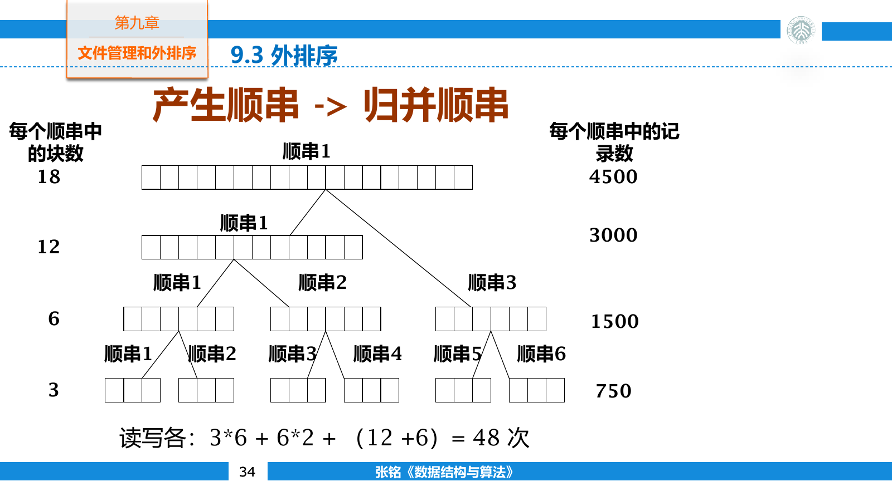
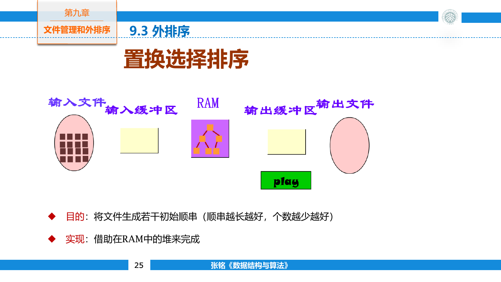
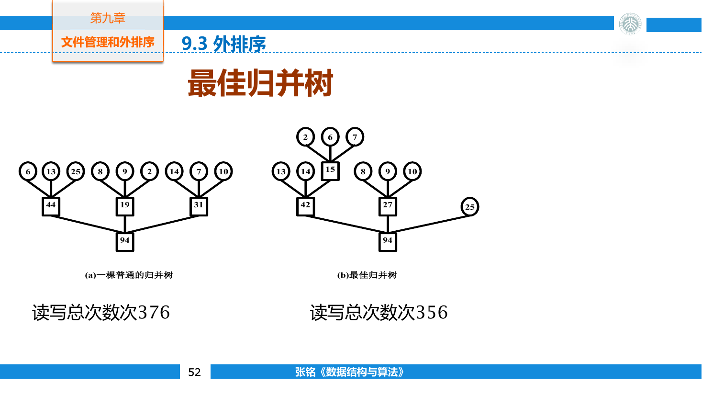
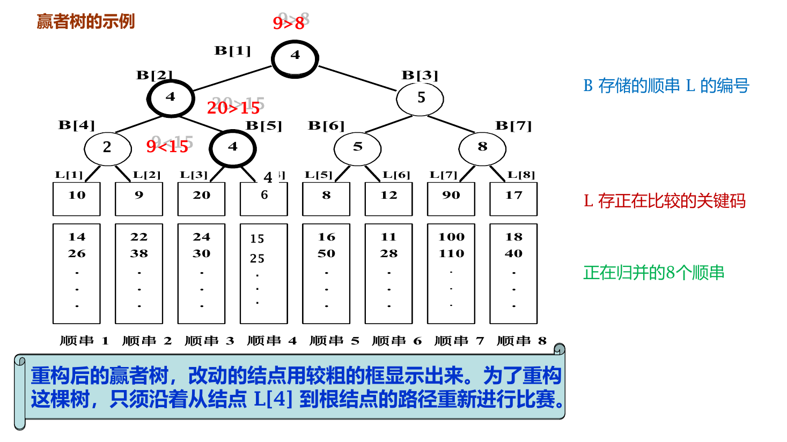
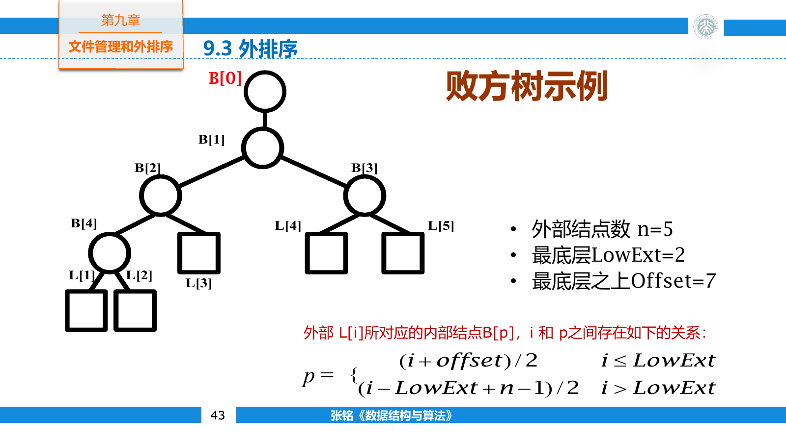

## 外排序基础

### 存储层次

内存支持细粒度随机访问，延迟较低，但容量有限；外存容量大且断电后仍能保存数据，访问延迟却高得多。数据无法全部装入内存时，块读写次数成为排序的主要成本。

磁盘把数据组织成扇区和块。一次读取会把整块数据送入内存，即使程序只需要其中一条记录。机械硬盘还要等待磁头移动到对应磁道和盘片旋转到目标位置；固态硬盘没有机械寻道，随机访问仍受闪存页、控制器与写放大影响。

顺序访问能连续传输大块数据，也便于操作系统预读。随机访问会产生更多独立 I/O 请求。外排序因此围绕顺序扫描与批量归并组织，避免在磁盘上频繁交换任意位置的元素。

### I/O 模型

设内存一次能容纳 $M$ 条记录，外存每块包含 $B$ 条记录，文件共有 $N$ 条记录。扫描一遍文件至少需要约

$$
\left\lceil\frac{N}{B}\right\rceil
$$

次块读取。若把结果写回另一个文件，还需要同量级的块写入。

内存排序的 $O(N\log N)$ 只统计 CPU 操作，外排序则更关心一条记录在多少轮中被读入和写出。每增加一趟全文件归并，就要再进行一次完整读取与写回。

### 文件与记录

逻辑文件是程序看到的字节或记录序列，物理文件由分布在设备上的块组成。文件系统把逻辑偏移映射到物理块，数据库还会在此之上解释定长记录、变长记录和字段。

常见文件组织包括：

- 顺序文件按进入次序或关键码次序排列记录，适合批量扫描。
- 散列文件根据键计算桶位置，适合等值检索。
- 索引文件额外维护键到记录位置的映射，适合多种查询。

文件操作最终都可归结为定位、读取和写入。C++ 二进制流中的 `seekg`、`read`、`seekp` 和 `write` 分别对应读位置移动、读取、写位置移动和写入。

```cpp
std::fstream file(
    "records.bin",
    std::ios::in | std::ios::out | std::ios::binary
);

Record record;
file.seekg(index * sizeof(Record), std::ios::beg);
file.read(reinterpret_cast<char*>(&record), sizeof(record));
```

这种直接写入对象表示只适用于布局固定、没有指针且读写环境兼容的简单记录。可移植文件还要明确字节序、字段宽度、版本和变长内容编码。

### 缓冲区

缓冲区在内存中保存一个或多个外存块。顺序读取时，当前块用完才读入下一块；顺序写入时，输出缓冲装满后才整块落盘。这样每条记录的处理仍发生在内存中，设备只承担批量 I/O。

多个缓冲区组成缓冲池。随机页面访问需要决定哪个旧页面被替换，常见策略有 FIFO、LRU 和近似 LRU。外排序的访问模式大多可预知，每个输入顺串只会向前读，输出也只会向前写，因此不需要复杂的通用页面淘汰策略。

双缓冲可以让一块缓冲参与计算时，另一块并行读取或写出下一批数据。设备和 CPU 能重叠工作时，总时间不再是纯粹的 I/O 时间与计算时间之和。

## 初始顺串

### 外排序框架

外排序分成两个阶段：

1. 分批读入记录，在内存中形成若干有序初始顺串，也称 run。
2. 多轮归并这些顺串，直到只剩一个全局有序文件。

若文件共有 $N$ 条记录，内存能容纳 $M$ 条，最直接的方法每次读取 $M$ 条、内排序并写回，生成约

$$
r=\left\lceil\frac{N}{M}\right\rceil
$$

个初始顺串。

顺串越长，数量越少，后续归并轮数也越少。外排序总时间可以拆成初始段内排序、内部归并比较和外存读写三部分，其中全文件 I/O 往往占主导。



### 置换选择

置换选择用最小堆持续挑选当前顺串的下一条记录，写出一条后再读入一条。堆中保存仍有资格进入本顺串的候选，顺串长度因此可以超过内存中的 $M$ 条记录。

每次输出堆顶后，从输入读取一条新记录：

- 新键不小于刚输出的键时，它可以继续接在本顺串后面，加入当前候选堆。
- 新键小于刚输出的键时，它会破坏顺串有序性，只能冻结到下一顺串。
- 当前候选全部冻结后，本顺串结束，再解冻这些记录并建立下一轮堆。



假设内存容量为四，初始输入为

```text
17 21 6 5 | 12 3 30 8 25 2 ...
```

堆先装入 `17 21 6 5`。输出 `5` 后读入 `12`，它仍属于当前顺串；输出 `6` 后读入 `3`，因为 `3 < 6`，所以冻结；输出 `12` 后读入 `30`，继续进入当前顺串。当前顺串可能输出远多于四条记录，长度不受内存容量硬性限制。

候选记录可以附加顺串编号

```cpp
struct Candidate {
    int value;
    int run;
};

bool operator>(const Candidate& left, const Candidate& right) {
    return std::tie(left.run, left.value) >
           std::tie(right.run, right.value);
}
```

堆先比较 `run`，再比较键值。输出值为 `last`、当前顺串编号为 `currentRun` 时，新记录若小于 `last`，编号设为 `currentRun + 1`；否则仍为 `currentRun`。堆顶编号发生变化时，旧顺串已经结束。

```cpp
std::vector<std::vector<int>> replacementSelection(
    const std::vector<int>& input,
    int memorySize) {
    std::priority_queue<
        Candidate,
        std::vector<Candidate>,
        std::greater<Candidate>
    > heap;

    int position = 0;
    while (position < static_cast<int>(input.size()) &&
           position < memorySize) {
        heap.push({input[position++], 0});
    }

    std::vector<std::vector<int>> runs;
    int currentRun = 0;
    int last = std::numeric_limits<int>::lowest();

    while (!heap.empty()) {
        Candidate item = heap.top();
        heap.pop();

        if (item.run != currentRun) {
            currentRun = item.run;
            last = std::numeric_limits<int>::lowest();
        }
        if (runs.size() <= static_cast<std::size_t>(currentRun)) {
            runs.emplace_back();
        }

        runs[currentRun].push_back(item.value);
        last = item.value;

        if (position < static_cast<int>(input.size())) {
            int value = input[position++];
            int run = value < last ? currentRun + 1 : currentRun;
            heap.push({value, run});
        }
    }
    return runs;
}
```

输入严格递减时，新记录总被冻结，每个顺串只能包含约 $M$ 条记录。输入已经递增时，所有记录都能进入同一个顺串。独立随机输入下，顺串平均长度约为 $2M$ ，所以置换选择常能把初始顺串数量减少约一半。

## 归并过程

### 二路归并

合并两个有序顺串时，为两边各保留一个输入缓冲，再准备一个输出缓冲。比较两边当前记录，把较小者写入输出缓冲；输入缓冲耗尽时顺序读取下一块，输出缓冲写满时整块落盘。

```cpp
while (left.hasValue() && right.hasValue()) {
    if (left.value() <= right.value()) {
        output.write(left.value());
        left.advance();
    } else {
        output.write(right.value());
        right.advance();
    }
}
output.copyRest(left);
output.copyRest(right);
```

相等时先取左侧记录可以保持稳定性，前提是左顺串中的记录在原文件中也更靠前。

若初始有 $r$ 个等长顺串，二路归并需要

$$
p=\left\lceil\log_2 r\right\rceil
$$

趟。每一趟读取并写回全部 $N$ 条记录，忽略边界块后，归并阶段约发生 $2pN/B$ 次块 I/O。

### 不等长顺串

顺串长度不等时，归并顺序会影响总读写量。合并长度为 $a$ 与 $b$ 的两段，需要读取并写出 $a+b$ 条记录；合并结果之后还会在上层继续参与 I/O。

例如长度为 `2, 3, 9` 的三段。先合并 `2` 与 `3`，代价为五，再把长度五与九合并，总代价为十九；若先合并 `3` 与 `9`，总代价为二十六。

每次选择最短的两段合并会得到最佳归并树。这与 Huffman 树使用同一贪心过程，叶权就是顺串长度，带权路径长度就是所有记录参与归并的总次数。



对于固定 $k$ 路归并，构造最佳归并树前有时要补长度为零的虚段，使叶子数满足

$$
(r-1)\bmod(k-1)=0
$$

虚段只负责补齐树形，不产生实际 I/O。若随意把虚段放到高层，会破坏最短顺串优先合并的结构。

### 多路归并

内存能同时为 $k$ 个输入顺串和一个输出顺串提供缓冲时，可以一次归并 $k$ 路。初始有 $r$ 个顺串时，归并趟数降为

$$
\left\lceil\log_k r\right\rceil
$$

若总缓冲空间固定为 $M$ 条记录，平均分配后每个缓冲约有 $M/(k+1)$ 条。增大 $k$ 会减少归并趟数，却会缩小单个缓冲；缓冲小于设备高效传输粒度后，I/O 请求数反而可能增加。

直接扫描 $k$ 个当前记录寻找最小值，每输出一条记录要做 $O(k)$ 次比较。最小堆把选择成本降到 $O(\log k)$ ，赢者树与败者树则保存上一轮比较结果，只重放发生变化的那一路。

#### 赢者树

赢者树是一棵完全二叉比较树。叶结点对应各输入顺串的当前记录，内部结点保存两个孩子中的较小者编号，根保存全局胜者。



某一路输出后，只为这一路读入下一条记录。树中其他 $k-1$ 路没有变化，因此只需沿该叶到根重做 $\lceil\log_2 k\rceil$ 场比较，无需重新扫描全部叶子。

输入顺串耗尽后，把它的当前键设为正无穷。它不会再获胜；当根也为正无穷时，所有输入都已处理完毕。

#### 败者树

败者树让内部结点保存每场比较的败者，全局胜者单独放在 `tree[0]`。更新时，刚读入新值的选手沿原路径向上挑战。较大者留在内部结点，较小者继续向上。



```cpp
class LoserTree {
private:
    int ways;
    std::vector<int> loser;
    std::vector<long long> key;

    void replay(int player) {
        for (int parent = (player + ways) / 2;
             parent > 0;
             parent /= 2) {
            if (key[player] > key[loser[parent]]) {
                std::swap(player, loser[parent]);
            }
        }
        loser[0] = player;
    }

public:
    explicit LoserTree(std::vector<long long> initial)
        : ways(initial.size()), loser(ways), key(std::move(initial)) {
        key.push_back(std::numeric_limits<long long>::lowest());
        std::fill(loser.begin(), loser.end(), ways);

        for (int player = ways - 1; player >= 0; --player) {
            replay(player);
        }
    }

    int winner() const {
        return loser[0];
    }

    void replaceWinner(long long value) {
        int player = loser[0];
        key[player] = value;
        replay(player);
    }
};
```

额外的哨兵选手初值为负无穷，初始化时总能获胜并把真实选手逐步放入正确比较路径。初始化结束后， `loser[0]` 指向真实最小键。具体数组下标约定很多，实现时要连同父结点公式、哨兵方向和比较符号一起检查。

赢者树与败者树的渐近复杂度相同。败者树在重放时只让新胜者与沿途败者比较，控制流程较整齐，也适合在比较相等时加入顺串编号，稳定地决定先输出哪一路。

## 代价取舍

外排序可以从三个位置减少成本：

- 置换选择生成更长初始顺串，减小 $r$ 。
- 多路归并增大 $k$ ，减少全文件扫描趟数。
- 选择树把每条输出记录的内部比较降为 $O(\log k)$ 。

三项优化受同一块内存约束。置换选择要占用候选堆，多路归并要为每一路保留输入缓冲，输出也需要缓冲。实际参数由内存容量、块大小、设备并发、顺串数量和记录大小共同决定。

若 I/O 远慢于比较，应优先减少归并趟数；若数据位于高速 SSD 或分布式存储，带宽、并发请求和网络传输又会改变最合适的归并路数。外排序的结构不变，成本模型会随设备变化。
