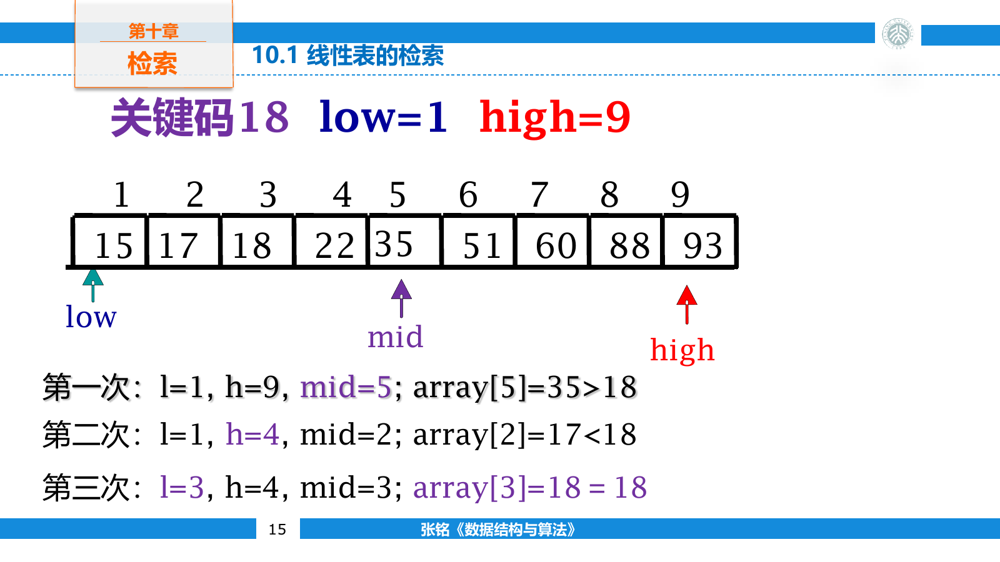
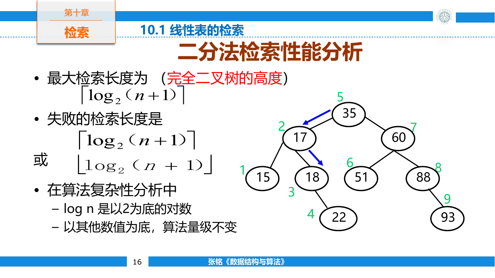
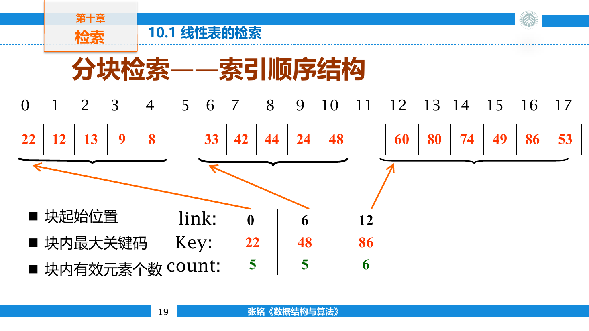
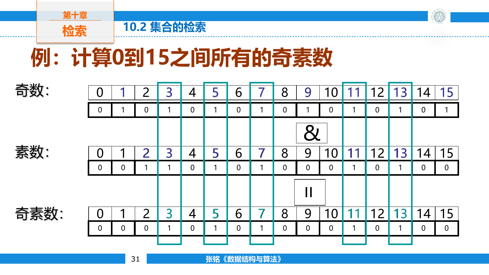
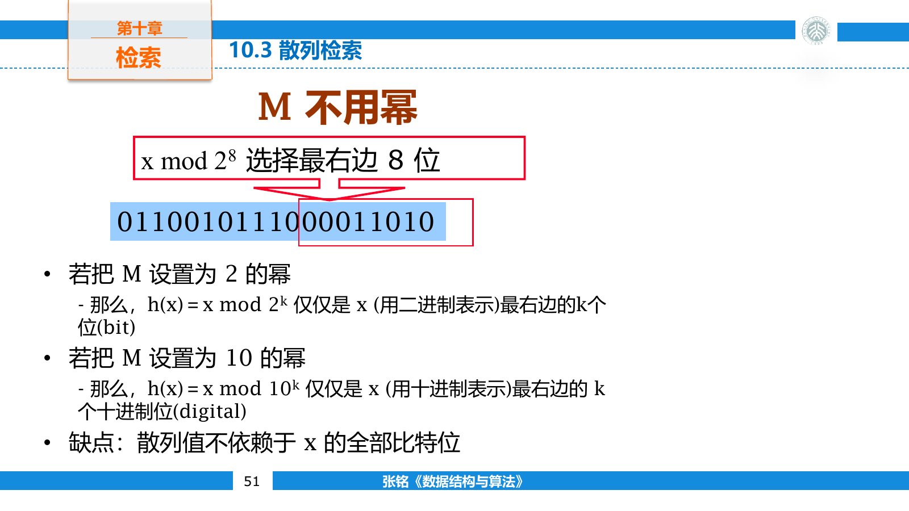
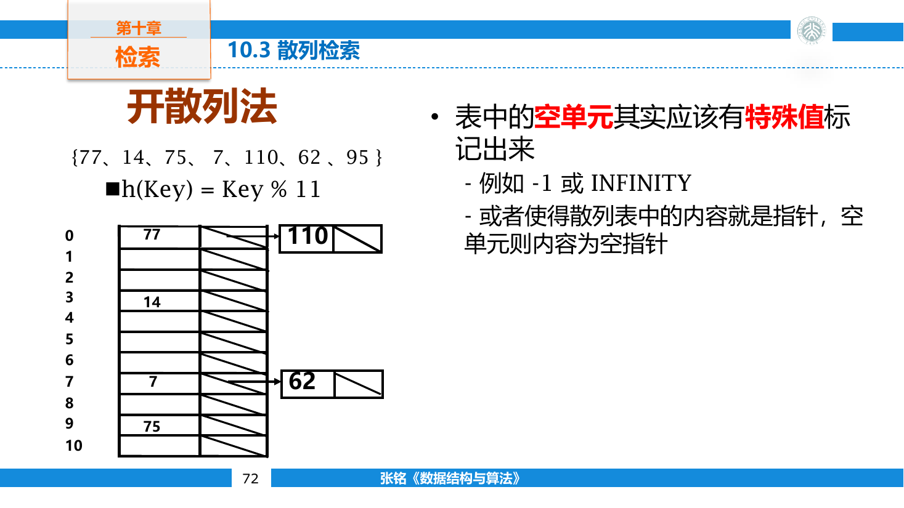
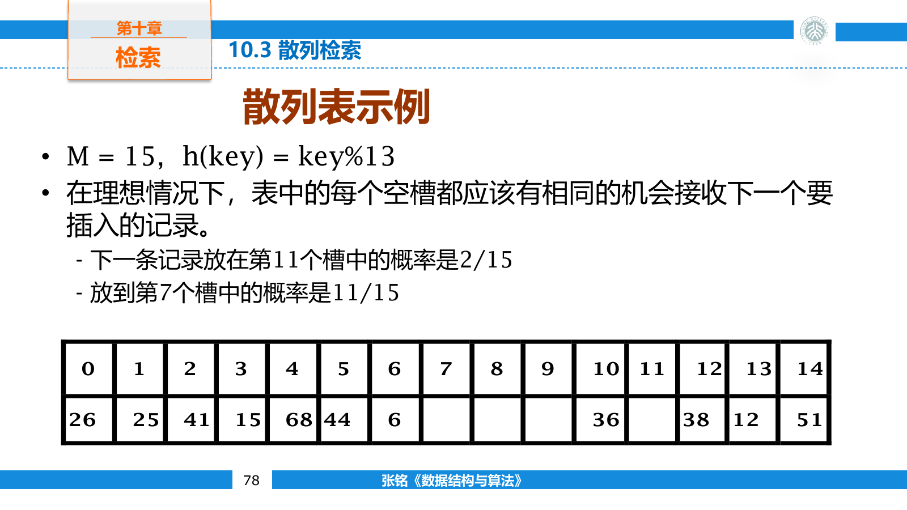
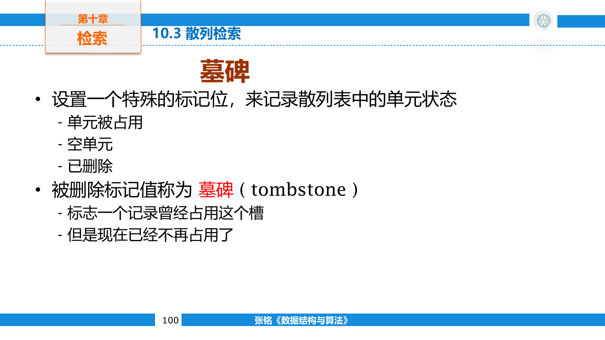
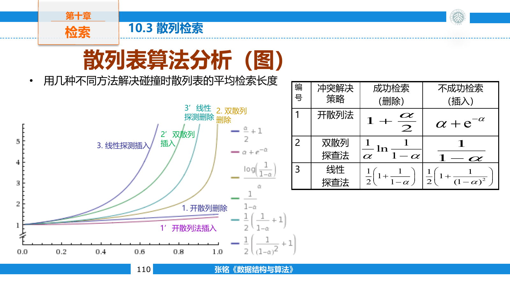
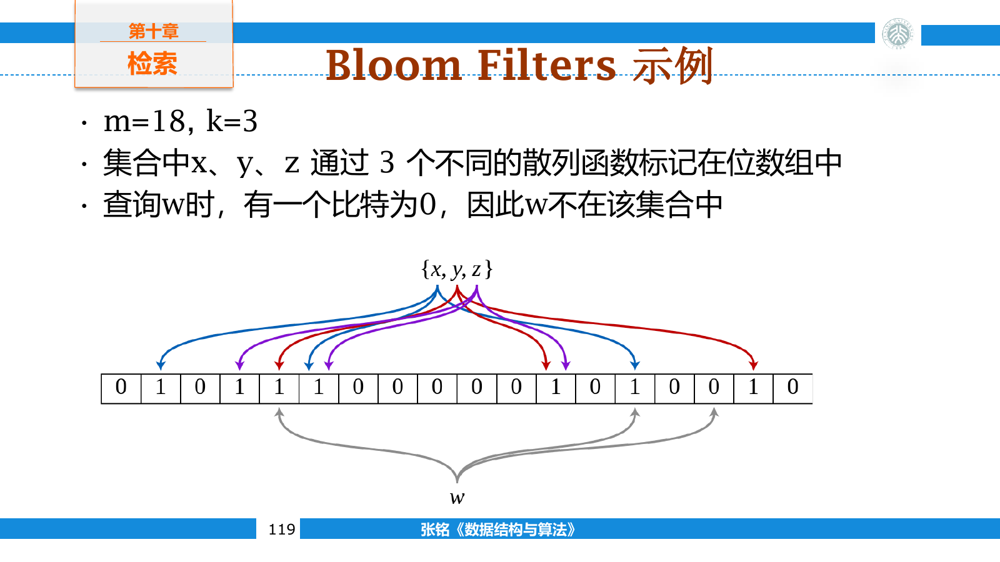

## 基本检索

检索根据给定关键码寻找记录。成功检索返回匹配记录，失败检索则确认记录不存在。数据的有序性、更新频率和可用辅助空间，决定了检索结构能够利用哪些信息。

若第 $i$ 个目标被检索的概率为 $p_i$ ，找到它需要比较 $c_i$ 次，平均检索长度（Average Search Length，ASL）为

$$
ASL=\sum_i p_i c_i
$$

ASL 只统计关键码比较次数。实际系统还要考虑内存访问、磁盘 I/O、索引维护和失败检索的概率。

若成功概率为 $p$ ，失败概率为 $1-p$ ，还可以把两种情况合并

$$
ASL=p\cdot ASL_{\text{success}}+(1-p)\cdot ASL_{\text{failure}}
$$

概率分布必须与应用相符。把所有键假设为等概率，只是缺少其他信息时的简化模型；热点键集中时，把高频记录放在更早位置会改变顺序检索的平均代价。

### 顺序检索

顺序检索从一端开始逐个比较，不要求数据有序，也适用于数组和链表。

```cpp
template <class T>
int sequentialSearch(const std::vector<T>& data, const T& key) {
    for (int i = 0; i < static_cast<int>(data.size()); ++i) {
        if (data[i] == key) return i;
    }
    return -1;
}
```

若每个位置等概率被命中，成功检索的 ASL 为

$$
\frac{1+2+\cdots+n}{n}=\frac{n+1}{2}
$$

失败时需要检查全部 $n$ 个元素。监视哨可以把目标临时放在数组边界，省去循环中的越界判断，但不会改变 $O(n)$ 的时间复杂度。

若记录按访问概率从高到低排列，成功检索的 ASL 为

$$
\sum_{i=1}^{n}p_i i
$$

交换一对相邻记录可证明，高概率记录放在前面不会增加这个值。不过重新排序可能破坏其他顺序要求，也会增加更新成本。

### 二分检索

二分检索要求数据已经按键排序，并且存储结构支持随机访问。每次比较中点后，可以排除一半候选区间。

```cpp
template <class T>
int binarySearch(const std::vector<T>& data, const T& key) {
    int left = 0;
    int right = data.size();

    while (left < right) {
        int middle = left + (right - left) / 2;
        if (data[middle] < key) {
            left = middle + 1;
        } else {
            right = middle;
        }
    }

    if (left < static_cast<int>(data.size()) && data[left] == key) {
        return left;
    }
    return -1;
}
```



这里维护的区间是左闭右开区间 $[left,right)$ 。循环结束时，`left` 是第一个不小于 `key` 的位置。最大比较次数为 $O(\log n)$ 。

二分过程可以画成一棵判定树。根对应第一次比较的中点，左右子树对应两个剩余区间。成功检索的比较次数就是目标所在结点的层数，失败检索则落到某个空子树。含 $n$ 个元素时，最大成功比较次数为

$$
\lfloor\log_2 n\rfloor+1
$$



若要寻找第一个等于 `key` 的位置，遇到相等也不能立即返回，而要继续收缩右边界。寻找最后一个等值位置则对称地收缩左边界。大量边界错误都来自混用闭区间与半开区间的不变量。

二分检索本身很快，但建立有序数组需要排序，插入和删除还可能移动 $O(n)$ 个元素。它适合静态或读多写少的数据。

### 分块检索

分块检索把有序范围划分为若干块，只在索引中保存每块的边界键与起始位置。查询先确定可能所在的块，再在块内顺序检索。



设共有 $b$ 块，每块约含 $s$ 个元素，并且 $bs=n$ 。索引与块内都使用顺序检索时，平均代价约为

$$
\frac{b+1}{2}+\frac{s+1}{2}
$$

在 $b$ 和 $s$ 都接近 $\sqrt n$ 时，检索约为 $O(\sqrt n)$ 。它介于顺序检索与二分检索之间，允许块内无序，因此插入删除比完全有序数组灵活。块分布长期失衡时，需要重新组织。

分块检索仍要求块之间有序：前一块的最大键不能大于后一块的最小键。块内记录可以无序，索引项保存该块最大键、起始位置和长度。

索引表使用二分检索时，代价变为 $O(\log b+s)$ 。增大块数会缩短块内扫描，却扩大索引并增加分裂、合并次数；这已经接近多级索引的基本取舍。

### 位向量集合

若全集范围较小且元素较密集，可以用一个位表示一个元素是否存在。第 $x$ 个元素对应第 $x$ 位，成员查询、插入和删除都只需常数次位运算。



```cpp
class BitSet {
private:
    static constexpr int wordBits = 64;
    std::vector<std::uint64_t> words;

public:
    explicit BitSet(int universeSize)
        : words((universeSize + wordBits - 1) / wordBits) {}

    void insert(int value) {
        words[value / wordBits] |= 1ULL << (value % wordBits);
    }

    void erase(int value) {
        words[value / wordBits] &= ~(1ULL << (value % wordBits));
    }

    bool contains(int value) const {
        return words[value / wordBits] >> (value % wordBits) & 1ULL;
    }
};
```

集合的交、并、差可以逐机器字执行按位与、或和与非。位向量空间由全集大小决定，而不是集合实际元素数，因此不适合范围巨大且十分稀疏的键。

位向量还支持补集和基数统计。补集对每个机器字取反，但最后一个字中超出全集范围的高位必须清零。现代处理器通常提供 `popcount` 指令，可以在线性于机器字数量的时间内统计一的个数。

```cpp
std::size_t intersectionSize(
    const std::vector<std::uint64_t>& left,
    const std::vector<std::uint64_t>& right) {
    std::size_t answer = 0;
    for (int i = 0; i < static_cast<int>(left.size()); ++i) {
        answer += std::popcount(left[i] & right[i]);
    }
    return answer;
}
```

全集不是连续整数时，需要先建立元素到位编号的映射。映射本身可能已经需要散列表或索引，因此位向量的常数访问来自额外的值域约束。

## 散列检索

散列函数把关键码映射为数组下标

$$
h:U\rightarrow\{0,1,\ldots,m-1\}
$$

不同关键码可能得到同一地址，这种情况称为冲突。散列表的性能取决于散列函数、冲突处理方法和负载因子

$$
\alpha=\frac{n}{m}
$$

其中 $n$ 是记录数， $m$ 是桶或槽位数。

好的散列函数应充分混合关键码信息，使常见输入在表中近似均匀分布。整数键常用取模或乘法混合，字符串键则逐字符累积。只截取键的一小部分通常容易受输入规律影响。

除余法使用

$$
h(k)=k\bmod m
$$

若键具有固定步长，而表长与该步长有公因子，记录只会落入少数槽位。选择质数表长能避开一部分周期，但不能替代对输入分布的分析。



乘法散列先把键乘以常数，再截取混合后的高位。字符串散列则让每个字符参与递推，例如 `hash = hash * base + ch`。溢出在无符号整数中按模 $2^w$ 处理，只要混合质量满足用途即可。

散列函数必须与相等关系一致。若两个键按容器规则相等，它们必须得到相同散列值；反过来不要求成立，因为冲突处理会再比较完整键。

### 链地址法

链地址法为每个散列地址维护一个桶，所有冲突键都存入同一桶。桶可以使用链表，也可以使用动态数组。



```cpp
template <class Key, class Value>
class ChainedHashMap {
private:
    using Entry = std::pair<Key, Value>;
    std::vector<std::vector<Entry>> buckets;

    int position(const Key& key) const {
        return std::hash<Key>{}(key) % buckets.size();
    }

public:
    explicit ChainedHashMap(int bucketCount) : buckets(bucketCount) {}

    Value* find(const Key& key) {
        for (auto& [storedKey, value] : buckets[position(key)]) {
            if (storedKey == key) return &value;
        }
        return nullptr;
    }
};
```

均匀散列假设下，桶的平均长度为 $\alpha$ ，检索的期望时间为 $O(1+\alpha)$ 。链地址法可以真正删除结点，负载因子也允许超过一；代价是额外指针、动态分配和较差的缓存局部性。

桶使用链表时，插入到表头为 $O(1)$ ，但要拒绝重复键就必须先检索。桶改用小型动态数组后，连续存储会改善局部性；单个桶通常很短，线性扫描的常数可能小于链表。

极端冲突会让一条桶链增长到 $n$ 。部分运行库会在桶过长时转成平衡树，把最坏检索从线性降到对数级，但结构与键比较要求也更复杂。

### 开放寻址

开放寻址把全部记录直接放在散列表数组中。冲突后按照探查序列寻找下一槽位，负载因子必须小于一。

线性探查使用

$$
h_i(k)=(h(k)+i)\bmod m
$$

连续访问具有良好缓存局部性，却容易形成一长段占用槽位，称为主聚集。



二次探查使用二次增量，能减轻主聚集，但拥有相同初始散列值的键仍会沿同一序列移动，形成次聚集。双重散列使用第二个散列函数决定步长

$$
h_i(k)=(h_1(k)+i h_2(k))\bmod m
$$

为了遍历整个表，步长 $h_2(k)$ 应与表长 $m$ 互素。表长取质数时，令步长落在 $1$ 到 $m-1$ 之间即可满足这一条件。

```cpp
enum class SlotState {
    empty,
    occupied,
    deleted
};

struct Slot {
    int key = 0;
    int value = 0;
    SlotState state = SlotState::empty;
};
```

开放寻址删除时不能直接把槽位置空。检索遇到空槽会判定目标不存在，若删除造成探查链中断，后面的键将再也无法找到。被删槽位应标记为墓碑，检索继续越过它，插入则可以复用它。



设表长为七，散列函数为 $h(k)=k\bmod 7$ 。依次插入 `10, 17, 24` 时，三者初始地址都为三。线性探查会把它们放到位置 `3, 4, 5`。删除 `17` 后若把位置四标成空，检索 `24` 在位置四便会错误停止；墓碑表示“这个位置目前无记录，但探查链还没结束”。

插入时要记住遇到的第一个墓碑，却不能立刻停下，因为后面可能已有相同键。直到找到真正空槽或原键后，才决定复用墓碑还是更新旧记录。

墓碑过多会延长探查序列。表的负载因子或墓碑比例超过阈值时，需要申请新表并重新散列全部有效记录。扩容不能简单复制旧槽位，因为表长变化后散列地址也会改变。

```cpp
int locate(const std::vector<Slot>& table, int key) {
    int start = hashKey(key) % table.size();

    for (int step = 0; step < static_cast<int>(table.size()); ++step) {
        int position = (start + step) % table.size();
        if (table[position].state == SlotState::empty) return -1;
        if (table[position].state == SlotState::occupied &&
            table[position].key == key) {
            return position;
        }
    }
    return -1;
}
```

探查至多访问表长个槽位。若循环没有这个上限，装满或没有真正空槽的表会陷入死循环。

### 期望复杂度

散列表的 $O(1)$ 是建立在散列分布合理且负载受控基础上的期望复杂度。极端冲突下，链地址法和开放寻址都可能退化为 $O(n)$ 。

负载因子越接近一，开放寻址找到空槽越困难，失败检索尤其昂贵。工程实现通常在达到某个阈值前扩容，并对用户可控字符串采用具有随机种子的散列，以降低构造冲突攻击的风险。

在线性探查的均匀模型下，成功与失败检索的期望探查次数都会随 $\alpha$ 增长，并在 $\alpha\to 1$ 时迅速恶化。实践中常把扩容阈值设在约 `0.5` 到 `0.8`，具体值取决于探查策略、槽位大小和缓存行为。



重新散列需要 $O(n)$ 时间，但按倍数扩容后，连续插入仍可保持期望 $O(1)$ 均摊时间。与动态数组一样，均摊常数不表示触发扩容的单次操作很快。

散列表不保存键的顺序，因此不擅长范围查询、寻找前驱后继和按序遍历。这些操作更适合平衡搜索树或 B+ 树。

### 散列的其他用途

Rabin-Karp 模式匹配为文本窗口维护滚动散列，只在窗口散列值等于模式散列值时检查原字符。它能快速筛掉大多数不匹配窗口，但散列碰撞意味着最终比较不能省略。

Bloom Filter 使用 $k$ 个散列函数，把每个元素映射到位数组中的 $k$ 个位置。查询时，只要有一位为零，元素就一定不存在；全部为一只能说明它可能存在，因此会出现假阳性，但不会出现假阴性。



普通 Bloom Filter 无法安全删除元素，因为同一位可能由多个元素共同设置。计数 Bloom Filter 用小计数器替代单比特，能够在额外空间代价下支持删除。

位数组长度为 $m$ ，插入 $n$ 个元素并使用 $k$ 个散列函数后，一位仍为零的概率近似为

$$
\left(1-\frac{1}{m}\right)^{kn}\approx e^{-kn/m}
$$

未插入元素的 $k$ 个位置恰好全为一的概率近似为

$$
\left(1-e^{-kn/m}\right)^k
$$

在 $m$ 与 $n$ 固定时，最合适的散列函数数量约为 $(m/n)\ln 2$ 。函数太少会让单次查询信息不足，太多则会过快把位数组填满。

密码散列与容器散列的目标不同。密码散列需要抗碰撞、抗原像等安全性质，不能直接使用普通哈希表函数。MD5 已不适合安全场景，只能用于不对抗攻击的兼容性校验。
