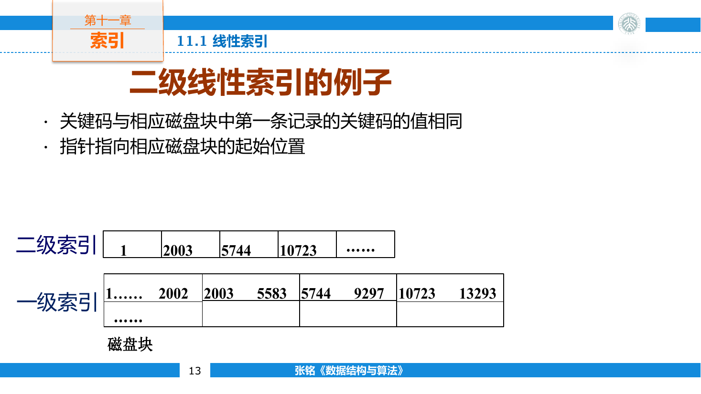
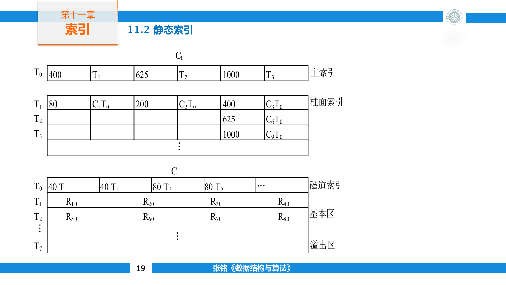
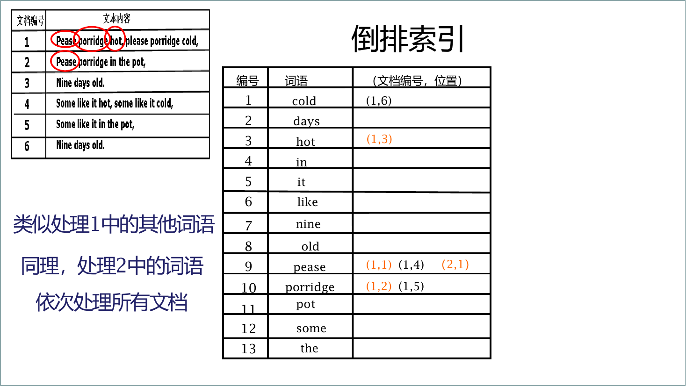
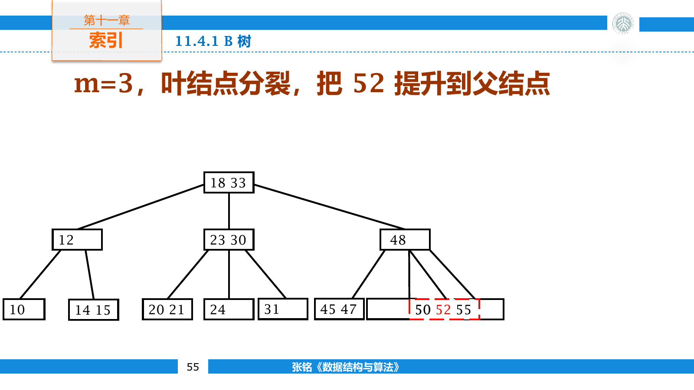
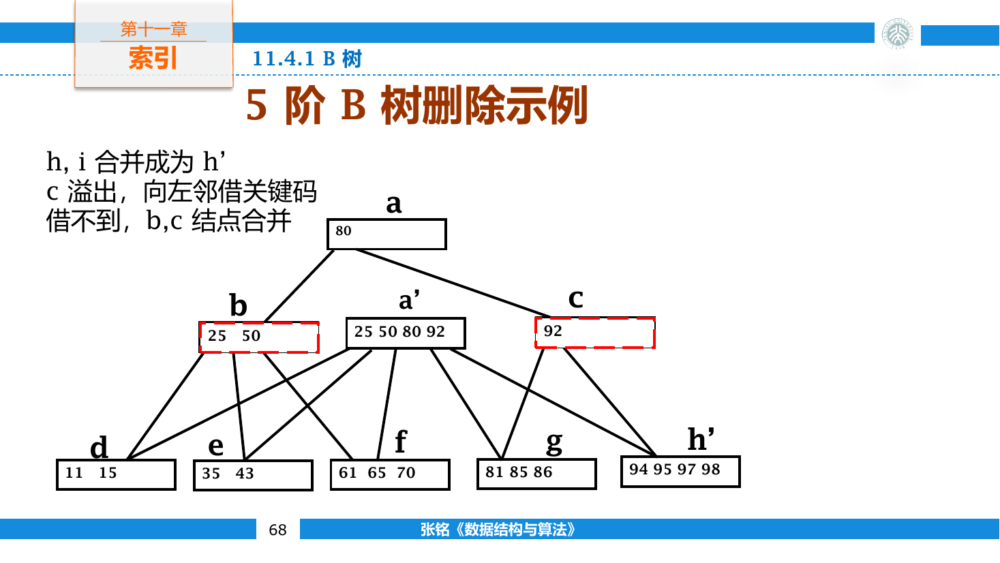
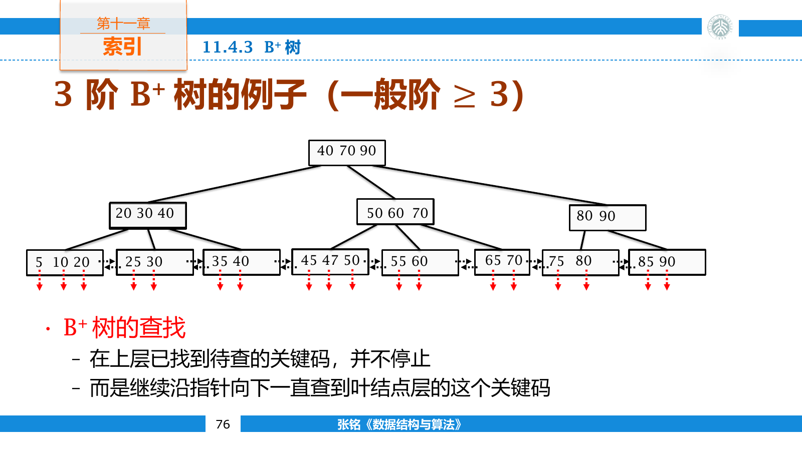
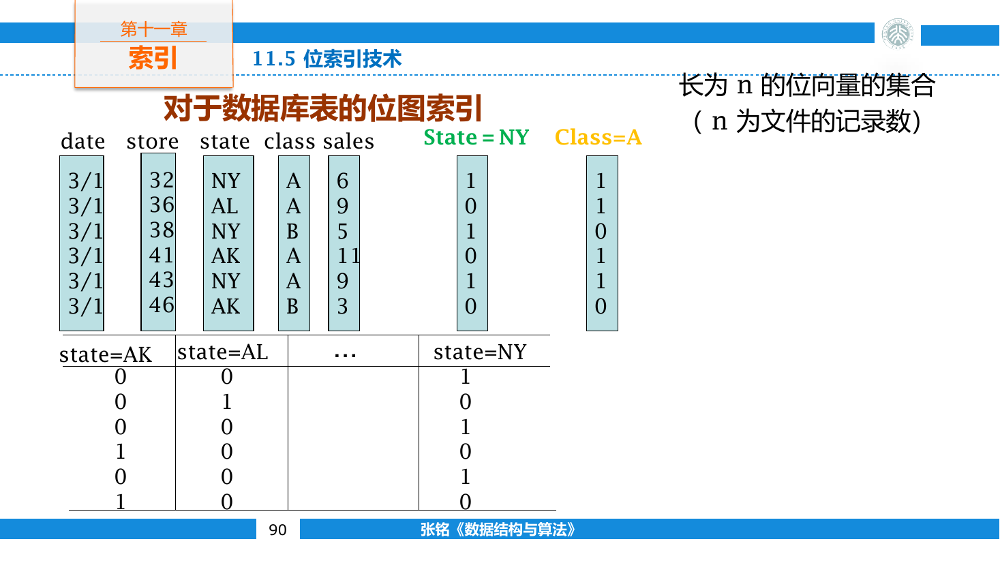
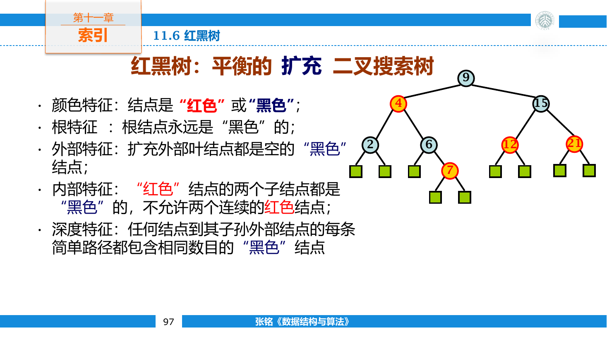
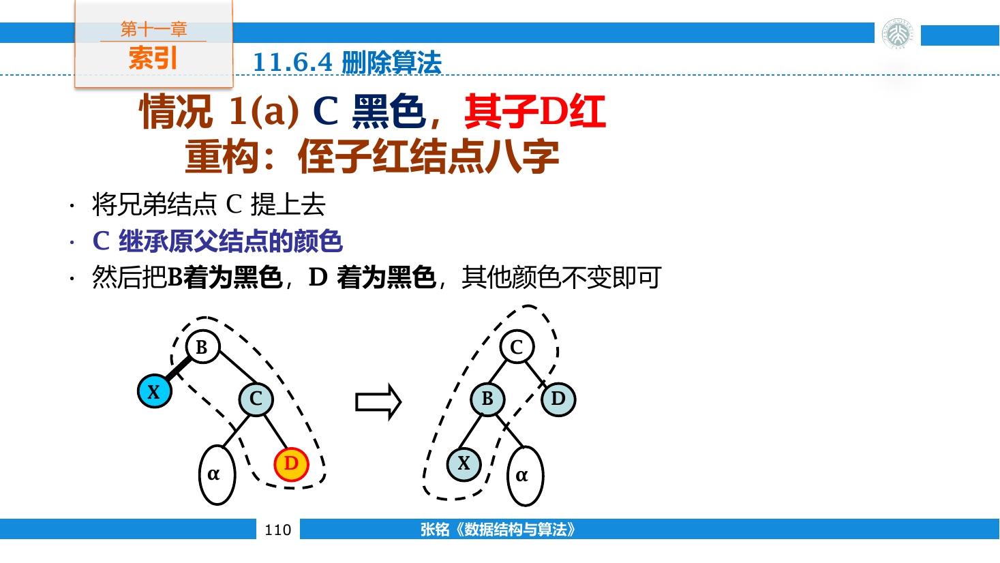

## 索引基础

### 索引文件

主文件保存完整记录，索引文件保存关键码与记录位置之间的联系。索引项通常写成 `(key, pointer)`，指针可能指向一条记录、一个数据块，或更低一级的索引块。

索引比主文件窄得多。假设一条完整记录占 256 字节，而键与指针合计 16 字节，同一磁盘页中能装入的索引项数量约为记录数量的十六倍。查询先在小而密集的索引中缩小范围，再读取真正的数据页。

一份主文件可以按不同字段建立多份索引。索引不会改变记录本身，只增加新的访问路径；代价是插入、删除或修改字段时，相应索引也要同步更新。

### 主码与辅码

主码能唯一标识记录，例如学号或订单编号。主码索引中的一个键只对应一条记录位置。

辅码允许重复，例如院系、城市或状态。辅码索引中的一个键要对应多条记录，常见表示是让索引项指向一条位置表。

```text
计算机学院 -> [record 3, record 18, record 29, ...]
```

位置表本身也可能很长，需要分块、压缩或继续建立索引。正文倒排索引中的倒排表就是这种结构。

### 稠密与稀疏

稠密索引为每条记录建立索引项。主文件可以无序，因为索引项直接给出目标位置。索引体积较大，新增记录也要插入一条索引项。

稀疏索引只为一组连续记录建立一项，通常保存该组的首键或最大键以及数据块地址。定位到块后，还要在块内继续检索。它要求主文件按索引键有序，否则同一键范围可能散落在任意块中。

设三个数据块保存以下键：

```text
block 0:  3  7  11  18
block 1: 24 29  35  41
block 2: 48 53  60  72
```

以首键建立稀疏索引时，只需保存 `(3, block 0)`、`(24, block 1)` 和 `(48, block 2)`。查询 `35` 时，找到不大于它的最大索引键 `24`，再在 `block 1` 内检索。

数据块分裂或边界键变化时，稀疏索引也要调整。索引项少不表示维护为零，只是更新频率和空间都低于稠密索引。

### 多级线性索引

有序索引可以二分检索，但索引大到无法常驻内存时，每次比较可能读取一个不同磁盘块。为一级索引的每个块再建立一条稀疏索引项，就得到二级索引；最高层仍装不下时可以继续向上建立。

假设磁盘块为 1024 字节，每个 `(key, pointer)` 占 8 字节，一块能放 128 条索引项。一级稠密索引若有 10000 项，需要

$$
\left\lceil\frac{10000}{128}\right\rceil=79
$$

个块。二级索引只需为这 79 个块各存一项，能够完整放入一个块。



查询过程分三步：

1. 读入二级索引块，确定目标应落在哪个一级索引块。
2. 读入该一级索引块，确定具体数据块或记录位置。
3. 读入目标数据块。

索引项内部比较发生在内存中，成本远低于额外读取一页。多级索引的高度因此按页面分支数增长，而不是按二叉树的二分支增长。

### 静态索引与 ISAM

静态索引在文件初次装载或整体重组时建立，日常操作不改变主要层次和块边界。它适合批量写入后长期查询的数据。

索引顺序存取方法（Indexed Sequential Access Method，ISAM）在有序主文件上建立固定的多级索引。早期磁盘结构可按主索引、柱面索引和磁道索引逐级定位；现代实现虽然不再依赖相同物理术语，仍保留“顶层定位较大范围、底层定位数据块”的结构。



静态结构的查询路径稳定，索引页可以紧凑排布。插入记录时却不能随意移动后方全部数据，通常会把新记录放入溢出区，并从原数据块链接过去。

溢出记录不断增加后，一个逻辑块可能拖着很长的溢出链，查询和顺序扫描都会变慢。系统需要定期重组主文件，把溢出记录重新并入有序块。这也是动态 B+ 树逐渐取代 ISAM 的原因之一。

## 倒排索引

普通记录按“文档到属性”保存，倒排索引把方向反转成“属性值到文档集合”。对于教师记录，可以从职称映射到教师编号；对于正文，可以从词项映射到包含它的文档编号。

正文索引通常包含两层：

- 词典保存所有不同词项，并给出对应倒排表位置。
- 倒排表保存文档编号，还可附带词频和词在文档中的位置。

建立索引时，先把文档分词并规范化，再生成 `(term, document, position)` 记录。大批记录按词项排序后，相同词项连续出现，可以一次扫描形成倒排表。



```text
algorithm -> [(2, [5, 18]), (7, [3]), (11, [9, 21])]
```

这条表表示词项 `algorithm` 出现在文档 2、7 和 11 中，方括号保存它在各文档里的位置。只保留文档编号能做布尔检索；加入位置后才能判断短语和邻近关系。

### 倒排表运算

倒排表按文档编号递增排列。查询 `tree AND index` 时，用两个指针求两条表的交集。

```cpp
std::vector<int> intersect(
    const std::vector<int>& left,
    const std::vector<int>& right) {
    std::vector<int> result;
    int i = 0;
    int j = 0;

    while (i < static_cast<int>(left.size()) &&
           j < static_cast<int>(right.size())) {
        if (left[i] == right[j]) {
            result.push_back(left[i]);
            ++i;
            ++j;
        } else if (left[i] < right[j]) {
            ++i;
        } else {
            ++j;
        }
    }
    return result;
}
```

时间与两条表长度之和成正比。多个词项求交时，先处理最短倒排表，通常能更早缩小候选集合。长度差异很大时，短表中的每个编号也可以在长表中跳跃或二分定位。

文档编号常保存相邻差值。递增编号 `120, 125, 141, 142` 可以写成 `120, 5, 16, 1`，小差值再使用变长整数编码，能显著减少倒排文件体积。

文档不断加入时，直接修改大型有序倒排表代价很高。搜索系统通常先建立小型增量索引，再定期把多个索引段归并；删除则可记录删除位图，合并时再真正清理旧项。

## 动态索引

动态索引允许记录插入和删除后立即保持可检索状态。索引结点与数据块都有容量上下限；装满后分裂，过空时借位或合并。B 树与 B+ 树通过局部调整维持所有叶结点同层，不需要周期性重建整棵索引。

外存索引的结点大小通常贴合一页。一个结点中的键很多，页内可以顺序或二分查找；树高很小，主要代价是从根到叶读了多少页。

### B 树

B 树是平衡多路搜索树。以下约定 $m$ 阶结点最多有 $m$ 个孩子，因此最多保存 $m-1$ 个键。令最小度数为

$$
t=\left\lceil\frac{m}{2}\right\rceil
$$

除根外，每个内部结点至少有 $t$ 个孩子和 $t-1$ 个键。非叶根至少有两个孩子，所有叶结点位于同一深度。

若结点键为

$$
k_1<k_2<\cdots<k_q
$$

它有 $q+1$ 个孩子。第零个孩子保存小于 $k_1$ 的键，第 $i$ 个孩子保存 $k_i$ 与 $k_{i+1}$ 之间的键，最后一个孩子保存大于 $k_q$ 的键。

不同教材也会把“阶”定义成最小度数或最大键数。使用公式前应先核对定义，不能只看“3 阶”三个字判断容量。

#### 检索

在当前结点中寻找第一个不小于目标的键。相等则检索成功；若不等，沿该位置对应的孩子继续下降。抵达叶结点仍未找到时，目标不存在。

```cpp
SearchResult search(BTreeNode* node, int key) {
    int position = std::lower_bound(
        node->keys.begin(), node->keys.end(), key
    ) - node->keys.begin();

    if (position < static_cast<int>(node->keys.size()) &&
        node->keys[position] == key) {
        return {node, position};
    }
    if (node->leaf) return {nullptr, -1};
    return search(node->child[position], key);
}
```

页内二分需要 $O(\log m)$ 次比较，但通常不增加 I/O。根页和上层页还可能长期驻留缓冲池，使一次查询实际只读取接近叶层的少数页面。

#### 插入

新键总是插入叶结点。若叶结点未满，只需在页内保持有序；若插入后超过最大键数，则以中间键为界分裂。

- 中间键提升到父结点。
- 较小键留在原结点。
- 较大键移入新结点。
- 若是内部结点，孩子指针也随键区间分开。



以最多三个键的结点为例，叶结点 `[10, 20, 30]` 插入 `25` 后得到 `[10, 20, 25, 30]`。可把 `20` 或 `25` 作为中间键提升，具体选择取决于实现约定；两边都必须满足最小占用率。

父结点接收提升键后也可能溢出，分裂会沿祖先路径传播。根溢出时，新建一个只含提升键的根，原根分成两个孩子，树高增加一。

工程实现常在下降前就分裂已满孩子，使递归永远进入非满结点。这种自顶向下插入省去回溯处理；课本中的“先插入再向上分裂”表达相同结构变化。

#### 删除

删除叶结点中的键最直接。若删除后仍有至少 $t-1$ 个键，结构不变；少于下限时产生下溢。

目标位于内部结点时，可以用左子树最大键或右子树最小键替换，再到叶层删除替代键。若相邻两个孩子都处于最小容量，也可以先把目标键下移并合并两边，再到合并后的结点继续删除。

叶层下溢有两种修复方式

- 相邻兄弟多于最小键数时，从兄弟借一项。父分隔键下移，兄弟边界键上移到父亲。
- 两侧兄弟都在最小容量时，把当前结点、一个兄弟和父分隔键合并。



例如父结点含分隔键 `40`，左孩子为 `[10, 20, 30]`，右孩子删除后只剩 `[50]`。若最少要两个键，可以把父键 `40` 下移到右孩子，再把左孩子最大键 `30` 提升为新的父分隔键，得到左 `[10, 20]`、父 `30`、右 `[40, 50]`。

合并会让父结点少一个键，父亲也可能下溢并继续向上传播。根结点是例外：根若删到空且只剩一个孩子，就让该孩子成为新根，树高降低一。

自顶向下删除也可以在下降前保证目标孩子至少有 $t$ 个键。这样真正删除叶键时不会出现无法处理的下溢，但分类仍包括借位与合并。

#### 高度

设根的深度为零，叶深度为 $h$ 。当 $h>0$ 时，根至少有两个孩子，之后每层结点数至少扩大 $t$ 倍。最少关键码数满足

$$
n\ge 2t^h-1
$$

因此

$$
h\le\log_t\frac{n+1}{2}
$$

页面能容纳数十到数百个孩子时，即使记录数很大，树高也只有几层。B 树并不是为了把比较次数从 $\log_2 n$ 改成更小的数学量，而是为了让每一层恰好对应一次高效页面读取。

### B+ 树

B+ 树把完整记录或记录指针全部放在叶结点，内部结点只保存导航用的分隔键。叶结点按键有序，并通过链表相连。



B+ 树与 B 树的差别集中在数据位置：

- 内部结点遇到相等键仍继续下降，因为真实记录只在叶层。
- 内部页只保存键和孩子地址，分支数通常更大。
- 每次成功查询都到达叶层，路径长度一致。
- 叶链支持从一个边界开始连续读取范围。

查询区间 $[L,R]$ 时，先沿索引定位第一个不小于 $L$ 的叶项，然后沿叶链顺序扫描，遇到大于 $R$ 的键停止。后半程不再返回内部结点，这正是 B+ 树适合数据库范围查询的原因。

叶结点分裂时，右侧新叶的最小键会复制到父结点作为分隔键，记录仍留在叶子中。内部结点分裂时，分隔键只负责导航，可以提升而不在原结点保留。两种分裂的“复制”与“提升”不能混写。

删除后若叶结点的最小键改变，即使没有下溢，祖先中代表它的分隔键也可能需要更新。借位与合并的容量规则与 B 树相似，叶链指针还要同步维护。

B+ 树内部结点更窄，通常比保存记录的 B 树更矮。数据库索引、文件系统目录和键值存储都大量使用 B+ 树或其变体。

## 位图索引

低基数属性只有少量取值，例如状态、地区或布尔标记。位图索引为每个取值建立一条长度等于记录数的位向量，第 $i$ 位表示第 $i$ 条记录是否拥有该值。

假设四条记录的状态依次为“待处理、完成、完成、失败”，可以建立

```text
待处理 1000
完成   0110
失败   0001
```



“状态为完成或失败”只需把后两条位图按位或。再与“地区为 A”的位图按位与，就能组合多个筛选条件。一次机器字运算可以同时处理几十条记录。

位图适合读多写少、低基数的数据仓库。高基数列为每个值建立位图会产生大量稀疏向量；频繁插入还会扩展所有位图。游程编码与压缩位图能降低长零段和长一段的存储成本，同时保留按位运算能力。

## 红黑树

红黑树是用于内存动态索引的平衡二叉搜索树。把空孩子视为黑色哨兵时，它满足

1. 每个结点为红色或黑色。
2. 根结点为黑色。
3. 所有空叶结点为黑色。
4. 红结点的孩子均为黑色。
5. 从任一结点到其后代空叶的所有路径包含相同数量的黑结点。

第五条中的黑结点数称为黑高。红结点不能连续，所以根到叶的最长路径至多在每两个黑结点之间插入一个红结点，长度不超过最短路径的两倍。



黑高为 $b$ 的子树至少含 $2^b-1$ 个内部结点，因此含 $n$ 个结点的红黑树高度满足

$$
h\le 2\log_2(n+1)
$$

检索、插入与删除都有 $O(\log n)$ 的最坏时间。

### 旋转

旋转改变局部父子关系，却保持中序序列。左旋把右孩子提升为子树根，右旋对称进行。

```cpp
Node* rotateLeft(Node* root) {
    Node* child = root->right;
    root->right = child->left;
    child->left = root;
    return child;
}

Node* rotateRight(Node* root) {
    Node* child = root->left;
    root->left = child->right;
    child->right = root;
    return child;
}
```

若原局部顺序为 `A < root < B < child < C`，左旋后五个区域的中序次序仍然相同。完整实现还要维护父指针，并在旋转发生于整棵树根时更新根地址。

### 插入

新结点按 BST 规则插入并染红。染黑会让经过它的路径多一个黑结点，直接破坏黑高；染红只可能造成父子连续为红。

父结点为黑时无需处理。父亲为红时，祖父一定存在且为黑，再根据叔父颜色分类。

叔父为红时，把父亲与叔父染黑、祖父染红。局部各条路径的黑结点总数不变，但祖父可能与它的父亲连续为红，所以从祖父继续向上检查。

叔父为黑时，需要旋转。若新结点与父亲形成折线，先围绕父亲旋转成直线；再围绕祖父旋转，并交换新局部根与祖父的颜色。调整后局部根为黑，两个孩子为红，黑高保持不变。

最后把整棵树根染黑。插入修复可能进行 $O(\log n)$ 次重新着色，但结构旋转至多常数次。

红黑树可以与 2-3-4 树对应：黑结点连同它的红孩子看作一个多关键码结点。叔父为红时的重新着色相当于 2-3-4 树结点分裂，旋转则重新安排多关键码结点的内部表示。

### 删除

BST 删除最终移除的结点至多只有一个非空孩子。删去红结点不会改变黑高；删去黑结点则让经过该位置的路径少一个黑结点，可以把这份缺失看作附着在替代结点上的“双黑”。

修复根据兄弟及其孩子颜色分类

- 兄弟为红时，父亲必黑。围绕父亲旋转并交换父兄颜色，把问题转成黑兄弟情况。
- 黑兄弟的两个孩子都黑时，把兄弟染红，当前层黑高恢复，双黑上移到父亲。
- 黑兄弟的远侧孩子为红时，围绕父亲旋转并重新着色，可以直接消除双黑。
- 只有近侧孩子为红时，先围绕兄弟旋转，转换成远侧红孩子情况。



“近侧”和“远侧”以双黑结点所在方向为基准。双黑在左边时，兄弟的左孩子是近侧，右孩子是远侧；双黑在右边时全部对称。

删除修复最多沿一条根路径上移，因此仍为 $O(\log n)$ 时间。它的分类比插入多，实际实现通常使用统一的黑色哨兵，避免在每个分支单独判断空指针。

红黑树的平衡约束弱于 AVL 树，查询路径可能稍长，更新时通常旋转更少。B+ 树把一个页面内的大量键视为一个多路结点，目标是减少 I/O；红黑树让单个内存对象成为一个结点，目标是控制指针路径长度，两者适用的成本模型不同。
