## 多维数组

多维数组是数组的数组。设第 $i$ 维下标范围为 $[c_i,d_i]$ ，这一维长度为

$$
D_i=d_i-c_i+1
$$

整个数组的元素数为

$$
\prod_{i=1}^{n}D_i
$$

维数、各维上下界和元素类型确定后，每个下标组合都对应唯一元素。多维下标是程序看到的逻辑位置，内存仍是一条一维地址序列，因此还要规定各维变化的先后次序。

### 存储次序

C 与 C++ 使用行优先存储，最后一维连续变化。二维数组 `A[3][4]` 的内存次序为

```text
A[0][0] A[0][1] A[0][2] A[0][3]
A[1][0] A[1][1] A[1][2] A[1][3]
A[2][0] A[2][1] A[2][2] A[2][3]
```

若各维从零开始，维长依次为 $D_1,D_2,\ldots,D_n$ ，元素大小为 $s$ ，行优先地址为

$$
\operatorname{Loc}(A[j_1,\ldots,j_n])
=\operatorname{base}
+s\sum_{i=1}^{n}j_i\prod_{k=i+1}^{n}D_k
$$

对 `int A[3][4]`，设 `int` 占四字节， `A[1][2]` 前面有 $1\times 4+2=6$ 个元素，因此地址偏移为 24 字节。

下标不从零开始时，要先减去各维下界

$$
\operatorname{offset}
=\sum_{i=1}^{n}(j_i-c_i)\prod_{k=i+1}^{n}D_k
$$

列优先存储则让第一维连续变化，偏移为

$$
\operatorname{offset}_{\text{column}}
=\sum_{i=1}^{n}(j_i-c_i)\prod_{k=1}^{i-1}D_k
$$

Fortran 与部分数值计算接口采用列优先。跨语言传递矩阵时，若忽略布局差异，结果常会表现为转置或错误步长。

#### 遍历与缓存

行优先矩阵应让列下标在内层连续变化。

```cpp
for (int row = 0; row < rows; ++row) {
    for (int column = 0; column < columns; ++column) {
        consume(matrix[row][column]);
    }
}
```

处理器读取一个地址时，会把附近一整条缓存行带入高速缓存。按行扫描能继续使用已经读入的相邻元素；按列扫描每次跨越一整行，大矩阵上会造成更多缓存未命中。

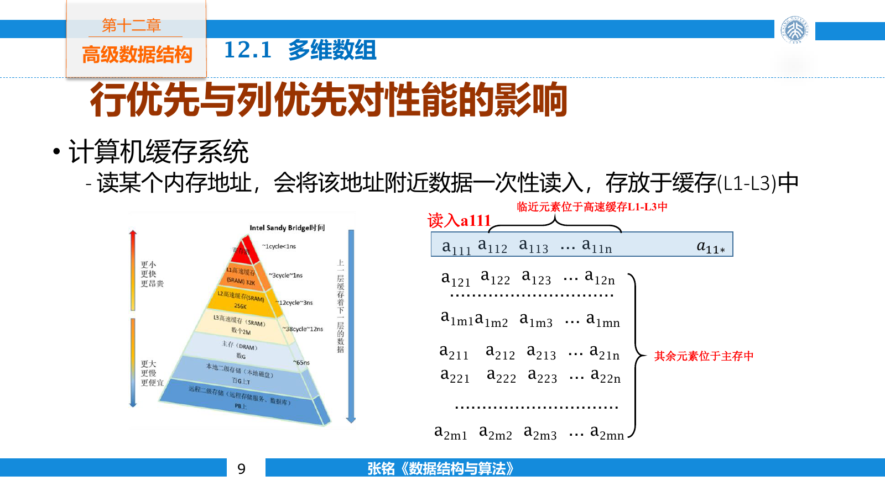

二维数组作为函数参数时，编译器必须知道除第一维以外的长度，才能计算行步长。动态矩阵也可以自行保存 `rows`、`columns` 和一维数组，用 `row * columns + column` 定位。

### 特殊矩阵

#### 三角矩阵

下三角矩阵只保存满足 $i\ge j$ 的元素。采用从零开始的行优先压缩时，第 $i$ 行前面保存了

$$
1+2+\cdots+i=\frac{i(i+1)}{2}
$$

个元素，所以位置 $(i,j)$ 对应偏移

$$
\frac{i(i+1)}{2}+j
$$

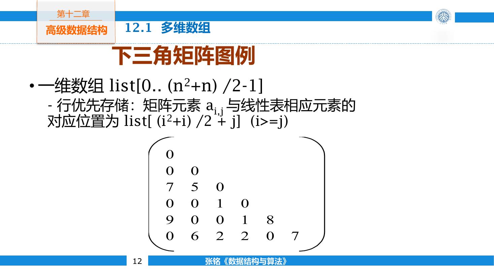

一个 $n\times n$ 下三角矩阵只需 $n(n+1)/2$ 个存储单元。上三角矩阵若按行存储，第 $i$ 行保存 $n-i$ 个元素，它前面的元素数为

$$
in-\frac{i(i-1)}{2}
$$

因此满足 $i\le j$ 的元素偏移为

$$
in-\frac{i(i-1)}{2}+j-i
$$

三角区域之外的值通常约定为零或某个相同常量，不为它们单独分配空间。

#### 对称矩阵与带状矩阵

对称矩阵满足 $a_{ij}=a_{ji}$ ，只保存上三角或下三角即可。访问未保存的一半时交换下标，再使用同一地址公式。

```cpp
int symmetricOffset(int row, int column) {
    if (row < column) std::swap(row, column);
    return row * (row + 1) / 2 + column;
}
```

带状矩阵的非零元素集中在主对角线附近。若只保留满足 $|i-j|\le b$ 的位置，每一行最多存 $2b+1$ 个元素，空间可从 $O(n^2)$ 降为 $O(nb)$ 。

三对角矩阵中 $b=1$ 。可以按三条对角线分别存储，也可以为每行保留三个槽位。首尾行缺少的槽位要么空着，要么在地址公式中单独修正。

压缩矩阵用更复杂的下标映射换空间。若算法频繁访问压缩区域之外的位置，额外分支与映射可能抵消收益。

### 稀疏矩阵

稀疏矩阵的非零元素很少且分布不规则。设 $m\times n$ 矩阵中有 $t$ 个非零元素，稀疏因子为

$$
\delta=\frac{t}{mn}
$$

是否采用稀疏表示不只取决于 $\delta$ 。三元组还要保存行号和列号；矩阵很小或元素类型很窄时，索引开销可能高于省下的零元素。

#### 三元组表

三元组 `(row, column, value)` 只记录非零项。

```cpp
template <class T>
struct SparseEntry {
    int row;
    int column;
    T value;
};
```

按行、再按列排序后，同一行的非零项连续。矩阵与向量相乘时，只需扫描三元组。

```cpp
std::vector<double> multiply(
    int rows,
    const std::vector<SparseEntry<double>>& entries,
    const std::vector<double>& vector) {
    std::vector<double> result(rows);
    for (const auto& entry : entries) {
        result[entry.row] += entry.value * vector[entry.column];
    }
    return result;
}
```

时间与非零项数 $t$ 成正比。若输入中允许同一位置出现多条记录，应在构造时合并它们，并删除合计为零的项。

两个按行列有序的三元组矩阵相加，可以像归并两个有序表一样扫描。位置较小的项直接进入结果，位置相同则相加，时间为 $O(t_1+t_2)$ 。

#### 转置

普通转置逐列寻找原矩阵元素，会反复扫描全部三元组。快速转置先统计原矩阵每一列的非零项数，这些列会成为结果矩阵的行。

设 `count[column]` 保存每列非零项数，前缀和 `start[column]` 给出该列在转置结果中的起始位置。再按原三元组顺序扫描一次，就能把每项直接放到目标位置。

```cpp
template <class T>
std::vector<SparseEntry<T>> transpose(
    int columns,
    const std::vector<SparseEntry<T>>& entries) {
    std::vector<int> count(columns);
    for (const auto& entry : entries) ++count[entry.column];

    std::vector<int> next(columns);
    for (int column = 1; column < columns; ++column) {
        next[column] = next[column - 1] + count[column - 1];
    }

    std::vector<SparseEntry<T>> result(entries.size());
    for (const auto& entry : entries) {
        int position = next[entry.column]++;
        result[position] = {entry.column, entry.row, entry.value};
    }
    return result;
}
```

时间为 $O(t+n)$ ，额外空间为 $O(n)$ ，其中 $n$ 是原矩阵列数。

#### 十字链表

十字链表让每个非零结点同时位于一条行链和一条列链。结点保存位置、值、同行后继与同列后继。

```cpp
template <class T>
struct CrossNode {
    int row;
    int column;
    T value;
    CrossNode* right = nullptr;
    CrossNode* down = nullptr;
};
```

矩阵另存一组行头指针与列头指针。插入 $(i,j)$ 时，要在第 $i$ 条行链按列号定位，也要在第 $j$ 条列链按行号定位；删除时两条链都要解除链接。

三元组数组紧凑，适合静态矩阵和顺序计算；十字链表附加指针较多，却能同时沿行与列遍历，并支持局部动态修改。

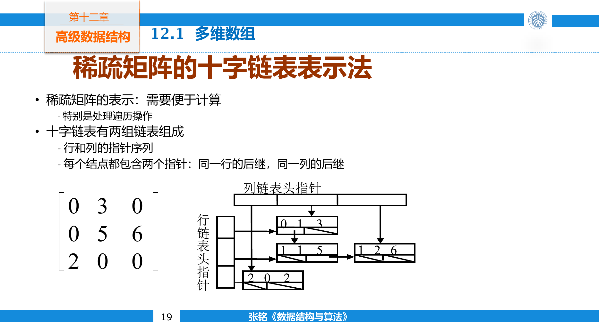

#### 乘法

矩阵乘法的单项为

$$
c_{ij}=\sum_k a_{ik}b_{kj}
$$

只有左矩阵第 $i$ 行与右矩阵第 $j$ 列在相同下标 $k$ 上都非零时，乘积才有贡献。两条有序索引链可以用双指针求交。

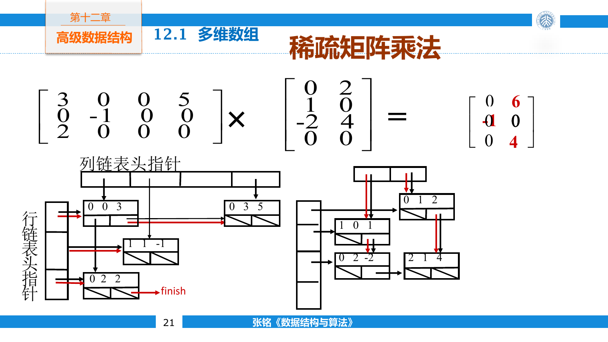

```cpp
double sparseDot(
    const std::vector<std::pair<int, double>>& row,
    const std::vector<std::pair<int, double>>& column) {
    int i = 0;
    int j = 0;
    double result = 0;

    while (i < static_cast<int>(row.size()) &&
           j < static_cast<int>(column.size())) {
        if (row[i].first == column[j].first) {
            result += row[i].second * column[j].second;
            ++i;
            ++j;
        } else if (row[i].first < column[j].first) {
            ++i;
        } else {
            ++j;
        }
    }
    return result;
}
```

若左矩阵每行至多有 $t_a$ 个非零项，右矩阵每列至多有 $t_b$ 个，逐行逐列求交的上界为 $O(pn(t_a+t_b))$ 。实际算法常按左矩阵非零项展开右矩阵对应行，并在散列表或临时稀疏向量中累加结果，避免枚举所有空的 $(i,j)$ 位置。

## 广义表

广义表的元素可以是原子，也可以是另一个广义表。

$$
L=(a_1,a_2,\ldots,a_n)
$$

长度只统计最外层元素数，深度统计最大括号嵌套层数。对

```text
L = (a, (b, c), d)
```

长度为三，深度为二。空表 `()` 的长度为零；只含空表的 `(())` 长度为一，深度为二。

非空广义表的 `head` 是第一个元素， `tail` 是删除第一个元素后剩余的表。

```text
head(L) = a
tail(L) = ((b, c), d)
head(tail(L)) = (b, c)
```

`tail` 始终返回广义表，不是第二个元素。对单元素表 `(a)`，尾部是空表 `()`。

### 形态

纯表中每个原子与子表只出现一次，整体可以表示成树。若多个位置引用同一子表，结构变成有向无环图；若子表最终又引用祖先，则会出现环。

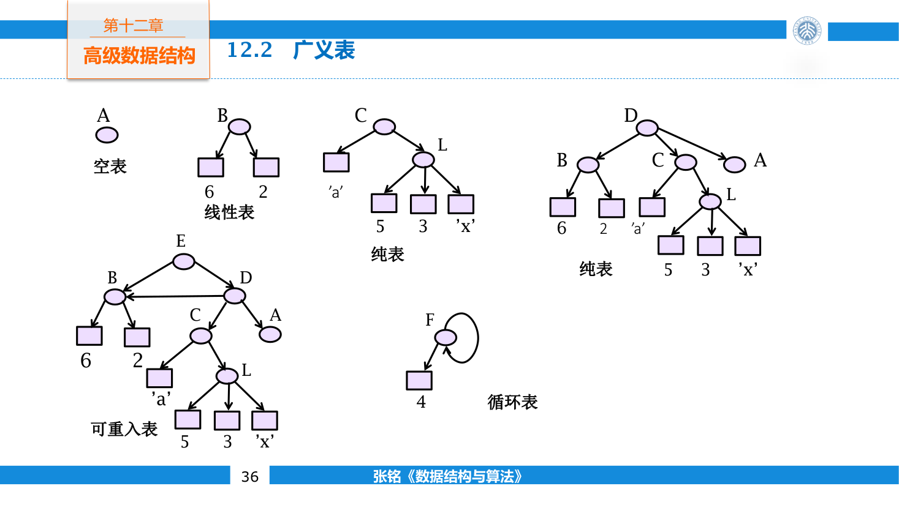

```text
A = (a, B)
B = (b, c)
C = (B, B)
```

`C` 中两处 `B` 可以共享同一个结点结构。复制两份能恢复树形，却改变了共享语义并增加空间。

有环广义表不能用普通递归直接计算深度，因为遍历会反复回到已经访问的结点。此时要么禁止环，要么增加访问状态，并重新定义深度等只对树形结构自然成立的操作。

### 结点表示

一种表示让结点区分原子与子表，并用 `next` 串联同层元素。

```cpp
template <class T>
struct GeneralizedNode {
    enum class Kind {
        atom,
        list
    } kind;

    T value{};
    GeneralizedNode* child = nullptr;
    GeneralizedNode* next = nullptr;
};
```

原子结点使用 `value`，表结点使用 `child` 指向子表首元素。带虚拟表头后，空表与首部插入可以采用统一表示。

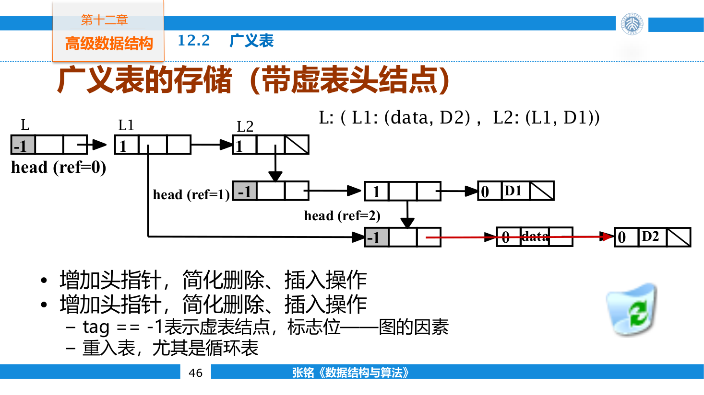

树形广义表可以递归遍历。

```cpp
template <class T>
void traverse(GeneralizedNode<T>* node) {
    for (; node != nullptr; node = node->next) {
        if (node->kind == GeneralizedNode<T>::Kind::atom) {
            visit(node->value);
        } else {
            traverse(node->child);
        }
    }
}
```

共享子表的销毁不能直接使用同样框架，否则第二次访问会重复释放。可以约定唯一所有者、保存引用计数，或交给垃圾回收器处理。

## 存储管理

### 定长块管理

频繁创建相同大小的结点时，可以预先申请一大片内存，并把空闲块串成自由链表。分配从表头取一块，释放把块压回表头，两者都是 $O(1)$ 时间。

```cpp
union FreeBlock {
    FreeBlock* next;
    alignas(Node) unsigned char storage[sizeof(Node)];
};
```

空闲时，块内保存下一空闲块指针；分配后，同一片空间用于构造对象。获得原始内存与对象构造是两步，释放对象时也要先运行析构函数，再把原始块放回自由链表。

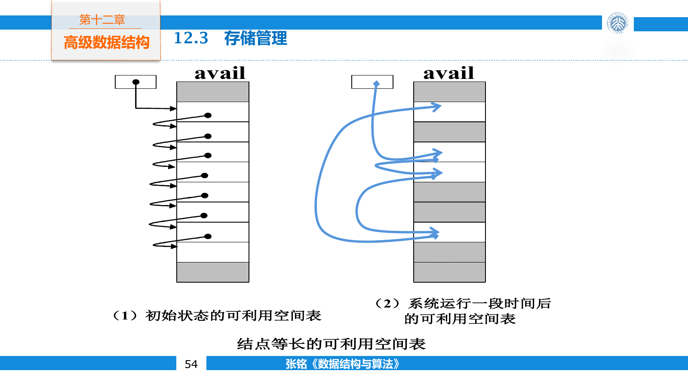

对象池减少系统分配器调用，并让同批结点靠近存放。池中块大小固定，较小对象会产生内部碎片，较大对象则无法放入。不同尺寸通常进入不同的大小类别。

### 变长块管理

变长分配器把一段连续内存切成若干已分配块和空闲块。每块要保存长度与占用状态；空闲块还要加入某种可利用空间表。

请求 $s$ 字节时，还要加上块头、对齐填充和可能的块尾。若找到的空闲块明显大于请求，前部交给用户，剩余部分形成新空闲块；余量小到放不下最小块结构时，整块都应分配出去。

#### 空闲块选择

常见选择策略有三种：

- 首次适配按地址或链表顺序返回第一个足够大的块。
- 最佳适配选择能容纳请求的最小块。
- 最差适配总从最大空闲块切分。

假设空闲块依次为 `1200, 1000, 3000` 字节，请求 `900` 字节。首次适配选 1200，最佳适配选 1000，最差适配选 3000。下一次请求若为 1100，最佳适配留下的 1200 仍可使用，首次适配留下的 300 与 1000 都不够；但换一组请求序列，最佳适配制造的小碎片也可能更多。

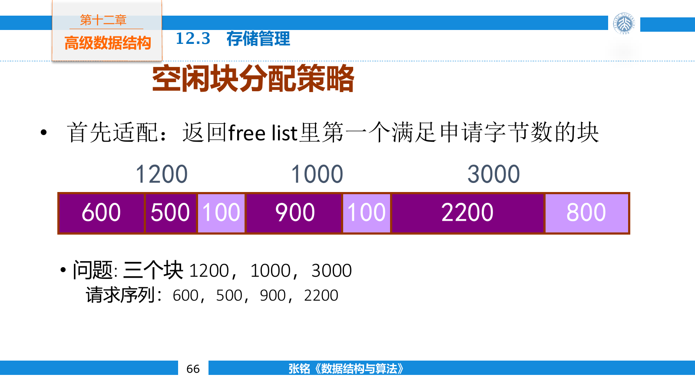

没有一种策略对所有请求序列都最优。实际分配器常按大小建立多条空闲链，小对象直接进入对应大小类，大对象再使用树或有序结构寻找近似最佳块。

#### 分裂与合并

外部碎片表示空闲总量足够，却被分成许多无法满足大请求的小块。释放一块时，要检查物理相邻的前后块是否空闲，并立即合并。

只保存块头时，可以通过当前块长度找到后继块，却难以在常数时间找到前驱。边界标记在块头与块尾都保存长度和占用位，当前块前一个字即可给出前块长度，从而定位前块开头。

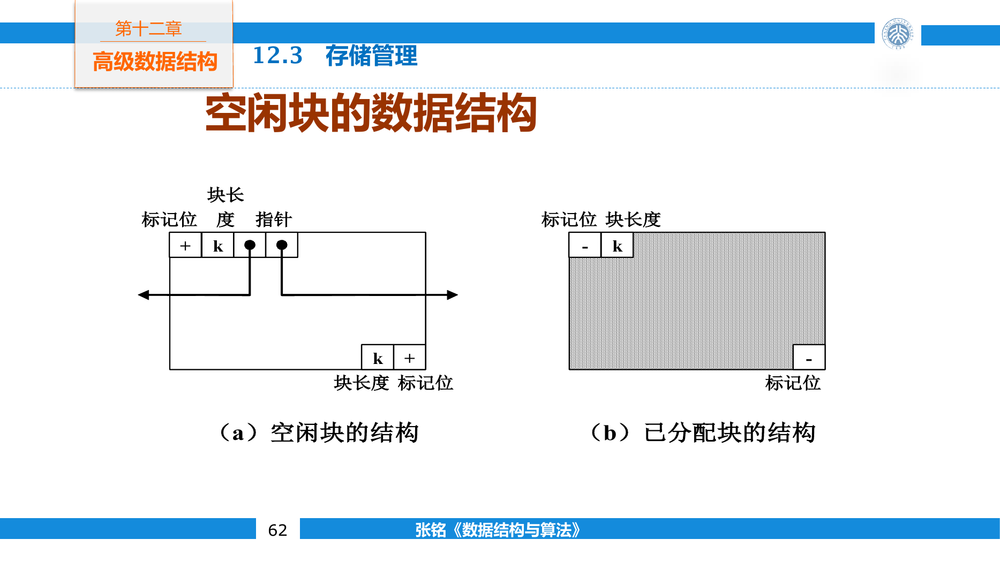

释放块有四种情况：

1. 前后都已分配，当前块单独加入空闲表。
2. 前块空闲，把当前块并入前块。
3. 后块空闲，把当前块与后块合并。
4. 前后都空闲，三块合并，并从空闲表中移除原来的两个空闲块记录。

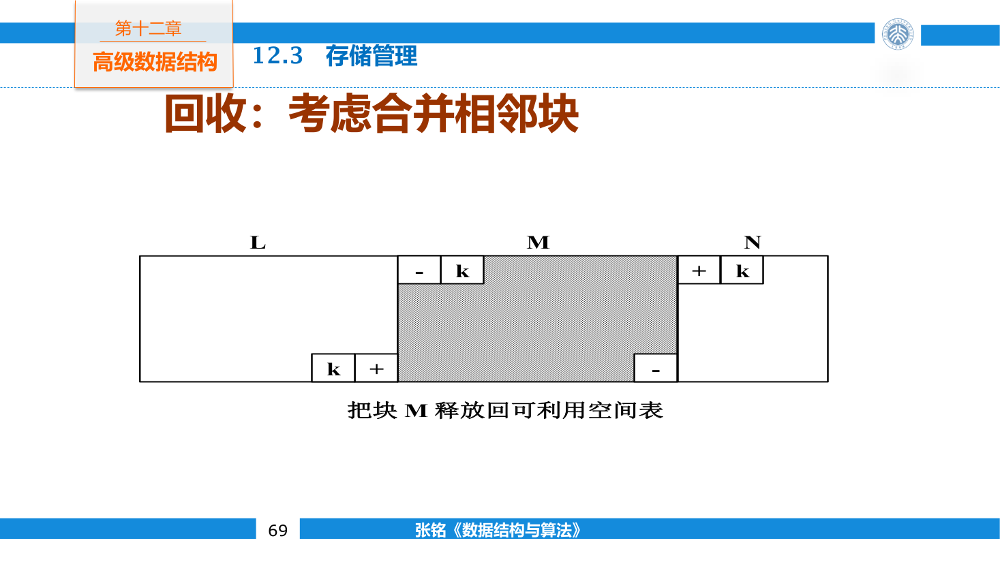

空闲链的逻辑顺序与块的物理顺序不是同一关系。合并依据地址相邻，不能只看自由链表中的前后结点。

内部碎片发生在已经分配的块内部，来源包括对齐、大小类别与最小分块限制；外部碎片位于块之间。合并只能缓解外部碎片，无法收回已分配块中的填充空间。

#### 分配失败

找不到足够大的连续空闲块时，可以扩展堆、整理存储、触发垃圾回收或直接报告失败。总空闲空间大于请求并不保证分配成功，因为请求需要一块连续区域。

可移动对象的系统可以把存活对象搬到一起，再更新所有指针，形成大块连续空闲空间。C++ 原生指针通常允许任意地址逃逸，通用分配器无法安全移动对象，所以主要依靠空闲块合并和大小分类。

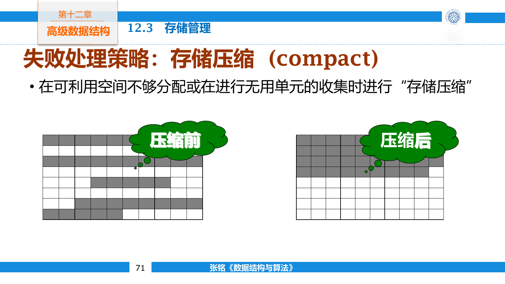

### 无用单元回收

垃圾对象是程序再也无法访问、却尚未回收的对象。垃圾回收器从一组根出发：线程栈、全局变量和运行时保存的引用都可以成为根。沿引用可达的对象必须保留，其余对象才可回收。

#### 标记清除

标记清除（Mark-Sweep）先从根遍历对象图，为可达对象设置标记；随后扫描整个堆，回收未标记对象，并清除存活对象标记供下一轮使用。

它不会移动对象，外部指针保持有效，但清除后可能留下分散空洞。标记阶段需要防止递归栈随对象图深度溢出，实际实现常使用显式工作队列或修改对象指针完成遍历。

#### 标记整理

标记整理（Mark-Compact）在标记后把存活对象搬到连续区域，再统一更新引用。整理结束后，空闲空间集中在一端，分配只需移动边界指针。

移动对象会增加暂停时间，也要求运行时准确知道每个字段是否为引用。保守地把任意机器字都当作潜在指针时，很难安全更新地址。

#### 复制回收

复制式回收把堆分成两个半区。分配只在当前半区顺序进行；空间用完后，从根开始把存活对象复制到另一半区，并在旧对象处留下转发地址，避免共享对象被复制多次。

回收时间与存活对象量有关，不必扫描大量垃圾；代价是同一时刻只能使用约一半预留空间。分代垃圾回收利用“大多数对象很快死亡”的经验，让新对象在较小区域中频繁复制，长期存活对象再晋升到老年代。

#### 引用计数

引用计数记录指向对象的引用数量。赋值新引用时增加计数，覆盖或销毁引用时减少；计数降到零即可立即释放对象，并递归减少它引用对象的计数。

两个对象互相引用时，即使外部已经无法到达，它们的计数仍不为零。弱引用、周期检测或辅助追踪回收可以处理环。引用计数还会让普通指针赋值承担计数更新成本，多线程下需要同步。

## Trie

Trie 按关键码的字符或比特逐层分支。根到终止标记的路径表示完整关键码，某个结点的子树包含共享该前缀的全部键。

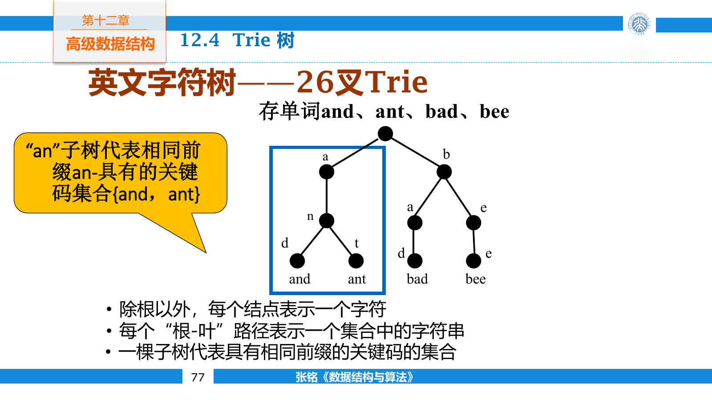

```cpp
struct TrieNode {
    std::array<int, 26> child;
    bool terminal = false;

    TrieNode() {
        child.fill(-1);
    }
};

class Trie {
private:
    std::vector<TrieNode> nodes{1};

public:
    void insert(const std::string& word) {
        int current = 0;
        for (char ch : word) {
            int index = ch - 'a';
            if (nodes[current].child[index] == -1) {
                nodes[current].child[index] = nodes.size();
                nodes.emplace_back();
            }
            current = nodes[current].child[index];
        }
        nodes[current].terminal = true;
    }

    bool contains(const std::string& word) const {
        int current = 0;
        for (char ch : word) {
            int index = ch - 'a';
            current = nodes[current].child[index];
            if (current == -1) return false;
        }
        return nodes[current].terminal;
    }
};
```

终止标记不可省略，否则插入 `an` 与 `and` 后无法判断 `an` 是否本身存在。长度为 $w$ 的键，查找和插入时间为 $O(w)$ ，与 Trie 中保存了多少个键无关。

Trie 的形状由键集合决定，不受插入次序影响。最坏结点数为所有键长度之和再加根；大量共享前缀时，实际结点数会更少。

### 孩子表示

每个结点预留整个字符表数组，沿边访问为 $O(1)$ ，但稀疏分支会浪费空间。英文小写字母只有 26 个槽位还能接受，Unicode 码点则不适合整表预留。

可选表示包括：

- 有序边数组，以二分查找孩子。
- 散列表，按字符期望常数访问。
- 链表，只为实际孩子分配结点。
- 双数组 Trie，用 `base` 与 `check` 两个数组压缩整棵自动机。

双数组 Trie 令某状态的字符转移位置由 `base[state] + code` 计算， `check[next] == state` 表示该槽确实属于当前状态。它避免大量指针，查询连续且紧凑，但构造时要寻找不与现有转移冲突的基址。

删除单词时先取消终止标记，再从末端向上删除没有孩子且不是其他单词终点的结点。若某个前缀仍服务于其他键，就不能释放。

### Patricia 与 Radix Tree

普通 Trie 中只有一个孩子的连续路径没有分支信息。路径压缩把这段结点合并为一条带字符串标签的边，得到 Radix Tree；二进制压缩 Trie 常称为 Patricia Trie。

插入新键时，沿边标签比较最长公共前缀。若只匹配边标签的一部分，就在失配位置分裂边：公共前缀形成新中间结点，旧后缀与新键后缀成为两个分支。

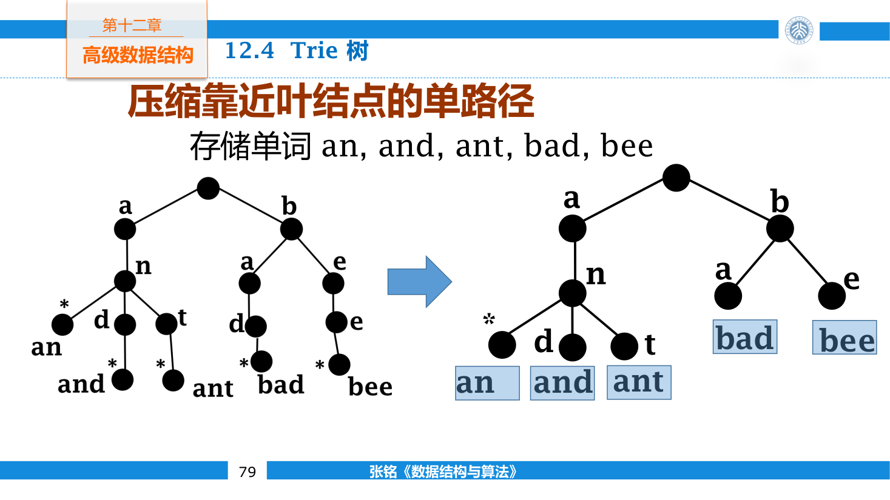

例如已有边标签 `compression`，插入 `compact` 时，共享前缀是 `comp`。原边拆成 `comp -> ression`，新键增加 `comp -> act`。压缩后结点数由分支数量决定，不再由所有字符位置决定。

IP 路由表使用前缀匹配。沿二进制 Radix Tree 读取地址比特时，保存最近遇到的终止结点；无法继续后，返回这个最长前缀，而不是要求整个地址恰好成为一个键。

### 二进制 Trie

整数可以按最高位到最低位插入二进制 Trie。寻找与 $x$ 异或值最大的已存整数时，每一位都优先走与 $x$ 当前位相反的孩子，因为高位的一比所有低位贡献之和更大。

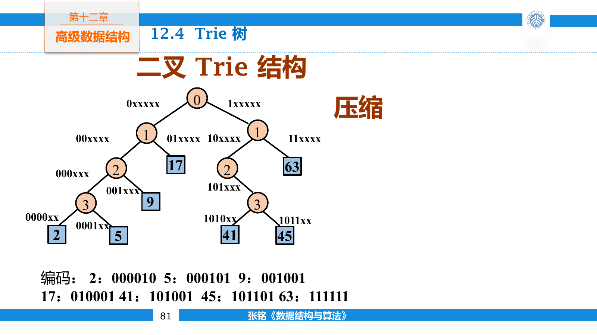

```cpp
int maximumXor(const BinaryTrie& trie, std::uint32_t value) {
    int node = 0;
    std::uint32_t answer = 0;

    for (int bit = 31; bit >= 0; --bit) {
        int current = value >> bit & 1U;
        int preferred = current ^ 1;

        if (trie[node].child[preferred] != -1) {
            answer |= 1U << bit;
            node = trie[node].child[preferred];
        } else {
            node = trie[node].child[current];
        }
    }
    return answer;
}
```

多重集合还要在结点中保存经过次数。删除一个值时沿路径递减计数，计数为零的分支不再参与查询。

### 后缀结构

#### 后缀树

字符串 $S$ 的后缀树保存所有后缀。直接把每个后缀插入 Trie 会产生 $O(n^2)$ 个字符结点；压缩单孩子路径后，后缀树只需 $O(n)$ 个显式结点，边标签用原串中的起止下标表示，不复制子串。

为保证每个后缀都结束在叶结点，通常在字符串末尾加入未出现过的终止字符 `$`。例如 `ababc$` 的后缀包括 `ababc$`、`babc$`、`abc$`、`bc$`、`c$` 与 `$`。

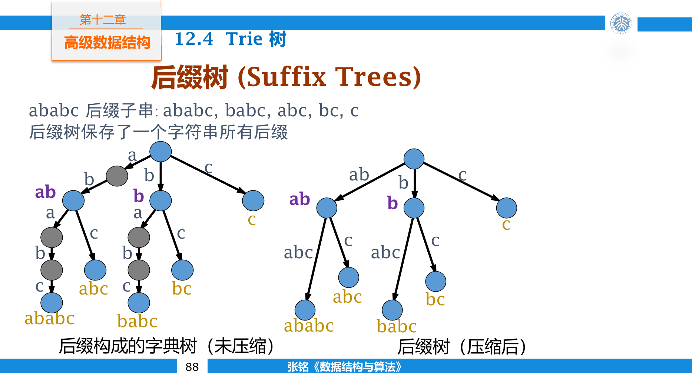

模式 $P$ 是否出现，只需沿边标签匹配 $P$ 。匹配成功后，当前子树的所有叶结点对应出现位置。两个后缀的最长公共前缀等于它们叶结点最近公共祖先的字符串深度。

线性时间构造后缀树的算法实现复杂，常数也不小。后缀数组更紧凑，很多静态字符串问题会优先使用后缀数组与 LCP 数组。

#### 后缀数组与 LCP

后缀数组 `sa[i]` 保存字典序第 $i$ 小后缀的起始位置。对字符串 `banana$`，后缀按序排列为：

```text
6  $
5  a$
3  ana$
1  anana$
0  banana$
4  na$
2  nana$
```

因此 `sa = [6, 5, 3, 1, 0, 4, 2]`。

LCP 数组保存相邻有序后缀的最长公共前缀长度。任意两个后缀 `sa[i]` 与 `sa[j]` 的最长公共前缀，等于 `lcp[i + 1 ... j]` 的最小值。为这个区间最小值建立 RMQ 结构后，可以快速回答任意后缀 LCP。

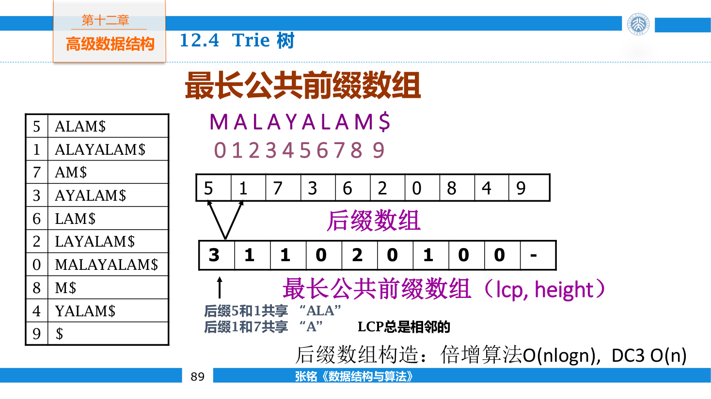

模式检索可以在后缀数组上二分。比较模式与中点后缀后，决定进入字典序左半还是右半；找到第一个与最后一个以模式为前缀的后缀，就得到全部出现位置。

倍增构造每轮把长度为 $2^k$ 的前缀排名组合成长度为 $2^{k+1}$ 的排名，时间通常为 $O(n\log n)$ 。它比线性后缀树容易实现，也更节省指针空间。

## AVL 树

AVL 树是一棵二叉搜索树，并要求每个结点的左右子树高度差不超过一。定义平衡因子为

$$
BF(x)=h(x_{left})-h(x_{right})
$$

每个结点都满足 $BF(x)\in\{-1,0,1\}$ 。空树高度记为零、叶结点高度记为一时，结点高度为两个孩子高度最大值加一。

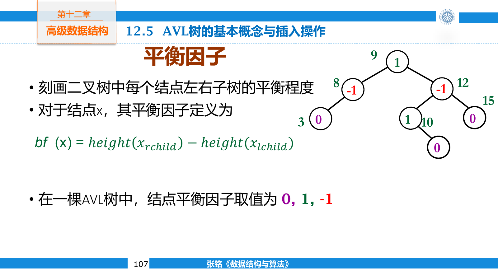

```cpp
struct AvlNode {
    int key;
    int height = 1;
    AvlNode* left = nullptr;
    AvlNode* right = nullptr;
};

int height(AvlNode* node) {
    return node == nullptr ? 0 : node->height;
}

void update(AvlNode* node) {
    node->height = std::max(height(node->left), height(node->right)) + 1;
}

int balanceFactor(AvlNode* node) {
    return height(node->left) - height(node->right);
}
```

### 高度

设高度为 $h$ 的 AVL 树最少结点数为 $N_h$ 。为了让高度达到 $h$ 且结点尽量少，两棵子树高度应为 $h-1$ 与 $h-2$ ，因此

$$
N_h=N_{h-1}+N_{h-2}+1
$$

取 $N_0=0$ 、 $N_1=1$ ，可得 $N_2=2$ 、 $N_3=4$ 、 $N_4=7$ 。这个数列与 Fibonacci 同阶，所以 $N_h$ 随 $h$ 指数增长，反过来得到 AVL 树高度为 $O(\log n)$ 。

AVL 的平衡条件比“整棵树左右高度接近”更强，它要求每个子树都满足相同约束。只检查根无法阻止下方某个子树退化成长链。

### 旋转

#### 单旋

插入 `30, 20, 10` 后，结点 30 的左子树高二、右子树高零，且新键位于左孩子 20 的左侧，形成 LL 型。对 30 右旋后，20 成为局部根，10 与 30 分居两侧。

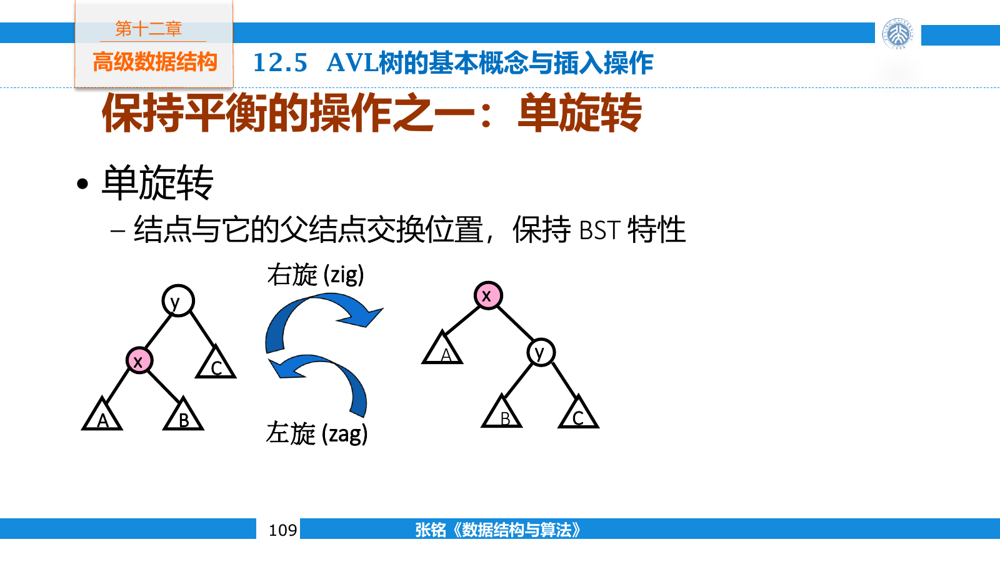

```cpp
AvlNode* rotateRight(AvlNode* root) {
    AvlNode* child = root->left;
    AvlNode* middle = child->right;

    child->right = root;
    root->left = middle;

    update(root);
    update(child);
    return child;
}

AvlNode* rotateLeft(AvlNode* root) {
    AvlNode* child = root->right;
    AvlNode* middle = child->left;

    child->left = root;
    root->right = middle;

    update(root);
    update(child);
    return child;
}
```

更新高度时要先更新下降后的旧根，再更新新的局部根。旋转保持中序次序，因此不会破坏 BST 性质。

RR 型完全对称：插入 `10, 20, 30` 后，对 10 左旋。

#### 双旋

插入 `30, 10, 20` 时，30 左高，但新键位于左孩子 10 的右侧，形成 LR 折线。只对 30 右旋会让结构仍不平衡。

先对左孩子 10 左旋，把 20 提升；再对 30 右旋，20 成为局部根。RL 型则先右旋右孩子，再左旋失衡根。

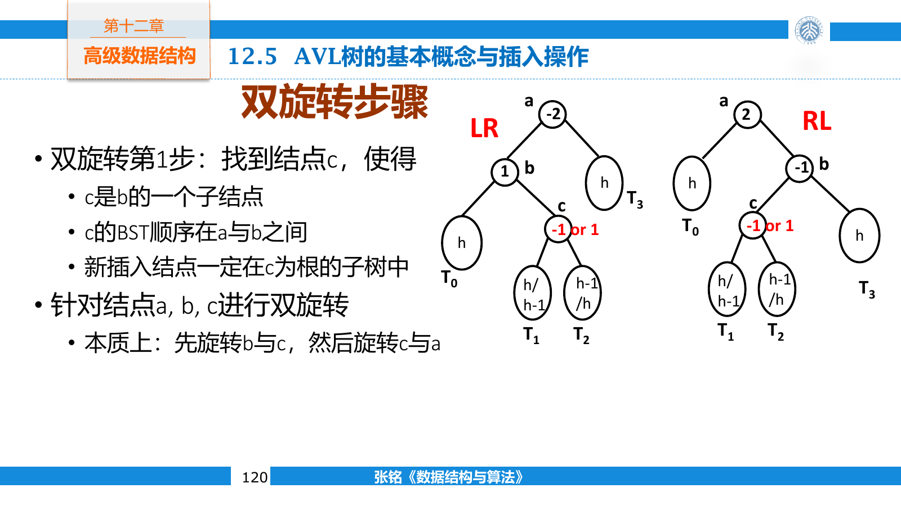

四种情况可以按两个平衡因子判断：

- `BF(root) > 1` 且 `BF(root->left) >= 0`，执行右旋。
- `BF(root) > 1` 且 `BF(root->left) < 0`，先左旋左孩子，再右旋。
- `BF(root) < -1` 且 `BF(root->right) <= 0`，执行左旋。
- `BF(root) < -1` 且 `BF(root->right) > 0`，先右旋右孩子，再左旋。

```cpp
AvlNode* rebalance(AvlNode* root) {
    update(root);
    int factor = balanceFactor(root);

    if (factor > 1) {
        if (balanceFactor(root->left) < 0) {
            root->left = rotateLeft(root->left);
        }
        return rotateRight(root);
    }

    if (factor < -1) {
        if (balanceFactor(root->right) > 0) {
            root->right = rotateRight(root->right);
        }
        return rotateLeft(root);
    }
    return root;
}
```

### 插入

插入先按普通 BST 递归下降，返回时更新高度并检查平衡。

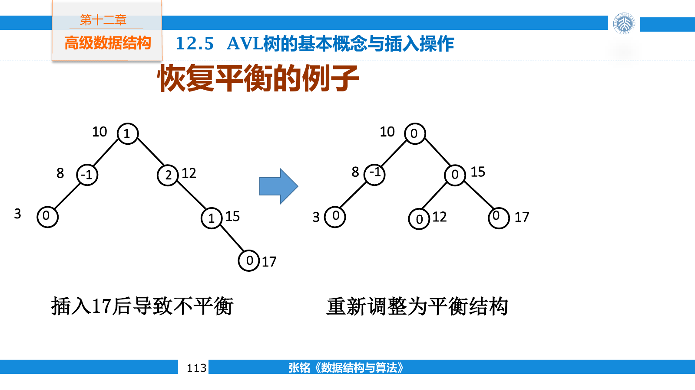

```cpp
AvlNode* insert(AvlNode* root, int key) {
    if (root == nullptr) return new AvlNode{key};

    if (key < root->key) {
        root->left = insert(root->left, key);
    } else if (key > root->key) {
        root->right = insert(root->right, key);
    } else {
        return root;
    }

    return rebalance(root);
}
```

沿插入路径向上遇到的第一个失衡结点完成旋转后，该子树高度会恢复到插入前，因此更高祖先不会继续因本次插入失衡。代码仍可逐层调用 `rebalance`，后续层只会更新并原样返回。

### 删除

删除先按 BST 规则处理。目标有两个孩子时，用前驱或后继替换，最终删除至多只有一个孩子的结点。之后沿返回路径更新高度并重新平衡。

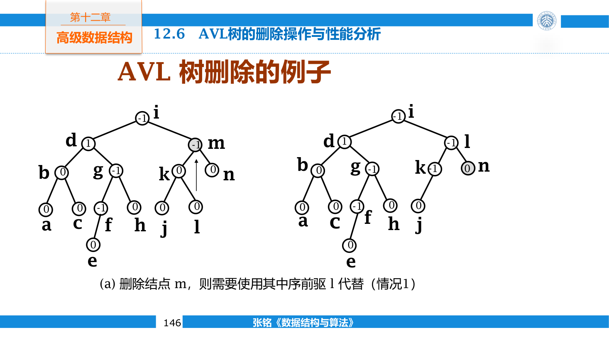

```cpp
AvlNode* erase(AvlNode* root, int key) {
    if (root == nullptr) return nullptr;

    if (key < root->key) {
        root->left = erase(root->left, key);
    } else if (key > root->key) {
        root->right = erase(root->right, key);
    } else if (root->left == nullptr || root->right == nullptr) {
        AvlNode* child = root->left != nullptr ? root->left : root->right;
        delete root;
        return child;
    } else {
        AvlNode* successor = root->right;
        while (successor->left != nullptr) successor = successor->left;
        root->key = successor->key;
        root->right = erase(root->right, successor->key);
    }

    return rebalance(root);
}
```

删除与插入的传播性质不同。删除让一棵子树变矮，某处旋转后局部高度还可能继续下降，使更高祖先再次失衡，因此最坏会在 $O(\log n)$ 个祖先处调整。

删除时较高孩子的平衡因子可能为零。例如左侧过高且 `BF(root->left) == 0` 时仍执行一次右旋；这种情况在插入修复中不会作为第一次失衡出现，不能照搬只判断正负的简化分支。

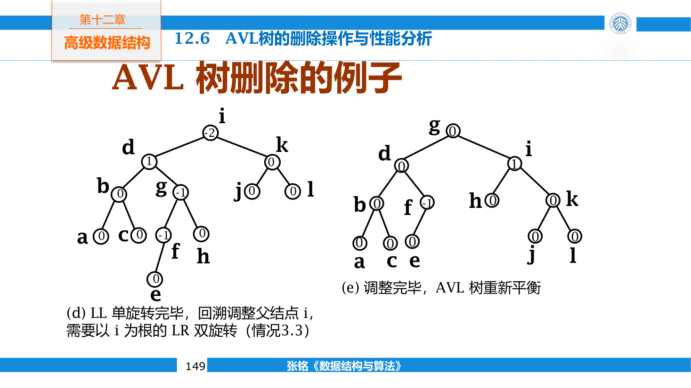

AVL 的查询、插入和删除都保证 $O(\log n)$ 最坏时间。严格平衡让查询路径较短，代价是每个结点保存高度或平衡因子，并在更新时维护。

## 伸展树

伸展树（Splay Tree）不保存高度或颜色。每次查询、插入或删除后，把最近访问的结点通过旋转移到根。频繁访问的键因此靠近顶部，长时间未访问的键逐渐下沉。

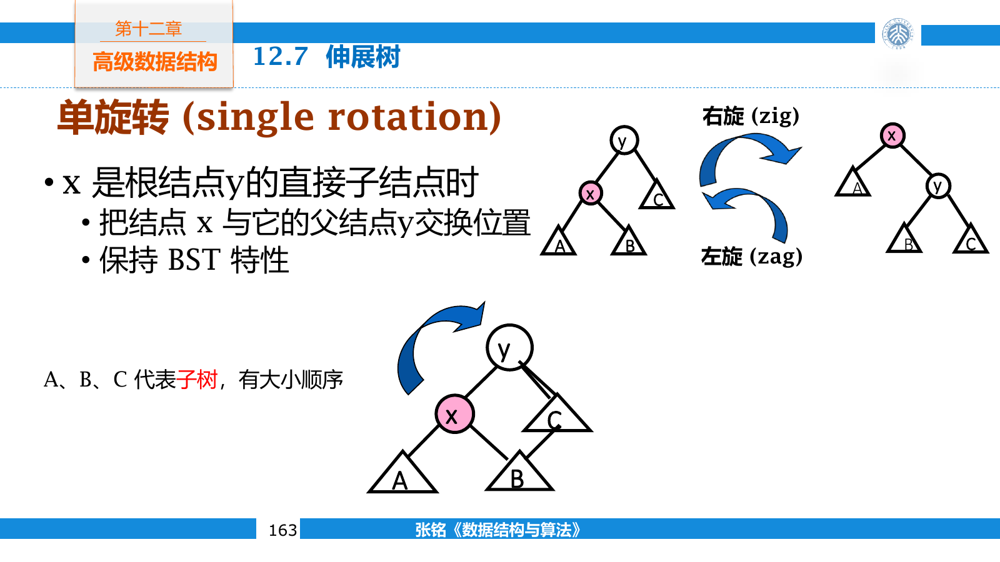

伸展操作考察结点 $x$ 、父结点 $p$ 和祖父结点 $g$ 的相对方向：

- $p$ 已是根时，执行一次 Zig 或 Zag 单旋。
- $x$ 与 $p$ 同为左孩子或同为右孩子时，执行 Zig-Zig 或 Zag-Zag。
- 两段方向相反时，执行 Zig-Zag 或 Zag-Zig。

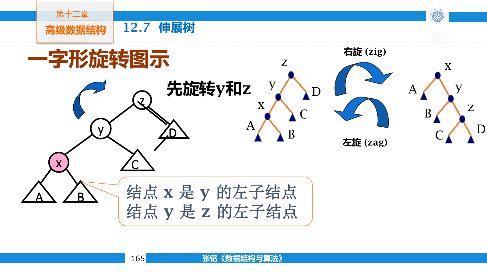

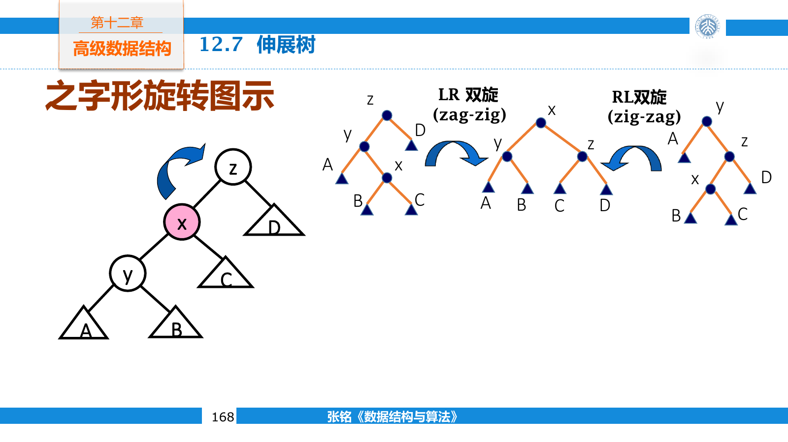

### 伸展过程

同向情况要先旋转父亲与祖父，再旋转结点与父亲。例如路径为 `g -> left p -> left x` 时，先右旋 $g$ ，再右旋 $p$ 。这会同时缩短 $x$ 及原路径中间一批结点的深度。

折线情况围绕 $x$ 连续做两次相反旋转。例如 $x$ 是 $p$ 的右孩子，而 $p$ 是 $g$ 的左孩子时，先左旋 $p$ ，再右旋 $g$ 。

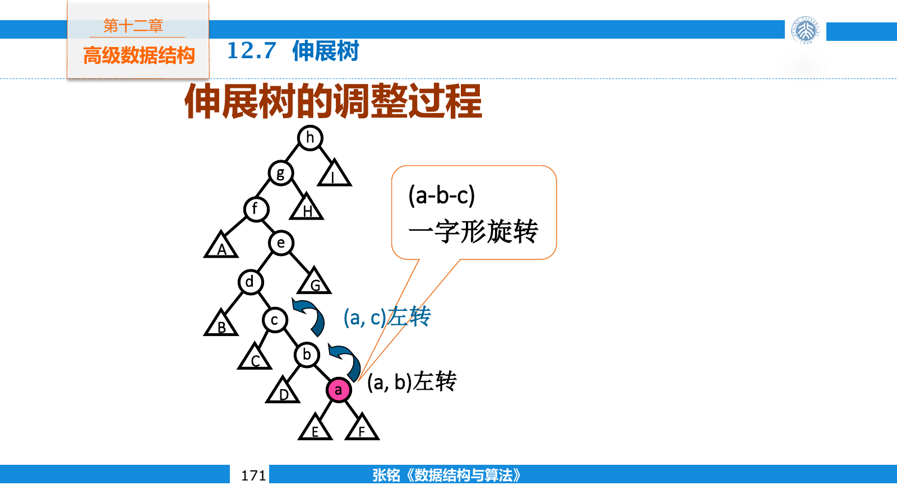

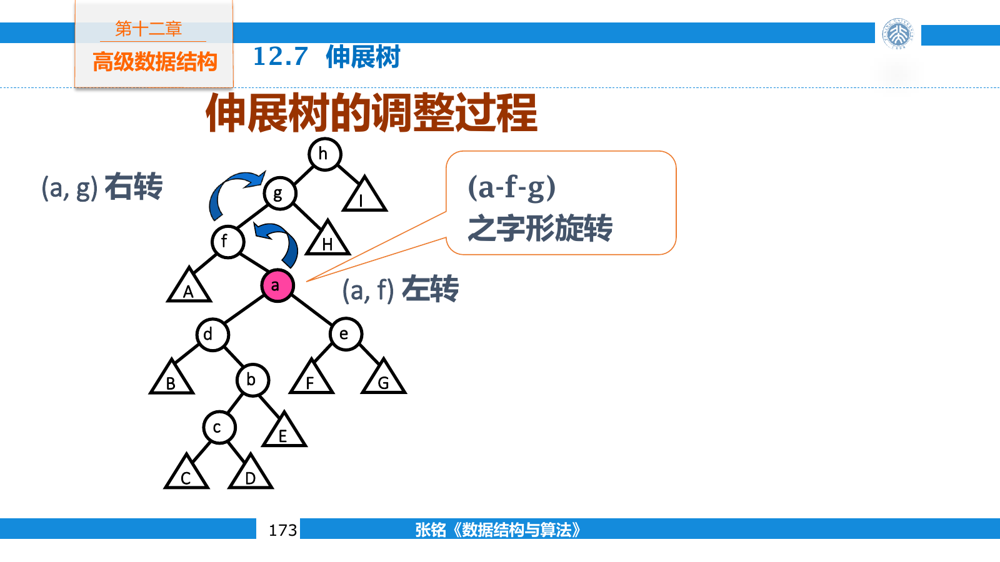

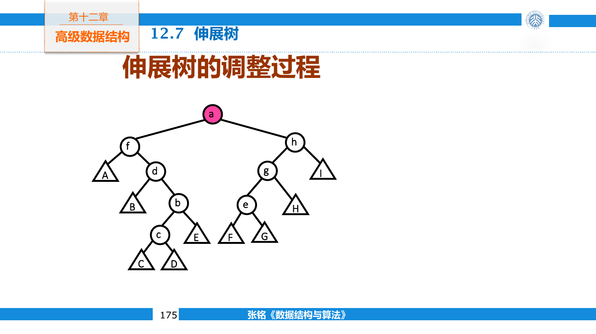

带父指针的框架可以写成：

```cpp
void splay(Node*& root, Node* x) {
    while (x->parent != nullptr) {
        Node* p = x->parent;
        Node* g = p->parent;

        if (g == nullptr) {
            rotate(root, p, x);
        } else if ((g->left == p) == (p->left == x)) {
            rotate(root, g, p);
            rotate(root, p, x);
        } else {
            rotate(root, p, x);
            rotate(root, g, x);
        }
    }
}
```

这里的 `rotate` 要根据孩子方向选择左旋或右旋，并完整维护祖父以上的链接。伸展树实现最容易出错的地方不是旋转公式本身，而是旋转后父指针与整棵树根没有同步更新。

### 查询与插入

查询成功时伸展命中结点。查询失败时，通常伸展搜索路径上最后访问的结点，这会把与目标最接近的边界键带到根附近。

插入可以先按 BST 规则加入叶结点，再把新结点伸展到根。另一种写法先查询并伸展最后访问结点，再以新键与根的大小关系拆分左右子树，把新结点直接放在根。

伸展后，刚访问键位于根。连续访问相同键的下一次操作只需 $O(1)$ ，顺序访问一段键也会逐步重组树形。

### 分裂、合并与删除

按键 $k$ 分裂伸展树时，先查询 $k$ 或最后访问位置并伸展到根。若根键不大于 $k$ ，断开根的右子树即可得到 `<= k` 与 `> k` 两棵树；另一种情况对称处理。

合并两棵满足“左树所有键都小于右树所有键”的伸展树时，把左树最大结点伸展到左树根。此时根不可能有右孩子，再把右树接到它的右侧。

删除目标时，先把目标伸展到根，分离左右子树并释放根。随后把左子树的最大结点伸展为根，再将右子树接到它的右侧，不需要另写一套删除平衡规则。

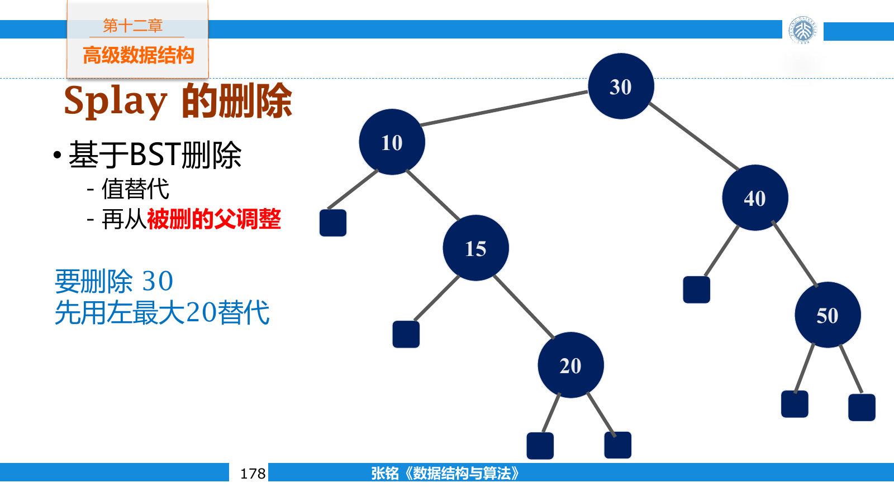

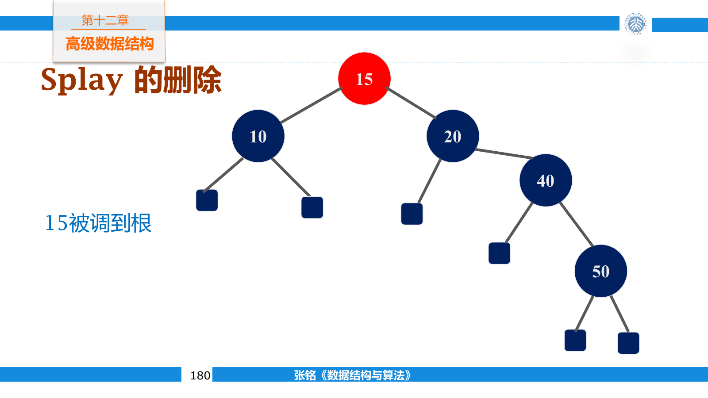

### 均摊复杂度

单次伸展可能沿长度为 $n$ 的链移动，因此伸展树没有逐次 $O(\log n)$ 保证。均摊分析把树中每个结点的子树规模写进势能，昂贵的长路径伸展会显著降低后续势能，从而抵消本次旋转成本。

对初始含 $n$ 个结点的树执行 $m$ 次操作，总时间为

$$
O((m+n)\log n)
$$

当操作数远大于初始结点数时，每次操作均摊为 $O(\log n)$ 。

均摊界不等于平均概率。它不要求输入随机，而是保证任意操作序列的总成本；某一次操作仍可能很慢，因此对单次延迟有硬限制的场景要谨慎使用。

AVL 树严格限制高度差，提供较短查询路径和单次最坏界；红黑树放宽平衡条件，更新旋转通常更少；伸展树不保存平衡信息，利用访问后的自组织获得均摊界。三者都保持 BST 中序次序，但性能保证与状态开销不同。
