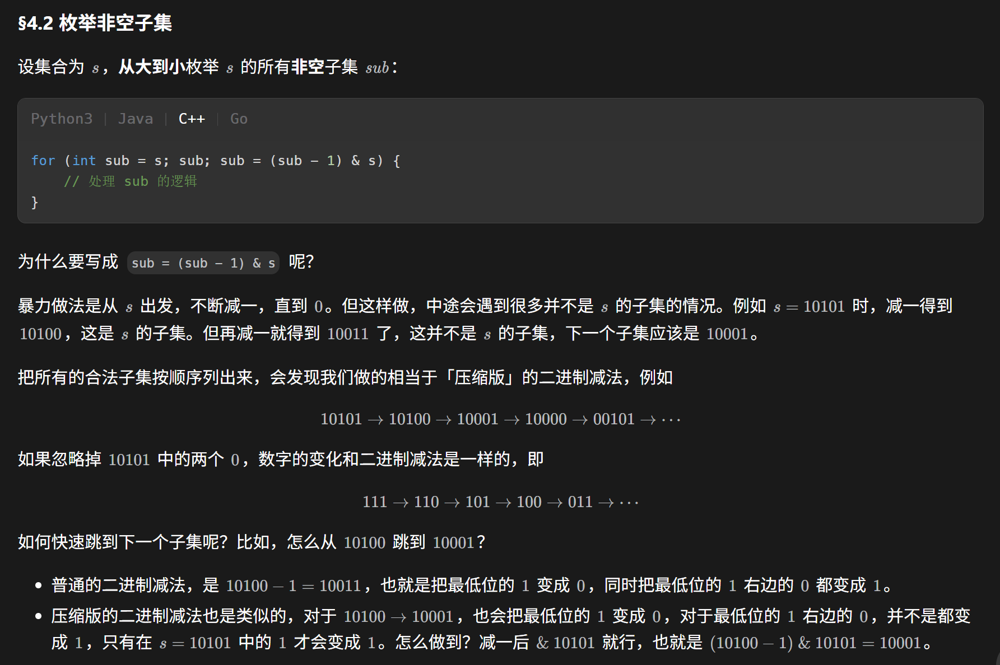

## 简单的填空
### 描述
根据输出完善程序。
```cpp
#include <iostream>
using namespace std;

class A
{
// 在此处补充你的代码
};
int A::a = 0;
int A::b = 0;

int main()
{
    A x;
    {
        A y;
        cout << "1: " << A::a << " " << A::b << endl;
    }
    cout << "2: " << A::a << " " << A::b << endl;

    A *p = new A();
    cout << "3: " << A::a << " " << A::b << endl;

    delete p;
    cout << "4: " << A::a << " " << A::b << endl;
    return 0;
}
```
### 输入
```
None
```
### 输出
```
1: 4 2
2: 3 1
3: 5 2
4: 4 1
```
### Solution
首先，主函数里用大括号定义了一个代码作用域，这说明里面的对象一出来就会被销毁。

再观察输出，不难发现调用``A``默认构造函数时，``a+=2,b++``，调用``A``的析构函数时，``a--,b--``。

```cpp
#include <iostream>
using namespace std;

class A {
public:
    static int a, b;
    A() {
        a += 2;
        b++;
    }
    ~A() {
        a--;
        b--;
    }
    // 在此处补充你的代码
};
int A::a = 0;
int A::b = 0;

int main() {
    A x;
    {
        A y;
        cout << "1: " << A::a << " " << A::b << endl;
    }
    cout << "2: " << A::a << " " << A::b << endl;

    A *p = new A();
    cout << "3: " << A::a << " " << A::b << endl;

    delete p;
    cout << "4: " << A::a << " " << A::b << endl;
    system("pause");
    return 0;
}
```
## 简单的整数运算
### 描述
根据输出完善程序。
```cpp
#include <stdio.h>
#include <iostream>
using namespace std;
class MyInteger{
public:
  unsigned char C;
  MyInteger(unsigned char c='0'): C(c) {}
// 在此处补充你的代码
};

int main() { 
  unsigned char m,n;
  cin >> m >> n;
  MyInteger n1(m), n2(n);
  MyInteger n3;
  n3 = n1*n2;
  MyInteger n4 = n1+n2+n3;
  cout << int(n3) << endl;
  cout << n1+n2+n3 << endl;
  return 0;
}
```
### 输入
$0 \sim 9$ 之间的两个整数 $m,n$ 。

```
3 4
```
### 输出
输出 $m \times n,$ 以及 $m \times n + m + n$ 。

```
12
19
```
### Solution
重题，跟之前的题目比，此处仅需重载一个加号，详细思路见[elainafan-从零开始的上机(6)](https://www.elainafan.one/p/%E4%BB%8E%E9%9B%B6%E5%BC%80%E5%A7%8B%E7%9A%84%E4%B8%8A%E6%9C%BA6/#%E7%AE%80%E5%8D%95%E7%9A%84%E6%95%B4%E6%95%B0%E7%B1%BB)。

```cpp
#include <stdio.h>

#include <iostream>

using namespace std;
class MyInteger {
public:
    unsigned char C;
    MyInteger(unsigned char c = '0') : C(c) {}
    MyInteger operator*(const MyInteger &other) {
        int x = C - '0';
        int y = other.C - '0';
        int d = x * y;
        return MyInteger('0' + d);
    }
    MyInteger operator+(const MyInteger &other) {
        int x = C - '0';
        int y = other.C - '0';
        int d = x + y;
        return MyInteger('0' + d);
    }
    operator int() { return C - '0'; }
    friend ostream &operator<<(ostream &os, const MyInteger &other) {
        os << (other.C - '0');
        return os;
    }
    // 在此处补充你的代码
};

int main() {
    unsigned char m, n;
    cin >> m >> n;
    MyInteger n1(m), n2(n);
    MyInteger n3;
    n3 = n1 * n2;
    MyInteger n4 = n1 + n2 + n3;
    cout << int(n3) << endl;
    cout << n1 + n2 + n3 << endl;
    system("pause");
    return 0;
}
```
## 统计二进制里1的个数
### 描述
请你实现count函数。

该函数的功能为，给定一个正整数 $x(x < 2^{32})$ ，输出它的二进制表示里有多少个1。

```cpp
#include<iostream>
using namespace std;
int count(unsigned int x) {
// 在此处补充你的代码
}
int main() {
	int T; cin >> T;
	while (T--) {
		unsigned x; cin >> x;
		cout << count(x) << endl;
	}
	return 0;
}
```
### 输入
第一行一个正整数 $T$ ，表示数据组数。

接下来 $T$ 行，每行一个正整数，表示给定的 $x$ 。

```
3
15
3
2147483648
```
### 输出
对于每组数据，输出一行一个数，表示 $x$ 二进制表示里1的个数。

```
4
2
1
```
### Solution
事实上，在库函数中，这题是有``popcount((unsigned)x)``的直接用法的。

这里需要实现它，于是把``x``的二进制位逐一拆开计数即可。
```cpp
#include <iostream>
using namespace std;
int count(unsigned int x) {
    // 在此处补充你的代码
    int ans = 0;
    while (x > 0) {
        if (x % 2) ans++;
        x >>= 1;
    }
    return ans;
}
int main() {
    int T;
    cin >> T;
    while (T--) {
        unsigned x;
        cin >> x;
        cout << count(x) << endl;
    }
    system("pause");
    return 0;
}
```
## attack
### 描述
根据输出完善程序。
```cpp
#include <iostream>
#include <string>
using namespace std;

class Slime{
// 在此处补充你的代码
};
	
class HydroSlime: public Slime{
public:
	string name() {return "Hydro Slime";}
	HydroSlime() {cout << "A hydro slime appears...\n";}
	~HydroSlime() {cout << "A hydro slime disappears...\n";}
};

class PyroSlime: public Slime{
public:
	string name () {return "Pyro Slime";}
	PyroSlime() {cout << "A pyro slime appears...\n";}
	~PyroSlime() {cout << "A pyro slime disappears...\n";}
};

int main(){
	Slime *a = new HydroSlime, *b = new PyroSlime;
	a->attack(b);
	b->attack(a);
	delete a;
	delete b;
	return 0;
}
```
### 输入
```
None
```
### 输出
```
A slime appears...
A hydro slime appears...
A slime appears...
A pyro slime appears...
Hydro Slime attacked Pyro Slime
Pyro Slime attacked Hydro Slime
A hydro slime disappears...
A slime disappears...
A pyro slime disappears...
A slime disappears...
```
### Solution
首先观察代码，首先这里需要一个``Slime``类的默认构造函数，它需要输出相关语句。

同时，由于它的析构函数最后被调用（由输出得到），因此它的析构函数是虚析构函数。

接着就看这个``attack``函数了，不难看出这里调用的是基类的``attack``函数，同时它调用了两个指针的``name``，由于它调用自身``name``调用的是``PyroSlime``类的，因此这里是多态，也就是``Slime``类内也要实现一个``name``虚函数，具体是啥没有关系。
```cpp
#include <iostream>
#include <string>
using namespace std;

class Slime {
private:
public:
    Slime() { cout << "A slime appears..." << endl; }
    virtual ~Slime() { cout << "A slime disappears..." << endl; }
    virtual string name() { return ""; }
    void attack(Slime* other) {
        cout << name() << ' ';
        cout << "attacked ";
        cout << other->name();
        cout << endl;
    }
    // 在此处补充你的代码
};

class HydroSlime : public Slime {
public:
    string name() { return "Hydro Slime"; }
    HydroSlime() { cout << "A hydro slime appears...\n"; }
    ~HydroSlime() { cout << "A hydro slime disappears...\n"; }
};

class PyroSlime : public Slime {
public:
    string name() { return "Pyro Slime"; }
    PyroSlime() { cout << "A pyro slime appears...\n"; }
    ~PyroSlime() { cout << "A pyro slime disappears...\n"; }
};

int main() {
    Slime *a = new HydroSlime, *b = new PyroSlime;
    a->attack(b);
    b->attack(a);
    delete a;
    delete b;
    system("pause");
    return 0;
}
```
## 奇怪的括号
### 描述
根据程序完善代码。
```cpp
#include <cstdio>
#include <iostream>
using namespace std;

class f {
// 在此处补充你的代码
};

int main() {
  cout << f(4)(5) << endl;
  cout << f(64)(36) << endl;
  cout << f(3)(5)(7) << endl;
  cout << f(3,8) << endl;
  cout << f(15,3) << endl;
  cout << f(7,10) << endl;
}
```
### 输入
```
None
```
### 输出
```
9
100
15
24
45
70
```
### Solution
观察输出，不难发现需要实现传入一个整型的转换构造函数和传入两个整型的转换构造函数，且前者直接赋值，后者相乘。

由于有链式调用，因此重载``()``运算符时，需要返回``f``类型对象而非``int``，因此同样需要重载输出运算符。

```cpp
#include <cstdio>
#include <iostream>
using namespace std;

class f {
private:
    int num;

public:
    f(int x) : num(x) {}
    f operator()(int x) {
        f temp(x + num);
        return temp;
    }
    friend ostream &operator<<(ostream &os, const f &other) {
        os << other.num;
        return os;
    }
    f(int a, int b) : num(a * b) {}
    // 在此处补充你的代码
};

int main() {
    cout << f(4)(5) << endl;
    cout << f(64)(36) << endl;
    cout << f(3)(5)(7) << endl;
    cout << f(3, 8) << endl;
    cout << f(15, 3) << endl;
    cout << f(7, 10) << endl;
    system("pause");
    return 0;
}
```
## MySet
### 描述
实现 set 的子类并重载成员函数 insert() 与 erase()，使得：

1. 在插入重复元素时，会输出提示信息 "Error insert v"，其中 v 是插入的元素，并不执行插入操作。  

2. 在删除不存在的元素时，会输出提示信息 "Error erase v"，其中 v 是想要删除的元素，并不执行删除操作。  

其余情况下行为与 set 行为完全相同。
```cpp
#include <set>
#include <iostream>
using namespace std;
template <class T>
class MySet: public set<T> {
public:
// 在此处补充你的代码
};
int main(){
	int n; scanf("%d",&n);
	MySet<int> S;
	for (int i=1;i<=n;i++){
		cout<<"Operation #"<<i<<":"<<endl;
		string type; int w;
		cin>>type>>w;
		if (type=="insert") S.insert(w);
		else if (type=="erase") S.erase(w);
	}
	cout<<endl;
	MySet<string> S2;
	for (int i=1;i<=n;i++){
		cout<<"Operation #"<<i<<":"<<endl;
		string type; string w;
		cin>>type>>w;
		if (type=="insert") S2.insert(w);
		else if (type=="erase") S2.erase(w);
	}
}
```
### 输入
```
4
insert 1
insert 1
erase 1
erase 2
insert a
insert b
erase a
erase a
```
### 输出
```
Operation #1:
Operation #2:
Error insert 1
Operation #3:
Operation #4:
Error erase 2

Operation #1:
Operation #2:
Operation #3:
Operation #4:
Error erase a
```
### Solution
这里已经显然是用模板类了。

根据题意，只需要实现找不到时输出错误，不然就执行原有操作，这里不多解释了，不难。
```cpp
#include <iostream>
#include <set>

using namespace std;
template <class T>
class MySet : public set<T> {
public:
    set<T> ma;
    void insert(T x) {
        if (ma.find(x) != ma.end())
            cout << "Error insert " << x << endl;
        else
            ma.insert(x);
        return;
    }
    void erase(T x) {
        if (ma.find(x) == ma.end())
            cout << "Error erase " << x << endl;
        else
            ma.erase(x);
        return;
    }
    // 在此处补充你的代码
};
int main() {
    int n;
    scanf("%d", &n);
    MySet<int> S;
    for (int i = 1; i <= n; i++) {
        cout << "Operation #" << i << ":" << endl;
        string type;
        int w;
        cin >> type >> w;
        if (type == "insert")
            S.insert(w);
        else if (type == "erase")
            S.erase(w);
    }
    cout << endl;
    MySet<string> S2;
    for (int i = 1; i <= n; i++) {
        cout << "Operation #" << i << ":" << endl;
        string type;
        string w;
        cin >> type >> w;
        if (type == "insert")
            S2.insert(w);
        else if (type == "erase")
            S2.erase(w);
    }
    system("pause");
    return 0;
}
```
## Singleton
### 描述
程序的输入为若干个整数，每次读取一个整数后，输出目前已经读入的整数数目，以及这些整数的和。
```cpp
#include <iostream>
using namespace std;

class Singleton
{ 
private:
    int val;
    int cnt;
	Singleton() : val(0), cnt(0) {};
    static Singleton* instance;
	
public:
    void Add(int delta) {
        val += delta;
        cnt += 1;
    }
    void Print() {
        cout << cnt << " " << val << endl;
    }
// 在此处补充你的代码
};

Singleton* Singleton::instance = NULL;

int main()
{
    int m;
    while (cin>>m) {
        Singleton* p = Singleton::getInstance();
        p->Add(m);
        p->Print();
    }
    
    return 0;
}
```
### 输入
若干行，每行一个整数。
```
1
2
```
### 输出
每次读取一个整数后，输出目前已经读入的整数数目，以及这些整数的和。

```
1 1
2 3
```
### Solution
在私有变量中，有一个静态成员指针，初始化为空。

再看到主函数中，需要实现一个``getInstance``的静态成员函数，根据名字也不难猜到它能返回当前对象的指针。

而且，这道题肯定只需要创建一个类对象就可以完成，否则剩下的成员对象不好处理。

那么，这个函数的逻辑就是，如果``instance``为空就新建一个对象，否则返回``instance``指向的对象。

```cpp
#include <iostream>
using namespace std;

class Singleton {
private:
    int val;
    int cnt;
    Singleton() : val(0), cnt(0) {};
    static Singleton* instance;

public:
    void Add(int delta) {
        val += delta;
        cnt += 1;
    }
    void Print() { cout << cnt << " " << val << endl; }
    static Singleton* getInstance() {
        if (instance == NULL) {
            instance = new Singleton();
        }
        return instance;
    }
    // 在此处补充你的代码
};

Singleton* Singleton::instance = NULL;

int main() {
    int m;
    while (cin >> m) {
        Singleton* p = Singleton::getInstance();
        p->Add(m);
        p->Print();
    }
    system("pause");
    return 0;
}
```
## 又又见模板
### 描述
根据输出完善程序。
```cpp
#include <iostream>
#include <string>
using namespace std;
template<class T, int num>
class A {
public:
	T* p = NULL;
	A(T* a) {
		p = new T[num];
		for (int i = 0; i < num; ++i) *(p + i) = a[i];
	}
	~A() {
		if (p) {
			delete[] p;
			p = NULL;
		}
	}
// 在此处补充你的代码
int main() {

	int t;
	cin >> t;
	while (t--) {
		int b1[10];
		for (int i = 0; i < 10; ++i)
			cin >> b1[i];

		A<int, 10> a1 = b1;
		cout << a1 << endl;

		double b2[5];
		for (int i = 0; i < 5; ++i)
			cin >> b2[i];

		A<double, 5> a2 = b2;
		print_sum(a2);
		cout << a2.sum() << endl;

		string b3[4];
		for (int i = 0; i < 4; ++i)
			cin >> b3[i];
		A<string, 4> a3 = b3;
		print_sum(a3);
		cout << a3.sum() << endl;
	}
	return 0;
}
```
### 输入
第一行是整数 $n$ ，表示有 $n$ 组数据。

每组数据有3行，第一行是10个整数，第二行是5个小数，第三行是4个不带空格的字符串，它们之间用空格分隔。

```
1
1 2 3 4 5 6 7 8 9 10
4.2 0.0 3.1 2.7 5.2
Hello , world !
```
### 输出
先输出10个整数。 

再连续输出两次5个小数的和 （不用考虑小数点后面几位，用cout直接输出即可）。

再连续输出两次4个字符串连在一起的字符串。

```
1 2 3 4 5 6 7 8 9 10 
15.2
15.2
Hello,world!
Hello,world!
```
### Solution
做这种题有个小技巧：外部可以填空的，说明类外面一般有东西要写。

观察代码，不难发现这里需要使用模板类，第二个参数默认为``int``。

并且，它为了存数组，肯定是需要用一个``T*``指针，在构造函数中向堆取空间，析构函数中释放空间，并且调用``sum``的时候实现题目操作。

同时，观察到需要重载输出运算符，以及类外面要写一个``print_sum``函数，它也是模板函数，进行累加即可。
```cpp
#include <iostream>
#include <string>
using namespace std;
template <class T, int num>
class A {
public:
    T *p = NULL;
    A(T *a) {
        p = new T[num];
        for (int i = 0; i < num; ++i) *(p + i) = a[i];
    }
    ~A() {
        if (p) {
            delete[] p;
            p = NULL;
        }
    }
    friend ostream &operator<<(ostream &os, const A<T, num> &other) {
        for (int i = 0; i < num; i++) {
            os << other.p[i] << ' ';
        }
        return os;
    }
    T sum() {
        T temp = p[0];
        for (int i = 1; i < num; i++) {
            temp += p[i];
        }
        return temp;
    }
};
template <class T, int num>
void print_sum(const A<T, num> &other) {
    T temp = other.p[0];
    for (int i = 1; i < num; i++) {
        temp += other.p[i];
    }
    cout << temp << endl;
}
// 在此处补充你的代码
int main() {
    int t;
    cin >> t;
    while (t--) {
        int b1[10];
        for (int i = 0; i < 10; ++i) cin >> b1[i];

        A<int, 10> a1 = b1;
        cout << a1 << endl;

        double b2[5];
        for (int i = 0; i < 5; ++i) cin >> b2[i];

        A<double, 5> a2 = b2;
        print_sum(a2);
        cout << a2.sum() << endl;

        string b3[4];
        for (int i = 0; i < 4; ++i) cin >> b3[i];
        A<string, 4> a3 = b3;
        print_sum(a3);
        cout << a3.sum() << endl;
    }
    system("pause");
    return 0;
}
```
## 怎么又是CArray3d三维数组模板类
### 描述
根据输出完善程序。
```cpp
#include <iostream>
#include <iomanip>
#include <cstring>
using namespace std;
template <class T>
class CArray3D
{
public:
    int x;
    int y;
    int z;
    T* p;
   
    CArray3D(int xx, int yy, int zz) {
        x = xx;
        y = yy;
        z = zz;
        p = new T[x * y * z];
    }
    ~CArray3D() {
        delete[]p;
    }
// 在此处补充你的代码
};
CArray3D<int> a(3, 4, 5);
CArray3D<int>aa(3, 4, 5);
void PrintA()
{
    for (int i = 0; i < 3; ++i) {
        cout << "layer " << i << ":" << endl;
        for (int j = 0; j < 4; ++j) {
            for (int k = 0; k < 5; ++k)
                cout << a[i][j][k] << ",";
            cout << endl;
        }
    }
}
void PrintAA()
{
    for (int i = 0; i < 3; ++i) {
        cout << "layer " << i << ":" << endl;
        for (int j = 0; j < 4; ++j) {
            for (int k = 0; k < 5; ++k)
                cout << aa[i][j][k] << ",";
            cout << endl;
        }
    }
}
int main()
{
    int No = 0;
    for (int i = 0; i < 3; ++i)
        for (int j = 0; j < 4; ++j)
            for (int k = 0; k < 5; ++k)
            {
                a[i][j][k] = No++;
                aa[i][j][k] = a[i][j][k]+a[i][j][0];
            }
    PrintA();
    PrintAA();
    a + aa;//计算内部每个元素对应求和,更新a
    PrintA();

    memset(a, -1, 60 * sizeof(int));        //注意这里
    memset(a[1][1], 0, 5 * sizeof(int));
    PrintA();

    return 0;
}
```
### 输入
```
None
```
### 输出
```
layer 0:
0,1,2,3,4,
5,6,7,8,9,
10,11,12,13,14,
15,16,17,18,19,
layer 1:
20,21,22,23,24,
25,26,27,28,29,
30,31,32,33,34,
35,36,37,38,39,
layer 2:
40,41,42,43,44,
45,46,47,48,49,
50,51,52,53,54,
55,56,57,58,59,
layer 0:
0,1,2,3,4,
10,11,12,13,14,
20,21,22,23,24,
30,31,32,33,34,
layer 1:
40,41,42,43,44,
50,51,52,53,54,
60,61,62,63,64,
70,71,72,73,74,
layer 2:
80,81,82,83,84,
90,91,92,93,94,
100,101,102,103,104,
110,111,112,113,114,
layer 0:
0,2,4,6,8,
15,17,19,21,23,
30,32,34,36,38,
45,47,49,51,53,
layer 1:
60,62,64,66,68,
75,77,79,81,83,
90,92,94,96,98,
105,107,109,111,113,
layer 2:
120,122,124,126,128,
135,137,139,141,143,
150,152,154,156,158,
165,167,169,171,173,
layer 0:
-1,-1,-1,-1,-1,
-1,-1,-1,-1,-1,
-1,-1,-1,-1,-1,
-1,-1,-1,-1,-1,
layer 1:
-1,-1,-1,-1,-1,
0,0,0,0,0,
-1,-1,-1,-1,-1,
-1,-1,-1,-1,-1,
layer 2:
-1,-1,-1,-1,-1,
-1,-1,-1,-1,-1,
-1,-1,-1,-1,-1,
-1,-1,-1,-1,-1,
```
### Solution
重题，这题无非只是需要多重载一个加号而已，不是啥难事，直接将一个指针所有元素累加到另一个指针对应的空间上即可。

其他思路见[elainafan-从零开始的上机(7)](https://www.elainafan.one/p/%E4%BB%8E%E9%9B%B6%E5%BC%80%E5%A7%8B%E7%9A%84%E4%B8%8A%E6%9C%BA7/#%E6%94%B9%E8%89%AF%E8%BF%87%E7%9A%84carray3d%E4%B8%89%E7%BB%B4%E6%95%B0%E7%BB%84%E6%A8%A1%E6%9D%BF%E7%B1%BB)。
```cpp
#include <iostream>
#include <iomanip>
#include <cstring>
using namespace std;
template <class T>
class CArray3D
{
public:
    int x;
    int y;
    int z;
    T* p;
   
    CArray3D(int xx, int yy, int zz) {
        x = xx;
        y = yy;
        z = zz;
        p = new T[x * y * z];
    }
    ~CArray3D() {
        delete[]p;
    }
class CArray2D{
    private:
        T* dd;
        int z;
    public:
        CArray2D(T* ddg,int a):dd(ddg),z(a) { }
        operator T(){
            return dd;
        }
        T* operator[](int index){
            T* ddg;
            ddg=dd+index*z;
            return ddg;
        }
        operator T*(){
            return dd;
        }
    };
    CArray2D operator[](int index){
        T* dd=p+index*y*z;
        return CArray2D(dd,z);
    }
    CArray3D& operator+(const CArray3D &other){
        for(int i=0;i<x*y*z;i++){
            p[i]+=other.p[i];
        }
        return *this;
    }
    operator T*(){
        return p;
    }
};
CArray3D<int> a(3, 4, 5);
CArray3D<int>aa(3, 4, 5);
void PrintA()
{
    for (int i = 0; i < 3; ++i) {
        cout << "layer " << i << ":" << endl;
        for (int j = 0; j < 4; ++j) {
            for (int k = 0; k < 5; ++k)
                cout << a[i][j][k] << ",";
            cout << endl;
        }
    }
}
void PrintAA()
{
    for (int i = 0; i < 3; ++i) {
        cout << "layer " << i << ":" << endl;
        for (int j = 0; j < 4; ++j) {
            for (int k = 0; k < 5; ++k)
                cout << aa[i][j][k] << ",";
            cout << endl;
        }
    }
}
int main()
{
    int No = 0;
    for (int i = 0; i < 3; ++i)
        for (int j = 0; j < 4; ++j)
            for (int k = 0; k < 5; ++k)
            {
                a[i][j][k] = No++;
                aa[i][j][k] = a[i][j][k]+a[i][j][0];
            }
    PrintA();
    PrintAA();
    a + aa;//计算内部每个元素对应求和,更新a
    PrintA();

    memset(a, -1, 60 * sizeof(int));        //注意这里
    memset(a[1][1], 0, 5 * sizeof(int));
    PrintA();

    return 0;
}
```
## Myaccumulate
### 描述
程序填空输出指定结果，要求实现类似accumulate的模板。
```cpp
#include <iostream>
#include <string.h>
#include <cstring>
using namespace std;
// 在此处补充你的代码
int sqr(int n) {
    return n * n;
}
string rev(string s){
    return string(s.rbegin(),s.rend()); ;
}
int main() {
    int a[100];
    string b[100];
    int n;
    cin >> n;
    for(int i = 0;i < n; ++i)
      cin >> a[i];
    for(int i = 0;i < n; ++i)
      cin >> b[i];
    cout << Myaccumulate(a, n, sqr) << endl;
    cout << Myaccumulate(b, n, rev) << endl;
    cout << MyAccumulate<int>()(a, n-1, sqr) << endl;
    cout << MyAccumulate<string>()(b+1, n-1, rev) << endl;
    return 0;
}
```
### 输入
第一行是数组长度 $n (5 < n < 100)$ 。

接下来 $n$ 行，每行一个小于等于1000的正整数。

再接下来 $n$ 行，每行一个非空字符串，字符串均由小写字母组成，长度不超过 100。
```
5
1
2
3
4
5
alice
bob
cccc
dog
emo
```
### 输出

```
55
ecilabobccccgodome
30
bobccccgodome
```
### Solution
首先观察代码，很显然这里的``Muaccumalate``需要分别以模板函数和模板类仿函数的形式实现。

然后就不难了，只需要跟之前一样就行，注意这里操作函数也需要作为一个模板类对象传入。

```cpp
#include <string.h>

#include <cstring>
#include <iostream>

using namespace std;
template <class T, class Pred>
T Myaccumulate(T* x, int num, Pred f) {
    T temp = f(*x);
    for (T* it = x + 1; it < x + num; it++) {
        temp += f(*it);
    }
    return temp;
}
template <class T>
class MyAccumulate {
    T temp;

public:
    MyAccumulate() {}
    template <class Pred>
    T operator()(T* x, int num, Pred f) {
        temp = f(*x);
        for (T* it = x + 1; it < x + num; it++) {
            temp += f(*it);
        }
        return temp;
    }
};
int sqr(int n) { return n * n; }
string rev(string s) {
    return string(s.rbegin(), s.rend());
    ;
}
int main() {
    int a[100];
    string b[100];
    int n;
    cin >> n;
    for (int i = 0; i < n; ++i) cin >> a[i];
    for (int i = 0; i < n; ++i) cin >> b[i];
    cout << Myaccumulate(a, n, sqr) << endl;
    cout << Myaccumulate(b, n, rev) << endl;
    cout << MyAccumulate<int>()(a, n - 1, sqr) << endl;
    cout << MyAccumulate<string>()(b + 1, n - 1, rev) << endl;
    return 0;
}
```
## Option
### 描述
Option 是个有趣的类，它可以保存一个正常的值，也可以是空值（None）。

根据输出完善程序。
```cpp
#include <iomanip>
#include <iostream>
using namespace std;

class TNone {};
TNone None;
// 在此处补充你的代码
int main() {
  cout << boolalpha;

  Option<int> a(0), b, c(1);
  cout << a.has_value() << endl;
  cout << b.has_value() << endl;
  b = a;
  *b += 10;
  cout << a.value() << endl;
  cout << b.value() << endl;
  c = None;
  cout << c.has_value() << endl;

  Option< Option<int> > x = None;
  const Option< Option<int> > y = a;
  Option< Option<int> > z = c;
  if (x)
    cout << "x has value" << endl;
  if (y)
    cout << "y has value" << endl;
  if (z)
    cout << "z has value" << endl;
  x = y;
  x = x;
  *x = b;
  **x = 20;
  cout << x.value().value() + **y << endl;
  return 0;
}
```
### 输入
```
None
```
### 输出
```
true
false
0
10
false
y has value
z has value
20
```
### Solution
观察代码，首先发现这里``Option``是一个模板类，同时它有默认构造函数和转换构造函数（两种，一种传入``TNone``，另一种传入``T``）。

可以用一个``bool``型变量表示是否被赋值，然后可以用一个``T``型变量表示被赋的值。

同时，可以看到需要实现``Option``类到``bool``类的强制类型转换函数，由于``const``变量只能调用``const``函数，所以要重载两个。

随后，可以实现``has_value``和``value``函数，返回是否被赋值和被赋的值。

再往下看，由于``*b+=10``，需要重载``*``，使其返回``T&``对象（因为有修改）。

此时还有报错，看到这里有``**y``，但是如上文所说，``const``变量只能调用``const``函数，因此还需要重载``const``的``*``。

注意，这里``**``其实就是返回``T&``，这点通过链式调用可以看出，同时题目中的赋值都是默认传值，可以不用重载采取编译器默认行为。
 
```cpp
#include <iomanip>
#include <iostream>
using namespace std;

class TNone {};
TNone None;
template <class T>
class Option {
private:
    bool valu;
    T val;

public:
    Option(T x) : val(x), valu(true) {}
    Option() : valu(false) {}
    bool has_value() { return valu; }
    T& operator*() { return val; }
    T operator*() const { return val; }
    T value() { return val; }
    Option(TNone& other) : valu(false) {}
    operator bool() { return valu; }
    operator bool() const { return valu; }
};
// 在此处补充你的代码
int main() {
    cout << boolalpha;

    Option<int> a(0), b, c(1);
    cout << a.has_value() << endl;
    cout << b.has_value() << endl;
    b = a;
    *b += 10;
    cout << a.value() << endl;
    cout << b.value() << endl;
    c = None;
    cout << c.has_value() << endl;

    Option<Option<int> > x = None;
    const Option<Option<int> > y = a;
    Option<Option<int> > z = c;
    if (x) cout << "x has value" << endl;
    if (y) cout << "y has value" << endl;
    if (z) cout << "z has value" << endl;
    x = y;
    x = x;
    *x = b;
    **x = 20;
    cout << x.value().value() + **y << endl;
    system("pause");
    return 0;
}
```
## 学生排名
### 描述
输入学生和他们的分数，输出他们的排名及对应分数。
```cpp
#include <algorithm>
#include <iostream>
#include <stack>
#include <queue>
#include <vector>
#include <cstring>
#include <cstdlib>
#include <string>
#include <map>
#include <set>

using namespace std;
typedef pair<string, int> PAIR;
class MyMap:public map<string, int>
{
public:
// 在此处补充你的代码
};
int main()
{
	int t;
	cin >> t;
	while(t--) {
		int n;
		cin >> n;
		MyMap mm;
		for (int i = 0; i < n; ++i)
			cin >> mm;
		cout<<mm;
        
	}
	return 0; 
}
```
### 输入
有多组数据，第一行是数据组数 $t(t \leq 5)$ 。  

对每组数据：

第一行为整数 $n(n \leq 100000)$ 。  
接下来的 $n$ 行每行开头是一个字符串 $s$ ，代表学生名字，后面是他们的分数 $g(0 \leq g \leq 100)$ ，学生名字长度在 $0 \sim 20$ 之间。如果有重复的名字输入那么只保留第一个出现的名字对应的所有信息。  
```
2
5
abc 98
d 97 
a 98
bc 98
ab 98
3
abc 85
ab 85
abcd 85
```
### 输出
对每组输入数据，排序后输出学生姓名和成绩。排序规则：按照分数从大到小排序，分数相同的学生按照名字长度从小到大输出，名字长度再相同就按照字典序。

```
a 98
ab 98
bc 98
abc 98
d 97
ab 85
abc 85
abcd 85
```
### Solution
跟上次那道题一样，但是不要看错题目。这道题是，如果有重复的名字输入，那么只保留第一个出现的名字对应的所有信息，上次那个题是，如果一个人出现如果两个同样名字的人考了同样的分数，那么保留一个就可以。意思是本题不允许名字相同的存在，上题允许名字相同但分数不同的人存在。

思考一下这道题的思路，首先需要实现的就是重载输入和输出运算符，不过先别着急，先思考一下结构吧。

由于需要先按照分数排，再按照人名排，因此考虑建立同分数到一堆人的映射，这就是一个``map``，再用一个``set``存储人名与人名长度的pair并自动排序，由于这道题不是直接比较字符串而是先比较字符串长度。

然后，还需要用一个map或者set记录是否输入过某个人名，输入的时候查找一下，若没有则输入，否则不作处理。

输出的时候直接倒序遍历``map``，并输出其中的人名即可，分数就是``map``的键。

```cpp
#include <algorithm>
#include <cstdlib>
#include <cstring>
#include <iostream>
#include <map>
#include <queue>
#include <set>
#include <stack>
#include <string>
#include <vector>

using namespace std;
typedef pair<string, int> PAIR;
class MyMap : public map<string, int> {
public:
    map<int, set<pair<int, string>>> ma;
    map<string, int> fma;
    MyMap() {
        ma.clear();
        fma.clear();
    }
    friend istream &operator>>(istream &is, MyMap &other) {
        string tem;
        int temp;
        is >> tem;
        is >> temp;
        if (other.fma.find(tem) == other.fma.end()) {
            other.fma[tem] = 1;
            other.ma[temp].insert(make_pair(tem.size(), tem));
        }
        return is;
    }
    friend ostream &operator<<(ostream &os, MyMap &other) {
        for (auto it = --other.ma.end();; it--) {
            for (auto itt = it->second.begin(); itt != it->second.end(); itt++) {
                cout << (*itt).second << ' ' << it->first << endl;
            }
            if (it == other.ma.begin()) break;
        }
        return os;
    }
    // 在此处补充你的代码
};
int main() {
    int t;
    cin >> t;
    while (t--) {
        int n;
        cin >> n;
        MyMap mm;
        for (int i = 0; i < n; ++i) cin >> mm;
        cout << mm;
    }
    system("pause");
    return 0;
}
```
## 满足条件的数
### 描述
请你实现print函数。

该函数的功能为，给定一个正整数x，从小到大输出所有非负整数 $y$ 满足 $x & y = y$。 正整数 $x < 2^{32}$ ，并且满足二进制表示里最多存在 $10$ 个1。
```cpp
#include<iostream>
using namespace std;
void print(unsigned int x) {
// 在此处补充你的代码
}
int main() {
	int T; cin >> T;
	while (T--) {
		unsigned x; cin >> x;
		print(x);
	}
	return 0;
}
```
### 输入
第一行一个正整数 $T$ ，表示数据组数。

接下来 $T$ 行，每行一个正整数，表示给定的 $x$ 。

```
3
15
3
2147483648
```
### 输出
对于每组数据，输出若干行，每行一个数。表示从小到大的满足条件的 $y$ 。

```
0
1
2
3
4
5
6
7
8
9
10
11
12
13
14
15
0
1
2
3
0
2147483648
```
### Solution
这道题是位运算里面一个很常见的trick，从集合的角度看就是枚举子集。

具体证明过程及思考可以见下方图片讲解。



好了，这里是从大到小，那么怎么办？

很简单，由于一个子集的补集也是子集，那么从大到小，并且取异或即可。

```cpp
##include <iostream>
using namespace std;
void print(unsigned int x) {
    for (unsigned int sub = x;; sub = (sub - 1) & x) {
        unsigned int tem = sub ^ x;
        cout << tem << endl;
        if (sub == 0) break;
    }
    return;
    // 在此处补充你的代码
}
int main() {
    int T;
    cin >> T;
    while (T--) {
        unsigned x;
        cin >> x;
        print(x);
    }
    system("pause");
    return 0;
}
```
## 这是白给的题
### 描述
根据输出完善程序。
```cpp
#include <iostream>
using namespace std;
class A {
// 在此处补充你的代码
};
A a;
int main() {
	return 0;
}
```
### 输入
```
None
```
### 输出
```
Hello,world!
```
### Solution
确实是白给的题，直接在默认构造函数里输出即可。
```cpp
#include <iostream>
using namespace std;
class A {
private:
public:
    A() { cout << "Hello,world!" << endl; }
    // 在此处补充你的代码
};
A a;
int main() {
    system("pause");
    return 0;
}
```
## 这可不是多态
### 描述
根据输出完善程序。
```cpp
#include <iostream>
using namespace std;

class A {
private:
    int v;
public:
A() {v = 1;}
// 在此处补充你的代码
};


int main() {
    const A obj1;
    A obj2;

    obj1.printV();
    obj2.printV();

    A* p1 = (A*)(&obj1);
    A* p2 = &obj2;

    p1->printV();
    p2->printV();

    return 0;
}
```
### 输入
```
None
```
### 输出
```
1
2
2
2
```
### Solution
就如题目所说，这可不是多态，连派生都没有，自然不是多态。

在前面已经讲解过，``const变量``只能调用``const``成员函数，因此这里需要一个``const``的``printV``。

观察输出，发现非``const``变量输出的都是``2``，因此重载一个非``const``的``printV``，输出``v+1``即可。

```cpp
#include <iostream>
using namespace std;

class A {
private:
    int v;

public:
    A() { v = 1; }
    void printV() { cout << v + 1 << endl; }
    void printV() const { cout << v << endl; }
    // 在此处补充你的代码
};

int main() {
    const A obj1;
    A obj2;

    obj1.printV();
    obj2.printV();

    A* p1 = (A*)(&obj1);
    A* p2 = &obj2;

    p1->printV();
    p2->printV();
    system("pause");
    return 0;
}
```
## 该调用哪个函数
### 描述
根据输出完善程序。
```cpp
#include <iostream>
using namespace std;

class A {
public:
// 在此处补充你的代码
};

int A::total = 0;

int main() {
    A array1[4];
    cout << A::total << "\n";
    A array2[4] = {1, A(1,1)};
    cout << A::total << "\n";
    A a(array1[0]);
    cout << A::total << "\n";
    A * p = new A();
    cout << A::total << "\n";
    delete p;
    cout << A::total << "\n";
    return 0;
}
```
### 输入
```
None
```
### 输出
```
4
8
9
10
9
```
### Solution
这里可以看到，首先声明四个``A``变量，都是调用默认构造函数，此时静态成员变量``total``是4，说明默认构造函数加一。

随后，又声明了四个``A``变量，一个调用传入一个整型的转换构造函数，一个调用传入两个整型的转换构造函数（注意这里是直接构造而不是先构造再拷贝），两个调用默认构造函数，结果为8，说明也是都加一。

接着使用拷贝构造函数，也还是加一。

最后，析构，不难发现这里减一了，于是完成。

```cpp
#include <iostream>
using namespace std;

class A {
public:
    static int total;
    int num;
    A() { total++; }
    A(int x, int y) { total++; }
    A(int x) { total++; }
    A(const A &other) { total++; }
    operator int() { return num; }
    ~A() { total--; }
    // 在此处补充你的代码
};

int A::total = 0;

int main() {
    A array1[4];
    cout << A::total << "\n";
    A array2[4] = {1, A(1, 1)};
    cout << A::total << "\n";
    A a(array1[0]);
    cout << A::total << "\n";
    A *p = new A();
    cout << A::total << "\n";
    delete p;
    cout << A::total << "\n";
    system("pause");
    return 0;
}
```
## Base和Derived
### 描述
根据输出完善程序。
```cpp
#include <iostream>
using namespace std;
// 在此处补充你的代码
class Derived : public Base {
public:
    Derived() {
        cout << "Hi Derived" << endl;
    }
    virtual void daily() {
        gem = gem + 150;
    }
    ~Derived() {
        cout << "Goodbye Derived" << endl;
    }
};

int main() {
    Base    *A = new Base;
    Base    *B = new Derived;
    Derived *C = new Derived;
    Base::print_total();
    A->daily(); 
    Base::print_total();
    B->daily();
    Base::print_total();
    C->daily(); 
    Base::print_total();
    delete A;
    delete B;
    delete C;
}
```
### 输入
```
None
```
### 输出
```
Hi Base
Hi Base
Hi Derived
Hi Base
Hi Derived
0
60
210
360
Goodbye Base
Goodbye Base
Goodbye Derived
Goodbye Base
```
### Solution
观察代码，不难发现``Base``类应该有一个静态成员函数``print_total``，同时它也应该有一个静态成员变量``gem``（因为根据输出它被多次打印）。

随后可以发现，需要实现``Base``类的析构和默认构造函数，根据顺序可知，这里的析构函数不是虚析构函数。

再看``daily``，这里``B->daily``调用时，``gem``增加了150，说明是多态，因此``Base``中的``daily``是虚函数。

```cpp
#include <iostream>
using namespace std;
class Base {
public:
    static int gem;
    Base() { cout << "Hi Base" << endl; }
    virtual void daily() { gem += 60; }
    ~Base() { cout << "Goodbye Base" << endl; }
    static void print_total() { cout << gem << endl; }
};
int Base::gem = 0;
// 在此处补充你的代码
class Derived : public Base {
public:
    Derived() { cout << "Hi Derived" << endl; }
    virtual void daily() { gem = gem + 150; }
    ~Derived() { cout << "Goodbye Derived" << endl; }
};

int main() {
    Base *A = new Base;
    Base *B = new Derived;
    Derived *C = new Derived;
    Base::print_total();
    A->daily();
    Base::print_total();
    B->daily();
    Base::print_total();
    C->daily();
    Base::print_total();
    delete A;
    delete B;
    delete C;
    system("pause");
    return 0;
}
```
## 排名学生
### 描述
根据输出完善程序。
```cpp
#include <algorithm>
#include <iostream>
#include <queue>
#include <vector>
#include <map>
using namespace std;

class MyMap:
// 在此处补充你的代码
};
int main()
{
    int n;
    cin >> n;
    MyMap mm;
    for (int i = 0; i < n; ++i)
        cin >> mm;
    cout<<mm;
	return 0; 
}
```
### 输入
第一行为一个整数 $n(n \leq 1000000)$ 。  

接下来n行每行开头是一个字符串 $s$ ，代表学生名字，后面是他们的分数 $g(0 \leq g \leq 100)$ ，学生名字长度在 $1 \sim 5$之间。

```
10
abc 98
d 97
a 98
bc 98
ab 98
c 0
a 0
c 0
a 98
d 0
```
### 输出
对输入分数按照从大到小的顺序进行排序，每行输出一个分数，并在分数后面输出每个分数对应的名字，名字的顺序按照字典序从小到大排列。每个名字在每个分数中只能出现一次，即如果有两个同样名字的人考了同样的分数那么只保留一个即可。

```
98 a ab abc bc
97 d
0 a c d
```
### Solution
跟上面那道题差不多，不一样的地方已经解释过了。

这道题比较简单，直接使用字典序，因此只需要``map``建立分数到人名集合的映射，再用``vector<string>``存人名（输出的时候在排序，因为没给set），最后倒序遍历``map``的迭代器即可。

```cpp
#include <algorithm>
#include <iostream>
#include <map>
#include <queue>
#include <vector>

using namespace std;

class MyMap{
public:
    map<int, vector<string>> ma;
    MyMap() { ma.clear(); }
    friend istream &operator>>(istream &is, MyMap &m) {
        string tem;
        int temp;
        is >> tem;
        is >> temp;
        if (std::find(m.ma[temp].begin(), m.ma[temp].end(), tem) == m.ma[temp].end()) m.ma[temp].push_back(tem);
        return is;
    }
    friend ostream &operator<<(ostream &os, MyMap &m) {
        for (auto it = --(m.ma.end());; it--) {
            cout << it->first << ' ';
            sort(it->second.begin(), it->second.end());
            for (int j = 0; j < m.ma[it->first].size(); j++) {
                cout << m.ma[it->first][j] << ' ';
            }
            cout << endl;
            if (it == m.ma.begin()) break;
        }
        return os;
    }
    // 在此处补充你的代码
};
int main() {
    int n;
    cin >> n;
    MyMap mm;
    for (int i = 0; i < n; ++i) cin >> mm;
    cout << mm;
    system("pause");
    return 0;
}
```
## 求和
### 描述
完成代码填空。括号运算符实现一个求和的功能。每次调用括号运算符时进行计数。
```cpp
#include <iostream>
using namespace std;
class C {
	public:
		static int num;
		int curr_value;
		friend ostream& operator << (ostream& o, const C& c) {
			o << "() called " << num << " times, sum is " << c.curr_value;
			return o;
	}
// 在此处补充你的代码
};
int C::num = 0; 
int main() {
	C c1;
	cout << c1(1)(2) << endl;
	cout << c1(3, 4) << endl;
	cout << c1(5, 6)(7) << endl;
	C c2;
	cout << c2(7)(8, 9) << endl;
	return 0;
}
```
### 输入
```
None
```
### 输出
```
() called 2 times, sum is 3
() called 3 times, sum is 7
() called 5 times, sum is 18
() called 7 times, sum is 24
```
### Solution
重题，甚至比之前讲的题简单，具体解析见[elainafan-从零开始的上机(8)](https://www.elainafan.one/p/%E4%BB%8E%E9%9B%B6%E5%BC%80%E5%A7%8B%E7%9A%84%E4%B8%8A%E6%9C%BA8/#%E6%B1%82%E5%92%8C)。

## 诡异的求和
### 描述
请补充下列代码，使其可以输出输入所有数字的和。

```cpp
#include <iostream>
#include <string>
using namespace std;

class MyCout{
    public:
// 在此处补充你的代码
int main() {
    MyCout mycout;
    int n;
    while (cin >> n)
        mycout << n; 
    return 0;
}
```
### 输入
第一行若干个整数。保证整数个数不超过 10，每个整数的绝对值大小不超过 10。
```
1 2 3 4 5 6
```
### 输出
输出一个整数，表示输入所有数字的和。
```
21
```
### Solution
不是很理解诡异在哪。

由于只输出一个值，因此输出运算符不具备输出的能力，它的功能只有加法。

最后要输出？那么，直接在析构函数里输出即可。

```cpp
#include <iostream>
#include <string>
using namespace std;

class MyCout {
public:
    int sum;
    MyCout() : sum(0) {}
    void operator<<(int x) { sum += x; }
    ~MyCout() { cout << sum; }
};
// 在此处补充你的代码
int main() {
    MyCout mycout;
    int n;
    while (cin >> n) mycout << n;
    system("pause");
    return 0;
}
```
## 神奇的模板类
### 描述
读入一个整数和一个字符串，输出该整数、该整数的两倍、该字符串、该字符串的两倍 （即字符串重复两次）。
```cpp
#include <iostream>
#include <string>
using namespace std;

template <class T>
void print(T a) {
    cout << a << endl;
}

class MyString {
public:
    string m_data;
    MyString(string a) : m_data(a) {}
// 在此处补充你的代码
int main()
{
    int m;
    int num;
    string str;
    cin >> m;
    for (; m>0; m--) {
        cin >> num >> str;
        MyTemplateClass<int> obj(num);
        print(int(obj));
        print(obj);
        MyTemplateClass<MyString> obj2(str);
        print(MyString(obj2));
        print(obj2);
    }
}
```
### 输入
多组数据，第一行是一个整数 $m$ ，表示有 $m$ 组数据。

此后有 $n$ 行，每组数据占一行，每行有一个整数和一个字符串，中间用空格隔开。

```
2 
233 hello 
666 world
```
### 输出
对于每组数据，输出四行，分别为该整数、该整数的两倍、该字符串、该字符串的两倍（即字符串重复两次）。  

```
233
466
hello
hellohello
666
1332
world
worldworld
```
### Solution
这道题再次说明了，如果类外还有填空，那么大概率确实要在类外写一些东西。

观察代码和输出，不难发现``MyTemplateClass``类到``T``的强制转换函数保持原样，而在``print``中会变为两倍。

也就是说，只需要重载``MyTemplateClass``中的输出运算符，让它加一下就可以。

然后看``MyString``类，由于需要加，它要重载一下加号，同时输出的时候，是以``MytemplateClass->MyString``的形式输出的，因此也要重载输出运算符。

```cpp
#include <iostream>
#include <string>
using namespace std;

template <class T>
void print(T a) {
    cout << a << endl;
}

class MyString {
public:
    string m_data;
    MyString(string a) : m_data(a) {}
    friend ostream &operator<<(ostream &os, const MyString &other) {
        os << other.m_data;
        return os;
    }
    string operator+(const MyString &other) { return m_data + other.m_data; }
};
template <class T>
class MyTemplateClass {
private:
    T x;

public:
    MyTemplateClass(T t) : x(t) {}
    operator T() { return x; }
    friend ostream &operator<<(ostream &os, MyTemplateClass &other) {
        os << other.x + other.x;
        return os;
    }
};
// 在此处补充你的代码
int main() {
    int m;
    int num;
    string str;
    cin >> m;
    for (; m > 0; m--) {
        cin >> num >> str;
        MyTemplateClass<int> obj(num);
        print(int(obj));
        print(obj);
        MyTemplateClass<MyString> obj2(str);
        print(MyString(obj2));
        print(obj2);
    }
    system("pause");
    return 0;
}
```
## 麻烦的位运算
### 描述
写出函数中缺失的部分，使得函数返回值为一个整数, 该整数的第 $i$ 位为 1 当且仅当 $n$ 的右边 i 位均为 1。

请使用 **一行代码** 补全bitManipulation4函数使得程序能达到上述的功能。
```cpp
#include <iostream>
using namespace std;

int bitManipulation4(int n) {
  return
// 在此处补充你的代码
;
}

int main() {
    int t, n;
    cin >> t;
    while (t--) {
        cin >> n;
        cout << bitManipulation4(n) << endl;
    }
    return 0;
}
```
### 输入
第一行是整数 $t (t \leq 20)$，表示测试组数。

每组测试数据包含一行，是一个整数 $n$ 。

```
3
1
47
262143
```
### 输出
对每组输入数据，输出一个整数，其第 $i$ 位为 1 当且仅当 $n$ 的右边 i 位均为 1。

```
1
15
262143
```
### Solution
这道题给大家一个启发：看到位运算，需要有一个``lowbit``的思路。

所谓``lowbit``，就是求``x``的最低位1，例如``lowbit(12)=4``，它的通常形式是``x&(-x)``。

然后，还是没思路，为啥不打个表？竞赛位运算中打表是很常见的喔~

不过打表有点赖了，这里先考虑怎么求解，从题目中不难看出这个整数的右侧1也是连续的，假设 $n$ 的后面连续位都是1，那么 $lowbit(n+1)$ 就是 $n$ 的右侧第一个零所在的位置，再减一，就是 $n$ 的右侧连续1，也就是答案。

```cpp
#include <iostream>
using namespace std;

int bitManipulation4(int n) {
    return ((n + 1) & (-(n + 1))) - 1;
    // 在此处补充你的代码
}

int main() {
    int t, n;
    cin >> t;
    while (t--) {
        cin >> n;
        cout << bitManipulation4(n) << endl;
    }
    system("pause");
    return 0;
}
```
## 排序
### 描述
对于数组里的每个元素 $a$ 按照 $a \times x \mathrm{MOD} \ p$ 为第一关键字， $a$ 为第二关键字排序。
```cpp
#include <algorithm>
#include <iostream>
#include <stack>
#include <queue>
#include <vector>
#include <cstring>
#include <cstdlib>
#include <string>
#include <map>
#include <set>

using namespace std;
int main(){
    int x,p;
    cin>>x>>p; //保证 x 有逆元
    int a[10]={0,1,2,3,4,9,8,7,6,5};
    sort(a,a+10,
// 在此处补充你的代码
); 

    for(int i=0;i<10;i++)cout<<a[i]<<endl;
}
```
### 输入
一行，2个整数 $x, p$ 。
```
54 61
```
### 输出
按照 $a \times x \mathrm{MOD} \ p$ 为第一关键字 $a$ 为第二关键字排序后的结果。
```
0
8
7
6
5
4
3
2
1
9
```
### Solution
其实，这里不需要理会提示的信息，因此笔者直接删掉了。

记住``sort``可以传lambda表达式，这在程设学习还是竞赛编程中都是强大的工具。

```cpp
#include <algorithm>
#include <iostream>
#include <stack>
#include <queue>
#include <vector>
#include <cstring>
#include <cstdlib>
#include <string>
#include <map>
#include <set>

using namespace std;
int main(){
    int x,p;
    cin>>x>>p; //保证 x 有逆元
    int a[10]={0,1,2,3,4,9,8,7,6,5};
    sort(a,a+10,[=](int c,int d)->bool{return c*x%p<d*x%p||((c*x%p==d*x%p)&&c<d);}); 
    for(int i=0;i<10;i++)cout<<a[i]<<endl;
}
```
## 网络连接计数
### 描述
根据输出完善程序。
```cpp
#include <iostream>
using namespace std;
struct Network {
	int totalConnections;
	void lostAllConnections() {
		cout << "lostAllConnections" << endl;
	}
	Network():totalConnections(0) { }
	void print() {
		cout << totalConnections << endl;
	}
};
class Computer {
// 在此处补充你的代码
};
int main()
{
	Network net;
	Computer c1(net);
	net.print();
	c1.disConnect();
	Computer c2(c1);
	net.print();
	c1.connect(net);
	c2 = c1;
	net.print();
	Computer * pc3 = new Computer(c2);
	net.print();
	c1.disConnect();
	net.print();
	delete pc3;
	net.print();
	return 0;
}
```
### 输入
```
None
```
### 输出
```
1
lostAllConnections
0
2
3
2
1
lostAllConnections
```
### Solution
首先，观察代码，不难发现这里每台电脑的连接和断开是独立的，即不存在间接连接的电脑因为直接连接的电脑断了，自己也断了的情况。这可以用并查集理解，每台电脑都直接连到根了。

于是，由于每次连上都要对``Network``进行操作，因此需要存一个指向``Network``的指针，同时还要存一个``bool``变量表示是否连上了。

随后，观察主函数，需要写一个转换构造函数和一个拷贝构造函数，还要实现``Connect``和``disconnect``函数。

再往下看，需要重载一个赋值运算符和实现析构函数。

其实上面的逻辑都很清楚，要注意的是，在处理``Newwork``相关的时候要注意当前是否连上了，如果没连上对空指针操作会报错。
```cpp
#include <iostream>
using namespace std;
struct Network {
    int totalConnections;
    void lostAllConnections() { cout << "lostAllConnections" << endl; }
    Network() : totalConnections(0) {}
    void print() { cout << totalConnections << endl; }
};
class Computer {
public:
    bool con;
    Network* si;
    Computer(Network& s) : con(true), si(&s) { s.totalConnections++; }
    Computer(Computer& d) : con(d.con), si(d.si) {
        if (d.si) d.si->totalConnections++;
    }
    void connect(Network& s) {
        con = true;
        si = &s;
        s.totalConnections++;
    }
    void disConnect() {
        con = false;
        si->totalConnections--;
        if (si->totalConnections == 0) si->lostAllConnections();
        si = nullptr;
    }
    void operator=(const Computer& d) {
        con = d.con;
        si = d.si;
        if (con) si->totalConnections++;
    }
    ~Computer() {
        if (con && si) {
            si->totalConnections--;
            if (si && si->totalConnections == 0) si->lostAllConnections();
        }
    }
    // 在此处补充你的代码
};
int main() {
    Network net;
    Computer c1(net);
    net.print();
    c1.disConnect();
    Computer c2(c1);
    net.print();
    c1.connect(net);
    c2 = c1;
    net.print();
    Computer* pc3 = new Computer(c2);
    net.print();
    c1.disConnect();
    net.print();
    delete pc3;
    net.print();
    system("pause");
    return 0;
}
```
## 更强的卷王查询系统
### 描述
古人云：“开卷有益”。但是，著名的社会学家小明认为内卷是有害的，并且他正在写一篇与P大内卷现状有关的论文，需要选取具有代表性的“卷王”们进行访谈。小明现在搞到了一份长长的成绩单，拜托你写个程序，帮他找出成绩单上的“卷王”们。

“卷王”的定义是：给定一组课程，这组课程全部上过的学生中，这组课程平均分最高的学生。小明已经通过复杂的数据挖掘手段得到了要分析的课程组，现在需要你按照上述定义，对每组课程找出那个真正的“卷王”。

### 输入
第 $1$ 行：一个整数 $n(1 \leq n \leq 100000)$ 。 

第 $2 \sim (n+1)$ 行：每行有用空格分隔的两个字符串和一个整数，前两个字符串分别代表课程名和学生名，最后一个整数代表这个学生在此课程中取得的成绩。输入保证课程名和学生名只包含字母，且一个学生在一个课程中不会出现两次成绩。输入保证课程数量不超过 $1000$ 门，且每门课的学生数量不超过 $100$ 人。输入不保证任何顺序。

第 $n+2$ 行：一个整数 $m(1 \leq m \leq 10)$ ，代表查询的个数，即课程组的组数。

接下来 $m$ 行：每行是一个课程组，第一个整数 $k(1 \leq k \leq 100)$代表该组课程的数量，后面有 $k$ 个字符串，表示 $k$ 个课程名。整数 $k$ 和字符串之间均用一个空格分隔。数据保证课程名一定在之前出现过。

```
22
JiSuanGaiLunA XiaoWang 100
JiSuanGaiLunA XiaoZhang 98
JiSuanGaiLunA XiaoHong 95
GaoDengShuXue XiaoHong 95
GaoDengShuXue XiaoZhang 84
GaoDengShuXue XiaoWang 82
GaoDengShuXue XiaoHuang 88
MeiRenLiJieJiSuanJiXiTong XiaoWang 82
MeiRenLiJieJiSuanJiXiTong XiaoZhang 84
MeiRenLiJieJiSuanJiXiTong XiaoHong 99
MeiRenLiJieJiSuanJiXiTong XiaoDuan 100
PythonCongRuMengDaoFangQi HYL 100
PythonCongRuMengDaoFangQi SWE 98
PythonCongRuMengDaoFangQi CDW 95
PythonCongRuMengDaoFangQi ASC 92
PythonCongRuMengDaoFangQi DEF 90
GuHanYu HYL 95
GuHanYu ASC 90
GuHanYu CDW 86
CollegeEnglish SWE 82
CollegeEnglish CDW 85
CollegeEnglish DEF 82
3
3 JiSuanGaiLunA GaoDengShuXue MeiRenLiJieJiSuanJiXiTong
2 PythonCongRuMengDaoFangQi GuHanYu
2 PythonCongRuMengDaoFangQi CollegeEnglish
```
### 输出
输出为 $m$ 行，每行对应一个课程组，输出该组课程平均分最高的学生，只考虑学过该组全部课程的学生。如果平均分最高的学生多于一个，输出姓名按英文词典排序最靠前的学生。数据保证对每组课程，都存在学过该组所有课程的学生。

```
XiaoHong
HYL
CDW
```
### Solution
首先要注意的是，这道题好像加上一个``find``的复杂度就会被卡，因此应该找到正解，笔者当时做的时候好像就被卡了。

先思考，要用什么样的数据结构维护？

一种思路是，先建立人到他所学的课程的映射，然后再套一层这个课程到分数的映射，每次查一个课程组的时候一个一个人查，这种思路好像被卡了。

于是考虑另一种思路，先建立某门课程到某个人的映射，然后再套一层这个人到分数的映射，接着维护一个人到他所学课程课程的映射，每次一个人一个人查，如果查到再取出分数并存入暂存区（因为后续需要判断），没查到直接跳过。

最后，让暂存区排个序输出人名，即可。
```cpp
#include <bits/stdc++.h>
#define ll long long
#define ull unsigned long long
#define lowbit(x) (x & (-x))
using namespace std;
string x, y;
int a, n, m, k;
map<string, multimap<string, int>> ma;
map<string, multiset<string>> rem;
int main() {
    cin >> n;
    for (int i = 1; i <= n; i++) {
        cin >> x >> y >> a;
        ma[x].insert({y, a});
        rem[y].insert(x);
    }
    cin >> m;
    for (int i = 1; i <= m; i++) {
        string temp[105];
        vector<pair<string, int>> tem;
        cin >> k;
        for (int j = 1; j <= k; j++) {
            cin >> temp[j];
        }
        for (auto it = rem.begin(); it != rem.end(); it++) {
            int ans = 0;
            int flag = 1;
            for (int j = 1; j <= k; j++) {
                if (it->second.find(temp[j]) == it->second.end()) {
                    flag = 0;
                    break;
                }
                auto itt = ma[temp[j]].find(it->first);
                ans += itt->second;
            }
            if (flag) {
                tem.push_back(make_pair(it->first, ans));
            }
        }
        sort(tem.begin(), tem.end(), [&](const pair<string, int> x, const pair<string, int> y) {
            if (x.second == y.second) return x.first < y.first;
            return x.second > y.second;
        });
        cout << tem[0].first << endl;
    }
    system("pause");
    return 0;
}
```
