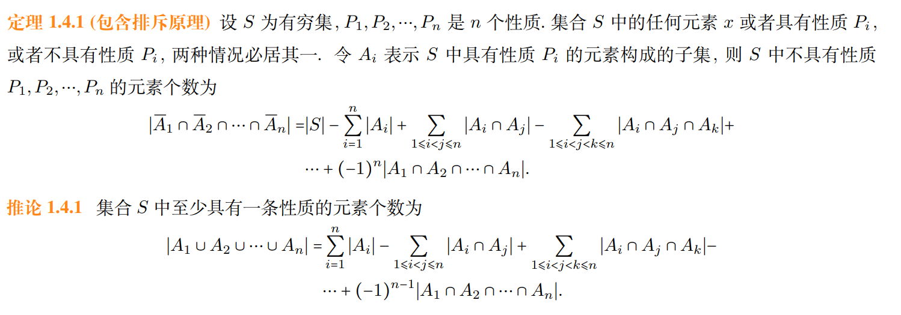

本章主要整理集合的基本语言、集合运算和有穷集计数。后半部分保留了几个典型的集合恒等式与容斥例题。

## 集合的基本概念

- 集合的概念、元素的概念。

集合的表示描述方法。

- 列举法。
- 描述法。
- 有的集合不能用列举法表示，如 $\mathbb{R}$。
- 互异性。
- 无序性。
- 元素与集合的关系(属于)。
- 元素的元素不属于集合。
- 对任意集合 $A$ ，都有 $A \notin A$。

集合与集合的关系。

- 相等。
- 子集。
- 真子集。

- 空集的概念。
- 空集是任意集合的子集。
- 空集只有一个，证明时直接回到定义即可。

- 幂集的概念。
- 若 $|A|=n$ ，则 $|P(A)|=2^n$，这里 $P(A)$ 表示A的子集组成的集合，也称幂集。
- 全集的概念。

## 集合的运算

集合的运算。

- 并集。
- 交集。
- 相对补（即差集）
- 拓展并（多个集合），记作

$$
\bigcup\limits_{i=1}^{n}A_i=A_1 \cup A_2 \ldots \cup A_n
$$

- 拓展交（多个集合），记作

$$
\bigcap\limits_{i=1}^{n}A_i=A_1 \cap A_2 \ldots \cap A_n
$$

- 若两个集合的交集为 $\emptyset$ ，则称它们不交。
- 对称差，记作 $A \oplus B$ ，含义为 $(A-B) \cup (B-A)$。
- 对称差性质：$A \oplus B = A \cup B - A \cap B$。
- 绝对补（补集），记作 $\sim A$。
- 由集合构成的集合记为集族，它的广义交定义为它的元素的交，它的广义并定义为它的元素的并。
- 若集族为空族，那么它的广义交定义为空集，它的广义补未定义(有时定义为全集 $E$)。

集合运算的优先顺序。

- 一元运算先于二元运算。
- 一元运算从右到左进行运算，包括绝对补、并集、广义并、广义交。
- 二元运算在无括号的情况下从左到右进行运算，包括相对补、对称差、初级并、初级交。

## 集合运算的性质

集合运算的主要算律。

- $A \cup A = A$
- $A \cap A = A$
- $(A \cup B ) \cup C = A \cup (B \cup C)$
- $(A \cap B) \cap C = A \cap (B \cap C)$
- $A \cup B = B \cup A$
- $A \cap B = B \cap A$
- $A \cup (B \cap C)= (A \cup B) \cap (A \cup C)$
- $A \cap (B \cup C)= (A \cap B) \cup (A \cap C)$
- $A \cup \emptyset = A$
- $A \cap E = A$
- $A \cup E = E$
- $A \cap \emptyset = \emptyset$
- $A \cup \sim A = E$
- $A \cap \sim A = \emptyset$
- $A \cup (A \cap B) = A$
- $A \cap (A \cup B) = A$
- $A- (B \cup C)= (A - B)\cap (A - C)$
- $A- (B \cap C)= (A - B)\cup (A - C)$
- $\sim(B \cup C) = \sim B \cap \sim C$
- $\sim(B \cap C) = \sim B \cup \sim C$
- $\sim \emptyset = E$
- $\sim E =\emptyset$
- $\sim \sim A =A$
- 注：分配律适用于括号内有多个集合的情况。

证明集合等式的方法。

- 证明两边互相包含。
- 代入已有的集合等式。

一些集合运算的常用结果。

- $A \cap B \subseteq A, A \cap B \subseteq B$
- $A \subseteq A \cup B, B \subseteq A \cup B$
- $A \subseteq A$
- $A - B = A \cap \sim B$
- 下面几个条件等价

$$
A \cup B = B \Leftrightarrow A \subseteq B \Leftrightarrow A \cap B = A \Leftrightarrow A-B = \emptyset
$$

证明时小心不要绕成环形论证。

- $A \oplus B = B \oplus A$
- $(A \oplus B) \oplus C = A \oplus (B \oplus C)$
- $A \oplus \emptyset = A$
- $A \oplus A = \emptyset$
- $A \oplus B = A \oplus C \Rightarrow B=C$
- $A \cup B - B = A - B$

## 有穷集的计数

- 文氏图的定义。

容斥原理及其推论。

## 例题与练习

例 1.3.7 化简

$$
((A \cup B \cup C)) \cap (A \cup B) - ((A \cup (B-C))\cap A)
$$

先处理括号内的集合表达式，比一开始就改写成补集更直接。由于

$$
(A \cup B \cup C) \cap (A \cup B) = A \cup B
$$

且

$$
(A \cup (B-C)) \cap A = A
$$

原式化为

$$
(A \cup B)-A = B-A
$$

例 1.4.3 错位排列的计数问题。有 $n$ 个人在参加晚会时寄存了自己的帽子，可是保管人忘记放寄存号了。当每个人领取帽子时，只能随机拿到一顶帽子。问：在 $n$！ 种领取帽子的方式中，有多少种方式使得每个人都没有领到自己的帽子？

将这些人与他们的帽子分别标号为 $1,2,\ldots,n$。设第 $j$ 个人领到的帽子编号为 $i_j$，那么一种领取方式可以写成排列 $i_1i_2\ldots i_n$。若每个人都没有领到自己的帽子，则要求

$$
i_j \neq j \quad (j=1,2,\ldots,n)
$$

这样的排列称为错位排列，错位排列数记作 $D_n$。下面证明

$$
D_n=n![1-\frac{1}{1!}+\frac{1}{2!}-\ldots+(-1)^{n}\frac{1}{n!}]
$$

设 $S$ 为全部领取方式的集合，$A_i$ 表示第 $i$ 个人领到自己帽子的领取方式集合。于是有

$$
|S|=n!, \quad |A_i|=(n-1)!,
$$

更一般地，对任意 $k$ 个互不相同的编号 $j_1,\ldots,j_k$，都有

$$
|A_{j_1}\cap A_{j_2}\cap \cdots \cap A_{j_k}|=(n-k)!.
$$

由容斥原理可得

$$
\begin{align*}
D_n
&=|\overline A_1 \cap \overline A_2 \cap \cdots \cap \overline A_n| \\\\
&= \sum_{k=0}^{n}(-1)^k\binom{n}{k}(n-k)! \\\\
&= n!\sum_{k=0}^{n}\frac{(-1)^k}{k!} \\\\
&= n!\left(1-\frac{1}{1!}+\frac{1}{2!}-\ldots+(-1)^n\frac{1}{n!}\right)
\end{align*}
$$

下面整理几道典型练习。

1. 判断命题 $A \cap (B-C)=(A \cap B)-(A \cap C)$ 的真假。

这类集合恒等式可以直接使用集合运算律化简右侧

$$
\begin{align*}
RHS &= (A \cap B) \cap (\sim (A \cap C)) \\\\
& =(A \cap B) \cap (\sim A \cup \sim C) \\\\
& =(A \cap (\sim A \cup \sim C)) \cap B \\\\
& =((A \cap \sim A) \cup (A \cap \sim C)) \cap B \\\\
& =(A \cap \sim C) \cap B \\\\
& =A \cap (B \cap \sim C) \\\\
& =A \cap (B - C) \\\\
& =LHS
\end{align*}
$$

因此原命题为真。

2. 确定下列集合等式成立的充分必要条件。

- (1) $A \cup B = A \cap B$

由 $A \cup B = A \cap B$ 可分别推出 $A-B=\emptyset$ 和 $B-A=\emptyset$。例如

$$
\begin{align*}
A \cup B & = A \cap B \\\\
(A \cup B) \cap \sim B & = (A \cap B) \cap \sim B \\\\
(A \cup B) - B & = \emptyset \\\\
A - B & = \emptyset
\end{align*}
$$

同理可得 $B-A=\emptyset$，因此 $A=B$。反过来若 $A=B$，原等式显然成立，所以充分必要条件为 $A=B$。

- (2) $(A - C) \cup B = (A \cup B) - C$

右侧一定与 $C$ 不交，因此等式成立时，左侧也必须与 $C$ 不交

$$
\begin{align*}
((A-C)\cup B)\cap C &= ((A\cup B)-C)\cap C \\\\
((A\cap \sim C)\cup B)\cap C &= \emptyset \\\\
B\cap C &= \emptyset
\end{align*}
$$

若 $B\cap C=\emptyset$，则

$$
(A-C)\cup B=(A\cup B)\cap \sim C=(A\cup B)-C
$$

所以充分必要条件为 $B\cap C=\emptyset$。

3. 设 $A,B,C$ 为任意集合，若 $A \cup B = A \cup C$ 且 $A \cap B = A \cap C$，求证：$B = C$。

把两个条件合并成对称差即可

$$
\begin{align*}
A \cup B - A \cap B &= A \cup C - A \cap C \\\\
A \oplus B & = A \oplus C \\\\
A \oplus A \oplus B & = A \oplus A \oplus C \\\\
B & = C \\\\
\end{align*}
$$

当然，也可以用互相包含法证明。

4. 设 $\mathcal{A} \neq \emptyset$，证明

$$
P\left(\bigcap \mathcal{A}\right)=\bigcap_{A\in \mathcal{A}}P(A)
$$

证明时仍然采用互相包含。若 $X \in P(\bigcap \mathcal{A})$，则 $X \subseteq \bigcap \mathcal{A}$，于是对任意 $A \in \mathcal{A}$ 都有 $X\subseteq A$，从而 $X \in P(A)$，即

$$
X \in \bigcap_{A\in \mathcal{A}}P(A)
$$

反过来，若 $X \in \bigcap_{A\in \mathcal{A}}P(A)$，则对任意 $A \in \mathcal{A}$ 都有 $X\subseteq A$，因此 $X \subseteq \bigcap \mathcal{A}$，也就有 $X \in P(\bigcap \mathcal{A})$。故等式成立。

5. 判断陈述 $A-B=A \Leftrightarrow B=\emptyset$ 是否正确。

该陈述不正确。实际上 $A-B=A$ 只说明 $A\cap B=\emptyset$，并不能推出 $B=\emptyset$。例如 $A=\lbrace1\rbrace,B=\lbrace2\rbrace$ 时，$A-B=A$ 成立，但 $B$ 非空。

6. 化简下列集合表达式。

所求集合为

$$
(A \cap B \cap C) \cup (A \cap \sim B \cap C) \cup (\sim A \cap B \cap C)
$$

直接使用集合运算律化简

$$
\begin{align*}
& (A \cap B \cap C) \cup (A \cap \sim B \cap C) \cup (\sim A \cap B \cap C) \\\\
= & ((A \cap C ) \cup B) \cap ((A \cap C) \cup \sim B) \cup (\sim A \cap B \cap C) \\\\
= &((A \cup B) \cap (C \cup B)) \cap ((A \cup \sim B) \cap (C \cup \sim B)) \cup (\sim A \cap B \cap C) \\\\
= &(A \cup (B \cap \sim B)) \cap (C \cup (B \cap \sim B)) \cup (\sim A \cap B \cap C) \\\\
= &(A \cap C) \cup (\sim A \cap B \cap C) \\\\
= &C \cap(A \cup (\sim A \cap B)) \\\\
= &C \cap ((A \cup \sim A) \cap (A \cup B)) \\\\
= &C \cap (A \cup B) \\\\
\end{align*}
$$

7. 判断结论 $(A - B) \cup (B - C) = A - C$ 是否正确。

该结论不正确。取 $A=\lbrace1\rbrace,B=\lbrace2\rbrace,C=\lbrace3\rbrace$，左侧为 $\lbrace1,2\rbrace$，右侧为 $\lbrace1\rbrace$。

这里还会反复用到 $A \cup B - B = A - B$。

8. 设 $A,B,C,D$ 为任意集合，判断下列说法是否正确：若 $A \subset B,C \subset D$，则 $A \cup C \subset B \cup D$。

该说法不正确。取

$$
A=\lbrace1\rbrace, \quad B=\lbrace1,3,4\rbrace, \quad C=\lbrace3,4\rbrace, \quad D=\lbrace1,3,4\rbrace
$$

此时 $A\subset B$ 且 $C\subset D$，但 $A\cup C=B\cup D$，并非真子集关系。
