## 有序对与笛卡尔积

- 有序对的概念

- 笛卡尔积的概念
- 一般来说，笛卡尔积不满足交换律和结合律。

笛卡尔积的性质

- $A \times \emptyset = \emptyset, \ \emptyset \times A = \emptyset$
- 左右交换律
  - $A \times (B \cup C) = (A \times B) \cup (A \times C)$
  - $(B \cup C) \times A = (B \times A) \cup (C \times A)$
  - $A \times (B \cap C) = (A \times B) \cap (A \times C)$
  - $(B \times C) \cap A = (B \times A) \cap (C \times A)$
- 若 $A \subseteq C,B \subseteq D,$ 则 $A \times B \subseteq C \times D$ 。
- 多个笛卡尔积运算同时出现时，括号会带来元组嵌套；没有括号时，可以直接用平级多元组表示。

## 二元关系

二元关系的定义与性质

- 元素均为有序对的非空集合或者空集
- 对于集合 $A,B$ , $A \times B$ 的所有子集都是从A到B的二元关系，当 $A=B$ 时，称为A上的二元关系。
- $xRy$ 与 $x \not \mathrel{R} y$ 的关系。
- 若 $|A|=n$ ，则 $|P(A \times A)|=2^{n^2}$ 。

特殊的二元关系。

- 空集被称为A上的空关系
- $A$ 上的全域关系和恒等关系。
  - $E_A=\lbrace\langle x,y \rangle | x \in A \land y \in A\rbrace$
  - $I_A=\lbrace\langle x,x \rangle | x \in A \rbrace$
- 小于或等于关系
- 整除关系
- 包含关系

表示二元关系的常见方法。

- 集合表达式
- 关系矩阵(类似邻接矩阵)
- 关系图(有关系就连边)

## 关系的运算

- 相关概念
- $\mathrm{dom} \ R$ ：二元关系 $R$ 中所有有序对第一元素构成的集合，称作 $R$ 的定义域。
- $\mathrm{ran} \ R$ ：二元关系 $R$ 中所有有序对第二元素构成的集合，称作 $R$ 的值域。
- $R$ 的定义域与值域的并集称作它的域，即

$$
\mathrm{fld} \ R = \mathrm{dom} \ R \cup \mathrm{ran} \ R
$$

- 逆关系
- 复合
- 复合运算计算时，需要把 $\langle x,y \rangle$ 中 $x=y$ 的情况也算进去。
- 二元关系 $R$ 在集合 $A$ 上的限制为

$$
R \upharpoonright A = \lbrace\langle x,y \rangle | \langle x,y \rangle \in R,x \in A \rbrace
$$

- $A$ 在 $R$ 下的像：$R[A] = \mathrm{ran}(R \upharpoonright A)$ 。
- 关系运算中逆运算最为优先
- 所有关系运算都优先于集合运算
- 未规定的以括号决定运算顺序

二元关系的运算规律
- (1)
  - $(F^{-1})^{-1} =F$
  - $\mathrm{dom} (F^{-1})  = \mathrm{ran} F$
  - $\mathrm{ran} (F^{-1})  = \mathrm{dom} F$
- (2)
  - $(F \circ G) \circ H  = F \circ (G \circ H)$
  - $(F \circ G)^{-1}  = G^{-1} \circ F^{-1}$
- (3)
  - $R \circ I_A = R = I_A \circ R$
- (4)
  - $F \circ (G \cup H) = F \circ G \cup F \circ H$
  - $(G \cup H) \circ F = (G \circ F) \cup (H \circ F)$
  - $F \circ (G \cap H) = F \circ G \cap F \circ H$
  - $(G \cap H) \circ F = (G \circ F) \cap (H \circ F)$
  - 这个对于有限多个二元关系也成立

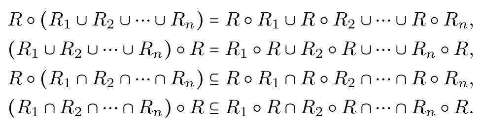

- (5)
  - $F \upharpoonright (A \cup B) = F \upharpoonright A \cup F \upharpoonright B$
  - $F[A \cup B] = F[A] \cup F[B]$
  - $F \upharpoonright (A \cap B) = F \upharpoonright A \cap F \upharpoonright B$
  - $F[A \cap B] \subseteq F[A] \cap F[B]$

- $R$ 的次幂的定义。
- 零次幂对应恒等关系
- 其次幂的加法、乘法运算与数域中的相同
- 矩阵运算加法是逻辑加，即计算机中的并运算。
- 一定存在不相等的自然数，使得 $R$ 的两个次幂相等。

$R$ 次幂的性质。

设 $R$ 是 $A$ 上的关系，若存在自然数 $s,t,s<t$，使得 $R^{s}=R^{t}$，则有：

- 对任何 $k \in N$ 有 $R^{s+k} = R^{t+k}$ 。
- 对任何 $k,i \in N$ 有 $R^{s+kp+i} = R^{s+i}$ 其中 $p=t-s$ 。
- 对 $S=\lbrace{}R^{0},R^{1},\ldots,R^{t-1}\rbrace,$ 则对于任意的 $q \in N$ 有 $R^{q} \in S$ 。

## 关系的性质

关系的性质

- 自反
- 反自反
- 对称
- 反对称
- 传递
- 若前提条件不存在，那么仍然可以满足对应性质。
- 对称与反对称不是二选一，它们可以同时成立，也可以同时不成立。
- 判断传递性时，回路节点的自环也要一起考虑。

性质成立的充要条件。

- 自反：$I_A \subseteq R$。
- 反自反：$I_A \cap R = \emptyset$。
- 对称：$R = R^{-1}$。
- 反对称：$R \cap R^{-1} \subseteq I_A$。
- 传递：$R \circ R \subseteq R$。

集合运算与性质的关系

- 若 $R_1,R_2$ 是自反(对称)的，那么 $R_1 \cup R_2$ 是自反(对称)的。
- 若 $R_1,R_2$ 是传递的，那么 $R_1 \cap R_2$ 是传递的。

性质在不同表示法下的性质

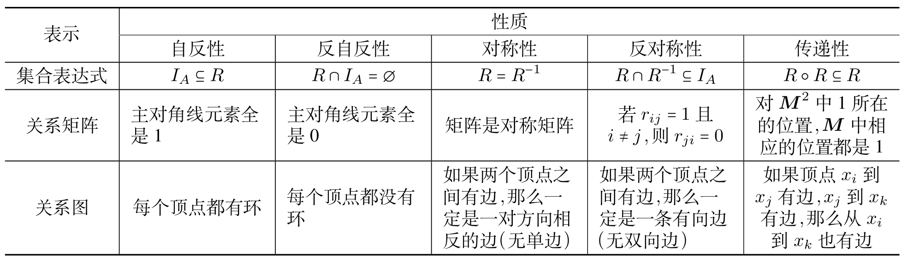

集合运算的相关性质

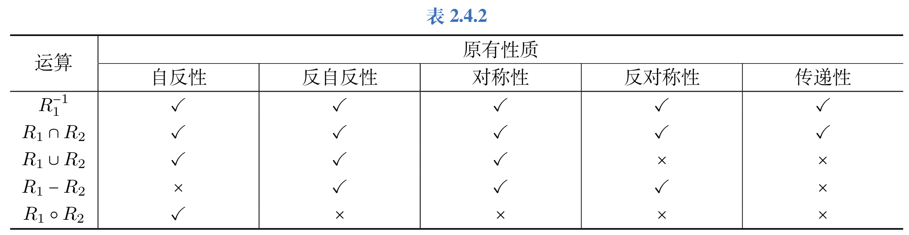

## 关系的闭包

闭包的三个条件

- 性质
- 包含
- 最小性

闭包的计算

- $r(R) = R \cup R_{0}$
- $s(R) = R \cup R_{-1}$
- $t(R) = R \cup R_{2} \cup R_{3} \ldots$
- 若 $R$ 是有穷集 $A$ 上的关系，则存在自然数 $r$ 使得 $t(R) = R \cup R_{2} \cup \ldots R^{r}$ 。

关系矩阵与关系图求闭包。

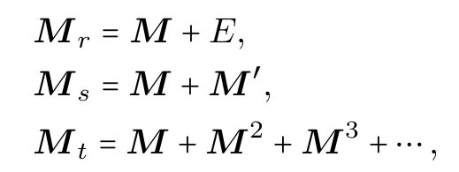

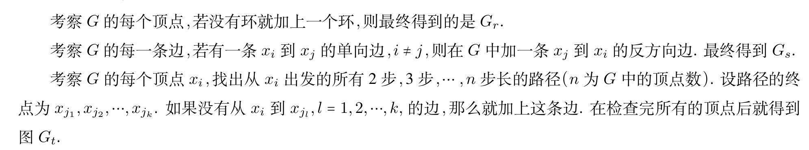

关系矩阵里使用的是逻辑加。

如果图中存在回路，在画 $t(R)$ 时，这条路径上的每个点都要加上一个环。

计算机求传递闭包。

- 沃舍尔算法(即OI 中Floyd 求传递闭包)

闭包的主要性质

- (1) 若 $R$ 是非空集合 $A$ 上的关系，则有：
  - $R$ 是自反的 $\Leftrightarrow$ $r(R)=R$ 。
  - $R$ 是对称的 $\Leftrightarrow$ $s(R)=R$ 。
  - $R$ 是传递的 $\Leftrightarrow$ $t(R)=R$ 。

- (2) $R_1,R_2$ 是非空集合 $A$ 上的关系，且 $R_1 \subseteq R_2$，则有：
  - $r(R_1) \subseteq r_(R_2)$ 。
  - $s(R_1) \subseteq s_(R_2)$ 。
  - $t(R_1) \subseteq t_(R_2)$ 。

- (3) $R$ 是非空集合 $A$ 上的关系，则有：
  - 若 $R$ 是自反的，则 $s(R),t(R)$ 也是自反的。
  - 若 $R$ 是对称的，则 $r(R),t(R)$ 也是对称的。
  - 若 $R$ 是传递的，则 $r(R)$ 也是传递的。
- 即：对称闭包可能失去传递性。
- 因此，我们用 $tsr(R)$ 表示 $R$ 的自反、对称、传递闭包，有 $tsr(R)=t(s(r(R)))$ 。
- 证明传递相关性质常用归纳法

## 等价关系与划分

- 等价关系的定义
- 自反
- 传递
- 对称
- 若 $\langle x,y \rangle \in R$ ，则称 $x$ 等价于 $y$ ，即 $x \sim y$ 。

- 等价类的定义
- 关系图中每个联通块中的所有顶点构成一个等价类
- $R$ 是非空集合 $A$ 上的等价关系， $x \in A$ ，则 $x$ 的等价类记作 $[x]$ 或 $[x]_R$ ，定义为

$$
[x]_R = \lbrace{}y | y \in A, \langle x,y \rangle \in R\rbrace
$$

等价类的性质

若 $R$ 是非空集合 $A$ 上的等价关系，则有：

- $\forall x \in A, [x]$ 是 $A$ 的非空子集。
- $\forall x,y \in A,$ 如果 $xRy$ ，则 $[x] = [y]$ 。
- $\forall x,y \in A,$ 如果 $x \not \mathrel{R} y$ ，则 $[x] \cap [y] = \emptyset$ 。
- $\cup \lbrace[x]|x \in A\rbrace=A$ 。

- 商集的概念
- 以 $R$ 的所有等价类作为元素的集合称为 $A$ 关于 $R$ 的商集，记作 $A / R$ ，即 $A / R =\lbrace[x] | x \in A\rbrace$ 。

- 划分的定义

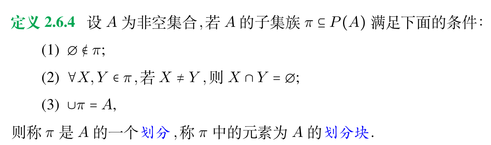

划分与等价关系

- 划分与等价关系是一一对应的
- 因此，在求等价关系的时候应先写出划分。
- 这里不要忘记 $\cup I_A$。

## 偏序关系

偏序关系的相关概念。

- 自反
- 反对称
- 传递
- 若 $\langle x,y \rangle \in \preceq$ ，则记作 $x \preceq y$ ，读作小于或等于。
- 若 $x \preceq y$ 且 $x \not = y,$ 则称 $x \prec y$ ，读作小于。
- 若 $x \preceq y$ 或 $y \preceq x$ ，则称 $x$ 和 $y$ 是可比的。
- 若 $\forall x,y \in A,x$ 与 $y$ 均可比，则称 $R$ 是 $A$ 上的全序关系(线序关系)。
- $A$ 与 $A$ 上的偏序关系 $\preceq$ 共称为偏序集，记作 $\langle A,\preceq \rangle$ 。
- 写偏序集时也要考虑 $I_A$ ；如果关系写成 $\prec$ ，则不考虑。
- 若 $\langle A,\preceq \rangle$ 为偏序集， $\forall x,y \in A,$ 若 $x \prec y$ 且不存在 $z,x \prec z \prec y,$ 则称 $y$ 覆盖 $x$ 。

哈斯图的画法

- 先排列元素顺序
- 若 $x \prec y,$ 则把 $x$ 画在 $y$ 下方。
- 若 $y$ 覆盖 $x,$ 则连接 $x$ 与 $y$ 。

- 极小元、极大元、上界、下界、上确界、下确界的定义
- (1)

设 $\langle A,\preceq \rangle$ 为偏序集， $B \subseteq A,y \in B$。

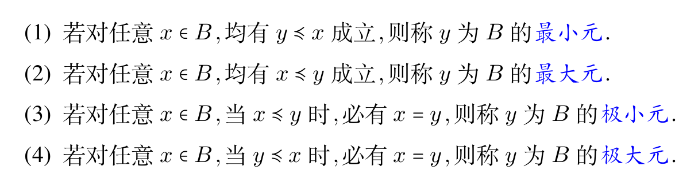

- (2)

设 $\langle A,\preceq \rangle$ 为偏序集， $B \subseteq A,y \in A$。

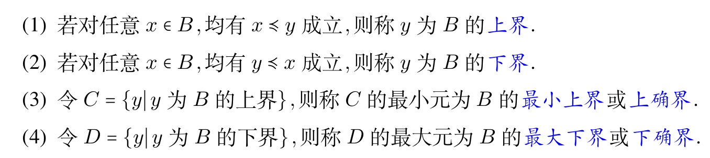

关于这些概念的阐述。

- 最小元一定要求其它元素与它可比，而极小元没有要求，只需要没有比它小的元素。在有穷集中，最小元不一定存在，存在即唯一；而极小元一定存在且可能有多个。极大元与最大元同此定义。
- 哈斯图中的孤立顶点既是极小元又是极大元
- $B$ 的最小元一定是 $B$ 的下界，同时也是下确界。同样地，最大元一定是 $B$ 的上界，同时也是上确界。但是下界(上界)不一定是最小元(最大元)，因为不一定是 $B$ 中元素。
- 上界、下界、上确界、下确界都可能不存在，上确界(下确界)存在即唯一。
- 最大元一定是极大元，最小元一定是极小元。

- 调度问题的定义

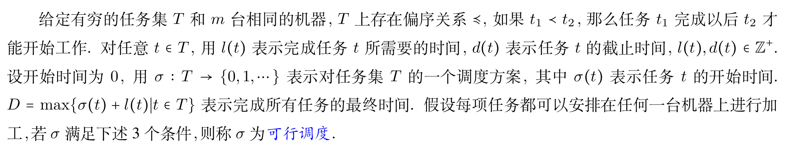

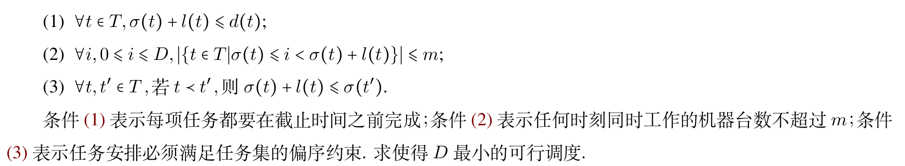

调度问题的解决

- 若只有一台机器，且截止时间没有限制，则可以用拓扑排序解决问题。
- 拓扑排序：将偏序集扩张为对应全序集(不可比的元素随机可比)，忽略自反性，因此可能有多个结果。
- 用图论来说，有向边的起点一定比终点出现早，同时我们在图论中一般规定字典序最小，也是这个原因。

## 例题与练习

例 2.1.3

设 $A,B,C,D$ 为任意集合，判断下列陈述是否正确，并说明理由。

- (1) 若 $A \times B = A \times C,$ 则 $B = C$。

不一定。若 $A=\emptyset$，则无论 $B$ 和 $C$ 是什么集合，都有

$$
A\times B=A\times C=\emptyset
$$

因此不能推出 $B=C$。如果额外给出 $A\neq\emptyset$，结论才成立。

- (2) $A - (B \times C) = (A - B) \times (A - C)$

不一定。右侧是笛卡尔积，而左侧只是从 $A$ 中删去若干有序对，两边的对象类型已经不同。取 $A=B=C=\lbrace1\rbrace$，左侧为 $\lbrace1\rbrace$，右侧为 $\emptyset$，故等式不成立。

例 2.3.5

设

$$
A=\lbrace{}a,b,d,e,f\rbrace,\quad R=\lbrace\langle a,b \rangle,\langle b,a \rangle,\langle d,e \rangle,\langle e,f \rangle,\langle f,d \rangle \rbrace
$$

求最小的自然数 $m$ 和 $n$ ，使得 $m < n$ 且 $R^{m} = R^{n}$。

关系 $R$ 可以看作两个互不相交的循环：$a,b$ 之间构成长度为 $2$ 的循环，$d,e,f$ 之间构成长度为 $3$ 的循环。因此关系幂的周期为

$$
\mathrm{lcm}(2,3)=6
$$

又 $R^0=I_A$，最早重复出现在 $R^0=R^6$，所以 $m=0,n=6$。

1. 下面两张图记录的是关系性质与闭包计算的判定过程。读这种图时，可以先确认自反、对称、传递三类边各自缺什么，再决定要补充哪些有序对。

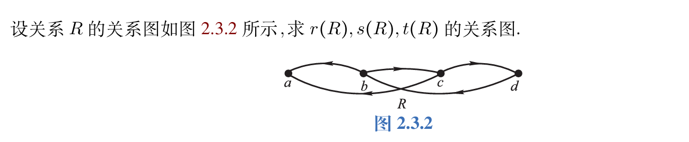

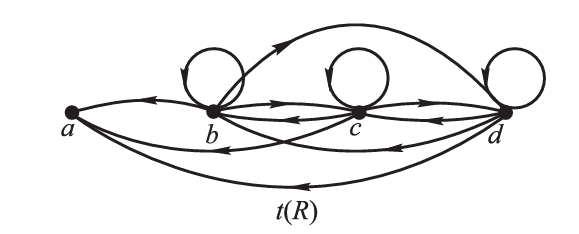

2. 设 $R_1,R_2$ 是 $A$ 上的关系，求证

$$
t(R_1) \cup t(R_2) \subseteq t(R_1 \cup R_2)
$$

使用闭包的单调性：若 $R_1 \subseteq R_2$，则 $t(R_1) \subseteq t(R_2)$。由于

$$
R_1 \subseteq R_1\cup R_2, \quad R_2 \subseteq R_1\cup R_2
$$

所以

$$
t(R_1) \subseteq t(R_1\cup R_2), \quad t(R_2) \subseteq t(R_1\cup R_2)
$$

因此

$$
t(R_1)\cup t(R_2) \subseteq t(R_1\cup R_2)
$$

3. 设 $R_1$ 和 $R_2$ 都是传递的，试举出反例证明 $R_1 \circ R_2$ 不一定传递。

取 $A=\lbrace1,2,3\rbrace$

$$
R_1=\lbrace\langle 1,1 \rangle , \langle 2,3 \rangle \rbrace, \quad
R_2=\lbrace\langle 1,2 \rangle, \langle 3,3 \rangle \rbrace
$$

这两个关系本身都是传递的，但

$$
R_1 \circ R_2 = \lbrace\langle 2,3 \rangle, \langle 1,2 \rangle\rbrace
$$

其中 $\langle 1,2\rangle$ 与 $\langle 2,3\rangle$ 同时存在，却没有 $\langle 1,3\rangle$，所以 $R_1\circ R_2$ 不传递。

4. 设 $R$ 是集合 $A$ 上的等价关系， $|A|=n,|R|=r,|A / R|=m,$ 求证：$mr \geq n^2$。

设

$$
A/R=\lbrace{}A_1,A_2,\ldots,A_m\rbrace, \quad |A_i|=n_i
$$

等价关系由它的等价类完全决定。同一等价类内的任意两个元素等价，不同等价类中的元素不等价，因此

$$
R=\bigcup_{i=1}^{m}(A_i\times A_i)
$$

于是

$$
r=\sum_{i=1}^{m}n_i^2, \quad n=\sum_{i=1}^{m}n_i
$$

这个关系也可以从商集与划分的定义中直接看出：

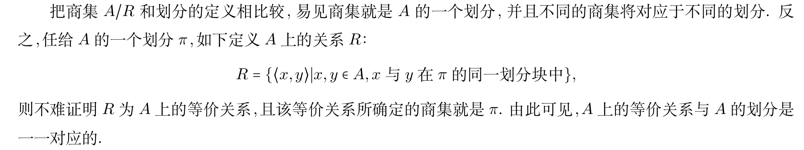

由 Cauchy 不等式

$$
\sum_{i=1}^{m}n_i^2 \geq \frac{\left(\sum_{i=1}^{m}n_i\right)^2}{m}=\frac{n^2}{m}
$$

即 $r\geq n^2/m$，所以 $mr\geq n^2$。

5. 对于任意集合 $A,B,C$，若 $A \times B \subseteq A \times C$，是否一定有 $B \subseteq C$ 成立？

不一定。若 $A=\emptyset$，则 $A\times B=A\times C=\emptyset$，此时无法推出 $B\subseteq C$。若额外要求 $A\neq\emptyset$，才可以从任意 $b\in B$ 出发，取 $a\in A$，由 $\langle a,b\rangle\in A\times C$ 推出 $b\in C$。

6. 设如下集合

$$
A=\lbrace\langle \emptyset,\lbrace\emptyset,\lbrace\emptyset \rbrace\rbrace \rangle,\langle \lbrace\emptyset \rbrace, \emptyset \rangle \rbrace
$$

求 $A[\emptyset ],A \upharpoonright \emptyset$。

限制和像都是以一个集合作为运算对象。这里参与运算的是空集本身，它没有元素，因此

$$
A[\emptyset]=\emptyset, \quad A\upharpoonright \emptyset=\emptyset
$$

7. 设如下关系

$$
R_1=\lbrace\langle a,a \rangle, \langle a,b \rangle, \langle b,d \rangle \rbrace
$$

求 $R_1^2$。

计算关系幂时不要漏掉自环带来的复合项。尤其是 $\langle a,a\rangle$ 会使得从 $a$ 出发的若干有序对继续保留下来。

8. 如果 $R_1,R_2$ 具有传递性， $R_1 \circ R_2$ 是否还具有传递性？

不一定。令

$$
R_1=\lbrace\langle 1,2 \rangle,\langle 3,5 \rangle \rbrace, \quad
R_2=\lbrace\langle 2,3 \rangle, \langle 5,4 \rangle \rbrace
$$

则

$$
R_1 \circ R_2=\lbrace\langle 1,3 \rangle, \langle 3,4 \rangle \rbrace
$$

由于没有 $\langle 1,4\rangle$，所以 $R_1\circ R_2$ 不传递。

9. 设 $R_1,R_2$ 是非空集合 $A$ 上的关系，且 $R_1 \subseteq R_2$ ，求证：$t(R_1) \subseteq t(R_2)$。

证明传递闭包的单调性通常先证明关系幂的单调性。由 $R_1\subseteq R_2$，可归纳证明对任意 $n\in N$ 都有

$$
R_1^n \subseteq R_2^n
$$

$n=1$ 时结论就是已知条件。若 $R_1^n \subseteq R_2^n$，取任意 $\langle x,y\rangle \in R_1^{n+1}$，则存在 $z$ 使得

$$
\langle x,z\rangle \in R_1^n, \quad \langle z,y\rangle \in R_1
$$

由归纳假设和 $R_1\subseteq R_2$ 可知 $\langle x,z\rangle \in R_2^n$ 且 $\langle z,y\rangle \in R_2$，因此 $\langle x,y\rangle \in R_2^{n+1}$。于是 $R_1^{n+1}\subseteq R_2^{n+1}$。

再由

$$
t(R_1)=R_1\cup R_1^2\cup R_1^3\cup \cdots,\quad
t(R_2)=R_2\cup R_2^2\cup R_2^3\cup \cdots
$$

可得 $t(R_1)\subseteq t(R_2)$。

10. $R$ 是非空集合 $A$ 上的关系。

- (1) 若 $R$ 是自反的，则 $s(R)$ 与 $t(R)$ 也是自反的。

解：由于 $R$ 是自反的，因此有 $I_A \subseteq R,$ 又由于 $s(R)=R \cup R^{-1},t(R)=R \cup R^2 \cup R^3 \ldots,$ 因此有 $I_A \subseteq s(R),I_A \subseteq t(R),$ 即 $s(R)$ 与 $t(R)$ 也是自反的。

- (2) 若 $R$ 是传递的，则 $r(R)$ 也是传递的。

解 由于 $R$ 是传递的，因此有 $R \circ R \subseteq R$ ，而

$$
\begin{align*}
& r(R) \circ r(R) \\\\
= & (R \cup I_A) \circ (R \cup I_A) \\\\
= & (R \circ R) \cup (R  \circ I_A) \cup (R \circ I_A) \cup (I_A \circ I_A) \\\\
= & (R \circ R) \cup (R \circ I_A) \cup I_A \\\\
= & (R \circ R) \cup R \cup I_A \\\\
\subseteq & R \cup I_A = r(R) \\\\
\end{align*}
$$

证毕。

11. 对于给定的 $A$ 和 $R$，判断 $R$ 是否为 $A$ 上的等价关系

$$
A=P(S),\quad C \subseteq S,\quad \forall X,Y \in A,\quad XRY \Leftrightarrow X \oplus Y \subseteq C
$$

自反性和对称性可以直接由对称差的性质得到。下面证明传递性。若 $XRY$ 且 $YRZ$，则

$$
X\oplus Y\subseteq C,\quad Y\oplus Z\subseteq C
$$

又因为

$$
\begin{align*}
X \oplus Z
&= X \oplus Y \oplus Y \oplus Z \\\\
&= (X \oplus Y) \oplus (Y \oplus Z) \\\\
&\subseteq C
\end{align*}
$$

所以 $XRZ$。因此 $R$ 是 $A$ 上的等价关系。

12. 对任意非空集合 $A$，$A$ 的非空子集族 $P(A)-\lbrace\emptyset\rbrace$ 是否构成 $A$ 的划分？

需要按 $A$ 的大小讨论。若 $|A|=1$，则 $P(A)-\lbrace\emptyset\rbrace$ 中只有 $A$ 本身，构成划分；若 $|A|>1$，不同的非空子集会发生交叠，因此不构成划分。

13. 设 $R$ 为 $A$ 上的自反和传递关系，证明 $R \cap R^{-1}$ 是 $A$ 上的等价关系。

由于 $R$ 自反，$I_A\subseteq R$，同时也有 $I_A\subseteq R^{-1}$，所以 $I_A\subseteq R\cap R^{-1}$，即 $R\cap R^{-1}$ 自反。

若 $\langle x,y\rangle \in R\cap R^{-1}$，则 $\langle x,y\rangle \in R$ 且 $\langle y,x\rangle \in R$，从而 $\langle y,x\rangle \in R\cap R^{-1}$，所以 $R\cap R^{-1}$ 对称。

最后证明传递性。若 $\langle x,z\rangle,\langle z,y\rangle \in R\cap R^{-1}$，则

$$
\begin{align*}
\langle x,z\rangle \in R,\quad \langle z,y\rangle \in R, \quad
\langle z,x\rangle \in R,\quad \langle y,z\rangle \in R
\end{align*}
$$

由 $R$ 的传递性可得 $\langle x,y\rangle \in R$ 且 $\langle y,x\rangle \in R$，于是 $\langle x,y\rangle \in R\cap R^{-1}$。因此 $R\cap R^{-1}$ 是等价关系。

14. 设 $R$ 是 $A$ 上的自反关系，证明：$R$ 是 $A$ 上等价关系的充要条件是：若 $\langle a,b \rangle \in R$ 且 $\langle a,c \rangle \in R,$ 则有 $\langle b,c \rangle \in R$。

必要性：若 $R$ 是等价关系，$\langle a,b\rangle \in R$ 且 $\langle a,c\rangle \in R$。由对称性得 $\langle b,a\rangle \in R$，再由传递性得 $\langle b,c\rangle \in R$。

充分性：已知 $R$ 自反，并假设题中条件成立。先证对称性。若 $\langle a,b\rangle \in R$，由于 $R$ 自反，有 $\langle a,a\rangle \in R$。令 $c=a$，由题中条件得到 $\langle b,a\rangle \in R$。

再证传递性。若 $\langle x,y\rangle \in R$ 且 $\langle y,z\rangle \in R$，由刚刚证明的对称性可得 $\langle y,x\rangle \in R$。将题中条件用于 $\langle y,x\rangle$ 与 $\langle y,z\rangle$，得到 $\langle x,z\rangle \in R$。因此 $R$ 是等价关系。

15. 指出下面命题证明时的错误。

命题：设 $R$ 是集合 $A$ 上的对称、传递关系，则 $R$ 是自反的。

证明：设 $x \in A$ ，根据对称性由 $\langle x,y \rangle \in R$ 得到 $\langle y,x \rangle \in R,$ 再使用传递性得到 $\langle x,x \rangle \in R$。 从而证明了 $R$ 的自反性。

这段证明的问题在于，它默认对每个 $x\in A$ 都能找到某个 $y$ 使得 $\langle x,y\rangle \in R$。但对称性和传递性只保证“已经被关系关联到的元素”可以推出自环，不能保证所有元素都有自环。比如非空集合上的空关系既对称又传递，却不是自反关系。
