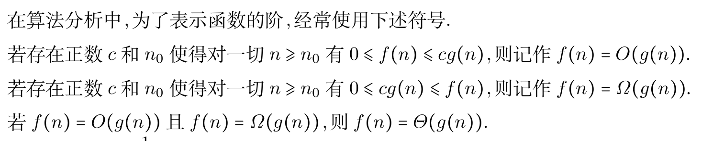

本章整理函数、复合、反函数、双射和基数。很多内容其实是在为后面的等价、计数和代数结构打语言基础。

## 函数的定义与性质

函数的定义，函数相等的定义(从关系的角度)

判断是不是函数时，主要看定义域、值域存在唯一性，以及结果是否超出值域。

例如

$$
A=N \times N \times N,\quad B=N,\quad f(\langle x,y,z \rangle)=x+y-z
$$

证明函数相等的常见思路：从关系的角度从两边证明集合互相包含或者函数运算的相关性质

函数相等满足的条件：

- (1) $\mathrm{dom} F= \mathrm{dom} G$
- (2) $\forall x \in \mathrm{dom} F= \mathrm{G},$ 都有 $F(x)=G(x)$

定义：设 $A,B$ 为集合，若 $f$ 为函数，且 $\mathrm{dom} f=A,\mathrm{ran} f \subseteq B$ ，则称 $f$ 是从 $A$ 到 $B$ 的函数，记作 $f:A \rightarrow B$

定义：所有从 $A$ 到 $B$ 的函数的集合记作 $B^A$ ，读作 $B$ 上 $A$

这里有 $2^A=\{0,1\}^A$。

特殊地

$$
\begin{cases}
B^A = \{\emptyset \}, & A = \emptyset \wedge B = \emptyset \\
B^A = \{\emptyset \}, & A = \emptyset \wedge B \not = \emptyset \\
B^A = \emptyset, & A \not = \emptyset \wedge B = \emptyset
\end{cases}
$$

定义：设函数 $f:A \rightarrow B,A_1 \subseteq A,B_1 \subseteq B$

$$
f(A_1)=\{f(x) | x \in A_1 \}
$$

称其为 $A_1$ 在 $f$ 下的像， $A_1=A$ 时为函数的像。

$$
f^{-1}(B_1)=\{x | x \in A, f(x) \in B_1 \}
$$

称其为 $B_1$ 在 $f$ 下的原像

得到的像和原像都是集合。

满射、单射与双射的概念，跟线性代数里的差不多。

单射、满射和双射的概念都建立在函数的基础上。

如果连续函数存在极值点，那么它不可能是单射。

构造双射函数：

如果是无穷集，直接构造类似的函数就可以；如果是有穷集，一个个写出元素，然后一一对应即可.(后面有更加深入的讨论)

例：设 $A=\{1,2,\ldots,n\},B=\{1,2,\ldots,m\},$ 令 $S=\{f|f:A \rightarrow B\}$ 是由从 $A$ 到 $B$ 中所有函数构成的集合.问：$S$ 中有多少个满射函数?

解：易知 $n \geq m,$ 我们考虑采用容斥原理解决这个问题。

设 $P_i$ 表示 $i \notin \mathrm{ran} f$ 这个性质，则所求为

$$
|\overline A_1 \cap \overline A_2 \cap \overline A_3 \ldots \overline A_m|
$$

易知

$$
\begin{align*}
|S| & = m^n \\
|A_i| & = (m-1)^n \\
|A_i \cap A_j| & = (m-2)^n \\
& \ldots \\
|A_1 \cap A_2 \cap \ldots \cap A_m| & = 0 \\
\end{align*}
$$

于是，由容斥原理

$$
\begin{align*}
& |\overline A_1 \cap \overline A_2 \cap \overline A_3 \ldots \overline A_m| \\
= & m^n - C_{m}^1 (m-1)^n + C_{m}^2 (m-2)^n + \ldots +(-1)^{m-1} C_{m}^{m-1} 1^n \\
= & \sum\limits_{i=0}^{m} (-1)^i C_{m}^{i} (m-i)^n.
\end{align*}
$$

常函数、恒等函数、(严格)单调递增函数、(严格)单调递减函数的定义

设 $A$ 为集合，对于任意的 $A' \subseteq A,A'$ 的特征函数 $\chi_{A'}:A \rightarrow \{0,1 \}$ 定义为

$$
\chi_{A'}(a) =
\begin{cases}
1, \quad a \in A' \\
0, \quad a \in A-A' \\
\end{cases}
$$

注：不同的子集对应于不同的特征函数

设 $R$ 是 $A$ 上的等价关系，令

$$
\begin{align*}
& g:A \rightarrow A/R \\
& g(a) = [a],\forall a \in A \\
\end{align*}
$$

称 $g$ 为从 $A$ 到商集 $A/R$ 的自然映射

注：不同的等价关系确定不同的自然映射，恒等关系确定的是双射，其他一般只是满射.

$W(n)$ :最坏情况下时间复杂度

$A(n)$ :平均情况下时间复杂度

分治算法、二分算法

## 函数的复合和反函数

复合函数的分界点可能会变化。

下面考虑的都是函数在复合中的特有性质：

若 $F,G$ 是函数，则 $F \circ G$ 也是函数，且满足以下性质

$$
\begin{aligned}
\mathrm{dom} (F \circ G) &= \{x| x \in \mathrm{dom} F, F(x) \in \mathrm{dom} G\} \\
\forall x \in \mathrm{dom}(F \circ G),\quad F \circ G(x) &= G(F(x))
\end{aligned}
$$

这里的证明思路需要理解，任何函数证明都要回到它作为关系的原始定义。

推论：设 $F,G,H$ 都是函数，则 $(F \circ G) \circ H$ 与 $F \circ (G \circ H)$ 都是函数，且 $(F \circ G) \circ H=F \circ (G \circ H)$

推论：设 $f:A \rightarrow B,g:B \rightarrow C,$ 则 $f \circ g:A \rightarrow C,$ 且 $\forall x \in A$ 都有 $f \circ g(x)=g(f(x))$

定理：设 $f:A \rightarrow B,g:B \rightarrow C,$ 若 $f,g$ 都是单/满/双射， $f \circ g$ 也是单/满/双射

注：该定理的逆命题不为真，反例见书。

定理：设 $f:A \rightarrow B,$ 则 $f=f \circ I_B = I_A \circ f$

对于任意函数 $F$ , $F^{-1}$ 不一定是函数，只可能是二元关系

定理：若 $f:A \rightarrow B$ 是双射，则 $f^{-1}:B \rightarrow A$ 也是双射。

我们称 $f^{-1}$ 为 $f$ 的反函数

注：若 $f$ 不是双射，则不存在反函数.

定理：若 $f:A \rightarrow B$ 为双射，则 $f^{-1} \circ f = I_B, f \circ f^{-1} = I_A$

## 双射函数和函数的基数

设 $A,B$ 是集合，如果存在从 $A$ 到 $B$ 的双射函数，那么称 $A$ 与 $B$ 是等势的，记作 $A \approx B,$ 反之则记作 $A \not \approx B.$

等势集合的例子：

- (1) $Z \approx N$
- (2) $N \times N \approx N$
- (3) $N \approx Q$
- (4) $(0,1) \approx R$
- (5) $[0,1] \approx (0,1)$
- (6) $\forall a,b \in R,a<b,[0,1] \approx [a,b]$

例：设 $A$ 为任意集合，则 $P(A) \approx \{0,1\}^A$

解 构造从 $P(A)$ 到 $\{0,1\}^A$ 的函数

$$
f:P(A) \rightarrow \{0,1\}^A,f(A') = \chi_{A'} , \forall A' \in P(A)
$$

下面只需证其为双射即可。

定理：设 $A,B,C$ 为任意集合，有

- (1) $A \approx A$
- (2) $A \approx B \Leftrightarrow B \approx A$
- (3) $A \approx B,B \approx C \Rightarrow A \approx C$

(其实就是等势有自反性，对称性，传递性)

康托尔定理：

- (1) $N \not \approx R$
- (2) $\forall A, A \not \approx P(A)$

这两个性质的证明都很妙

定义：设 $A,B$ 为集合，若存在从 $A$ 到 $B$ 的单射函数，则称 $B$ 优势于 $A$ ，记作 $A \preccurlyeq \cdot B$ ，反之则记作 $A \not \preccurlyeq \cdot B$

定义：设 $A,B$ 为集合，若 $A \preccurlyeq \cdot B,A \not \approx B,$ 则称 $B$ 真优势于 $A$ ，记作 $A \prec \cdot B,$ 反之则记作 $A \not \prec \cdot B.$

定理：$A,B,C$ 为任意集合，有

- (1) $A \preccurlyeq \cdot B$
- (2) $A \preccurlyeq \cdot B,B \preccurlyeq \cdot A, \Rightarrow A \approx B$
- (3) $A \preccurlyeq \cdot B,B \preccurlyeq \cdot C, \Rightarrow A \preccurlyeq \cdot C$

证明等势时，有时构造两个单射函数会更简单。

公式

$$
\begin{align*}
N \approx Z \approx \ & Q \approx Z \times Z \\
R \approx [a,b] \approx (c,d) & \approx \{0,1\}^N \approx P(N) \\
{0,1}^A \ &  \approx P(A) \\
N & \prec \cdot R \\
A \prec \cdot P(A) \\
\end{align*}
$$

$\forall k \in N,$ 定义

$$
N_k=
\begin{cases}
\emptyset, & k=0 \\
\{0,1,\dots,k-1\}, & k \geq 1 \\
\end{cases}
$$

于是有，任何有穷集(空集)都与唯一的 $N_k$ 等势。

基数的定义：
- (1) 设 $A$ 是有穷集，则 $A$ 的基数记为 $\mathrm{card} A$ ($|A|$ )，定义为

$$
N_k=
\begin{cases}
0, A=\emptyset \\
k, A \approx N_k,k \ge 1 \\
\end{cases}
$$

- (2) 自然数集 $N$ 的基数记作 $\aleph_0$
- (3) 实数集 $R$ 的基数记作 $\aleph$

定义：

- (1) 若 $A \approx B,$ 则称 $A$ 与 $B$ 基数相等，记作 $\mathrm{A} =\mathrm{B}.$
- (2) 若 $A \preccurlyeq \cdot B, \Rightarrow \mathrm{card} A \leq \mathrm{card} B$
- (3) 若 $\mathrm{card} A \leq \mathrm{card} B.\mathrm{card} A \not = \mathrm{card} B,$ 则称A的基数小于B的基数，记作 $\mathrm{card} A \lt \mathrm{card} B$

于是有

$$
\begin{align*}
& \mathrm{card} Z=\mathrm{card} Q =\mathrm{card} N \times N =\aleph_0 \\
& \mathrm{card} P(N) =\mathrm{card} 2^N =\mathrm{card} [a,b] =\mathrm{card} (c,d) =\aleph \\
& \aleph_0 \lt \aleph \\
\end{align*}
$$

不存在最大的基数。

基数分为有穷基数和无穷基数， $\aleph_0$ 是最小的无穷基数.

因此，对于集合 $A$ ，若 $\mathrm{card} A \le \aleph_0$ ，称 $A$ 为可数集(可列集)

关于可数集的命题：

- (1) 可数集的任意子集都是可数集
- (2) 两个可数集的并集是可数集
- (3) 两个可数集的笛卡尔集是可数集
- (4) 可数集个可数集的并集是可数集
- (5) 无穷集的幂集不是可数集

命题无法用的时候还是老老实实构造双射

例：设 $A,B$ 为集合，且 $\mathrm{card} A =\aleph_0,\mathrm{card} B = n,n \not ={0},$ 求 $\mathrm{card} A \times B$

法一：易知 $A,B$ 都是可数集，令 $A=\{a_0,a_1,\ldots\},B=\{b_0,b_1,\ldots,b_{n-1}\}$

$$
\forall \langle a_i,b_j \rangle, \langle a_k,b_l \rangle \in A \times B,\quad \langle a_i,b_j \rangle = \langle a_k,b_l \rangle \Leftrightarrow i=k,j=l
$$

定义函数

$$
\begin{align*}
& f: A \times B \rightarrow N \\
& f( \langle a_i,b_j \rangle ) =in+j \ (0 \le j \le n-1) \\
\end{align*}
$$

易知 $f$ 是从 $A \times B$ 到 $N$ 的双射函数，因此 $\mathrm{card} A \times B = \mathrm{card} N = \aleph_0$

法二：$A$ 和 $B$ 都是可数集，因此 $A \times B$ 也是可数集。

又 $\mathrm{card} A \le \mathrm{A \times B}$ ，因此 $\mathrm{card} A \times B = \aleph_0$

一些比较容易错的题目：

1. 设 $f:A \rightarrow B,g:B \rightarrow A,h: B \rightarrow A,$ 且满足 $g \circ f = h \circ f = I_B$ 和 $f \circ g = f \circ h = I_A,$ 证明：$g=h$

思路：运用函数等式来证明

解

$$
g = I_B \circ g = (h \circ f) \circ g= h \circ (f \circ g) = h \circ I_A = h
$$

2. 设 $\mathcal{A}=\{A_n | n \in N \},\mathcal{B}=\{B_n | n \in N \},$ 且满足：

- (1) $\forall n \in N,A_n \approx B_n.$
- (2) $\forall n \not = m,A_n \cap A_m = \emptyset,B_n \cap B_m = \emptyset$

求证：$\cup A \approx \cup B$

思路：这种题我们通常采用构造双射函数的方法来完成。

证明：令 $f_i: A_i \rightarrow B_i,f= \cup \{f_n | n \in N\}$

先证明 $f$ 是函数。若存在 $x \in A, \langle x,y_1 \rangle, \langle x,y_2 \rangle \in f,$ 由 $f_i$ 的单射性以及性质(2)，知 $y_1 = y_2$。

再证明 $f$ 是满射，这个由于 $f_i$ 的满射性易证。

接着证明 $f$ 是单射，若存在 $x_1,x_2 \in A,f(x_1)=f(x_2)=y$ ，则 $y \in B_i$ ，由于性质(2)， $x_1, x_2 \in A_i$ ，由于 $f_i$ 的双射性质得出 $x_1 = x_2$

3. 已知 $A \subseteq B \subseteq C$ 且 $A \approx C,$ 证明 $\mathrm{card} \ A = \mathrm{card} \ B = \mathrm{card} \ C$

思路：我们希望通过等势的传递性证明这三个集合等势。

证明：由于包含关系，因此 $f:A \rightarrow B,g:B \rightarrow C$ 为单射，有 $A \preccurlyeq B,B \preccurlyeq C$ ，又由于 $A \approx C$ ，因此 $h:C \rightarrow A$ 为双射，因此 $g \circ h: B \rightarrow A$ 为单射，因此 $B \preccurlyeq A$ ，因此 $A \approx B$ ，因此 $A \approx B \approx C$ ，即 $\mathrm{card} \ A = \mathrm{card} \ B = \mathrm{card} \ C$

4. $P(A) \approx 2^A$ ，这里的双射可以取特征函数。

5. 设 $A,B$ 为可数集，证明：

- (1) $A \cup B$ 为可数集
- (2) $A \times B$ 为可数集

思路：还是构造双射。

- (1) 不妨设 $A \cap B = \emptyset,$ 若两个集合都是有穷集，则结论是显然的。

若其中一个集合是有穷集，另一个集合是无穷可数集，不妨设 $A=\{a_0,a_1,\dots,a_{n-1}\},\mathrm{card} \ B= \aleph_0$ 构造双射 $h:A \cup B \rightarrow N,$ 当 $x \in A$ 时 $x=a_i,f(x)=i$ ，当 $x \in B$ 时， $x = b_j,j=0,1,\ldots, h(x)=j+n.$

若 $\mathrm{card} \ A=\mathrm{card} \ B = \aleph_0$ ，构造双射 $h:A \cup B \rightarrow N,$ 当 $x \in A, x=a_i,h(x)=2i+1,$ 当 $x \in B,x=b_j,h(x)=2j+1$

- (2) 若两个集合都是有穷集，则结论是显然的。

若一个集合是有穷集，另一个集合是无穷可数集，构造双射

$$
h:A \times B \rightarrow N,\quad h(\langle a_i,b_j \rangle) = i+jn,\quad i=0,1,\ldots,n-1
$$

若 $\mathrm{card} \ A =\mathrm{card} \ B$ ，构造双射

$$
h:A \times B \rightarrow N,\quad h(\langle a_i,b_j \rangle) = \frac{(i+j+1)(i+j)}{2}+i
$$

书上的几个证明可以回头认真看一遍。

6. 设 $A$ 为非空集合， $R$ 为 $A$ 上的等价关系， $g:A \rightarrow A/R$ 为自然映射。

设 $n$ 为给定自然数， $R$ 为整数集上的模 $n$ 相等关系，求 $g(2),g(0)$

思路：这种题要分类讨论

解：$n=1,g(0)=\{0\},g(2)=\{2\}$

$n=2,g(0)=g(2)=\{2x | x \in N \}$

$n \geq 3,g(0)=\{nx | x \in N \},g(2)=\{nx+2 | x \in N \}$

7. 若 $\mathrm{card} A \ = \aleph,B$ 是 $A$ 的可数子集，问 $A - B$ 是否可数?

证明：若 $A - B$ 可数，则由 $(A-B) \cup B = A$ 知， $A$ 也为可数集，矛盾。

8. 设 $f:A \rightarrow A$ 是满射函数，且 $f \circ f = f,$ 证明 $f = I_A$

法一：$\forall \langle x,y \rangle \in f,$ 由于 $f \circ f = f$ ，因此存在 $\langle x,z \rangle, \langle z,y \rangle \in f$ ，由于 $f$ 是函数，得 $y=z$ ，又由于 $f$ 的满射性，得 $x=y$ ，于是有 $f = I_A$

法二：若 $f \not = I_A,$ 则存在 $x,f(x) \not = x,$ 由于 $f$ 是满射，因此存在 $x' \not = x,f(x')=x,$ 有 $f(f(x'))=f(f(x))=x \not = x'$ ，矛盾。
