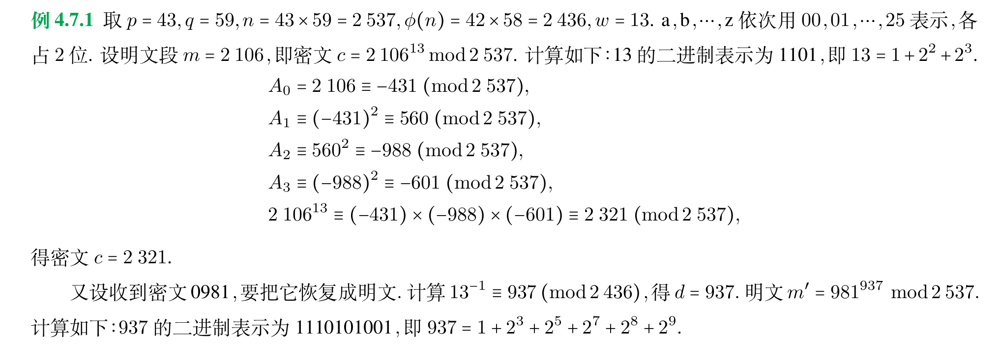
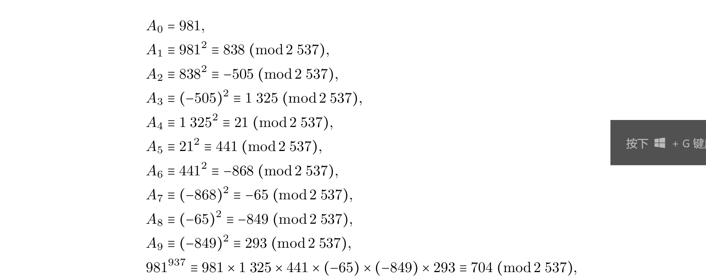

本章记录初等数论中素数、最大公因数、同余、欧拉定理和 RSA 的基本用法。它更像一份公式与题型索引，适合在需要调用某个结论时快速回看。

## 素数

整除、倍数、因子、平凡因子、真因子、带余除法的概念。

因子可以是负的。

余数一定大于零。

几个命题：

- (1) 若 $a \mid b \ \wedge a \mid c, \forall m,n \in Z \rightarrow a \mid mb+nc.$
- (2) 若 $a \mid b \ \wedge b \mid c \rightarrow a \mid c.$
- (3) 若 $m \not = 0, a \mid b \Leftrightarrow ma \mid mb.$
- (4) 若 $a \mid b \wedge b \mid a \Leftrightarrow a= \pm b.$
- (5) 若 $a \mid b \ \wedge b \not = 0 \rightarrow |a| \le |b|.$

素数、合数的定义，唯一分解定理，素因子分解。

关于素数的一些命题：

- (1) 若 $p$ 是素数且 $d \mid p,$ 若 $d \gt 1 \rightarrow d=p$。
- (2) 若 $p$ 是素数且 $p \mid ab \rightarrow p \mid a \ \vee p \mid b.$
- (3) 设 $a$ 是大于 $1$ 的整数，则 $a$ 是合数当且仅当存在整数 $b,c$，使得 $a=bc,1 \lt b \lt a, 1 \lt c \lt a.$
- (4) 合数必有素因子。

唯一分解定理的推论：设 $a=p_1^{r_1}p_2^{r_2}\ldots p_k^{r_k},$ 其中 $p_i$ 是互不相同的素数 $,r_i$ 是正整数，则正整数 $d$ 为 $a$ 的因子的充分必要条件为：$d=p_1^{s_1}p_2^{s_2}\ldots p_k^{s_k},$ 其中 $0 \le s_i \le r_i,i=1,2,\ldots,k.$

定理：有无穷多个素数

定理：设 $\pi(n)$ 表示小于或等于 $n$ 的素数个数，有 $\lim\limits_{n \to + \infty} \frac{\pi(n)}{n/ \ln n} =1$

素数测试的概念

定理：合数 $n$ 必有小于等于 $\sqrt{n}$ 的真因子，合数 $n$ 必有小于等于 $\sqrt{n}$ 的素因子。

由此引出埃氏筛法

命题：$n$ 为合数时， $2^n-1$ 必为合数。

形如 $2^n-1$ 的素数被称作梅森素数.

## 最大公因数和最小公倍数

公因数、最大公因数、公倍数、最小公倍数的概念

若 $n=p_1^{r_1}p_2^{r_2}\ldots p_k^{r_k},$ 公因数个数为 $(1+r_1)(1+r_2)\ldots (1+r_k)$

命题：

- (1) 若 $a \mid m,b \mid m \Rightarrow \mathrm{lcm}(a,b) \mid m.$
- (2) 若 $d \mid a,d \mid b \Rightarrow d \mid \mathrm{gcd}(a,b)$

用唯一分解定理和辗转相除法求最大公因数

裴蜀定理

用裴蜀定理和辗转相除法反求 $xa+yb$ 的 $x,y$ 时，每步都消去最小的数。

互素的概念，两两互素的概念，由裴蜀定理得出的互素的性质。

例 4.2.3：设 $a \mid c, b \mid c, \mathrm{gcd}(a,b)=1$，证明 $ab \mid c$。

互素条件通常会把问题引向裴蜀定理。由于 $\mathrm{gcd}(a,b)=1$，存在整数 $x,y$ 使得

$$
xa+yb=1.
$$

等式两边同乘 $c$，得

$$
c=cxa+cyb.
$$

由 $b\mid c$ 可知 $ab\mid cxa$，由 $a\mid c$ 可知 $ab\mid cyb$，所以 $ab\mid c$。

## 同余

同余的定义，自反、对称、传递性。

关于同余的几个命题：

- (1) 若 $a \equiv B (\mathrm{mod} \ m),c \equiv d(\mathrm{mod} \ m)$ ，则

$$
a \pm c \equiv b \pm d (\mathrm{mod} \ m),\quad ac \equiv bd (\mathrm{mod} \ m),\quad a^k \equiv b^k (\mathrm{mod} \ m)
$$

- (2) 设 $d \ge 1,d \mid m,$ 若 $a \equiv b (\mathrm{mod} \ m) \Rightarrow a \equiv b(\mathrm{mod} \ d).$
- (3) 设 $d \ge 1,$ 则 $a \equiv b(\mathrm{mod} \ m) \Leftrightarrow da \equiv db(\mathrm{mod} \ dm).$
- (4) 设 $\mathrm{gcd}(c,m)=1,$ 则 $a \equiv b(\mathrm{mod} \ m) \Leftrightarrow ca \equiv cb(\mathrm{mod} \ m).$

模 $m$ 等价类的定义、相加、相乘

求日期的星期数。 $y$ 年 $m$ 月 $d$ 日星期数的计算公式为

$$
w \equiv X+ \lfloor X/4 \rfloor + \lfloor C/4 \rfloor -2C +2M + \lfloor (M+ \lfloor M/7 \rfloor)/2 \rfloor + \lfloor M/12 \rfloor +d(\mathrm{mod} \ 7)
$$

其中

$$
M=(m-3)(\mathrm{mod} \ 12)+1,\quad Y=y-\lfloor M/11 \rfloor =100C+X
$$

一个更简便的计算公式为

$$
w \equiv X + \lfloor X/4 \rfloor + \lfloor C/4 \rfloor -2C +2 + \lfloor (13M-11)/5 \rfloor +d (\mathrm{mod} \ 7)
$$

其中

$$
M=(m-3)(\mathrm{mod} \ 12)+1,\quad Y=y-\lfloor M/11 \rfloor =100C+X
$$

## 一次同余方程

一次同余方程的定义，解的定义

方程 $ax \equiv c(\mathrm{mod} \ m)$ 有解的充要条件为

$$
\mathrm{gcd}(a,m) \mid c
$$

解的个数为 $\mathrm{gcd}(a,m)$

$a$ 的模 $m$ 逆的定义及其充要条件为 $\mathrm{gcd}(a,m)=1$ ，并且逆是唯一的。

求逆的方法：

法一：瞪眼法

法二：举等价类

法三：辗转相除求 $ab+km=1$ 的 $k,b,$ 则 $b$ 是 $a$ 的逆。

## 欧拉定理和费马小定理

欧拉函数 $\phi(n)$ 的定义

给定素数分解式求欧拉函数的值：

若 $n=p_1^{\alpha_1}p_2^{\alpha_2}\ldots p_k^{\alpha_k}$ ，则

$$
\phi(n)=n(1-\frac{1}{p_1})(1-\frac{1}{p_2})\ldots(1-\frac{1}{p_k})
$$

它的证明是用容斥原理证明的，从形式上来看比较显然

欧拉定理：若 $\mathrm{gcd}(a,n)=1$ ，则

$$
a^{\phi(n)} \equiv 1(\mathrm{mod} \ n)
$$

证明挺有意思的

费马小定理：若 $p$ 是素数，且 $\mathrm{gcd}(a,p)=1$ ，则

$$
a^{p-1} \equiv 1(\mathrm{mod} \ p)
$$

一个费马小定理的推论：若 $p$ 是素数，对任意整数 $a,a^p \equiv a(\mathrm{mod} \ p)$

## 均匀伪随机数的产生方法

线性同余法(最常用)：选择 $m,a,c,x_0$ ，并令

$$
x_n=(ax_{n-1}+c)(\mathrm{mod} \ m)
$$

为得到 $(0,1)$ 上均匀分布的伪随机数，取 $u_n=x_n/m$。

这里有 $2 \le a \lt m,0 \le c \lt m,0 \le x_0 \lt m.$

$x_0$ 随机给出，其余的三个参数是固定的.

递推产生序列一定会出现循环，我们把最小正周期 $l$ 称作周期.伪随机数的周期越长越好.

要得到满意的伪随机数，好的参数 $m,a,c$ 要选对。

当 $c=0$ 时，线性同余法被称为乘同余法.此时 $x_0$不能取0.

最常见的均匀伪随机数发生器是 $m=2^{31}-1,a=7^5$ 的乘同余法， $2^{31}-2$。

## RSA公钥密码

密码的定义：一组含有参数 $k$ 的变换 $E$。信息 $m$ 通过变换 $E$ 得到 $c=E(m)$。原始信息 $m$ 称为明文， $c$ 称为密文，从明文得到密文称作加密， $E$ 称为加密算法， $k$ 称为密钥.同一个加密算法取不同密钥的结果不一样.从密文 $c$ 恢复明文 $m$ 的过程称作解密，解密算法 $D$ 是加密算法 $E$ 的逆运算，解密过程的参数称作解密过程的密钥，传统密码的解密密钥可以由加密算法的密钥推导出.

凯撒密码为

$$
E(i)=(i+k)(\mathrm{mod} \ 26),\quad D(i)=(i-k)(\mathrm{mod} \ 26)
$$

改进的加密算法为

$$
E(i)=(ai+b)(\mathrm{mod} \ 26)
$$

用一个字符替代另一个字母的算法容易用分析字母频率的方法破译。

维吉尼亚算法：把明文分成若干段，每段的长度为 $n$ ，并令

$$
k=k_1k_2\ldots k_n,\quad E(m_1m_2\ldots m_n)=c_1c_2 \ldots c_n,\quad c_i=(m_i+k_i)(\mathrm{mod} \ 26)
$$

传统密码的密钥是对称的，知道加密密钥就能推算出解密密钥，通信双方分别持有加密密钥和解密密钥，这被称作私钥密码.

现在计算机通信更需要公钥密码，密码的密钥是非对称的，不能用加密密钥推算出解密密钥.加密密钥可以公开。

RSA公钥密码是目前使用最广泛的公钥密码算法.它的安全性依赖于大数因子分解的困难性。其内容如下：

取两个不相等的大素数 $p,q,$ 记 $n=pq,\phi(n)=(p-1)(q-1).$ 取正整数 $w,w$ 与 $\phi(n)$ 互素，取 $w$ 模 $\phi(n)$ 的逆 $d$。

把明文数字化后分为若干段，每一段的值小于 $n,$ 对每一个明文段 $m,$

加密算法为

$$
c=E(m)=m^w(\mathrm{mod} \ n)
$$

解密算法为

$$
D(c)=c^d(\mathrm{mod} \ n)
$$

加密密钥 $w$ 和 $n$ 是公开的， $p,q,\phi(n),d$ 是保密的。

关于这个算法正确性的证明，请认真阅读课本。

加密和解密算法的模乘幂运算($a^b (\mathrm{mod} \ n)$ )的计算技巧：

写出 $b$ 的二进制表示：$b_{r-1}\ldots b_1b_0$

$$
a^b=a^{b_0} \times (a^2)^{b_1} \times \ldots \times (a^{2^{r-1}})^{b_{r-1}}(\mathrm{mod} \ n).
$$

令 $A_0=a,A_i=(A_{i-1})^2(\mathrm{mod} \ n),$ 有

$$
a^b \equiv A_0^{b_0} \times A_1^{b_1} \times \ldots \times A_{r-1}^{b _{r-1}}(\mathrm{mod} \ n)
$$

其中

$$
A_i^{b_i}=
\begin{cases}
A_i, b_i=1 \\
1, b_i=0 \\
\end{cases}
\quad i=0,1,\ldots,r-1.
$$

已知 $n=pq，$ 计算 $\phi(n)$ 的逆：辗转相除&裴蜀定理.
下面是一道 RSA 密钥计算的例题，图中保留了完整的辗转相除与模幂计算过程。

得到的密文可以写成数字形式。

下面整理一些容易漏条件的题目。

1. 求整数 $x,y$，使得 $35x+72y=1$。

用辗转相除法反推裴蜀等式：

$$
\begin{align*}
72 & = 35 \times 2 +2 \\
35 & = 2 \times 17 +1 \\
2 & = 2 \times 1 \\
\Rightarrow & \mathrm{gcd}(72,35) = 1 \\
1 & = 35 - 2 \times 17 \\
& =35 - 17 \times (72-35 \times 2) \\
& =35 \times 35 - 17 \times 72 \\
\end{align*}
$$

即 $x=35,y=-17$

2. 用 RSA 公钥密码把 "$QJ$" 译成密文，这里取 $p=5,q=7,w=5$。

有 $n=pq=35$，"$QJ$" 对应的明文为 $16 \ 09$。由于 $5=2^0+2^2$，对 $16$ 有

$$
A_0\equiv 16 \pmod{35},\quad
A_1\equiv 11 \pmod{35},\quad
A_2\equiv 16 \pmod{35}.
$$

因此

$$
16^5 \equiv A_0A_2 \equiv 11 \pmod{35}.
$$

同理，对 $9$ 有

$$
B_0\equiv 9 \pmod{35},\quad
B_1\equiv 11 \pmod{35},\quad
B_2\equiv 16 \pmod{35},
$$

所以

$$
9^5\equiv B_0B_2\equiv 4 \pmod{35}.
$$

最后的密文为 $11 \ 04$。

3. 结论：对于形如 $a_0x^n+\ldots +a_{n-1}x+a_n=0$ 的方程，其若有整数解，则解必为 $a_n$ 的因数

4. 证明 $\sum\limits_{i=1}^{n}\frac{1}{i}$ 不是整数。

对 $n\geq 2$，取

$$
T=\mathrm{lcm}(1,2,\ldots,n).
$$

设 $2^k$ 是不超过 $n$ 的最大 $2$ 的幂。将原式乘以 $T$ 后，只有 $T/2^k$ 是奇数，其余 $T/i$ 都是偶数。因此

$$
T\sum_{i=1}^{n}\frac{1}{i}
$$

是奇数。另一方面，若原和为整数，则上式应当能被 $T$ 整除，特别也应当是偶数，矛盾。因此原和不是整数。

5。对于不定方程 $ax+by=c$ ，为了求出其整数解考虑一次同余方程 $ax \equiv c(\mathrm{mod} \ b)$

6. 设 $a,b,c,d$ 均为正整数，问：下面叙述是否正确?
- (1) 若 $a \mid c,b \mid c$ 则 $ab \mid c.$
解：不正确，存在反例 $a=b=6,c=24,$ 此时 $ab \gt c.$

7. 证明：如果 $a \mid bc,\mathrm{gcd}(a,b)=1$，则 $a \mid c$。

由 $\mathrm{gcd}(a,b)=1$ 得存在整数 $x,y$，使得

$$
ax+by=1.
$$

两边同乘 $c$，并设 $bc=ka$，则

$$
c=cax+cby=acx+aky=a(cx+ky).
$$

因此 $a\mid c$。

这道题对应一个常用性质。

8. 设 $a,b$ 互素，证明：当 $d \gt 0$ 时， $d \mid ab$ 当且仅当存在 $d_1,d_2,d=d_1d_2,d_1 \mid a,d_2 \mid b,$ 且 $d_1,d_2$ 是唯一的。

充分性显然。必要性中，令

$$
d_1=\mathrm{gcd}(d,a), \quad d_2=\mathrm{gcd}(d,b).
$$

此时 $d_1\mid a,d_2\mid b$。由于 $a,b$ 互素，$d$ 中来自 $a$ 的素因子和来自 $b$ 的素因子互不重叠，因此 $d=d_1d_2$。

再证唯一性。若另有 $c_1\mid a,c_2\mid b,d=c_1c_2$，则由最大公因数的定义得到 $c_1\mid d_1,c_2\mid d_2$。结合 $d=d_1d_2=c_1c_2$，可得 $c_1=d_1,c_2=d_2$。

这道题会用到上面提到的互素结论，即

$$
\mathrm{gcd}(m,ab)=\mathrm{gcd}(a,m) \times \mathrm{gcd}(b,m)
$$

9. 下列叙述是否正确?若正确请证明，否则给出反例。
- (5) 若 $a \equiv b (\mathrm{mod} \ m),a \equiv b (\mathrm{mod} \ n)$ ，是否一定有

$$
a \equiv b (\mathrm{mod} \ mn)
$$

不一定。这个命题等价于由 $m\mid(a-b)$ 和 $n\mid(a-b)$ 推出 $mn\mid(a-b)$，还需要 $\mathrm{gcd}(m,n)=1$。若不互素，可以直接构造反例。

10. 设 $m \gt 0,d=\mathrm{gcd}(a,m),d \mid c,$ 证明：一次同余方程 $ax \equiv c(\mathrm{mod} \ m)$ 在模 $m$ 下有 $d$ 个解。

设

$$
a=da_1,\quad m=dm_1,\quad \mathrm{gcd}(a_1,m_1)=1.
$$

由 $d\mid c$ 可知方程有解，取其中一个解 $x_0$。若 $x$ 也是解，则

$$
a(x-x_0)\equiv 0 \pmod m.
$$

约去 $d$ 后得到

$$
a_1(x-x_0)\equiv 0 \pmod {m_1}.
$$

由于 $\mathrm{gcd}(a_1,m_1)=1$，可消去 $a_1$，得

$$
x\equiv x_0 \pmod {m_1}.
$$

在模 $m$ 的意义下，这些解为

$$
x=x_0+km_1 \quad (k=0,1,\ldots,d-1),
$$

恰好有 $d$ 个。

11. 一个结论：设 $m>1,ac \equiv bc(\mathrm{mod} \ m),d=\mathrm{gcd}(c,m)$ ，则

$$
a \equiv b(\mathrm{mod} \ m/d)
$$

12. 设 $F_n=2^{2^n}+1,n=0,1,2\ldots$。求证：若 $n\neq m$，则 $\mathrm{gcd}(F_n,F_m)=1$。

不妨设 $n<m$。利用辗转相除法，可以把 $F_m$ 对 $F_n$ 的余数化为 $2$：

$$
2^{2^m}+1 = (2^{2^n}+1)(2^{2^m-2^n}-2^{2^m-2 \cdot 2^n}\ldots + 2^{2^m - (2^{m-n}-1) \cdot 2^n} -1)+2.
$$

于是有 $\mathrm{gcd}(F_m,F_n) = \mathrm{gcd}(F_n,2)=1$

13. 若 $\mathrm{gcd}(m,n)=1$ ，则 $\phi(mn) = \phi(m) \phi(n)$。

14. 设 $\mathrm{gcd}(m,n)=1$，证明：

$$
m^{\phi(n)}+n^{\phi(m)} \equiv 1 \pmod {mn}.
$$

由欧拉定理，

$$
m^{\phi(n)} \equiv 1 \pmod n,\quad n^{\phi(m)} \equiv 1 \pmod m.
$$

于是 $n\mid m^{\phi(n)}-1$，$m\mid n^{\phi(m)}-1$，从而

$$
mn \mid (n^{\phi(m)}-1)(m^{\phi(n)}-1).
$$

又因为 $mn\mid n^{\phi(m)}m^{\phi(n)}$，整理可得

$$
mn\mid n^{\phi(m)}+m^{\phi(n)}-1.
$$

因此原同余成立。

15. 设 $f(x)$ 是整系数多项式， $p$ 是素数，证明

$$
(f(x))^p \equiv f(x^p)(\mathrm{mod} \ p)
$$

16. 设 $a,b,m$ 是整数，其中 $m \ge 2.$ 证明：线性同余变换

$$
E(i)=(ai+b)(\mathrm{mod} \ m)(i=0,1,\ldots,m-1)
$$

是 $\{0,1,\ldots,m-1\}$ 上的双射函数当且仅当 $a$ 与 $m$ 互素。
思路：本题给出一种证明双射的新思路，即直接写出逆函数并证明。
证明：
充分性：由于 $a,m$ 互素，知 $a^{-1}$ 存在，令

$$
D(i)=a^{-1}(i-b)(\mathrm{mod} \ m)
$$

证明

$$
D(E(i))=i,\quad E(D(j))=j
$$

即证明其是双射。
必要性：若 $a,m$ 不互素，记 $\mathrm{gcd}(a,m)=d,a=da_1,m=dm_1$。于是有

$$
E(i+m_1)=(ai+am_1+b)(\mathrm{mod} \ m)=(ai+a_1m+b)(\mathrm{mod} \ m)=E(i)
$$

与单射矛盾。
