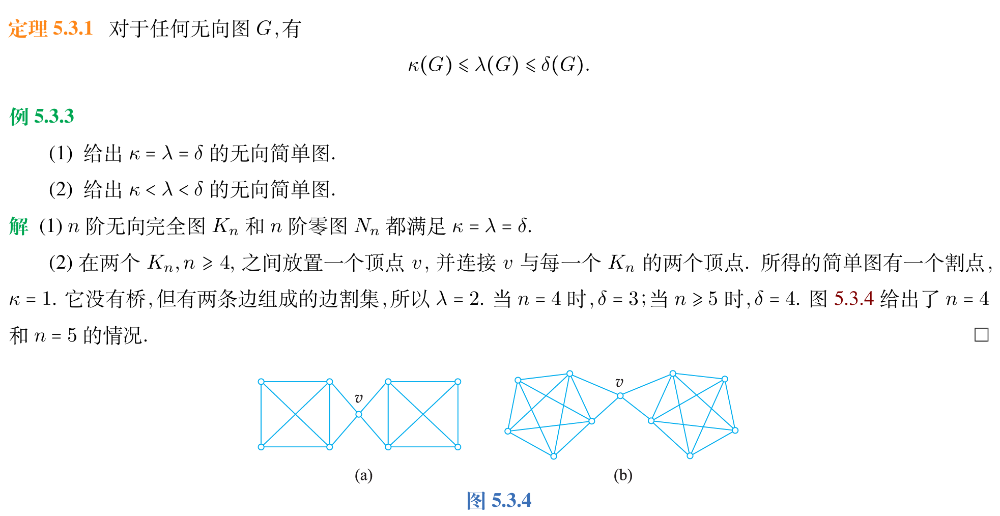
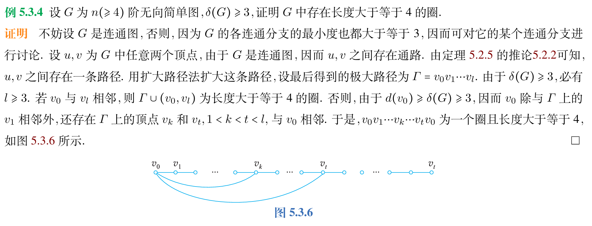
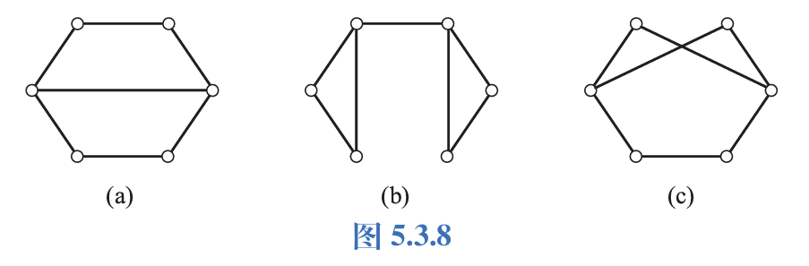
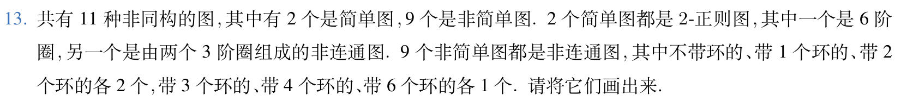
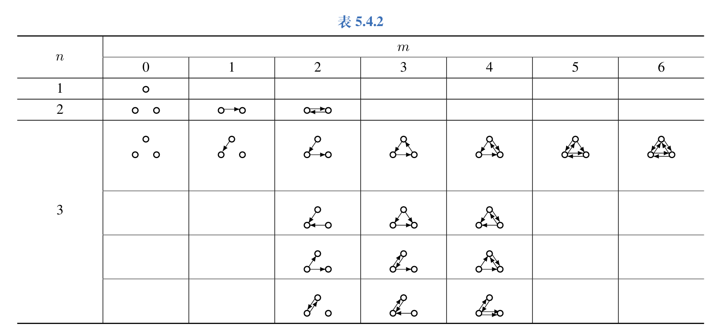
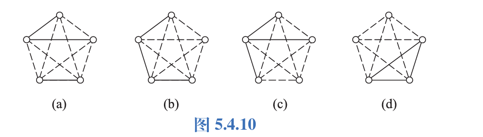
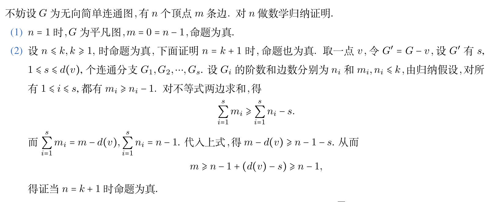
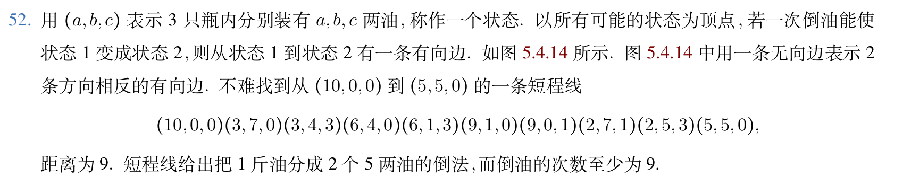
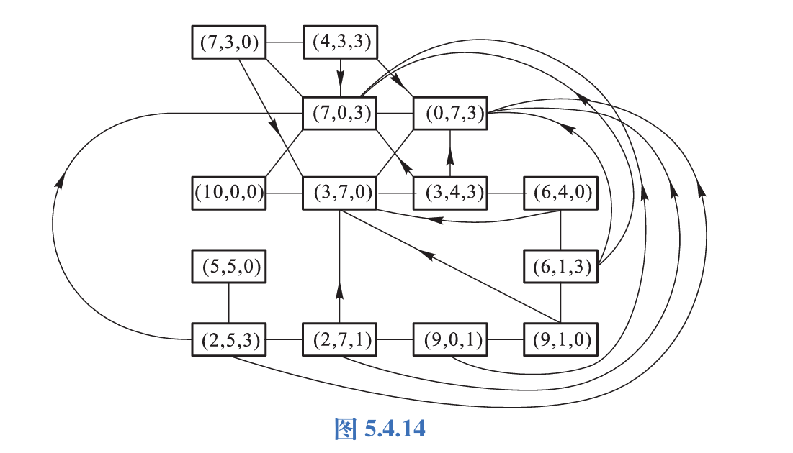

本章把图论的基本对象、度数、连通性、二部图和矩阵表示串起来。术语很多，阅读时可以先抓住“点、边、通路、连通性”这条主线。

## 图的定义及运算

无序积的定义：设 $A,B$ 为任意两个集合，称 $\lbrace\lbrace{}a,b\rbrace | a \in A,b \in B\rbrace$ 为 $A$ 与 $B$ 的无序积，记作 $A \& B$。将 $\lbrace{}a,b\rbrace$ 简记为 $(a,b),$ 同时有 $A \& B = B \& A$。

无向图的定义：$G= \langle V,E \rangle$。

点集，顶点，边集，无向边(边)。

有向图的定义：$D = \langle V,E \rangle$。

点集，顶点，有向边，边集。

用小圆圈表示图的顶点，用顶点之间的连线表示无向边，用带箭头的连线表示有向边。

先列出一些基础定义

- (1) 有向图和无向图统称为图，有时单独将无向图称作图。有时用 $G$ 泛指图，有时则用 $D$ 和 $G$ 区分，用 $V(G)$ 和 $E(G)$ 表示点集和边集， $|V(G)|$ 和 $|E(G)|$ 表示点数和边数。
- (2) 顶点数称为图的阶， $n$ 个顶点的图称为 $n$ 阶图。
- (3) 零图指一条边都没有的图， $n$ 阶零图称为 $N_n$。 一阶零图称为平凡图。
- (4) 虽然顶点集规定为非空集，实际运算时可能产生顶点集为空集的图，称为空图，记作 $\emptyset$。
- (5) 如果给每一个顶点和每一条边指定一个符号，称这样的图为标定图，反之为非标定图。
- (6) 将有向图的各条有向边改成无向边后的无向图称为有向图的基图，重边也要算进去。
- (7) 给定无向图 $G=\langle V,E \rangle,e_k =(v_i,v_j) \in E,$ 称 $v_i,v_j$ 为 $e_k$ 的端点， $e_k$ 与 $v_i,v_j$ 关联。若这条边不为环，则称 $e_k$ 与 $v_i,v_j$ 的关联次数为1。否则称 $e_k$ 和 $v_i$ 的关联次数为2；若不与这条边关联，则称关联次数为0。点相邻：两个点之间有一条边连接，边相邻：两条边有公共顶点。
- (8) 给定有向图 $D = \langle V,E \rangle,e_k = \langle v_i,v_j \rangle \in E$。 端点的定义如上， $v_i$ 称为 $e_k$ 的始点， $v_j$ 称为 $e_k$ 的终点。并且有 $e_k$ 与 $v_i,v_j$ 关联。若 $v_i=v_j$ ，称其为环。点相邻：两个点之间有有向边，边相邻：一条边终点是另一条边始点。
图中没有边关联的点称作孤立点。
- (9) 给定无向图 $G=\langle V,E \rangle$ 和顶点 $v$ ，与 $v$ 相邻且不相等的顶点集合称为它的邻域($N_G(v)$ )，它的邻域加上 $v$ 称为它的闭邻域($\overline N_G(v)$ )，与 $v$ 关联的边的集合称为它的关联集($I_G(v)$ )。
- (10) 给定有向图 $D=\langle V,E \rangle$ 和顶点 $v$ ，与 $v$ 相邻且不相等， $v$ 作为始点的点的集合称为它的后继元集($\Gamma_D^{+}(v)$ )，与 $v$ 相邻且不相等， $v$ 作为终点的点的集合称为它的先驱元集($\Gamma_D^{-}(v)$ )，两者的并集称作它的邻域($N_D(v)$ )，闭邻域($\overline N_D(v)$ )的定义同上。
- (11) 在无向图中，如果关联一对顶点的无向边多于一条，称其为平行边，它的数量称为重数。有向图的平行边定义相同，只是需要方向相同。含平行边的图称作复杂图，不含平行边和环的图称为简单图。
- (12) 设 $G=\langle V,E \rangle,G'=\langle V',E' \rangle,$ 若 $V' \subseteq V,E' \subseteq E,$ 则 $G'$ 为 $G$ 的子图， $G$ 为 $G'$ 的母图，即 $G' \subseteq G$。若 $V' \subset V \vee E' \subset E,$ 则为真子图， $G' \subset G$。 若 $V' = V,$ 称 $G'$ 为 $G$ 的生成子图。若 $V_1 \subset V \wedge V_1 \not = \emptyset,G$ 中两个顶点都在 $V_1$ 中组成 $E_1$ 的图称为 $G$ 的 $V_1$ 导出的子图，记作 $G[V_1]$。 若 $E_1 \subset E \wedge E_1 \not = \emptyset,E_1$ 中关联的顶点作为 $V_1$ 的图称为 $G$ 的 $E_1$ 导出的子图，记作 $G[E_1]$。
- (13) 无向图中，删除边，删除顶点，加新边，收缩的定义。它们的符号表示分别为 $G -e,G - V',G \cup (u,v),G \backslash e$。收缩的含义：在 $G$ 中删除 $e$ 后，将 $e$ 的两个端点用 $w$ 代替(可以是两个端点其中之一)，并使 $w$ 关联除 $e$ 外这两个端点关联的所有边。收缩和加新边过程中可能产生环和平行边。
- (14) 设 $G_1=\langle V_1,E_1 \rangle$ 和 $G_2 = \langle V_2,E_2 \rangle$ 为不含孤立点的两个图，且有向无向性相同。
- (a) 称以 $V_1 \cup V_2$ 为顶点集， $E_1 \cup E_2$ 为边集的图为 $G_1$ 和 $G_2$ 的并图，记作 $G_1 \cup G_2$。
- (b) 称以 $E_1 - E_2$ 为边集，以 $E_1 - E_2$ 中边关联的顶点组成的集合的图为 $G_1$ 和 $G_2$ 的差图，记作 $G_1 - G_2$。
- (c) 称以 $E_1 \cap E_2$ 为边集，以 $E_1 \cap E_2$ 中边关联的顶点组成的集合的图为 $G_1$ 和 $G_2$ 的交图，记作 $G_1 \cap G_2$。
- (d) 称以 $E_1 \oplus E_2$ 为边集，以 $E_1 \oplus E_2$ 中边关联的顶点组成的集合的图为 $G_1$ 和 $G_2$ 的环和，记为 $G_1 \oplus G_2$。

以上所有定义都基于边集的运算展开

若 $V_1 \cap V_2 = \emptyset,$ 则 $G_1$ 与 $G_2$ 不交；若 $E_1 \cap E_2 = \emptyset,$ 则 $G_1$ 和 $G_2$ 边不交。不交可以推出边不交。

这里还有 $G_1 \oplus G_2=(G_1 \cup G_2) - (G_1 \cap G_2)$。

OI 中所说的"环"实际上指环和圈的统称，离散中讲到环只可能是自环。

正则图一定是简单图。

## 度数、通路和回路

下面整理度数、通路和回路的常用语言。

- (1) 无向图的度数 $d(v),$ 有向图的入度 $d_{-}(v),$ 出度 $d_{+}(v),$ 度数 $d(v)$。 无向图的最大度数 $\Delta(G),$ 最小度数 $\delta(G),$ 有向图的最大出度 $\Delta^{+}(D),$ 最小出度 $\delta^{+}(v),$ 最大入度 $\Delta^{-}(v),$ 最小入度 $\delta^{-}(v),$ 最大度数 $\Delta(v),$ 最小度数 $\delta(v)$。 度数为1的顶点为悬挂顶点，与它关联的边称为悬挂边，奇度顶点和偶度顶点的定义。

环提供2个度数。

- (2) 握手定理：任何无向图中，所有顶点的度数之和为边数的2倍。任何有向图中，所有顶点的度数之和为边数的2倍，所有顶点的入度之和等于所有顶点的出度之和，都等于边数。

推论：任何图中，奇度顶点的个数是偶数。
- (3) 设 $G=\langle V,E \rangle$ 为一个无向图， $V=\lbrace{}v_1,v_2,\ldots,v_n\rbrace,$ 称 $d=(v_1),d(v_2),\ldots,d(v_n)$ 为 $G$ 的度数列，对于顶点标定的无向图，它的度数列是唯一的。反之，对于给定的非负整数列 $d=(d_1,d_2,\ldots,d_n),$ 其可图化或可简单图化。有向图还可定义入度列或者出度列。

定理：非负整数列 $d=(d_1,d_2,\ldots,d_n)$ 可图化 $\Leftrightarrow$ $\sum\limits_{i=1}^{n}d_i$ 是偶数。

定理：$G$ 为任意 $n$ 阶无向简单图，则 $\Delta(G) \le n-1$。

判断是否可简单图化时，上面的条件只是必要条件，实际还要自己画图验证。
- (4) 设 $G_1=\langle V_1,E_1 \rangle$ 和 $G_2 = \langle V_2,E_2 \rangle$ 是两个无向图，若存在双射 $f:V_1 \rightarrow V_2$，使得

$$
\forall v_i,v_j \in V_1,\quad (v_i,v_j) \in E_1 \Leftrightarrow (f(v_1),f(v_2)) \in E_2
$$

并且这两条边的重数相同，则称 $G_1$ 和 $G_2$ 同构，记作 $G_1 \cong G_2$。对有向图，只需额外考虑边的方向。
至今还没有找到两个图同构的充要条件，阶数相同、边数相同、度数列相同等都只是必要条件。
- (5) $G$ 为 $n$ 阶无向简单图，若顶点两两相邻，则 $G$ 为 $n$ 阶无向完全图，简称 $n$ 阶完全图，记作 $K_n$。
$D$ 为 $n$ 阶有向简单图，若每个顶点都邻接到其他顶点，则称 $D$ 为 $n$ 阶有向完全图。
$G$ 为 $n$ 阶有向简单图，若其基图为 $K_n,$ 称其为 $n$ 阶竞赛图。
它们的边数分别为：$\frac{n(n-1)}{2},n(n-1),\frac{n(n-1)}{2}$。
- (6) 设 $G$ 为 $n$ 阶无向简单图，若 $\forall v \in V(G),d(v)=k,$ 称 $G$ 为 $k-$ 正则图，边数 $\frac{kn}{2}$。
彼得松图是10个点、15条边的3-正则图。
画出所有非同构的简单图时，可以先枚举度数列。
构造所有非同构的 $n$ 阶 $m$ 条边的简单图至今还没有通用解法。
- (7) 设 $G=\langle V,E \rangle$ 是 $n$ 阶无向简单图

$$
\overline{E}=\lbrace(u,v) | u,v \in V,u \not = v,(u,v) \notin E\rbrace,\quad \overline{G}=\langle V,\overline{E} \rangle
$$

是 $G$ 的补图。若 $G \cong \overline{G}$，则 $G$ 为自补图。
- (8) 设 $G$ 为无向标定图，顶点与边的交替序列 $\Gamma=v_{i_0}e_{j_1}v_{i_1}\ldots e_{j_l}v_{i_l}$ 称作从 $v_{i_0}$ 到 $v_{i_l}$ 的通路，始点和终点的定义是显然的，边的条数称作长度。回路的定义也是显然的。若所有边互不相同，则为简单通路(回路)。若所有顶点(除 $v_{i_0}$ 和 $v_{i_l}$ )互不相同，所有边都互不相同，则称为初级通路(路径)/初级回路(圈)，奇圈和偶圈随长度而定。在简单无向图中，圈的长度至少为3。有向图中也有类似定义。另外，初级通路(回路)必然是简单通路(回路)。
定理：在 $n$ 阶图 $G$ 中，若从 $u$ 到 $v$ 存在通路，且 $u \not = v,$ 则存在从 $u$ 到 $v$ 且长度小于等于 $n-1$ 的通路 $\Rightarrow$ 初级通路。
定理：在 $n$ 阶图 $G$ 中，若存在 $v$ 到自身的回路，则一定存在 $v$ 到自身长度小于等于 $n$ 的回路 $\Rightarrow$ 初级回路。
回路的意义：同构意义下长度相同的圈只有一个，标定图中定义意义下序列不同即不同，有时候也要看是否考虑顺时针逆时针差异。

## 图的连通性
下面整理图的连通性相关定义
- (1) 无向图 $G = \langle V,E \rangle ,$ 若 $u$ 和 $v$ 之间存在通路，称 $u$ 和 $v$ 是连通的，记作 $u \sim v$。对任意 $v \in V$ ，都有 $v \sim v$ ，所以它是一种等价关系。
若 $G$ 是平凡图或者任意顶点都是连通的，则称其为连通图，反之称为非连通图。
当 $n \ge 1$ 时，$K_n$ 都是连通图；零图 $N_n$ 只有在 $n=1$ 时连通，$n\geq 2$ 时不连通。
- (2) 设 $G=\langle V,E \rangle,$ G的一个连通块 $G[v_i]$ (即关于"连通"这个等价关系的一个等价类)称为它的一个连通分支。 $G$ 的连通分支数称为 $p(G)$。
连通图满足 $p(G)=1$ ，非连通图满足 $p(G) \ge 2$ ，而 $N_n$ 的 $p(G)$ 最大，为 $n$。
- (3) 任取两个顶点 $u,v,$ 若 $u \sim v,$ 称最短通路为它们之间的短程线，其长度称为它们之间的距离，记为 $d(u,v)$。 若不连通，则 $d(u,v) = + \infty$。
关于距离的性质：
- (a) $d(u,v) \ge 0, d(u,v)=0 \Leftrightarrow d(u,v)=0$。
- (b) $d(u,v)=d(v,u)$
- (c) $d(u,v)+d(v,w) \ge d(u,w)$
顶点可以表示实际问题中的状态，从而把实际问题转化成图上的连通性问题。
- (4) 设无向图 $G=\langle V,E \rangle,$ 若存在 $V' \subset V,p(G-V')>p(G),$ 且 $\forall V'' \subset V',p(G-V'')=p(G),$ 称 $V'$ 为 $G$ 的点割集(或割点)。
设无向图 $G=\langle V,E \rangle,$ 若存在 $E' \subset E,p(G-E')>p(G),$ 且 $\forall E'' \subset E',p(G-E'')=p(G),$ 称 $E'$ 为 $G$ 的边割集(或割边(桥))。
割点的度数必然大于等于 $2$ 。如果 $n \ge 3,$ 桥的两个端点中必然有一个度数 $\ge 2,$ 并且它是割点。
- (5) 若 $G$ 是无向连通图且不是完全图，则最小点割集的大小称为 $G$ 的点连通度，简称连通度，记为 $\kappa(G)$。我们规定，完全图的连通度为n-1，非完全图的连通度为0。若 $\kappa(G) \ge k,$ 则称 $G$ 为 $k-$ 连通图。一张图可能对应多个 $k$ ，它的含义是，删除任意 $k-1$ 个顶点，得到的图一定还是连通的。
若 $G$ 是无向连通图，则最小边割集的大小称为 $G$ 的边连通度，记为 $\lambda(G)$。我们规定，非完全图的边连通度为0。若 $\lambda(G) \ge r,$ 则称 $G$ 为 $r-$ 边连通图。一张图可能对应多个 $r$ ，它的含义是，删除任意 $r-1$ 条边，得到的图一定还是连通的。
比较点连通程度和边连通程度，还是比较 $\kappa(G)$ 和 $\lambda(G)$ 哪个大。
计算连通度时，可以先针对每个顶点，看这个顶点相邻的顶点数或者关联的边数。
定理：对任何无向图 $G$ ，有 $\kappa(G) \le \lambda(G) \le \delta(G)$。
一个小例子：

- (6) 给定有向图 $D=\langle V,E \rangle,v_i,v_j,$ 若存在 $v_i$ 到 $v_j$ 的通路，称 $v_i$ 可达 $v_j$ ，记作 $v_i \rightarrow v_j$。 对任意 $v_i \in V$ ，都有 $v_i \rightarrow v_i$。 若 $v_i \rightarrow v_j \wedge v_j \rightarrow v_i,$ 称它们相互可达，记作 $v_i \leftrightarrow v_j$。
可达和相互可达都是二元关系，相互可达是等价关系。
短程线和距离的定义同无向图，只要求可达，不要求相互可达。
距离除了对称性，具有全部无向图中距离具有的性质。
- (7) 若有向图的基图是连通图，称其为弱连通图，简称为连通图；若 $\forall v_i,v_j \in V,v_i \rightarrow v_j \vee v_j \rightarrow v_i,$ 称其为单向连通图；若 $\forall v_i,v_j \in V,v_i \leftrightarrow v_j,$ 称其为强连通图。
强连通图一定是单向连通图，单向连通图一定是弱连通图。
强连通图 $\Leftrightarrow$ 存在经过每个顶点至少一次的回路。
单向连通图 $\Leftrightarrow$ 存在经过每个顶点至少一次的通路。
- (8) 一种常用于路径和圈的构造性证明的方法：扩大路径法。若路径 $\Gamma$ 的始点和终点都不与 $\Gamma$ 外的顶点相邻，则称其为一条极大路径。给定一条路径，一直延伸始点和终点的相邻顶点，直到不能再延伸了，得到一条极大路径。

下面是扩大路径法的一个例子：

题目中还经常先假设是连通图，否则就转到某个连通分支中讨论。
- (9) 设无向图 $G=\langle V,E \rangle,$ 若能将 $V$ 划分为 $V_1,V_2,V_1 \cap V_2 = \emptyset,V_1 \not = \emptyset,V_2 \not = \emptyset,$ 使得 $G$ 中的每条边的两个端点都是一个属于 $V_1,$ 一个属于 $V_2,$ 则称 $G$ 为二部图(二分图、偶图)，称 $V_1$ 和 $V_2$ 为互补顶点子集，常将其记作 $\langle V_1,V_2,E \rangle$。 若 $G$ 是简单二部图，且 $V_1$ 的每个顶点均与 $V_2$ 中的每个顶点相邻，称其为完全二部图，记为 $K_{r,s},r=|V_1|,s=|V_2|$。
当 $n \ge 2$ 时，$N_n$ 为二部图。
画二部图时，人们习惯将 $V_1,V_2$ 分开画成两排。
判定二部图的定理：$n \ge 2,n$ 阶无向图 $G$ 是二部图 $\Leftrightarrow$ $G$ 中无奇圈。
证明可以多看看。

## 图的矩阵表示
- (1) 设无向图 $G=\langle V,E \rangle,V=\lbrace{}v_1,v_2,\ldots,v_n\rbrace,E=\lbrace{}e_1,e_2,\ldots,e_m\rbrace,$ 令 $m_{ij}$ 为 $v_i$ 与 $e_j$ 的关联次数，则称 $(m_{ij})_{n \times m}$ 为 $G$ 的关联矩阵，记作 $\mathbf{M}(G)$。
其有以下性质：
- (a) 每列元素之和都为2
- (b) 第 $i$ 行元素之和为 $v_i$ 的度数。
- (c) 整个矩阵的元素之和是边数2倍
- (d) 第 $j$ 列和第 $k$ 列相同 $\Leftrightarrow$ $e_j$ 和 $e_k$ 是平行边。
- (e) 第 $i$ 行元素之和为0当且仅当 $v_i$ 是孤立点。
- (2) 给定有向无环图 $D,$ 令 $m_{ij}=1$ ($v_i$ 为 $e_j$ 始点), $m_{ij}=-1$ ($v_i$ 为 $e_j$ 终点), $m_{ij}=0$ ($v_i$ 与 $e_j$ 不关联)。则称 $(m_{ij})_{n \times m}$ 为 $D$ 的关联矩阵，记作 $\mathbf{M}(D)$。
其有以下性质：
- (a) 每一列恰有一个1和一个-1
- (b) -1的个数等于1的个数，都等于边数(握手定理)。
- (c) 在第 $i$ 行中，1的个数等于 $d^{+}(v_i)$ ,-1的个数等于 $d^{-}(v_i)$。
- (d) 平行边对应的列相同
- (3) 给定有向图 $D=\langle V,E \rangle,$ 令 $a_{ij}^{(1)}$ 为从顶点 $v_i$ 邻接到 $v_j$ 的边的条数，称 $(a_{ij}^{(1)})_{n \times n}$ 为 $D$ 的邻接矩阵，记作 $\mathbf{A}(D)$ ，简记为 $\mathbf{A}$。
其有以下性质：
- (a) 第 $i$ 行之和为 $d^{+}(v_i)$。
- (b) 第 $j$ 列之和为 $d^{-}(v_j)$。
- (c) 整个矩阵之和为边数 $m$。
- (4) 设 $\mathbf{A}$ 为 $D$ 的邻接矩阵，则 $\mathbf{a}^l$ 中元素 $a_{ij}^{(l)}$ 表示 $D$ 中 $v_i$ 到 $v_j$ 长度为 $l$ 的通路数， $a_{ii}^{(l)}$ 表示 $v_i$ 到自身长度为 $l$ 的回路数， $\mathbf{A}^l$ 整个矩阵之和为 $D$ 中长度为 $l$ 的通路(含回路)总数，对角线元素之和为 $D$ 中长度为 $l$ 的回路总数。
若 $l \ge 1,B_l=\mathbf{A}+\mathbf{A}^2+\ldots +\mathbf{A}^l,$ 则 $B_l$ 元素之和为 $D$ 中长度小于等于 $l$ 的通路(含回路)总数，对角线元素之和为 $D$ 中长度小于等于 $l$ 的回路总数。
- (5) 给定有向图 $D$ ，令 $p_{ij}=1,v_i \rightarrow v_j,$ 否则为0。称 $(p_{ij})_{n \times n}$ 为 $D$ 的可达矩阵，记作 $\mathbf{P}(D)$ ，简记为 $P$。
其主对角线上元素均为1。
只要计算出 $B_{n-1},$ 通过它的元素是否为0可以写出可达矩阵，但是主对角元元素与 $B_{n-1}$ 无关。
- (6) 写出无向图的邻接矩阵和可达矩阵，只需要把无向边看做方向相反的有向边(自环只看作一条边)，因此它的邻接矩阵和可达矩阵都是对称的。

下面整理一些容易漏条件的题目。

1. 已知无向图 $G$ 的边数 $m=10,3$ 个 $2$ 度顶点， $2$ 个 $4$ 度顶点，其余顶点都是奇度顶点，试讨论奇度顶点的个数以及度数分配情况。

解：剩余顶点的度数之和为 $6,$ 我们进行以下拆分。

$6=1+1+1+1+1+1$

$6=3+1+1+1$

$6=3+3$

$6=5+1$

共四种情况。

2. 讨论 $K_5$ 和 $K_6$ 各有几个非同构的生成子图为正则图。

生成子图要求点集不变，只删边。若生成子图为 $k$-正则图，则 $kn$ 必须为偶数。

对于 $K_5$，可取 $0$-正则图、$2$-正则图和 $4$-正则图，共 $3$ 种。

对于 $K_6$，可取 $0$-正则图、$1$-正则图、$2$-正则图、$3$-正则图、$4$-正则图和 $5$-正则图，共 $6$ 种。

3. 正则图的补图也是正则图。

$k-$ 连通图中，给定 $k$ 不能确定 $\kappa(G)$。

给定无向图，即使知道它既有割点又有桥，也不能确定 $\delta(G)$。

非完全无向图中，极大路径不一定是最长路径。

4. 单向连通图中最多加1条边就能成为强连通图。

5. 在无向完全图 $K_n,n \ge 2$ 中寻找边数最多的生成子图，使其成为完全二部图 $K_{r,s}$。

完全二部图 $K_{r,s}$ 的边数为 $rs$，且这里有 $r+s=n$。因此要让 $rs$ 最大，应让两部分顶点数尽量接近。

当 $n$ 为偶数时，最大边数为

$$
\frac{n^2}{4}
$$

当 $n$ 为奇数时，最大边数为

$$
\frac{n^2-1}{4}
$$

6. 设 $r \ge 1,s \ge 1$，则由完全二部图 $K_{r,s}$ 产生完全图 $K_{r+s}$ 需要添加多少条边？

直接比较边数即可，需要添加

$$
\frac{(r+s)(r+s-1)}{2}-rs=\frac{r^2-r+s^2-s}{2}
$$

条边。

7. 看到非同构时，要判断的是同构意义下的结构，这里只看长度。

8. 画出度数列为 $(2,2,2,2,3,3)$ 的非同构简单图。

下图给出一种按度数列分类后的整理结果。

9. 证明：三维空间中不存在有奇数个面且每个面都有奇数条棱的多面体。

把每个面看作一个顶点。如果两个面有公共棱，就在对应顶点之间连边。这样得到的图中，顶点数等于多面体的面数，而每个顶点的度数等于对应面的棱数。

若原命题中的多面体存在，则这张图有奇数个顶点，且每个顶点的度数都是奇数，奇度顶点个数为奇数。这与握手定理推出的“奇度顶点个数必为偶数”矛盾。

10. 最大度和最小度都等于 $2$ 的 $6$ 阶无向图有几种非同构情况？其中有几种是简单图？

下图按是否存在平行边或环进行了分类。

11. 画出 $3$ 阶有向完全图的所有非同构的子图，指出哪些是生成子图，并指出哪些是 $3$ 阶竞赛图。

下图中保留了完整分类，判断竞赛图时只需要检查每一对顶点之间是否恰有一个方向的有向边。

12. $n$ 阶自补图满足 $n \equiv 0(\mathrm{mod} \ 4) \vee n \equiv 1(\mathrm{mod} \ 4)$。

13. 画出 $5$ 阶 $7$ 条边的所有非同构的无向简单图。

要画出这种图，可以考虑它的补图。

于是转化为画 $5$ 阶 $3$ 条边的所有非同构的无向简单图。

14. 设 $G_1$ 和 $G_2$ 均为无向简单图， $\overline{G_1}$ 和 $\overline{G_2}$ 分别是 $G_1$ 和 $G_2$ 的补图。证明：$G_1 \cong G_2 \Leftrightarrow \overline{G_1} \cong \overline{G_2}$。

15. $6$ 阶 $2$-正则图有几种非同构的情况？

共有两种：一种是长度为 $6$ 的圈，另一种是两个互不相交的长度为 $3$ 的圈。

这里仍然要记住，正则图是简单图。

16. 设 $e=\langle u,v \rangle$ 是无向图 $G$ 中的一条边，证明：$e$ 为桥当且仅当 $e$ 不在任何圈中。

必要性：若 $e$ 在某个圈中，则删除 $e$ 后，$u$ 与 $v$ 仍然可以沿着这个圈的另一段路径连通，图的连通分支数不会增加。这与 $e$ 为桥矛盾。

充分性：若 $e$ 不是桥，则在 $G-e$ 中 $u$ 和 $v$ 仍然连通。设从 $u$ 到 $v$ 的通路为 $uv_1v_2\ldots v$，再加回边 $e$，就得到一个包含 $e$ 的圈。故若 $e$ 不在任何圈中，它必为桥。

17. $e=(u,v)$ 为无向图 $G$ 中的桥，证明：$u$ 是割点当且仅当 $u$ 不是悬挂顶点。

必要性：若 $u$ 是悬挂顶点，删除 $u$ 只会同时删除这条悬挂边，不会把原本同一个连通分支拆成更多部分，因此 $u$ 不是割点。

充分性：若 $u$ 不是悬挂顶点，则除了 $v$ 之外，$u$ 还与某些顶点在同一侧相连。由于 $e$ 是桥，删除 $e$ 后 $u$ 所在部分与 $v$ 所在部分分离。进一步删除 $u$ 后，这种分离仍然存在，所以 $u$ 是割点。

18. 设 $n \ge 2,$ 证明：$n$ 阶简单连通图 $G$ 中至少有两个顶点不是割点。

这个结论可以用生成树说明。取 $G$ 的一棵生成树 $T$。任意一棵至少含两个顶点的树都有至少两个叶子。设 $u$ 是 $T$ 的叶子，删除 $u$ 后，$T-u$ 仍然连通，因此 $G-u$ 至少包含这棵连通的生成子图，也仍然连通。于是 $u$ 不是 $G$ 的割点。两个不同叶子给出至少两个非割点。

19. 这里有几个可以直接用的计数结论。
当 $n \ge 4$ 时，无向完全图 $K_n$ 中有 $\lfloor \frac{n}{2} \rfloor -1$ 种非同构的偶圈。
当 $n \ge 2$ 时， $n$ 阶有向完全图中有 $n-1$ 非同构的圈。
当 $n \ge 3$ 时， $n$ 阶竞赛图中最多了 $n-1$ 非同构的圈。

20. 若无向图 $G$ 中恰有两个奇度顶点，证明这两个奇度顶点必然连通。

若这两个奇度顶点不连通，则它们位于两个不同的连通分支中。分别把这两个连通分支单独看成图，就会得到一个只含一个奇度顶点的图，这与握手定理矛盾。因此这两个奇度顶点必然在同一个连通分支中。

21. 设 $G$ 是无向简单图， $\delta(G) \ge 2,$ 证明：$G$ 中存在长度大于等于 $\delta(G)+1$ 的圈。

取 $G$ 中一条最长路径

$$
v_0v_1\ldots v_l
$$

由于路径已经最长，$v_0$ 的所有邻点都必须在这条路径上，否则还可以继续向外延长。又因为 $d(v_0)\geq \delta(G)$，所以 $v_0$ 在路径上至少有 $\delta(G)$ 个邻点。

设 $v_i$ 是这些邻点中下标最大的一个，则 $i\geq \delta(G)$。于是得到如下圈

$$
v_0v_1\ldots v_i v_0
$$

构成一个长度至少为 $\delta(G)+1$ 的圈。

练手题：设 $D=\langle V,E \rangle$ 为有向简单图， $\delta(D) \ge 2,\delta^{-}(D)>0,\delta^{+}(D)>0,$ 证明：$D$ 中存在长度大于等于 $\mathrm{max}\lbrace\delta^{+}(D),\delta^{-}(D) \rbrace+1$ 的圈。

21. 设 $r \ge s \ge 2$，在完全二部图 $K_{r,s}$ 中：
- (1) 有多少种非同构的圈？
- (2) 至多有多少个顶点彼此不相邻？
- (3) 至多有多少条边彼此不相邻？
- (4) 点连通度 $\kappa$ 是多少？边连通度 $\lambda$ 是多少？
结论如下：

- (1) 有 $r-1$ 种非同构的圈，长度分别为 $4,6,\ldots,2r$。
- (2) 至多有 $r$ 个顶点互相不相邻。
- (3) 至多有 $s$ 条边彼此不相邻。
- (4) $\kappa=\lambda=s$

22. 设 $G$ 是 $n$ 阶 $m$ 条边的无向连通图，证明：$m \ge n-1$。

这其实是生成树的基本结论：任意连通图都含有一棵生成树，而 $n$ 阶树恰有 $n-1$ 条边。下面保留一份归纳法写法。

23. 设 $G$ 是 $6$ 阶无向简单图，证明：$G$ 或它的补图 $\overline{G}$ 中存在 $3$ 个顶点彼此相邻。

任取顶点 $v_1$。在 $G$ 与 $\overline G$ 中，$v_1$ 的度数之和为 $5$，因此至少有一张图中 $v_1$ 的度数不小于 $3$。不妨在这张图中，$v_1$ 与 $v_2,v_3,v_4$ 相邻。

若 $v_2,v_3,v_4$ 中有两个顶点相邻，则它们与 $v_1$ 构成一个三角形。若它们两两不相邻，则在补图中 $v_2,v_3,v_4$ 两两相邻，也构成一个三角形。结论得证。

24. 有 $3$ 个油瓶，分别可装 $500g,350g$ 和 $150g$ 油，其中 $500g$ 装油瓶内装满了油，另两个油瓶是空瓶，如何用这 $3$ 个油瓶把这 $500g$ 油分成两个 $250g$？至少要倒多少次？

可以把每一种油量状态看成一个顶点，一次倒油看成一条边。这样问题就转化为状态图上的最短路问题。下面保留一份状态转移图与路径记录。

25. $3$ 阶 $3$ 条边的有向简单图有()个？
答案：3。

26. 若无向连通图 $G$ 中没有 $1$ 度顶点，则其中必有长度大于等于 $3$ 的圈，证明可以用扩大路径法。
