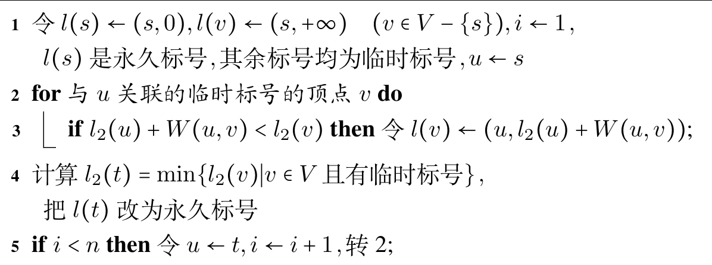
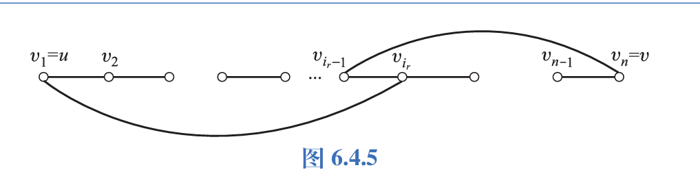
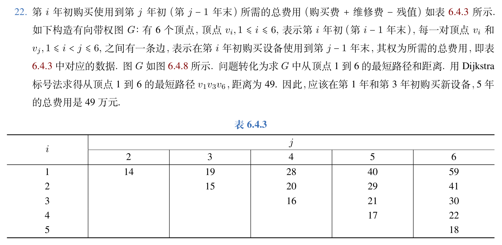

本章主要整理欧拉图、哈密顿图和最短路问题。几个判定条件看起来相似，实际使用时需要分清前提。

## 欧拉图和哈密顿图

通过图中每条边一次且仅一次并且过每一顶点的通路称作欧拉通路，通过图中每条边一次且仅一次并且过每一顶点的回路称作欧拉回路，具有欧拉通路的图称为半欧拉图，具有欧拉回路的图称为欧拉图.

平凡图也算欧拉图。

定理：无向图是欧拉图 $\Leftrightarrow$ 它是连通图且无奇度顶点.

定理：无向图是半欧拉图 $\Leftrightarrow$ 它是连通图且恰有两个奇度顶点.

定理：有向图是欧拉图 $\Leftrightarrow$ 它是强连通的且每个顶点的入度等于出度.

定理：有向图是半欧拉图 $\Leftrightarrow$ 它是单向连通的且恰有两个奇度顶点，其中一个顶点入度比出度大一，另一个顶点出度比入度大一。

定理：$G$ 是非平凡的欧拉图 $\Leftrightarrow$ $G$ 是连通的且是若干个边不重的圈的并.

非平凡欧拉图 $G$ 还满足 $\lambda(G) \ge 2.$

求欧拉回路的算法：弗勒里算法

其内容为：任取 $G$ 中一个点，延展与结尾点 $v_i$ 相关联的边 $e_{i+1}$ ，要求除非无别的边可选.否则 $e_{i+1}$ 不能为 $G-\{e_1,e_2,\ldots,e_i\}$ 中的桥。

## 哈密顿图

经过图中每个顶点一次且仅一次的通路称作哈密顿通路，经过图中每个顶点一次且仅一次的回路称作哈密顿回路，具有哈密顿通路的图称作半哈密顿图，具有哈密顿回路的图称作哈密顿图.

平凡图也算哈密顿图。

哈密顿图尚未研究出充要条件，下面这些判断大多只是充分条件或者必要条件。

定理：给定无向图 $G=\langle V,E \rangle$ 为哈密顿图，则对于 $\forall V_1 \subset V,V_1 \not = V$ 均有 $p(G-V_1) \le |V_1|.$

推论：给定无向图 $G=\langle V,E \rangle$ 为半哈密顿图，则对于 $\forall V_1 \subset V,V_1 \not = V$ 均有 $p(G-V_1) \le |V_1|+1.$

二部图与哈密顿图的关系：

给定完全二部图 $G=\langle V_1,V_2,E \rangle,|V_1| \le |V_2|,|V_1| \ge 2,|V_2| \ge 2.$ 有以下结论：

- (a) 若 $G$ 是哈密顿图，则 $|V_2|=|V_1|.$
- (b) 若 $G$ 是半哈密顿图，则 $|V_2|=|V_1|+1$ 或 $|V_2|=|V_1|$。
- (c) 若 $|V_2| \ge |V_1|+2,$ 则 $G$ 不是哈密顿图，也不是半哈密顿图。

定理：设 $G$ 是 $n$ 阶无向简单图，若对于 $G$ 中任意不相邻顶点 $u,v,$ 均有 $d(u)+d(v) \ge n-1,$ 则 $G$ 中存在哈密顿通路.

推论：设 $G$ 是 $n$ 阶无向简单图，若对于 $G$ 中任意不相邻顶点 $u,v,$ 均有 $d(u)+d(v) \ge n,$ 则 $G$ 中存在哈密顿回路.

注：上面两个仅是充分条件，不满足也可能存在哈密顿回路/通路。

定理：设 $u,v$ 为 $n$ 阶无向简单图 $G$ 中两个不相邻的顶点，且 $d(u)+d(v) \ge n,$ 则 $G$ 为哈密顿图 $\Leftrightarrow$ $G \cup (u,v)$ 为哈密顿图

定理：$n$ 阶竞赛图 $n \ge 2$ 中都有哈密顿通路.

实际做题时，可以先用这些条件排除哈密顿通路/回路的存在，再尝试直接找通路/回路，最后才考虑用条件确认其存在。

正十二面体是哈密顿图。

## 最短路问题

$G=\langle V,E,W \rangle.$ 指的是一个带权图， $W(e)$ 指的是边 $e$ 的权.

通路 $P$ 的所有权之和称作 $P$ 的长度，记作 $W(P).$ 回路 $C$ 的长度记作 $W(C).$

最短路径、距离的概念(不可达为 $+\infty$ ).

最短路问题：使用Dijkstra算法(边权非负)

操作过程和算法竞赛中的 Dijkstra 写法基本一致。下面保留一份完整计算过程。

中国邮递员问题：本质上就是给定一个带权无向图，每条边的权为非负实数，求每一条边至少经过一次的最短回路。

操作：找出全部的奇度顶点，两两配对找出重复路径最小值，然后答案为全部路径之和加上重复路径之和。

货郎担问题：给定 $G=\langle V,E,W \rangle$ 为 $n$ 阶完全带权图，各边权非负且可以为 $+\infty$。求 $G$ 中一条最短的哈密顿回路。

这个问题至今还没有有效算法，所以我们只能枚举.

下面整理一些容易漏前提的题目。

1. 给定一个非欧拉图 $G,$ 问加几条边才能使其变为欧拉图?

解：加一条边消去 $2$ 个奇度顶点，因此一共需要加 $\frac{n}{2}$ 条边， $n$ 为奇度顶点的数量。

2. 某次国际会议有 $8$ 人参加，已知每人至少会与其余 $7$ 人中的 $4$ 人说相同的语言，问服务员是否能将他们安排在同一张圆桌就坐，使得每个人都能与两边的人交谈。

把人看成顶点，两人能交谈就在它们之间连边。圆桌安排对应哈密顿回路。由题意知对任意顶点 $v$ 都有 $d(v)\geq 4$，满足哈密顿回路的充分条件，因此可以完成这样的圆桌安排。

3. 在 $k$ 个长度大于等于3的，彼此分离的圈(都为无向的或者都为有向的)之间至少加多少条新边，才能使所得的图为欧拉图?

答案：$k$ 条边。

4. 设 $G$ 是恰含 $2k$ 个奇度顶点的无向连通图，证明：$G$ 的所有边可以划分为 $k$ 条边不重的简单通路 $\Gamma_1,\Gamma_2,\ldots,\Gamma_k$，使得

$$
E(G)=\bigcup_{i=1}^{k}E(\Gamma_i).
$$

用归纳法证明。当 $k=1$ 时，$G$ 中存在欧拉通路，结论成立。

假设含 $2k$ 个奇度顶点时命题成立。对含 $2k+2$ 个奇度顶点的图 $G$，任取两个奇度顶点 $u,v$，加入新边 $(u,v)$ 得到 $G'$。此时 $G'$ 有 $2k$ 个奇度顶点，由归纳假设，$G'$ 的边可以划分为 $k$ 条边不重的简单通路。不妨设新边 $(u,v)$ 位于其中一条通路中，删去这条新边后，该通路被拆成两条简单通路，于是 $G$ 的边可划分为 $k+1$ 条边不重的简单通路。

5. 完全图 $K_n$ 都是哈密顿图吗？

需要单独考虑小阶情形。当 $n=2$ 时，$K_2$ 不含哈密顿回路，不是哈密顿图；当 $n\neq 2$ 时，完全图都是哈密顿图。

6. 设 $G$ 是无向连通图，证明：若 $G$ 中有桥或者割点，则 $G$ 不是哈密顿图。

若 $G$ 中有割点，则删除这个点后，由哈密顿图的必要条件知， $G$ 不是哈密顿图。

若 $G$ 中有桥，设为 $e=(u,v),$ 若 $u,v$ 为悬挂顶点，则与无向连通图的定义矛盾。若它们至少有一个不是悬挂顶点，删除 $e$ 后至少产生 $2$ 个连通分支，与哈密顿图的必要条件矛盾，因此不是哈密顿图。

7. 证明：设 $u,v$ 为 $n$ 阶无向简单图 $G$ 中两个不相邻的顶点，且 $d(u)+d(v) \ge n,$ 则 $G$ 为哈密顿图 $\Leftrightarrow$ $G \cup (u,v)$ 为哈密顿图。

证明：必要性是显然的。

下面证明充分性。

若 $(u,v)$ 不在 $G \cup (u,v)$ 的哈密顿回路中，则命题得证。

若 $(u,v)$ 在 $G \cup (u,v)$ 的哈密顿回路中，设 $G \cup (u,v)$ 的一条哈密顿回路 $\Gamma$ 为 $uv_2v_3\ldots v_{n-1}v.$

先证：$d(u) \ge 2.$ 若 $d(u)=1,$ 则 $d(u) + d(v) \le 1+(n-2)=n-1.$ 矛盾。

于是设 $v_{i_1}v_{i_2}\ldots v_{i_m}$ 与 $u$ 相邻，下证 $v_{i_1-1},v_{i_2-1}\ldots v_{i_m-1}$ 中至少有一个与 $v$ 相邻。

若没有一个与 $v$ 相邻，则 $d(u) + d(v) \le m+1+(n-2)-m =n-1.$ 矛盾。

设 $v_{i_r-1}$ 与 $v$ 相邻，于是 $uv_2\ldots v_{i_r-1}vv_{n-1}\ldots v_{i_r}u$ 为一条哈密顿回路。

示意图如下图所示。

8. 今有 $n$ 个人，已知他们中任何二人合起来认识其余的 $n-2$ 个人。证明：$n \ge 3$ 时，这 $n$ 个人能排成一列，使得任何两个相邻的人都相互认识；当 $n \ge 4$ 时，这 $n$ 个人能排成一个圆圈，使得每个人都认识两旁的人。

把人看成顶点，互相认识就在两点之间连边。题目条件需要转化为度数条件，再调用哈密顿通路与哈密顿回路的充分条件。任取两个顶点 $u,v$，由“任何二人合起来认识其余所有人”可知，除 $u,v$ 外的每个顶点都至少与 $u,v$ 中的一个相邻。由此可以得到相应的度数和下界，进而使用哈密顿通路与回路的判定条件完成证明。

9. 设 $G$ 为 $n$ 阶无向简单图，边数

$$
m=\frac{1}{2}(n-1)(n-2)+2.
$$

证明 $G$ 是哈密顿图，并举例说明当

$$
m=\frac{1}{2}(n-1)(n-2)+1
$$

时，$G$ 不一定是哈密顿图。

用反证法。若存在不相邻顶点 $u,v$，且 $d(u)+d(v)\leq n-1$，则整张图的边数至多为其余 $n-2$ 个顶点之间的边数，加上与 $u,v$ 关联的边数，即

$$
\binom{n-2}{2}+n-1=\frac{n^2-3n+4}{2}.
$$

但题设中的边数为

$$
\frac{(n-1)(n-2)}{2}+2=\frac{n^2-3n+6}{2},
$$

矛盾。因此任意不相邻顶点 $u,v$ 都满足 $d(u)+d(v)\geq n$，由 Ore 定理可知 $G$ 是哈密顿图。边数少一时可以构造反例，因此该下界不能继续降低。

10. 某工厂使用一台设备，每年年初要决定是继续使用，还是购买新的。预计该设备第 $1$ 年的价格为 $11$ 万元，以后每年涨 $1$ 万元。使用的第 $1$ 年，第 $2$ 年，$\ldots$，第 $5$ 年的维修费分别为 $5,6,8,11,18$ 万元。使用 $1$ 年后的残值为 $4$ 万元，以后每使用 $1$ 年残值减少 $1$ 万元。试制定购买维修该设备的 $5$ 年计划，使总支出最小。

这是一个最短路建模题，年份作为状态点，购买与继续使用对应带权边。完整建模和计算过程如下。

11. 设完全二部图 $K_{r,s}$ 为哈密顿图，则？

必须有

$$
r=s\geq 2.
$$

这里的 $r=s \ge 2$ 不能漏掉下界。

12. 命题“强连通的有向图都是哈密顿图”是否为真？

不为真。强连通只保证任意两点之间存在有向通路，并不保证存在经过每个顶点恰好一次的有向回路。

13. 设 $G$ 为无向连通图，$C$ 为 $G$ 中一条初级回路。若从 $C$ 上删除任意一条边后，$C$ 上剩下的边构成的路径都是 $G$ 中最长的路径，证明 $C$ 为 $G$ 中的哈密顿回路。

只需证明所有顶点都在 $C$ 上。若存在顶点 $u$ 不在 $C$ 上，由 $G$ 的连通性，可以找到一条从 $u$ 到 $C$ 上某个顶点 $v$ 的路径。设 $C$ 上与 $v$ 相邻的一个顶点为 $w$，则删除边 $(w,v)$ 后得到的路径可以与从 $u$ 到 $v$ 的路径拼接，从而得到一条更长路径，矛盾。因此 $C$ 经过所有顶点，是哈密顿回路。
