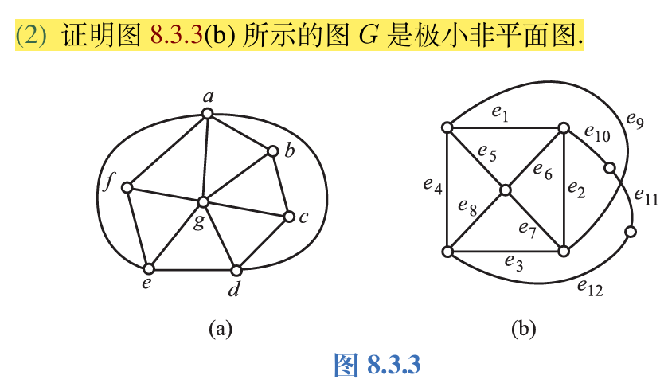

本章整理平面图、欧拉公式、平面性判定和对偶图。核心是把边数、面数和次数之间的关系用熟。

## 平面图的基本概念

若能将无向图 $G$ 画在平面上使得除顶点外无边相交，则称 $G$ 为可平面图，简称平面图，画出的无边相交的图称作 $G$ 的平面嵌入。无平面嵌入的图称作非平面图。

一个平面图可以画出多个平面嵌入，但是它们都彼此同构。

常见的平面图：$K_1,K_2,K_3,K_4,K_5-e,k_{1,n},k_{2,n},$ 常见的非平面图：$K_{3,3},K_5$。

定理：平面图的子图都是平面图，非平面图的母图都是非平面图。

定理：设 $G$ 是平面图，则在 $G$ 中加平行边或环后得到的图还是平面图。

给定平面图 $G$ 的平面嵌入，它的边将平面划分为若干个区域，每个区域都称作 $G$ 的一个面，其中有一个面的面积无限，称作无限面或者外部面，其余面的面积有限，称作有限面或者内部面。包围每个面的所有边组成的回路称作该面的边界，边界的长度称作该面的次数。

这里的回路可能是圈、简单回路，也可能是复杂回路。

平面图的握手定理：平面图所有面的次数之和等于边数的两倍。

在两个面的公共边界上的边算次数时，算1次；只在某一个面的边界上出现的边(即桥)算次数时，算2次。

设 $G$ 为简单平面图，若 $G$ 为 $K_i(1 \le i \le 4)$，或者在 $G$ 的任意两个不相邻的顶点之间加一条边，所得图均为非平面图，则称其为极大平面图。若在非平面图 $G$ 中任意删除一条边，所得的图为平面图，则称 $G$ 为极小非平面图。

$K_5-e$ 为极大平面图， $K_5$ 和 $K_{3,3}$ 都是极小非平面图。

定理：极大平面图是连通的，并且当阶数大于等于3时没有割点和桥。

定理：设 $G$ 是 $n$ 阶简单连通的平面图，则 $G$ 为极大平面图当且仅当其每个面次数均为 $3$。

## 欧拉公式

设连通平面图 $G$ 的顶点数，边数和面数分别为 $n,m,r$ ，设 $G$ 每个面的次数至少为 $l(l \ge 3),$ 则有以下定理：

(1) 欧拉公式：$n-m+r=2$。

- (2) $m \le \frac{l}{l-2}(n-2)$

推论为下面定理：

对于有 $k$ 个连通分支的平面图 $G$ ，设 $G$ 每个面的次数至少为 $l(l \ge 3),$ 则有以下定理：
- (1) 欧拉公式：$n-m+r=k+1$。
- (2) $m \le \frac{l}{l-2}(n-k-1)$。

于是，可以推出 $K_5$ 和 $K_{3,3}$ 都是非平面图。

下面，我们考虑极大平面图与欧拉公式的关系：

定理：设 $G$ 是 $n(n \ge 3)$ 阶 $m$ 条边的极大平面图，则 $m=3n-6$。

推论：设 $G$ 是 $n(n \ge 3)$ 阶 $m$ 条边的简单平面图，则 $m \le 3n-6$。

定理：设 $G$ 是简单平面图，则 $G$ 的最小度 $\delta \le 5$。

## 平面图的判断

设 $e=(u,v)$ 为图 $G$ 的一条边，在 $G$ 中删除 $e$ ，增加新的顶点 $w$ ，使 $u,v$ 均与 $w$ 相邻，称作在 $G$ 中插入2度顶点 $u$，设 $w$ 为 $G$ 中的一个2度顶点， $w$ 与 $u,v$ 相邻，删除 $w$ ，添加新边 $(u,v),$ 称作在 $G$ 中消去2度顶点 $w$。若两个图同构，或通过反复插入、消去2度顶点后同构，则称它们同胚。

库拉托夫斯基($\mathrm{Kuratowski}$ )定理：

- (1) 图 $G$ 是平面图当且仅当 $G$ 中既不含与 $K_5$ 同胚的子图，也不含与 $K_{3,3}$ 同胚的子图。
- (2) 图 $G$ 是平面图当且仅当 $G$ 中既没有可以收缩到 $K_5$ 的子图，也没有可以收缩到 $K_{3,3}$ 的子图。

判断非平面图时，还常用到"平面图的子图都是平面图，非平面图的母图都是非平面图"这个结论。

完全图的任意一条边都是同构的。

库拉托夫斯基定理只对 $K_5$ 和 $K_{3,3}$ 有效。

## 平面图的对偶图

设 $G$ 是一个平面图的平面嵌入，构造图 $G^*$ 如下：在 $G$ 的每一个面 $R_i$ 中放置一个顶点 $v_i^*$。 设 $e$ 为 $G$ 的一条边，若 $e$ 在 $G$ 的面 $R_i$ 和 $R_j$ 的公共边界上，则作边 $e^*=(v_i^*,v_j^*)$ 与 $e$ 相交，且不与其他任何边相交。若 $e$ 为 $G$ 中的桥且在面 $R_i$ 的边界上，则作以 $v_i^*$ 为端点的环 $(v_i^*,v_i^*)$。 称 $G^*$ 为 $G$ 的对偶图。

我们会发现，对偶图 $G^*$ 有以下性质：

- (1) $G^*$ 是平面图，而且是平面嵌入。
- (2) $G^*$ 是连通图。
- (3) 若 $e$ 为 $G$ 中的环，则 $G^*$ 与 $e$ 对应的边为桥；若 $e$ 为桥，则 $G^*$ 中与 $e$ 对应的边为环。
- (4) 在多数情况下， $G^*$ 为多重图(含平行边的图)。
- (5) 同一个平面图的不同平面嵌入的对偶图不一定同构

同时，还有以下定理：

设平面图 $G$ 是连通的， $G^*$ 是 $G$ 的对偶图， $n^*,m^*,r^*$ 和 $n,m,r$ 分别为 $G^*$ 和 $G$ 的顶点数、边数和面数，则有以下定理：
- (1) $n^*=r$
- (2) $m^*=m$
- (3) $r^*=n$
- (4) 设 $G^*$ 的顶点 $v_i^*$ 位于 $G$ 的面 $R_i$ 中，则 $d_{G^*}(v_i^*)=\mathrm{deg}(R_i)$。

推广到非连通图，则有以下定理：

设平面图 $G$ 有 $k$ 个连通分支， $G^*$ 是 $G$ 的对偶图， $n^*,m^*,r^*$ 和 $n,m,r$ 分别为 $G^*$ 和 $G$ 的顶点数、边数和面数，则有以下定理：
- (1) $n^*=r$
- (2) $m^*=m$
- (3) $r^*=n-k+1$
- (4) 设 $G^*$ 的顶点 $v_i^*$ 位于 $G$ 的面 $R_i$ 中，则 $d_{G^*}(v_i^*)=\mathrm{deg}(R_i)$。
对偶图是连通图。
画对偶图时，每条边都要穿过对应的边，包括环。
对偶图满足的是 $n^*-m^*+r^*=2$。

若 $G$ 存在一个平面嵌入，使得 $G$ 同构于对偶图 $G^*,$ 那么称 $G$ 为自对偶图。

设 $n \ge 4$，在正 $n-1$ 边形中放置一个顶点，连接它与这个正多边形上的所有顶点，得到的 $n$ 阶简单图称为 $n$ 阶轮图。$n$ 为奇数的轮图称为奇阶轮图，反之称为偶阶轮图。轮图都是自对偶图。

下面整理一些平面图题目中常见的切入点。

1. 重新画某个图的平面嵌入，使得其外部面的边数满足指定条件。

任意一个面都可以被选作外部面，所以通常可以把目标面“翻到外面”，再重新整理其余部分的嵌入。

2. 判断一个图是否为极小非平面图。

这类题有两种常见做法：一种是从定义出发，证明原图非平面，同时删除每一条边后都为平面图；另一种是利用 Kuratowski 定理寻找同胚或可收缩到 $K_5,K_{3,3}$ 的结构。

3. 证明：不存在具有 $5$ 个面且每两个面的边界都恰好共享一条公共边的平面图。

用对偶图处理更自然。若这样的平面图存在，则它的对偶图有 $5$ 个顶点，并且任意两个顶点之间都有边相连，因此对偶图为 $K_5$。但对偶图仍应是平面图，而 $K_5$ 非平面，矛盾。

4. 证明：极大平面图是连通的，并且当阶数大于或等于 $3$ 时没有割点和桥。

假设该极大平面图是非连通的，那么在两个连通分支间加上一条边，得到的仍是平面图，与极大平面图的定义矛盾。
假设 $G$ 中存在割点 $v_0$ ，割点的度数必然大于等于 $2$，不妨设 $v_1,v_2$ 与 $v_0$ 关联，删去 $v_0$ 后， $v_1,v_2$ 位于两个连通分支中，画出每个分支的平面嵌入，并使它们相互分离，得到 $G - v_0$ 的一个平面嵌入，再将 $v_0$ 与它关联的边放入这个平面嵌入中，得到 $G$ 的一个平面嵌入。可以添加 $(v_1,v_2),$ 使其不与 $G$ 的边相交，即 $G \cup (v_1,v_2)$ 仍为平面图，则与极大平面图的定义矛盾。

假设 $G$ 中存在桥 $e=(u,v),$ 由于 $G$ 为极大非平面图，又 $n \ge 3,$ 因此 $u,v$ 中必有一个度数大于等于 $2,$ 设 $d(u) \ge 2,$ 则 $u$ 为割点，前面已经证明没有割点，因此矛盾。

割点的度数必然大于等于 $2$。如果 $n \ge 3,$ 桥的两个端点中必然有一个度数 $\ge 2,$ 并且它是割点。

5. 由于平行边和环不改变平面性，因此如果给的图是非平面图，然后加一条平行边，问是否是极小非平面图，那么一定不是。

6. 本章中的题目大多数与点数、度数、面数等有关系。

7. 设 $G$ 是简单平面图，面数 $r<12,\delta(G) \ge 3$。 证明：$G$ 中存在次数小于或等于 $4$ 的面。

证明：假设 $G$ 中不存在次数小于或等于 $4$ 的面，由欧拉定理得到 $n-m+r=2,$ 又由于 $\delta(G) \ge 3,$ 得到 $2m \ge 3n=3(m-r+2)$。 由于 $G$ 中每个面的次数大于等于 $5,$ 得到 $2m \ge 5r$。 于是解这两个方程得到 $r \ge 12,$ 矛盾。

8. 画出全部非同构的 $6$ 阶连通简单非平面图。

可以从两个基本非平面图出发：一类是在 $K_{3,3}$ 上加边，另一类是在 $K_5$ 上增加一个顶点并连接若干边。整理时需要注意，两条路线得到的图可能有同构重复。

9. 设 $n$ 阶 $m$ 条边的连通平面图是自对偶图，则 $m=2n-2$。

自对偶意味着 $n=r$。由欧拉公式

$$
n-m+r=2
$$

可得 $2n-m=2$，即 $m=2n-2$。

10. 设 $G$ 是 $n$ 阶极大平面图， $n \ge 4,$ 证明 $G$ 的对偶图 $G^*$ 是 $2$ 边 $-$ 连通的 $3-$ 正则图。

由于 $G$ 是极大平面图，它的每个面次数都等于 $3$，因此 $G^*$ 的每个顶点度数都为 $3$。又因为 $G$ 无环无桥，所以 $G^*$ 中没有桥。再由 $n\geq 4$ 可知，$G$ 的两个面最多共享一条边，因此 $G^*$ 不含平行边，是简单图。综上，$G^*$ 是 $2$ 边连通的 $3$-正则图。

11. 证明：平面图 $G$ 的对偶图是欧拉图当且仅当 $G$ 中每个面的次数都是偶数。

充分性：若 $G$ 中每个面的次数都是偶数，则 $G^*$ 中每个顶点的度数都是偶数。又 $G^*$ 连通，所以 $G^*$ 是欧拉图。

必要性：若 $G^*$ 是欧拉图，则 $G^*$ 中每个顶点的度数都是偶数。对偶图中顶点度数对应原图中面的次数，因此 $G$ 中每个面的次数都是偶数。

12. 设 $G^*$ 为 $G$ 的对偶图， $G^{}$ 是 $G^*$ 的对偶图，当 $G$ 不连通的时候， $G^{}$ 与 $G$ 一定不同构。

13. 命题“设 $G$ 是任意 $n$ 阶 $m$ 条边的极大平面图，则 $m=3n-6$”的真值为？

该命题为假，结论需要条件 $n\geq 3$。
