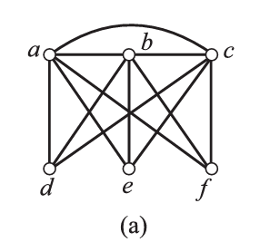

本章记录支配集、覆盖集、独立集、匹配和着色。概念比较密，主要保留定义、常用等式和几个例题。

## 支配集、点独立集与点覆盖集

设无向简单图 $G=\langle V,E \rangle,V^* \subseteq V,$ 若 $\forall v_i \in V-V^*,\exists v_j \in V^*$ 使得 $(v_i,v_j) \in E,$ 则称 $V^*$ 为 $G$ 的一个支配集，并称 $v_j$ 支配 $v_i.$ 设 $V^*$ 是 $G$ 的支配集，且 $V^*$ 的任何真子集都不是支配集，则称 $V^*$ 为极小支配集. $G$ 的顶点最少的支配集称为最小支配集，最小支配集中顶点的个数称作 $G$ 的支配数，记作 $\gamma_0(G),$ 简记为 $\gamma_0.$

设无向简单图 $G=\langle V,E \rangle,V^* \subseteq V,$ 若 $V^*$ 中任何两个顶点都不相邻，则称 $V^*$ 为 $G$ 的点独立集，简称为独立集。若 $V^*$ 中再加入任何其他的顶点都不是独立集，则称 $V^*$ 为极大点独立集; $G$ 中顶点数最多的点独立集称作 $G$ 的最大点独立集，最大点独立集的顶点数称作 $G$ 的点独立数，记为 $\beta_0(G),$ 简记为 $\beta_0.$

设无向简单图 $G=\langle V,E \rangle,V^* \subseteq V,$ 若 $\forall e \in E, \exists v \in V^*,$ 使得 $v$ 与 $e$ 相关联，则称 $V^*$ 为 $G$ 的点覆盖集，简称为点覆盖，并称 $v$覆盖 $e.$ 设 $V^*$ 是 $G$ 的点覆盖，若 $V^*$ 的任何真子集都不是点覆盖，则称 $V^*$ 为极小点覆盖。 $G$ 的顶点个数最少的点覆盖称为 $G$ 的最小点覆盖，最小点覆盖中的顶点个数称作 $G$ 的点覆盖数，记作 $\alpha_0(G)$ ，简记为 $\alpha_0.$

上面三个定义的区别：支配是与其他顶点都相邻，点独立是自己不相邻，覆盖是&点覆盖边.

相关定理：

- (1) 设无向简单图 $G=\langle V,E \rangle$没有孤立点，则 $G$ 的极大点独立集都是极小支配集。

这个命题的逆命题不成立，极小支配集不一定是极大点独立集。
- (2) 设无向简单图 $G=\langle V,E \rangle$没有独立点， $V^* \subseteq V,$ 则 $V^*$ 为 $G$ 的点覆盖当且仅当 $\overline{V^*}=V-V^*$ 是 $G$ 的点独立集。
- (3) 设无向简单图 $G=\langle V,E \rangle$ 是无孤立点的 $n$ 阶无向图， $V^* \subseteq V,$ 则 $V^*$ 是 $G$ 的极小(最小)点覆盖当且仅当 $\overline{V^*}=V-V^*$ 是 $G$ 的极大(最大)点独立集，从而有 $\alpha_0+\beta_0=n.$

## 边覆盖集与匹配

设无向简单图 $G=\langle V,E \rangle,E^* \subseteq E,$ 若 $\forall v \in V,\exists e \in E^*,$ 使得 $v$ 与 $e$ 相关联，则称 $E^*$ 为边覆盖集，简称为边覆盖，并称 $e$覆盖 $v.$ 设 $E^*$ 为 $G$ 的边覆盖，若 $E^*$ 的任何真子集都不是边覆盖，则称 $E^*$ 为极小边覆盖. $G$ 的边数最少的边覆盖称为 $G$ 的最小边覆盖，最小边覆盖中的边数称作 $G$ 的边覆盖数，记作 $\alpha_1(G),$ 简记为 $\alpha_1.$

当图有孤立点时不存在边覆盖。

设无向简单图 $G=\langle V,E \rangle,E^* \subseteq E,$ 若 $E^*$ 中任何两条边均不相邻，则称 $E^*$ 为 $G$ 的边独立集，也称作 $G$ 的匹配。若在 $E^*$ 中再加任意一条边后，所得集合都不是匹配，则称 $E^*$ 是极大匹配. $G$ 的边数最多的匹配称作最大匹配，最大匹配中的边数称作边独立数或匹配数，记作 $\beta_1(G),$ 简记为 $\beta_1.$

匹配和边覆盖的定义可以参照点独立和点覆盖来记忆。

设 $M$ 为 $G=\langle V,E \rangle$ 的一个匹配：

- (1) 称 $M$ 中的边为匹配边，不在其中的边为非匹配边.
- (2) 称与匹配边相关联的顶点为饱和点，不与匹配边相关联的顶点为非饱和点.
- (3) 若 $G$ 中每个顶点都是饱和点，则称 $M$ 为 $G$ 的完美匹配.
- (4) $G$ 中由匹配边和非匹配边的交替构成的路径称作交错路径，起点和终点不同，且都是非饱和点的交错路径称作可增广的交错路径, $G$ 中由匹配边和非匹配边交替构成的圈称作交错圈.

最大匹配不一定是完美匹配。

可增广的交错路径中，"可增广"的含义为：将匹配边变成非匹配边，非匹配边变成匹配边，得到的交错路径中匹配边数量比原来大1。

完美匹配的必要条件是阶数为偶数。

求最大匹配时，先找出一个极大匹配，然后找到一条可增广的交错路径，接着反转并验证。

下面给出一些定理：

设图 $G$ 无孤立点：

- (1) 设 $M$ 为 $G$ 的一个最大匹配，对 $G$ 中每一个非饱和点取一条与之关联的边，组成边集 $N$ ，则 $W=M \cup N$ 为 $G$ 的最小边覆盖.
- (2) 设 $W_1$ 为 $G$ 的一个最小边覆盖，若 $W_1$ 中存在相邻的边就删去其中的一条，设移去的边集为 $N_1,$ 则 $M_1=W_1-N_1$ 为 $G$ 的最大匹配.
- (3) $G$ 的边覆盖数 $\alpha_1$ 与匹配数 $\beta_1,$ 满足 $\alpha_1+\beta_1=n.$
- (4) 设 $M$ 是 $G$ 的一个匹配， $W$ 是 $G$ 的一个边覆盖，则 $|M| \le |W|,$ 且当等号成立时， $M$ 是 $G$ 的完美匹配， $W$ 是 $G$ 的最小边覆盖。

不饱和点的数量永远为 $n-2\beta_1,$ 同时总有 $\beta_1 \le \alpha_1.$

定理：设 $M$ 为图 $G$ 的一个匹配，则 $M$ 为 $G$ 的最大匹配当且仅当 $G$ 中不含关于 $M$ 的可增广的交错路径。

## 二部图中的匹配

设 $G=\langle V_1,V_2,E \rangle$ 为二部图， $|V_1| \le |V_2|,$ 若 $M$ 为 $G$ 的一个匹配且 $|M|=|V_1|,$ 则称 $M$ 为从 $V_1$ 到 $V_2$ 的完备匹配.

二部图的完备匹配是最大匹配，但最大匹配不一定是完备匹配。当 $|V_1|=|V_2|$ 时，完备匹配是完美匹配。

给出二部图有完备匹配的充要条件，也称作相异性条件：

霍尔($\mathrm{Hall}$ )定理：设二部图 $G=\langle V_1,V_2,E \rangle,$ 其中 $|V_1| \le |V_2|,$ 则 $G$ 中存在从 $V_1$ 到 $V_2$ 的完备匹配当且仅当 $V_1$ 中任何 $k,1 \le k \le |V_1|,$ 个顶点至少与 $V_2$ 中的 $k$ 个顶点相邻。

给出二部图有完美匹配的充分条件，也称作 $t$ 条件：

设二部图 $G=\langle V_1,V_2,E \rangle,$ 如果存在正整数 $t$ ，使得 $V_1$ 中每个顶点至少关联 $t$ 条边，而 $V_2$ 中每个顶点至多关联 $t$ 条边，那么 $G$ 中存在从 $V_1$ 到 $V_2$ 的完备匹配。

二分图最大匹配以及带权二分图的最大权匹配，详见算法书与 Leetcode。

## 着色

本节主要研究无环的无向图。

设无向图 $G$ 无环，对 $G$ 的每个顶点涂一种颜色，使相邻的顶点涂不同的颜色，称作图 $G$ 的一种点着色，简称为着色。若能用 $k$ 种颜色给 $G$ 的顶点着色，则称 $G$ 为 $k-$可着色的，若 $G$ 是 $k-$ 可着色的，但不是 $(k-1)-$ 可着色的，则称 $G$ 的色数为 $k$ ，图 $G$ 的色数记作 $\chi(G),$ 简记为 $\chi.$

一些关于 $\chi$ 的性质和定理：

- (1) $\chi(G)=1$ 当且仅当 $G$ 是零图.
- (2) $\chi(K_n)=n.$
- (3) 偶圈的色数为2,奇圈为3,奇阶轮图的色数为 $3,$偶阶轮图的色数为 $4.$
- (4) 设 $G$ 至少含一条边，则 $\chi(G)=2$ 当且仅当 $G$ 为二部图.
- (5) 对于任意无环图 $G,$ 均有 $\chi(G) \le \Delta(G)+1.$

这个上界当且仅当 $G$ 是 $K_n,n \le 3$ 或奇圈时达到。

- (6) 布鲁克斯定理：设 $n \ge 3,$ 若连通图 $G$不是完全图 $K_n$ ，也不含奇圈，则 $\chi(G) \le \Delta(G).$

求图的色数的方法：先判断它们是不是特殊图，再考虑布鲁克斯定理，最后考虑推导。

我们接下来给出下面的定义：
连接无桥平面图的平面嵌入及其所有的面称作地图，地图的面称作国家，若两个国家的边界至少有一条公共边，则称这两个国家相邻.
对地图 $G$ 上的每个国家涂上一种颜色，使相邻的国家涂不同的颜色，称作对地图 $G$ 的面着色。若能够用 $k$ 种颜色给 $G$ 的面着色，则称 $G$ 为 $k-$可面着色的。若 $G$ 为 $k-$ 可面着色的，但不是 $(k-1)-$ 可面着色的，则称 $G$ 的面色数为 $k$。 $G$ 的面色数记作 $\chi^*(G),$ 简记为 $\chi^*.$
对图 $G$ 的每条边着一种颜色，使相邻的边着不同的颜色，称作对 $G$ 的边着色。若能用 $k$ 种颜色给 $G$ 的边着色，则称 $G$ 为 $k-$可边着色的。若 $G$ 为 $k-$ 可边着色的，但不是 $(k-1)-$ 可边着色的，则称 $G$ 的边色数为 $k$。 $G$ 的边色数记作 $\chi'(G),$ 简记为 $\chi'.$
上面讨论的图都是无环无向图。
地图是无桥的平面图，因此它的对偶图无圈。
下面给出一些定理：
- (1) 地图 $G$ 是 $k-$ 可面着色的当且仅当它的对偶图 $G^*$ 是 $k-$ 可着色的。
- (2) 任何平面图都是4-可着色的。
- (3) 维津($\mathrm{Vizing}$ )定理：设 $G$ 为简单图，则 $\Delta(G) \le \chi'(G) \le \Delta(G)+1.$
- (4) 二部图的边色数等于 $\Delta.$
还有几个结论：
- (1) 长度大于或等于 $2$ 的偶圈的边色数等于 $2,$ 长度大于或等于 $3$ 的奇圈的边色数等于 $3.$
- (2) $n \ge 4,\chi'(W_n)=n-1.$
- (3) 当 $n(n \not = 1)$ 为奇数时， $\chi'(K_n)=n,$ 而当 $n$ 为偶数时， $\chi'(K_n)=n-1.$

下面整理一些容易漏条件的题目。

1.
- (1) 命题"若 $V^*$ 为无向图 $G$ 的最大点独立集，则 $V^*$ 也是 $G$ 的最小支配集"为真吗？为什么？ 答案：不一定，逆命题才是必然。
- (2) 图的极小支配集不一定是点独立集。
- (3) 图的极小支配集不一定是最小支配集。
- (4) 图的极大点独立集不一定是最大点独立集。
- (5) 图的极大匹配不一定是最大匹配。

2. 求二部图中边不重的完备匹配。

- (1) $K_{2,3}$ 中有多少个边不重的完备匹配? 答案：$3$ 个。
- (2) $K_{3,3}$ 中有多少个边不重的完美匹配? 答案：$3$ 个。

3. 设二部图 $G=\langle V_1,V_2,E \rangle,|V_1| \le |V_2|,M$ 为 $G$ 的一个匹配， $\Gamma$ 为一条 $M$ 可增广的交错路径， $M$ 能是 $G$ 中 $V_1$ 到 $V_2$ 的完备匹配吗？为什么？

解：由于存在可增广的交错路径，因此它不为最大匹配，更不可能是完备匹配。

4. 求如图所示的无向图的点色数 $\chi$ 和边色数 $\chi'.$

本题给我们一个启示：如果看到有圈或者完全图，要先考虑圈或者完全图。

5. 设 $G$ 是 $3-$ 正则的哈密顿图，证明：$G$ 的边色数 $\chi'=3.$

思路：这种题我们通常采用正反证明的方法来证，结合一下度数等知识。

证明：由于 $G$ 为 $3-$ 正则图，即 $\Delta(G)=3,$ 因此 $\chi' \ge 3.$ 下面证明：$\chi' \le 3.$

由于 $G$ 为 $3-$ 正则图，由握手定理知 $2m=3n,$ 于是 $n$ 为偶数.设 $C$ 是 $G$ 中的一条哈密顿回路，则 $C$ 为 $n$ 阶偶圈，因此可用两种颜色给其上色。 $G$ 不在 $C$ 上的边彼此不相邻，可用另外一种颜色给它们着色，因此 $\chi'=3.$

6. 证明：对于 $n \ge 3,$ 在完全图 $K_n$ 中， $\beta_1<\alpha_0,\beta_0<\alpha_1.$
思路：这种题通常对于特殊的图可以直接求出来相关数的。
证明：$n \ge 3,\beta_1=\lfloor \frac{n}{2} \rfloor,\alpha_1=\lfloor \frac{n+1}{2} \rfloor,\beta_0=1,\alpha_0=n-1.$ 于是可证。

7. 证明：在完全二部图 $K_{r,s}$ 中， $\beta_1=\alpha_0,\beta_0=\alpha_1.$
证明：$\beta_1=\alpha_0=\mathrm{min}(r,s),\beta_0=\alpha_1=\mathrm{max}(r,s)$

8. 证明：对于任意的无向简单图 $G,$ 均有 $\alpha_0 \ge \delta.$
证明：设 $V_1$ 为 $G$ 的一个最小点覆盖集，则 $V_2=G-V_1$ 为一个最大点独立集.由于 $V_2$ 中顶点互不相邻，因此 $\forall v \in V_2,$ 与 $v$ 相邻的顶点均在 $V_1$ 中，所以 $V_1$ 中至少有 $\delta$ 个顶点。

9. 证明：在 $8 \times 8$ 的国际象棋棋盘的一条主对角线上移去两端的方格后，所得棋盘不能用 $1 \times 2$ 的长方形不重叠地填满。
思路：转化为二部图的完美匹配.

10. 设二部图 $G=\langle V_1,V_2,E \rangle$ 为 $k-$ 正则图，证明：$G$ 中存在完美匹配，其中 $k \ge 1.$
思路：我们必须考虑其中的性质。
证明：由于二部图为 $k-$ 正则图，因此 $|V_1|=|V_2|.$ 又由于它满足 $k$ 条件，因此存在完备匹配，而完备匹配就是完美匹配。

11. 设 $T$ 是非平凡的无向树，证明：$\chi(T)=2.$
思路：书上的性质是 $\chi(G)=2$ 当且仅当 $G$ 为非平凡的二部图，而非平凡无向树就是二部图。

12. 设 $G$ 为 $n$ 阶 $k-$ 正则图，证明：$\chi(G) \ge \frac{n}{n-k}.$
证明：设 $v$ 为 $G$ 中任意一个顶点， $d(v)=k.$ 因此至多可以有 $n-k$ 个顶点和 $v$ 涂相同的颜色，于是至少需要 $\left\lceil \frac{n}{n-k} \right\rceil$ 种颜色。

13. 证明：任何无环平面图都是 $6-$ 可着色的。
证明：当 $n \le 6$ 时是显然的，设当 $n=k>6$ 时成立，则 $n=k+1$ 时，由于平面图的性质知 $\delta \le 5.$ 找到度数最小的顶点 $v,$ 由归纳假设得 $G-v$ 可 $6-$ 着色，又由于 $v$ 至多与 $5$ 个顶点相邻，因此仍然可涂色。

14. 证明：彼得松图的边色数 $\chi'=4.$
证明的关键是先由 $\Delta=3$ 得到 $\chi'\geq 3$，再说明彼得松图不可能 $3$-边着色；否则每一种颜色都会给出一个完美匹配，与彼得松图的奇圈结构矛盾。完整证明较长，这里只保留结论与证明入口。

15. 求彼得松图的 $\gamma_0,\beta_0,\beta_1,\alpha_0,\alpha_1.$
答案：3,4,5,6,5.

16. 含完全图 $K_n$ 作为子图的无向图 $G$ 的点色数至少为 $n.$

17. 设 $G$ 是不含 $K_3$ 的连通的简单平面图，求证：
- (1) $\delta(G) \le 3.$
- (2) $G$ 是 $4-$ 可着色的。
思路：有了之前的经验之后，我们可以发现证出第一题之后，第二题就自然出来了。
证明：$(1)$ 当 $n \le 4,$ 由已知条件知为真。
当 $n \ge 5,$ 由连通性可知 $m \ge 3,$ 又因为 $G$ 中不含 $K_3,$ 因此每个面至少由 $4$ 条边围成，于是有 $4r \ge 2m,r \ge \frac{m}{2}.$
若 $\delta(G) \ge 4,$ 则由握手定理可得 $4n \le 2m,$ 即 $n \le \frac{m}{2}.$ 再由欧拉公式可知其矛盾。
