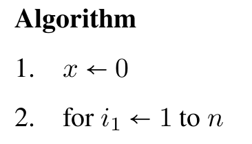
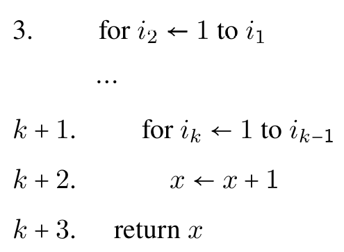

本章整理加法法则、乘法法则、排列组合、多项式定理以及常见组合恒等式。很多题的关键在于先选对计数对象。

## 加法法则和乘法法则

加法法则与乘法法则的定义

加法法则：任何两个事件不重叠。

乘法法则：任何两个事件彼此独立。

例 10.1.1 设 $A$ 是 $n$ 元集，问：

- (1) $A$ 上的自反关系有多少个？
- (2) $A$ 上的对称关系有多少个？
- (3) $A$ 上的反对称关系有多少个？
- (4) $A$ 上的函数有多少个？其中双射函数有多少个？

答案：

- (1) $2^{n^2-n}$
- (2) $2^{\frac{n^2+n}{2}}$
- (3) $2^n \cdot 3^{\frac{n^2-n}{2}}$
- (4) $n^n,n$！

## 排列与组合

排列和组合的定义：

设 $S$ 为 $n$ 元集，从 $S$ 中有序选取的 $r$ 个元素称作 $S$ 的一个 $r$ 排列。 $S$ 的不同 $r$ 排列总数记作 $P_n^r,r=n$ 时的排列称作 $S$ 的全排列。从 $S$ 中无序选取的 $r$ 个元素称作 $S$ 的 $r$ 组合。 $S$ 的不同 $r$ 组合总数记作 $C_n^r$。

排列数和组合数的公式、

$C_n^r$ 通常被称作二项式系数，有时也记作 $\dbinom{n}{r}$。

对于 $S,$ 其 $r$ 环排列数为 $\frac{P_n^r}{r}$。

组合数的性质：

- (1) $C_n^r=\frac{n}{r}C_{n-1}^{r-1}$。
- (2) $C_n^r=C_n^{n-r}$。
- (3) $C_{n}^{r}=C_{n-1}^{r-1}+C_{n-1}^{r}$。

(3) 与杨辉三角有关，也称作帕斯卡公式。

我们引入多重集的概念，多重集 $S=\lbrace{}n_1 \cdot a_1,n_2 \cdot a_2,\ldots,n_k \cdot a_k\rbrace,$ 其中 $a_1,a_2,\ldots,a_k$ 是 $k$ 种不同的元素， $n_i$ 表示 $a_i$ 在 $S$ 中出现的次数，称作 $a_i$ 的重复度。当 $n_i=+\infty$ 表示有充足的 $a_i$ 备选。多重集的子集也是多重集， $A=\lbrace{}x_1 \cdot a_1,x_2 \cdot a_2,\ldots,x_k \cdot a_k\rbrace,0 \le x_i \le n_i$。 其中 $x_i=0$ 表示 $a_i$ 不存在于 $A$ 中。

设 $S=\lbrace{}n_1 \cdot a_1,n_2 \cdot a_2,\ldots,n_k \cdot a_k\rbrace$ 为多重集， $n=n_1+n_2+\ldots +n_k$ 为 $S$ 中元素的总数。则从 $S$ 中有序选取的 $r$ 个元素称作多重集 $S$ 的一个 $r$ 排列， $r=n$ 的排列称作 $S$ 的全排列。从 $S$ 中无序选取的 $r$ 个元素称作 $S$ 的一个 $r$ 组合。

我们给出某些特殊情况的公式，一般的计数只能通过生成函数或者包含排斥原理来求解，我们在下一章介绍相关知识。

- (1) $S$ 的全排列数为 $\frac{n!}{n_1!n_2!\ldots n_k!}$。
- (2) 若 $r \le n_i,$ 则 $S$ 的 $r$ 排列数为 $k^r$。
- (3) 若 $r \le n_i,$ 则 $S$ 的 $r$ 组合数为 $C_{k+r-1}^r$。

有关(3)，我们对不定方程 $x_1+x_2+\ldots +x_k=r,x_i$ 为非负整数进行讨论，最后得出有关结论。具体证明见书。

给出两个运用一一对应方法的具体例子：

例 10.2.3 下面给出一个简单的程序，问：它的输出 $x$ 是什么？

解答：我们将其抽象为 $\lbrace+\infty \cdot 1,+\infty \cdot 2,\ldots,+\infty \cdot n\rbrace$ 的 $k$ 组合数，于是答案为 $C_{n+k-1}^k$。

例 10.2.4 从 $S=\lbrace1,2,\ldots,n\rbrace$ 中选择 $k$ 个不相邻的数，有多少种方法？

把“不相邻”转化成普通选取。设 $a_1,a_2,\ldots,a_k$ 为选出的 $k$ 个不相邻的数，并且按从小到大排列。令

$$
b_i=a_i-(i-1) \quad (i=1,2,\ldots,k)
$$

那么 $b_i$ 只需要互不相同，且来自 $\lbrace1,2,\ldots,n-k+1\rbrace$。因此答案为

$$
C_{n-k+1}^k
$$

## 二项式定理和组合恒等式

二项式定理为

$$
(x+y)^n=\sum\limits_{k=0}^n \dbinom{n}{k}x^ky^{n-k} \quad \forall n \in N^+,x,y \in R
$$

其推论为

$$
(1+x)^n=\sum\limits_{k=0}^{n} \dbinom{n}{k}x^k
$$

我们提出以下组合恒等式：

- (1) $\dbinom{n}{k}=\dbinom{n}{n-k}$。
- (2) $\dbinom{n}{k}=\dfrac{n}{k}\dbinom{n-1}{k-1}$
- (3) $\dbinom{n}{k}=\dbinom{n-1}{k-1}+\dbinom{n-1}{k}$。

然后，就是一些基于组合分析得出的等式。

- (4) $\sum\limits_{k=0}^{n}\dbinom{n}{k}=2^n$。
- (5) $\sum\limits_{k=0}^{n}(-1)^k\dbinom{n}{k}=0$。
- (6) $\sum\limits_{l=k}^n\dbinom{l}{k}=\dbinom{n+1}{k+1}$。
- (7) $\dbinom{n}{r}\dbinom{r}{k}=\dbinom{n}{k}\dbinom{n-k}{r-k},k \le r \le n,k,r,n \in N$。
- (8) $\sum\limits_{k=0}^{r}\dbinom{m}{k}\dbinom{n}{r-k}=\dbinom{n+m}{r},r \le \mathrm{min}(n,m)$。
- (9) $\sum\limits_{k=0}^{n}\dbinom{m}{k}\dbinom{n}{k}=\dbinom{m+n}{m}$。

然后，下面是两个例子：

例 10.3.1 证明以下组合恒等式：

- (1) $\sum\limits_{k=0}^{n}k\dbinom{n}{k}=n2^{n-1}$。
- (2) $\sum\limits_{k=0}^{n}k^2\dbinom{n}{k}=n(n+1)2^{n-2}$。

有关组合恒等式的证明方法，大致有以下几种：

- (1) 已知恒等式代入并化简
- (2) 使用二项式定理比较相同的系数，或者进行级数的求导和积分。
- (3) 数学归纳法
- (4) 组合分析方法

下面我们介绍一个模型，非降路径模型。

从 $(0,0)$ 到 $(m,n)$ 的非降路径共有 $\dbinom{m+n}{m}$ 条。

推论：集合 $\lbrace1,2,\ldots,n\rbrace$ 上的单调递增函数个数为 $\dbinom{2n-1}{n}$。

推广：设 $A=\lbrace1,2,\ldots,m\rbrace,B=\lbrace1,2,\ldots,n\rbrace,$ 那么从 $A$ 到 $B$ 的单调函数个数等于 $2\dbinom{m+n-1}{m}-n$。

例 10.3.3 的构造比较巧妙，适合作为组合分析法的补充例题，阅读时可以重点看它如何重新选择计数对象。

## 多项式定理

多项式定理

$$
(x_1+x_2+\ldots+x_t)^n
=\sum_{n_1+\cdots+n_t=n}\dbinom{n}{n_1\ n_2\ \ldots\ n_t}x_1^{n_1}x_2^{n_2}\ldots x_t^{n_t}
$$

其中 $n \in N^+,x_i \in R$，求和范围为所有非负整数解。这里的系数为

$$
\dbinom{n}{n_1\ n_2\ \ldots\ n_t}
$$

称作多项式系数。

推论：等式右边不同项数为不定方程 $n_1+n_2+\ldots+n_t=n$ 的非负整数解的个数，即 $\dbinom{n+t-1}{n}$。

推论：$\sum\dbinom{n}{n_1 \ n_2 \ \ldots n_t}=t^n$。

多项式系数，刚好就是对应多重集的全排列数。

通过多项式系数证明费马小定理，见书。

给出一个引理， $p$ 为质数，若 $\dbinom{p}{k_1 \ k_2 \ldots k_n} \not = 1,$ 则 $p \mid \dbinom{p}{k_1 \ k_2 \ldots k_n}$。

下面整理一些容易漏条件的题目。

1. 把 $10$ 个不同的球放到 $6$ 个不同的盒子里，允许空盒，且前两个盒子的总数至少为 $4$ ，问有多少种方法。

先枚举有 $k$ 个球放在前两个盒子里，其中 $4\leq k\leq 10$。选出这些球有 $\binom{10}{k}$ 种方法，它们分到前两个盒子有 $2^k$ 种方法，其余 $10-k$ 个球分到后四个盒子有 $4^{10-k}$ 种方法。因此总数为

$$
\sum_{k=4}^{10}\binom{10}{k}2^k4^{10-k}
$$

2. 考虑由 $m$ 个 $A$ 和 $n$ 个 $B$ 构成序列，其中 $m,n$ 为正整数， $m \le n$。 如果要求每个 $A$ 后面至少紧跟着一个 $B,$ 问有多少个不同的序列。

先把每个 $A$ 与它后面必须紧跟的一个 $B$ 打包成 $AB$，得到 $m$ 个整体。剩余 $n-m$ 个 $B$ 可以插入这 $m$ 个整体之间以及两端的空隙中，于是对应方程

$$
x_0+x_1+\ldots+x_m=n-m
$$

非负整数解数为 $\dbinom{n}{m}$。

3. 设 $S$ 是 $n$ 元集，$N$ 表示 $A \subseteq B \subseteq S$ 的有序对 $\langle A,B \rangle$ 的个数，用二项式定理证明 $N=3^n$。

按 $|B|$ 分类。若 $|B|=k$，则先选 $B$，有 $C_n^k$ 种方法；再选 $A\subseteq B$，有 $2^k$ 种方法。因此

$$
N=\sum_{k=0}^{n}C_n^k2^k=(1+2)^n=3^n
$$

4. 求和 $\sum\limits_{k=0}^{m}\dbinom{n-m+k}{k}$。

使用“曲棍球杆”恒等式

$$
\sum_{k=0}^{m}\dbinom{n-m+k}{k}=\dbinom{n+1}{m}
$$

5. 设有 $k$ 类明信片，且第 $i$ 类明信片的张数是 $a_i,i=1,2,\ldots,k$。把它们全部送给 $n$ 个朋友，问有多少种方法？

对第 $i$ 类明信片，相当于把 $a_i$ 张相同明信片分给 $n$ 个不同朋友，方法数为

$$
\dbinom{n+a_i-1}{a_i}
$$

各类明信片相互独立，由乘法原则，总方法数为

$$
\prod_{i=1}^{k}\dbinom{n+a_i-1}{a_i}
$$

6. 求和

$$
\dbinom{r+0}{0}\dbinom{m-0}{n-0}+\dbinom{r+1}{1}\dbinom{m-1}{n-1}+\ldots +\dbinom{r+n}{n}\dbinom{m-n}{n-n}
$$

思路：本题考察非降路径模型的应用。
证明：原题给出的式子为

$$
\dbinom{r+k}{k}\dbinom{m-k}{n-k}
$$

考虑 $(0,0)$ 到 $(r,k)$ 的非降路径，再考虑 $(r+1,k)$ 到 $(m-n+r+1,n)$ 的非降路径，运用乘法原则，我们知道这等于 $(0,0)$ 到 $(m-n+r+1,n)$ 的非降路径数，即 $\dbinom{m+r+1}{n}$。

7. 求和：$\sum\limits_{k=0}^{n}\dbinom{2n}{2k}$。

这里需要分类讨论。

答案：$n=0$ 时， $=1$。

$n>0$ 时， $=2^{2n-1}$。

8. 证明

$$
\sum_{k=0}^{n-1}\dbinom{n}{k}\dbinom{n}{k+1}
=\frac{(2n)!}{(n-1)!(n+1)!}
$$

利用 $\dbinom{n}{k+1}=\dbinom{n}{n-k-1}$，有

$$
\sum_{k=0}^{n-1}\dbinom{n}{k}\dbinom{n}{k+1}
=\sum_{k=0}^{n-1}\dbinom{n}{k}\dbinom{n}{n-k-1}
=\dbinom{2n}{n-1}
$$

而

$$
\dbinom{2n}{n-1}=\frac{(2n)!}{(n-1)!(n+1)!}
$$

9. 证明

$$
\sum_{k=1}^{n}(-1)^{k-1}\frac{1}{k}\dbinom{n}{k}
=1+\frac{1}{2}+\ldots+\frac{1}{n}
$$

可以使用数学归纳法。
证明：当 $n=1$ 的时候左右相等，设当 $n=r$ 的时候成立，下面证明 $n=r+1$ 时亦成立

$$
\begin{aligned}
LHS
&=\sum\limits_{k=1}^{r+1}(-1)^{k-1}\frac{1}{k}\dbinom{r+1}{k} \\\\
&=\sum\limits_{k=1}^{r+1}(-1)^{k-1}\frac{1}{k}(\dbinom{r}{k-1}+\dbinom{r}{k}) \\\\
&=\sum\limits_{k=0}^{r}(-1)^k\frac{1}{k+1}\dbinom{r}{k}+\sum\limits_{k=1}^{r}(-1)^{k-1}\frac{1}{k}\dbinom{r}{k} \\\\
&=RHS
\end{aligned}
$$

10. 一个圆盘绕固定在圆心的轴转动，把圆盘分为 $3$ 个相等的扇形，用 $n$ 种颜色对扇形涂色，且每个扇形的颜色都不相同，有多少种不同的涂色方案？

旋转后相同的涂色应视为同一种，因此使用环排列。答案为

$$
\frac{A_n^3}{3}
$$

11. 方程 $x_1+x_2+x_3=15$ 满足 $x_1 \ge 0,x_2 \ge 1,x_3 \ge 2$ 的整数解个数是多少？

先消去下界。令 $y_1=x_1,y_2=x_2-1,y_3=x_3-2$，则

$$
y_1+y_2+y_3=12
$$

非负整数解个数为

$$
\dbinom{14}{12}
$$

12. $A=\lbrace1,2\ldots,n\rbrace$。 这里 $n$ 是给定正整数。设 $S \subseteq A,$ 若 $S$ 的每个元素都不小于 $S$ 的基数 $|S|,$ 则称 $S$ 是饱满的(这里认为空集是饱满的)。令 $N(n)$ 为 $S$ 的饱满子集的个数，试导出 $N(n)$ 的公式。

思路：考虑对 $S$ 的基数进行讨论。

证明：当 $|S|=k$ 时，有 $\dbinom{n-k+1}{k}$ 个， $N(n)=\sum\limits_{k=0}^{n}\dbinom{n-k+1}{k}$。

13. 证明

$$
\dbinom{m}{0}\dbinom{m}{n}+\dbinom{m}{1}\dbinom{m-1}{n-1}+\ldots+\dbinom{m}{n}\dbinom{m-n}{0}
=2^n\dbinom{m}{n}
$$

先证明

$$
\dbinom{m}{k}\dbinom{m-k}{n-k}=\dbinom{m}{n}\dbinom{n}{k}
$$

再对 $k=0,1,\ldots,n$ 求和，得到

$$
\sum_{k=0}^{n}\dbinom{m}{k}\dbinom{m-k}{n-k}
=\dbinom{m}{n}\sum_{k=0}^{n}\dbinom{n}{k}
=2^n\dbinom{m}{n}
$$
