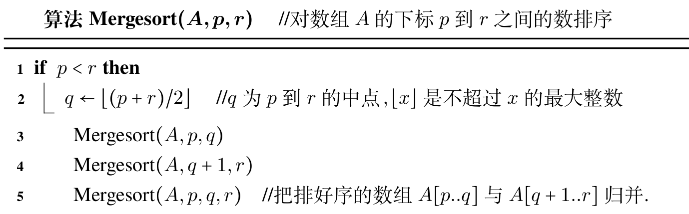
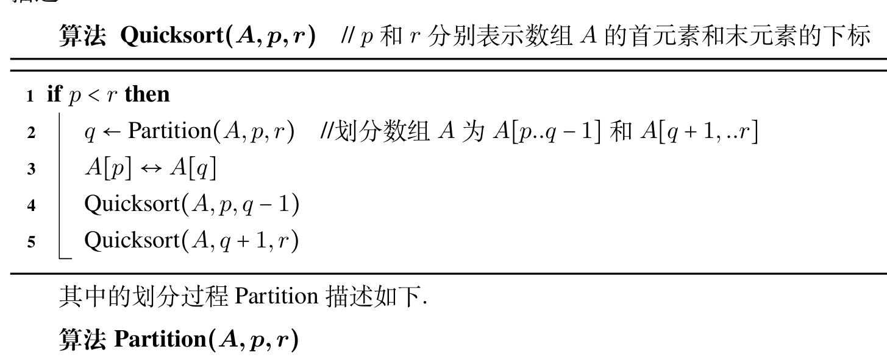
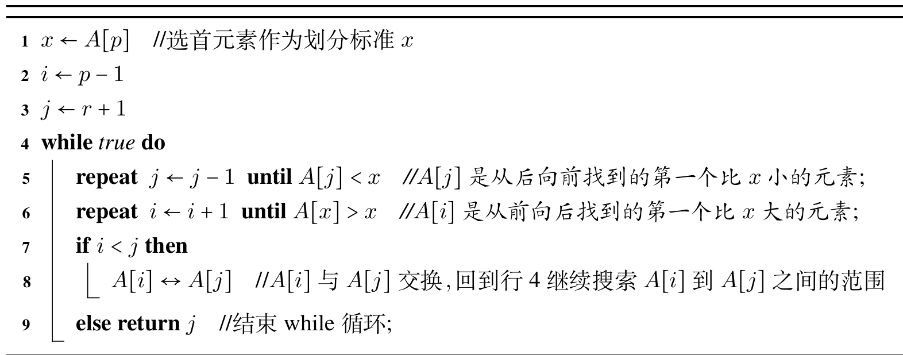
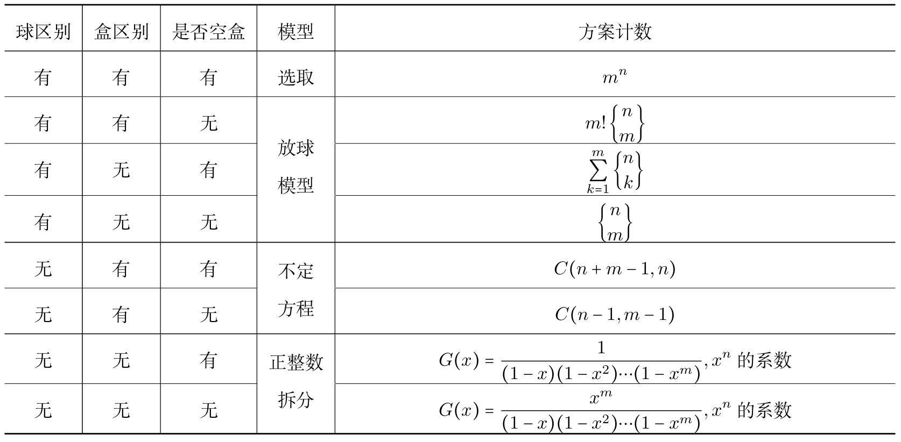
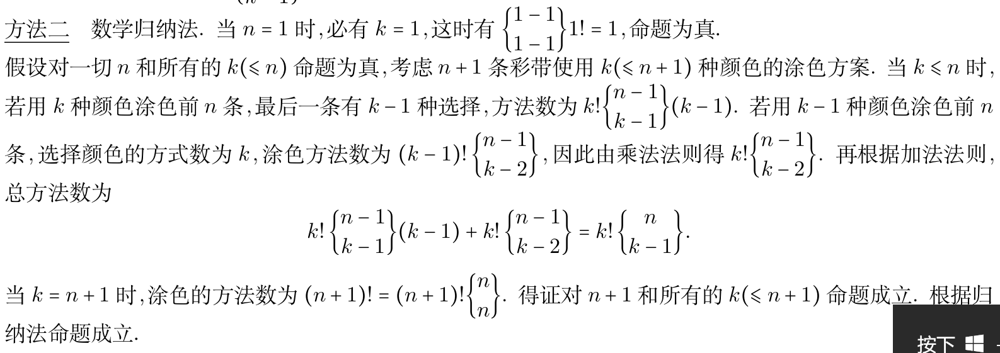

本章整理递推方程、普通生成函数、指数生成函数、Catalan 数和 Stirling 数。重点是把递推关系转成函数关系。

## 递推方程的定义及实例

递推方程的定义，这里说的是显式递推关系，不是刷表法。

汉诺塔算法：相关代码以及 $T(n)=2T(n-1)+1$。

斐波那契数列：$f_n=\frac{1}{\sqrt{5}}(\frac{1+\sqrt{5}}{2})^{n+1}-\frac{1}{\sqrt{5}}(\frac{1-\sqrt{5}}{2})^{n+1}$。

相关应用：蜜蜂家族构成问题，二进制串无连续0计数问题。

## 递推方程的公式解法

$k$ 阶常系数线性递推方程，齐次方程，定义类似高数中的初值问题。

设给定常系数线性齐次递推方程如下

$$
\begin{cases}
& H(n)-a_1H(n-1)-a_2H(n-2)-\ldots -a_kH(n-k)=0, \\\\
& H(0)=b_1,H(1)=b_1,H(2)=b_2,\ldots,H(k-1)=b_{k-1}, \\\\
\end{cases}
$$

则方程 $x^k-a_1x^{k-1}-\ldots -a_k=0$ 称为其特征方程，特征方程的根称为特征根。

若 $q$ 是非零复数，则 $q^n$ 是递推方程的解当且仅当 $q$ 为其特征根。

于是有 $c_1q_1^n+\ldots+c_kq_k^n$ 为该递推方程的解。

若 $q_1,q_2\ldots,q_n$ 彼此不等，则上述解为递推方程的通解。

若 $q_i$ 的重数为 $m_i$ ，则对应的项改为 $(c_{i1}+c_{i2}n+\ldots+c_{im_i}n^{m_i-1})q_i^n$。

对于非齐次的递推方程而言，则需要在通解基础上加上一个特解。

若 $f(n)$ 为 $n$ 的 $t$ 次多项式，则特解一般也为 $n$ 的 $t$ 次多项式，若递推方程的特征根为 $1$ ，则需要提高特解的多项式次数。

若 $f(n)$ 为指数函数 $A\beta^n$ ，若 $\beta$ 不是特征根，则特解为 $P\beta^n$ ；若是 $m$ 重特征根，则特解为 $Pn^m\beta^n$。

特解需要先代入回原方程进行求解，再通过初值求通解。求初值时也要带着特解，这点和高数中不同。

例：顺序插入排序算法的 $W(n)=\frac{n(n-1)}{2}$。

## 递推方程的其它解法

换元法：将原来关于某个变元的递推方程通过函数变换转变为关于其他变元的常系数递推方程。

迭代归纳法：从原始递推方程开始，利用方程所表达的数列中后项对前项的依赖关系，把表达式中的后项用相等的前项中的表达式代入，直到表达式中没有函数式中为止。

差消法：用于将二阶以上的递推方程化简为一阶递推方程，再进行迭代。

递归树：用于说明迭代思想，带权二叉树，每个节点用 $W(n)=2W(n/2)+n-1$ 中的 $n-1$ 代替，再向下迭代，直至树叶的权为 $1$。 使用分层计算算出权。

二分归并排序算法：将被排序的数组划分为相等的两个子数组，然后递归使用同样的算法分别对两个子数组排序，最后将两个排好序的子数组归并成一个数组。

代码如下：

其 $W(n)=n\mathrm{log}n-n+1$。

快速排序：请看以下代码，通过划分来实现。

其 $T(n)=O(n\mathrm{log}n)$。

对于 $T(n),$ 其依赖于 $T(1),T(2),\ldots,T(n-1)$ 等所有的项，称作全部历史递推方程。

分治算法的迭代求解。

在求解斐波那契数列通项时，我们有

$$
\begin{pmatrix}
F_{n+1} & F_n \\\\
F_n & F_{n-1}
\end{pmatrix}=
\begin{pmatrix}
1 & 1 \\\\
1 & 0 \\\\
\end{pmatrix}^n
$$

从而提高计算的时间复杂度。

## 生成函数及其应用

牛顿二项式系数

$$
\dbinom{r}{n}=
\begin{cases}
0, & n<0, \\\\
1, & n=0, \\\\
\frac{r(r-1)\ldots (r-n+1)}{n!}, & n>0
\end{cases}
$$

于是有牛顿二项式定理

$$
(x+y)^{\alpha}=\sum\limits_{n=0}^{+\infty}\dbinom{\alpha}{n}x^ny^{\alpha-n},\quad \alpha,x,y \in R,\quad |x/y|<1
$$

可以导出以下公式

$$
\begin{aligned}
\frac{1}{1-x} &= 1+x+x^2+\ldots, \\\\
\frac{1}{(1-x)^2} &= \sum\limits_{n=0}^{+\infty}(n+1)x^n, \\\\
(1+x)^{\frac{1}{2}} &= 1+\sum\limits_{n=0}^{+\infty}\frac{(-1)^{n-1}}{2^{2n-1}n}\dbinom{2n-2}{n-1}x^n
\end{aligned}
$$

给定序列 $\lbrace{}a_n\rbrace,$ 构造函数 $G(x)=a_0+a_1x+a_2x^2+\ldots +a_nx^n$。 称为其生成函数。

例如， $\lbrace\dbinom{m}{n}\rbrace$ 的生成函数为 $(1+x)^m$。

如果序列是分段的，它的生成函数不一定分段。

用生成函数求解关于 $\lbrace{}a_n\rbrace$ 的递推方程的步骤：

- (1) 先设定 $\lbrace{}a_n\rbrace$ 的生成函数 $G(x)$。
- (2) 利用递推方程的依赖关系导出关于生成函数 $G(x)$ 的方程。
- (3) 通过求解方程得到 $G(x)$ 的函数表达式。
- (4) 将 $G(x)$ 展开为幂级数，其中 $x^n$ 项的系数就是 $a_n$。

生成函数的相关应用：

设 $S=\lbrace{}n_1 \cdot a_1,n_2 \cdot a_2,\ldots,n_k \cdot a_k\rbrace$ 为多重集， $S$ 的一个 $r$ 组合就是一个子多重集 $\lbrace{}x_1 \cdot a_1,x_2 \cdot a_2,\ldots,x_k \cdot a_k\rbrace,$ 于是得到不定方程 $x_1+x_2+\ldots +x_k=r$。

考虑函数

$$
G(y)=(1+y+\ldots +y^{n_1})(1+y+\ldots +y^{n_2})\ldots(1+y+\ldots +y^{n_k})
$$

考虑 $y^r$ 的系数，就是不定方程的解的个数。
进一步，考虑对变量取值存在限制的不定方程

$$
x_1+x_2+\ldots +x_k=r,\quad l_i \le x_i \le t_i
$$

对应的生成函数为

$$
G(y)=(y^{l_1}+y^{l_1+1}+\ldots +y^{t_1})\ldots (y^{l_k}+y^{l_k+1}+\ldots +y^{t_k})
$$

其 $y^r$ 的系数为不定方程的解个数。

进一步，考虑变量系数不为 $1$ 的不定方程 $p_1x_1+p_2x_2+\ldots +p_kx_k=r$ ，对应的生成函数为

$$
G(y)=(1+y^{p_1}+y^{2p_1}+\ldots)\ldots(1+y^{p_k}+y^{2p_k}+\ldots)
$$

进一步，我们可以得出对变量取值存在限制，同时系数不全为 $1$ 的情况。

相关实例：坐标平面的整点个数，正整数拆分(是否有序，是否允许重复)。

我们首先考虑无序拆分，有等式 $a_1x_1+\ldots +a_nx_n=N$。 若不允许重复， $G(y)=(1+y^{a_1})\ldots(1+y^{a_n})$。

若允许重复，有 $G(y)=(1+y^{a_1}+y^{2a_1}\ldots)\ldots(1+y^{a_n}+y^{2a_n}+\ldots)$。

例11.4.7 给定 $r,$ 求将正整数 $N$ 无序并允许重复地拆分成 $k$ 个部分的方法数， $k \le r$。

我们得到一个费勒斯图，然后将其沿 $y=x$ 对称，得到新的费勒斯图，即转化为将 $N$ 无序并可重复地拆分成不超过 $r$ 的数的方案数。

例11.4.8设将 $n$ 无序拆分为恰好 $r$ 个部分的方案有 $p_r(n)$ 种，证明 $p_r(n) \sim \frac{n^{r-1}}{r!(r-1)!}$。

这道题的证明要好好看。

接着我们考虑有序拆分，有以下定理。

设 $N$ 为正整数，将 $N$ 允许重复地有序拆分成 $r$ 个部分的方案数为 $C_{N-1}^{r-1}$。

得到其推论：对 $N$ 做任意重复地有序拆分，方案数为 $2^{N-1}$。

对于不允许重复的有序拆分问题，可以先将 $N$ 不允许重复地进行无序拆分，再针对每种无序拆分方案，计数其全排列数。

## 指数生成函数及其应用

给定序列 $\lbrace{}a_n\rbrace,$ 记 $G_e(x)=\sum\limits_{n=0}^{+\infty}a_n\frac{x^n}{n!}$ 为其指数生成函数。

于是可知 $(1+x)^m$ 既是 $\lbrace{}C_{m}^n\rbrace$ 的生成函数，也是 $\lbrace{}P_m^n\rbrace$ 的指数生成函数。

使用指数生成函数可以求解多重集的排列问题。

设 $S=\lbrace{}n_1 \cdot a_1,n_2 \cdot a_2,\ldots,n_k \cdot a_k\rbrace$ 为多重集，则 $S$ 的 $r$ 排列数的指数生成函数为

$$
G_e(x)=f_{n_1}(x)f_{n_2}(x)\ldots f_{n_k}(x),\quad f_{n_i}(x)=1+x+\frac{x^2}{2!}+\ldots +\frac{x^{n_i}}{n_i!}
$$

例11.5.4 由 $A,B,C,D,E,F$ 组成长度为 $n$ 的序列，如果要求在排列中 $A$ 与 $B$ 出现的次数之和为偶数，问：这样的序列有多少个？

解：由于 $A$ 和 $B$ 出现的次数之和为偶数，则它们的次数同奇偶，即同时为 $\frac{e^x+e^{-x}}{2}$ 或 $\frac{e^x-e^{-x}}{2}$ ，得到

$$
G_e(x)=(\frac{e^x+e^{-x}}{2})^2e^{4x}+(\frac{e^x-e^{-x}}{2})^2e^{4x}=\frac{1}{2}e^{6x}+\frac{1}{2}e^{2x}
$$

于是得出

$$
a_n=\frac{6^n+2^n}{2}
$$

## 卡塔兰数与斯特林数

给定一个凸 $n+1$ 边形，通过在内部不相交的对角线把它划分成三角形，不同的划分方案数称作卡塔兰($\mathrm{Catalan}$ )数，记作 $h_n$。

其递推方程为

$$
\begin{cases}
h_n=\sum\limits_{k=1}^{n-1}h_kh_n-k,n \ge 2. \\\\
h_1=1 \\\\
\end{cases}
$$

其通项公式为：$h_n=\frac{1}{n}\dbinom{2n-2}{n-1}$。

应用：矩阵链相乘、出栈进栈问题。

考虑 $x(x-1)(x-2)\ldots (x-n+1)$ 的展开式 $S_nx^n-S_{n-1}x^{n-1}+S_{n-2}x^{n-2}\ldots +(-1)^{n-1}S_1x$。

将 $x^r$ 的系数的绝对值 $S_r$ 记作 $\displaystyle\genfrac{[}{]}{0pt}{}{n}{r},$ 称作第一类斯特林($\mathrm{Stirling}$ 数)。

则它满足下列递推方程与恒等式：

- (1) 递推式为

$$
\begin{cases}
\displaystyle\genfrac{[}{]}{0pt}{}{n}{r}=(n-1)\displaystyle\genfrac{[}{]}{0pt}{}{n-1}{r}+\displaystyle\genfrac{[}{]}{0pt}{}{n-1}{r-1},n>r \ge 1, \\\\
\displaystyle\genfrac{[}{]}{0pt}{}{n}{0}=0,\displaystyle\genfrac{[}{]}{0pt}{}{n}{1}=(n-1)!.
\end{cases}
$$

- (2) $\displaystyle\genfrac{[}{]}{0pt}{}{n}{n}$ =1
- (3) $\displaystyle\genfrac{[}{]}{0pt}{}{n}{n-1}=\dbinom{n}{2}=\frac{n(n-1)}{2}$
- (4) $\sum\limits_{r=1}^{n}\displaystyle\genfrac{[}{]}{0pt}{}{n}{r}=n!$。

第一类斯特林数通常与 $n$ 个不同对象划分的计数相关，在这些划分中 $n$ 个对象被分成 $r$ 个环排列。

将 $n$ 个不同的球恰好放到 $r$ 个相同的盒子里的方法数称作第二类斯特林(Stirling)数，记作 $\displaystyle\genfrac{\lbrace}{\rbrace}{0pt}{}{n}{k}$。

则它满足下列递推方程和恒等式：

- (1) 递推式为

$$
\begin{cases}
\displaystyle\genfrac{\lbrace}{\rbrace}{0pt}{}{n}{r}=r\displaystyle\genfrac{\lbrace}{\rbrace}{0pt}{}{n-1}{r}+\displaystyle\genfrac{\lbrace}{\rbrace}{0pt}{}{n-1}{r-1}, \\\\
\displaystyle\genfrac{\lbrace}{\rbrace}{0pt}{}{n}{0}=0,\displaystyle\genfrac{\lbrace}{\rbrace}{0pt}{}{n}{1}=1 \\\\
\end{cases}
$$

- (2) $\displaystyle\genfrac{\lbrace}{\rbrace}{0pt}{}{n}{2}=2^{n-1}-1$。
- (3) $\displaystyle\genfrac{\lbrace}{\rbrace}{0pt}{}{n}{n-1}=\dbinom{n}{2}$。
- (4) $\displaystyle\genfrac{\lbrace}{\rbrace}{0pt}{}{n}{n}=1$
- (5) $\sum\dbinom{n}{n_1n_2 \ldots n_m}=m!\displaystyle\genfrac{\lbrace}{\rbrace}{0pt}{}{n}{m},$ 其中 $\sum$ 是对 $n_1+n_2+\ldots +n_m=n$ 的正整数解求和。
- (6) $\sum\limits_{k=1}^{m}\dbinom{m}{k}\displaystyle\genfrac{\lbrace}{\rbrace}{0pt}{}{m}{k}k!=m^n$。
- (7) $\displaystyle\genfrac{\lbrace}{\rbrace}{0pt}{}{n+1}{r}=\sum\limits_{i=0}^{n}\dbinom{n}{i}\displaystyle\genfrac{\lbrace}{\rbrace}{0pt}{}{i}{r-1}$。
- (8) $\sum\limits_{r=0}^{m}(-1)^rC_m^{r}(m-r)^n=m!\displaystyle\genfrac{\lbrace}{\rbrace}{0pt}{}{n}{m}$

于是，我们得到一张总结表。

例11.6.2设 $A,B$ 为集合，其中 $|A|=n,|B|=m,$ 问：

- (1) 从 $A$ 到 $B$ 的关系有多少个？
- (2) $A$ 上关系有多少个？其中等价关系有多少个？
- (3) 从 $A$ 到 $B$ 的函数有多少个？其中单射函数有多少个？满射函数有多少个？双射函数有多少个？

答案：(1) $2^{mn}$。

- (2) $2^{n^2},\sum\limits_{k=1}^{n}\displaystyle\genfrac{\lbrace}{\rbrace}{0pt}{}{n}{k}$
- (3) $m^n,P_m^n,m!\displaystyle\genfrac{\lbrace}{\rbrace}{0pt}{}{n}{m},n$！

第二问从划分的角度来看，第三问考虑已知的组合模型。

## 基本的计数模型

选取问题：

不重复选取：集合的排列组合公式。

无序重复选取的生成函数为

$$
A(y)=(1+y+\ldots +y^{n_1})(1+y+\ldots +y^{n_2})\ldots(1+y+\ldots +y^{n_k})
$$

若 $r \le n_i,N=C_{r+k-1}^r$。

有序重复选取的指数生成函数为

$$
A_e(y)=(1+\frac{y}{1!}+\frac{y^2}{2!}+\ldots +\frac{y^{n_1}}{n_1!})\ldots(1+\frac{y}{1!}+\frac{y^2}{2!}+\ldots +\frac{y^{n_k}}{n_k!})
$$

若 $r \le n_i,N=k^r$。若 $r=n_1+n_2 +\ldots +n_k,r=\dbinom{n}{n_1n_2\ldots n_k}$。

不定方程的整数解问题：

有限制、系数不为1的问题：生成函数。

方程 $x_1+x_2+x_3+\ldots +x_k=r$ 的非负整数解个数为 $C_{r+k-1}^r,$ 正整数解的个数为 $C_{k-1}^{r-1}$。

非降路径问题：

$(a,b)$ 到 $(m,n)$ 的非降路径条数：$\dbinom{m+n-a-b}{m-a}$。

其余的采用分步或者一一对应的方法

正整数的拆分问题：

一般采用生成函数。

若有限制的拆分，则转化为费勒斯图再一一对应。

放球问题：见上表。

下面整理一些容易漏条件的题目。

1. 已知 $A(x)=\frac{1}{(1-x)(1-x^2)}$ 是序列 $\lbrace{}a_n\rbrace$ 的生成函数，求 $a_n$。

把它拆成基础生成函数

$$
A(x)=-\frac{x}{4(1-x)^2}+\frac{3}{4(1-x)^2}+\frac{1}{4(1+x)}
$$

将该基本函数展开得 $a_n=\frac{1}{4}[1+(-1)^n]+\frac{1}{2}(n+1)$。

2. 用 $3$ 个 $1,2$ 个 $2,5$ 个 $3$ 可以组成多少个不同的四位数？如果是偶数呢？

思路：正常的有序选取问题，直接用指数生成函数即可，计算过程略。

3. 设 $m,n$ 为正整数，证明

$$
f_{n+m}=f_{m-1}f_{n+1}+f_{m-2}f_{n}
$$

思路：有关斐波那契数的问题大多可以用数学归纳法解决。

证明：$n=0$ 时显然成立，设对小于 $n+1$ 的任意自然数的等式成立，则有

$$
\begin{aligned}
f_{n+1+m}
&=f_{n+m}+f_{n-1+m} \\\\
&=f_{m-1}f_{n+1}+f_{m-2}f_n+f_{m-1}f_n+f_{m-2}f_{n-1} \\\\
&=f_{m-1}(f_{n-1}+f_n)+f_{m-2}(f_n+f_{n-1}) \\\\
&=f_{m-1}f_{n+2}+f_{m-2}f_{n}
\end{aligned}
$$

这个结论在后续的解题中很常用。

4. 用恰好 $k$ 种可能的颜色做旗子，使得每面旗子由 $n(\ge k)$ 条彩带构成，且相邻的两条彩带的颜色都不相同。证明：不同的旗子数是 $k!\displaystyle\genfrac{\lbrace}{\rbrace}{0pt}{}{n-1}{k-1}$。

这道题的方法很丰富，这里放出一种。

5. 设 $f_n$ 为斐波那契数，计算 $f_0-f_1+f_2-\ldots +(-1)^nf_n$。

思路：关于斐波那契数的题目通常要用归纳法。

解：猜测 $LHS=1+(-1)^nf_{n-1}$。 当 $n=1$ 时，原式成立。

假设当 $n$ 时成立，则

$$
\begin{aligned}
f_0-f_1+f_2-\ldots +(-1)^{n+1}f_{n+1}
&=1+(-1)^nf_{n-1}+(-1)^{n+1}f_{n+1} \\\\
&=1+(-1)^nf_{n-1}-(-1)^nf_{n+1} \\\\
&=1+(-1)^{n+1}f_n
\end{aligned}
$$

证毕。

6. 证明以下关于斐波那契数的恒等式：

- (1) $f_{n-1}^2+f_n^2=f_{2n}$
- (2) $f_n \cdot f_{n+1}-f_{n-1} \cdot f_{n-2}=f_{2n}$。

思路：通过式子的形式考虑上上面的结论。

证明：在上面的结论中，令 $m=n$ 有 $f_{2n}=f_{n-1}f_{n+1}+f_{n-2}f_n$。

- (1) 即证：$f_{n-1}f_{n+1}+f_{n-2}f_n=f_{n-1}^2+f_n^2$

$$
\begin{align*}
LHS & =f_{n-1}(f_n+f_{n-1})+f_{n-2}f_n \\\\
& =f_{n-1}^2+f_n(f_{n-1}+f_{n-2}) \\\\
& =f_{n-1}^2+f_n^2 \\\\
\end{align*}
$$

- (2) 即证：$f_{n-1}f_{n+1}+f_{n-2}f_n=f_nf_{n+1}-f_{n-1}f_{n-2}$

$$
\begin{align*}
RHS-LHS & =f_nf_{n+1}-f_{n-1}f_{n-2}-f_{n-1}f_{n+1}-f_{n-2}f_n \\\\
& =f_{n-2}f_{n+1}-f_{n-1}f_{n-2}-f_{n-2}f_n \\\\
& =f_{n-2}f_{n-1}-f_{n-1}f_{n-2} \\\\
& =0 \\\\
\end{align*}
$$

7. 设 $f_n$ 是斐波那契数，求证

$$
f_n \cdot f_{n+2}-f_{n+1}^2=\pm 1
$$

证明：猜测

$$
f_{n+2}f_n-f_{n+1}^2=-(f_{n+3}f_{n+1}-f_{n+2}^2)
$$

当 $n=1$ 时显然成立，假设当 $n$ 时成立，则 $n+1$ 时有

$$
\begin{aligned}
& f_{n+1}f_{n+3}-f_{n+2}^2+f_{n+2}f_{n}-f_{n+1}^2 \\\\
= {} & f_{n+1}^2+f_{n+2}f_{n+1}-f_{n+2}^2+f_{n+2}f_n-f_{n+1}^2 \\\\
= {} & f_{n+2}f_n+f_{n+1}f_{n+2}-f_{n+2}^2 \\\\
= {} & f_{n+2}^2-f_{n+2}^2 \\\\
= {} & 0
\end{aligned}
$$

8. 关于生成函数，我们给出以下结论。

- (1) 若 $b_n=\alpha a_n,$ 则 $B(x)=\alpha A(x)$。
- (2) 若 $c_n=a_n+b_n,$ 则 $C(x)=A(x)+B(x)$。
- (3) 若 $c_n=\sum\limits_{i=0}^{n}a_ib_{n-i},$ 则 $C(x)=A(x)B(x)$。
- (4) 若 $b_n$ 在 $n<l$ 时为 $0$ ，在 $n \ge l$ 时为 $a_{n-1}$ ，则 $B(x)=x^lA(x)$。
- (5) 若 $b_n=a_{n+l},$ 则 $B(x)=\frac{A(x)-\sum\limits_{n=0}^{l-1}a_nx^n}{x^l}$。
- (6) 若 $b_n=\sum\limits_{i=0}^{n}a_i,$ 则 $B(x)=\frac{A(x)}{1-x}$。
- (7) 若 $b_n=\sum\limits_{i=0}^{+\infty}a_i,$ 且 $A(1)=\sum\limits_{i=0}^{+\infty}a_i$ 收敛，则 $B(x)=\frac{A(1)-xA(x)}{1-x}$。
- (8) 若 $b_n=\alpha^na_n,$ 则 $B(x)=A(\alpha x)$。
- (9) 若 $b_n=na_n,$ 则 $B(x)=xA'(x)$。
- (10) 若 $b_n=\frac{a_n}{n+1},$ 则 $B(x)=\frac{1}{x}\int_{0}^xA(x)dx$。

9. 使用生成函数求解递推方程 $a_n=3a_{n-1},n=1,2,3\ldots,$ 初始条件 $a_0=2$。

思路：这种题我们考虑从原序列的递推方程推出生成函数的递推方程，从而解出生成函数，然后再解出原序列。

证明 由题意有

$$
A(x)=\sum\limits_{k=0}^{+\infty}a_kx^k=\sum\limits_{k=1}^{+\infty}a_kx^k+2=\sum\limits_{k=0}^{+\infty}3a_{k-1}x^k+2=3x\sum\limits_{k=0}^{+\infty}x^k+2=3xA(x)+2
$$

解得

$$
A(x)=\frac{2}{1-3x}
$$

即

$$
a_n=2 \cdot 3^n
$$

10. 设 $a_r$ 是用 $3$ 元、 $4$ 元和 $20$ 元的邮票在邮件上贴满 $r$ 元邮票的方式数，求 $\lbrace{}a_r\rbrace$ 的生成函数。

- (2) 假设邮票贴成一行并且考虑贴的次序

解：这里从贴的次序考虑，每一次可以用 $3,4,20$ 三种邮票中选贴上去，因此贴 $k$ 张邮票时的方法数为 $(y^3+y^4+y^{20})$，将这些全部加起来即得生成函数

$$
G(y)=1+(y^3+y^4+y^{20})+(y^3+y^4+y^{20})^2+\ldots=\frac{1}{1-(y^3+y^4+y^{20})}
$$

上式中 $y^r$ 的系数即为方法数。

11. 将 $n$ 个苹果($n$ 为奇数)恰好分给 $3$ 个孩子，如果第一个孩子和第二个孩子分的苹果数不相同，问有多少种分法？

思路：这种题正难则反，而且有容斥原理撑腰。

解：若不考虑第一个孩子和第二个孩子的分法，则有不定方程 $x_1+x_2+x_3=n-3$。 其生成函数为 $A(y)=\frac{1}{(1-y)^3}$。 由于它是基础生成函数 $\sum\limits_{k=0}^{+\infty}x^k=\frac{1}{1-x}$ 的三阶导，于是有 $a_n=\frac{(n-1)(n-2)}{2}$。

若第一个孩子和第二个孩子拿的苹果数相同，则有不定方程 $2x_1+x_3=n-3$。其生成函数为 $B(y)=\frac{1}{(1-y^2)(1-y)}$，有 $\frac{n-1}{2}$ 种取法，相减即得答案。

12. 设三角形 $ABC$ 的边长为整数，且 $AB+BC+AC$ 为奇数 $2n+1,$ 其中 $n$ 为给定的正整数。问：这样的三角形有多少个？

思路：我们由于两边之和大于第三边，所以这道题实际可以转化为无序拆分的可重复有限制问题。

解：写出生成函数如下

$$
A(y)=(1+y+\ldots +y^n)^3=\frac{(1-y^{n+1})^3}{(1-y)^3}=(1-3y^{n+1}+3y^{2n+2}-y^{n+3})\sum\limits_{k=0}^{+\infty}\dbinom{k+2}{2}y^k
$$

于是

$$
a_{2n+1}=\dbinom{2n+1+2}{2}-3\dbinom{n+2}{2}=\frac{n(n+1)}{2}
$$

13. 设数列 $\lbrace{}a_n\rbrace,\lbrace{}b_n\rbrace$ 的指数生成函数分别为 $A_e(x)$ 和 $B_e(x)$，则有

$$
A_e(x) \cdot B_e(x)=\sum\limits_{n=0}^{+\infty}c_n\frac{x^n}{n!}
$$

其中

$$
c_n=\sum\limits_{k=0}^{n}\dbinom{n}{k}a_kb_{n-k}
$$

14. 一个 $1 \times n$ 的方格图形用红、蓝、绿和橙色 $4$ 种颜色涂色，如果有偶数个方格被涂成红色，还有偶数个方格被涂成绿色，问：有多少种方案？

思路：考虑指数生成函数。

解：由题意得

$$
A_e(x)=(\frac{e^x+e^{-x}}{2})^2e^{2x}=\frac{1}{4}e^{4x}+\frac{1}{2}e^{2x}+\frac{1}{4}
$$

于是有

$$
a_n=
\begin{cases}
4^{n-1}+2^{n-1}, n \ge 1 \\\\
1,n=0
\end{cases}
$$

15. 设 $\sum$ 是一个字母表且 $|\sum|=n>1,a$ 和 $b$ 是 $\sum$ 中两个不同的字母。试求 $\sum$ 上 $a$ 和 $b$ 均出现，长为 $k(k>1)$ 的字(字符串)的个数。

要求 $a$ 和 $b$ 都出现，可以让这两个字母对应的指数生成函数都去掉常数项，其余 $n-2$ 个字母不受限制

$$
A_e(x)=(e^x-1)^2e^{(n-2)x}=e^{nx}-2e^{(n-1)x}+e^{(n-2)x}
$$

于是有 $a_k=n^k-2(n-1)^k+(n-2)^k$。

16. 证明：$\sum\limits_{k=1}^{n}\displaystyle\genfrac{\lbrace}{\rbrace}{0pt}{}{n}{k}x(x-1)\ldots (x-k+1)=x^n$。

使用组合分析。左边式子可以转化为

$$
\sum_{k=1}^{n}\displaystyle\genfrac{\lbrace}{\rbrace}{0pt}{}{n}{k}\dbinom{x}{k}k!.
$$

即相当于从 $x$ 个不同的箱子里取出 $k$ 个，这 $k$ 个作为各自不同的箱子，往里放 $n$ 个球，也就相当于把 $n$ 个球放进 $x$ 个不同的箱子里，允许空箱，也就是右边的式子。

17. 要证明两种取值方案对于某个 $n$ 的方案数相等，通常要证明它们的生成函数相等。
