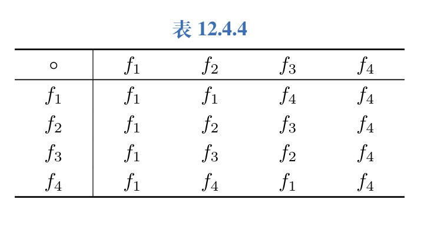

本章记录代数系统、二元运算、同态与同构。这里先把抽象语言搭起来，后面的群和环会继续使用。

## 二元运算及其性质

设 $S$ 为集合，函数 $f:S \times S \rightarrow S$ 称为 $S$ 上的二元运算，简称为二元运算。

封闭、不封闭的概念

一个运算是否为 $S$ 上的二元运算：

- (1) $S$ 中任意两个元素都可以进行这种运算，且运算结果唯一。
- (2) $S$ 中任意两个元素的运算结果都属于 $S,$ 即 $S$ 对该运算是封闭的。

通常用 $\circ,*,\cdot$ 等符号表示二元运算，称为算符。

设 $S$ 为集合，函数 $f:S \rightarrow S$ 称为 $S$ 上的一个一元运算，简称为一元运算，用算符记作 $\circ(x)=y$ 或 $\circ x=y$。

二元运算的主要性质：

- (1) 交换律，例如相对补，矩阵乘法 $A^A$ 上函数的复合不是可交换的。
- (2) 结合律，例如函数的复合运算是可结合的。
- (3) 若 $\forall x \in S,x \circ x=x,$ 则称其满足幂等律。若某些 $x$ 满足 $x \circ x=x,$ 称它们为幂等元。若 $S$ 上的二元运算满足幂等律，则 $S$ 中的所有元素都是幂等元。例如加法和乘法、相对补和对称差运算不满足幂等律。
- (4) 给定 $S$ 上的两个二元运算 $\circ$ 和 $*$，若

$$
\forall x,y,z \in S,\quad x*(y \circ z)=(x * y)\circ (x * z),\quad (y \circ z)*x=(y*x) \circ (z*x)
$$

则称 $*$ 对 $\circ$ 是可分配的，或称 $*$ 对 $\circ$ 满足分配律。

通常应该指明哪个运算对哪个运算可分配，因为往往只有一个运算对另一个运算满足分配律，反之不对。

用归纳法可证若 $*$ 对 $\circ$ 分配律成立，则广义分配律也成立。

对单个运算不能考虑分配律。

- (5) 若 $\circ$ 和 $*$ 是 $S$ 上两个可交换的二元运算，如果 $\forall x,y \in S,x*(x \circ y)=x,x \circ (x*y)=x,$ 则称 $\circ$ 和 $*$ 满足吸收律。
- (6) 左单位元、右单位元和单位元(幺元)，若同时存在左右单位元，则它们相等且为唯一的单位元。
- (7) 左零元、右零元和零元，若同时存在左零元和右零元，则它们相等且为唯一的零元。
- (8) 若 $\circ$ 是 $S$ 上的二元运算， $e$ 和 $\theta$ 分别为 $\circ$ 的单位元和零元，若 $S$ 至少有两个元素，则 $e \neq \theta$。
- (9) 左逆元、右逆元、逆元(可逆)
- (10) 设 $\circ$ 是 $S$ 上可结合的二元运算， $e$ 为该运算的单位元，若 $x \in S$ 存在左逆元和右逆元，则它们相等且为 $x$ 唯一的逆元。
单位元和零元都是相对于运算本身而言的，而逆元是相对于元素而言。不同的元素对应着不同的逆元，有的元素没有逆元。

- (11) 设 $\circ$ 为 $S$ 上的二元运算，若 $\forall x,y,z \in S$ 有

$$
x \circ y = x \circ z,\quad x \neq \theta \rightarrow y=z,\quad y \circ x = z \circ x,\quad x \neq \theta \rightarrow y=z
$$

前者称为左消去律，后者称为右消去律，两者合称消去律，被消去的数不能是零元。

## 代数系统

非空集合 $S$ 和 $S$ 上 $k$ 个一元或二元运算 $f_1,f_2,\ldots,f_k$ 组成的系统称作一个代数系统，简称为代数，记作 $\langle S,f_1,f_2,\ldots,f_k \rangle$。

代数系统中的特定元素，称这些元素为该代数系统的特异元素或代数常数，也可以把这些代数常数列到系统的表达式中，在不发生混淆的情况下，为了叙述的简便也常用集合的名字来标记代数系统。

若两个代数系统中运算的个数相同，对应运算的元数想通，且代数常数的个数也相同，那么称这两个代数系统具有相同的构成成分，也称它们是同类型的代数系统。

同类型的代数系统只是具有相同的构成成分，不一定有相同的运算性质。

若同类型的两个代数系统具有共同的运算性质，那么称它们是同种的。

若规定了代数系统的构成成分，即集合、运算以及代数常数，若再限制运算的算律，那么满足这些条件的代数系统就有完全相同的性质。

比如， $\langle S,\circ \rangle,$ 其中 $\circ$ 是可结合的二元运算，那么它是一类代数系统，即半群。

比如， $\langle S,\circ,* \rangle,$ 其中 $\circ$ 和 $*$ 是二元运算，并满足交换律、结合律、幂等律和吸收律，那么它是一种一类代数系统，即格。

由已知的代数系统通过系统的方法构成新的代数系统：

设 $V=\langle S,f_1,f_2,\ldots,f_k \rangle$ 是代数系统， $B \subseteq S,$ 如果 $B$ 对运算 $f_1,f_2,\ldots,f_k$ 都是封闭的，且 $B$ 和 $S$ 含有相同的代数常数，那么称 $\langle B,f_1,f_2,\ldots,f_k \rangle$ 是 $V$ 的子代数系统，简称为子代数，有时简记为 $B$。

对于任何代数系统，其子代数一定存在，最大的子代数就是 $V$ 本身。如果 $V$ 中所有代数常数构成的集合对 $V$ 中所有的运算都是封闭的，那么它构成了 $V$ 的最小子代数。这种最大和最小子代数称为 $V$ 的平凡子代数。若 $B$ 是 $S$ 的真子集，则 $B$ 构成的子代数称为 $V$ 的真子代数。

在真子代数中不存在空集的概念，因此最小子代数既是平凡子代数，又是真子代数。

设 $V_1=\langle A,\circ \rangle$ 和 $V_2=\langle B,* \rangle$ 是同类型的代数系统， $\circ$ 和 $*$ 是二元运算，在集合 $A \times B$ 上定义二元运算 $\cdot$

$$
\forall \langle a_1,b_1 \rangle,\langle a_2,b_2 \rangle \in A \times B,\quad \langle a_1,b_1 \rangle \cdot \langle a_2,b_2 \rangle=\langle a_1 \circ a_2,b_1*b_2 \rangle
$$

则称 $V=\langle A \times B,\cdot \rangle$ 为 $V_1$ 和 $V_2$ 的积代数，记作 $V_1 \times V_2$。此时也称 $V_1$ 和 $V_2$ 为 $V$ 的因子代数。

关于积代数的一些定理：

设 $V_1=\langle A,\circ \rangle$ 和 $V_2=\langle B,* \rangle$ 是同类型的代数系统， $V_1 \times V_2=\langle A \times B,\cdot \rangle$ 是它们的积代数。

- (1) 如果 $\circ$ 和 $*$ 满足交换律、结合律、幂等律，那么 $\cdot$ 也满足交换律、结合律和幂等律。
- (2) 如果 $e_1(\theta_1)$ 和 $e_2(\theta_2)$ 分别为 $\circ$ 和 $*$ 的单位元(零元)，那么 $\langle e_1,e_2 \rangle(\langle \theta_1,\theta_2 \rangle)$ 也是 $\cdot$ 的单位元(零元)。
- (3) 如果 $x$ 和 $y$ 分别为 $\circ$ 和 $*$ 的可逆元素，那么 $\langle x,y \rangle$ 也是 $\cdot$ 运算的可逆元素，其逆元就是 $\langle x^{-1},y^{-1} \rangle$。
积代数的定义可以推广到具有多个运算的同类型的代数系统。积代数也保留因子代数中的分配律、吸收律等性质，但是不一定保留消去律。

## 同态与同构

设 $V_1=\langle A,\circ \rangle$ 和 $V_2=\langle B,* \rangle$ 是同类型的代数系统， $f:A \rightarrow B,$ 且 $\forall x,y \in A$ 有 $f(x \circ y)=f(x)*f(y)$。 则称 $f$ 是从 $V_1$ 到 $V_2$ 的同态映射，简称为同态。

同构有自反性、对称性与传递性。

若 $f$ 为单射，称为单同态；若为满射则称为满同态，此时称 $V_2$ 是 $V_1$ 的同态像；若 $f$ 为双射，称其为同构，也称代数系统 $V_1$ 同构于 $V_2,$ 记作 $V_1 \cong V_2$。

若同态映射 $f$ 是从 $V$ 到 $V$ 的，那么称 $f$ 为自同态，同样有单自同态、满自同态、同构的概念。

若 $V_1=\langle A,\circ \rangle$ 和 $V_2=\langle B,* \rangle,f$ 是从 $V_1$ 到 $V_2$ 的同态映射，那么若 $\circ$ 具有交换律、结合律、幂等律等(消去律)可能是例外，则 $*$ 也具有相同算律。同时， $f$ 把 $V_1$ 的单位元 $e_1$ 映射到 $V_2$ 的单位元 $e_2,$ 即 $f(e_1)=e_2$。 同样对于零元和可逆元也有 $f(\theta_1)=\theta_2,f(x^{-1})=f(x)^{-1}$。

上述关于同态映射的定义可以推广到具有有限多个运算的代数系统。例如， $V_1=\langle A,\circ_1,\circ_2, \rangle$ 和 $V_2=\langle B,*_1,*_2 \rangle,f:A \rightarrow B$，如果 $\forall x,y \in A$ 有

$$
f(x \circ_1 y)=f(x)*_1f(y),\quad f(x \circ_2 y)=f(x)*_2f(y)
$$

那么 $f$ 是从 $V_1$ 到 $V_2$ 的同态映射。

零同态：全映射到零。

证明恰有 $n$ 个 $V$ 的自同态的思路：证明其有 $n$ 个自同态，然后证明任意自同态都是其中一员。

进程代数：见书。

下面整理一些容易漏条件的题目。

1. 通过运算表判断运算律和代数常数的办法：

交换律是容易发现的。

幂等律也是容易发现的。

如果在运算表的某行或者某列(除了零元所在的行列)有两个值相等，那么不满足消去律。

单位元和零元是容易发现的。

幂等元也是容易发现的。

对于结合律，只需判断除单位元和零元之外的元素，认真发现可能破坏结合律的元素并加以验证。

2. 求单位元时要同时满足左右单位元。

不可交换也可能存在单位元或者零元。

逆元不一定在原集合中。

任何减法都没有零元。

3. 能构成代数系统，关键在于满足运算的定义。

4. 写同态像的时候，应用子代数的形式表示，同时并不是只有满自同态才有同态像。

5. 下列集合和运算是否构成代数系统？如果构成，说明该系统是否满足交换律、结合律，求出该运算的单位元、零元和所有可逆元素的逆元。

- (6) $A=Z,x*y=x+y+xy,$ 这里 $+$ 为普通加法。

答案：构成；交换、结合，单位元0，零元-1，可逆元为0和-2。

6. 对于下列集合和二元运算，判断 $A$ 上是否封闭。如果是封闭的，那么指出它是否满足交换律、结合律，是否有零元和单位元。

- (1) $A=P(\lbrace{}a,b\rbrace),X*Y=X \cup Y$。
- (3) $A$ 是非空集合 $B$ 上所有二元关系的关系矩阵集合， $*$ 为关系矩阵乘法(相加采用逻辑加)。
- (4) $A=nZ=\lbrace{}nk | k \in Z\rbrace,n$ 是正整数， $*$ 为普通乘法。
- (6) $A$ 是非空集合 $B$ 上所有等价关系的集合， $R_1 * R_2=R_1 \cup R_2$。

答案：(1) 封闭，交换，结合，单位元是 $\emptyset,$ 零元是 $\lbrace{}a,b\rbrace$。

- (3) 封闭，可结合，仅当 $B$ 为单元集时可交换；单位元是单位矩阵，零元是全0矩阵。
- (4) 封闭，可交换，可结合，单位元是空集，没有零元。
- (6) 当 $|B|<3$ 时， $B$ 上的全部等价关系只有恒等关系和全域关系，运算封闭；此时运算满足交换律和结合律，单位元是恒等关系，零元是全域关系。当 $|B| \ge 3$ 时，两个等价关系的并集不一定具有传递性，运算不封闭。

7. 设 $V=\langle A,\oplus \rangle,$ 其中 $A=P(\lbrace1,2,3\rbrace),\oplus$ 为集合的对称差，试给出 $V$ 的所有子代数，并说明哪些是平凡子代数，哪些是真子代数。

答案：平凡子代数为 $B_1=\lbrace\emptyset \rbrace,V$。

非平凡子代数：

2元的

$$
B_2=\lbrace\emptyset,\lbrace1\rbrace\rbrace,\quad B_3=\lbrace\emptyset,\lbrace2\rbrace\rbrace,\quad B_4=\lbrace\emptyset,\lbrace3\rbrace\rbrace,\quad B_5=\lbrace\emptyset,\lbrace1,2\rbrace\rbrace
$$

$$
B_6=\lbrace\emptyset,\lbrace1,3\rbrace\rbrace,\quad B_7=\lbrace\emptyset,\lbrace2,3\rbrace\rbrace,\quad B_8=\lbrace\emptyset,\lbrace1,2,3\rbrace\rbrace
$$

4元的

$$
B_9=\lbrace\emptyset,\lbrace1\rbrace,\lbrace2\rbrace,\lbrace1,2\rbrace\rbrace,\quad B_{10}=\lbrace\emptyset,\lbrace1\rbrace,\lbrace3\rbrace,\lbrace1,3\rbrace\rbrace,\quad B_{11}=\lbrace\emptyset,\lbrace2\rbrace,\lbrace3\rbrace,\lbrace2,3\rbrace\rbrace
$$

$$
B_{12}=\lbrace\emptyset,\lbrace1\rbrace,\lbrace2,3\rbrace,\lbrace1,2,3\rbrace\rbrace,\quad B_{13}=\lbrace\emptyset,\lbrace2\rbrace,\lbrace1,3\rbrace,\lbrace1,2,3\rbrace\rbrace,\quad B_{14}=\lbrace\emptyset,\lbrace3\rbrace,\lbrace1,2\rbrace,\lbrace1,2,3\rbrace\rbrace
$$

8. 设 $A=\lbrace0,1\rbrace,S=A^A$。 ，请写出 $S$ 上合成运算的运算表。

9. 设 $A=\lbrace{}a,b,c\rbrace,$ 能否确定 $a,b,c$ 的值使得。

- (1) $A$ 对普通乘法封闭。
- (2) $A$ 对普通加法封闭。

答案：(1) 可以， $A=\lbrace-1,0,1\rbrace$。

- (2) 不可以

10. 给定 $n \in Z^+,nZ=\lbrace{}nz | z \in Z\rbrace,nZ$ 关于普通的加法和乘法运算。请找出它的单位元、零元和所有可逆元素的逆元。

答案：加法单位元 $0,$ 没有零元，每个元素 $x$ 都可逆，其逆元为它的相反数 $-x$。当 $n=1$ 时，乘法有单位元 $1,$ 只有两个可逆元素， $1$ 和 $-1$。当 $n>1$ 时没有单位元和可逆元素，乘法有零元 $0$。

11. 设 $S$ 为 $n$ 元集， $S$ 上可以定义多少个不同的二元运算和一元运算？其中有多少个二元运算是可交换的？有多少个二元运算是幂等的？有多少个二元运算既不是可交换的，又不是幂等的？

答案：$n^{n^2}$ 个不同的二元运算， $n^n$ 个不同的一员运算，可交换的运算有 $n^{\frac{n^2+n}{2}}$ 个，幂等的运算有 $n^{n^2-n}$ 个，交换并且幂等的运算有 $n^{\frac{n^2-n}{2}}$ 个，既不交换又不幂等的运算有 $n^{n^2}-(n^{\frac{n^2+n}{2}}+n^{n^2-n})+n^{\frac{n^2-n}{2}}$。

12. 下列集合都是 $N$ 的子集，它们能否构成代数系统 $V=\langle N,+ \rangle$ 的子代数？

- (1) $\lbrace{}x|x \in N,x$ 的某次幂可以被 $16$ 整除 $\rbrace$。

答案：题目中所述即为偶数，因此能构成。

13. 设代数系统 $V=\langle 2Z,+ \rangle,$ 其中 $2Z=\lbrace2k | k \in Z\rbrace,+$ 为普通加法，求 $V$ 的子代数。

答案：子代数为 $2nZ$。
