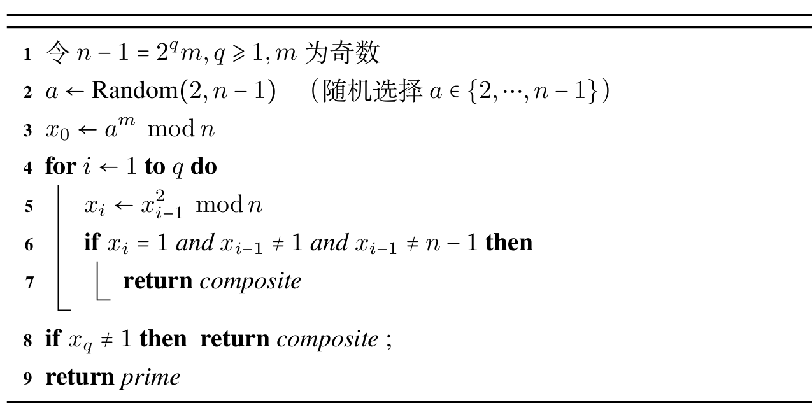

本章整理群、子群、配集、循环群、置换群、环与域。很多证明都围绕封闭性、逆元和单位元展开。

## 群的定义及性质

设 $V=\langle S , \circ \rangle$ 是一个具有二元运算的代数系统，若 $\circ$ 满足结合律，则称 $V$ 为半群，若半群 $V=\langle S, \circ \rangle$ 关于 $\circ$ 有单位元 $e \in S,$ 那么称 $V$ 是幺半群，又称独异点。有时也将其记作 $V=\langle S,\circ,e \rangle$。

设 $G$ 是非空集合， $\circ$ 是 $G$ 上的二元运算，若它满足下列条件，则称它为一个群。

- (1) $\circ$ 满足结合律。
- (2) 存在单位元。
- (3) 每个元素都存在逆元。

$\langle Z,+ \rangle,\langle Q,+ \rangle,\langle R,+ \rangle,\langle C,+ \rangle$ 都是群，分别称为整数加群、有理数加群、实数加群、负数加群。

对于 $G=\lbrace{}e,a,b,c\rbrace,$ 且 $a,b,c$ 中任意两个不同元素运算得到第三个元素，两个相同元素运算得到单位元 $e,$ 则我们将其称为克莱因($\mathrm{Klein}$ )四元群，简称为四元群。

设 $\sum$ 是有穷字母表， $\forall k \in N,$ 定义集合 $\sum_k=\lbrace{}a_1a_2\ldots a_k | a_i \in \sum\rbrace$。 它是 $\sum$ 上所有长度为 $k$ 的串的集合， $k=0$ 时， $\sum_0=\lbrace\lambda \rbrace,$ 表示空串。令 $\sum^*=\bigcup\limits_{k=0}^{+\infty}\sum_k$ 表示 $\sum$ 上所有有限长度的串的集合， $\sum^+=\sum-\lbrace\lambda \rbrace$ 表示所有长度大于 $1$ 的串的集合，可以在 $\sum^*$ 上定义串的连接运算(可以理解为字符串的加法)，它关于连接运算构成一个独异点，称为 $\sum$ 上的字代数，其任意子集称作 $\sum$ 上的语言。

关于群的定义：

- (1) 若 $G$ 是有穷集，则称 $G$ 是有限群，否则称作无限群，其基数称为 $G$ 的阶。
- (2) 只含单位元的群称作平凡群。
- (3) 若 $G$ 中的二元运算是可交换的，称作交换群或阿贝尔($\mathrm{Abelian}$ 群)。
- (4) 设 $G$ 是群， $a \in G,n \in Z$。 $a$ 的 $n$ 次幂定义为

$$
a^n=
\begin{cases}
e,n=0,\\\\
a^{n-1}a, n>0 \\\\
(a^{-1})^{-n}, n<0
\end{cases}
$$

幂指数在半群里只能取正整数，在独异点中只能取自然数，在群中才能取负整数。

- (5) 设 $G$ 是群， $a \in G,$ 使得等式 $a^k=e$ 成立的最小正整数称为 $a$ 的阶，记作 $|a|,$ 也称 $a$ 为 $k$ 阶元，若不存在阶，则称为无限阶元。

关于幂运算的一些性质：

- (1) $\forall a \in G,(a^{-1})^{-1}=a$。
- (2) $\forall a,b \in G,(ab)^{-1}=b^{-1}a^{-1}$。
- (3) $\forall a \in G,a^na^m=a^{n+m},n,m \in Z$。
- (4) $\forall a \in G,(a^n)^m=a^{nm}$。
- (5) 若 $G$ 为交换群，则 $(ab)^n=a^nb^n, n \in Z$。
- (6) 设 $G$ 为群，则 $G$ 中满足消去律，即

$$
\forall a,b,c \in G,\quad ab=ac \Leftrightarrow b=c,\quad ba=ca \Leftrightarrow b=c
$$

(因为没有零元)。

当 $G$ 是 $n$ 阶群时， $a_iG$ 恰好是 $G$ 的运算表中第 $i$ 行的全体元素， $G$ 的运算表的每一行都是 $G$ 中元素的一个排列。对于每一列也有这种性质。相对地，如果运算表不满足这种性质，那么肯定不是群。

- (7) $|a|=r,\forall k \in Z,a^k=e \Leftrightarrow r \mid k$。
- (8) $|a|=r,|a^{-1}|=|a|$。
- (9) $|a|=r,|a^t|=\frac{r}{\mathrm{gcd}(r,t)}$。

例13.1.6 设 $G$ 是群， $a,b \in G$ 且为有限阶元，求证：

- (1) $|b^{-1}ab|=|a|$。
- (2) $|ab|=|ba|$

思路：我们证明相等，由于阶的性质，通常考虑证明相互整除。

证明：(1) 设 $|a|=r,|b^{-1}ab|=t,$ 由于 $(b^{-1}ab)^r=e,$ 得 $t \mid r$。

又由于 $a=(b^{-1})^{-1}(b^{-1}ab)b^{-1},$ 因此有 $a^t=e,$ 得 $r \mid t$。

即 $t=r$。

- (2) 设 $|ab|=r,|ba|=t,$ 有 $(ab)^{t+1}=a(ab)^tb=ab,$ 由消去律得 $r \mid t,$ 同理有 $t \mid r,$ 即 $r=t$。

例13.1.7 设 $G$ 为有限群，则 $G$ 中阶大于 $2$ 的元素有偶数个。

思路：我们考虑阶为 $2$ 的元素有什么特殊性质？

证明：若 $a^2=e,$ 有 $a^{-1}a^2=a^{-1}e,$ 即 $a=a^{-1}$。

若阶大于 $2$ ，则必有 $a \neq a^{-1},$ 即必然成对出现。

## 子群与群的配集分解

子群就是群的子代数。

设 $G$ 是群， $H$ 是 $G$ 的非空子集，如果 $H$ 关于 $G$ 的运算构成群，那么称 $H$ 是 $G$ 的子群，记作 $H \leqslant G$。 若 $H$ 是 $G$ 的子群，且 $H \subset G,$ 则 $H$ 是 $G$ 的真子群，记作 $H<G$。

任何群都存在子群， $\lbrace{}e\rbrace$ 和 $G$ 称为其平凡子群。

下面是三个子群的判定定理：

- (1) $\forall a,b \in H,ab \in H \wedge \forall a \in H,a^{-1} \in H$。
- (2) $\forall a,b \in H,ab^{-1} \in H$。
- (3) $\forall a,b \in H,ab \in H \wedge \emptyset \neq H \subseteq G$。

下面是一些常见的子群：

$a \in G,H={a^k | k \in Z}$ 称为由 $a$ 生成的子群，记作 $\langle a \rangle$。

令 $C$ 是与 $G$ 中所有的元素都可交换的元素组成的集合，则其是 $G$ 的子群，称作 $G$ 的中心。

对于 $G$ 的非空子集 $B,$ 其所有包含 $B$ 的子群的交记作 $\langle B \rangle,$ 称为由 $B$ 生成的子群。其中元素都是 $B$ 的元素或其逆元。

显然有以下定理：$G$ 是群， $H,K$ 是 $G$ 的子群，有

$$
H \cap K \leqslant G,\quad H \cup K \leqslant G \Leftrightarrow H \subseteq K \vee K \subseteq H
$$

设 $G$ 为群， $S=\lbrace{}H | H \leqslant G\rbrace$ 是 $G$ 的所有子群的集合，定义关系 $R$ 如下：$\forall H_1,H_2 \in S,H_1RH_2 \Leftrightarrow H_1 \leqslant H_2$。 则 $\langle S,R \rangle$ 构成偏序集，称为 $G$ 的子群格，可以画出哈斯图哦。

设 $H$ 是群 $G$ 的子群， $a \in G,$ 令 $Ha=\lbrace{}ha | h \in H\rbrace,$ 称 $Ha$ 是子群 $H$ 在 $G$ 中的右陪集，称 $a$ 为 $Ha$ 的代表元素。

其定理有：

- (1) $He=H$。
- (2) $\forall a \in G,a \in Ha$。
- (3) $\forall a,b \in G,a \in Hb \Leftrightarrow ab^{-1} \in H \Leftrightarrow Ha=Hb$。

两个右陪集相等的充要条件就是 (3)，在右陪集中的任何元素都可以作为它的代表元素。是不是等价关系和划分很像？

设 $H$ 是群 $G$ 的子群，在 $G$ 上定义二元关系 $R$

$$
\forall a,b \in G,\quad \langle a,b \rangle \in R \Leftrightarrow ab^{-1} \in H
$$

则 $R$ 是 $G$ 上等价关系，且 $[a]_R=Ha$。

于是由等价关系和划分的性质有以下推论：

- (1) $\forall a,b \in G,Ha=Hb \vee Ha \cap Hb=\emptyset$。
- (2) $\cup \lbrace{}Ha | a \in G\rbrace=G$。
- (3) $\forall a \in G,Ha \sim H$。

$H$ 的所有右陪集的集合恰好构成 $G$ 的一个划分。

我们同样定义左陪集 $aH=\lbrace{}ah | h \in G\rbrace,a \in G$。

有以下性质：

- (1) $eH=H$。
- (2) $\forall a \in G,a \in aH$。
- (3) $\forall a,b \in G,a \in bH \Leftrightarrow b^{-1}a \in H \Leftrightarrow aH=bH$。
- (4) $R:\forall a,b \in G,\langle a,b \rangle \in R \Leftrightarrow b^{-1}a \in H,$ 则 $R$ 是 $G$ 上的等价关系，且 $[a]_R=aH$。
- (5) $\forall a \in G,H \sim aH$。

一般来说 $aH$ 与 $Ha$ 是不相等的。

设 $H$ 是 $H$ 的子群，若 $\forall a \in G,aH=Ha$ 称 $H$ 是 $G$ 的正规子群或者不变子群，记作 $H \trianglelefteq G$。

任何群都有正规子群，因为两个平凡子群都是正规的。对于交换群，它的所有子群都是正规子群。

左陪集数和右陪集数永远相等，统称为 $H$ 在 $G$ 中的配集数，也称作 $H$ 在 $G$ 中的指数，记作 $[G:H]$。

拉格朗日定理：$G$ 是有限群， $H \leqslant G,$ 则 $|G|=|H| \cdot [G:H]$。

以及其推论：

- (1) 设 $G$ 是 $n$ 阶群， $\forall a \in G,|a|$ 是 $n$ 的因子，且有 $a^n=e$。
- (2) 设 $G$ 是素数阶的群，则存在 $a \in G,\langle a \rangle = G$。
- (3) $6$ 阶群中必含有 $3$ 阶元。
- (4) 阶小于 $6$ 的群都是阿贝尔群。

群分解的示例：考虑编码 $C$ 的一个码字 $a_1a_2\ldots a_n,a_i \in \lbrace0,1\rbrace$。 可以看做 $\lbrace0,1\rbrace$ 上的一个 $n$ 维向量，所有 $2^n$ 个 $n$ 维向量构成 $n$ 维线性空间 $F_2^n,$ 其一个 $k$ 维子空间称作 $\lbrace0,1\rbrace$ 上的一个 $k$ 维线性码，记作 $[n,k]$ 码。于是 $C=|2^k|$。 其陪集有 $2^{n-k}$ 个。

下面介绍最近距离义马原则，我们先构建斯莱皮恩($\mathrm{Slepian}$ 译码表)，第一行是原集合，后面的代表元素逐渐取不在前面集合且 $1$ 的个数最少且数值最小的向量，将译码表的第一列称为错误向量。

我们在接受一个码字 $S$ 的时候，如果它就是 $C$ 中的码字，那么直接翻译；如果不是，查找它在某个陪集 $C+a$ 中，将其译作 $S+a$ ，这就是距离它最近的码字。

## 循环群和置换群

设 $G$ 是群，如果存在 $a \in G$ 使得 $G=\langle a \rangle,$ 则称 $G$ 是循环群， $a$ 为 $G$ 的生成元。

循环群根据 $a$ 的阶可分为两类， $n$ 阶循环群和无限循环群。

若 $|G|=n,a$ 为 $n$ 阶元，称其为 $n$ 阶循环群。若 $a$ 是无限阶元，称 $G$ 为无限循环群。

则有下列定理：

- (1) 若 $G$ 是无限循环群，则其只有两个生成元， $a$ 和 $a^{-1}$。
- (2) 若 $G$ 是 $n$ 阶循环群，则 $G$ 有 $\phi(n)$ 个生成元。对于任何不大于 $n$ 且与 $n$ 互素的正整数 $r,a^r$ 是 $G$ 的生成元。
- (3) 设 $G=\langle a \rangle$ 是循环群，则它的子群仍为循环群。
- (4) 若 $G=\langle a \rangle$ 是无限循环群，则 $G$ 的子群除 $\lbrace{}e\rbrace$ 之外都是无限循环群。
- (5) 若 $G=\langle a \rangle$ 是 $n$ 阶循环群，则对 $n$ 的每个正因子 $d,G$ 恰好含有一个 $d$ 阶子群。

于是有求循环群子群的方法，如果 $G=\langle a \rangle$ 是无限循环群，那么 $\langle a^m \rangle$ 是其子群， $m \in N,$ 并且 $\forall m,t \in N,\langle a^m \rangle \neq \langle a^t \rangle$。 若 $G$ 是 $n$ 阶循环群，先求出 $n$ 所有正因子，对于每个正因子 $d,\langle a^{\frac{n}{d}} \rangle$ 是其唯一的 $d$ 阶子群。

设 $S=\lbrace1,2,\ldots,n\rbrace,S$ 上的任何双射函数称为 $S$ 上的 $n$ 元置换。设 $\sigma,\tau$ 是 $n$ 元置换，其复合也是 $n$ 元置换，称作 $\sigma$ 和 $\tau$ 的乘积。

设 $\sigma$ 是 $S=\lbrace1,2,\ldots,n\rbrace$ 上的 $n$ 元置换，若 $\sigma(i_1)=i_2,\sigma(i_2)=i_3,\sigma(i_3)=i_4,\ldots,\sigma(i_k)=i_1$。 且保持 $S$ 中其他元素不变，那么称其为 $S$ 上的 $k$ 阶轮换，记作 $(i_1i_2\ldots i_k),$ 若 $k=2,$ 称作 $S$ 上的对换。

我们可以证明，任何 $n$ 元置换都可以表示为不交轮换之积。

为了使轮换表达式更加简洁，通常省略其中的一阶轮换，如果轮换表达式中全是一节轮换，我们可以简记为 $(1)$。

当不考虑表达式中轮换的次序的情况下，轮换分解的表达式是唯一的。

同样，对于轮换，它还可以进一步表示为对换之积，所以任何 $n$ 元置换都可以表示为对换之积。

对换表达式中的对换允许有交且不唯一，这点与轮换表达式不一样。

如果 $n$ 元置换可以表示为奇数个对换之积，那么称其为奇置换，反之称其为偶置换。

考虑所有的 $n$ 元置换构成的集合 $S_n,$ 它被称为 $n$ 元对称群。

所有的 $n$ 元偶置换的集合是 $S_n$ 的子群，被称为 $n$ 元交错群。

$S_n$ 的所有子群被称为 $n$ 元置换群。

我们给出波利亚计数定理：设 $N=\lbrace1,2,\ldots,n\rbrace$ 是被着色物体的集合， $G=\lbrace\sigma_1,\sigma_2,\ldots,\sigma_g\rbrace$ 是 $N$ 上的置换群，用 $m$ 种颜色给 $N$ 中的元素进行着色，则在 $G$ 的作用下不同的着色方案数为 $M=\frac{1}{|G|}\sum\limits_{k=1}^{g}m^{c(\sigma_k)},$ 其中 $c(\sigma_k)$ 是置换 $\sigma_k$ 中包含 $1$ 阶轮换在内的轮换个数。

代数系统的同态定义同样适合于群，有关的性质在群中也成立。

## 环与域

设 $\langle R,+,\cdot \rangle$ 是代数系统， $+$ 和 $\cdot$ 是二元运算，若 $\langle R,+ \rangle$ 构成交换群， $\langle R,\cdot \rangle$ 构成半群， $\cdot$ 运算关于 $+$ 运算满足分配律，则称 $\langle R,+,\cdot \rangle$ 是一个环。通常称 $+$ 为环中的加法， $\cdot$ 为环中的乘法。

我们有有理数环，整数环，实数环，复数环， $n$ 阶实矩阵环，模 $n$ 的整数环 $Z_n$。

为了叙述上的方便，将加法单位元记为 $0,$ 乘法的单位元(若存在)记为 $1$ ，对环中的元素 $x,$ 称 $x$ 的加法逆元为负元，记作 $-x$。 若 $x$ 存在乘法逆元，则将它称作逆元，记作 $x^{-1}$。 类似地，针对环中的加法，用 $x-y$ 表示 $x+(-y),nx$ 表示 $x+\ldots +x(n$ 个 $x),$ 用 $-xy$ 表示 $xy$ 的负元。

关于环的运算性质：

- (1) $\forall x \in R,a0=0a=0$。
- (2) $\forall a,b \in R,(-a)b=a(-b)=-ab$。
- (3) $\forall a,b,c \in R,a(b-c)=ab-ac,(b-c)a=ba-ca$。
- (4) $\forall a_1,a_2,\ldots,a_n,b_1,b_2 \ldots,b_m \in R,n,m \geqslant 2,$ 有 $(\sum\limits_{i=1}^{n}a_i)(\sum\limits_{j=1}^{m}b_j)=\sum\limits_{i=1}^{n}\sum\limits_{j=1}^{m}a_ib_j$。

对于环的运算性质，我们给出以下定义。

- (1) 若环中乘法满足交换律，称其为交换环。
- (2) 若环中乘法存在单位元，称其为含幺环。
- (3) 若 $\forall a,b \in R,ab=0 \rightarrow a=0 \vee b=0,$ 称其为无零因子环。
- (4) 若其既是交换环、含幺环，又是无零因子环，称其为整环。
- (5) 若其是整环， $|R| \geqslant 2,$ 且 $\forall a \in R^*=R-\lbrace0\rbrace,a^{-1} \in R,$ 称其为域。

例：$Z_p$ 是域。

也可以定义出子整环和子域。

满足费马小定理的数也可能是合数。

选择有限域 $F$ 是具有有限个元素的代数系统，它关于加法构成阿贝尔群， $F-\lbrace0\rbrace$ 关于乘法构成阿贝尔群，当 $n$ 为素数时， $\langle Z_n,\oplus,\otimes \rangle$ 就是含有 $n$ 个元素的有限域，简记为 $Z_n$。

命题：若 $n$ 为素数，那么在域 $Z_n$ 中方程 $x^2 \equiv 1(\mathrm{mod} \ n)$ 的根只有两个，即 $1$ 和 $n-1$。

我们介绍素数测试的概率测试算法：

原理：对奇素数 $n=2^qm+1,$ 给定与 $n$ 互素的正整数 $a,$ 考虑 $a^m \mathrm{mod} \ n,a^{2m}\mathrm{mod} \ n,\ldots,a^{2^qm}\mathrm{mod} \ n$。

如果某项不等于 $1$ 或者 $n-1,$ 但是后一项等于 $1,$ 从而 $n$ 不是素数。

米勒-拉宾($\mathrm{Miller-Rabin}$ )算法：

随机选择正整数 $a \in \lbrace2,3,\ldots,n-1\rbrace,$ 然后进行上述测试。

相关算法：

多次测试，使其出错概率指数级下降。

全同态加密：

设 $M,S$ 分别表示明文空间和密文空间， $x,y$ 是 $M$ 中数据， $+,\cdot$ 分别表示加法运算和乘法运算。若存在有效算法 $Add,Add(E(x),E(y))=E(x+y),$ 称加密函数 $E$ 对加法运算同态；若存在有效算法 $Multi,Multi(E(x),E(y))=E(xy),$ 称加密函数 $E$ 对乘法运算同态。若同时满足称为全同态加密函数。

其特点：对运算前的数据作处理再运算，与对运算后的数据作处理，得到结果一样。

$RSA$ 加密仅对乘法满足同态性质，加法不满足，因此不是全同态。

1. 如果集合中存在零元，那么一定不是群。

证明环的步骤：先证明运算封闭，再证明加法满足群、乘法满足半群，接着证明分配律。

证明这类代数结构时，通常都要先证明运算封闭。

大多数时候还要先证明非空。

2. 设 $G$ 为群， $x,y \in G,$ 且 $yxy^{-1}=x^2,$ 其中 $x$ 不是单位元， $y$ 是二阶元，求 $x$ 的阶。

解：由于 $y$ 是二阶元，因此有 $y=y^{-1}$。 两边平方得 $x^4=yx^2y^{-1}=y^2x(y^{-1})^2=x$。 因此 $x$ 是三阶元。

3. 求陪集，一般采用枚举的方法，第一个陪集就是自身，随后任取不属于任何已列出的陪集的元素作为代表元素，反复即求得。

4. 从运算表中判断是否是循环群：先找出单位元，再验证是否存在 $n$ 阶元，凡是 $n$ 阶元就是生成元。

5. 证明子群的思路，通常考虑用定理二，先判断是否为空集，再求出 $ab^{-1}$。

6. 求出所有的子群，先列出运算表，从平凡子群向上枚举，做出一个偏序结构，然后从下往上逐步检查子群的并集，看它们是否构成新的更大的子群，如果能构成就加进去。

7. 证明：偶数阶群必含 $2$ 阶元。

思路：看到群的阶数是偶数，我们会想到前面的结论。

证明：由前面推论知阶数大于 $2$ 的元素数量为偶数，因此 $1$ 阶元和 $2$ 阶元的数量为偶数，又由于 $1$ 阶元只有一个，因此必含 $2$ 阶元。

8. 设 $H_1,H_2$ 分别是群 $G$ 的 $r,s$ 阶子群，若 $r$ 和 $s$ 互素，则有 $H_1 \cap H_2=\lbrace{}e\rbrace$。

9. 我们有拉格朗日定理的推论，设 $H$ 是 $G$ 的子群， $a$ 是 $G$ 中元素， $N(a)=\lbrace{}x \in G | xa=ax\rbrace,$ 我们有：

- (1) $|H|=|xHx^{-1}|$
- (2) $|C|$ 是 $|N(a)|$ 和 $|G|$ 的因子。
- (3) $|a|=|\langle a \rangle|$ 是 $|N(a)|$ 和 $|G|$ 的因子。

10. $a^2=e$ 时， $|a|=1$ 或 $2$。

11. 对于幂运算归纳时，负数情况要另外讨论。

12. 证明子环的思路：先证明非空，然后证明减法封闭，接着证明乘法封闭。

13. 整数环是整环，不是域。

对于 $Z_n,$ 其是域当且仅当 $n$ 是素数。

14. 轮换转交换：第一个按顺序跟后面的交换。

15. 设 $S=\lbrace{}a,b,c\rbrace,*$ 是 $S$ 上的二元运算，且 $\forall x,y \in S,x*y=x$。

- (2) 试通过增加最少的元素使得 $S$ 扩张成一个独异点。

答案：增加一个单位元 $e$，运算法则为

$$
x*y=
\begin{cases}
x, & x \neq e \wedge y \neq e, \\\\
e, & x=e \vee y=e
\end{cases}
$$

吐槽：这怎么还能改运算法则的。

16. 设 $V=\langle \lbrace{}a,b\rbrace,* \rangle$ 是半群，且 $a * a=b,$ 证明：

- (1) $a*b=b*a$
- (2) $b*b=b$。

思路：对于简单的元素数量很少的题目，我们完全可以枚举它们的运算结果。

证明：(1) 若不成立，则必然有 $a*b=b,b*a=a$ 或 $a*b=a,b*a=b$。

若 $a*b=b,b*a=a,$ 则 $(a*b)*a=b*a=a,a*(b*a)=a*a=b,$ 与半群矛盾。

若 $a*b=a,b*a=b,$ 则 $(a*b)*a=a*a=b,a*(b*a)=a*b=a,$ 与半群矛盾。

- (2) 若不成立，则 $b*b=a$。

由(1)得， $a*b=b*a=a$ 或 $a*b=b*a=b,$。

若 $a*b=b*a=a,$ 则 $(a*b)*b=a*b=a,a*(b*b)=a*a=b$。 与半群矛盾。

若 $a*b=b*a=b,$ 则 $(a*b)*b=b*b=a,a*(b*b)=a*a=b$。 与半群矛盾。

17. 下面给出一些结论。

- (1) 设 $G$ 为群，若 $\forall x \in G,x^2=e,$ 则 $G$ 为交换群。
- (2) 设 $G$ 为群，则 $e$ 为 $G$ 中唯一的幂等元。
- (3) 设 $G$ 为群， $a,b,c \in G,$ 则 $|abc|=|bca|=|cab|$。
- (4) 设 $G$ 为非阿贝尔群，则 $G$ 中必然存在非单位元 $a$ 和 $b,a \neq b,ab=ba$。

18. 下面给出一些定义：

- (1) 设 $G$ 为群， $a \in G,a$ 的正规化子 $N(a)=\lbrace{}x | x\in G,xa=ax\rbrace$。 其是 $G$ 的子群。
- (2) 设 $G$ 为群， $H$ 是 $G$ 的子群， $x \in G,$ 称 $xHx^{-1}=\lbrace{}xhx^{-1} | h \in H\rbrace$ 为 $H$ 的共轭子群，其是 $G$ 的子群。
- (3) 设 $A=\lbrace{}a+bi | a,b \in Z,i^2=-1\rbrace,$ 其关于复数加法和复数乘法构成环，称为高斯整数环。
- (4) 设 $f(x)=a_0+a_1+\ldots +a_nx^n,a_0,a_1 \ldots a_n \in R,$ 称 $f(x)$ 为实数域上的 $n$ 次多项式，所有实数域上的多项式关于多项式加法和乘法构成一个环，称为实数域上的多项式环。
- (5) 设 $R$ 是环，令 $C=\lbrace{}x \in R | \forall a \in R,ax=xa\rbrace$。 称 $C$ 为环 $R$ 的中心，其是 $R$ 子环(证明方法见上)。

19. 循环群一定是阿贝尔群，阿贝尔群不一定是循环群。

看到循环群，第一时间取生成元。

20. 给定循环群阶数，求其生成元：$n$ 阶循环群则是小于等于 $n$ 与其互素的幂次，若是无限循环群则直接取生成元和它的逆元。

求其子群：若是 $n$ 阶循环群，则取出 $n$ 的所有因数；若是无限循环群，则所有幂次的生成群都是子群。

21. 设 $G_1$ 是循环群， $f$ 是从 $G_1$ 到 $G_2$ 的同态，证明 $f(G_1)$ 也是循环群。

思路：我们要利用同态的什么性质？

证明：设 $G=\langle a \rangle,\forall y \in f(G_1),y=f(a^i)=f(a*a*a\ldots)=(f(a))^i,$ 于是有 $f(G_1)$ 也是循环群。

22. 有关波利亚引理的题目：通常是考虑绕中心旋转，绕对称轴翻转(考虑是怎样的对称轴)的置换情况。

另一种思路，找出图中所有的对称轴，然后逐渐翻转得到群。这个方法常见于非闭合图形。

具体例题见书和练习，后续我会补上。

23. 设 $G$ 为群， $\sim$ 为 $G$ 上等价关系，且满足 $\forall a,b,c \in G,ab \sim ac \Rightarrow b \sim c$。 求证：等价类 $[e]=\lbrace{}x \in G | e \sim x\rbrace$ 构成 $G$ 的子群。

证明：易知 $[e]$ 非空。若 $a,b \in [e]$，则 $e \sim a,e \sim b$，从而 $a^{-1}a \sim a^{-1}(ab)$，即 $e \sim ab$，所以 $ab \in [e]$。

由于 $e \sim a$，可得 $e \sim a^{-1}$，所以 $a^{-1} \in [e]$。

由子群的第一判定定理得，证毕。

虽然第二判定定理最常用，但是第一和第三也有用处。
