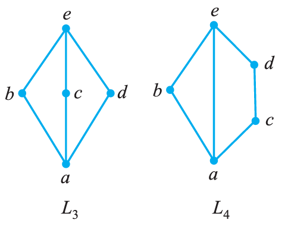
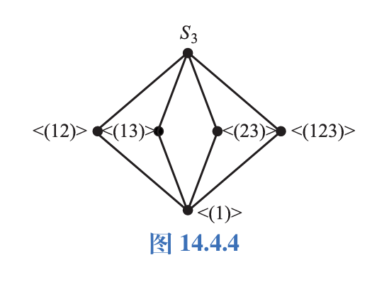
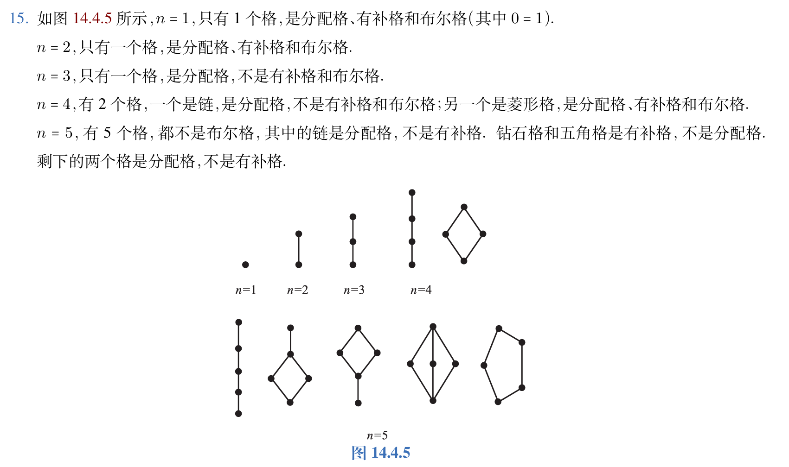
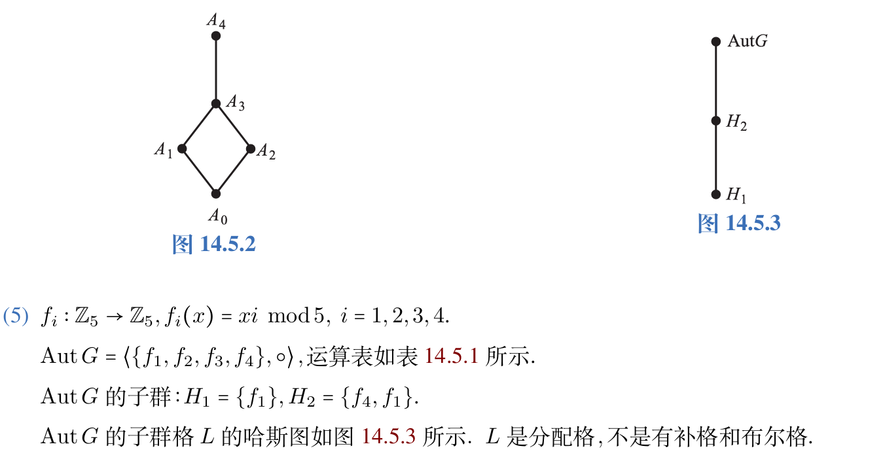

本章记录格、分配格、有补格和布尔代数。阅读时可以把偏序关系、上下确界和集合运算类比起来看。

## 格的定义及性质

首先声明：本章的 $\wedge$ 和 $\vee$ 不是合取和析取，而表示最大下界和最小上界。

下面分别是格在偏序集和代数结构的两个定义。

设 $\langle S,\preccurlyeq \rangle$ 是偏序集，若 $\forall x,y \in S,\lbrace{}x,y\rbrace$ 均有最小上界和最大下界，则 $S$ 关于 $\preccurlyeq$ 构成一个格。

设 $\langle S,*,\circ \rangle$ 是代数系统， $*$ 和 $\circ$ 是二元运算，若 $*$ 和 $\circ$ 满足交换律、结合律和吸收律，则 $\langle S,*,\circ \rangle$ 构成一个格。

幂等律可以由吸收律推导出，因此不要求。

最小上界和最大上界是唯一的。

定义：集合 $B$ 的幂集 $P(B)$ 关于 $\subseteq$ 构成一个格，称 $\langle P(B),\subseteq \rangle$ 为 $B$ 的幂集格。

定义：$G$ 是群， $L(G)$ 是其所有子群的集合，即 $L(G)=\lbrace{}H | H \leqslant G\rbrace$。 其关于 $\subseteq$ 构成一个格，易得 $H_1 \wedge H_2=H_1 \cap H_2,H_1 \vee H_2=\langle H_1 \cup H_2 \rangle$。

数据仓库：使用物化视图，采用格的结构。

设 $p$ 为含有格中元素以及符号 $=,\preccurlyeq,\succcurlyeq,\wedge,\vee$ 的命题，令 $p^*$ 是将 $p$ 中的 $\preccurlyeq$ 替换为 $\succcurlyeq,$ 将 $\succcurlyeq$ 替换为 $\preccurlyeq,$ 将 $\wedge$ 替换为 $\vee,$ 将 $\vee$ 替换为 $\wedge$ 所得到的命题，则称 $p^*$ 为 $p$ 的对偶命题。

对偶原理：若 $p$ 对一切格为真，则 $p^*$ 也对一切格为真。

于是，我们能推出下列定理。

设 $\langle L,\preccurlyeq \rangle$ 是格，则运算 $\vee$ 和 $\wedge$ 满足交换律、结合律、幂等律和吸收律。

- (1) $\forall a,b \in L,a \vee b=b \vee a,a \wedge b=b \wedge a$。
- (2) $\forall a,b,c \in L,(a \vee b) \vee c=a \vee (b \vee c),(a \wedge b) \wedge c=a \wedge (b \wedge c)$。
- (3) $\forall a \in L,a \vee a=a,a \wedge a=a$。
- (4) $\forall a,b \in L,a \vee (a \wedge b)=a,a \wedge (a \vee b)=a$。

从而推出以下定理：

设 $\langle S,*,\circ \rangle$ 是具有两个二元运算的代数系统，且 $*$ 和 $\circ$ 运算满足交换律、结合律和吸收律，则可以适当定义 $S$ 上的偏序 $\preccurlyeq,$ 使得 $\langle S,\preccurlyeq \rangle$ 构成一个格，且 $\forall a,b \in S,a \wedge b=a*b,a \vee b=a \circ b$。

我们还有关于格的一些运算性质，设 $L$ 是格。

- (1) $\forall a,b \in L,a \preccurlyeq b \Leftrightarrow a \wedge b=a \Leftrightarrow a \vee b =b$。
- (2) $\forall a,b,c,d \in L,$ 若 $a \preccurlyeq b,c \preccurlyeq d,$ 则 $a \wedge c \preccurlyeq b \wedge d,a \vee c \preccurlyeq b \vee d$。
- (3) $\forall a,b,c \in L,a \vee (b \wedge c) \preccurlyeq (a \vee b) \wedge (a \vee c)$。

设 $\langle L,\wedge,\vee \rangle$ 是格， $S$ 是 $L$ 的非空子集，若 $S$ 关于 $L$ 中的运算 $\wedge$ 和 $\vee$ 仍构成格，则称 $S$ 是 $L$ 的子格。

子格仍然满足原格中的性质，比如 $e \wedge f=c,c \notin S_1,$ 则 $S_1$ 不是子格。

## 分配格、有补格和布尔代数

设 $\langle L,\wedge,\vee \rangle$ 是格，若 $\forall a,b,c \in L$ 有

$$
a \wedge (b \vee c)=(a \wedge b) \vee (a \wedge c),\quad a \vee (b \wedge c)=(a \vee b) \wedge (a \vee c)
$$

成立，则称 $L$ 为分配格。

如图 $L_3$ 所示的哈斯图称为钻石格，若图 $L_4$ 所示的哈斯图称为五角格。

钻石格的特点是三条单链，五角格的特点是一条单链和一条双链，因此中间那条连不连无所谓。

我们给出以下定理，设 $L$ 是格：

- (1) $L$ 是分配格当且仅当 $L$ 中不含与钻石格和五角格同构的子格。
- (2) 小于五元的格都是分配格
- (3) 任何一条链都是分配格
- (4) $L$ 是分配格当且仅当 $\forall a,b,c \in L,a \vee b=a \vee c,a \wedge b=a \wedge c,$ 则 $b=c$。

若要用定义证明分配格，只需证明其中一个等式。

为引入有补格的概念，我们先介绍以下概念：

设 $L$ 是格，若存在 $a \in L$ 使得 $\forall x \in L,a \preccurlyeq x,$ 则称 $a$ 为 $L$ 的全下界，若存在 $b \in L$ 使得 $\forall x \in L,x \preccurlyeq b,$ 则称 $b$ 为 $L$ 的全上界。

若存在全下界或全上界，则一定是唯一的。我们通常将全下界记为 $0,$ 全上界记为 $1$。

设 $L$ 为格，若 $L$ 存在全下界和全上界，则称其为有界格，并将 $L$ 记作 $\langle L,\wedge,\vee,0,1 \rangle$。

在有界格中， $0$ 是关于 $\wedge$ 的零元， $\vee$ 的单位元； $1$ 是关于 $\wedge$ 的单位元， $\vee$ 的零元。若对偶命题中存在 $0,$ 则要把它换成 $1$； 反之则要换成 $0$。

设 $\langle L,\wedge,\vee,0,1 \rangle$ 为有界格， $a \in L,$ 若存在 $b \in L,a \wedge b=0,a \vee b=1,$ 则称 $b$ 为 $a$ 的补元。

补元是相互的。

对于 $\wedge$ 和 $\vee$ 运算，若两个数可比，则一定在它们之间，反之则沿着哈斯图向上或者向下走。

在任何有界格中， $0$ 和 $1$ 都是互补的，其他元素可能有补元，也可能没有补元；有补元时可能唯一，也可能不唯一。对于有界分配格，如果它的元素存在补元，则其唯一。

定理：设 $\langle L,\wedge,\vee,0,1 \rangle$ 是有界分配格，若 $a \in L,$ 且对于 $a$ 存在补元 $b,$ 则 $b$ 是 $a$ 的唯一补元。

设 $\langle L,\wedge,\vee,0,1 \rangle$ 是有界格，若 $\forall a \in L,a$ 在 $L$ 中都存在补元，则称其为有补格。

若一个格是有补分配格，则称它为布尔格或布尔代数。

设 $\langle B,*,\circ \rangle$ 是代数系统， $*$ 和 $\circ$ 是二元运算。若 $*$ 和 $\circ$ 满足：

- (1) 交换律， $\forall a,b \in B,a*b=b*a.a \circ b=b \circ a$。
- (2) 分配律， $\forall a,b,c \in B,a*(b \circ c)=(a*b)\circ (a*c)$。
- (3) 同一律，存在 $0,1 \in B,\forall a \in B,a*1=a,a \circ 0=a$。
- (4) 补元律， $\forall a \in B,$ 存在 $a' \in B,a*a'=0,a \circ a'=1$。

则称 $\langle B,*,\circ \rangle$ 是布尔代数。

有补格中每个元素都存在唯一的补元，可以把求补元的运算当做布尔代数中的一种一元运算，记作 $\langle B,\wedge,\vee,',0,1 \rangle$。对任意 $a \in B$，$a'$ 是 $a$ 的补元。

布尔代数有以下性质：

设 $\langle B,\wedge,\vee,',0,1 \rangle$ 是布尔代数，则有：

- (1) $\forall a \in B,(a')'=a$。
- (2) $\forall a,b \in B,(a \wedge b)'=a' \vee b',(a \vee b)'=a' \wedge b'$。

(1) 称为双重否定律， (2) 称为德摩根律。

德摩根律对于有限个元素都是正确的。

$B$ 是任意集合， $B$ 的幂集格 $\langle P(B),\cap,\cup,\sim,\emptyset,B \rangle$ 构成布尔代数，称作集合代数。

设 $L$ 是格， $0 \in L,0 \neq a \in L$。 若 $\forall b \in L,$ 当 $0 \prec b \preccurlyeq a,b=a$。 称 $a$ 为 $L$ 中的原子。

于是有以下定理：

- (1) 设 $B$ 是有限布尔代数， $A$ 是 $B$ 的全体原子组成的集合，则 $B$ 同构于 $A$ 的幂集代数 $P(A)$。
- (2) 任何有限布尔代数的基数为 $2^n$。
- (3) 任何等势的有限布尔代数都是同构的

下面整理一些容易漏条件的题目。

1. 判断是不是布尔代数，先判断是不是格。

判断是不是格，先考虑是否其下界可比。

证明子格也要先证非空，然后证明对 $\wedge$ 和 $\vee$ 封闭(或是运算律)。

如果是链，只有 $0$ 和 $1$ 有补元。

2. 求证：

- (1) $(a \wedge b) \vee b=b$。
- (2) $(a \wedge b) \vee (c \wedge d) \preccurlyeq (a \vee c) \wedge (b \vee d)$。

这类题通常分别证明两边互相小于等于。

证明：(1) 易知 $(a \wedge b) \vee b \succcurlyeq b$，又由于 $b \succcurlyeq b,b \succcurlyeq (a \wedge b)$，得

$$
(a \wedge b) \vee b \preccurlyeq b
$$

因此 $(a \wedge b) \vee b=b$。
- (2) 由于 $a \wedge b \preccurlyeq a \preccurlyeq a \vee c,a \wedge b \preccurlyeq b \preccurlyeq b \vee d$，得

$$
a \wedge b \preccurlyeq (a \vee c) \wedge (b \vee d)
$$

同理有

$$
c \wedge d \preccurlyeq (a \vee c) \wedge (b \vee d)
$$

因此

$$
(a \wedge b) \vee (c \wedge d) \preccurlyeq (a \vee c) \wedge (b \vee d)
$$

3. 给定 $\mathrm{lcm},\mathrm{gcd}$ 是布尔代数。

4. 画出三元对称群 $S_3$ 的子群格。

答案：如图所示。

5. 设 $L$ 为格，若 $a_1 \wedge a_2 \wedge a_3 \ldots a_n=a_1 \vee a_2 \vee a_3 \ldots a_n,$ 则 $a_1=a_2 \ldots a_n$。

6. 设 $\langle L,\preccurlyeq \rangle$ 是格，任取 $a \in L,$ 令 $S=\lbrace{}x \in L | x \preccurlyeq a\rbrace$。 求证：$\langle S,\preccurlyeq \rangle$ 是 $S$ 的子格。

仍然按子格的证明结构来写：先证非空，再证对 $\wedge$ 和 $\vee$ 封闭。

证明：由于 $a \in S,$ 因此 $S$ 非空。
$\forall x,y \in S,x \preccurlyeq a,y \preccurlyeq a,$ 因此 $x \vee y \preccurlyeq a \preccurlyeq a=a,x \wedge y \preccurlyeq a,$ 从而有关于这两种运算封闭，即为子群。

7. 给定下列集合和运算，判断是哪一类代数系统。

- (1) $S_1=\lbrace1,\frac{1}{2},2,\frac{1}{3},3,\frac{1}{4},4\rbrace,*$ 为普通乘法。

答案：不是代数系统，因为不封闭。

8. $S_4=\lbrace1,2,3,6\rbrace,\forall x,y \in S,x \circ y$ 和 $x*y$ 分别表示求最大公因数和最小公倍数。
答案：是格，也是布尔代数。这两个运算满足交换律和结合律，求最小公倍数运算的单位元是 $1,$ 求最大公因数的单位元是 $6,$ 满足同一律和补元律。

9. 设 $B$ 是布尔代数，则

$$
\forall a,b \in B,\quad a \preccurlyeq b \Leftrightarrow a \wedge b'=0 \Leftrightarrow a' \vee b=1
$$

9. 对于 $n=1,2,3,4,5,$ 给出所有不同构的 $n$ 元格。

下图按元素个数列出所有非同构情形：

10. 设 $B=\langle \wedge,\vee,',0,1 \rangle$ 是布尔代数，在 $B$ 上定义二元运算 $\oplus$

$$
\forall x,y \in B,\quad x \oplus y=(x \wedge y') \vee (x' \wedge y)
$$

问：$\langle B,\oplus \rangle$ 能否构成代数系统？如果能，指出是哪一种代数系统。

证明：是群，易知原运算是封闭的。

下面证明结合律

$$
\begin{align*}
(x \oplus y) \oplus z & =((x \wedge y') \vee (x' \wedge y)) \oplus z \\\\
& = (((x \wedge y') \vee (x' \wedge y)) \wedge z') \vee (((x \wedge y') \vee (x' \wedge y))' \wedge z) \\\\
& = (x \wedge y' \wedge z') \vee (x' \wedge y \wedge z') \vee (x' \wedge y' \wedge z) \vee (x \wedge y \wedge z) \\\\
\end{align*}
$$

$$
\begin{align*}
x \oplus (y \oplus z) & =x \oplus ((y \wedge z') \vee (y' \wedge z)) \\\\
& =(x' \wedge ((y \wedge z') \vee (y' \wedge z))) \vee (x \wedge ((y \wedge z') \vee (y' \wedge z))') \\\\
& = (x \wedge y' \wedge z') \vee (x' \wedge y \wedge z') \vee (x' \wedge y' \wedge z) \vee (x \wedge y \wedge z) \\\\
\end{align*}
$$

同时有， $0$ 是单位元， $x$ 的逆元就是其自身，因此是群。

11. 设 $B$ 是布尔代数， $\forall a,b,c \in B,$ 若 $a \preccurlyeq c,$ 则有 $a \vee (b \wedge c)=(a \vee b) \wedge c$。

12. 设 $B$ 是布尔代数， $a_1,a_2,\ldots a_n \in B$，则有

$$
(a_1 \vee a_2 \vee \ldots \vee a_n)'=a_1' \wedge a_2' \ldots \wedge a_n',\quad (a_1 \wedge a_2 \ldots \wedge a_n)'=a_1' \vee a_2' \ldots \vee a_n'
$$

13. 设 $B_1,B_2,B_3$ 是布尔代数，证明：若 $B_1 \cong B_2,B_2 \cong B_3,$ 则 $B_1 \cong B_3$。

证明：由于 $f:B_1 \rightarrow B_2,g:B_2 \rightarrow B_3$，因此 $f \circ g:B_1 \rightarrow B_3$ 也是双射。下面证明其为同态映射

$$
\forall x,y \in B_1,\quad f \circ g(x \wedge y)=g(f(x) \wedge f(y))=g(f(x)) \wedge g(f(y))=f \circ g(x) \wedge f \circ g(y)
$$

$$
f \circ g(x')=g(f(x)')=g(f(x))'=f \circ g(x)'
$$

因此其为同态映射，且 $B_1 \cong B_3$。

14. 设 $L=\langle Z_12,\oplus \rangle$ 的子群格，给出 $L$ 的所有 $4$ 元子格。

答案共有

$$
\lbrace\langle 0 \rangle,\langle 4 \rangle,\langle 6 \rangle,\langle 2 \rangle\rbrace,\quad
\lbrace\langle 6 \rangle,\langle 3 \rangle,\langle 2 \rangle,\langle 1 \rangle\rbrace
$$

$$
\lbrace\langle 0 \rangle,\langle 4 \rangle,\langle 3 \rangle,\langle 1 \rangle\rbrace,\quad
\lbrace\langle 0 \rangle,\langle 4 \rangle,\langle 2 \rangle,\langle 1 \rangle\rbrace
$$

$$
\lbrace\langle 0 \rangle,\langle 6 \rangle,\langle 2 \rangle,\langle 1 \rangle\rbrace,\quad
\lbrace\langle 0 \rangle,\langle 6 \rangle,\langle 3 \rangle,\langle 1 \rangle\rbrace
$$

15. 设 $G=\langle Z_5,\oplus \rangle$。令 $G$ 上所有自同构构成的群为 $\mathrm{Aut} \ G,$ 给出其运算表并画出它的子群格 $L$ 的哈斯图。

运算表与子群格如下图所示：

16. 设 $I$ 是格 $L$ 的非空子集，如果满足下列条件，称 $I$ 为理想：

- (i) $\forall a,b \in I,a \vee b \in I$。
(ii) $\forall a \in I,\forall x \in L,x \preccurlyeq a \rightarrow x \in I$。

证明：$I$ 是 $L$ 的子格。

证明：由题意， $I$ 非空且 $\vee$ 封闭，又由于 $\forall a,b \in I,a \wedge b \preccurlyeq a,$ 因此 $a \wedge b \in I$。

17. 在格 $L$ 中，若

$$
\forall a,b,c \in L,\quad a \wedge (b \vee c)=(a \wedge b) \vee (a \wedge c)
$$

求证

$$
\forall a,b,c \in L,\quad a \vee (b \wedge c)=(a \vee b) \wedge (a \vee c)
$$

可以把右侧按已知分配律展开：

证明

$$
\begin{aligned}
(a \vee b) \wedge (a \vee c)
&=((a \vee b) \wedge a) \vee ((a \vee c)\wedge c) \\\\
&=a \vee ((a \wedge c) \vee (b \wedge c)) \\\\
&=(a \vee (a \wedge c)) \vee (b \wedge c) \\\\
&=a \vee (b \wedge c)
\end{aligned}
$$
