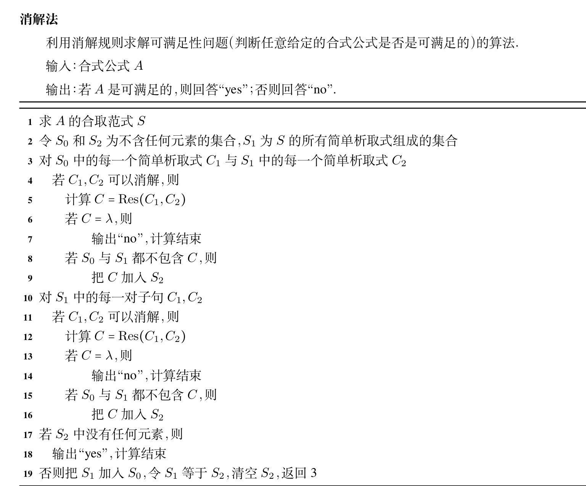

本章记录命题逻辑的等值式、范式、完备集和消解法。核心是把公式变换成更容易判断的形态。

## 等值式

设 $A,B$ 是两个命题公式，若 $A,B$ 构成的等价式 $A \leftrightarrow B$ 为重言式，则称 $A$ 和 $B$ 是等值的，记作 $A \Leftrightarrow B,$ 称 $A \Leftrightarrow B$ 为等值式。

$\Leftrightarrow$ 不是联结符，而是元语言符号。

判断 $A$ 与 $B$ 是否等值，最直接的方法是看其真值表是否相同。

除了真值表法外，另一个方法：已知等值式代换得到新的等值式。

原理：$A$ 是命题公式，含有命题变项 $p_1,p_2,\ldots,p_n$。 又设 $A_1,A_2,\ldots,A_n$ 是任意的命题公式，对每一个 $i=1,2\ldots,n,$ 把 $p_i$ 换成 $A_i,$ 得到的新命题为 $B$。 若 $A$ 是重言式，则 $B$ 也是重言式。

由重言式代入的命题公式称为等值式模式。下面是常见的等值式模式。

- (1) 双重否定律 $A \Leftrightarrow \neg \neg A$。
- (2) 幂等律 $A \Leftrightarrow A \wedge A,A \Leftrightarrow A \vee A$。
- (3) 交换律 $A \wedge B \Leftrightarrow B \wedge A,A \vee B \Leftrightarrow B \vee A$。
- (4) 结合律 $(A \wedge B) \wedge C \Leftrightarrow A \wedge (B \wedge C),(A \vee B) \vee C \Leftrightarrow A \vee (B \vee C)$。
- (5) 分配律 $A \wedge (B \vee C) \Leftrightarrow (A \wedge B) \vee (A \wedge C),A \vee (B \wedge C) \Leftrightarrow (A \vee B) \wedge (A \vee C)$。
- (6) 德摩根律 $\neg (A \vee B) \Leftrightarrow (\neg A \wedge \neg B),\neg (A \wedge B) \Leftrightarrow (\neg A \vee \neg B)$。
- (7) 吸收律 $A \vee (A \wedge B) \Leftrightarrow A,A \wedge (A \vee B) \Leftrightarrow A$。
- (8) 零律 $A \vee 1 \Leftrightarrow 1,A \wedge 0 \Leftrightarrow 0$。
- (9) 同一律 $A \vee 0 \Leftrightarrow A,A \wedge 1 \Leftrightarrow A$。
- (10) 排中律 $A \vee \neg A \Leftrightarrow 1$。
- (11) 矛盾律 $A \wedge \neg A \Leftrightarrow 0$。
- (12) 蕴涵等值式 $A \rightarrow B \Leftrightarrow \neg A \vee B$。
- (13) 等价等值式 $A \leftrightarrow B \Leftrightarrow (A \rightarrow B) \wedge (B \rightarrow A)$。
- (14) 假言易位 $A \rightarrow B \Leftrightarrow \neg B \rightarrow \neg A$。
- (15) 等价否定等值式 $A \leftrightarrow B \Leftrightarrow \neg A \leftrightarrow \neg B$。
- (16) 归谬论 $(A \rightarrow B) \wedge (A \rightarrow \neg B) \Leftrightarrow \neg A$。

以上都是用元语言符号书写的等值式，每个等值式模式都可以给出无穷多个具体的等值式(又称为代入实例)。

由已知的等值式推演出另外一些等值式的过程称作等值运算，是布尔代数和逻辑代数的重要组成部分。

我们给出置换规则：设 $\Phi(A)$ 是含公式 $A$ 的等值公式， $\Phi(B)$ 是用公式 $B$ 置换 $\Phi(A)$ 中 $A$ 的所有出现后得到的命题公式，则 $\Phi(A) \Leftrightarrow \Phi(B)$。

用等值验算法可以验证两个公式等值，但一般情况下不能验证两个公式不等值。

验证两个公式不等值的办法：

- (1) 真值表
- (2) 观察法，对于某一个赋值是否是一个命题的成真赋值，是另一个的成假赋值。
- (3) 先通过等值演算化为简单情况，再使用观察法。

等值验算中各步得到的等值式所含命题变项可能不一样多。但考虑赋值及其长度时哑元也要考虑在内。

对于实际应用的条件推理题目，我们可以把最终情况写成每个情况的并，然后将不可能的情况化为 $0,$ 得到最后的结果。

## 析取范式和合取范式

命题变项及其否定统称为文字。仅由有限个文字构成的析取式称为简单析取式，仅由有限个文字构成的合取式称为简单合取式。

单个文字既是简单析取式，又是简单合取式。

由有限个简单合取式的析取构成的命题公式称为析取范式，由有限个简单析取式的合取构成的命题公式称为合取范式。这两者统称为范式。

一个命题公式可以是合取范式，也可以是析取范式。

于是，有以下定理：

- (1) 一个简单析取式是重言式当且仅当它同时含某个命题变项和它的否定式。
- (2) 一个简单合取式是矛盾式当且仅当它同时含某个命题变项和它的否定式。
- (3) 一个析取范式是矛盾式当且仅当它的每个简单合取式都是矛盾式。
- (4) 一个合取范式是重言式当且仅当它的每个简单析取式都是重言式。

把命题公式转化为析取范式/合取范式：

- (1) 用蕴涵等值式和等价等值式消去 $\rightarrow$ 和 $\leftrightarrow$。
- (2) 用双重否定律和德摩根律移动否定符
- (3) 使用分配律转化

命题公式的析取范式和合取范式都是不唯一的。

为了使范式唯一，我们给出以下定义：

在含有 $n$ 个命题变项的简单合取式中，若每个命题变相和它的否定项恰好出现一个且仅出现一次，而且命题变项或它的否定式按照下标从小到大或按照字典顺序排列，则称这样的简单合取式为极小项。若是简单析取式，则称为极大项。

所有简单合取式都是极小项的析取范式称为主析取范式，所有简单析取式都是极大项的合取范式称为主合取范式。

任何命题公式都存在与之等值的主析取范式和主合取范式，并且是唯一的。

求主析取范式/主合取范式时，主要处理添项与消去。

求出某公式的主析取范式/主合取范式后，将极小项/极大项都用其名字写出，并且按照下标排列。

在求主析取范式或主合取范式时，一定要先决定极小项/极大项中文字的个数。

我们下面介绍一些主析取范式/主合取范式的应用：

1. 设公式 $A$ 中含 $n$ 个命题变项，其主析取范式含 $s$ 个极小项，则 $A$ 有 $s$ 个成真赋值，它们是下标的二进制表示，其余 $2^n-s$ 个赋值都是成假赋值。反之，对于主合取范式，其 $s$ 个成假赋值， $2^n-s$ 个成真赋值。

2. 判断公式类型：

设公式 $A$ 中有 $n$ 个命题变项，若 $A$ 的主析取范式含全部 $2^n$ 个极小项或其主合取范式有 $0$ 个极大项，则其为重言式；若 $A$ 的主析取范式不含任何极小项或其主合取范式有 $2^n$ 个极大项，则其为矛盾式；若 $A$ 的主析取范式至少含一个极小项或其主合取范式至多含 $2^n-1$ 个极大项，则其为可满足式。

判断时，可以先判断原式的等值是 $1$ 还是 $0$。

3. 处理方案选择问题：化简为主析取范式/主合取范式，然后直接取下标。

4. 二进制半加器和二进制全加器：二进制半加器由输入 $x,y$ ，输出 $h,d$ 构成， $h$ 指的是两者的半和， $d$ 指的是是否进位，二进制半加器不考虑上一位的进位。二进制全加器由输入 $x,y,c'$ 输出 $h,d$ 构成， $c'$ 指的是上一位是否进位。我们可以用两个二进制半加器和一个或门实现二进制全加器。

由主析取范式求主合取范式：主合取范式的极大项的下标是主析取范式中未出现的下标。

$n$ 个命题变项的主析取范式/主合取范式有 $2^{2^n}$ 个。

真值表和主析取范式/主合取范式是描述命题公式的两种等价的标准形式，可以互相确定。

## 联结词的完备集

称 $F:\lbrace0,1\rbrace^n \rightarrow \lbrace0,1\rbrace$ 为 $n$ 元真值函数。

每个真值函数都与位移的一个主析取范式等值。每个主析取范式对应无穷多个等值的命题公式，每一命题公式又有唯一等值的主析取范式。所以每个真值函数对应无穷多个等值的命题公式，每个命题公式又都对应唯一等值的真值函数。

设 $S$ 是一个联结词集合，若任何 $n$ 元真值函数都可以由仅含 $S$ 中的联结词构成的公式表示，那么称 $S$ 是联结词完备集。

定理：$\lbrace\neg,\wedge,\vee\rbrace$ 是联结词完备集。

推论：以下联结词集都是联结词完备集。

- (1) $\lbrace\neg,\wedge,\vee,\rightarrow\rbrace$
- (2) $\lbrace\neg,\wedge,\vee,\rightarrow,\leftrightarrow\rbrace$
- (3) $\lbrace\neg,\wedge\rbrace$
- (4) $\lbrace\neg,\vee \rbrace$
- (5) $\lbrace\neg,\rightarrow \rbrace$

我们介绍一些新的联结词。

- (1) 设 $p,q$ 是两个命题，$p \uparrow q$ 称作 $p,q$ 的与非式，即 $p \uparrow q \Leftrightarrow \neg (p \wedge q)$。$\uparrow$ 称作与非联结词。$p \uparrow q$ 为真当且仅当 $p$ 与 $q$ 不同时为真。
- (2) 设 $p,q$ 是两个命题，$p \downarrow q$ 称作 $p,q$ 的或非式，即 $p \downarrow q \Leftrightarrow \neg (p \vee q)$。$\downarrow$ 称作或非联结词。$p \downarrow q$ 为真当且仅当 $p$ 与 $q$ 同时为假。

定理：$\lbrace\uparrow \rbrace,\lbrace\downarrow\rbrace$ 是联结词完备集。

证明某个集合是联结词完备集，即证明其能表示 $\lbrace\neg,\wedge,\vee\rbrace$。

## 可满足性问题与消解法

众所周知，命题公式的可满足性问题可以由真值表或主析取范式/主合取范式解决，我们这里介绍一种新的方法：消解法。

一般的命题公式的可满足性问题可以归纳为合取范式的可满足性问题。

若一个简单析取式中同时出现某个命题变项和它的否定，那么将其消去。称不含任何文字的简单析取式为空简单析取式，记作 $\lambda,$ 规定其是不可满足的。含有空简单析取式的合取范式是不可满足的。

设 $l$ 是一个文字，记

$$
l^c=
\begin{cases}
\neg p, & l=p, \\\\
p, & l=\neg p
\end{cases}
$$

称 $l^c$ 为文字 $l$ 的补。

用 $S$ 表示合取范式，用 $C$ 表示简单析取式，用 $l$ 表示文字。设 $\alpha$ 是关于 $S$ 中命题变项的赋值，用 $\alpha(l),\alpha(C),\alpha(S)$ 分别表示在 $\alpha$ 下 $l,C,S$ 的值，又设 $S$ 和 $S'$ 是两个合取范式，用 $S \sim S'$ 表示 $S$ 是可满足的当且仅当 $S'$ 是可满足的。

设 $C_1,C_2$ 是两个简单析取式，$C_1$ 含文字 $l$，$C_2$ 含 $l^c$。从 $C_1$ 中删去 $l$，从 $C_2$ 中删去 $l^c$，再将得到的结果析取为一个简单析取式，称这样得到的简单析取式为 $C_1,C_2$ 的消解式或消解结果，记为 $Res(C_1,C_2)$。由 $C_1,C_2$ 得到 $Res(C_1,C_2)$ 的规则称为消解规则。

定理：$C_1 \wedge C_2 \sim Res(C_1,C_2)$。

给定一个合取范式 $S,$ 从其简单析取式开始，重复使用消解规则可以得到一个简单析取式序列。如果 $S$ 是可满足的，得到的所有简单析取式都是可满足的，如果最后得到空简单析取式 $\lambda,$ 那么不是可满足的。

定义：设 $S$ 是一个合取范式， $C_1,C_2,\ldots,C_n$ 是一个简单析取式序列。如果对每一个 $i,1 \ge i \ge n,C_i$ 是 $S$ 中一个简单析取式或者 $C_i$ 是它之前的某两个简单析取式 $C_j,C_k$ 的消解结果，则称此序列是由 $S$ 导出 $C_n$ 的消解序列。当 $C_n=\lambda,$ 时，称其为 $S$ 的一个否证。

因此有以下推论：

- (1) 如果合取范式 $S$ 有否证，那么 $S$ 不是可满足的。
- (2) 设 $S$ 含有简单析取式 $l,$ 从 $S$ 中删去所有包含 $l$ 的简单析取式，再从剩下的简单析取式中删去 $l^c,$ 把这样得到的合取范式记作 $S',$ 则 $S \sim S'$。
- (3) 合取范式 $S$ 是不可满足的当且仅当它有否证。

计算机中的消解算法：

下面整理一些容易漏条件的题目。

1. 求消解结果：只需消一个元。

求否证：不断消解直到出现空简单析取式。

2. 主合取范式的下标是成假赋值。

3. $\uparrow,\downarrow$ 没有结合律。

4. $\wedge,\vee$ 不满足消去律。

5. 用主析取范式判断下列公式的类型：

- (3) $(p \vee q) \rightarrow (q \rightarrow p)$。

解

$$
\begin{aligned}
(p \vee q) \rightarrow (q \rightarrow p)
&=(\neg p \wedge \neg q) \vee (\neg q \vee p) \\\\
&=(p \vee \neg p) \wedge (p \vee \neg q) \vee \neg q \\\\
&=p \vee \neg q \\\\
&=m_0 \vee m_2 \vee m_3
\end{aligned}
$$

于是是可满足式，但不是重言式。

6. 设

$$
A=(p \wedge q) \vee (\neg p \wedge q \wedge r),\quad B=(p \vee (q \wedge r)) \wedge (q \vee (\neg p \wedge r))
$$

判断 $A$ 和 $B$ 是否等值。

解：可以看出

$$
A=m_3 \vee m_6 \vee m_7
$$

且

$$
B=(p \vee q) \wedge (p \vee r) \wedge (q \vee \neg p) \wedge (q \vee r)=M_0 \wedge M_1 \wedge M_2 \wedge M_4 \wedge M_5=m_3 \vee m_6 \vee m_7
$$

于是是等值的。

7. 将公式 $D=p \rightarrow q$ 化成 $\lbrace\uparrow \rbrace$ 上的公式。

先消去蕴涵，再用与非表示否定。

证明

$$
p \rightarrow q=\neg p \vee q=\neg (p \wedge \neg q)=p \uparrow \neg q=p \uparrow (q \uparrow q)
$$

8. 将公式 $E=p \wedge \neg q$ 化成 $\lbrace\downarrow\rbrace$ 上的公式。

同样先把式子改写成只含否定和析取的形式，再用或非表示。

证明

$$
p \wedge \neg q=\neg (\neg p \vee q)=\neg p \downarrow q=(p \downarrow p) \downarrow q
$$

9. 设 $l$ 是一个文字，合取范式 $S$ 中含有简单析取式 $l$。 从 $S$ 中删去所有包含 $l$ 的简单析取式(包含简单析取式 $l$ )本身，再在剩下的简单析取式中删去 $l^c，$ 把这样得到的合取范式记作 $S'$。 求证：$S \approx S'$。

证明这种可满足性等价，关键是说明一边的成真赋值可以扩充或限制为另一边的成真赋值。

证明：设 $\alpha$ 是 $S$ 的成真赋值，则由 $S'$ 的构造方法，则必有 $\alpha(l)=1,\alpha(l^c)=0$。 设 $C'$ 是 $S'$ 的任意一个简单析取式，有 $C=C' \vee l^c$。 由于 $\alpha(l^c)=0,$ 则有 $\alpha(C)=\alpha(C')=1,$ 于是 $\alpha$ 也是 $S'$ 的成真赋值。

设 $\alpha'$ 是 $S'$ 的成真赋值，将其扩充为 $S$ 的成真赋值，方法如下：若 $p$ 在 $S'$ 中出现，则 $\alpha(p)=\alpha'(p),$ 若 $p=l,\alpha(p)=1,$ 若 $p=l^c,\alpha(p)=0$。

于是 $\alpha$ 也是 $S$ 的成真赋值。证毕。

10. 设 $A,B,C$ 是任意的命题公式，证明等值关系有以下性质：

- (1) 自反性：$A \Leftrightarrow A$。
- (2) 对称性：若 $A \Leftrightarrow B,$ 则 $B \Leftrightarrow A$。
- (3) 传递性：若 $A \Leftrightarrow B,B \Leftrightarrow C,$ 则 $A \Leftrightarrow C$。

回到定义，$A \Leftrightarrow B$ 表示 $A \leftrightarrow B$ 为重言式。

证明：(1)

$$
A \leftrightarrow B \Leftrightarrow (\neg A \vee A ) \wedge (A \vee \neg A) \Leftrightarrow 1
$$

- (2)

$$
A \leftrightarrow B \Leftrightarrow (\neg A \vee B) \wedge (\neg B \vee A) \Leftrightarrow (\neg B \vee A) \wedge (\neg A \vee B) \Leftrightarrow B \rightarrow A
$$

由于 $A \leftrightarrow B$ 为重言式，因此证毕。

- (3) 考虑主析取范式。由于 $A \Leftrightarrow B,$ 因此 $A,B$ 有相同的主析取范式；同理 $B,C$ 有相同的主析取范式，因此 $A,C$ 有相同的主析取范式，故 $A \Leftrightarrow C$。

11. 一个排队线路，输入为 $A,B,C,$ 输出为 $F_A,F_B,F_C$。 在同一时刻只能输出一个信号；当同时有 $2$ 个或 $2$ 个以上信号申请输出时，按 $A,B,C$ 的顺序输出。试写出 $F_A,F_B,F_C$ 的表达式。

设 $p,q,r$ 分别表示 $A,B,C$ 有输入。由于优先级为 $A>B>C$，只要 $A$ 有输入就输出 $A$；若 $A$ 无输入而 $B$ 有输入，则输出 $B$；只有 $A,B$ 都无输入且 $C$ 有输入时才输出 $C$。于是

$$
F_A=p,\quad F_B=\neg p\wedge q,\quad F_C=\neg p\wedge\neg q\wedge r
$$

如果展开为主析取范式，则有

$$
F_A=(p \wedge \neg q \wedge \neg r) \vee (p \wedge \neg q \wedge r) \vee (p \wedge q \wedge r) \vee (p \wedge q \wedge \neg r)
$$

$$
F_B=(\neg p \wedge q \wedge r) \vee (\neg p \wedge q \wedge \neg r)
$$

$$
F_C=\neg p \wedge \neg q \wedge r
$$

12. 如果 $C_1,C_2$ 可对多对文字消解，那么其消解结果都是等值的。

只需设出消解文字，并比较不同消解结果的形式。

证明：只需证明对两对文字可以消解。设

$$
C_1=R_1 \vee l_1 \vee l_2,\quad C_2=R_2 \vee l_1^c \vee l_2^c
$$

则有

$$
D_1=R_1 \vee R_2 \vee l_1 \vee l_1^c,\quad D_2=R_1 \vee R_2 \vee l_2 \vee l_2^c
$$

由于 $D_1,D_2$ 都是重言式，自然等值。

13. 设 $S$ 是一个合取范式， $U$ 是一个命题变项集合， $R_U(S)$ 表示实施以下操作后得到的合取范式：对 $S$ 中出现的每一个文字 $l,$ 若 $l$ 的命题变项属于 $U,$ 则将它换成 $l^c$。 证明：$R_U(S) \approx S$。

这题留着思考。
