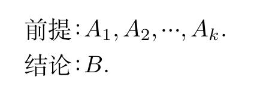

本章整理命题逻辑的推理形式、自然推理系统和消解证明法。重点是分清推理正确与前提真实不是一回事。

## 推理的形式结构

前提是已知的命题公式集合，结论是从前提出发应用推理规则得到的命题公式，推理则是从前提出发推导出结论的思维过程。

设 $A_1,A_2,\ldots,A_k$ 和 $B$ 都是命题公式，若对于 $A_1,A_2\ldots,A_k$ 和 $B$ 中出现的命题变项的任意一组赋值，或者 $A_1 \wedge \ldots \wedge A_k$ 为假，或者当 $A_1 \wedge \ldots \wedge A_k$ 为真时 $B$ 也为真，则称由前提 $A_1,A_2, \ldots,A_k$ 推导出结论 $B$ 的推理是有效的或正确的，并称 $B$ 为有效的结论。

推理是否正确与前提的排列顺序无关。设前提为集合 $\Gamma,$ 将由 $\Gamma$ 推导出 $B$ 的推理记为 $\Gamma \vdash B,$ 若推理正确，则称 $\Gamma \vDash B,$ 反之称为 $\Gamma \nvDash B,$ 这里称 $\Gamma \vdash B$ 为推理的形式结构。

数理逻辑上的推理与生活中的推理不同。生活中的推理需要满足前提正确；而数理逻辑上的推理，如果前提不正确，无论结论正确与否，都称推理正确。

定理：由命题公式 $A_1,A_2,\ldots,A_k$ 推导出 $B$ 的推理正确当且仅当 $A_1 \wedge A_2 \ldots A_k \rightarrow B$ 为重言式。即 $A_1 \wedge A_2 \ldots \wedge A_k \Rightarrow B,$ 其中 $\Rightarrow$ 也是一种元语言符号，表示蕴涵式是重言式。

今后把形式结构写成：

判断是否为重言式：真值表法、等值演算法、主析取范式法。

我们给出一些重要的重言蕴涵式，称作推理定律。下面给出一些：

- (1) 附加律 $A \Rightarrow (A \vee B)$。
- (2) 化简律 $(A \wedge B) \Rightarrow A$。
- (3) 假言推理 $(A \rightarrow B) \wedge A \Rightarrow B$。
- (4) 拒取式 $(A \rightarrow B) \wedge \neg B \Rightarrow \neg A$。
- (5) 析取三段论 $(A \vee B) \wedge \neg B \Rightarrow A$。
- (6) 假言三段论 $(A \rightarrow B) \wedge (B \rightarrow C) \Rightarrow A \rightarrow C$。
- (7) 等价三段论 $(A \leftrightarrow B) \wedge (B \leftrightarrow C) \Rightarrow (A \leftrightarrow C)$。
- (8) 构造性二难 $(A \rightarrow B) \wedge (C \rightarrow D) \wedge (A \vee C) \Rightarrow (B \vee D)$。

其特殊形式：$(A \rightarrow B) \wedge (\neg A \rightarrow B) \Rightarrow B$。

- (9) 破坏性二难 $(A \rightarrow B) \wedge (C \rightarrow D) \wedge (\neg B \vee \neg D) \Rightarrow (\neg A \vee \neg C)$。

具体的命题公式代入某条推理定律后得到这条推理定律的一个代入实例。

上一章给出的等值式每一个都可以产生两个推理定律。

## 自然推理系统

证明是一个描述推理过程的命题公式序列，其中每个公式或者是已知前提，或者是由前面的公式应用推理规则得到的结论(中间结论或推理中的结论)。

一个形式系统 $I$ 由下面的部分组成。

- (1) 非空的字母表 $A(I)$。
- (2) 由 $A(I)$ 中符号构成的合式公式集 $E(I)$。
- (3) 由 $E(I)$ 中一些特殊的公式组成的公理集 $A_X(I)$。
- (4) 推理规则集 $R(I)$。

将I记为四元组 $\langle A(I),E(I),A_X(I),R(I) \rangle,$ 其中 $\langle A(I),E(I) \rangle$ 是 $I$ 的形式语言系统，而 $\langle A_X(I),R(I) \rangle$ 是 $I$ 的形式验算系统。

形式系统一般分为两类。一类是自然推理系统，它的特点是从任意给定的前提出发，应用系统中的推理规则进行推理演算，最后得到的命题公式是推理结论(是有效的结论，可能是重言式，也可能不是重言式)。另一类是公理推理系统，它只能从若干条给定的公理出发，应用系统中的推理规则进行推理演算，得到的结论是系统中的重言式，称为系统中的定理。如标题所示，我们只介绍自然推理系统，它没有第三部分。

自然推理系统 $P$ 定义：

- (a) 字母表：命题变项符号、联结词符号、括号与逗号。
- (b) 合式公式。
- (c) 推理规则((4)-(12)由九条推理定律得到)。
- (1) 前提引入规则：在证明的任何步骤中都可以引入前提。
- (2) 结论引入规则：由证明的任何步骤得到的结论都可以作为后续证明的前提。
- (3) 置换规则：在证明的任何步骤中，命题公式中的子公式都可以用等值的公式置换，得到公式序列中的又一个公式。
- (4) 假言推理规则

$$
\begin{array}{c}
A \rightarrow B  \\\\
\quad \quad A \\\\
\hline
\quad \quad B
\end{array}
$$

- (5) 附加规则

$$
\begin{array}{c}
\quad \quad A  \\\\
\hline
A \vee B  \\\\
\end{array}
$$

- (6) 化简规则

$$
\begin{array}{c}
A \wedge B \\\\
\hline
\quad \ \ \ A \\\\
\end{array}
$$

- (7) 拒取式规则

$$
\begin{array}{c}
A \rightarrow B \\\\
\quad \ \  \neg B \\\\
\hline
\quad \ \ \neg A \\\\
\end{array}
$$

- (8) 假言三段论规则

$$
\begin{array}{c}
A \rightarrow B \\\\
B \rightarrow C \\\\
\hline
A \rightarrow C \\\\
\end{array}
$$

- (9) 析取三段论规则

$$
\begin{array}{c}
A \vee B \\\\
\quad \  \neg B \\\\
\hline
\quad \ \ \ A \\\\
\end{array}
$$

- (10) 构造性二难推理规则

$$
\begin{array}{c}
A \rightarrow B \\\\
C \rightarrow D \\\\
\ \  A \vee C \\\\
\hline
\ \ B \vee D
\end{array}
$$

- (11) 破坏性二难构造规则

$$
\begin{array}{c}
\quad A \rightarrow B \\\\
\quad C \rightarrow D \\\\
\neg B \vee \neg D \\\\
\hline
\neg A \vee \neg C \\\\
\end{array}
$$

- (12) 合取引入规则

$$
\begin{array}{c}
\quad \ \ \ \ A \\\\
\quad \ \ \ \ B \\\\
\hline
A \wedge B
\end{array}
$$

设有前提 $A_1,A_2,\ldots,A_k$，结论 $B$ 和公式序列 $C_1,C_2,\ldots,C_l$。如果每一个 $C_i$ 是某个 $A_j$ 或者可由序列前面的公式应用推理规则得到，并且 $C_l=B$，那么称公式序列是由 $A_1,A_2,\ldots,A_k$ 推导出 $B$ 的证明。

当所有前提为真时，结论必为真。

附加前提证明法：若推理的形式结构具有以下形式 $(A_1 \wedge A_2 \ldots \wedge A_k) \rightarrow (A \rightarrow B),$ 则可转化为 $(A_1 \wedge A_2 \ldots A_k \wedge A) \rightarrow B,A$ 称为附加前提。

归谬法：要证 $(A_1 \wedge A_2 \ldots A_k) \rightarrow B,$ 我们可以转化为求证 $A_1 \wedge A_2 \wedge \ldots \wedge A_k \wedge \neg B$ 为矛盾式。

## 消解证明法

消解证明法只使用前提引入和消解两条规则。

消解证明法是将前提中的公式和结论的否定都转化为等值的合取范式，如果能得到空式，则说明推理正确。

下面整理一些容易漏条件的题目。

1. 若推理正确，用等值演算法方便；反之用主析取范式法更方便。如果命题变项少，用真值表法方便。

2. 前提中若有矛盾式，则推理必然正确。
