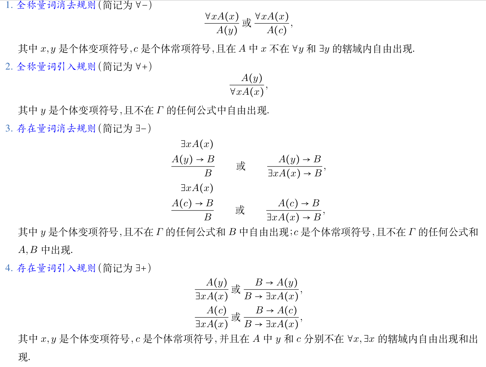
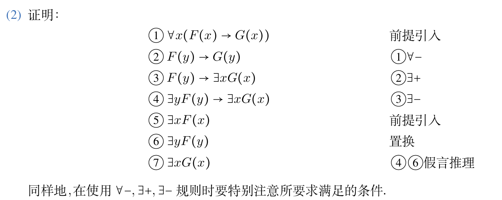
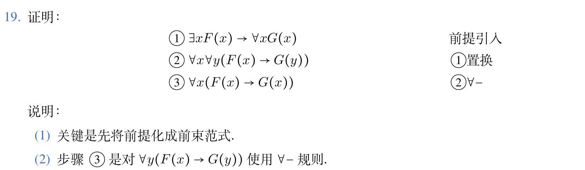

本章整理一阶逻辑等值式、前束范式和推理规则。这里主要保留常用变形和几个证明例子。

## 一阶逻辑等值式与置换规则

有的命题可以有不同的符号化形式。

设 $A,B$ 是一阶逻辑中任意两个公式，若 $A \leftrightarrow B$ 是永真式，则称 $A$ 与 $B$ 等值，记作 $A \Leftrightarrow B,$ 称 $A \Leftrightarrow B$ 是等值式。

我们给出一阶逻辑中的基本等值式：

- (1) 由命题逻辑等值式模式的代换示例给出。
- (2) 消去量词等值式 设个体域是有限集 $D=\lbrace{}a_1,a_2,\ldots,a_n\rbrace,$ 有

$$
\forall xA(x) \Leftrightarrow A(a_1) \wedge A(a_2) \wedge \ldots \wedge A(a_n) \\\\
\exists xA(x) \Leftrightarrow A(a_1) \vee A(a_2) \vee \ldots A(a_n)
$$

- (3) 量词否定等值式 设公式 $A(x)$ 含自由出现的个体变项 $x,$ 则

$$
\neg \forall xA(x) \Leftrightarrow \exists x \neg A(x) \\\\
\neg \exists xA(x) \Leftrightarrow \forall x \neg A(x)
$$

- (4) 量词辖域收缩与扩张等值式

$$
\forall x(A(x) \vee B) \Leftrightarrow \forall xA(x) \vee B. \\\\
\forall x(A(x) \wedge B) \Leftrightarrow \forall xA(x) \wedge B. \\\\
\forall x(A(x) \rightarrow B) \Leftrightarrow \exists xA(x) \rightarrow B \\\\
\forall x(B \rightarrow A(x)) \Leftrightarrow B \rightarrow \forall xA(x) \\\\
\exists x(A(x) \vee B) \Leftrightarrow \exists xA(x) \vee B \\\\
\exists x(A(x) \wedge B) \Leftrightarrow \exists xA(x) \wedge B \\\\
\exists x(A(x) \rightarrow B) \Leftrightarrow \forall xA(x) \rightarrow B \\\\
\exists x(B \rightarrow A(x)) \Leftrightarrow B \rightarrow \exists xA(x) \\\\
$$

- (5) 量词分配等值式

$$
\forall x(A(x) \wedge B(x)) \Leftrightarrow \forall xA(x) \wedge \forall xB(x) \\\\
\exists x(A(x) \vee B(x)) \Leftrightarrow \exists xA(x) \vee \exists xB(x)
$$

这里要看好哪个对哪个是不可分配的。

- (6) 置换规则：设 $\Phi(A)$ 是含公式 $A$ 的公式， $\Phi(B)$ 是用公式 $B$ 取代 $\Phi(A)$ 中所有的 $A$ 之后得到的公式，若 $A \Leftrightarrow B,$ 则 $\Phi(A) \Leftrightarrow \Phi(B)$。

- (7) 换名规则：设 $A$ 为一公式，将 $A$ 中某量词辖域中的一个约束变项的所有出现及相应的指导变元全部改成该量词辖域中未曾出现过的某个个体变项符号，公式中其余部分不变，将所得公式记作 $A',$ 则 $A \Leftrightarrow A'$。

## 一阶逻辑前束范式

具有以下形式 $Q_1x_1Q_2x_2\ldots Q_kx_kB$ 的一阶逻辑公式称作前束范式，其中 $Q_i(1 \le i \le k)$ 为量词， $B$ 为不含量词的公式。

定理：一阶逻辑中的任何公式都存在等值的前束范式。

求前束范式：应用基本等值式，换名。

## 一阶逻辑的推理理论

若以下的蕴涵式形式：$A_1 \wedge A_2 \wedge A_3 \ldots A_k \rightarrow B$ 为永真式，则称推理正确，反之称推理不正确。

在一阶逻辑中称永真式的蕴涵式为推理定律，若一个推理的形式结构是推理定律，则这个推理是正确。

推理定律的以下来源：

- (1) 命题逻辑推理定理的代换示例。
- (2) 由基本等值式生成的推理定律。
- (3) 一些常用的重要推理定律

$$
\forall xA(x) \vee \forall xB(x) \Rightarrow \forall x(A(x) \vee B(x)) \\\\
\exists x(A(x) \wedge B(x)) \Rightarrow \exists xA(x) \wedge \exists xB(x) \\\\
\forall x(A(x) \rightarrow B(x)) \Rightarrow \forall xA(x) \rightarrow \forall xB(x) \\\\
\exists x(A(x) \rightarrow B(x)) \Rightarrow \exists xA(x) \rightarrow \exists xB(x) \\\\
$$

- (4) 四条常用的带条件规则。

若不符合规则要求的条件，将会产生错误的推理。

一阶逻辑自然推理系统：字母表，合式公式，命题逻辑推理规则+四条条件规则。

## 一个电话系统的描述示例

下面整理一些容易漏条件的题目。

1. 对于消去量词的题目，一定要先缩小辖域。消去量词后可能仍存在自由出现的个体变项。如果辖域中不存在不含自由变项的谓词，则无法缩小。

2. 前束范式不唯一。

3. 分配时要看清符号。

4. 自然推理系统：考虑量词的增减。

5. 设个体域 $D=\lbrace{}a,b\rbrace,$ 消去下列公式中的谓词：

- (2) $\forall x \exists y(F(x,y) \rightarrow G(x,y))$。

答案为

$$
((F(a,a) \rightarrow G(a,a)) \vee (F(a,b) \rightarrow G(a,b))) \wedge ((F(b,a) \rightarrow G(b,a)) \vee (F(b,b) \rightarrow G(b,b)))
$$

6. 求下列公式的前束范式。

- (1) $\exists yF(x,y) \wedge \forall xG(x,y,z)$
- (2) $\forall xF(x,y) \leftrightarrow \exists xG(x,y)$。

答案：(1) $\exists v \forall u(F(x,v) \wedge G(u,v,z))$。

- (2)

$$
\exists x_1 \exists x_2 \exists x_3 \exists x_4((F(x_1,y) \rightarrow G(x_2,y)) \wedge (G(x_3,y) \rightarrow F(x_4,y)))
$$

7. 构造下列推理的证明。

前提：$\forall x(F(x) \rightarrow G(x)),\exists xF(x)$。

结论：$\exists xG(x)$。

8. 形如 $\forall x(F(x) \rightarrow G(x))$ 的公式不能用附加前提证明法证明。

一阶逻辑证明中仍然可以采用附加前提证明法和归谬法。

9. 在自然推理系统中 $N_\mathscr{L}$ 中，构造下列推理的证明：

前提：$\exists xF(x) \rightarrow \forall xG(x)$。

结论：$\forall x(F(x) \rightarrow G(x))$。

