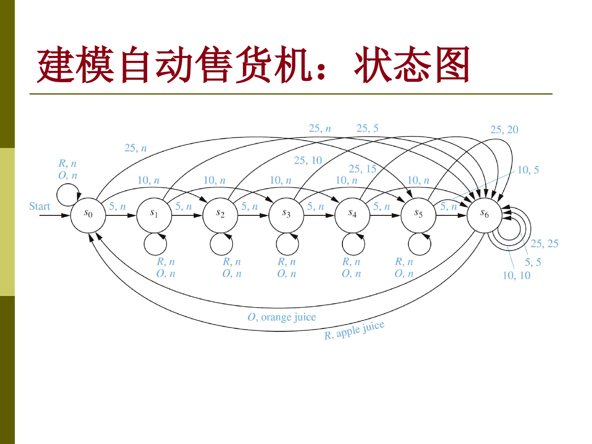
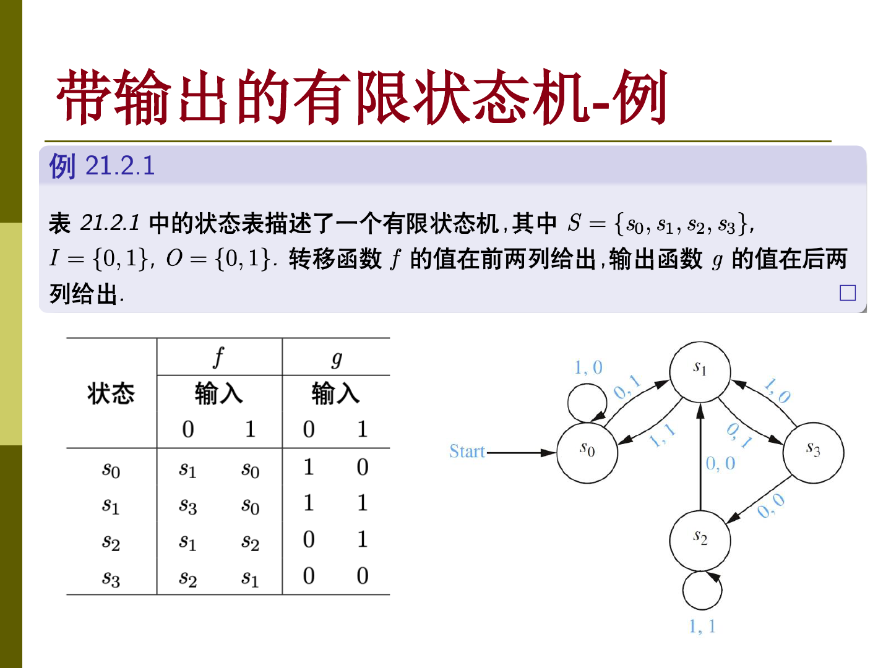

有限状态机适合描述“状态有限，并且下一步只由当前状态和当前输入决定”的系统。带输出的有限状态机不仅会转移状态，还会在读入每个输入时给出一个输出。

## 自动售货机模型

课件用自动售货机作为例子。机器接受 5 分、10 分和 25 分硬币；若总额达到 30 分或超过 30 分，就退还超过的部分。收够 30 分之后，按橙色按钮给橘子汁，按红色按钮给苹果汁。

状态 $s_i$ 表示机器已经收集了 $5i$ 分钱。这样金额变化可以转化为状态变化，而“退钱”和“出饮料”就作为输出。

同一个状态机既可以用状态表表示，也可以用状态图表示。状态图中的边一般标成“输入，输出”的形式。

## 带输出的有限状态机

带输出的有限状态机记作 $M=(S,I,O,f,g,s_0)$ ，其中：

- $S$ 是有限状态集。
- $I$ 是有限输入字母表。
- $O$ 是有限输出字母表。
- $f:S\times I\rightarrow S$ 是转移函数。
- $g:S\times I\rightarrow O$ 是输出函数。
- $s_0\in S$ 是初始状态。

如果输入串为 $x_1x_2\cdots x_n$ ，那么状态序列和输出序列都可以递归得到。设初始状态为 $s_0$ ，读入第 $k$ 个输入后有

$$
s_k=f(s_{k-1},x_k)
$$

同时输出为

$$
y_k=g(s_{k-1},x_k)
$$

所以这个模型关注的是整段输入对应的整段输出，而不只是最终停在哪个状态。

## 状态表与状态图

下面的例子同时给出了状态表和状态图。左边表格把转移函数 $f$ 和输出函数 $g$ 分开列出，右边图把两者合并到边上。

在状态图里，边上的 $1,0$ 可以理解为读入 $1$ 时输出 $0$ ，并沿这条边转移。读图时要注意：输出发生在转移边上，而不是发生在目标状态上。

输出函数也可以扩展到字符串。直观地说，就是把 $f$ 和 $g$ 反复复合，读入一整个输入串后得到一整个输出串。

## 应用和语言接受

有限状态机的应用范围很广。只要系统的“记忆”可以压缩成有限个状态，就可以尝试用状态机描述。

带输出的状态机更像一个 transducer，它把输入串变换成输出串。如果我们只关心某些输入是否被接受，就可以把输出设计成接受与拒绝；下一章会直接去掉输出，引入用终结状态识别语言的有限状态自动机。
