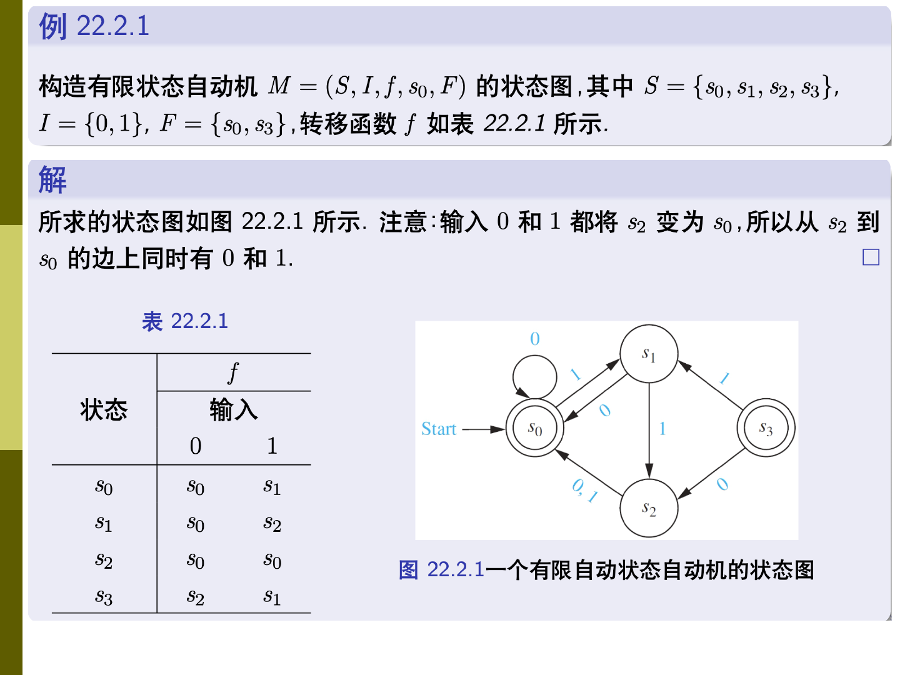
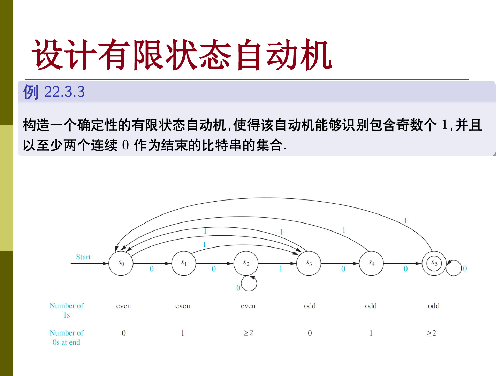
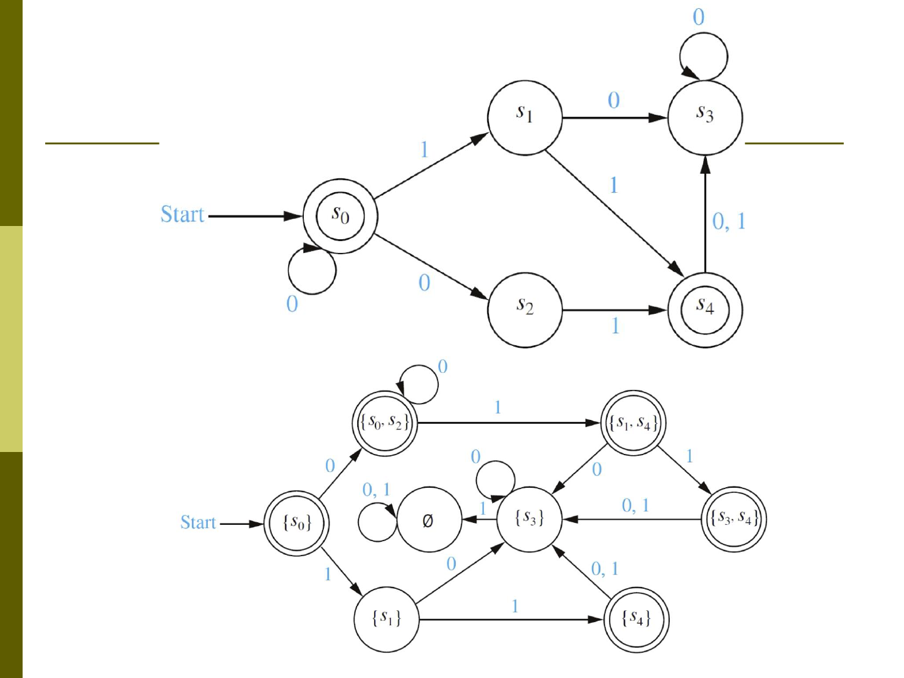

## 字符串集合

设输入字母表为 $I$ 。由 $I$ 中符号组成的有限串构成 $I^*$ ，空串记作 $\lambda$ 。如果 $A$ 是一个字符串集合，那么 $A^n$ 表示把 $A$ 中字符串连接 $n$ 次得到的集合。

Kleene 闭包把所有有限次连接合在一起

$$
A^*=\bigcup_{n\ge 0}A^n
$$

其中 $A^0=\lbrace\lambda\rbrace$ 。它表示“由 $A$ 中元素重复任意有限次”得到的字符串集合。

## 有限状态自动机

有限状态自动机记作 $M=(S,I,f,s_0,F)$ ，其中 $S$ 是有限状态集，$I$ 是输入字母表，$f$ 是转移函数，$s_0$ 是初始状态，$F\subseteq S$ 是终结状态集合。

状态图中，初始状态用 `Start` 箭头指向，终结状态用双圈表示。读入字符串时，自动机从初始状态出发，按字符逐个转移。

转移函数也可以扩展到字符串。设扩展后的函数为 $\hat f$ ，那么先读前缀，再读最后一个字符即可递归定义它。

自动机 $M$ 识别的语言为

$$
L(M)=\lbrace{}w\in I^* \mid \hat f(s_0,w)\in F\rbrace
$$

也就是说，恰好那些读完后停在终结状态的字符串会被接受。

## 设计自动机

状态需要保存足以决定后续转移的信息。识别“包含某个模式”“末尾满足某个条件”“某个计数模 $k$ 为某值”的语言时，状态通常就是这些条件的有限摘要。

证明两个自动机等价，通常是证明它们接受同一个语言。比较直接的做法是构造状态之间的不变关系，说明任意输入前缀读完后，两台自动机处在对应状态，因此最终接受性相同。

## 非确定性有限状态自动机

确定性自动机在每个状态、每个输入下只有一个后继状态。非确定性有限状态自动机中，转移函数的输出是状态集合。

对 NFA 来说，读一个字符串时每一步得到的是一组可能状态。若读完整个字符串后，这组状态中含有至少一个终结状态，就说该字符串被接受。

DFA 可以看作特殊的 NFA。反过来，任意 NFA 也可以用子集构造法转化为 DFA：DFA 的每个状态对应原 NFA 的一个状态子集，转移则对应这些状态在某个输入下能到达的所有状态的并集。

因此，确定性与非确定性有限状态自动机在表达能力上等价，只是 NFA 在很多构造中更简洁。
