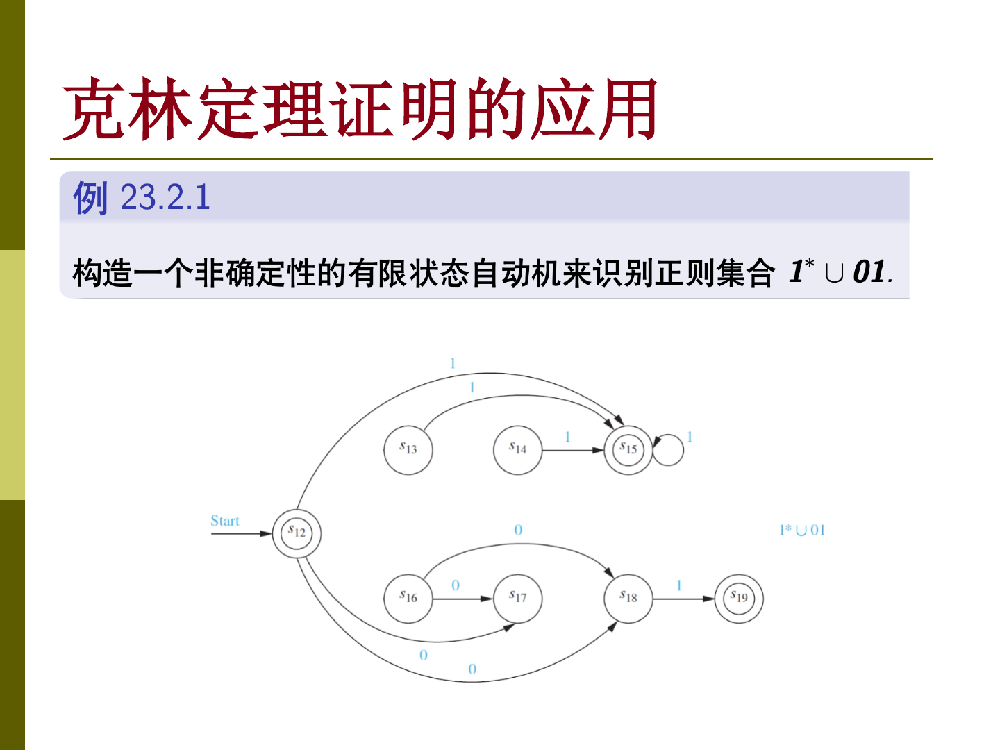

这一章把正则语言、有限状态自动机和正则文法串起来。前面从文法出发生成语言，从自动机出发识别语言；这里要说明这几种描述方式在正则语言层面是等价的。

## 正则集合

正则集合可以看作由最基本的字符串集合出发，通过并、连接和 Kleene 闭包不断构造出来的集合。它通常用正则表达式表示。

正则表达式的基本对象包括空集、只含空串的集合，以及只含单个字符的集合。若 $A$ 和 $B$ 是正则集合，则 $A\cup B$ 、$AB$ 和 $A^*$ 仍然是正则集合。

正则表达式的语义就是把表达式解释成字符串集合。无歧义时可以省略括号，但推导或证明时最好保留必要括号，避免把连接、并和闭包的优先级看错。

例如 $1^*\cup 01$ 表示所有由若干个 $1$ 构成的串，再加上单独的字符串 $01$ 。而 $(0\cup 1)^*01$ 表示所有以 $01$ 结尾的二进制串。

## Kleene 定理

Kleene 定理说明，一个集合是正则的，当且仅当它可以被某个有限状态自动机识别。

这个定理的必要性方向，是从正则表达式构造自动机。由于正则集合由基本集合经并、连接、闭包构造而来，只要分别说明这三种操作在有限状态自动机下封闭，就能完成证明。

充分性方向，是从有限状态自动机反向得到正则表达式。直观上，可以把从某状态到另一个状态的所有路径对应成正则表达式，并逐步消去中间状态。

## 正则文法与正则语言

正则文法的产生式只允许下面几种形状

$$
A\rightarrow \lambda,\qquad A\rightarrow a,\qquad A\rightarrow aB
$$

其中 $A,B$ 是非终结符，$a$ 是终结符。

正则文法生成的语言恰好也是正则集合。这个结论可以从两个方向理解。

从正则文法构造 NFA 时，可以给每个非终结符建一个状态，再额外添加一个终结状态。产生式 $A\rightarrow \lambda$ 表示状态 $A$ 本身可终止，产生式 $A\rightarrow a$ 表示读入 $a$ 后到达额外终结状态，产生式 $A\rightarrow aB$ 表示读入 $a$ 后进入状态 $B$ 。

反过来，从有限状态自动机构造正则文法时，可以把状态看成非终结符，把输入字母表看成终结符。若状态 $A$ 是终结状态，就添加 $A\rightarrow \lambda$ 。若存在从 $A$ 读入 $i$ 到达 $B$ 的转移，就添加 $A\rightarrow iB$ 。

## 有限状态自动机的边界

有限状态自动机的记忆只有有限多个状态，因此它不能识别所有语言。典型例子是

$$
\lbrace0^n1^n \mid n\ge 0\rbrace
$$

反证思路是：若某个 NFA 有 $N$ 个状态并能识别该语言，那么输入 $0^N1^N$ 时，在读前 $N$ 个 $0$ 的过程中必然出现重复状态。于是可以在这段重复状态之间多绕一次，得到 $0^{N+t}1^N$ 也被接受，这与语言定义矛盾。

如果要识别这类需要“无限计数”或“栈式匹配”的语言，就需要更强的模型，比如下推自动机。它比有限状态自动机多了一个栈，因此可以自然处理括号匹配、$a^nb^n$ 这类上下文无关语言。
