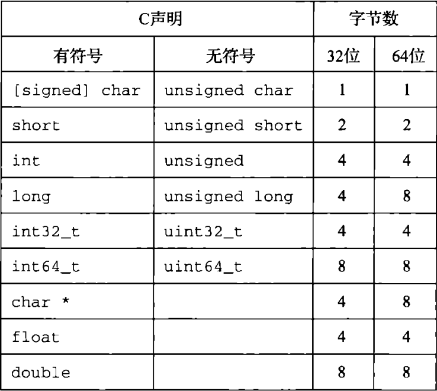
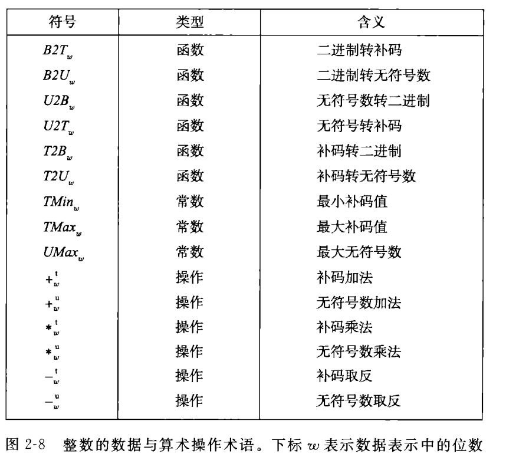
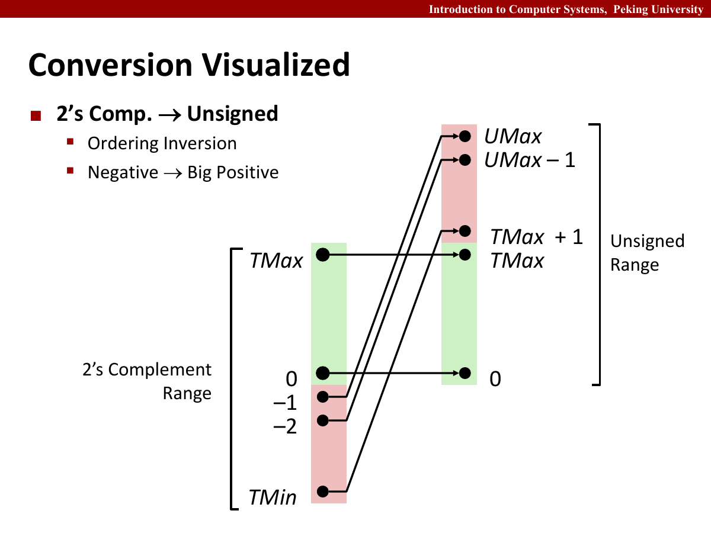
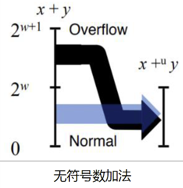
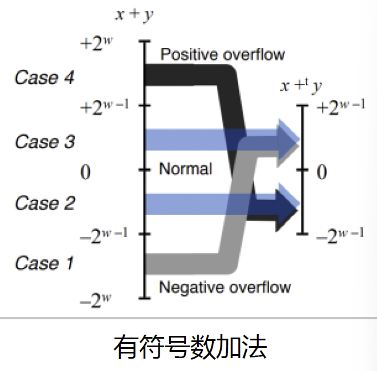
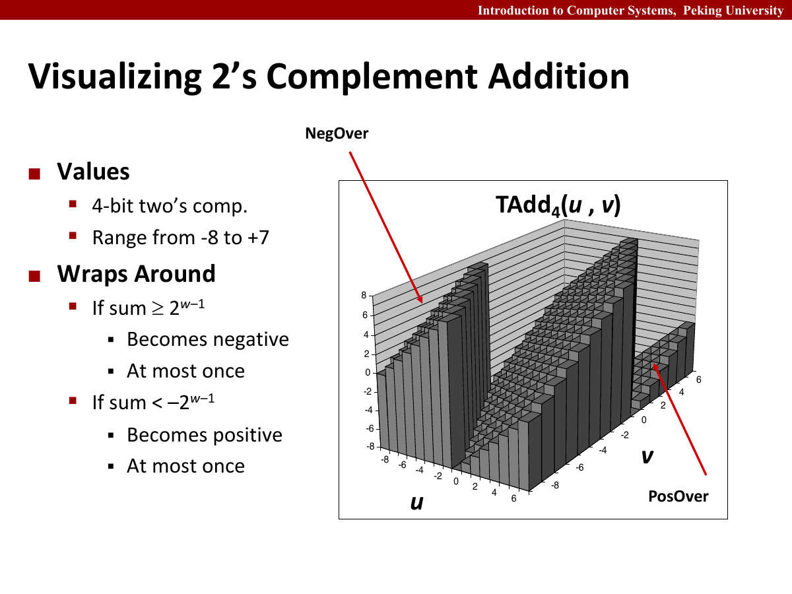
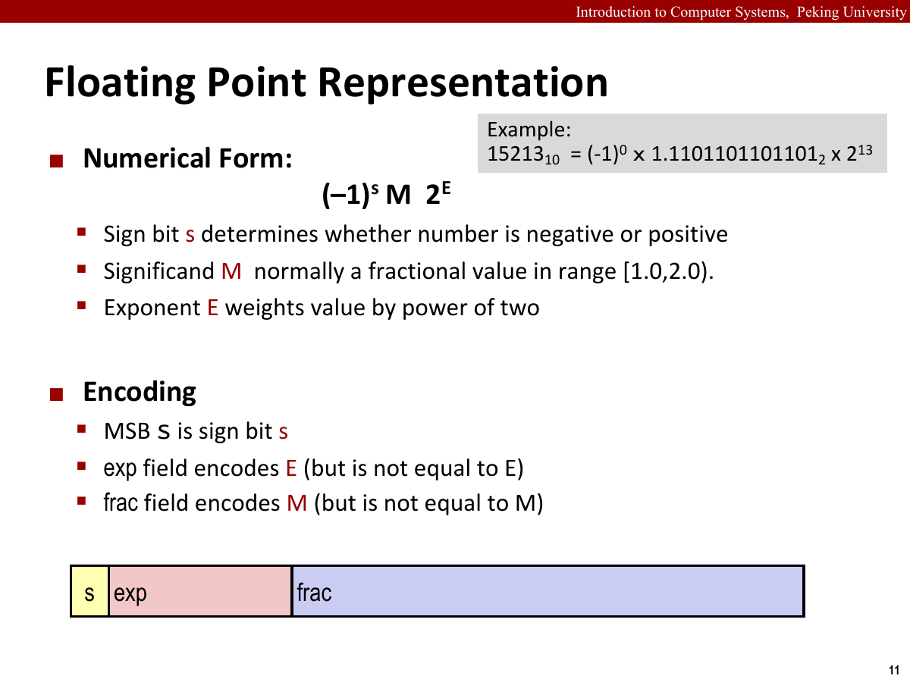
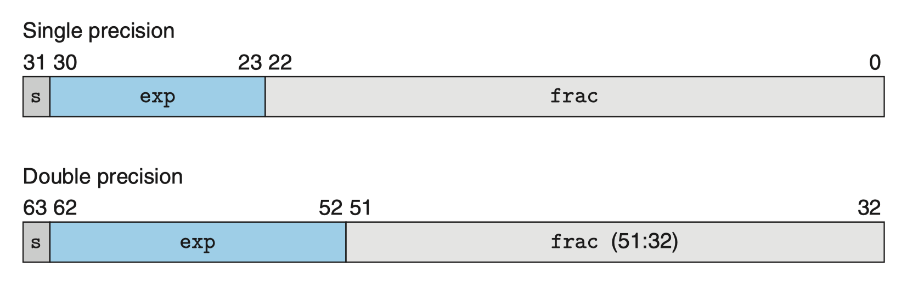
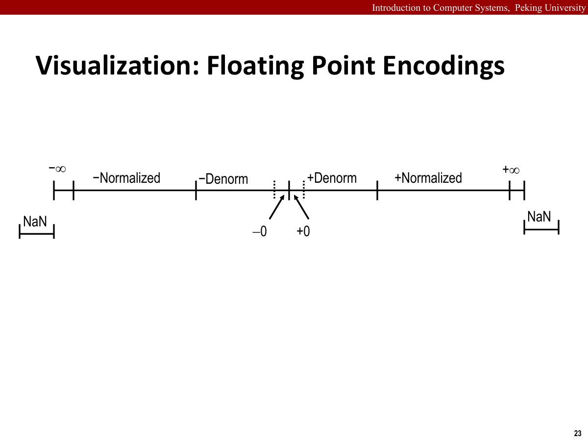

## 信息存储

大多数计算机使用8位的块，或者字节，作为最小的可寻址的内存单位。

机器级程序将内存视为一个非常大的字节数组，称为虚拟内存。

内存的每个字节用唯一的数字标识，称为它的地址。

所有可能地址的集合称为虚拟地址空间。

例如，C 语言中一个指针的值，通常就是某个存储块第一个字节的虚拟地址。

十六进制表示法通常简写为 hex。

以 $0x$ 或 $0X$ 开头的值会被视为十六进制。

以 $0b$ 开头的值会被视为二进制。

如果位总数不是4的倍数，那么最前端可以用0补足。

十六进制数 $0x800$ 对应 $2^{11}$ 这一数值。

字数据大小：每台计算机都有一个字长，表示指针数据的标称大小。

字长决定的最重要系统参数是虚拟地址空间的最大大小。如果字长为 $w$ 位，那么最多可以访问 $0 \sim 2^w-1$ 这一虚拟地址范围，共有 $2^w$ 个字节。

基本 C 数据类型的典型大小：在 32 位和 64 位机器上，``long`` / ``unsigned long`` 分别表示 4 个字节和 8 个字节，而 ``char*`` 分别表示 4 个字节和 8 个字节，注意它与 ``char`` 的区分。

注意：``char`` 也能用来存储具体数值，但它没有固定的符号性。尽管多数实现会把它视为有符号数，但 C 标准并不保证这一点。

注意：``unsigned long`` / ``long unsigned`` 即使补上 ``int``，含义也还是原样。

注意：``float`` 和 ``double`` 分别占用 4 字节和 8 字节，这点在后面会讲到。

基本 C 数据类型的典型大小见下表。



寻址与字节顺序：多字节对象被存储为连续的字节序列，每个对象有唯一的索引，即地址。对象的地址取它所使用字节中的最小地址。标号较小的地址称为低地址，标号较大的地址称为高地址。在多字节数据的存储中，地址的排列方式被称为字节序。

小端法：最低有效字节放在低地址，随后按照有效位从低到高排列。

大端法：最高有效字节放在低地址，随后按照有效位从高到低排列。

另外，还有双端法。

假设一个 32 位整数的值为 ``0x01234567``，起始地址为 ``0x100``，那么两种字节序的内存布局为：

| 地址 | ``0x100`` | ``0x101`` | ``0x102`` | ``0x103`` |
| --- | --- | --- | --- | --- |
| 小端 | ``67`` | ``45`` | ``23`` | ``01`` |
| 大端 | ``01`` | ``23`` | ``45`` | ``67`` |

字节序只改变多字节对象在内存中的排列，不改变寄存器里的数值。它最容易在网络传输、二进制文件解析和反汇编时暴露出来；单字节字符不受影响。

反汇编器：确定可执行程序文件所表示的指令序列的工具。

C 语言中有强制类型转换，这个后面会讲到。

``sizeof``：确定对象使用的字节数，返回一个无符号 ``size_t`` 类型的对象。

表示字符串&表示代码：C 中字符串是一个以 Null 结尾的字符数组。

在使用 ASCII 码的任何系统上都会得到相应的结果，与字节顺序和字大小规则无关，因此比二进制编码有更强的平台独立性。

从机器的角度来看，程序仅仅是字节序列。

布尔代数简介：与、或、非、异或可以进一步拓展到位向量。

例子：用位向量对集合编码。

C 语言中的位级运算：掩码可以用 ``0xFF`` 生成由 ``x`` 的最低有效字节组成的值，即 ``x & 0xFF``。

广义上，掩码通常用于取出某个数中的某些位，我们将在 Lab 中见到这一点。

例如，若要取出 ``x`` 的第 8 到第 15 位，可以先右移 8 位，再保留最低字节：

```c
unsigned byte1 = (x >> 8) & 0xFF;
```

若只想把某一位置 1，可以与掩码做按位或；若想清零，则与掩码的按位取反做按位与。位运算处理的是每一位，逻辑运算处理的则是真假值，二者不能混用。

C 语言中的逻辑运算：逻辑运算很容易和位级运算混淆，即逻辑与(``&&``)，逻辑或(``||``)，与逻辑非(``!``)。

- 所有逻辑运算的值只能是 0 或 1，其将非零数视为真，将零视为假。常用 $!$ 和 $!!$ 将非零数转化为 $1$ 这一规范值，这点在 Lab 中有所体现。
- 对于 ``&&`` 和 ``||``，如果第一个表达式就可以确定结果，那么不会求后续表达式的值，这也被称为短路行为。

C 语言中的移位运算主要分成左移和右移。

- 左移就是在右边补 0。右移分为算术右移和逻辑右移，逻辑右移是在左边补 0，算术右移是在左边补上最高有效位的值。
- 对于非负数，算术右移和逻辑右移的效果是一样的。因此对于无符号数，右移都是逻辑右移；而在 C 中，有符号整数通常是算术右移。

注意：加法与减法的优先级比移位运算高，因此我们需要加上括号。

注意：应该保持位移量小于带位移值的位数。

## 整数表示

下图是我们常用的数学公式与符号：



整型数据类型：注意：``int32_t``、``uint32_t``、``int64_t``、``uint64_t`` 都是固定取值。

同时，正数和负数的取值范围不是对称的。C 语言标准定义了每种数据类型必须能够表示的最小数据范围，而实际实现的范围通常更大。固定大小的数据类型可以保证数值范围与典型数值一致。

无符号数的编码：无符号数编码是唯一的。

补码编码：补码的最高位带有 $-2^{w-1}$ 的权重。

补码编码是唯一的，并且满足关系 $|TMIN|=|TMAX|+1$ 成立。

有符号数的其他两种表示方法：

- 反码：最高有效位具有 $-(2^{w-1}-1)$ 这一权重，其余位与补码相同。
- 原码：最高有效位是符号位，数值符号由 $(-1)^x$ 决定。浮点数的符号位使用这一思路。

有符号数和无符号数之间的转换：注意：强制类型转换的结果保持位值不变，只是改变了解释这些位的方式。

- 补码转化为无符号数：负数加上模数 $2^w$ 后得到对应无符号值，非负数不变。
- 无符号数转化为补码：高于 $TMax$ 的数减去模数 $2^w$ 后得到对应补码值，反之不变。



C 语言中的有符号数和无符号数：C 语言自动将常量视为有符号的，因此在创建无符号常量时，需要在后面加上 ``U``。有符号数和无符号数之间可以发生转换：

- 隐式转换：当一种类型的表达式被赋值给另一种类型的表达式
- 显式转换：强制类型转换
- 特殊的隐式转换：当一个运算中，一个运算数是有符号的而另一个是无符号的，那么会将有符号参数转换为无符号参数

这种隐式转换会直接改变比较结果。例如在 32 位机器上，``-1 < 0U`` 为假，因为 ``-1`` 会先被解释为无符号数 ``4294967295U``。``sizeof`` 返回的 ``size_t`` 也是无符号类型，因此下面的倒序循环在 ``i`` 减到 0 后还会继续绕回最大值：

```c
for (size_t i = n - 1; i >= 0; --i) {
    /* ... */
}
```

更稳妥的写法是 ``for (size_t i = n; i-- > 0;)``，或者在确实需要负数时改用合适的有符号类型。

扩展一个数字的位表示，就是把它从较小的数据类型转换到较大的类型：

- 无符号数的零拓展：直接在左边加0
- 补码数的符号拓展：在左边重复最高有效位

例如，把 16 位 ``short`` 的位模式 ``0xCFC7`` 转为 32 位 ``int`` 时需要符号扩展，结果为 ``0xFFFFCFC7``。若再转成 ``unsigned``，位模式保持不变，只是被解释为一个很大的正数。表达式中的转换顺序会影响最终结果，不能只看两端的类型。

截断数字时，需要减少表示一个数字的位数：

- 截断无符号数：截断为 $k$ 位，相当于直接取模。
- 截断补码数值：先转换为无符号数，然后再截断。

例如，将 ``0x12345678`` 截断为 16 位，只留下 ``0x5678``。若这 16 位随后被解释为 ``short``，最高位为 0，数值仍为正；若结果是 ``0xCDEF``，最高位为 1，它就会被解释为负数。扩展能够保留原数值，截断则只保证保留低位。

关于有符号数和无符号数的建议：下面引入一个例子：

计算(unsigned)0-1：

- 先将1转化为unsigned类型
- 在 32 位无符号整数中，``0 - 1`` 的位模式就是 $0-1 \equiv 2^{32}-1 \pmod{2^{32}} = 0xFFFFFFFF$ 这一结果。

## 整数运算

加法需要重点关注溢出。

- 无符号加法按模 $2^w$ 运算。若数学结果不小于模数 $2^w$ ，保存下来的结果会减去一个 $2^w$ 。
- 检验无符号加法是否溢出：令 ``s = x + y``，当且仅当 ``s < x`` 时发生溢出。
- 补码硬件同样只保留低 $w$ 位。两个正数相加得到负数时发生正溢出，两个负数相加得到非负数时发生负溢出。
- C 语言规定无符号溢出按模运算，但有符号整数溢出属于未定义行为。编译器可以假设它不会发生，因此不能依赖“自然回绕”来编写有符号数代码。



无符号数溢出像绕环。超过最大值后，会对 $2^w$ 取模回到低端，因此一个很大的无符号结果可能突然变小。



补码溢出则要看符号。两个正数相加得到非正数，说明发生正溢出；两个负数相加得到非负数，说明发生负溢出。若两个操作数一正一负，则不会溢出。

直接计算 ``x + y`` 再看符号，在 C 中仍可能先触发未定义行为。实际代码常在运算前检查边界：

```c
bool add_overflow(int x, int y) {
    if (y > 0 && x > INT_MAX - y) return true;
    if (y < 0 && x < INT_MIN - y) return true;
    return false;
}
```



注意：补码加法和无符号数加法都是阿贝尔群。

补码的非有一个特殊边界。

- 若 ``x != INT_MIN``，``x`` 的补码非是 ``-x``。
- 若 ``x == INT_MIN``，``x`` 的补码非是 ``INT_MIN``。

补码相反数有两种等价求法。

- 对二进制取反加1
- 对最右边的1左边的所有部分取反(不包含这个1)

乘法的位级结果只保留低 $w$ 位。

- 无符号乘法：结果满足 $x * y=(x \cdot y) \bmod 2^w$ 这一同余关系。
- 补码乘法：结果满足 $x * y = U2T_w((x \cdot y)\bmod 2^w)$ 这一映射关系。
- 无符号乘法和补码乘法在位上是等价的。
- 乘以常数：乘以 $2^k$ 可以写成左移 $k$ 位；其他常数有时能拆成若干次移位与加减，例如写成 $14x=(x\ll4)-(x\ll1)$ 这一形式。

注意：程序可能在毫无察觉的情况下产生乘法溢出。

除法：在介绍除法之前，我们有以下前提：整数除法总是舍入到零。

- 无符号除法：除以 $2^k$ 等价于逻辑右移 $k$ 位。
- 补码除法：当条件 $x\geq0$ 成立时，可以直接算术右移 $k$ 位；当条件 $x<0$ 成立时，要先加上偏置 $2^k-1$ 再执行算术右移，得到 ``(x + (1 << k) - 1) >> k``。

注意：当除数的幂次比较小时，我们有比较简单的做法，具体见 Lab。

## 浮点数

无论是整数还是小数，在计算机中都由二进制表示。与十进制类似，二进制小数可以定义为

$$
0.x_1x_2\ldots x_k=x_1\times2^{-1}+\ldots+x_k\times2^{-k}
$$

在此基础上，可以采用 IEEE 浮点格式近似表示实数。

IEEE 浮点格式：在 IEEE 浮点格式中，单精度浮点数（``float``）和双精度浮点数（``double``）都分为符号位（``S``）、阶码（``Exp``）和小数字段（``Frac``）：





- 符号位：决定数值的正负。
- 阶码：经过偏置编码后保存指数。
- 小数字段：保存有效数的小数部分。

单精度浮点数有 1 位符号位、8 位阶码和 23 位小数字段；双精度浮点数有 1 位符号位、11 位阶码和 52 位小数字段。

在 IEEE 浮点格式中，有三种情况：

规格化值是最常见的一类。

- 若 ``Exp`` 的位模式既不全为 0，也不全为 1，数值就是规格化值。偏置值 ``Bias`` 使用 $2^{k-1}-1$ 这一数值，其中 $k$ 表示阶码位数；实际指数按 $E=Exp-Bias$ 计算。
- 单精度的 ``Bias`` 为 127，阶码 $Exp$ 位于区间 $[1,254]$ 内，因此实际指数 $E$ 位于区间 $[-126,127]$ 内。
- 小数字段编码为 $f=0.f_{n-1}\ldots f_1f_0$ 这一二进制小数，有效数满足 $M=1+f$ 这一关系。开头的 1 不需要存入位模式，因此称为隐含的 1。
- 规格化值满足关系 $V=(-1)^s\times M\times2^E$ 成立。

非规格化值用于贴近零附近的表示。

- 若 ``Exp`` 的位模式全为 0，即为非规格化的值。此时使用 $E=1-Bias$ 作为实际指数。
- 在单精度中，实际指数 $E$ 等于 -126。
- 有效数不再带隐含的 1，而是使用 $M=f$ 这一形式。这样既能表示 0，也能让最小规格化数和最大非规格化数平滑衔接。
- 若小数字段也为 0，则根据符号位分成正零和负零。

剩下的一类是特殊值。

- 若 ``Exp`` 的位模式全为 1，数值属于特殊值。
- 当小数字段全为 0 时，根据符号位分成正无穷与负无穷。
- 当小数字段非 0 时，结果为 Not a Number（``NaN``），例如计算 $\sqrt{-1}$ 时，或者求值 $0/0$ 时，结果都没有对应的普通实数。



以 ``float`` 数值 ``6.5`` 为例，它处在 $110.1_2=1.101_2\times2^2$ 这一规格化形式中。符号位为 0，阶码取 $2+127=129$ 这一数值，即 ``10000001``；小数字段保存隐含 1 后面的 ``101``，其余位置补 0。因此完整位模式为 ``0 10000001 10100000000000000000000``，也就是 ``0x40D00000``。

单精度中，最小正非规格化数、最大非规格化数和最小正规格化数分别为

$$
2^{-149},\qquad (1-2^{-23})2^{-126},\qquad 2^{-126}
$$

非规格化数让 0 到最小规格化数之间不至于突然断开，这种性质称为渐进下溢。

浮点数比较大体可以沿用普通数值顺序，但有两个特殊情况：

- $-0$ 与 $+0$ 比较相等。
- ``NaN`` 与任何数的有序比较都为假，连 ``NaN == NaN`` 也为假；判断它应使用 ``isnan``。

浮点数运算与舍入：浮点数定义了四种不同的舍入方式，分别是：

- 向零舍入
- 向下舍入
- 向上舍入
- 向偶数舍入，也被称为向最接近的值舍入，也是IEEE的默认方法。即若一个值位于两个要表示的值中间，则将它们舍入到最接近的偶数；反之则舍入到最接近的可表示值。这一点是初学者可能所不理解的。

向偶数舍入只在恰好位于中点时生效。例如保留到整数时，``1.5`` 舍入为 ``2``，``2.5`` 也舍入为 ``2``。这样连续出现中点时不会总向同一方向偏移。

浮点加法先对齐阶码，再对有效数做加减，最后规格化并舍入。对齐过程中，较小操作数的低位可能被直接丢掉，因此浮点加法不满足结合律。例如在单精度下，若 ``x`` 足够大，``(x + 1.0f) - x`` 可能为 0，而 ``x + (1.0f - x)`` 的结果可能不同。

浮点乘法将符号位异或、指数相加、有效数相乘，再完成规格化和舍入。乘法同样可能上溢为无穷，也可能下溢为非规格化数或 0。

IEEE 浮点运算保留交换律，但一般不保留结合律和分配律。编译器在没有启用快速数学优化时，不能随意重新组合这些表达式。

C 语言中的常见浮点转换规则：

- ``int`` 转为 ``float`` 不会溢出，但可能因为有效位不足而被舍入。
- ``float`` 转为 ``double`` 能够保留确切数值；32 位 ``int`` 转为 ``double`` 也能精确表示。
- ``double`` 转为 ``float`` 可能被舍入，也可能溢出为 $+\infty$ 或 $-\infty$ 两个无穷值之一。
- ``float`` 或 ``double`` 转为整数时向零舍入。若结果超出目标整数类型的范围，C 标准不保证结果。
