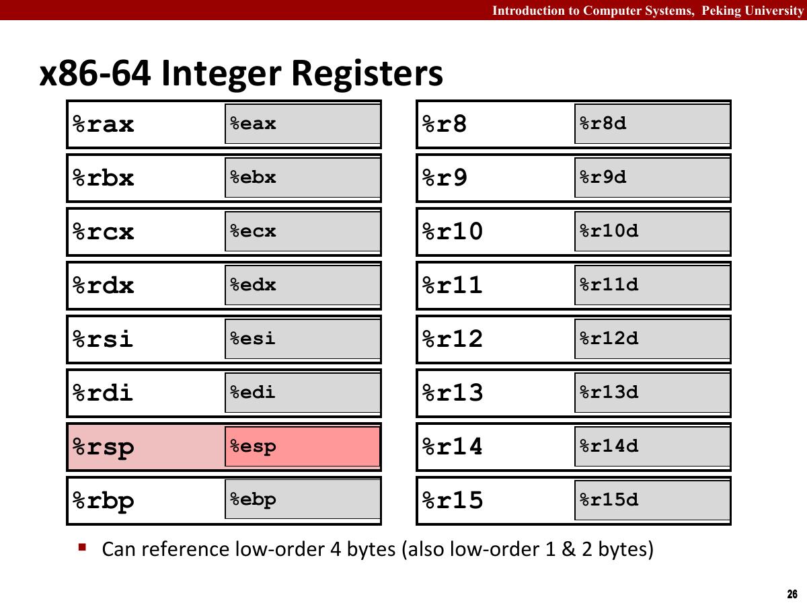
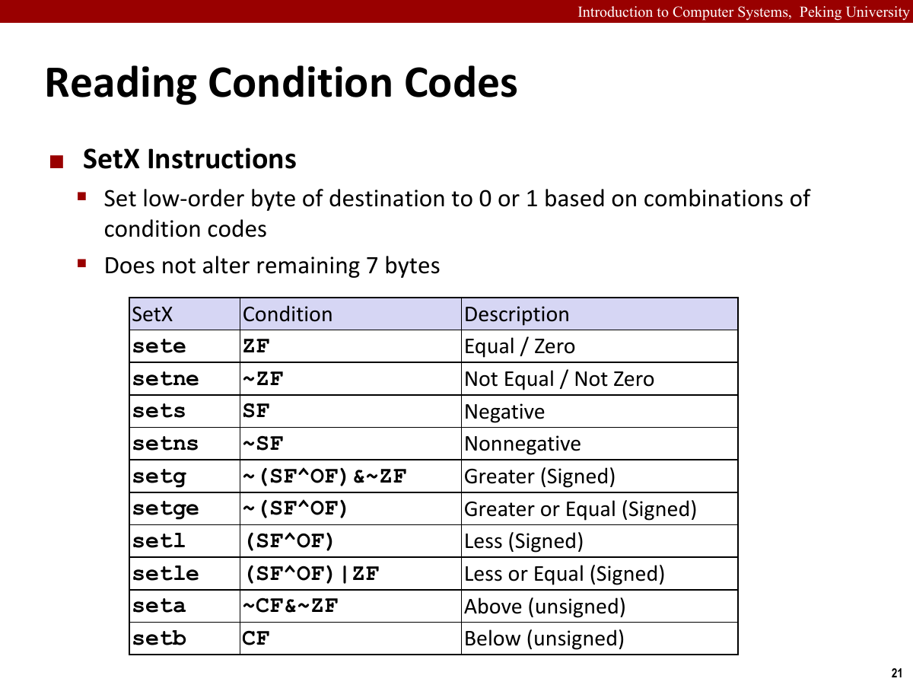
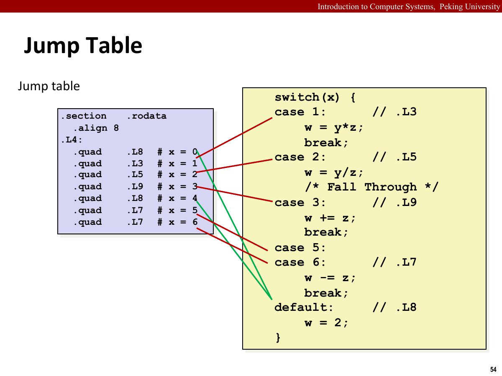
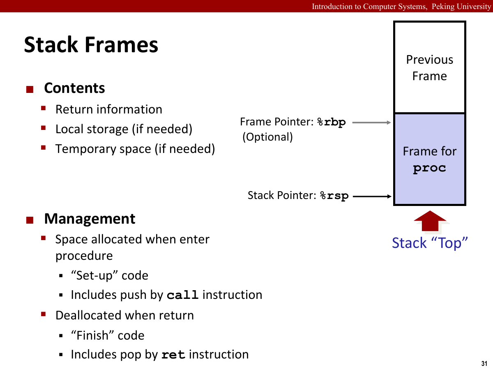
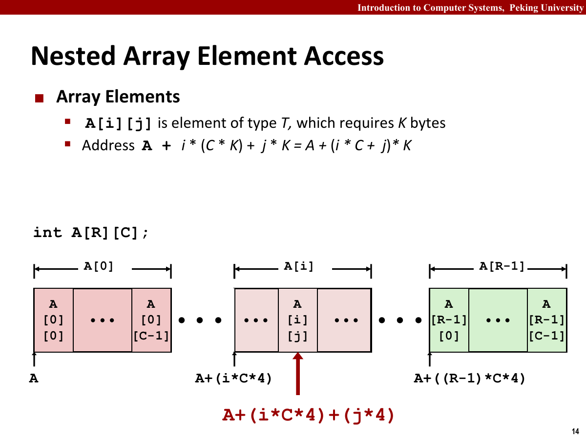
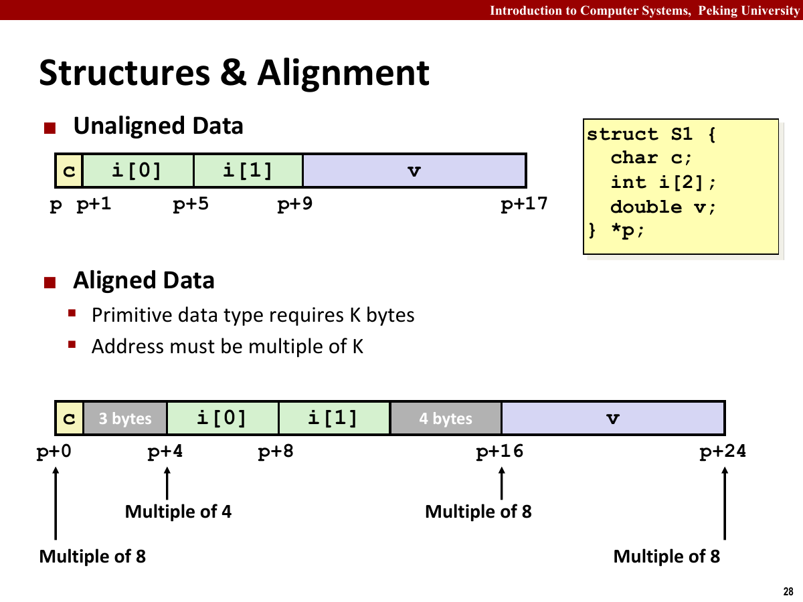
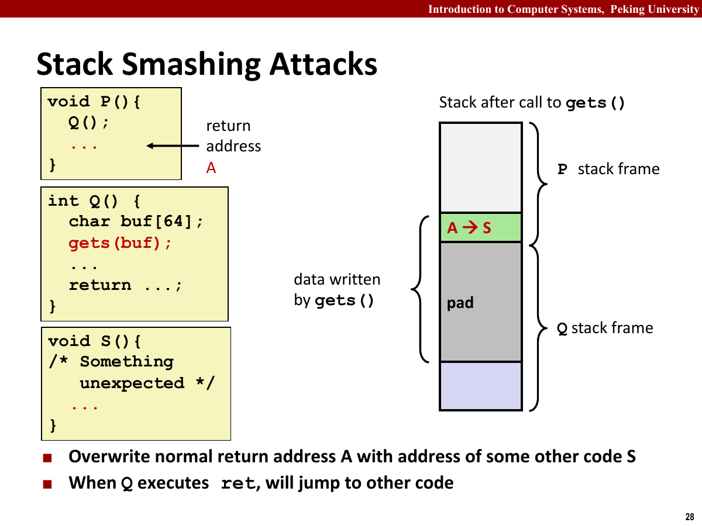

## 历史观点

Intel 处理器的发展历史。

- Intel处理器俗称x86，它利用进步的技术满足更高性能和支持更高级操作系统的需求。
- 每个后继处理器的设计都是后向兼容的，较早版本上编译的代码可以在较新的处理器上运行。
- 这些年来，许多公司生产出了能与Intel处理器兼容的处理器，例如AMD处理器，生产性能稍低但价格更便宜。
- 摩尔定律：1965年提出，未来10年，芯片上的晶体管数量每年都能翻一番。
- 实际：超过50年中，芯片上的晶体管数量每18个月翻一倍。

## 程序编码

程序编码分为以下阶段。

- 预处理器拓展原代码，插入所有头文件，并拓展所有的宏。
- 编译器产生两个源文件的汇编代码。
- 汇编器将汇编代码转化成二进制目标代码文件。
- 目标代码是机器代码的一种形式，包含所有指令的二进制表示，但是还没有填入全局值的地址。
- 链接器将两个目标代码文件与实现库函数的代码合并，产生最终的可执行代码文件。

机器级代码建立在两种重要抽象之上。

- 机器级代码有两种很重要的抽象模型。

第一种抽象来自指令集结构。

- 指令集体系结构/指令集架构/ISA定义了处理器状态、指令的格式，以及每条指令对状态的影响。
- 处理器的硬件并发地执行许多指令，但是可以采取措施保证整体行为与ISA指定的顺序执行的行为完全一致。

第二种抽象来自虚拟地址。

- 机器级程序使用的内存地址是虚拟地址，提供的内存模型看上去是一个巨大的字节数组。存储器系统的实际实现是将多个硬件存储器与操作系统软件组合起来。

汇编代码这一层主要看指令和状态。

- 非常接近于机器代码，但是可读性好。

处理器状态主要保存在以下寄存器中。

- 程序计数器/PC：给出将要执行的下一条指令在内存中的地址，通常用``%rip``表示。
- 整数寄存器：包含16个命名的位置，分别存储64位的值。
- 这些寄存器可以存储地址或整数数据，有的寄存器用来记录重要的程序状态，其他的寄存器用来保存临时数据，例如过程的参数、临时变量、函数返回值等。
- 条件码寄存器：保存最近执行的算术或逻辑指令的状态信息，用于实现控制或数据流中的条件变化。
- 一组向量寄存器可以存放一个或多个整数或浮点数值。

汇编代码的基本特点。

- 汇编代码不区分有符号或者无符号整数，不区分各种类型指针，甚至不区分整数。
- 程序内存包含
  -  程序的可执行机器代码
  -  操作系统需要的一些信息
  -  用来管理过程调用和返回的运行时栈
  -  用户分配的内存块
- 任意给定时刻，只有有限一部分虚拟地址被认为是合法的。
- x86-64的虚拟地址是由64位的字来决定的，但是高16位必须为0.
- 操作系统负责管理虚拟地址空间，将虚拟地址翻译为实际处理器内存中的物理地址。
- 一条机器指令只执行基本操作，比如简单运算，传送数据，或条件分支移动。
- 机器执行的程序只是一个字节序列，是对一系列指令的编码，机器对源代码几乎一无所知。
- 反汇编器：根据机器代码产生一种类似于汇编代码的格式。
- x86-64的指令长度从1到15个字节不等，常用指令以及操作数较少的指令所需的字节数少，不太常用或者操作数多的指令所需的字节数多。
- 设计指令格式的方式：从某个给定位置开始，可以将字节唯一地解码成机器指令。
- 反汇编器只基于机器代码中的字节序列来确定汇编代码，不需要访问源代码或者汇编代码。
- 反汇编器可能会生成挺多指令结尾的后缀，这些后缀是大小指示符，通常可以忽略。
- 生成可执行代码需要对一组目标代码文件运行链接器，目标代码文件中必须要有main函数。main函数不是最初的调用入口，是第二级调用入口。
- 可执行文件包含了两个过程的代码，还包含了用来启动终止程序的代码，以及用来与操作系统交互的代码。
- 链接器的任务之一就是为函数调用找到匹配的函数的可执行代码的位置。
- 返回指令后面可能会出现几行代码，它们对程序没有影响，使函数代码变为16字节，就存储器性能而言，能更好地放置下一个代码块。

Intel 格式和 ATT 格式的差别主要在写法上。

- 我们书上主要介绍ATT格式。
- Intel格式省略了指示大小的后缀。
- Intel格式省略了寄存器名字前面的"%"符号。
- Intel格式用不同的方式来描述内存中的位置。
- 在带有多个操作数的指令情况下，列出操作数的顺序相反。

## 数据格式

- Intel用术语word表示16位数据类型，因此产生双字，四字等。

C 语言基本数据类型在 x86-64 中有对应的表示。

- ``char``：字节，后缀为``b``，大小1字节。
- ``short``：字，后缀为``w``，大小2字节。
- ``int``：双字，后缀为``l``，大小4字节。
- ``long``：四字，后缀为``q``，大小8字节。
- ``char*``：四字，后缀为``q``，大小8字节。
- ``float``：单精度，后缀为``s``，大小4字节。
- ``double``：双精度，后缀为``l``，大小8字节。
- 四字节整数和双精度浮点数不会歧义，因为指令和寄存器不同，详见3.11。

后缀用来表示操作数大小。

- 例如，数据传输指令有四个变种。
- ``movb``：传送字节。
- ``movw``：传送字。
- ``movl``：传送双字。
- ``movq``：传送四字。
- 大多数情况下，x86上加不加q没区别，但是``mov``的一个操作数是立即数，另一个数是内存地址时，一定要写成``movq``。

## 访问信息

- 一个x86-64的中央处理单元/CPU包含一组16个存储64位值的通用目的寄存器。
- 这些寄存器用来存储整数数据和指针。

x86-64 架构中的整数寄存器先按用途记。



- ``%rax``：累加器，返回值，对应有``%eax``，``%ax``，``%al``。
- ``%rbx``：被调用者保存，基址寄存器，对应有``%ebx``，``%bx``，``%bl``。
- ``%rcx``：计数器，第4个参数，对应有``%ecx``，``%cx``，``%cl``。
- ``%rdx``：数据寄存器，第3个参数，对应有``%edx``，``%dx``，``%dl``。
- ``%rsi``：源索引寄存器，第2个参数，对应有``%esi``，``%si``，``%sil``。
- ``%rdi``：目标索引寄存器，第1个参数，对应有``%edi``，``%di``，``%dil``。
- ``%rbp``：被调用者保存，基址指针，对应有``%ebp``，``%bp``，``%bpl``。
- ``%rsp``：栈指针，通常不直接使用，对应有``%esp``，``%sp``，``%spl``。
- ``%r8``：第5个参数，对应有``%r8d``，``%r8w``，``%r8b``。
- ``%r9``：第6个参数，对应有``%r9d``，``%r9w``，``%r9b``。
- ``%r10``：调用者保存，对应有``%r10d``，``%r10w``，``%r10b``。
- ``%r11``：调用者保存，对应有``%r11d``，``%r11w``，``%r11b``。
- ``%r12``：被调用者保存，对应有``%r12d``，``%r12w``，``%r12b``。
- ``%r13``：被调用者保存，对应有``%r13d``，``%r13w``，``%r13b``。
- ``%r14``：被调用者保存，对应有``%r14d``，``%r14w``，``%r14b``。
- ``%r15``：被调用者保存，对应有``%r15d``，``%r15w``，``%r15b``。
- 其中,``r8`` $\sim$ ``%r15``因为拓展为x86-64后才增加，称为拓展寄存器。
- 运算中可能仅访问最低的4个字节，此时寄存器改名为``%eax``等，若访问最低的2个字节，寄存器改名为``%ax``等，若访问最低的1个字节，则改名为``%al``等。
- 生成1或2字节数字的指令会保持剩下的字节不变。
- 生成4字节数字的指令会把高位4个字节置为0。

操作数指示符描述的是数据从哪里来。

- 大多数指令有一个或多个操作数。
- 指示出执行一个操作中要使用的源数据值，以及放置结果的目的位置。
- 分为三种类型：
  - 立即数：即常数值，前面加 `$`。
  - 寄存器：表示某个寄存器的内容，根据低位字节数书写。
  - 内存引用：根据计算出来的地址访问某个位置。

寻址模式将寄存器、立即数和比例因子组合为有效地址。

- 内存操作数使用 $Imm(r_b,r_i,s)$ 这一通式，最终地址按 $Imm+r_b+r_i \cdot s$ 计算。
- 若加括号，则需要到计算出的地址取出对应的值。若未加则为计算出的值。

数据传送主要关注源和目的的位置。

- 即将源操作数的数值复制一份到目的数。

`mov` 类指令负责普通数据传送。

- 通式：``mov src, dst``，表示将``src``传送到``dst``。
- 根据``src``的字节数给``mov``加上合适的后缀，``b/w/l/q``等。
- ``src``，可以是立即数、寄存器或者内存地址。
- ``dst``，可以是寄存器或者内存地址。
- ``src``和``dst``不能都是内存地址。
- 若一定要在内存与内存间传送数据，需要通过寄存器进行。
- 对于``movl``，若``dst``是寄存器，则会将高位4字节设置为0。

`movz` 类指令会做零扩展。

- 通式：``movz src, dst``，表示将``src``零拓展传送到``dst``。
- 根据``src``的字节数与``dst``的字节数给``movz``加上合适的后缀，``bw``等。
- ``src``：寄存器或内存地址。
- ``dst``：寄存器。
- ``src``：为``b``或者``w``。
- ``dst``：比``src``大，但是不存在``lq``。
- ``lq``可以通过``movl``置高位为0的特性实现。

`movs` 类指令会做符号扩展。

- 通式：``movs src, dst``，表示将``src``符号拓展传送到``dst``。
- ``src``：寄存器或内存地址。
- ``dst``：寄存器。
- ``src``：为``b``，``w``或者``q``。
- ``dst``：比``src``大。
- ``cktq``：没有操作数，将``%eax``作为源，``%rax``作为符号拓展结果的目的。

以下例子涉及数据传送与类型转换。

- 指针就是地址。
- 间接引用指针就是将该指针放在一个寄存器中，然后在内存引用中使用这个寄存器。
- 局部变量通常保存在寄存器中，访问寄存器比访问内存快得多。

其中需要区分符号扩展和零扩展。

- 若``src``是有符号变量，在赋值时采用符号拓展。
- 若``src``是无符号变量，``dst``是有符号变量，则采用零拓展。
- 注意4字节传送到8字节直接零拓展的特性。

压栈和出栈都会修改栈顶指针。

- 栈的定义详见《数据结构与算法A》课程。
- ``push``：将数据压入栈中。
- ``pop``：删除数据。
- 栈顶：用于插入和删除数据的一端。
- ``pushq %rbp``：原理相当于``subq $8, %rsp``，接着``movq %rbp, (%rsp)``。
- 由于栈向低地址增长，相当于先给要进来的值预留8个字节的空间，然后把它移过来。
- ``popq %rax``：原理相当于``movq (%rsp), %rax``，接着``addq $8, %rsp``。
- 即先把栈顶的值复制到其他寄存器中，接着栈顶恢复原状。
- 由于``mov``指令的特性，栈顶的值仍在原来栈顶的位置，只是栈顶指针下移导致其不在栈中。

## 算术和逻辑操作

- 分为四类：
  - 加载有效地址
  - 一元操作
  - 二元操作
  - 移位
- 大部分都有带不同大小操作数的变种，除了``leaq``。
- 操作数的顺序与一般直觉相反，通常右边的数写在左边，而左边的数写在右边。
- 通常编译器产生的代码中，会用一个寄存器存放多个程序值，还会在寄存器之间传送程序值。

加载有效地址用来做地址计算。

- 通式：``leaq src, dst``，表示从``src``读数据到``dst``。
- ``leaq``实际根本就没有引用内存，只是计算``src``的地址表达式并写入到``dst``中。
- 换言之，与``mov``相比，它并没有读取内存的值。
- ``src``：内存地址。
- ``dst``：只能是寄存器。
- ``leaq``能执行加法和有限形式的乘法。

一元和二元操作。

一元操作只修改一个操作数。

- 只有一个操作数，既是源操作数又是目的操作数。
- 既可以是一个寄存器，也可以是一个内存地址。
- ``inc dst``：表示将``dst``的值加一。
- ``dec dst``：表示将``dst``的值减一。
- ``neg d``：表示将``dst``的值取负。
- ``not d``：表示将``dst``的值取反。
- 它们都需要对应的后缀来执行。

二元操作通常把结果写回第二个操作数。

- 有两个操作数，其中第二个操作数既是源操作数又是目的操作数。
- 第一个操作数可以是立即数、寄存器或者内存地址。
- 第二个操作数可以是寄存器或者内存地址。
- 当第二个操作数为内存地址时，必须从内存读出值，执行操作，再写回内存。
- ``add src, dst``，表示将``dst``的值加上``src``的值。
- ``sub src, dst``，表示将``dst``的值减去``src``的值。
- ``imul src, dst``，表示将``dst``的值乘上``src``的值，产生的是64位数。
- ``xor src, dst``，表示将``dst``的值与``src``的值异或。
- ``or src, dst``，表示将``dst``的值与``src``的值取或。
- ``and src, dst``，表示将``dst``的值与``src``的值取与。

移位操作要额外注意移位量。

- 先给出移位量，再给出要移位的数。
- 移位量可以是一个立即数，或者放在单字节寄存器``%cl``中。
- 操作数可以是寄存器或内存地址。
- 移位操作对 $w$ 位长的数据值进行操作，移位量由 ``%cl`` 寄存器的低 $m$ 位决定。若等式 $2^m=w$ 成立，其余高位会被忽略。
- 例如，若``%cl``的十六进制值为0xFF时，指令``salb``会移7位，指令``salw``会移15位。
- ``sal k, dst``：表示将``dst``的值左移k位。
- ``shl k, dst``：表示将``dst``的值左移k位，与上相同。
- ``sar k, dst``：表示将``dst``的值算术右移k位。
- ``shr k, dst``：表示将``dst``的值逻辑右移k位。

乘除相关的特殊算术操作会用到固定寄存器。

- 由于两个64位整数相乘产生128位整数，因此Intel将16字节的数称为八字。
- 如果产生128位整数，我们通常将高64位存放在``%rdi``中，低64位存放在``%rax``中。
- ``imulq S``表示将``%rax``的值与``S``进行有符号全乘法，并存放在``%rdi``和``%rax``中。
- ``mulq S``表示将``%rax``的值与``S``进行无符号全乘法，并存放在``%rdi``中和``%rax``中。
- ``cqto``表示将``%rax``的值进行符号拓展，并存放在``%rdi``中和``%rax``中。
- ``idivq S``表示将``%rdi``和``%rax``表示的128位数有符号地除以``S``，商存放于``%rax``中，余数存放于``%rdx``中。
- ``divq S``表示将``%rdi``和``%rax``表示的128位数无符号地除以``S``，商存放于``%rax``中，余数存放于``%rdx``中。
- 若对某个64位被除数进行除法，我们通常使用``cqto``然后再进行``idivq``或``divq``。
- 通常，寄存器``%rdx``会提前设为0。

## 控制

条件码记录最近一次运算留下的状态。

- CPU除了维护整数寄存器，还维护着一组单个位的条件码寄存器。
- 它们描述了最近的算术或逻辑操作的属性，可以检测这些寄存器来执行条件分支指令。
- 常用的条件码：
  - ``CF``：进位标志。最近操作使最高位产生进位，可以检查无符号操作的溢出。
  - ``ZF``：零标志。最近的操作得出的结果为0。
  - ``SF``：符号标志。最近的操作得到的结果为负数。
  - ``OF``：溢出标志。最近的操作导致一个补码溢出。
- ``leaq``标志不改变任何条件码，其他上述指令都设置条件码。
- 条件码为1即表示真，反之表示假。
- 还有两类指令只设置条件码，不改变任何寄存器。
- ``cmp src1, src2``：计算``src2-src1``，据此设置条件码。
- ``test scr1, src2``：计算``src2&src1``，据此设置条件码。
- 它们的操作数顺序是相反的。
- ``cmp``可以用来测试两个数的大小关系。
- ``test``可以用来测试某个数是否是负数、零或者正数。

访问条件码通常通过 `set` 类指令完成。



- 访问条件码的三个条件：
  - 可以根据条件码将一个字节设置为0或1。
  - 可以条件跳转到程序的其他成分。
  - 可以有条件地传送数据。
- 根据第一种情况，有以下指令：
- ``sete/setz dst``：将``dst``置为``ZF``，即是否相等/为零。
- ``setne/setnz dst``：将``dst``置为``~ZF``，即是否不相等/非零。
- ``sets dst``：将``dst``置为``SF``，即是否为负数。
- ``setns dst``：将``dst``置为``~SF``，即是否为非负数。
- ``setg/setnle dst``：将``dst``置为``~(SF^OF)&~ZF``，即是否有符号大于。
- ``setge/setnl dst``：将``dst``置为``~(SF^OF)``，即是否有符号大于等于。
- ``setl/setnge dst``：将``dst``置为``(SF^OF)``，即是否有符号小于。
- ``setle/setng dst``：将``dst``置为``(SF^OF)|ZF``，即是否有符号小于等于。
- ``seta/setnbe dst``：将``dst``置为``~CF&~ZF``，即是否无符号大于。
- ``setae/setnb dst``：将``dst``置为``~CF``，即是否无符号大于等于。
- ``setb/setnae dst``：将``dst``置为``CF``，即是否无符号小于。
- ``setnb/setna dst``：将``dst``置为``CF|ZF``，即是否无符号小于等于。

跳转指令改变控制流。

- 跳转指令使执行切换到程序中一个全新的位置。
- 跳转的目的地通常用一个标号指明。
- 直接跳转：跳转目标是作为指令的一部分编码的，有标号。
- 间接跳转：跳转目标是从寄存器或内存地址中读出的，记为``*``后面跟一个操作数指示符。
- 例如，``jmp *(%rax)``表示以``%rax``的值作为读地址，从内存中读出跳转目标。
- ``jmp L``：无条件直接跳转。
- ``jmp *Op``：无条件间接跳转。
- ``je/jz L``：相等或零时跳转。
- ``jne/jnz L``：不相等或非零时跳转。
- ``js L``：负数时跳转。
- ``jns L``：非负数时跳转。
- ``jg/jnle L``：有符号大于时跳转。
- ``jge/jnl L``：有符号大于等于时跳转。
- ``jl/jnge L``：有符号小于时跳转。
- ``jle/jng L``：有符号小于等于时跳转。
- ``ja/jnbe L``：无符号大于时跳转。
- ``jae/jnb L``：无符号大于等于时跳转。
- ``jb/jnae L``：无符号小于时跳转。
- ``jbe/jna L``：无符号小于等于时跳转。
- 除了``jmp``，其他跳转指令都是有条件的，条件跳转只能是直接跳转。

跳转指令在机器码里通常保存目标地址的偏移。

- 跳转指令有几种不同的编码，但是最常见的是PC相对的。
- 即将目标指令的地址与紧跟在跳转指令后面那条指令的地址之间的差作为编码。
- 地址偏移量可以编码为1、2或4个字节。
- 第二种编码方法是给出绝对地址。
- 先看第一种编码方法。

```asm
4004d3 eb 03 jmp 4004d8<loop+0x8>
4004d5 ...
4004d8 ...
```

- 此处目标地址为 `4004d5 + 03 = 4004d8`。
- 也就是``next_addr+bias=dst``。
- PC/RIP/程序计数器中的内容为``next_addr``。
- 注意指令编码很简洁，都是2字节，因此计算地址时加2即可。

条件控制对应 C 语言里的分支。

- 即结合有条件和无条件跳转。
- C 语言的 ``goto`` 可以描述汇编中的控制流，但不建议在普通 C 程序中滥用。
- 下面是C语言中的if-else语句通用模板：

```text
if (test-expr)
    then-statement
else
    else-statement
```

- 我们用C语法来描述转换为汇编后的控制流：

```text
t = test-expr;
if (!t)
    goto false;
then-statement
goto done;
false:
    else-statement
done:
```

- 汇编器为then-statement和else-statement产生各自的代码块，它会插入条件和无条件分支，以确保能执行正确的代码块。

条件传送用数据流替代一部分控制流。

- 条件操作的传统方法是通过控制实现条件转移。
- 这种方法在现代处理器上，可能会非常低效。
- 因此，我们采用使用数据的条件转移。
- 它计算一个条件操作的两种结果，然后再根据是否满足从中选取一个。
- 在受限制的情况下，这种策略才可行，我们使用条件传送指令实现。
- 它更符合现代处理器的性能特性。
- 条件传送是直线执行的。
- 相比条件控制的优势：条件控制需要事先确定能执行的指令序列，若它的猜测可靠，指令流水线中就会充满指令。而错误预测需要处理器丢弃为该跳转指令做的全部后续工作，导致程序性能严重下降。而条件传送的控制流不依赖于数据，无须预测测试的结果，使得处理器更容易保持流水线是满的。
- 不是所有的条件表达式都能用条件传送编译，若两个表达式中有一个产生错误条件或者副作用，就是非法行为。
- 条件传送并不一定提高代码效率，得看数据的计算需要多少计算量。
- 同时，对GCC而言，只有两个表达式都容易计算，才使用条件传送。
- 否则即使分支预测错误的开销超过计算开销，也会使用条件控制。

常见条件传送指令可以按条件码分类。

- 每条指令都有两个操作数。
- ``src``：寄存器或者内存地址。
- ``dst``：寄存器。
- ``src``可以从内存或者寄存器中读取，但是只有在条件码满足时，才会被复制到目的寄存器中。
- ``src``和``dst``可以是2、4和8字节长，但是不支持单字节的条件传送。
- 汇编器可以从目标寄存器的名字推断出条件传送指令的长度，所以对不同长度可以使用同一个名字。
- ``cmove/cmovz src, dst``：相等或为零时传送。
- ``cmovne/cmovnz src, dst``：不相等或非零时传送。
- ``cmovs src, dst``：为负数时传送。
- ``cmovns src, dst``：不为负数时传送。
- ``cmovg/cmovnle src, dst``：有符号大于时传送。
- ``cmovge/cmovnl src, dst``：有符号大于等于时传送。
- ``cmovl/cmovnge src, dst``：有符号小于时传送。
- ``cmovle/cmovng src, dst``：有符号小于等于时传送。
- ``cmova/cmovnbe src, dst``：无符号大于时传送。
- ``cmovae/cmovb src, dst``：无符号大于等于时传送。
- ``cmovb/cmovnae src, dst``：无符号小于时传送。
- ``cmovbe/cmovna src, dst``：无符号小于等于时传送。

条件传送的编译形式更像是先算出两个候选值，再按条件选择。

- 用条件控制编译：

```text
if (!test-expr)
    goto false;
v = then-expr;
goto done;
false:
    v = else-expr;
done:
```

- 用抽象代码描述：

```text
v = then-expr;
ve = else-expr;
t = test-expr;
if (!r)
    v = ve;
```

循环。

`do-while` 循环天然会先执行一次循环体。

- 通常采用以下通用形式：

```text
loop:
    body-statement
    t = test-expr;
    if (t)
        goto loop;
```

`while` 循环需要先判断条件。

- 通用形式有两种，一种称为jump to middle，即跳转到中间。

```text
goto test;
loop:
    body-statement
test:
    t = test-expr;
    if (t)
        goto loop;
```

- 第二种我们称之为 guarded-do，形式是：

```text
t = test-expr;
if (!t)
    goto done;
loop:
    body-statement
    t = test-expr;
    if (t)
        goto loop;
done:
```

- 使用这种形式编译器可以优化初始测试。

`for` 循环可以先改写成等价的 `while`。

- 我们通常将其转化为while循环判断。
- 若采用 jump to middle 形式，通用结构可以写成：

```text
init-expr;
goto test;
loop:
    body-statement
    update-expr;
test:
    t = test-expr;
    if (t)
        goto loop;
```

- 若采用 guarded-do 形式，通用结构可以写成：

```text
init-expr;
t = test-expr;
if (!t)
    goto done;
loop:
    body-statement
    update-expr;
    t = test-expr;
    if (t)
        goto loop;
done:
```

`switch` 语句常被编译成跳转表。

- switch语句可以根据一个整数索引进行多重分支。
- 它提高了代码的可读性，同时通过使用跳转表使得程序更加高效。
- 跳转表是一个数组，其包含各个代码块的首地址。
- 与一堆if-else语句相比，优势是执行开关语句的时间与开关情况的数量无关。
- 当开关情况比较多，并且值的范围跨度比较小时，就会使用跳转表。
- 分支少，且值比较稀疏时，编译器通常会采用if-else语句。
- 标号可能会跨过不连续区域，有些情况有多个标号；有些情况可能会落入其他情况之中，因为没有break语句，我们称之为fall through。
- 编译器首先将给定数最小值移到0，补码表示的负数会映射为无符号大整数。
- 我们得到index，如果index不在给定范围内，则跳转到默认代码处。
- 根据计算出的index算出跳转表的偏移量，然后直接跳转到对应代码块。



## 过程

- 假设过程P调用过程Q，Q执行后返回P。则包含下列一个或多个机制：
  - 传递控制。在进入过程Q的时候，程序计数器必须被设置为Q的代码的起始地址，然后在返回时，要把程序计数器设置为P中调用Q后面那条指令的地址。
  - 传递数据。P必须要向Q提供一个或多个参数，Q必须能够向P返回一个值。
  - 分配和释放内存。在开始时，Q可能需要为局部变量分配空间，在返回前，又必须释放这些存储空间。

运行时栈。

过程调用离不开运行时栈。



- 首先，通过 ``pushq`` 和 ``popq`` 自动使栈指针 ``%rsp`` 变化 8 个字节，分配或释放空间。
- 实际操作中通常使用``sub``命令分配空间。
- 接着，从栈指针往栈底走，地址增大，分别是``参数构造区、局部变量、被保存的寄存器``，这部分是被调用者的栈帧。随后是``返回地址、以及更多的参数``，这些是调用者的帧，随后是更早的帧。
- 当x86-64过程需要的存储空间超出寄存器所能存放的大小时，就会在栈上分配空间，这个部分被称作过程的栈帧。
- 大多数过程的栈帧都是定长的，在过程的开始就分配好了。但是有些过程需要变长的栈帧。

参数和返回值通常优先通过寄存器传递。

- 通过寄存器，过程P可以传递最多6个整数值，即指针和整数。
- 它们通常存储于``%rdi``，``%rsi``，``%rdx``，``%rcx``，``%r8``，``%r9``中。
- 其余参数存储在栈中，从低到高依次排列。
- 即如果Q需要更多的参数，P可以在调用之前在自己的栈帧内存储好这些参数。
- 返回值存储在``%rax``中。

以七个整数参数的函数为例：

```c
long sum7(long a, long b, long c, long d, long e, long f, long g) {
    return a + g;
}
```

进入 ``sum7`` 时，参数 ``a`` 到 ``f`` 已经依次位于 ``%rdi``、``%rsi``、``%rdx``、``%rcx``、``%r8`` 和 ``%r9``。此时 ``(%rsp)`` 保存返回地址，第七个参数 ``g`` 位于 ``8(%rsp)``，所以函数主体可以简化为：

```asm
movq 8(%rsp), %rax
addq %rdi, %rax
ret
```

偏移量是相对当前 ``%rsp`` 计算的。如果函数先压入了被调用者保存寄存器，或者又为局部变量减小了 ``%rsp``，栈参数相对于新栈顶的位置也会一起变化。读汇编时应先还原栈帧，再判断某个偏移究竟对应返回地址、参数还是局部对象。

System V AMD64 ABI 还要求调用点的栈满足 16 字节对齐。这个约束主要服务于向量指令和被调用函数内部的数据对齐，也是编译器有时会多减去 8 个字节、看起来却没有存放任何变量的原因。

转移控制。

栈相关操作主要围绕 `%rsp` 展开。

- ``push``：将数据压入栈顶时，``%rsp``寄存器的值自动减少8位，然后把数据写入新的栈顶。
- ``pop``：从栈顶弹出数据时，先将栈顶地址中的值存入目标寄存器，随后将``%rsp``寄存器的值增加8位。
- ``call``：调用函数，将``call``指令的下一条指令地址（即返回地址）压入栈中，修改``%rsp``寄存器以指向新的栈顶，将``%rip``设置为函数的起始地址，最后跳转至目标函数的地址。
- ``call L``：进行直接函数调用。
- ``call *O``：进行间接函数调用。
- ``ret``：从栈中弹出返回地址，将其存储在``%rip``（指令指针）寄存器中。
- 下一周期执行``%rip``所指向的命令。

过程中的数据传送主要负责参数和局部值移动。

- 可以通过寄存器最多传递6个整数参数。
- 寄存器的使用是有特殊顺序的，使用的名字取决于要传递的数据类型大小。
- 使用栈传递参数时，所有的数据大小都向8的倍数对齐。
- 类似套娃，如果被调用者也调用了某个超过6个参数的函数，它也需要在自己的栈帧中为超出6个部分的参数分配空间。

有些局部数据必须放在栈上。

- 有时候，局部数据必须存放在内存中，例如：
  - 寄存器不足够存放所有的本地数据。
  - 对一个局部变量使用地址运算符``&``，因此必须能够为它产生一个地址。
  - 某些局部变量是数组与结构，因此必须能够通过数组与结构为它产生一个地址。
- 过程通过减小栈指针在栈上分配空间，分配的结果作为栈帧的一部分，标号为局部变量。
- 对象相对于栈指针的偏移量决定了它在栈帧中的位置。

寄存器也会承担一部分局部存储。

- 寄存器是一种唯一被所有过程共享的资源。
- 在给定时刻只有一个过程是活动的，但是我们必须确保当调用者调用被调用者时，被调用者不会覆盖调用者稍后会使用到的寄存器值。
- ``%rbx，%rbp，%r12-%r15``是被调用者保存器。被调用者必须保存这些寄存器的值，保证它们的值在返回到调用者时与被调用时相等。
- 当然，这不意味着这些值不能被改变，也可能是把原始值压入栈中，改变寄存器的值，然后再返回前从栈中弹出旧值。
- 其他除``%rsp``外的寄存器，都是调用者保存寄存器，所有函数都能修改它们。如果要保存好这个数据，是调用者的责任。

调用者保存和被调用者保存描述的是“谁负责恢复”，而不是“谁可以使用”。例如被调用者可以自由使用 ``%rbx``，但必须在返回前把原值放回去；调用者若希望跨越一次函数调用保留 ``%rax``，则应在调用前自行保存。这个区分在递归函数和包含多次调用的函数中尤其重要。

递归过程依赖每次调用各自独立的栈帧。

- 每个过程调用在栈中都有它自己的私有空间。
- 因此，多个未完成调用的局部变量不会相互影响。
- 每个函数都有它自己私有的状态信息（保存的返回位置和被调用者保存寄存器的值）和存储空间。
- 如果需要，它还可以提供局部变量的存储。
- 这种实现调用和返回的方法甚至对更复杂的情况也适用，包括相互递归调用。

## 数组分配与访问

- 数组其实是通过指针实现的。
- C语言可以产生指向数组中元素的指针。
- 这些指针在机器代码中会被翻译为地址计算。

数组地址按元素大小计算。

- 数组声明为：``T A[N];``
- 起始位置记为 $x_A$ 时，数组元素 $i$ 会被存放在 $x_A+L \cdot i$ 的位置。
- 假设 $i$ 存放在 ``%rcx`` 中，而 int 型数组 $A$ 的地址存放在 ``%rdx`` 中，访问 $A[i]$ 可以写成 ``movl (%rdx, %rcx, 4), %eax``。

指针运算会按元素大小缩放地址增量。

- 如果 ``p`` 是一个 ``T*`` 类指针，其值为 $x_p$ 这一地址，那么表达式 ``p+i`` 会按 $x_p+L \cdot i$ 计算目标地址。
- \&和\*可以产生指针和间接引用指针。
- &expr是给出该对象地址的一个指针。
- 对于表示地址的表达式Aexpr，\*Aexpr给出该地址处的值。
- 表达式Expr与\*\&Expr是等价的。
- 数组引用A[i]与表达式\*(A+i)是等价的，它计算第 $i$ 个数组元素的地址，然后访问这个地址。
- 可以计算同一个数据结构中的两个指针之差，值等于两个地址之差除以该数据类型的大小。

嵌套数组在内存中仍然是连续排列。

- 我们声明，``T D[R][C];``。
- 它占用 $R \times C \times \mathrm{sizeof}(T)$ 个字节。
- 于是地址可以写成 $\&D[i][j]=x_D+L(C \cdot i+j)$ 这样的形式。
- 汇编代码分别计算 $i$ 和 $j$ 对应的偏移量。



定长数组的地址计算可以在编译期确定尺度。

- 当程序要用一个常数作为数组维度或缓冲区大小时，最好用宏声明把它和名字联系起来，避免后面维护时只改了一处。
- 循环中的整数索引如果增加了额外的地址计算，可以改用指针间接引用，减少循环内的索引运算。

变长数组需要在运行时保存维度信息。

- 历史上，C语言只支持大小在编译时就能确定的多维数组，这导致程序员需要变长数组时不得不用malloc或者calloc分配内存。
- 后来，引入了一种功能，允许数组的维度是表达式，在数组被分配时才计算出来。
- 变长数组可以声明为：``int A[expr1][expr2];``
- 它可以作为一个局部变量，也可以作为一个函数的参数。
- 例如这样:``int var(long n,int A[n][n]){}``
- n必须在参数A[n][n]之前。
- 与定长数组相比，动态的版本必须用乘法，而非一系列移位和加法进行计算，即使会受到严重的性能处罚。
- 如果允许使用优化，GCC能识别出步长，随后生成的代码会避免导致的乘法。

## 异质的数据结构

结构体按照字段顺序排布。

- 结构的所有组成部分都存放在内存中连续区域内。
- 指向结构的指针就是结构第一个字节的地址。
- 各个内部对象按照偏移量存储，要访问直接将结构的地址加上该字段的偏移量。
- 各个字段的选取完全是在编译时处理的，机器代码不包含关于字段声明或字段名字的信息。

结构体数据对齐会影响整体大小。

- 基础类型占用``k``字节的元素，其地址偏移量是``k``的整数倍。
- 结构体起始地址是所有元素最大size的整数倍，结构体的总大小也是最大元素size的整数倍。
- 对齐提高了访问效率，但是可能导致内存浪费，称为"内存碎片"。
- C语言头部使用参数``#pragma pack(n)``可以设定对齐参数，n取1,2,4或8。



联合中的字段共享同一段存储。

- 联合的语法与结构的语法一样，但是语义相差大。
- 联合是用不同的字段来引用相同的内存块。
- 一个联合的总大小等于它最大字段的大小。
- 一般的应用情况是，我们事先知道对一个数据结构中的两个不同字段使用是互斥的，那么可以声明为联合的一部分，这样可以减少分配空间的总量。
- 联合中的不同字段，同时只能存在一套。
- 以一种数据类型存储联合中的参数，用另一种数据类型来访问它，结果是两者会具有一样的位表示，它们的数值没有任何关系。
- 当用联合将不同大小的数据类型结合在一起时，字节顺序问题变得很重要。
- 它也涉及大端法和小端法问题。

联合体的对齐取决于最严格的成员。

- 它的对齐参照最大成员。
- 其它与结构体数据对齐相似。

## 在机器级程序中结合控制与数据

理解指针时，重点是地址、类型和解引用。

- 每个指针都对应一个类型，通式为``T*``。``void*``表示通用指针，可以通过显式强转或隐式赋值变为有类型指针，通常用于避免寻址错误。
- 每个指针都有一个值，``NULL(0)``表示该指针没有指向任何位置。
- 指针用``&``创建，常用``leaq``来实现。
- 指针用``*``间接引用，结果是``T``类型对象。间接引用是用内存引用实现的，要么存储到某个指定地址，要么是从指定地址读取。
- 数组与指针紧密联系，上文中有阐述。
- 将指针从一种类型强转为一种类型，只改变它的类型，而不改变它的值。
- 例如，``p``是``char*``类型指针，则``(int*)p+7``的结果是``p+28``；而``(int*)(p+7)``的结果是``p+7``。同时说明了强转的优先级大于加法。
- 指针也可以指向函数，提供了一个很强大的存储和向代码传递引用的功能。
- 例如，我们定义``int fun(int x,int* p);``。
- 然后，声明指针``int (*fp)(int,int*); fp=fun;``。
- 接着调用这个指针，``int res=fp(3,&y);``。
- 两边的括号是必须的，否则会被识别错误。

GDB 调试器常用来观察机器级状态。

- 用``gdb prog``命令启动。
- 通常可以设置断点。
- 详见bomblab。

内存越界引用和缓冲区溢出是机器级编程里最常见的风险。

- C语言对于数组引用不进行任何边界检查，局部变量和状态信息都存放到栈中。
- 对越界数组元素的读写会破坏存储在栈中的状态信息。
- 常见的状态破坏：缓冲区溢出。
- 即在栈中分配某个字符数组来保存字符串，但是字符串长度超出了为数组分配的空间。
- 致命性：可能破坏返回地址（跳转到意想不到的位置），甚至破坏更深的栈帧。
- 致命性：可能让程序执行原来不愿意执行的函数。
- 基于致命性的攻击代码：输入一个包含可执行代码的字节编码，称为攻击代码；另一些字节用指向攻击代码的指针指向返回地址。
- 攻击形式：使用系统调用启动shell程序，给攻击者提供操作系统函数。
- 攻击形式：执行一些未授权的任务，修复对栈的破坏，表面上正常返回到调用者。
- 蠕虫与病毒的区别：蠕虫可以自己运行并传播，病毒可以把自己添加到其他程序中，但是不能独立运行。



对抗缓冲区溢出攻击。

栈随机化用来降低攻击者预测地址的概率。

- 攻击者既要插入代码，又要插入指向这段代码的指针。
- 产生这个指针需要知道字符串放置的栈地址。
- 在不同的机器中，栈的位置相当固定，因此许多系统都容易受到同一种病毒攻击，即安全单一化。
- 栈随机化：使栈的位置在程序每次运行时都有变化。
- 实现：程序开始时，在栈上分配一段 $0~n$ 字节之间的随机大小的空间。
- 若 $n$ 太大，程序会浪费太多空间；若太小，无法获取足够多的栈地址变化。
- 栈随机化在Linux中是一种标准行为，是地址空间布局随机化的一种。
- 攻击者还是能用蛮力克服随机化，可以在实际攻击代码前加上很长一段nop指令，这类指令只对程序计数器加一。这个序列通常被称为``空操作雪橇(nop sled)``。

栈破坏检测会在返回前检查栈是否被改坏。

- 第二道防线：检测到何时栈已经被破坏。
- 栈保护者机制：在栈帧中任意局部缓冲区与栈状态之间存储一个``金丝雀(canary)/哨兵值``。
- 程序每次运行时随机产生，在恢复寄存器状态和从函数返回之前，检查这个金丝雀值是否被该函数的某个操作或者该函数调用的某个函数的某个操作改变了。若是，则程序异常终止。
- 在示例程序中，金丝雀值使用段寻址从内存中读入的，将金丝雀值放在一个特殊的段中，标志为"只读"，使得攻击者不能覆盖存储的金丝雀值。
- 在恢复寄存器状态和返回前，函数将存储在栈状态的值与金丝雀值作比较，如果两个数相同，就会继续进行；若否，则代码会调用一个错误处理例程。
- 由练习题得到的启发：我们让缓冲区比局部变量更远离栈顶，这样溢出时就不会损坏局部变量。

限制可执行代码区域可以阻止直接执行注入数据。

- 目的是消除攻击者向系统中插入可执行代码的能力。
- 限制哪些区域才能存放可执行代码，典型程序中，只有保存编译器产生的代码的那部分内存才是可执行的，其他部分可以被限制为只允许读和写。
- 虚拟内存空间在逻辑上被分为页，典型的每页是2048或4096个字节。
- 系统允许控制三种访问形式：从内存中读数据（读）、存储数据到内存（写）和执行（将内存的内容看做机器级代码）。
- 以前，x86体系结构将读和执行合并，栈上的字节都是可执行的。保证一些页是可读但不可执行的机制，会带来严重的性能损失。
- 最近，AMD引入了``NX``位，将读和访问模式分开，因此栈可以被标记为可读可写但不可执行，效率上没有损失。
- 将上述三种技术组合起来，可以更加有效。但是仍然有方法可以攻击计算机。

支持变长栈帧。

变长栈帧需要在运行时调整栈空间。

- 通常编译器需要预先确定能为栈帧分配多少空间，但有的函数需要的局部存储是变长的，比如``alloca``。当代码声明一个局部变长数组时，也会发生这种情况。
- 为了管理变长栈帧，寄存器``%rbp``作为帧指针/基指针。
- 代码需要把``%rbp``之前的值保存到栈中，因为它是一个被调用者保存寄存器。
- 在函数的开始，建立栈帧，并分配空间。
- 首先把``%rbp``的当前值压入栈中，设置其为指向当前的栈位置。
- 然后再为局部变量和局部数组分配空间。
- 我们用固定长度的局部变量相对于``%rbp``的偏移量来引用它们。
- 在函数结尾，先把栈指针设置为保存``%rbp``值的位置，然后把这个值弹出到``%rbp``，这样就释放了整个栈帧。
- 最近的GCC版本声明，使用帧指针的代码和不使用帧指针的代码混在一起是可以的，只要所有的函数都把``%rbp``当做被调用者保存寄存器来处理。

栈帧的生命周期跟函数调用一一对应。

- 进入函数
  - ``push %rbp``：保存原始基指针到栈顶。
  - ``movq %rsp, %rbp``：将栈顶指针赋值给基指针。
  - ``subq 16, %rsp``：分配所需栈空间，这里是16字节。
- 离开函数
  - ``addq 16, %rsp``：释放分配的栈空间。
  - ``movq %rsp, %rbp``：将栈指针还原到栈帧基址。
  - ``pop %rbp``：恢复调用者的基指针。
  - ``ret``：利用栈顶存储的返回地址跳转至调用者代码。

## 浮点代码

浮点数的发展经历了x87、SSE和AVX阶段，利用单指令多数据(SIMD)来提高效率。

浮点传送与转换操作主要依赖 SSE 寄存器。

- AVX浮点结构允许数据存储在16个YMM寄存器中，名字分别为``%ymm0-%ymm15``。
- 每个YMM寄存器都是256位，在对标量数据操作时，这些寄存器值保存浮点数，并且只使用低32位或低64位。
- 汇编代码用``%xmm0-%xmm15``来引用它们，每个XMM寄存器都是对应YMM寄存器的低128位。
- ``%xmm0``：返回值，参数。
- ``%xmm1-%xmm7``：参数。
- ``%xmm8-%xmm15``：调用者保存。
- 引用内存的指令是标量指令，它们只对单个而不是一组封装好的数据值进行操作。
- 浮点数中没有立即数的概念，数据保存在寄存器或者内存地址中。
- 代码优化规则建议保持字节对齐。

浮点传送指令按数据宽度区分。

- ``vmovss src, dst``：传送单精度数，``src``和``dst``一个是内存，一个是寄存器。
- ``vmovsd src, dst``：传送双精度数，``src``和``dst``一个是内存，一个是寄存器。
- ``vmovaps src, dst``：传送对齐好的封装好的单精度数，``src``和``dst``都是寄存器。
- ``vmovapd src, dst``：传送对齐好的封装好的双精度数，``src``和``dst``都是寄存器。
- 读写内存时，若不满足16字节对齐，会出现异常。但是在寄存器之间传送数据，则不会出现错误对齐的情况。

双操作数浮点转换指令负责在整数和浮点之间转换。

- ``vcvttss2si src, dst``：用截断的方法把单精度数转换为整数，``src``为``%xmm``寄存器或地址，``dst``为通用寄存器。
- ``vcvttsd2si src, dst``：用截断的方法把双精度数转换为整数，``src``为``%xmm``寄存器或地址，``dst``为通用寄存器。
- ``vcvttss2siq src, dst``：用截断的方法把单精度数转换为四字整数，``src``为``%xmm``寄存器或地址，``dst``为通用寄存器。
- ``vcvttsd2siq src, dst``：用截断的方法把双精度数转换为四字整数，``src``为``%xmm``寄存器或地址，``dst``为通用寄存器。
- 截断：即向零舍入。

三操作数浮点转换指令会显式写出源和目的。

- ``vcvtsi2ss src1, src2, dst``：将整数转换为单精度数，``src1``为通用寄存器或内存地址，``src2``和``dst``都是``%xmm``寄存器。
- ``vcvtsi2sd src1, src2, dst``：将整数转换为双精度数，``src1``为通用寄存器或内存地址，``src2``和``dst``都是``%xmm``寄存器。
- ``vcvtsi2ssq src1, src2, dst``：将四字整数转换为单精度数，``src1``为通用寄存器或内存地址，``src2``和``dst``都是``%xmm``寄存器。
- ``vcvtsi2sdq src1, src2, dst``：将四字整数转换为双精度数，``src1``为通用寄存器或内存地址，``src2``和``dst``都是``%xmm``寄存器。
- 可以忽略第二个源操作数，它们只影响结果的高位字节。
- 通常，第二个源操作数和目的操作数是一样的。

两种浮点格式之间也可以互相转换。

- 单精度转双精度，系统通常会采用以下指令：
- ``vunpcklps src1, src2, dst``
- ``vcvtps2pd src1, src2``
- 第一条指令表示把同一个``%xmm``寄存器中的值交叉。
- 第二条指令表示把该寄存器中的低位单精度值拓展为目标寄存器中的两个双精度值。
- 一般来说，上述寄存器都是同一个。
- 双精度转单精度，系统通常会采用以下指令：
- ``vmovddup src, dst``
- ``vcvtpd2psx src, dst``
- 第一条指令表示把高位双精度值也设置为低位。
- 第二条指令表示把这两个值转换为单精度，再存放到寄存器的低位一半中。
- 一般来说，上述寄存器也是同一个。

过程中使用浮点数时，参数和返回值也有专门约定。

- ``%xmm``寄存器用来向函数传递浮点参数，以及从函数返回浮点值。
- ``%xmm0-%xmm7``最多可以传递8个浮点参数，按照参数列出的顺序使用它们。
- 可以通过栈传递额外的浮点参数，也就是栈帧，这里不赘述。
- 函数使用``%xmm0``来返回浮点值。
- 所有的``%xmm``寄存器都是调用者保存的，被调用者可以不用保存就覆盖这些寄存器。
- 当函数包含指针、整数和浮点数混合的参数时，指针和整数通过通用寄存器传递，浮点值通过``%xmm``寄存器传递。

浮点运算操作和整数运算类似，也分成不同宽度。

- 它与整数运算的逻辑类似，也是第二个操作数和第一个操作数的位置反转。
- 若有两个操作数，则它们的精度必须相同。
- 对于每条指令，``/``前面的是单精度情况，后面的是双精度情况。
- ``src1``：``%xmm``寄存器或内存地址。
- ``src2``：``%xmm``寄存器。
- ``dst``：``%xmm``寄存器。
- ``vaddss/vaddsd src1, src2, dst``：表示将``src1+src2``传送到``dst``。
- ``vsubss/vsubsd src1, src2, dst``：表示将``src2-src1``传送到``dst``。
- ``vmulss/vmulsd src1, src2, dst``：表示将``src2*src1``传送到``dst``。
- ``vdivss/vdivsd src1, src2, dst``：表示将``src2/src1``传送到``dst``。
- ``vmaxss/vmaxsd src1, src2, dst``：表示将``max(src2,src1)``传送到``dst``。
- ``vminss/vminsd src1, src2, dst``：表示将``min(src1,src2)``传送到``dst``。
- ``sqrtss/sqrtsd src, dst``：表示将``src``的平方根传送到``dst``。

浮点常数通常放在只读数据区，再由指令加载。

- 编译器需要为所有的常量值分配和初始化存储空间，然后代码再把这些值从内存读入。
- 会见到类似 ``LC2(%rip)``的定义，然后下面分别给出``LC2``的低位和高位4字节，如果是小端法就先给出低位4字节。

浮点代码里也会穿插位级操作。

- 我们只对标量感兴趣，只想知道对低位4或8字节的影响。
- ``vxorps/vxorpd src1, src2, dst``：将``src2^src1``传送到``dst``。
- ``vandps/vandpd src1, src2, dst``：将``src2&src1``传送到``dst``。
- 三个操作数都是寄存器，并且位级运算对整个128位进行运算。

浮点比较需要额外处理 NaN。

- ``vucomiss/vucomisd src1, src2``：比较``src2-src1``，类似``cmp``。
- ``src1``：``%xmm``寄存器或内存地址。
- ``src2``：``%xmm``寄存器。

浮点比较会把结果反映到条件码上。

- ``ZF``：零标志位。
- ``CF``：进位标志位。
- ``PF``：奇偶标志位，若最近一次算术或逻辑运算产生的值是偶校验的（即这个字节中有偶数个1），那么会设置这个标志位。
- 若两个操作数中有一个为``NaN``，则会设置这个标志位。
- 比如，当x为``NaN``时，x==x会得到0。
- 条件码的设置条件：
  - 无序的，即任一操作数为``NaN``，即``CF=1,ZF=1,PF=1``。
  - ``src2<src1``，即``CF=1,ZF=0,PF=0``。
  - ``src2=src1``，即``CF=0,ZF=1,PF=0``。
  - ``src2>src1``，即``CF=0,ZF=0,PF=0``。
- 进位和零标志位都与对应的无符号比较相似。
