## ISA

- 指令集架构（ISA）定义软件可见的处理器状态、指令编码和指令语义，是软硬件之间的接口。
- ISA 位于编译器、操作系统与处理器硬件之间。
- 即``Application → Compiler → OS → ISA → CPU → Circuit → Chip``
- ISA之上：专注于程序设计和指令序列的执行。
- ISA之下：关注指令的高效执行和硬件设计指导。

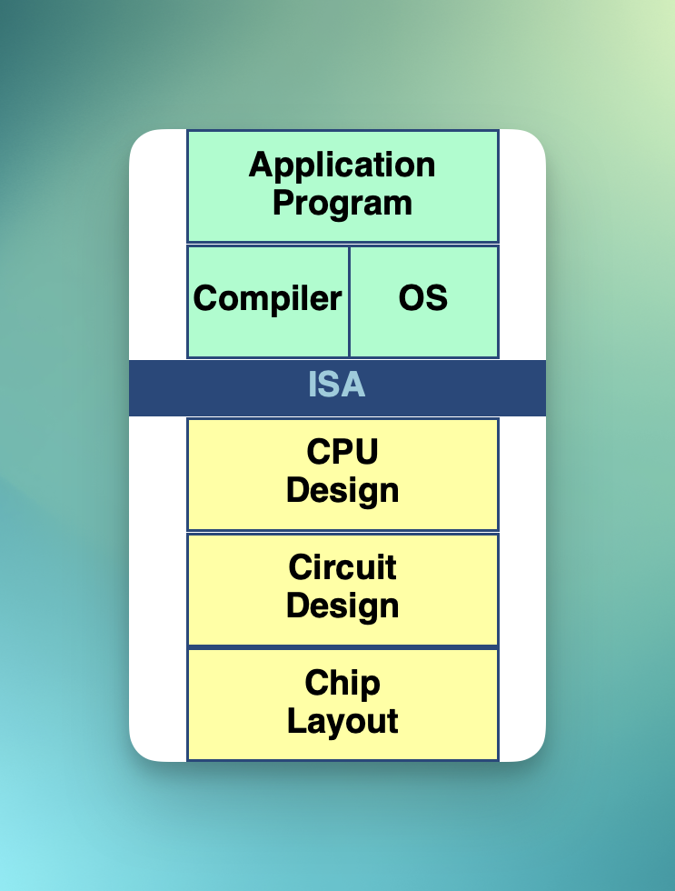

## Y86-64

- 相比X86-64，数据类型、指令和寻址方式都要少一些。
- 字节级编码较为简单，机器代码相比不够紧凑。
- 每条指令都会读取或修改处理器状态的某些部分，称为程序员可见(``写程序的人或者编译器``)。

Y86-64 的状态先按程序员可见的部分记。

- 15个程序寄存器：``%rdi,%rsi,%rax,%rbx,%rcx,%rdx,%rbp,%rsp,%r8~%r14``，比``x86-64``少一个。
- 它们并称为寄存器堆(``Register File``)。
- 每个程序寄存器存储一个``64位``的字，``%rsp``的用法与``x86-64``相同。
- 三个条件码：``SF,ZF和OF``。
- 程序计数器(``PC/%rip``)：存放当前执行指令的地址。
- 程序用虚拟地址引用内存位置，硬件和OS联合起来翻译为物理地址。
- 状态码(Stat)：表明程序运行的整体状态。
- 内存：动态随机存储器，采用小端法存储。

Y86-64 指令是 x86-64 的简化版本。

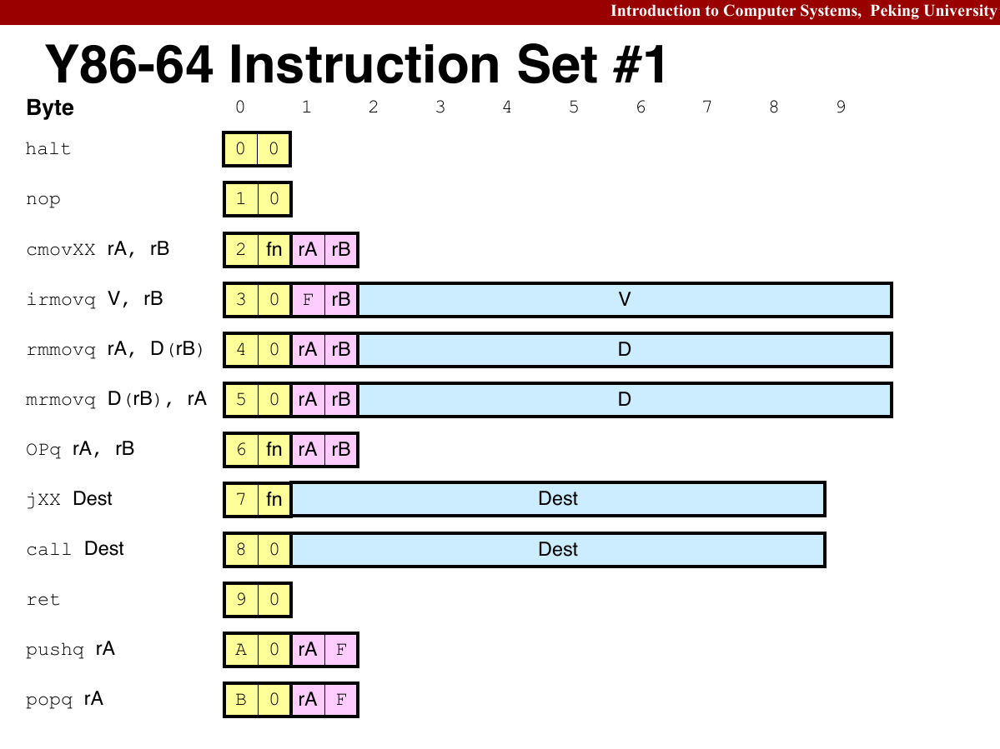

- 每条指令从``1个字节``到``10个字节``不等。
- 只包含``8字节``整数操作，寻址方式较少。
- 在``Y86-64``中，将``8字节``称为``字``。
- 内存寻址只包含``基址``和``偏移量``形式，不支持第二变址寄存器和寄存器值伸缩。
- 同样，不允许内存与内存之间传送，以及不允许立即数传送到内存。
- ``halt``：字节编码为一字节``00``，停止程序执行。
- ``nop``：字节编码为一字节``10``，占位操作。
- ``rrmovq rA,rB``：字节编码为两字节``20 rArB``，寄存器之间数据传送。
- ``cmovXX rA,rB``：字节编码为两字节``2fn rArB``，寄存器之间条件传送。
- ``irmovq V,rB``：字节编码为十字节``30 FrB V``，立即数传送到寄存器。
- ``rmmovq rA,D(rB)``：字节编码为十字节``40 rArB D``，寄存器传送到内存。
- ``mrmovq D(rB),rA``：字节编码为十字节``50 rArB D``，内存传送到寄存器。
- ``OPq rA,rB``：字节编码为两字节``6fn rArB``，进行整数操作，只在寄存器之间进行。
- ``jXX Dest``：字节编码为九字节``7fn Dest``，跳转到某个地址。
- ``call Dest``：字节编码为九字节``80 Dest``，调用某个地址的函数。
- ``ret``：字节编码为一字节``90``，返回上级函数。
- ``pushq rA``：字节编码为两字节``A0 rAF``，将寄存器中的值压入栈顶。
- ``popq rB``：字节编码为两字节``B0 rAF``，将栈顶的值弹出到寄存器中。
- 注意到``cmovXX``和``rrmovq``极为相像，因此下文会加以区分。
- 注意到被寻址的永远为``rB``，但是字节的存储方式没有改变。
- 注意到``Y86-64``没有``testq``和``cmpq``语句，因此最近一次算术/逻辑运算结构设置条件码。

三组指令共用操作码，并通过``fn``字段区分具体操作。

| 指令族 | ``fn`` | 含义 |
| --- | --- | --- |
| ``OPq`` | ``0`` | ``addq`` |
| ``OPq`` | ``1`` | ``subq`` |
| ``OPq`` | ``2`` | ``andq`` |
| ``OPq`` | ``3`` | ``xorq`` |
| ``JXX`` | ``0`` | ``jmp`` |
| ``JXX`` | ``1`` | ``jle`` |
| ``JXX`` | ``2`` | ``jl`` |
| ``JXX`` | ``3`` | ``je`` |
| ``JXX`` | ``4`` | ``jne`` |
| ``JXX`` | ``5`` | ``jge`` |
| ``JXX`` | ``6`` | ``jg`` |
| ``cmovXX`` | ``0`` | ``rrmovq`` |
| ``cmovXX`` | ``1`` | ``cmovle`` |
| ``cmovXX`` | ``2`` | ``cmovl`` |
| ``cmovXX`` | ``3`` | ``cmove`` |
| ``cmovXX`` | ``4`` | ``cmovne`` |
| ``cmovXX`` | ``5`` | ``cmovge`` |
| ``cmovXX`` | ``6`` | ``cmovg`` |

寄存器在指令中使用四位编码表示。

| 编码 | 寄存器 | 编码 | 寄存器 |
| --- | --- | --- | --- |
| ``0`` | ``%rax`` | ``8`` | ``%r8`` |
| ``1`` | ``%rcx`` | ``9`` | ``%r9`` |
| ``2`` | ``%rdx`` | ``10`` | ``%r10`` |
| ``3`` | ``%rbx`` | ``11`` | ``%r11`` |
| ``4`` | ``%rsp`` | ``12`` | ``%r12`` |
| ``5`` | ``%rbp`` | ``13`` | ``%r13`` |
| ``6`` | ``%rsi`` | ``14`` | ``%r14`` |
| ``7`` | ``%rdi`` | ``15`` | ``无寄存器/F`` |

- Y86-64符合指令集的重要性质：字节编码必须有唯一的解释，要么唯一解释要么非法。
- 地址是基于字节编码偏移的。

Y86-64 状态码用来描述程序当前是否正常执行。

- 用程序状态码``Stat``表示
- ``1``：``AOK``，表示运行正常。
- ``2``：``HLT``，表示遇到``halt``指令。
- ``3``：``ADR``，表示试图读写非负地址。
- ``4``：``INS``，表示指令非法。
- 处理器会停止，或调用异常处理指令。

## RISC和CISC指令集的比较

- ``CISC``指令数量多，``RISC``指令数量少。
- ``CISC``有长延迟指令，``RISC``无长延迟指令。
- ``CISC``编码长度可变，``RISC``编码固定长度。
- ``CISC``寻址方式复杂，``RISC``寻址方式简单。
- ``CISC``可对内存和立即数进行算术逻辑运算，``RISC``只能对寄存器进行算术逻辑计算。
- ``CISC``细节对机器级程序不可见，``RISC``细节对机器级程序可见。
- ``CISC``有条件码，``RISC``无条件码。
- ``CISC``过程链接是栈密集的，``RISC``过程链接是寄存器密集的。
- ``CISC``过程频繁访问内存，``RISC``过程频繁访问寄存器。

``CISC``的形成与早期机器条件有关。

- 早期内存昂贵需要短指令。
- 编译器能力有限需要复杂指令。
- 处理器设计复杂，功耗高，价格昂贵。

``RISC``更适合流水线操作，简化指令集也便于并行处理。

以``RISC/ARM``为例。

- 基于寄存器的指令集，典型设计包含32个通用寄存器。
- 仅加载和存储指令（Load/Store）访问内存。
- 不使用条件码，测试结果存储于寄存器中。

- 现代指令集一般两者特点兼备。

## 逻辑设计

逻辑门和组合逻辑负责把输入即时变成输出。

- 数字电路的基本单位
- 基本逻辑门：与门(And)、或门(Or)、非门（Not）
- 只对单个位的数进行操作，常见是 $n$ 路操作。
- 输入高/低电平，输出对输入持续响应（有微小延迟）。
- 组合逻辑：由逻辑门网络组成的电路，例如比较器、加法器等。

每个逻辑门的输入必须连接到以下三者之一。

- 一个系统输入/主输入
- 某个存储器单元的输出
- 某个逻辑门的输出

- 注意，两个或多个逻辑门的输出不能直接连接，组合逻辑也不能存在环。

HCL(Hardware Control Language)类似C语言逻辑表达式，用于描述硬件控制逻辑。不同于C语言的短路逻辑，HCL表达式不会省略任何分支。

- 多路复用器(MUX)

```c
bool re = (s && a) || (!s && b);
```

- 情况表达式(Case Expression)

```text
T out = [
    select1 : Expr1;
    select2 : Expr2;
]
```

算术/逻辑单元(ALU)的抽象模型由两个数据输入与一个控制输入组成。

- 控制输入与字节编码中功能相同，选择计算功能并改变条件码。
- 内部堆叠多个运算黑箱，例如加法、减法、与、异或。

时序逻辑和存储器负责保存状态。

- 时序逻辑中的寄存器不同于上文提到的通用寄存器，暂称其为时钟寄存器。
- 其行为受时钟信号(同一个时钟)控制。
- 其由逻辑门组成的触发器堆叠而成。
- 时钟到达上升沿时，加载输入，状态与输出均改变。
- 时钟下降时，保持输出和状态稳定。
- 配备时钟寄存器后的时序电路不会出现震荡，可以实现反馈和循环。

震荡(Oscillation)是电路输出在短时间内反复切换高低电平的现象，通常由电路设计不当或信号反馈路径不稳定引起。电路无法稳定在预期的逻辑电平，也就无法正常工作。

寄存器堆和 RAM 都通过地址选择读写位置。

- 属于随机访问存储器，通过地址选择该读或该写哪个字。
- 包含通用寄存器等用于存取数据的寄存器。
- 有两个读端口，一个写端口，允许同时进行多个读写操作(经典寄存器堆，不代表最终品质)。
- 每个端口有一个地址输入，表示该选择哪个寄存器。
- 另外还有一个数据输出或对应该寄存器的输入值。
- 读端口有地址输入``srcA``和``srcB``，数据输出``valA``和``valB``。
- 写端口有地址输入``dstW``，数据输入``valW``。
- 写入由时钟信号控制，类似将值加载到时钟寄存器。

## SEQ/顺序硬件架构

SEQ 的主要状态单元集中在这些位置。

- PC(Program Counter)寄存器：存储下一条指令的地址。
- CC(Condition Code)寄存器：存储条件码，用于记录算术/逻辑单元(ALU)的结果状态。
- 寄存器堆(Register File)：用于存储临时变量，由程序显式管理的寄存器集合，具有两个读端口和两个写端口。
- Memories：包括指令内存(Instruction Memory)和数据内存(Data Memory)。
- 从不回读原则：不为了完成一条指令的执行而去读由该指令更新的状态。

SEQ的阶段。

取指阶段负责拿到当前指令和下一条顺序地址。

处理器从内存中读取指令字节，地址为程序计数器(PC)的值。读出的指令由以下部分组成。

- ``icode``：指明指令类型，指令字节低4位。
- ``ifun``：指令功能，指令字节高4位。
- ``rA``：第一个源操作数寄存器，通过``need_regids``控制。
- ``rB``：第二个源操作数寄存器，通过``need_regids``控制。
- ``valC``：立即数或操作地址，常量，通过``need_valC``控制。
- 若指令地址不合法，由``imem_error``指明。

取指阶段还会生成PC的下一条指令地址``valP``。

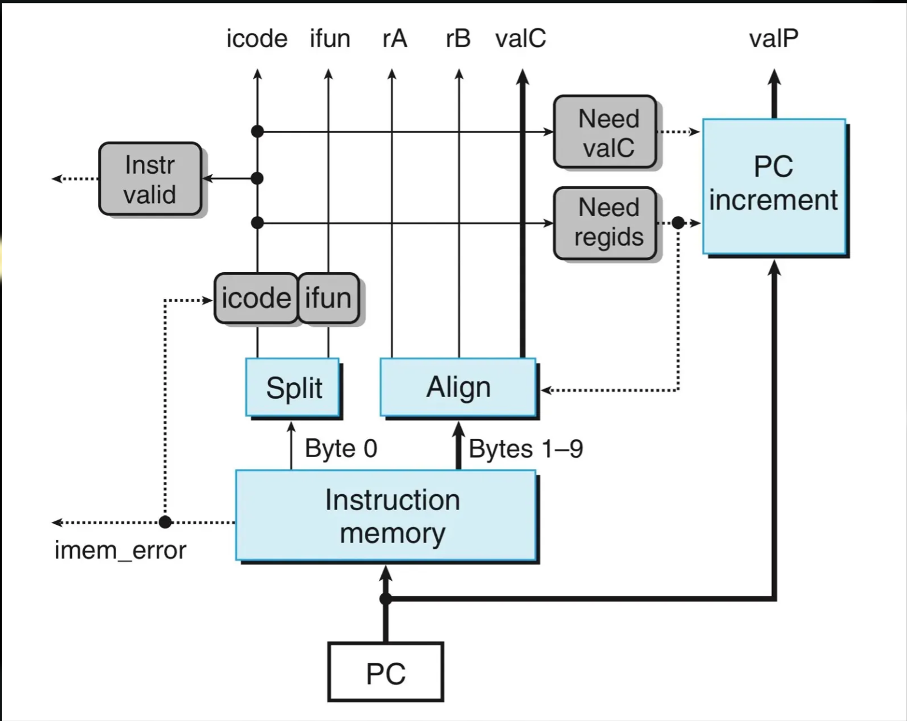

译码阶段负责读寄存器。

- 操作：从寄存器堆读入最多两个操作数，得到``valA``和``valB``。
- 通常读入``rA``和``rB``对应寄存器，部分指令读入``%rsp``。
- 解析操作码：从指令中提取操作码和寄存器序号``srcA``和``srcB``。
- 确定操作类型：根据操作码识别指令类型(只使用icode)。
- 确定写回指向：根据操作码确定``dstE``和``dstM``。
- 读取操作数：从寄存器堆中提取源操作数``valA``和``valB``。

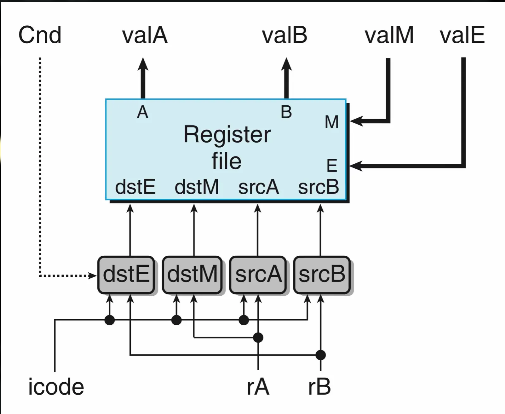

执行阶段主要由 ALU 完成计算。

算术/逻辑单元(ALU)会处理以下几类运算。

- 执行指令指明的操作(``OPq``)
- 计算内存引用的地址(``rmmovq mrmovq``)
- 增加/减少栈指针(``pushq`` ``popq``)
- 一般而言运算为加法运算，除非``ifun``特别指定。

ALU将源操作数``valA``、``valB``作为输入，执行指定运算并输出结果``valE``。输入分为两个部分。

- ``aluA``由``valA、valC``以及``+8、-8``等常数决定。
- ``aluB``由``valB``决定。

- 设置条件码：``OPq``设置``CC``中的条件码。
- 条件判断：``cmovXX``与``JXX``根据``CC``内容和``ifun``计算``Cnd``，决定是否跳转。
- 注意到，没有一条指令又设置``CC``又使用``CC``，这是``Arch Lab``优化的关键！
- 对于无需计算的指令，将寄存器编号于``srcA``中，提取出``valA``，``valB``置零，``ALU``输出的``valE``即为``valA``的值。
- 对于地址传送指令，寄存器提取出``valB``，``aluA``选择``8``或``-8``执行。
- 对于条件传送指令，根据``Cnd``决定是否将``dstE``设为``F``。

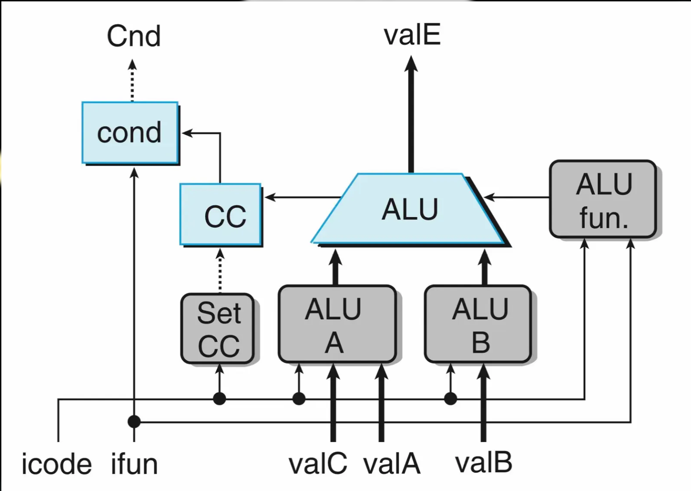

访存阶段处理内存读写。

- 操作：将数据写入内存，或从内存读出数据。
- 仅在需要访问内存的指令中进行，即``load/store``，``Y86-64``中为``mrmovq``和``rmmovq``。
- 读取内存：从``valA(popq,ret)``或``valE(mrmovq)``中读出``valM``。
- 写入内存：向``valE(rmmovq pushq call)``中写入``valA(rmmovq pushq)``或``valP(call)``。

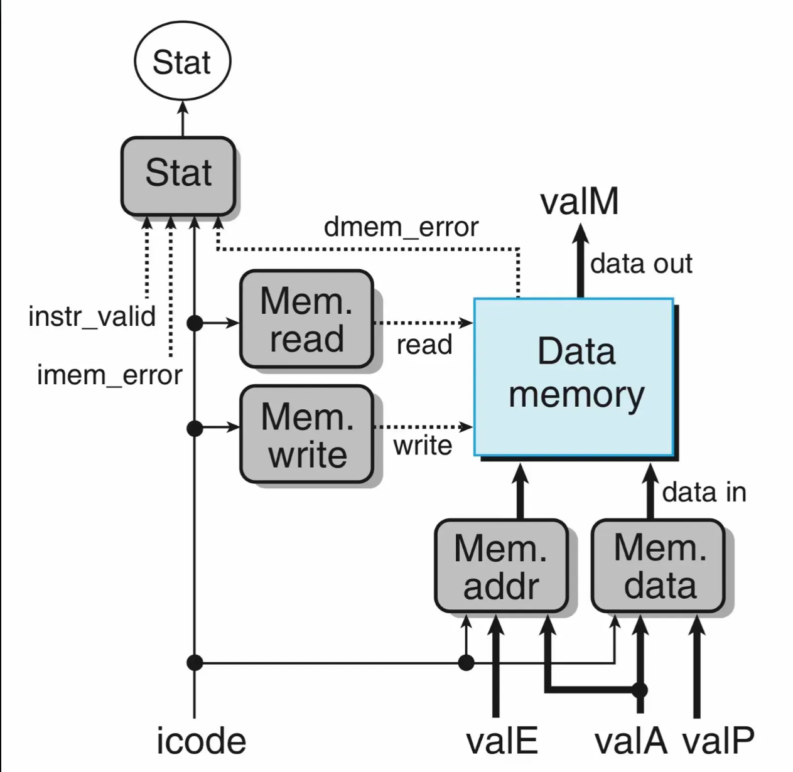

写回阶段把结果写回寄存器堆。

- 操作：最多可以写两个结果到寄存器文件。
- 更新寄存器堆：将ALU或内存操作的结果存储到目标寄存器。
- 更新PC：根据``valP、valC(JXX/CALL)或者valM(ret)``为下一条指令准备好新的PC。
- 寄存器堆的更新只在时钟上升沿执行，保持写入稳定性。

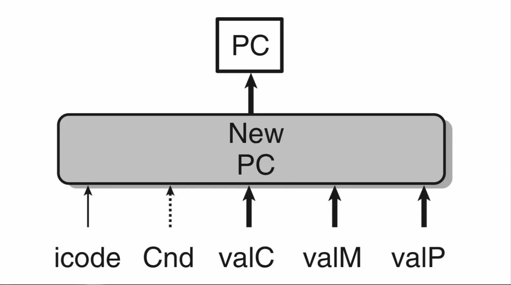

## SEQ实现示例

``OPq rA,rB`` 的各阶段信号可以这样取。

- 取指
  - 以``PC``为索引，从指令内存读取指令的操作码``OPq``。
  - 计算下一条指令的PC值(``PC+2``)，存放到``valP``。
- 译码
  - 解析操作码得到``srcA``和``srcB``。
  - 根据``ifun``确定操作类型。
  - 选择``dstE``为``rB``。
  - 从寄存器堆中提取源操作数``valA``和``valB``。
- 执行
  - 根据``ifun``使用ALU对``valA``和``valB``进行运算，结果存放到``valE``。
  - 根据结果更新CC寄存器。
- 访存
  - 无访存操作，跳过该阶段。
- 写回
  - 将``valE``写回寄存器堆的``rB``寄存器。
  - PC更新为``valP``。

``rrmovq rA,rB`` 只需要把寄存器值搬到目的寄存器。

- 取指
  - 以``PC``为索引，从指令内存读取指令的操作码``rrmovq``。
  - 计算下一条指令的PC值(``PC+2``)，存放到``valP``。
- 译码
  - 解析操作码得到``srcA``。
  - 设置``dstE``为``rB``。
  - 从寄存器堆中提取源操作数``valA``。
- 执行
  - 因为不计算只取原值，将``valB``置零。
  - 使用ALU计算``valA+valB``，结果存放到``valE``。
- 访存
  - 无访存操作，跳过该阶段。
- 写回
  - 将``valE``写回寄存器堆的``rB``寄存器。
  - PC更新为``valP``。

``irmovq V,rB`` 会把立即数写入寄存器。

- 取指
  - 以``PC``为索引，从指令内存读取指令的操作码``irmovq``。
  - 取出立即数，存放到``valC``。
  - 计算下一条指令的PC值(``PC+10``)，存放到``valP``。
- 译码
  - 设置``dstE``为``rB``。
- 执行
  - 因为不计算只取原值，将``valB``置零。
  - 使用ALU计算``valC+valB``，结果存放到``valE``。
- 访存
  - 无访存操作，跳过该阶段。
- 写回
  - 将``valE``写回寄存器堆的``rB``寄存器。
  - PC更新为``valP``。

``rmmovq rA,D(rB)`` 会把寄存器值写到内存地址。

- 取指
  - 以``PC``为索引，从指令内存读取指令的操作码``rmmovq``。
  - 取出偏移量，存放到``valC``。
  - 计算下一条指令的PC值(``PC+10``)，存放到``valP``。
- 译码
  - 解析操作码得到``srcA``和``srcB``。
  - 从寄存器堆中提取源操作数``valA``和``valB``。
- 执行
  - 使用ALU对``valB+valC``进行运算，结果存放到``valE``。
- 访存
  - 以``valE``为地址，将``valA``写入。
- 写回
  - PC更新为``valP``。

``mrmovq D(rB),rA`` 会从内存读出数据再写回寄存器。

- 取指
  - 以``PC``为索引，从指令内存读取指令的操作码``mrmovq``。
  - 取出偏移量，存放到``valC``。
  - 计算下一条指令的PC值(``PC+10``)，存放到``valP``。
- 译码
  - 解析操作码得到``srcB``。
  - 设置``dstM``为``rA``。
  - 从寄存器堆中提取源操作数``valB``。
- 执行
  - 使用ALU对``valB+valC``进行运算，结果存放到``valE``。
- 访存
  - 以``valE``为地址，取出``valM``。
- 写回
  - 将``valM``写回寄存器堆的``rA``寄存器。
  - PC更新为``valP``。

``pushq rA`` 需要先更新栈顶，再写入内存。

- 取指
  - 以``PC``为索引，从指令内存读取指令的操作码``pushq``。
  - 计算下一条指令的PC值(``PC+2``)，存放到``valP``。
- 译码
  - 解析操作码得到``srcA``，``srcB``默认为``%rsp``。
  - 设置``dstE``为``%rsp``。
  - 从寄存器堆中提取源操作数``valA``和``valB``。
- 执行
  - 使用ALU对``valB+(-8)``进行运算，结果存放到``valE``。
- 访存
  - 以``valE``为地址，将``valA``写入。
- 写回
  - 将``valE``写回寄存器堆的``%rsp``寄存器。
  - PC更新为``valP``。

``popq rA`` 需要从旧栈顶读值，再更新栈顶。

- 取指
  - 以``PC``为索引，从指令内存读取指令的操作码``popq``。
  - 计算下一条指令的PC值(``PC+2``)，存放到``valP``。
- 译码
  - ``srcA,srcB``默认均为``%rsp``。
  - 设置``dstE``和``dstM``为``popq``。
  - 从寄存器堆中提取源操作数``valA``和``valB``。
- 执行
  - 使用ALU对``valB+8``进行运算，结果存放到``valE``。
- 访存
  - 以``valA``为地址，取出``valM``。
- 写回
  - 将``valE``写回寄存器堆的``%rsp``寄存器。
  - 将``valM``写回寄存器堆的``rA``寄存器。
  - PC更新为``valP``。

``jXX Dest`` 的关键在于条件是否成立。

- 取指
  - 以``PC``为索引，从指令内存读取指令的操作码``jXX Dest``。
  - 取出跳转地址，存放到``valC``。
  - 计算下一条指令的PC值(``PC+9``)，存放到``valP``。
- 译码
  - 无译码操作。
- 执行
  - 根据``CC寄存器内容``和指令类型``ifun``计算``cond``，判断条件是否满足。
- 访存
  - 无访存过程。
- 写回
  - 若``cond``为真，PC更新为``valC``；反之更新为``valP``。

``Call Dest`` 会保存返回地址并跳转。

- 取指
  - 以``PC``为索引，从指令内存读取指令的操作码``Call Dest``。
  - 取出调用地址，存放到``valC``。
  - 计算下一条指令的PC值(``PC+9``)，存放到``valP``。
- 译码
  - ``srcB``默认为``%rsp``。
  - 设置``dstE``为``%rsp``。
  - 从寄存器堆中提取源操作数``valB``。
- 执行
  - 使用ALU对``valB+(-8)``进行运算，结果存放到``valE``。
- 访存
  - 以``valE``为地址，将``valP``写入。
- 写回
  - 将``valE``写回寄存器堆的``%rsp``寄存器。
  - PC更新为``valC``。

``ret`` 会从栈中取回返回地址。

- 取指
  - 以``PC``为索引，从指令内存读取指令的操作码``ret``。
  - 计算下一条指令的PC值(``PC+1``)，存放到``valP``。
- 译码
  - ``srcA和srcB``默认为``%rsp``。
  - 设置``dstE``为``ret``。
  - 从寄存器堆中提取源操作数``valA``和``valB``。
- 执行
  - 使用ALU对``valB+8``进行运算，结果存放到``valE``。
- 访存
  - 以``valA``为地址，取出``valM``。
- 写回
  - 将``valE``写回寄存器堆的``%rsp``寄存器。
  - PC更新为``valM``。

``comvXX rA,rB`` 只有在条件成立时才写回。

- 取指
  - 以``PC``为索引，从指令内存读取指令的操作码``cmovXX``。
  - 计算下一条指令的PC值(``PC+2``)，存放到``valP``。
- 译码
  - 解析操作码得到``srcA``。
  - 从寄存器堆中提取源操作数``valA``和``valB``。
- 执行
  - 由于不计算只取原值，将``valB``置零。
  - 使用ALU对``valA+valB``进行运算，结果存放到``valE``。
  - 根据``CC寄存器内容``和指令类型``ifun``计算``cond``，若不满足，将``rB``设置为``F``。
- 访存
  - 无访存过程。
- 写回
  - 将``valE``写回寄存器堆的``rB``寄存器，若为``F``则不写回。
  - PC更新为``valP``。

SEQ 的整体设计：

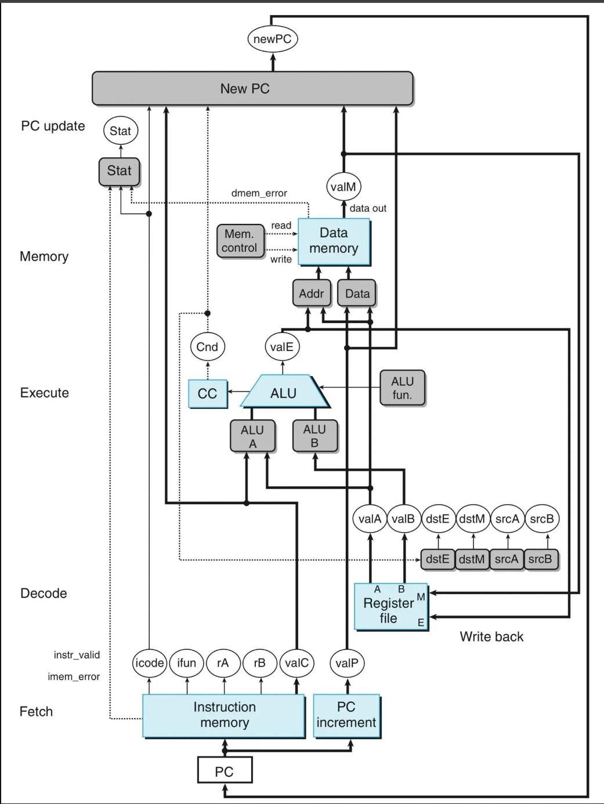

- SEQ的缺点：时钟周期必须非常长，使信号能在一个周期内传播所有的阶段。

## SEQ+硬件架构

- 相比SEQ架构，每个时钟周期都可以取出下一条指令的地址，更新PC在一个时钟周期开始时执行，而非结束时执行。
- 没有硬件寄存器来存放程序计数器，依据前一条指令保存下来的一些状态信息动态计算PC。

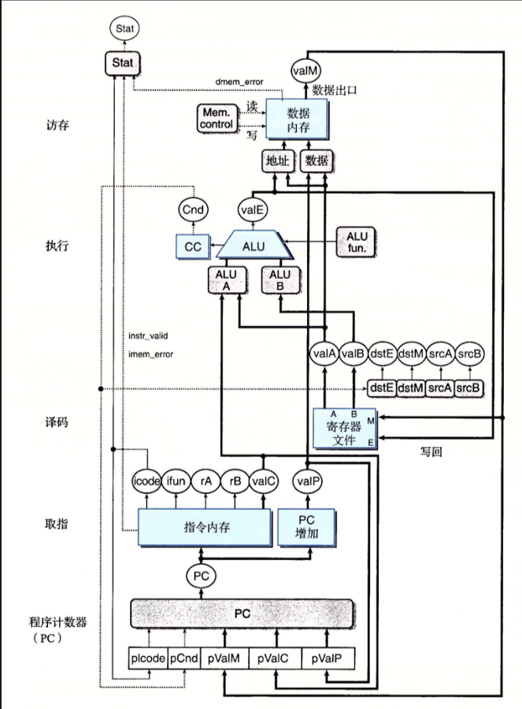

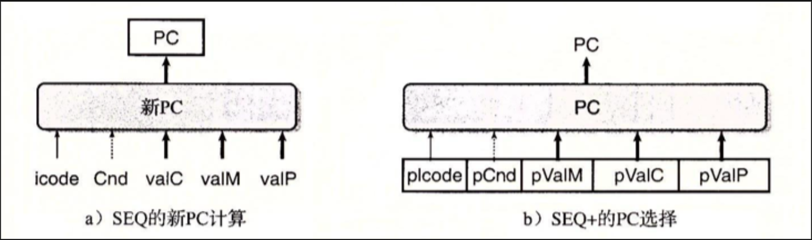

## PIPE-/流水线硬件架构

流水线把一条指令的执行拆成多个可重叠阶段。

- 类比生活中的流水线，流水线能够提高系统吞吐量，同时轻微增加延迟。
- 它讲顺序执行的指令流划分为多个阶段，每个阶段由不同的硬件单元执行，允许多条指令并行处理。
- 吞吐量：单位时间内完成的指令数量。
- 单位：每秒千兆指令(GIPS,10^9 instructions per second,即10^{-9} s 执行多少指令)。
- 运行时钟的速率是由最慢阶段的延迟限制的。
- 流水线寄存器(即组合逻辑拆分后各阶段的时钟寄存器)在时钟上升沿写入数据，在时钟稳定期间保持稳定输入输出。
- 流水线过深：会导致寄存器延迟占总延迟的比例逐渐升高，边际效益递减，收益下降，同时处理冒险、分支错误和清除流水线的成本也增加。

反馈路径是由后阶段传递到前阶段的电路线，主要传递与指令执行相关的关键信息。

- 预测的程序计数器(PC)值。
- 分支信号(程序是否需要跳转)。

没有流水线时，一条指令要完整走完所有阶段，下一条指令才能开始。

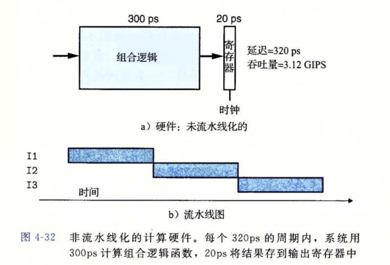

加入流水线后，不同指令可以同时处在不同阶段。单条指令的阶段数没有减少，但每个周期都可能有新指令完成，因此提升的是吞吐量。

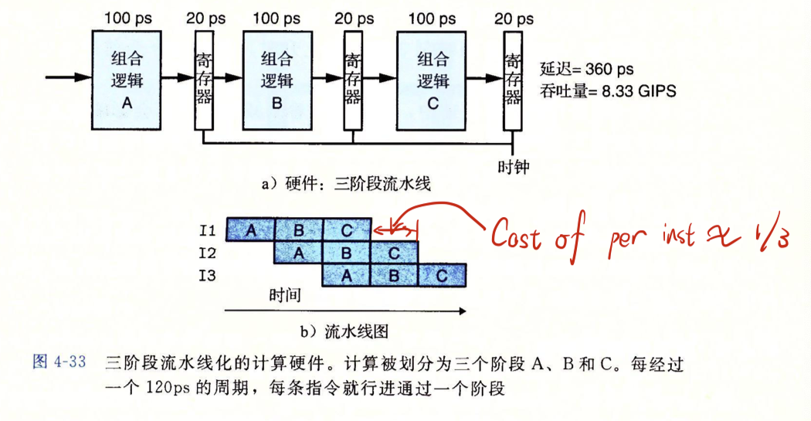

流水线是否值得拆得更深，可以直接用阶段延迟估算。假设五个阶段的组合逻辑延迟依次为 50 ps、150 ps、100 ps、200 ps 和 50 ps，每个流水线寄存器额外引入 20 ps 延迟。不使用流水线时，一条指令至少需要 550 ps；拆成五级后，时钟周期必须由最慢阶段决定，变成 220 ps。

理想情况下，执行 $N$ 条指令所需的时间为

$$
T_{pipe}(N)=(N+4)\times220\ \mathrm{ps}
$$

第一条指令的延迟反而增加到 1100 ps，但流水线填满后每 220 ps 就能完成一条指令。它以更高的单条延迟换取了更高的稳定吞吐量。若再考虑数据冒险和分支预测失败，式子中的 4 还要加上暂停与气泡占用的周期数。

因此，衡量流水线性能时通常看每条指令的平均周期数 CPI，而不是只看级数。理想 CPI 接近 1；一次错误分支清除两条指令，就会让对应动态指令流多出两个空周期。

各阶段的寄存器信息需要单独列出来。

- 在流水线架构中，往往需要区分不同阶段之间的数据，数据有时稳定地存储在寄存器中，有时暂时地流经组合逻辑。
- 大写前缀指的是流水线寄存器(即将由对应阶段进行处理)，对应阶段开始时就是正确的值，在下一个时钟上升沿到来之前不会变化。
- 小写前缀指的是流水线阶段，对应阶段中，完成相应运算后才会是正确的值。
- PIPE-相比PIPE架构，没有对冒险的处理和转发逻辑，由SEQ+插入流水线寄存器而来。
- 同时，增加了新模块``SelectA``来选择``valA``的来源。
- 分支预测：由于流水线，因此每个时钟周期都要给出一个指令地址用于取指。
- ``JXX``指令的最简单策略：总是预测选择条件分支，即选取新PC为``valC``。
- ``ret``指令：整个流水线停转，等待它通过写回``W``阶段，从而得到压栈的返回值并更新``PC``。

- 于是，得到``PIPE-``的整体设计：

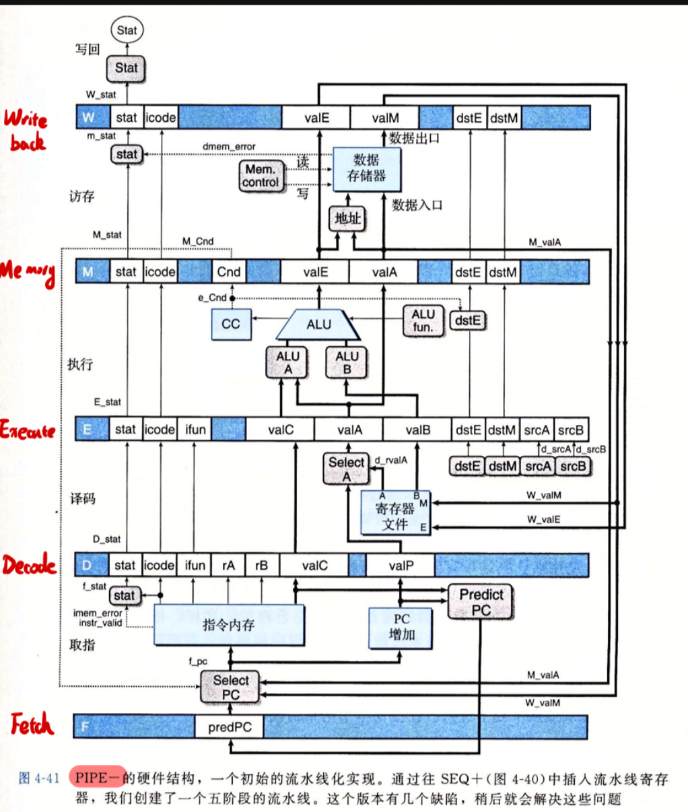

## 流水线冒险(Hazard)

数据冒险来自指令之间的数据依赖。

- 定义：下一条指令需要使用当前指令计算的结果。
- 例如，以下``Y86-64``指令序列：

```asm
addq %rax, %rbx    # 计算rax和rbx的和，存放到rbx中
movq %rbx, %rcx    # 将rbx的值复制到rcx中
```

- 此时，当``movq``执行到``D``阶段时，需要提取``%rbx``的值。
- 但是``addq``此时处于``E``阶段，需要到``W``阶段才能写回。
- 有以下三种策略可以解决数据冒险

暂停会让某些流水线寄存器保持原值。

- 定义：保持状态，输入清空。
- 在两条指令之间插入``nop``指令，以确保后一条指令的操作数已被前一条指令写回。
- 这条指令，相当于延迟了下一条指令出现，同时它本身顺着流水线流动。
- 需要在软件层面修改汇编代码，可以改成：

```asm
addq %rax, %rbx    # 此时，addq指令运行到fetch
nop                # 此时，addq指令运行到decode
nop                # 此时，addq指令运行到execute
nop                # 此时，addq指令运行到memory
movq %rbx, %rcx    # 此时，addq指令运行到writeback，movq指令运行到fetch
...                # 此时，addq指令写回完毕，movq指令运行到decode，可以正确取出rbx的值
```

气泡会向流水线中注入空操作。

- 定义：保持状态，输入清空。
- 在两个指令之间插入``bubble``，以确保后一条指令的操作数已被前一条指令写回。
- 这条指令，相当于延迟了下一条指令需要冒险的阶段，下一条指令及其之后的指令会被冻结在当前阶段。
- ``bubble``不随着流水线流动，在硬件层面加。
- 注意：数据冒险中的``bubble``与控制冒险中的``bubble``含义不同。
- 在PIPE-的基础上需要加入流水线控制单元，用于实现``stall``和``bubble``。
- ``stall``即暂停，数据冒险中的``bubble``(因为是硬件层面)。
- ``bubble``即气泡，控制冒险中的``bubble``，直接顶掉对应寄存器内容。

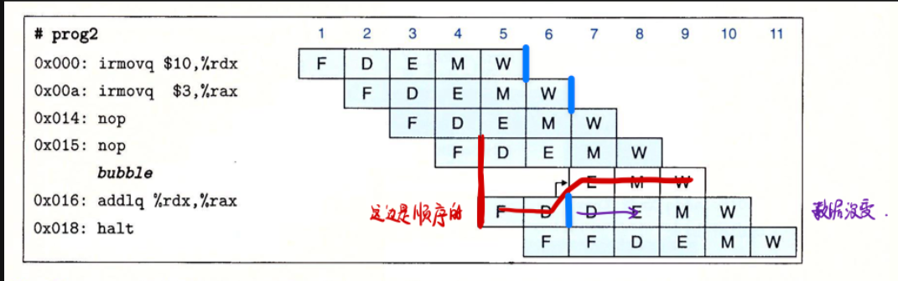

转发用后面阶段的结果提前喂给前面阶段。

- 定义：将结果值直接从一个流水线阶段直接传到较早阶段的技术。
- 例如，当指令进入``D``阶段时，如果它需要访问的寄存器值已经在后续的``E``阶段或``M``阶段，可以通过转发路径将该值直接传递给当前指令，可以避免流水线暂停，提升流水线效率。
- 局限性：如果后续阶段的值仍然在内存中(例如执行``mrmovq``或``popq``指令时，该值仍在``M``阶段)，此时无法进行数据转发，称为``加载/使用冒险(load/use hazard)``。

加载/使用冒险是最典型的必须暂停的情况。

- 定义：只发生在``mrmovq``和``popq``后立即使用对应寄存器的情况。
- 探测时机：``E``阶段为``mrmovq``或``popq``，且``D``阶段的对应寄存器为其中相关。

解决时，译码阶段中的指令暂停一个周期，执行阶段为维持空位加入一个bubble，随后再进行转发。

- 示例：

```asm
mrmovq (%rdi), %rax    # 取出rdi寄存器指向地址的数据，存放在rax中
andq %rax, %rax        # 对rax寄存器进行按位与
```

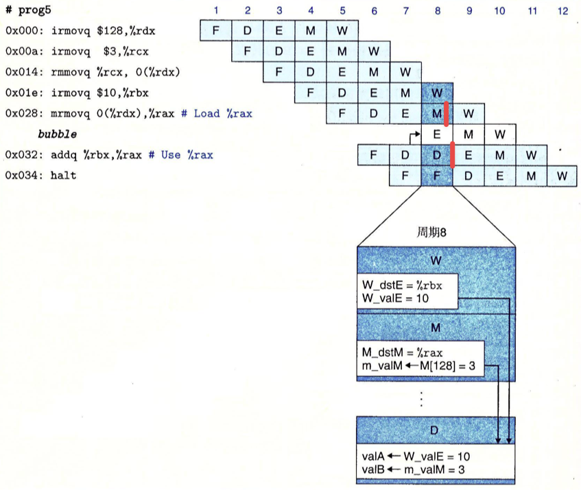

加载指令直到访存阶段才能得到读出值。后继指令即使有转发，也无法在同一周期的执行阶段取得该值，因此译码阶段需要暂停一个周期，并向执行阶段注入气泡；加载值到达可转发位置后，后继指令再继续执行。

控制冒险来自下一条指令地址不确定。

- 定义：数据需要确定下一条指令的位置。
- 即处理器无法根据处于取指阶段的当前指令来确定下一条指令的地址。

下一条PC的选择通常分为以下几类。

- 不传递控制：对于没有控制转移的指令，直接将``valP``设置为下一条``PC``值，通常不会出错。
- 无条件跳转/调用(``Jmp/Call``)：将``valC``设置为下一条``PC``值，总是正确的。
- 条件跳转："总是跳转策略"将``valC``设置为下一条``PC``值，预测命中率约为60%。
- 其他策略：当跳转发生在前面时，总是执行；当跳转发生在后面时，通常不执行。
- 返回指令：处理器不进行任何预测。

其中，只有条件跳转和返回指令会产生控制冒险。

JXX 冒险来自分支预测失败。

- 定义：当``E``阶段发现不应该选择分支时，已经取出了两条指令。
- 探测时机：``E``阶段为条件跳转指令，且``Cnd``为假。
- 此时，需要清空流水线，往下两条指令所在寄存器插入两个``bubble``，直接顶掉指令。

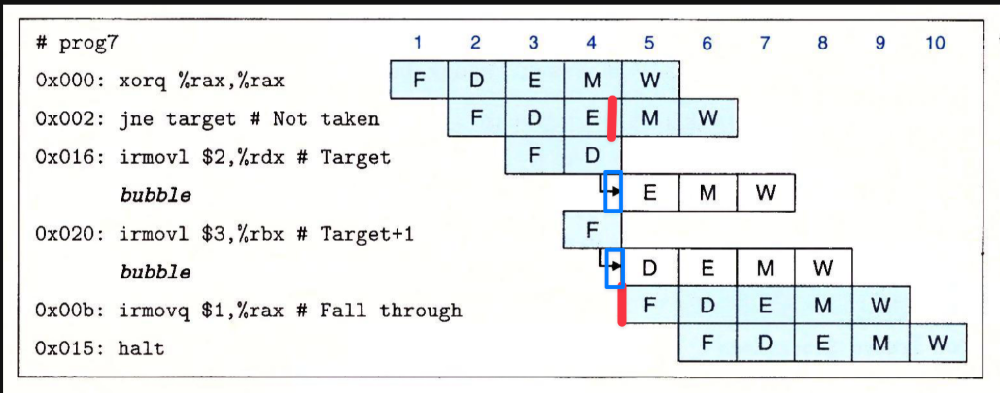

RET 冒险来自返回地址要等访存后才知道。

- 定义：检测到``ret``指令后，不能再让错误指令进流水线。
- 探测时机：``RET``在``D、E、M``阶段。
- 由于无法在``F``阶段插入``bubble``，因此其在接下来三个指令的``D``阶段均插入``bubble``，直接顶掉指令。
- 为什么不能在``W``阶段一次清掉？因为``M``阶段的指令可能有副作用。
- 为什么无法在``F``插入``bubble``？因为顶掉需要把``icode+ifun``设为``nop``，而``F``阶段无这个概念。
- 为什么``F``阶段不能设为``normal``？其实可以设为``normal``，但是为什么一般不用？
- 因为``normal``会影响更多的东西，不如使用``stall``将其阻塞在``fetch``中。
- 好像``stall``会被一直控住？其在``select PC``之后，看到了传回的``M_valA``，于是将原本要选择的``fpred_pc``替换了。

组合冒险。

组合 A 处理 JXX 和 RET 同时出现的情况。

- 定义：``E``阶段有一条预测错误分支的``JXX``指令，``D``阶段有一条``ret``指令。
- 要求：``ret``位于不选择分支的目标处，此时策略为取消``ret``指令。
- 由于跳转地址与``F``寄存器无关，因此为取消``ret``指令，将``F``阶段设为暂停。

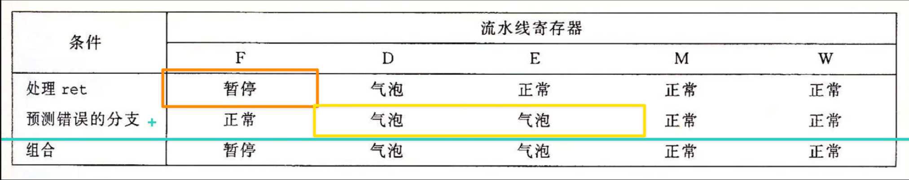

组合 B 处理 Load/Use 冒险和 RET 同时出现的情况。

- 定义：``mrmovq``指令设置寄存器``%rsp``，``ret``指令用它作为源操作数。
- 此时``mrmovq``会使``D``阶段暂停，而``RET``会使``D``中插入一个``bubble``。
- 定义：在同一阶段，``Stall``和``Bubble``永远不同时为真。
- 希望只考虑针对``加载/使用冒险``的动作，因此修改``D_bubble``的处理条件。

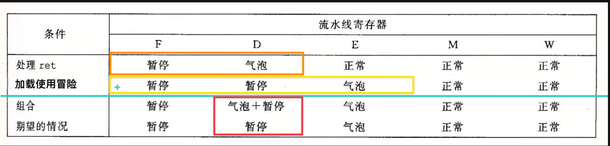

## PIPE/流水线架构

- PIPE 在 PIPE- 的基础上加入转发逻辑，整体数据通路由 SEQ 逐步流水化而来。

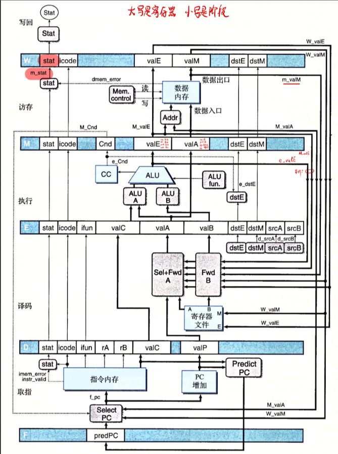

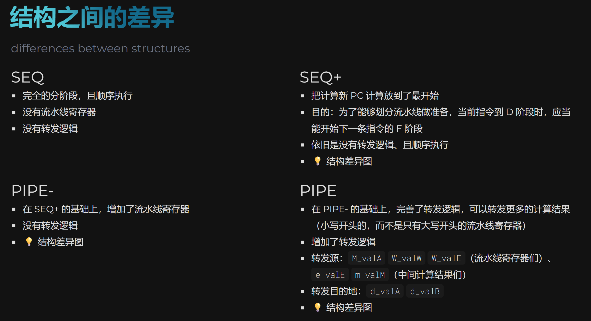

## PIPE的各阶段实现

取指阶段的控制信号需要这样整理。

- 取当前指令的``PC``，若无变化则取``F_predPC``。
- 由于分支预测错误的存在，若``M_icode==JXX``并且``!Con``，取``M_valA``。
- 因为伴随``JXX``产生的``valP``，由``D_valP→E_valA→M_valA``。
- 同时，若``W_icode==RET``，则取``W_valM``。
- 根据``imem_error``判断是否取``icode``和``ifun``。
- 通过``instr_valid``判断指令是否有效。
- 获取指令的状态码``f_stat``。
- 判断指令是否需要寄存器和常数，得到``need_regids``和``need_valC``。
- 预测下一个``PC``值，得到``f_predPC``。
- 根据是否为``加载/使用冒险``以及``RET``冒险，设置``F_stall``(``F``阶段``bubble``始终为假)。

译码阶段要决定读哪些寄存器。

- 根据指令类型取出``d_srcA``和``d_srcB``。
- 决定``E``阶段计算结果和``M``阶段读出结果的写入寄存器``d_srcE``和``d_srcM``。
- 求出``d_valA``和``d_valB``，此处需要满足转发逻辑，从后续``E、M或W``阶段转发。
- 若为跳转指令或调用指令，则``valA``保存``D_valP``。
- 根据是否为``加载/使用冒险``，设置``D_stall``。
- 根据是否为``JXX``冒险或(``RET``冒险且不满足``加载/使用冒险``)，设置``D_bubble``。

执行阶段要决定 ALU 输入和条件码更新。

- 选择``ALU``的输入``aluA``，部分指令需要将``aluA``设为``8``或``-8``。
- 选择``ALU``的输入``aluB``，部分指令需要将``aluB``设为``0``。
- 设置``ALU``的功能``alufun``，除了``IOPQ``，其它默认为``ALUADD``。
- 计算是否更新条件码``set_cc``，只在``IOPQ``和状态正常期间改变。
- 为传递``E_val``给``M_valA``，仅设置``e_valA``。
- 根据是否更新条件码``set_cc``，计算``Cnd``。
- 设置``e_dstE``，除非当前指令为``JXX``且``!Cnd``，则设置为``RNONE``，其余设置为``E_dstE``。
- 根据是否为``JXX``冒险或``加载/使用冒险``，设置``E_bubble``(``E``阶段``stall``始终为假)。

访存阶段要决定是否读写内存。

访存地址``mem_addr``按指令类型选择。

- 若为``rmmovq,pushq,call,mrmovq``，则设置为``m_valE``。
- 若为``popq,ret``，则设置为``M_valA``(由``D_valA``传递来)。

- 决定是否读取内存``mem_read``，是否写入内存``mem_write``。
- 根据是否访问错误地址，更新条件码``m_stat``。
- 根据是否内存异常，设置``M_bubble``(``M``阶段``stall``始终为假)。
- 为什么内存异常只设置``M``和``W``？因为只有这两者产生影响。

写回阶段要决定写回目标和值。

- 设置``E``端口寄存器``w_dstE``，``E``端口值``w_valE``。
- 设置``M``端口寄存器``w_dstM``，``M``端口值``w_valM``。
- 根据是否有气泡，更新条件码``Stat``。
- 根据是否内存异常，设置``W_stall``(``M``阶段``bubble``始终为假)。
- 为什么是``stall``而不是``bubble``？为了留存住错误信息。

## 补充

- Y86-64的指令内存和数据内存相分离，如果一起可能导致``hazard``。
- 这就是一直没有提到的结构冒险，它与数据冒险和控制冒险的最大区别就是只需要修改硬件就可以解决问题。
- 在``Y86``中，只要还有``W``阶段存在，那么不会有新的数据冒险，删去后则会产生``WAW``和``WAR``两种数据冒险，以及控制冒险难以解决。
