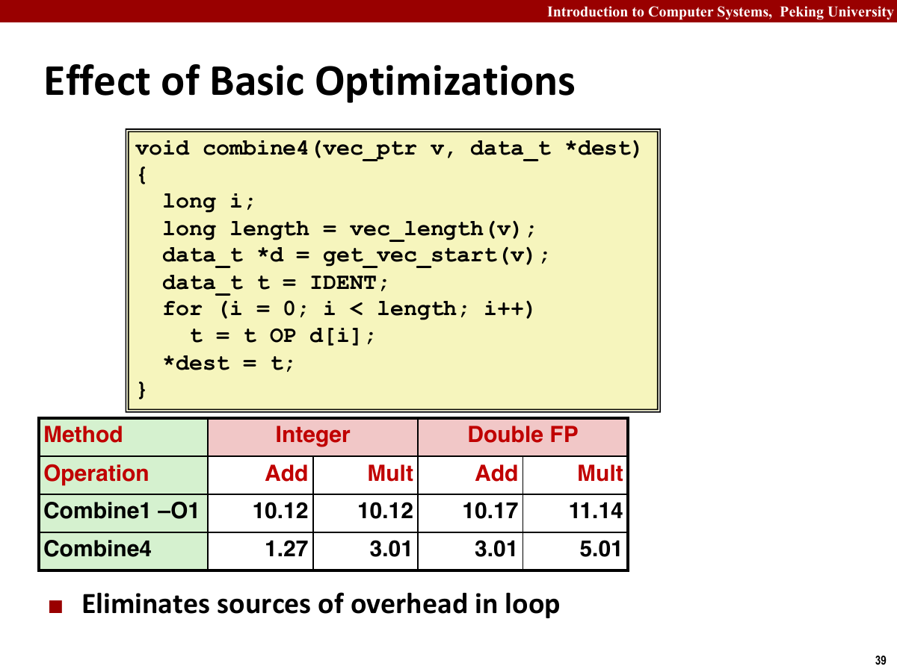
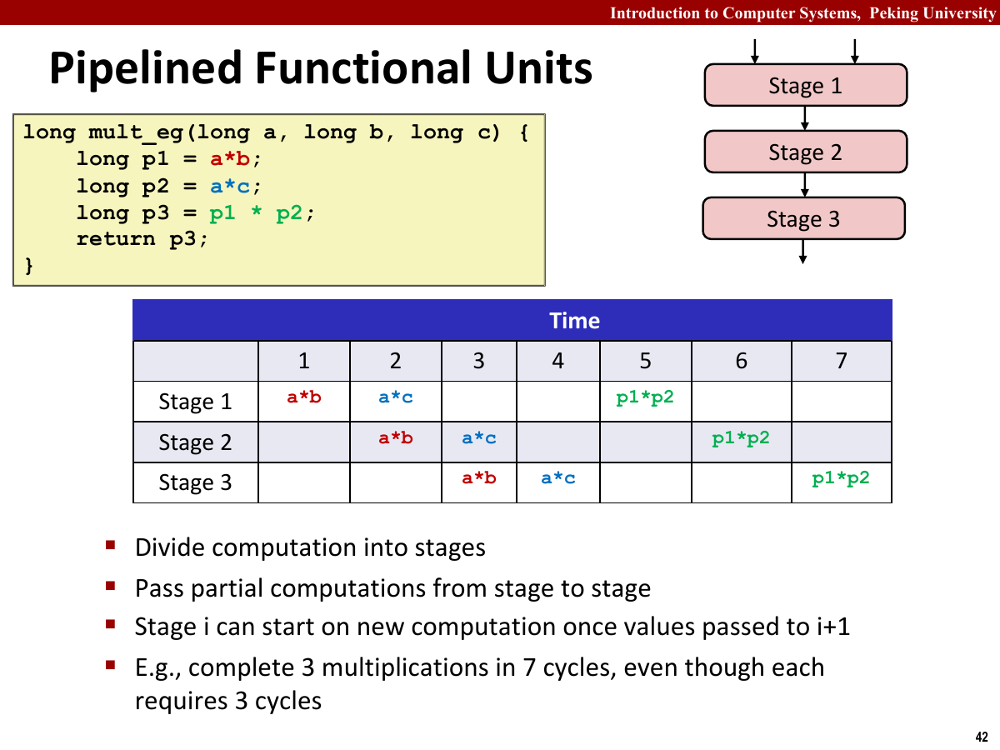
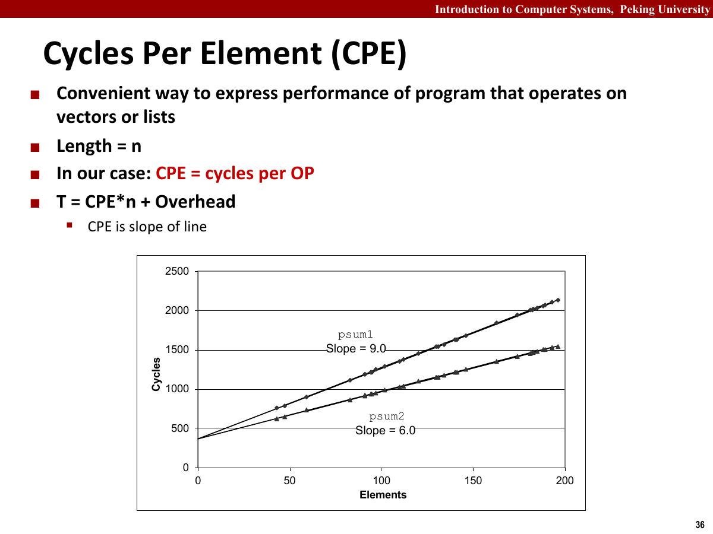
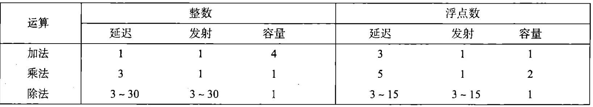
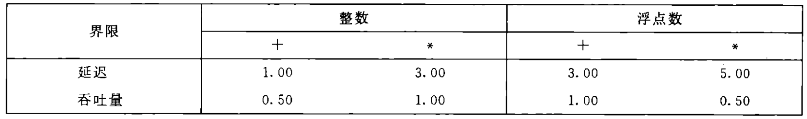
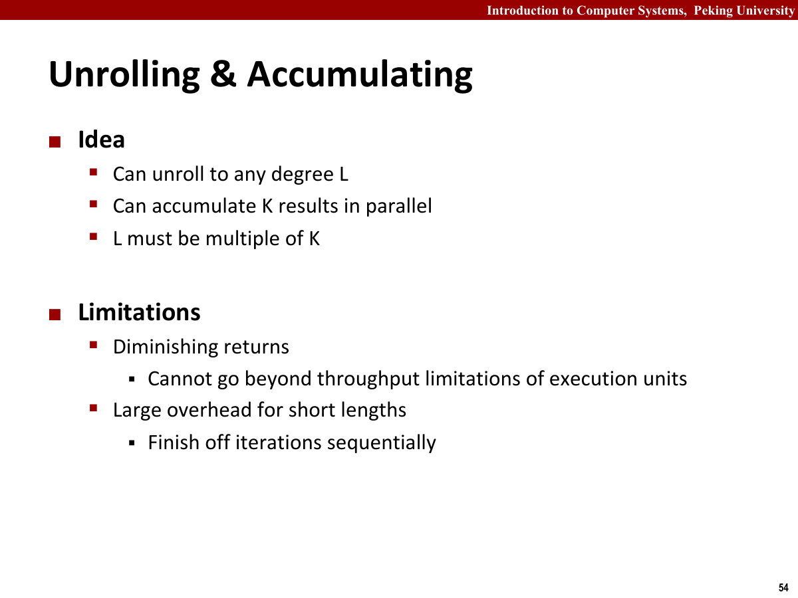

## 性能优化概况

- 在实际生活中，需要提升软件性能，最终目标是编写高效的代码，最大限度地利用硬件资源。
- 性能优化通常考虑以下三方面：
  - 选择恰当的算法和数据结构
  - 理解编译器的能力和局限性
  - 大规模任务下进行并行计算
- 需要在简单性和运行速度上进行权衡
- 注意避免"渐进低效率"的情况，即在小数据集上表现良好，但在实际部署后，由于数据规模增大，原本的算法或数据结构反而成为性能瓶颈。
- 许多低级别的优化往往会降低可读性和模块性，使得容易出错，并且更难以修改。
- 最好的编译器也会受到语义和可见信息的限制。

性能优化应先测量，再修改。比较可靠的顺序是先确定输入规模和基准版本，用性能剖析工具找出真正占用时间的函数，再检查算法复杂度、内存访问和关键依赖链。改完后重新测量，并用测试确认程序语义没有改变。只凭代码外观猜测热点，往往会把时间花在几乎不影响总运行时间的部分。

Amdahl 定律可以估算局部优化对整体程序的影响。若某部分占原运行时间的比例为 $\alpha$ 这一数值，这部分被加速 $k$ 倍，那么整体加速比为

$$
S=\frac{1}{(1-\alpha)+\alpha/k}
$$

例如，某段循环占总时间的 60%，即使把它加速 4 倍，整体加速比也只有 $1/(0.4+0.6/4)\approx1.82$ 左右。剩余 40% 没有变化，它最终会成为新的瓶颈。

编译器优化主要包括这些工作。

- 在代码优化中扮演直观重要角色
- 可以进行以下操作
  - 执行寄存器的分配和调度
  - 代码的重新排序和规划
  - 赘余代码的消除
- 不会引入可能引入风险的优化，即优化后得到的程序与未优化的版本有一样行为
- 大多数优化在函数内部
- 最简单的控制是``指定优化级别``
  - ``-Og``是让``GCC``进行基本优化
  - ``-O1,-O2,-O3``是让``GCC``进行更大量的优化
  - 可以提高程序性能
  - 也可能增加程序规模，使标准调试工具更难对程序进行调试
  - 正如在Attack Lab中看到的一样

## 普适性优化(Machine-independent)

消除循环低效率时，最常见的问题是重复计算。

- 这种优化也被称为``代码移动``
- 比较以下两段代码

```cpp
int combine_1(vector<int>& nums, int x) {
    int n = nums.size();
    for (int i = 0; i <= n - 1; i++) {
        x += nums[i];
    }
    return x;
}
int combine_2(vector<int>& nums, int x) {
    for (int i = 0; i < nums.size(); i++) {
        x += nums[i];
    }
    return x;
}
```

- ``combine_1`` 把循环不变量 ``nums.size()`` 提到循环外，避免每轮重新求值。
- 对标准 ``vector`` 而言，``size`` 是内联的常数时间操作，优化编译器通常也能完成这次代码移动；若循环边界来自编译器无法看透的函数调用，差距会更明显。
- 只有在编译器能够证明结果不变、调用没有副作用时，才允许自动把表达式移出循环。

减少过程调用可以避免一些不必要的开销。

- 同上，可以将内循环中调用的函数移出循环体。

不必要的内存访问也会拖慢程序。

- 若每次都要访问内存并进行读写，程序的速度会大幅下降。
- 参考以下代码：

```c
void combine_3(vec_ptr v, data_t *dest) {
    long i;
    long length = vec_length(v);
    data_t *data = get_vec_start(v);
    *dest = IDENT;
    for (i = 0; i < length; i++) {
        *dest = *dest OP data[i];
    }
    return;
}

void combine_4(vec_ptr v, data_t *dest) {
    long i;
    long length = vec_length(v);
    data_t *data = get_vec_start(v);
    data_t acc = IDENT;
    for (i = 0; i < length; i++) {
        acc = acc OP data[i];
    }
    *dest = acc;
    return;
}
```

- 此时 ``combine_4`` 最后才把计算出的值写回，消除了不必要的内存引用。

``combine_3`` 的每轮迭代都从 ``*dest`` 读取旧值，再把新值写回。即使数据已经进入缓存，这条读写依赖仍会形成一条跨迭代的内存依赖链。``combine_4`` 用局部变量保存累计结果，编译器可以把 ``acc`` 留在寄存器中，循环结束后只写一次内存。



降低运算复杂性主要依赖代数变换。

- 通过将复杂的运算转化为简单的运算，例如将乘除法转化为移位操作，可以降低运算的复杂性。
- 编译器通常会自动完成常数乘法的强度削弱。手动改写前仍应检查生成的汇编，因为现代处理器上的乘法并不一定比多条移位和加法更慢。

函数副作用会限制编译器优化。

- 即函数修改全局程序状态的一部分
- 参考以下代码

```c
long f();
long func1() {
    return f() + f() + f() + f();
}
long func2() {
    return 4 * f();
}
long counter = 0;
long f() {
    return counter++;
}
```

- 当上文中的f采用修改全局状态的定义时，则发生副作用。
- 此时，``func1``和``func2``的返回值不同。
- 可以使用内联函数替换，即用``inline``将一些简单函数声明为内联函数。
- 将函数调用替换为函数体。
- 使用 ``-O1`` 或更高优化等级时，编译器会尝试内联可见的小函数。开启链接时优化（LTO）后，它也可能跨源文件内联。
- 在使用``GDB``和``代码剖析``评估程序性能时，避免使用内联函数。

内存别名会让编译器不敢随便重排访问。

- 内存别名使用：两个指针可能指向同一个内存位置
- 在只执行安全的优化中，编译器必须假设不同指针可能指向同一个内存位置
- 这造成了一个主要的妨碍优化的因素

下面两段代码在 ``xp`` 和 ``yp`` 指向不同对象时结果相同，但在二者相同时并不等价：

```c
void twiddle1(long *xp, long *yp) {
    *xp += *yp;
    *xp += *yp;
}

void twiddle2(long *xp, long *yp) {
    *xp += 2 * *yp;
}
```

若两个指针都指向初值为 $x$ 的对象，``twiddle1`` 得到 $4x$ 这一结果，``twiddle2`` 得到 $3x$ 这一结果。编译器不知道调用者是否传入同一地址，就不能把前者自动合并成后者。``restrict`` 可以在满足约束时向编译器承诺对象不重叠，但违反承诺会造成未定义行为。

## 特殊优化

- 需要考虑特定的处理器/ISA架构。

跳转和条件跳转会影响流水线执行。

- 当处理器计算跳转目标地址时，编译器可以优化程序，让处理器在跳转前的阶段执行一些不相关的指令。

想充分利用 CPU 的算术单元，需要减少依赖链。

- 现代CPU的执行阶段通常包含多个算术单元。
- 在进行多周期运算（如乘法）时，可以合理安排顺序，使运算流水线化。
- 并且可以让CPU在每个周期内同时执行多个运算。



超标量 CPU 可以在一个时钟周期内发射多条指令。

- 可以在一个周期内发射(issue)和执行(execute)多条指令，实现指令级并行(issue位于decode和execute之间)。
- 同时，这些指令是乱序的。
- 现代处理器通常是4发射(一次发射4条指令)。
- 现代CPU通常分为指令控制单元(ICU)和执行单元(EU)
- 取指：
  - ICU从指令高速缓存中读取指令
  - 指令高速缓存是一个特殊高速存储器，包含最近访问指令。
  - ICU会在当前正在执行的指令很早之前取指。
  - 遇到分支时，ICU采用分支预测和投机执行策略。
  - 投机执行：开始取出预测分支跳到的地方的指令，对指令译码甚至执行。
  - 最终结果不会放在程序寄存器或者数据内存中，直到处理器能确定是否应该实际执行这些指令。
  - 若错误，会将状态设置为分支点的状态，开始取出和执行另一个方向的指令。
- 执行：
  - EU包含多个功能单元，例如``load/store单元``,``整数运算器``，``浮点运算器``和``分支器``等。
  - 执行单元之间可以直接交换信息，可以并行执行多条指令的不同部分。
  - 会接收分支操作，确定分支操作是否正确。
  - 若错误，则会发信号给分支单元，说预测是错误的，并指出正确的分支目的。
  - 执行单元之间使用寄存器重命名机制来避免数据冲突。
  - 寄存器重命名：类似于转发机制，会更新寄存器的操作被写入寄存器表。
  - 随后，等待它进行源的操作都是用其作为源值。
  - 若在寄存器表找不到标记，则去寄存器堆里找。
- 写回：
  - ICU中的退役单元(retirement unit)确保操作按照程序顺序执行。
  - 若一条指令的操作完成了，并且所有引起这条指令的分支点都正确，那么其可以退役(retirement)。
  - 若某个分支点预测错误，它会被清空(flushed)，丢弃所有计算出的结果。

## 表示程序性能

CPE 用来衡量每个元素平均消耗多少周期。

- 它表示处理一个元素平均需要多少个时钟周期，是无量纲的比值，不是 GHz，也不等于每条指令的周期数。
- 对不同规模的输入测得总周期后，可以用直线 $T(n)=CPE\cdot n+Overhead$ 拟合。斜率是 CPE，截距包含函数调用、循环准备和计时本身的开销。
- 当数据规模足够大时，固定开销相对较小；若数组大到越过缓存层级，斜率也可能发生变化，此时不应把所有数据强行拟合成一条直线。

例如，处理 1000 个元素耗时 4200 个周期，处理 2000 个元素耗时 7700 个周期，那么这一区间内的估计值为

$$
CPE=\frac{7700-4200}{2000-1000}=3.5
$$

对应的固定开销约为 700 个周期。测量短循环时，这个截距不能忽略。



功能单元的性能主要看延迟、发射时间和容量。

- 在本节中，以``Intel Core i7 Haswell``作为参考机。
- 它有八个功能单元，其中：
  - 四个功能单元可以执行整数操作（加法、移位、乘法）
  - 两个单元可以执行加载操作
  - 两个单元可以执行浮点乘法
- 主要包括以下三部分：
  - 延迟：表示完成运算所需要的总时间。
  - 发射时间：表示两个连续的同类型运算之间需要的最小时钟周期数。
  - 容量：能执行该运算的功能单元的数量。
- 例如，参考机上的各类运算可以整理成这张表：



- 发射时间为1的运算被称为``完全流水线化的(fully pipelined)``。
- 容量大于1的运算是由于有多个功能单元。
- 部分指令的延迟超过 1 个周期，但仍然可以被流水线化。指令延迟不是 CPE；只有当循环的关键路径反复依赖该指令结果时，它才会直接限制 CPE。
- 例如，load/store(4周期)，整数乘法(3周期)，浮点加法（3），浮点乘法（5）都可以被流水线化。
- 因为，每个周期只占用一部分运算单元。
- 整数与浮点除法则比较复杂，通常具有较长且随微架构变化的延迟，发射间隔也明显大于 1。
- 处理器吞吐量：吞吐量=每时钟周期(容量/发射时间)个操作。
- 延迟界限：任何必须按照严格顺序完成合并运算的函数所需要的最小CPE值。
- 吞吐量界限：给出CPE的最小界限，需要额外考虑加载/存储操作等等。
- 下面是上述运算的两个基本界限



处理器操作可以抽象成数据流图。

- 需要使用程序的数据流表示
- 限制形成``关键路径``，是执行一组机器指令时所需时钟周期数的一个下界。
- 下一次迭代必须等待的指令位于关键路径上。
- 循环访问的寄存器可以分为以下四类：
  - 只读，只用作源值，可以作为数据或计算内存地址，但不会被修改。
  - 只写：作为数据传送的目的。
  - 局部：在循环内部被修改和使用，迭代和迭代之间不相关，例如条件码寄存器。
  - 循环：既作为源值，又作为目的，一次迭代中产生的值会在另一次迭代中被用到。

以乘积累计 ``acc = acc * data[i]`` 为例，下一轮乘法必须等待上一轮产生新的 ``acc``。若乘法延迟为 3 个周期，单累计变量的 CPE 不可能低于 3。处理器即使每周期能发射两条乘法，也无法并行执行同一条依赖链。

把循环拆成两个独立累计变量后，两条依赖链可以交错执行，延迟下界降为约 $3/2$ 个周期。继续增加累计变量，最终会碰到乘法单元吞吐量、加载端口数量或寄存器数量的上限。优化的目标并不是无限展开，而是让最慢的那个硬件约束恰好被喂满。

## 循环优化

- 一种优化手段，希望突破延迟界限，使吞吐量界限成为唯一限制。
- 循环的性能由所有循环寄存器完成一次循环所需的最长时间(关键路径长度)所制约。

循环展开可以减少循环控制开销。

- 通过增加每次迭代的元素来减少循环次数，只适用于循环控制开销大于循环内计算开销的情况。
- 在``-O3``或者更高优化等级时，编译器会自动展开循环。
- 例如以下代码：

```c
void combine5(vec_ptr v, data_t *dest) {
    long i;
    long length = vec_length(v);
    long limit = length - 1;
    data_t *data = get_vec_start(v);
    data_t acc = IDENT;
    for (i = 0; i < limit; i += 2) {
        acc = (acc OP data[i]) OP data[i + 1];
    }
    for (; i < length; i++) {
        acc = acc OP data[i];
    }
    *dest = acc;
    return;
}
```

- 迭代次数减少了，但乘法的关键路径仍然没有变化。
- 因此，没有突破延迟限制。

多个累计变量可以打断单一依赖链。

- 循环分解将满足交换律和结合律的合并运算分割为多个部分
- 在最后合并结果，适用于循环内的数据相关性是主要制约因素的情况。
- 注意，浮点加和浮点乘不总是满足结合律。
- 比如以下代码：

```c
void combine6(vec_ptr v, data_t *dest) {
    long i;
    long length = vec_length(v);
    long limit = length - 1;
    data_t *data = get_vec_start(v);
    data_t acc0 = IDENT;
    data_t acc1 = IDENT;
    for (i = 0; i < limit; i += 2) {
        acc0 = acc0 OP data[i];
        acc1 = acc1 OP data[i + 1];
    }
    for (; i < length; i++) {
        acc0 = acc0 OP data[i];
    }
    *dest = acc0 OP acc1;
    return;
}
```

- 此时 ``acc0`` 和 ``acc1`` 没有迭代依赖，关键路径变短。
- 通常只有保持能够执行该操作的所有功能单元的流水线都是满的，程序才能达到吞吐量界限。
- 例如对延迟为 $L$ 个周期且容量为 $C$ 的操作而言，循环展开因子需要达到 $k \geq C \cdot L$ 这一数量。
- 并行度过大时，会导致寄存器溢出（可用寄存器不够），从而编译器将部分变量存储于内存中，降低性能。



重新结合变换也能减少关键路径长度。

- 在基础的循环展开中重新排列运算顺序，优先结合只读元素，减少迭代内的数据相关性。
- 比如，以下代码：

```c
void combine7(vec_ptr v, data_t *dest) {
    long i;
    long length = vec_length(v);
    long limit = length - 1;
    data_t *data = get_vec_start(v);
    data_t acc = IDENT;
    for (i = 0; i < limit; i += 2) {
        acc = acc OP (data[i] OP data[i + 1]);
    }
    for (; i < length; i++) {
        acc = acc OP data[i];
    }
    *dest = acc;
}
```

- 画出数据流后，乘法迭代引起的数据相关被缩短，关键路径也缩短了一半。

## 补充

SIMD 用一条指令处理多个数据。

- Intel基于SIMD引入了SSE(Streaming SIMD Extension)指令集
- 它使用AVX向量寄存器(32字节)和GPU等独立部件进行并行计算，适用于向量加法等操作。

分支优化主要看预测是否稳定。

- 使用条件传送操作可以避免部分分支预测错误。
- 不要过分关心可预测的分支。
- 书写适合用条件传送实现的代码。

条件传送会先计算两个候选值，再选择其中一个。如果分支两侧包含函数调用、可能触发异常的内存访问，或者其中一侧计算代价很高，就不适合无条件改写为 ``cmov``。循环边界、排序后的查找等分支通常很容易预测，保留分支反而更快；真正值得处理的是结果接近随机且错误代价高的分支。

理解内存性能时，关键仍然是局部性。

- 由于加载操作的地址只依赖于循环索引，因此不会成为关键路径的一部分。
- 例如，在参考机上，由于只有两个加载单元。
- 因此，对于每个被计算的元素必须加载 $k$ 个值的应用，不可能获得低于 $\frac{k}{2}$ 的 CPE。
- 存储单元包含一个存储缓冲区，包含已经被发射到存储单元而又没有完成的存储操作的地址和数据。
- 操作包括更新数据告诉缓存。
- 当一个加载操作发生时，它必须检查存储缓冲区中的条目，看有没有地址相匹配。
- 如果有地址相匹配，则取出相应的数据条目作为加载操作的结果。
- 只有加载操作会受存储操作结果的影响，即写/读相关(write/read dependency)。
- 意为，存储地址必须在数据被存储之前被计算出来。
- 同时，加载操作会将它的地址与所有未完成的存储操作的地址进行比较。
- 最后，还需要考虑加载地址和存储地址相同时的情况。

当工作集超过缓存容量后，算术单元可能不再是瓶颈。顺序扫描通常能利用硬件预取和整条缓存行；跨步访问若每次只使用一条缓存行中的少量字节，就会浪费带宽。此时继续做循环展开只能增加在途请求，不能突破内存带宽上限，应先调整数据布局和访问顺序。
