## 随机访问存储器（Random-Access Memory，RAM）

随机访问存储器允许通过特定地址在常数时间内读写数据，常说的内存就是RAM的一种。

- 速度非常快
- 断电后无法恢复
- 常用于运行时产生数据的存储
- 可以以任意顺序访问存储的数据

- 通常被组织为芯片(chip)，每个芯片包含多个存储单元(Cell)，每个存储单元存储一个bit。

静态随机访问存储器（Static Random-Access Memory，SRAM）主要用于缓存。

- 每个位存储在一个双稳态存储器单元里。
- 双稳态：可以无限期稳定在0/1状态下，不需要补充电荷(持续性)或者刷新。
- 注意是有亚稳态的，这种情况下收到微小扰动就会失衡。
- 每个存储单元由六个晶体管构成。
- 若有干扰扰乱电压，干扰消除时会恢复原值。
- 速度最快（仅次于寄存器堆）
- 价格最高（晶体管更多）
- 常用于高速缓存存储器。

动态随机访问存储器（Dynamic Random-Access Memory，DRAM）主要用于主存。

- 使用电容和一个晶体管放大器(访问晶体管)实现，每个位存储为对一个电容的充电。
- 电荷会逐渐丧失，需要定期刷新来补充电荷。
- 有的系统也使用纠错码，将计算机的字多编码几位。
- 对干扰敏感，电容电压被扰乱后，不会恢复(例如暴露在光照下)。
- 具有较高的存储密度
- 速度相对于SRAM较慢
- 价格相对SRAM较低
- 访问时间相对SRAM较长
- 主要应用于主存、帧缓冲区等。

非易失性存储器断电后仍然保留数据。

- 随机访问存储器在断电后数据会丢失，即它们是易失的。
- 非易失性存储器被称为只读存储器(Read-Only Memory/ROM)，尽管它们有的可读可写。
- 常用于存储固件，即数据的持久性存储，如BIOS(Basic Input-Output System)，通常直接烧录在主板上。
- 存储于其中的程序被称为固件，计算机系统通电后会运行存储于其中的固件。
- 部分组件需要它翻译的程序等等。

常见的ROM分为以下几种。

- 可编程ROM(Programmable ROM/PROM)：可以通过高电流熔断熔丝一次性编程。
- 可擦写可编程ROM(Erasable Programmable ROM/EPROM)：有透明石英窗口，通过紫外线(UV)或者X射线擦写，最多可擦写1000次。
- 电子可擦除ROM(Electrically Erasable PROM/EEPROM)：无须物理独立编程设备，直接在印制电路板上编程，擦写次数大约为10万次。
- 闪存(Flash Memory)：广泛应用于固态硬盘(Solid State Disk/SSD)等外部存储设备。

DRAM 的组织形式可以从芯片、模块和内存控制器几层看。

- DRAM芯片被分为 $d$ 个超单元(Supercell)。
- 每个超单元被分为 $w$ 个DRAM单元(Unit)。
- 通常，一个超单元存储一个字节(Byte)，每个单元存储1位(bit)。
- 一个 $d \times w$ 的DRAM总共存储了 $dw$ 位信息。
- 超单元被组织为一个 $r \times c$ 的长方形序列，其中 $d = rc$ 。
- 通过行和列的索引进行寻址。
- 每个引脚携带一个一位的信号。
- 通常通过``address引脚``传入地址，在``DRAM``单元序列中通过``data引脚``输出数据。
- 通常重复利用``address引脚``进行``二维访存``(非线性是为了降低芯片上地址引脚数量)。

读取内存时，RAS和CAS共享相同的DRAM地址引脚，控制器分两次发送地址。

1. 内存控制器先把行地址(RAS/Row Access Strobe) $i$ 发送到DRAM，再发送列地址(CAS/Column Access Strobe) $j$ 。
2. DRAM收到RAS后，将整行数据加载到行缓冲区，再根据CAS提取目标超单元。
3. DRAM把超单元 $(i,j)$ 的内容发回控制器。

为了提高吞吐量，内存模块通常并行使用多个DRAM芯片。一个由8个8M $\times$ 8 DRAM芯片组成的64MB内存模块中，每个芯片有8M个超单元，每个超单元携带8位数据。处理一个字时可以同时访问多个芯片，总容量为 $8 \times 8M \times 8\ \mathrm{bit}=64\mathrm{MB}$ 。

增强型 DRAM 主要围绕访问速度和带宽改进。

- 快页模式DRAM(FPM DRAM)：连续访问同一行时，只需把该行加载到行缓冲区一次，后续访问直接由行缓冲区响应。
- 拓展数据输出DRAM(EDO DRAM)：在FPM DRAM的基础上改进CAS信号时序，使数据传输更紧密。
- 同步DRAM(SDRAM)：FPM和EDO DRAM通过显式控制信号与内存控制器异步配合，SDRAM则用时钟信号同步操作，并支持行地址和列地址的分离访问。
- 双倍数据速率同步DRAM(DDR SDRAM)：在时钟的上下沿都传输数据，每个周期可以读写两次。DDR2、DDR3及之后的版本还采用预取技术，当前已经发展到DDR5。
- 视频RAM(VRAM)：用于图形系统的帧缓冲区，输出由内部缓冲区整体移位得到，并允许并行读写。

访问主存时，CPU 和内存之间会经过总线。

- 总线(Bus)是一条并行电路，由多条并行导线构成，用于在计算机各个部件中传输指令、数据、地址和控制信号。
- CPU和主存之间的数据传送被称为总线事务，分为读事务和写事务。
- 数据和地址信号可以共享同一组导线，也可以使用不同的。
- 两个以上的设备也能共享同一组总线。
- 控制线携带的信号会同步事务，并标识出当前正在被执行的事务的类型。
- 系统总线(System Bus)：连接CPU和I/O桥接器。
- 内存总线(Memory Bus)：连接I/O桥接器和主存。
- I/O总线：将I/O设备连接到I/O桥上，它们共享I/O总线。

读事务由CPU上的总线接口(Bus Interface)发起。

1. CPU将地址 $A$ 放到系统总线上，I/O桥接器将信号传递到内存总线。
2. 主存从内存总线读出地址，从DRAM取出数据字，再把数据写到内存总线。
3. I/O桥把内存总线信号翻译为系统总线信号。
4. CPU从系统总线上读出数据，并将其复制到寄存器。

写事务的方向相反。

1. CPU将地址放到系统总线上，主存读出地址并等待数据。
2. CPU把数据写到系统总线，由I/O桥接器传递到内存总线。
3. 主存从内存总线读出数据，并将其存入DRAM。

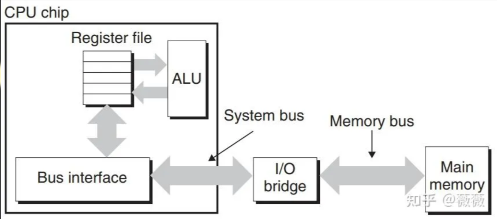

## 磁盘（Magnetic Disk）

- 非易失性存储器，断电后数据不丢失。
- 容量数量级：``GB-TB``。
- 访问时间：``ms``级别。
- 使用磁信号存储数据，由多个``盘片``组成。
- 每个盘片有两面称为``表面``，都有数据可读写。
- 中央有一个旋转的``主轴``，使得盘片以固定旋转速率旋转。
- 磁道：盘面上同一半径的圆周，每一盘面有多个磁道。
- 扇区：每个磁道被分为多个扇区，每个扇区包含相等数量的数据位（通常512字节）。
- 扇区中间有间隙，不存储数据位，用于表示扇区的格式化位。
- 磁盘由一个多个叠放在一起的盘片组成的，它们被封装在一个密封的包装里。
- 整个装置被称为磁盘驱动器，简称为磁盘/旋转磁盘。
- 柱面：所有表面上半径相同的磁道集合构成一个柱面，磁盘上所有的读写头都位于同一柱面上。

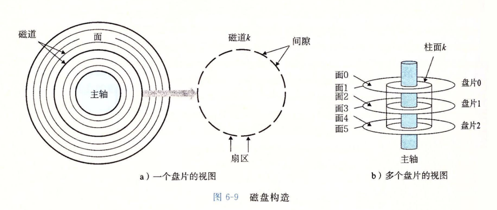

磁盘容量由盘面、磁道、扇区等参数共同决定。

- 一个磁盘可以记录的最大位数称为它的最大容量，简称为容量。

容量由三种密度共同决定。

- 记录密度(位/英寸)：磁道一英寸的段中可以放入的位数。
- 磁道密度(道/英寸)：从盘片出发半径上一英寸的段内可以有的磁道数。
- 面密度(位/平方英寸)：记录密度和磁道密度的乘积。

- 传统方法：每个磁道都分为相同数量的扇区，则扇区数目由最内磁道决定的，同时外周磁道会有很多空隙。
- 若每个磁道的扇区数都不相同，读写的复杂度会急剧上升。

多区记录将柱面分为若干组，每组内部采用相同的扇区数，不同组的扇区数可以不同，从而更有效地利用空间。

- 磁盘容量=盘片数 $\times$ 盘片表面数 $\times$ 磁道数 $\times$ 扇区数 $\times$ 扇区比特数
- 制造商通常以千兆字节(GB)或者兆兆字节(TB)为单位表达磁盘容量。

不同设备使用的容量前缀并不相同。

| 设备 | K | M | G | T |
| --- | --- | --- | --- | --- |
| DRAM/SRAM | $2^{10}$ | $2^{20}$ | $2^{30}$ | $T=2^{40}$ |
| 磁盘、网络等I/O设备 | $10^3$ | $10^6$ | $10^9$ | $T=10^{12}$ |

内存及更快的层级通常使用2的幂次，内存以下较慢的设备通常使用10的幂次。

磁盘读写的代价主要来自机械移动。

- 对于高速旋转的磁盘来说，任何灰尘都有巨大的冲量，称为读\写头冲撞。
- 寻道(Seek)：磁盘的读写头移动到对应的柱面/磁道上。
- 旋转(Rotation)：磁盘转动到文件的初始位置。
- 数据转移(Transfer)：读写头开始读入数据，同时磁盘保持旋转。

访问一个扇区的时间主要分为三部分。

- 寻道时间 $T_{seek}$ 表示传动臂定位所需的时间，依赖于读写头以前的位置以及传动臂移动速度。
- 旋转时间 $T_{rotate}$ 表示定位到磁道后等待目标扇区第一个位的时间，依赖于读写头到达目标扇区时的位置以及磁盘旋转速度，最差情况为 $\frac{1}{\mathrm{RPM}} \times 60s/min$ 。
- 传送时间 $T_{transfer}$ 表示实际读写数据的时间，依赖于传送速度以及每条磁道的扇区数目。

- 寻道和旋转的时间通常占据大部分时间，且这两者时间相当。

例如，某磁盘的旋转速率为 7200 RPM，每条磁道平均有 400 个扇区。一个扇区的传送时间等于一圈的旋转时间除以每圈扇区数

$$
\frac{60}{7200}\times \frac{1}{400}\times 1000 \approx 0.02\mathrm{ms}
$$

该结果不包含寻道时间和平均旋转延迟。计算平均访问时间时，三部分都要计入。

逻辑磁盘块把复杂的物理结构抽象成连续编号。

- 对操作系统隐藏物理磁盘的复杂性，因此创造出逻辑块。
- 编号为 $0,1,\ldots,B-1$ 。
- 磁盘控制器维护逻辑块与物理磁盘扇区的关系。
- 磁盘控制器会将一个逻辑块号翻译为(盘面，磁道，扇区)的三元组。
- 磁盘控制器需要对磁盘进行格式化，然后才能在该磁盘上存储数据。
- 格式化会填写扇区间隙，标识表面有故障的柱面，并且不再使用它们。
- 留有一些备用的柱面，因此磁盘的实际容量略小于最大容量。

I/O 设备通过总线和控制器接入系统。

- I/O设备，例如鼠标键盘等，都是通过I/O总线(例如Intel的外围设备互联(PCI)总线)连接到CPU和主存的。
- USB 控制器、图形适配器和硬盘控制器都属于典型的 I/O 设备。
- I/O总线与底层CPU无关，比系统总线和内存总线慢。

连接到I/O总线的常见设备包括以下几类。

- 通用串行总线(Universal Serial Bus/USB)控制器：作为连接USB设备的中转站。
- 图形卡/适配器：包含硬件和软件逻辑，代表CPU在显示器上绘制像素。
- 主机总线适配器：将一个或多个磁盘连接到I/O总线，并使用专门的主机总线接口协议通信。
- 网络适配器等扩展设备：插入主板扩展槽后直接连接到I/O总线。

常用磁盘接口包括SCSI和SATA。SCSI更快、更贵，可以支持多个磁盘驱动器；SATA更慢、更便宜，通常只支持一个驱动器。

- PCI模型中，系统中所有设备共享总线，一个时刻只能有一台设备访问这些线路。
- 现代系统中，PCI已经被PCIe取代，是一组高速串行、通过开关连接的点到点链路。
- 不同总线之间的区别对应用程序来说是不可见的。

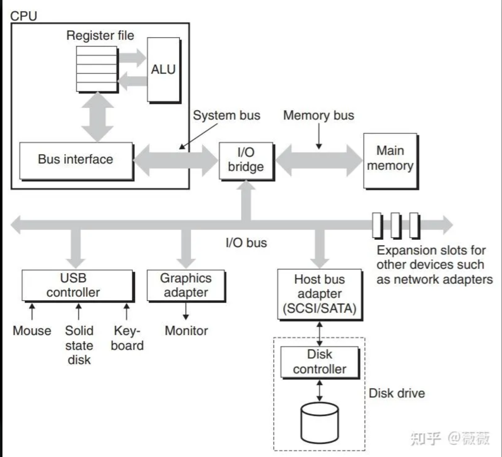

访问磁盘时，CPU 通常不直接搬运所有数据。

- CPU使用内存映射I/O(Memory-mapped I/O)技术向I/O设备发射命令。
- 地址中有一块地址是为与I/O设备通信保留的，每个这样的地址被称为一个I/O端口(I/O Port)。
- 一个设备连接到总线时，它与一个或多个端口关联。
- 外存设备(硬盘、SSD等)，与CPU之间的读写操作不同步，因此需要通过中断机制(Interrupt)来通知CPU操作完成。

一次磁盘读取按下面的过程完成。

1. CPU发送读命令，同时给出是否在完成后触发中断、目标逻辑块号和接收数据的主存地址。
2. 磁盘控制器把逻辑块号翻译为扇区地址并读取内容，此时CPU可以继续执行其他工作。
3. 控制器通过直接内存访问(Direct Memory Access,DMA)把数据直接传送到主存，无须CPU参与搬运。
4. DMA传送完成后，磁盘控制器向CPU外部引脚发送中断信号。
5. CPU暂停当前工作并跳转到操作系统的中断处理例程，记录I/O已经完成，再返回被中断的位置。

- 随着CPU、SRAM、DRAM以及外存之间频率差异的增大，存储器层次结构的设计变得尤为重要。

## 固态硬盘（Solid-State Drive，SSD）

- 是一种基于闪存的存储技术，传统旋转磁盘的替代品，通常贵于传统旋转磁盘。
- 一个 SSD 封装由一个或多个闪存芯片和控制器组成，控制器中的闪存转换层（Flash Translation Layer，FTL）负责把操作系统看到的逻辑块地址映射到物理闪存页。
- 闪存由多个擦除块（Block）组成，每个块包含多个页（Page）。页是读写单位，块是擦除单位；常见页大小为数 KiB 到十几 KiB，擦除块则要大得多。
- 读SSD速度比写SSD快，顺序访问比随机访问快。
- 数据以页为单位读写，只有在一页所属的块被擦除(通常全置1)后，才能写入。
- 闪存不能直接覆盖已经写过的页。更新某个逻辑页时，FTL 通常把新内容写入空闲物理页，再把旧页标记为无效，这种方式称为异地更新（Out-of-Place Update）。
- 当空闲页不足时，垃圾回收会把某个块中的有效页搬到新块，再擦除整个旧块。主机只写一个页，设备内部却可能搬运更多数据，实际闪存写入量与主机写入量之比称为写放大。
- 优点：SSD没有移动部件，功耗较低，抗震性较强。
- 缺点：闪存块的擦写寿命有限，随机小写入还会带来垃圾回收和写放大。控制器通过磨损均衡让擦除次数分散到不同块，操作系统则可以用 ``TRIM`` 告知 SSD 哪些逻辑块已经不再使用。
- 价格：SRAM>DRAM>SSD>磁盘

## 局部性（Locality）

- 程序倾向于使用刚用过的数据以及其附近的数据，前者为时间局部性，后者为空间局部性。
- 请看以下代码：

```c
int sum(int v[N]) {
    int i, sum = 0;
    for (i = 0; i < N; i++) sum += v[i];
    return sum;
}
```

- 每次循环都写入一个累加变量，体现时间局部性。
- 访问的数组在内存中处在相邻地址，体现空间局部性。
- 指令也是数据的一种，因此指令也有局部性。
- 即：指令按顺序执行，例如``for``循环，具有良好的时间(循环体、循环变量复用)和空间局部性(循环内部指令连续)。
- 步长为 $k$ 的引用模式：每隔 $k$ 个元素进行访问，步长越短，空间局部性越强。(注意行访问优于列访问)
- 循环次数越多越好，循环体越小越好。

假设缓存行大小为 64 B，``int`` 占 4 B。顺序扫描数组时，一条缓存行能够提供连续 16 个元素；忽略预取和边界影响，平均每 16 次访问只有第一次发生冷不命中。若步长改成 16 个 ``int``，每次访问都落到下一条缓存行，加载进来的另外 60 B 几乎没有被使用。

这也是二维数组按行访问通常快于按列访问的原因。C 语言按行优先存储，固定行、连续改变列下标会顺着内存前进；固定列、连续改变行下标则会以整行长度作为步长。

## 存储器层次结构（Memory Hierarchy）

- 随着CPU、SRAM、DRAM以及外存之间频率差异的增大，存储器层次结构的设计变得尤为重要。
- 综合存储技术和局部性，得到存储器层次结构：

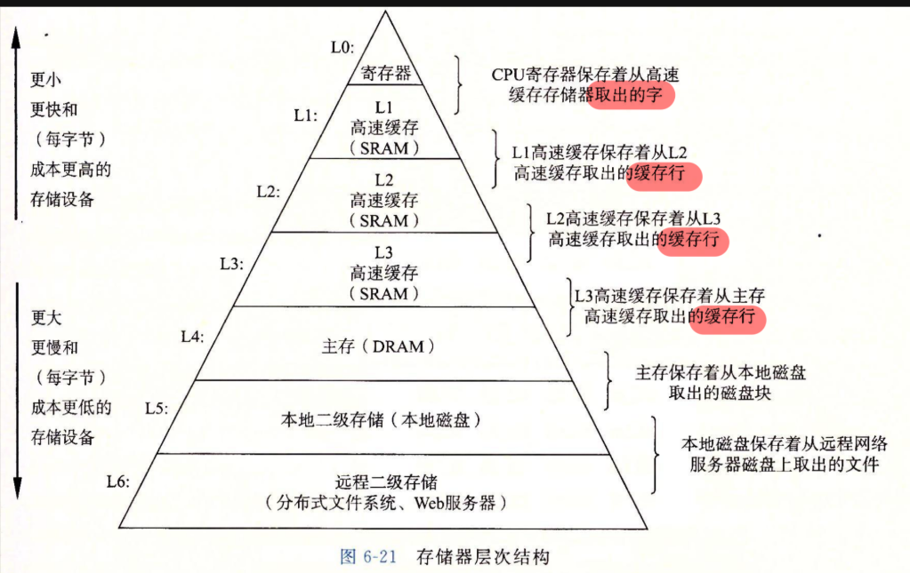

- 越靠近CPU的存储器，速度越快，单位比特成本越高，容量越小。
- 越远离CPU的存储器，速度越慢，单位比特成本越低，容量越大。
- 该架构遵循局部性原理，随着层级升高，访存的时间成本增大，因此块的大小也变大。
- 在该层次结构中，还可能存在磁带等等层级。
- 使用 $L_k$ 作为 $L_{k+1}$ 的缓存
- 缓存命中：能找到，就不需要访问 $L_{k+1}$
- 缓存不命中：找不到，去访问 $L_{k+1}$ ，此时需要复制，耗时较长。

高速缓存（Cache）位于 CPU 和主存之间。

- 是存储在更大、更慢的设备中的数据对象的缓冲区域，使用其的过程称为缓存。
- 它需要记录块中的数据，以及对应于主存中的哪个块。
- 在Cache中通过行(Line)组织数据。
- 一条缓存行由一个有效位记录其中数据是否有效。
- 由标记(Tag)记录其对应主存中的哪个块。
- 其余部分存储块中的数据。


- 数据以块为传送单元，在缓存和下层之间来回复制。越远离 CPU，块通常越大。

Cache 按组、行和块组织。

- 一个计算机系统，每个存储器地址有 $m$ 位，形成 $M=2^m$ 个不同的地址。
- 高速缓存的组数使用 $S=2^s$ 这一参数表示，它决定地址索引字段长度。
- 高速缓存的相联度使用 $E$ 表示，即每组包含的缓存行数。
- 高速缓存的块大小使用 $B=2^b$ 这一参数表示，它决定块偏移字段的长度。
- 每个行有 1 个有效位(Tag bit)：指明该行是否包含有意义的信息。
- 每个行有 $t=m-(b+s)$ 个标记位，用于标识存储在该高速缓存行中的地址。
- 地址中有 $b$ 位用于选择块内字节，每条缓存行的数据块包含 $B=2^b$ 字节。
- 总容量(Capacity)： $C=B \times E \times S$ 字节，不包含标记位和有效位。

一个缓存地址总共 $m$ 位，从高位到低位分成三个字段。

| 字段 | 位数 | 作用 |
| --- | --- | --- |
| 标记 | $t$ | 区分映射到同一组的不同内存块 |
| 组索引 | $s$ | 选择缓存组 |
| 块偏移 | $b$ | 选择块内字节 |

小写符号表示位数，大写符号表示总数。

- 注意行和块其实指的是同一块区域，两者为了方便有时候会混用。

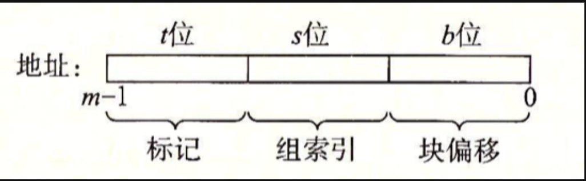

地址拆分可以直接用位运算完成。假设缓存行大小为 64 B、共有 64 组且为 2 路组相联，那么块内偏移和组索引都占 6 位。对地址 ``0x1234`` 而言：

```text
block offset = 0x1234 & 0x3f        = 0x34
set index    = (0x1234 >> 6) & 0x3f = 0x08
tag          = 0x1234 >> 12          = 0x01
```

``0x2234`` 和 ``0x3234`` 的组索引与块内偏移都相同，但标记分别为 ``0x02`` 和 ``0x03``。前两个块可以同时放进该组的两条行；第三个块到来时，就必须根据替换策略驱逐其中一条。

设地址长度为 32 位，直接映射 Cache 的数据容量为 32 KiB，块大小为 8 Bytes。

- 块偏移位数由 $b=\log_2 8=3$ 给出。
- Cache 一共有 $32\mathrm{KiB}/8=4096$ 个块。
- 直接映射时 $E=1$ 所以组数为 $S=4096$ 组索引位数为 $s=12$ 位。
- 标记位数由 $t=32-12-3=17$ 给出。
- 每条缓存行还需要 1 位有效位。

因此，Cache 的数据与这些元数据至少占用

$$
32\times 1024+\frac{(1+17)\times 4096}{8}=41984\mathrm{Bytes}
$$

计算元数据大小时不要漏掉有效位，也不要混用 bit 和 Byte。先写出 $m=s+t+b$ 这一关系，再按 bit 汇总每条缓存行的元数据，最后换算为 Byte。


地址字段的划分与局部性相配合。

- 块偏移让相邻字节位于同一个块内，从而利用空间局部性。
- 组索引取地址中间的若干位，让相邻数据块映射到不同组，减少它们挤占同一组造成的冲突。
- 标记使用剩余高位，区分映射到同一组的不同内存块。

这种方式称为中间比特索引。

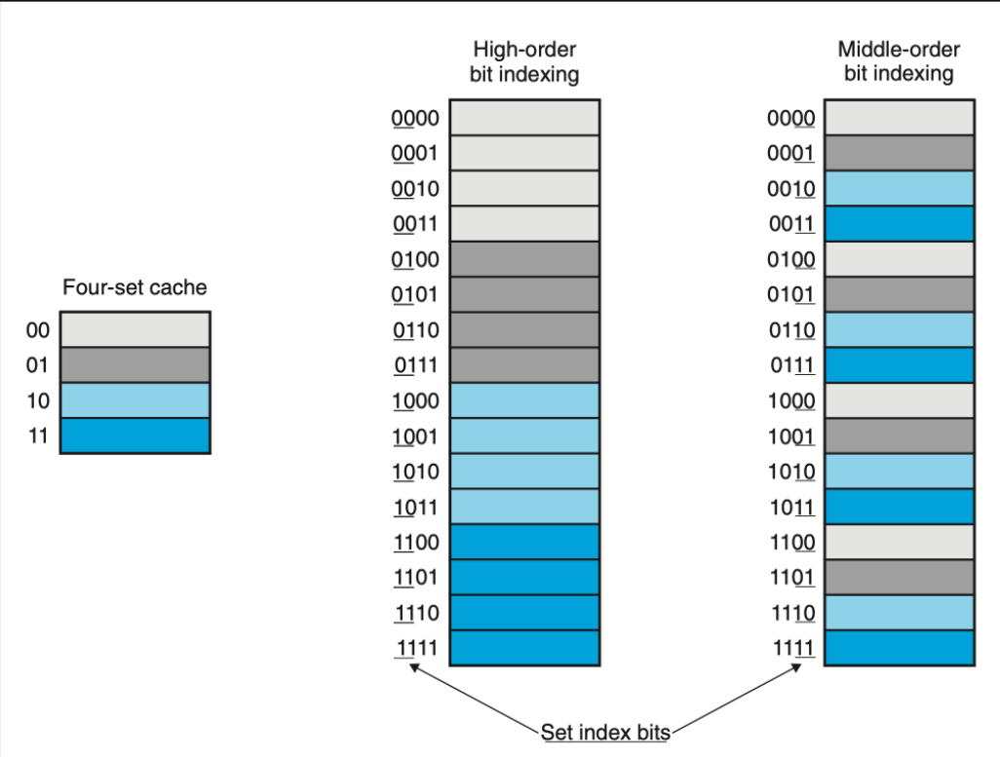

缓存寻址会把地址拆成标记、组索引和块偏移。

- 地址解码：提取索引位、标记位和块偏移。
- 组选择：根据索引定位目标缓存组。
- 行匹配：并行比对所有行有效位有效并且标记为匹配的缓存行。
- 字抽取：若存在命中，则返回该行数据。
- 行替换/驱逐：选择一个现有的块/行驱逐，从低一级存储器中读取新数据放入缓存。

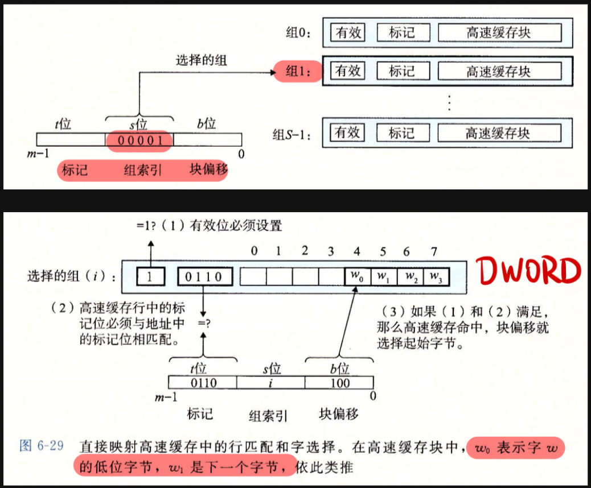

缓存不命中时，需要选择一个块替换出去。

- 最近最少使用(Least Recently Used,LRU)：替换最后一次访问时间最久远的行，硬件成本高。
- 最不常使用(Least Frequently Used,LFU)：替换过去某个时间窗口内引用次数最少的行。
- 先进先出(First In First Out)：替换最早进入缓存的数据，实现简单而低效。
- 随机替换：随机选择一个进行替换，适用于高相联度场景。
- 三者的具体效果取决于实际情况。

缓存不命中分为以下几类。

- 冷不命中/强制性不命中：数据块从未进入缓存，短暂性，在暖身后不会出现。
- 可以通过判断有效位全为0来实现。
- 缓存暖身：提前把可能会用到的数据加载到缓存中，避免初期频繁的缓存不命中。
- 冲突不命中：缓存块的预期位置被其他数据块占据，虽然工作集小于缓存总容量，映射限制仍使它们无法同时放入缓存。这在直接映射中尤为显著。
- 容量不命中：工作集太大了，缓存无法处理这个工作集。
- 抖动：当多个数据频繁被访问，但是无法同时放入缓存中，系统不断在缓存和主存间进行的频繁数据替换。
- 解决方式：可以在数组末尾放置字节填充，从而改变下一个数组的地址（组索引等）。

随机放置非常灵活，但硬件代价高；通过模运算等规则限制放置位置成本较低，却更容易出现冲突不命中。

缓存映射策略决定一个内存块能放到哪些缓存位置。

### 直接映射

直接映射满足 $E=1$ ，每个组仅有一行，每条缓存行负责若干个固定的主存块。它的硬件最简单，但最容易发生冲突不命中，循环访问映射到同一组的地址时会产生抖动。

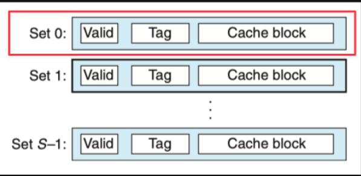

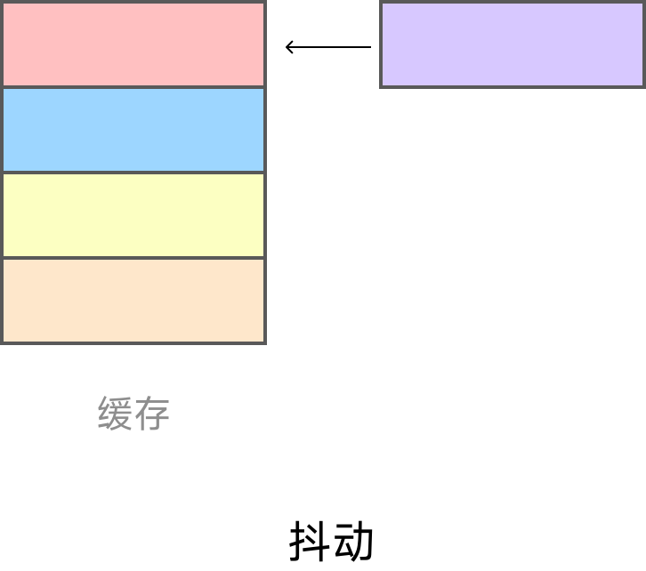

抖动指两个或多个常用块不断争抢同一个组。即使缓存总容量足够，映射规则仍可能把它们固定到同一位置，使每次访问都驱逐上一次装入的块。`Cache Lab` 中调整矩阵分块大小和访问顺序，正是为了减少这类冲突。

### 组相联高速缓存

组相联高速缓存满足 $1<E<\frac{C}{B}$ ，每个组内有多条缓存行，内存块可以映射到组内任意一行。$E$ 被称为路数，这种结构也称为 $E$ 路组相联。

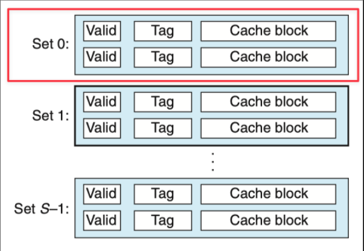

### 全相联高速缓存

全相联高速缓存满足 $E=\frac{C}{B}$ ，只有一个组，因此 $s=0$ 。所有内存块都能放入任意一行，最不容易发生冲突不命中；代价是每次访问都要并行匹配所有行的标记位，硬件复杂且速度较慢，通常用于TLB等小容量关键缓存。

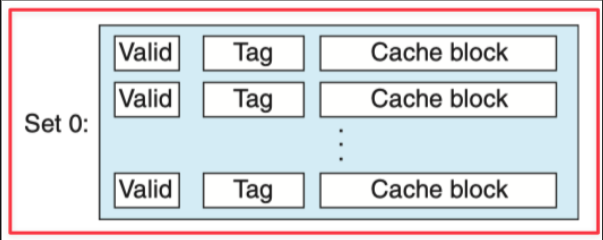

缓存写策略决定写命中和写不命中时怎样处理。

向缓存中写数据时，要分别处理写命中和写不命中。

写命中有两种策略。

- 直写(Write-Through)：同时更新缓存和低一层存储器。每次写都会产生总线流量，暂时性的写入也会占用时间。
- 写回(Write-Back)：只更新缓存行，并用修改位(Dirty Bit)记录数据是否改变。被修改的行在驱逐时才写回主存，思想类似于延迟标记线段树和懒删除堆。它减少了主存访问次数，但控制电路更复杂。

写不命中也有两种策略。

- 写分配(Write-Allocate)：先从主存加载目标块，再更新缓存行。它试图利用写入的空间局部性，但每次不命中都要从低一层传送一个块。
- 非写分配(Not-Write-Allocate)：绕过缓存，直接把数据写到低一层。

- 直写通常与非写分配搭配，写回通常与写分配搭配。
- 存储器层次结构中较低层倾向于使用写回。
- 写回写分配与处理读的方式对称，它试图利用局部性，可以减少访存次数。
- 现代处理器在L1-L3缓存中普遍使用写回+写分配组合策略，可以减少大量总线传输量。

高速缓存参数会同时影响命中率和命中时间。

- 性能的量化指标，即命中率： $H=\frac{N_{hit}}{N_{total}}$
- 不命中率： $M=1-H$
- 命中时间：从高速缓存传送一个字到CPU的时间。
- 不命中处罚：因为不命中所需要的额外时间。
- 多级缓存体系下，提高很少的命中率，性能就可能大幅提升。

平均访存时间（Average Memory Access Time，AMAT）把命中时间和不命中代价放到同一个式子里

$$
AMAT=T_{hit}+r_{miss}\times P_{miss}
$$

多级缓存可以递归代入。若 L1 命中时间为 4 个周期、L1 不命中率为 5%，L2 命中时间为 12 个周期、L2 局部不命中率为 20%，主存访问需要 200 个周期，那么

$$
AMAT=4+0.05\times(12+0.20\times200)=6.6
$$

虽然 95% 的访问都在 L1 命中，剩余访问仍把平均代价从 4 个周期拉高到 6.6 个周期。缓存优化中看似很小的不命中率变化，可能对应明显的运行时间差异。

| 参数 | 增大后的收益 | 增大后的代价 |
| --- | --- | --- |
| 高速缓存大小 $C$ | 更容易容纳完整工作集，降低容量不命中率 | 命中时间变长 |
| 块大小 $B$ | 更充分地利用空间局部性 | 可能浪费载入数据，并增大不命中处罚 |
| 相联度 $E$ | 降低冲突不命中和抖动概率 | 硬件更复杂，需要更多标记和LRU状态，命中时间与不命中处罚都会增加 |

直写高速缓存容易实现，还可以使用独立的写缓冲区更新内存。写回不会在每次命中时触发内存写，因此总线流量较低。具体选择需要在命中时间、不命中率和不命中处罚之间折中。

参考机 Intel Core i7 的缓存可以作为一个具体例子。

其CPU芯片由四个核心组成，采用三级缓存。

- 块大小统一为64B。
- L1 Cache分为``i-cache``和``d-cache``，分别存储指令和数据，只有``d-cache``直连到寄存器。
- L1 Cache为32KB，8路，访问4周期。
- L2 Cache：256KB，8路，访问10周期。
- L3 Cache：8MB，16路，访问40-75周期。

写缓存友好代码时，核心还是利用局部性。

- 让最常见的情况运行得快。
- 尽量减少每个循环内部的缓存不命中数量。

## 存储器山

- 程序从存储系统中读数据的速率称为读吞吐量/读带宽。
- 吞吐量以兆字节/秒作为单位。
- 反复改变工作集大小(size)和步长(stride)，能得到一个读带宽的时间和空间局部性的二维函数，即存储器山。
- 每个计算机都有表明其存储器系统的唯一的存储器山。

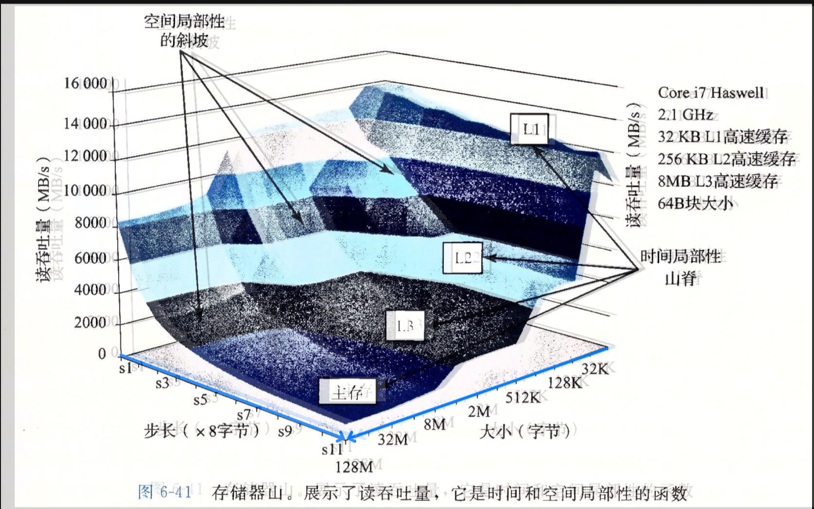

存储器山展示了步长和工作集大小对性能的影响。

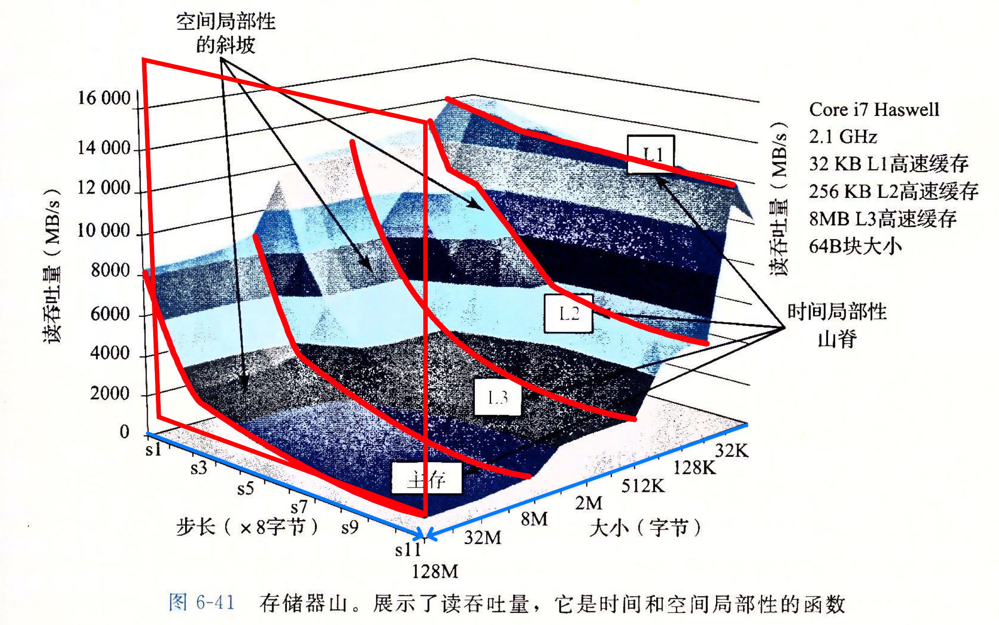

步长(Stride)较小时，空间局部性、缓存命中率和带宽利用率都较高。随着步长增加，更多载入的数据未被使用，吞吐量随之下降。

工作集(Size)较小时，数据容易装入上级缓存，时间局部性较好。工作集超过某一级缓存容量后，更多数据需要从更低层存储器读取，传输速率和吞吐量都会下降。

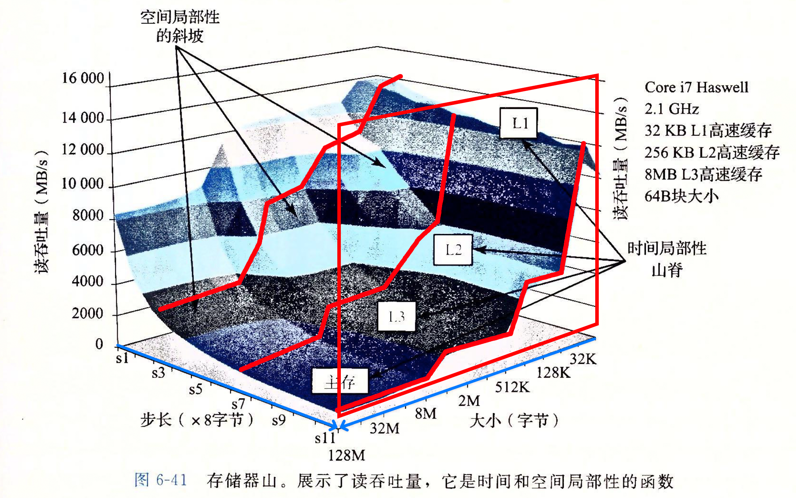

硬件预取会在数据块被实际访问前将其加载进高速缓存。它能够识别顺序、步长为1的引用模式，提前取入后续数据块并减少访问延迟，因此在步长较小时效果最好。

重新排列循环可以改善空间局部性。

- 可以以矩阵相乘为例子，还是注意连续访问。
- 在``Cache Lab``中非常重要！
- 分块策略：提高内循环的时间局部性。
- 将一个程序中的数据结构组织成的大的片，称为块。
- 构造程序，使得能够将一个片加载到L1中，并且在这个片中进行所需的读写。
- 然后丢掉它，加载下一个片。
- 使得代码更难阅读和理解，可以在没有预取的系统上提高性能。

在程序里利用局部性，通常可以从访问顺序入手。

- 局部性好的程序从缓存中获取数据，局部性差的程序从DRAM主存中获取数据。

优化时应把注意力集中在内循环中，按照数据对象的存储顺序以步长1读取，并在数据进入缓存后尽可能多地使用它。
