## 链接（Linking）

链接是将各种代码和数据片段收集并组合成单一文件的过程。

- 主要任务：符号解析（Symbol Resolution）与重定位（Relocation）。
- 目标文件：源代码经过编译后得到、尚未链接为可执行文件的产物。
- 可执行文件：链接后的最终产物，这个文件可被加载进内存并执行。
- 链接可在编译时、加载时、运行时均可执行。

链接解决的是多个模块如何合成一个程序的问题。

- 模块化：支持将程序分解为独立的模块进行开发和维护，提高代码可重用性和可管理性。
- 提高时间效率：允许并行编译不同的模块，从而减少编译时间，修改某个模块后只需重新编译该模块并链接。
- 提高空间效率：静态链接器只从归档库中取出解决当前符号引用所需的目标模块；配合函数分节与节回收，还能进一步丢弃未使用代码。动态链接则允许多个进程共享库的只读代码页。

编译过程分为四个阶段。


- ``gcc``充当``编译器驱动程序``，代表用户在需要时调用语言预处理器、编译器、汇编器和链接器。
- 预处理：由``cpp``进行``C 预处理``，处理源代码中以``#``开头的指令，将``xx.c``翻译为一个``ASCII``码的``中间文件xx.i``。
- 可以使用``gcc -E src.c -o src.i``进行操作。
- 编译：由``cc1``，即``C 编译器``进行编译，翻译为汇编语言，生成一个``ASCII``码的``汇编文件xx.s``。
- 可以使用``gcc -S src.c -o src.s``进行操作。
- 汇编：汇编器``as``将汇编语言翻译为机器语言，生成可重定位的目标文件``xx.o``，文件中包含不同的代码和数据节。
- 可以使用``gcc -c src.c -o src.o``进行操作。
- 链接：链接器``ld``将``xx.o``和其他的``xx.o``，以及必要的系统库文件，合并为可执行文件``prog``。
- 可以使用``gcc src.o -o executable``进行操作。

各阶段的产物可以直接用工具检查。``readelf -h`` 查看 ELF 头，``readelf -S`` 查看节表，``readelf -s`` 查看符号表，``readelf -r`` 查看重定位条目；``objdump -dr file.o`` 会把反汇编和重定位位置放在一起。链接章节里的地址变化，用这些命令比只看最终可执行文件更直观。


## 静态链接（Static Linking）

- 链接器需要实现符号解析和重定位两个任务。
- 以一组可重定位目标文件和命令行参数作为输入。
- 输出一个完全链接的、可以加载和运行的可执行目标文件作为输出。
- 符号解析：将``符号引用``和输入的可重定位目标文件中的``符号表``中一个确定文件关联起来。
- 重定位：``合并重定位输入模块``，将符号定义跟一个地址关联起来，并为找到的每个符号指向对应的地址。

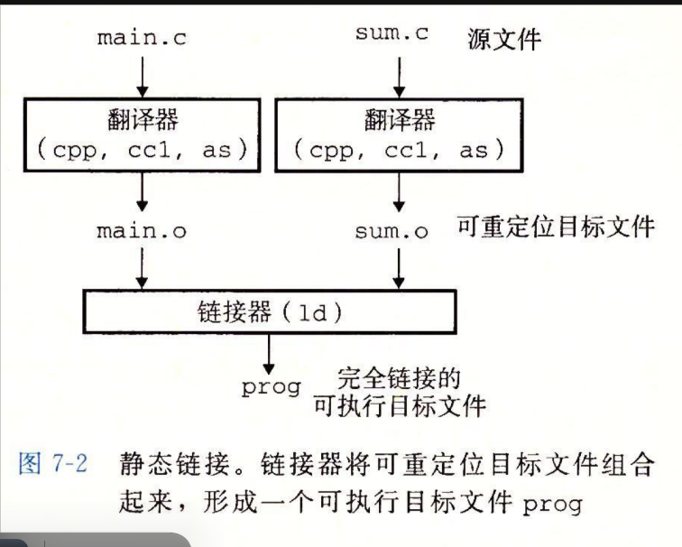

目标文件是链接器工作的主要对象。

- 可重定位目标文件(``.o``)：包含机器代码和数据，无法单独运行。
- 可执行目标文件(``.out/.exe``等)：包含机器代码和数据，可以单独运行。
- 共享目标文件(``.so(Linux)/.dll(Win)``)：特殊的可重定位目标文件，可以在加载或运行时被动态加载进内存并链接。

可重定位目标文件还没有确定最终装载地址。


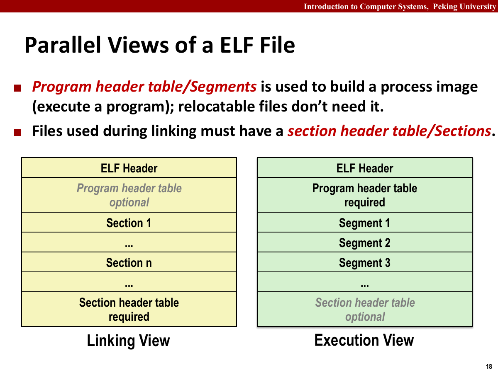

- ELF头：以``16字节``序列开始，描述生成该文件的系统的字的大小和字节顺序。
- 其它部分包含帮助链接器语法分析和解释目标文件的信息，包括ELF头大小、目标文件类型，机器类型，节头部表的文件偏移，节头部表中条目大小及数量。
- 运行时，根据以上信息，先定位到ELF头，再根据其信息找到节头部表，再根据节头部表找到相应的节。

常见的ELF节及其内容如下。

| 节 | 内容 |
| --- | --- |
| ``.text`` | 已编译程序的机器代码 |
| ``.rodata`` | 只读数据 |
| ``.data`` | 已初始化的全局变量和静态变量 |
| ``.bss`` | 未初始化或初始化为0的全局变量和静态变量；文件中只记录大小和位置，运行时再分配内存 |
| ``.symtab`` | 链接器关心的局部符号、全局符号和未定义符号；普通自动变量通常不靠它参与链接 |
| ``.rel.text`` / ``.rela.text`` | 代码节的重定位信息；x86-64 ELF常使用带显式加数的``RELA``形式 |
| ``.rel.data`` / ``.rela.data`` | 数据节中地址引用的重定位信息 |
| ``.strtab`` | 字符串表，保存符号名和节名，由以``null(\0)``结尾的字符串组成 |
| ``.debug`` | 调试信息，使用``-g``时产生 |
| ``.line`` | 原始C程序行号与``.text``机器指令的映射，使用``-g``时产生 |

节头部表记录各节的起始位置，调试信息还可能分散在多个``.debug_*``节中。

符号和符号表负责记录名字与位置的关系。

- 每个可重定位目标模块都有一个符号表，包含符号的定义和引用详情。

符号分为三种。

- 全局符号：由当前模块定义并且能被其他模块引用，对应非静态函数与全局变量。
- 局部符号：由当前模块定义且只能在模块内使用，对应静态函数和静态全局变量。
- 外部符号：由当前模块引用但未在其中定义，定义来自其他模块。

- 局部变量存在栈中，而非符号表中。
- 静态成员只能在其定义模块内使用，编译器在``.data``或``.bss``中分配空间，创造仅有唯一名字的符号。
- 若不同模块中有重名，则会生成``x.1``与``x.2``加以区分。

符号表条目包含以下字段。

| 字段 | 含义 |
| --- | --- |
| ``name`` | ``strtab``中的偏移，指向以NUL字节结尾的符号名 |
| ``value`` | 在可重定位模块中表示相对所在节起始位置的偏移，在可执行文件中表示绝对运行时地址 |
| ``size`` | 目标大小，单位为字节 |
| ``type`` | 函数或数据等符号类型 |
| ``binding`` | 本地或全局等绑定方式 |
| ``section`` | 符号所在的节 |

符号还可能指向三个不出现在节头部表中的伪节。

| 伪节 | 含义 |
| --- | --- |
| ``UNDEF`` | 当前模块引用、由其他模块定义的未定义符号 |
| ``COMMON`` | 尚未分配位置的未初始化全局变量；``value``给出对齐要求，``size``给出最小大小。使用``-fno-common``编译时，这些变量会放入``.bss`` |
| ``ABS`` | 不应被重定位的符号 |

符号解析要把每个引用对应到唯一的定义。

全局符号分为强符号和弱符号。函数与已初始化的全局变量是强符号，未初始化的全局变量是弱符号。链接器按三条规则处理同名定义。

1. 不允许存在多个同名强符号。
2. 一个强符号和多个弱符号同名时，选择强符号。
3. 多个弱符号同名时，任意选择一个。

- 因此，为避免规则三带来的麻烦，尽量使用``static``定义全局变量。
- 尤其是，当同名符号类型不同时，可能导致严重错误，比如覆盖其他变量或者非法访问。
- 因此，当文件``A``有一个弱符号``x``时，它不知道之后是否有强符号``x``，此时会放到``COMMON``中等待取舍。

静态库是一组可重定位目标文件的归档。

- 一组目标文件的集合，通过将它们打包成一个单独的文件，实现代码重用。
- 编译时链接到应用程序中，生成一个包含所有代码的可执行文件。

若让编译器直接识别所有标准函数调用，大量标准函数会显著增加编译器复杂度，并要求编译器频繁更新。把所有标准函数放进单个目标模块又会让每个可执行文件包含完整副本，浪费磁盘和内存；把每个函数拆成独立目标文件，则需要使用者逐一指定，容易出错。

- 因此，相关函数可被编译为独立目标模块，然后封装为单独静态库文件。
- 链接时，只复制被引用的目标模块。
- 静态库以``存档``文件格式存放在磁盘中，存档文件是一组链接起来的可重定位目标文件的集合，有一个头部用来描述每个成员文件的大小和位置，用``.a``标识。

创建和使用静态库的命令如下。

```bash
gcc -c addvec.c multvec.c
ar rcs libvector.a addvec.o multvec.o
gcc -c main2.c
gcc -static -o prog2c main2.o ./libvector.a
gcc -static -o prog2c main2.o -L. -lvector
```

``-static``指定静态链接，``-L.``把当前目录加入库搜索路径，``-lvector``选择``libvector.a``。

解析静态库引用时，用``E``表示最终需要的成员目标文件，``U``表示未解析符号，``D``表示已定义符号。链接器逐个检查命令行输入：目标文件会直接读入；存档文件只取出能够定义``U``中符号的成员。扫描结束后若``U``仍非空，链接器就会报错并终止。

- 因此得出，命令行的文件顺序非常重要，需要遵循拓扑排序，因此有的存档文件可能需要多次出现在命令行中。

链接器通常从左到右扫描命令行。若 ``main.o`` 引用了 ``foo``，而 ``libfoo.a`` 中的 ``foo`` 又引用 ``bar``，正确顺序应为：

```bash
gcc main.o -lfoo -lbar -o main
```

扫描到 ``libfoo.a`` 时，``foo`` 已在未解析集合中，所以对应成员会被取出；随后新出现的 ``bar`` 再由 ``libbar.a`` 解决。若把 ``-lbar`` 放到 ``-lfoo`` 前面，链接器第一次扫过它时还没有看到对 ``bar`` 的需要，可能直接丢弃相关成员。循环依赖可以重复列出库，或用 ``-Wl,--start-group`` 与 ``-Wl,--end-group`` 要求链接器反复扫描。

重定位负责填入最终地址。

重定位分两步完成。

1. 重定位节和符号定义：将相同类型的节合并为聚合节，再为聚合节及其中的每个输入节分配运行时地址。
2. 重定位符号引用：修改代码节和数据节中的符号引用，使其指向正确的运行时地址。这一步依赖可重定位目标模块中的``重定位条目``。

- 重定位条目：由汇编器生成，告诉链接器在合并时如何修改这个引用。
- 代码的重定位条目放在 ``.rel.text`` 或 ``.rela.text`` 中，数据的重定位条目放在 ``.rel.data`` 或 ``.rela.data`` 中。

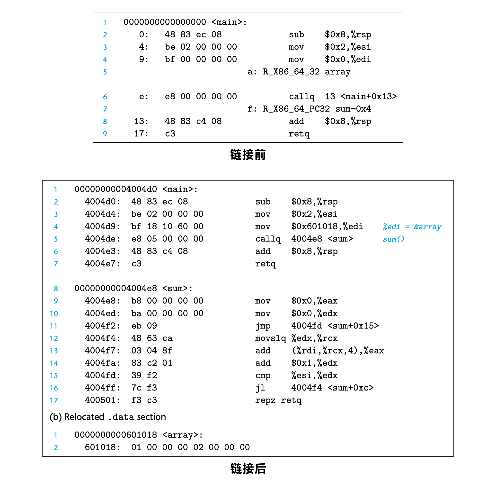

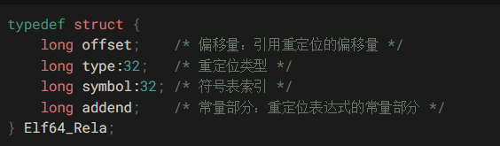

常见的重定位类型有两种。

- ``R_X86_64_PC32``：重定位一个使用32位``PC相对地址``的引用。
- ``R_X86_64_32``：重定位一个使用32位``绝对地址``的引用。

重定位过程如下图。

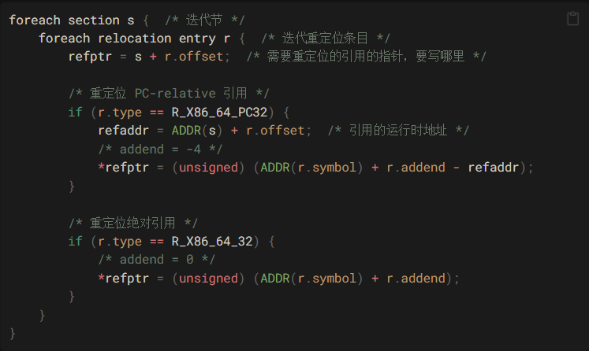

假设 ``s`` 是需要修改的输入节，``r.offset`` 是重定位字段在该节内的偏移，链接器先得到两个地址：

```text
refptr  = s + r.offset
refaddr = ADDR(s) + r.offset
```

``refptr`` 是链接器写入目标文件时使用的指针，``refaddr`` 是这几个字节被装载后所处的运行时地址。对常见的两类重定位，写入值分别为：

```text
R_X86_64_PC32: *refptr = ADDR(r.symbol) + r.addend - refaddr
R_X86_64_32:   *refptr = ADDR(r.symbol) + r.addend
```

例如，一个 ``call`` 指令的 4 字节位移字段位于 ``0x4004``，目标函数地址为 ``0x4020``。x86-64 的重定位条目常带加数 ``-4``，链接器写入的位移就是 ``0x4020 - 4 - 0x4004 = 0x18``。处理器执行时以位移字段后的 ``0x4008`` 为基准，加上 ``0x18``，恰好到达 ``0x4020``。

绝对重定位不减引用位置。若某个全局指针要保存地址 ``0x601018``，且加数为 0，链接器就把 ``0x601018`` 直接写进对应字段。

下面是相对重定位和绝对重定位的例子。

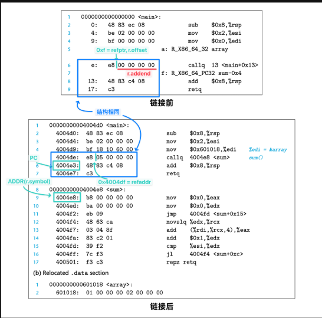

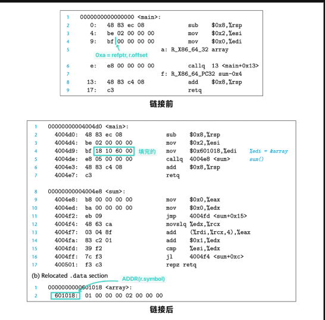

可执行目标文件已经可以被加载器装入运行。

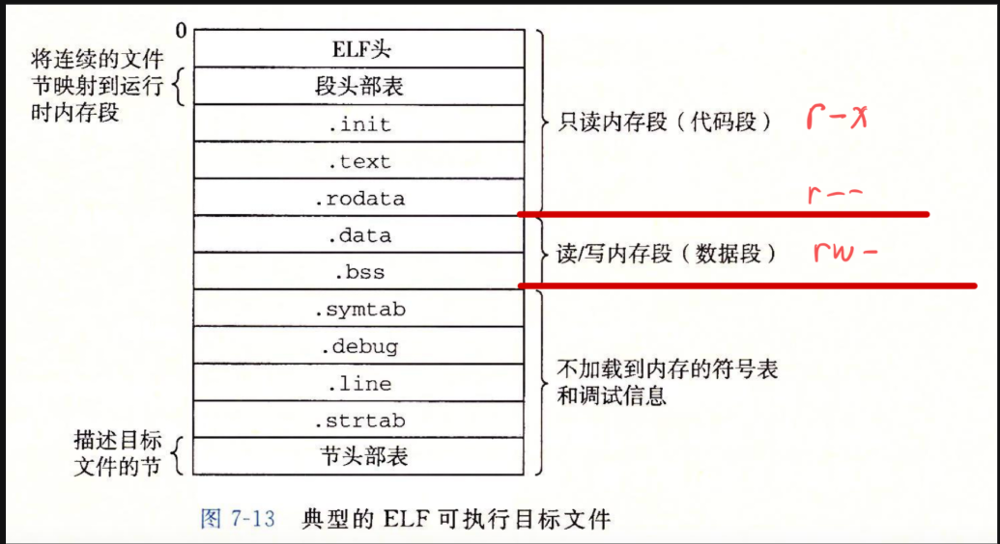

- 在这里，一个组织不再被称为节，而是称为段，即链接器根据目标文件中属性相同的多个节合并后的节的集合。
- ``ELF头``：描述文件的整体格式，包括程序的入口点（运行时执行的第一条指令地址）。
- ``.init``：比可重定位目标文件多出的，包括初始代码(即``_init``函数)，在程序开始时调用。
- ``.text/.rodata/.data``：与节的定义相似，但是已经被重定位了。
- ``.rel.text/.rel.data``不再存在，因为已经完全链接。

段和节观察文件的角度不同。段代表可执行代码、数据等内存区域，按照装载后的内存属性划分；节代表文件中的一组相关数据，按照功能和用途划分。

- 例如，上述即分为读/执行数据段/代码段/``r_x``，以及读写数据段/数据段/``rw_``
- 可执行文件的连续的片被映射到连续的内存段，程序头部表描述了这种映射关系。

加载可执行目标文件时，内核会建立新的进程映像。

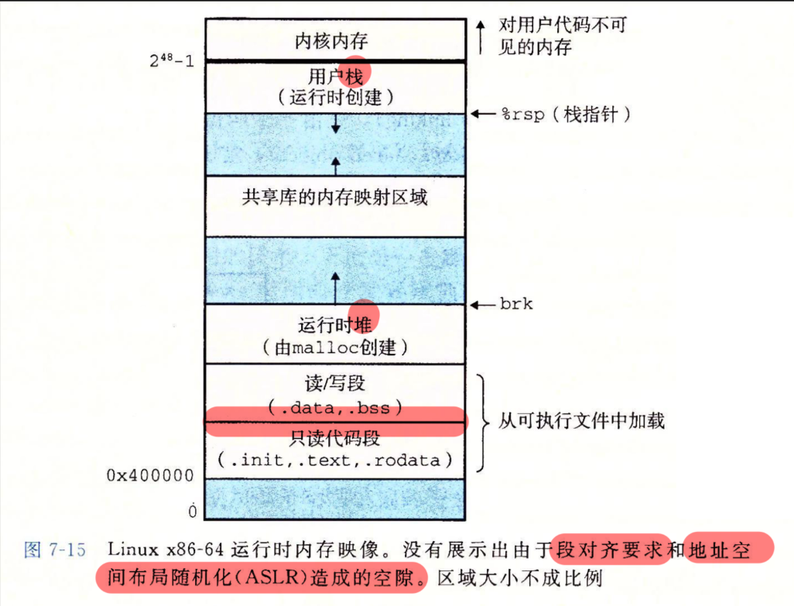

- 图里展示的是装载后的内存分布。
- 加载：将可执行目标文件的代码和数据复制到内存。
- 实现：加载器将可执行目标文件的代码和数据复制到内存中，随后通过跳转到程序的第一条指令或入口点来运行该程序。
- 传统的非 PIE x86-64 可执行文件常从 ``0x400000`` 附近开始映射；启用 PIE 后，主程序本身也可以像共享库一样被随机装载，实际地址应以程序头和运行时映射为准。
- 堆内存：在数据段之后，通过调用``malloc``向上增长。
- 用户栈：从最大的合法用户地址，即 $2^{48}-1$ 开始，向下增长。
- 栈上方的区域，为内存的代码与数据保留。
- 由于``.data``段有对齐要求，因此代码段与数据段之间有空隙。
- 在分配栈、共享库和堆段运行读地址时，链接器使用地址空间布局随机化，造成这其中有空隙。但是，它们的相对位置不变。
- 加载器按照程序头把可装载段映射进进程地址空间，并把控制交给 ELF 头记录的入口点。C 程序的入口通常是 C 运行库启动代码中的 ``_start``，它准备 ``argc``、``argv`` 和运行环境，再经 ``__libc_start_main`` 调用用户编写的 ``main``；``main`` 返回后，运行库负责执行清理逻辑并退出进程。

## 动态链接与共享库（Dynamic Linking and Shared Libraries）

- 静态库需要定期维护和更新
- 标准函数会被复制到每个运行进程的文本段中，是对内存的浪费。
- 动态链接：在运行时被动态加载和连接的库文件。
- C标准库``libc.so``通常是动态链接的。
- 首先使用以下指令来创建共享库``.so``文件：

```bash
gcc -shared -fPIC math.c -o libmath.so
# -shared指示gcc生成共享库文件；-fPIC指示gcc生成位置无关代码
# 使得gcc在当前目录下生成名为libmath.so的共享库文件
```

- 随后使用共享库编译主程序：

```bash
gcc main.c -lmath -L. -o main
```

- ``lmath``指示链接器使用``libmath.so``，``L.``指定库的搜索路径为当前目录。

加载时链接发生在程序启动阶段。

运行流程如下图。


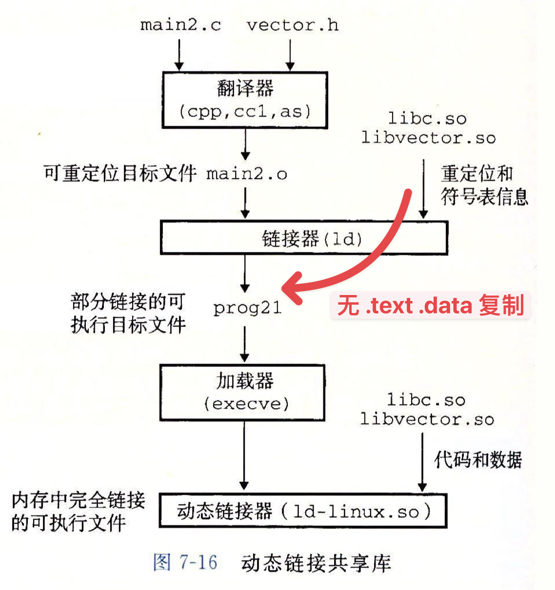

- 任意给定的文件系统中，对于一个库只有一个``.so``文件，所有引用该库的可执行目标文件共享其中代码和数据。
- 内存中，一个共享库的``.text``节的一个副本可以被不同的正在运行的进程共享。
- 链接器：负责在编译过程之后工作，将多个目标文件和库文件链接为一个可执行文件或库文件。
- 加载器：在程序执行阶段工作，将可执行文件加载到内存并准备好执行环境。
- 动态链接器：在加载器将程序加载到内存后、程序开始执行前工作，负责在运行时加载动态库和解析符号（进行重定位）。
- 加载时链接中，静态链接器``ld``将共享库的重定位和符号表信息写入可执行文件。加载器读到``.interp``节中的动态链接器``ld.so``路径后，调用动态链接器完成程序与共享库的链接，再将控制权交给程序。

运行时链接把库加载推迟到程序运行过程中。

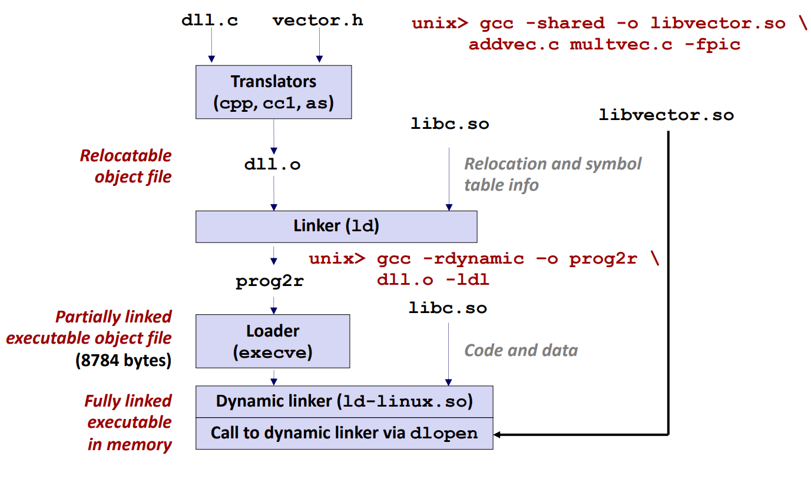

- 使用延迟绑定时，外部函数通常在第一次调用时解析，后续调用会直接使用已经写入 GOT 的地址，并不会每次重新链接。
- 允许在运行时修改库函数，方便维护长期运行的程序。
- 更新时仅需更新共享库，但是每次调用函数都需要链接。
- 可以通过``void *dlopen(const char *filename,int flag)``来实现加载和连接共享库。
``flag``可以从以下参数中选择一个或多个，并使用按位或``|``组合。

| 参数 | 含义 |
| --- | --- |
| ``RTLD_LAZY`` | 仅在需要时解析符号，可加快程序启动速度 |
| ``RTLD_NOW`` | 加载库时立即解析所有符号，尽早发现未解析符号错误 |
| ``RTLD_GLOBAL`` | 让库中的符号对随后加载的库可见，可以跨库共享符号，但可能引起冲突 |
| ``RTLD_LOCAL`` | 默认选项，把符号可见性限制在当前加载上下文中 |

- 该函数返回一个``void*``句柄，用于后续查找符号和关闭共享库；出错时返回``NULL``。
- ``void *dlsym(void *handle, const char *symbol)``：解析 ``handle`` 指向的共享库中 ``symbol`` 对应的符号。严格判断错误时应先清除旧的 ``dlerror``，调用后再读取一次错误信息，因为某些平台上的合法符号值也可能是 ``NULL``。
- ``int dlclose(void* handle)``：关闭并卸载共享库，成功返回0，失败返回-1。
- 也可以在 ``dlopen`` 时选择宏 ``RTLD_NODELETE``，使 ``dlclose`` 后共享对象仍保留在地址空间中。
- 以下为一份运行时链接的模板：

```c
#include <dlfcn.h>

void *handle = dlopen("libmath.so", RTLD_LAZY);
if (!handle) {
    // 错误处理
}

void *func = dlsym(handle, "my_function");
if (!func) {
    // 错误处理
}

// 使用函数指针调用函数
typedef int (*my_function_t)(int, int);
my_function_t my_function = (my_function_t)func;
int result = my_function(1, 2);

dlclose(handle);
```

动态链接器按三个阶段工作。

1. 查找共享库：根据环境变量``LD_LIBRARY_PATH``和系统默认路径，查找共享库在磁盘中的位置。
2. 内存映射：把共享库的各个段映射到进程的虚拟地址空间。``.text``段可以在多个进程间共享物理页，``.data``和``.bss``段使用写时复制（Copy-on-write，COW）机制。
3. 符号解析与重定位：解析共享库中的符号并执行重定位，使进程能够调用共享库函数和访问其中的变量。

位置无关代码 PIC 让共享库可以装载到不同地址。

- 共享库的主要目的是允许多个正在运行的进程共享内存中相同的库代码。
- 若每个共享库分配固定位置，则对地址空间的使用效率不高，同时难以管理。
- 因此需要位置无关代码，使共享库能够被加载到内存中的不同位置，同时让多个进程共享只读代码页。
- 可以加载，但无须重定位的代码称为``位置无关代码/PIC``。
- 需要使用``-fpic``选项编译共享库，换言之，共享库的编译必须总是使用该选项。
- 对一个目标模块中符号的引用是不需要特殊处理使之成为``PIC``，可以用``PC相对寻址``来编译这些引用，构造目标文件时由静态链接器定位。
- 对外部数据的 PIC 引用通常经由全局偏移表（GOT），对外部函数的调用通常经由过程链接表（PLT）。模块内部能够确定距离的符号则可以直接使用 PC 相对寻址。

PIC 数据引用依赖全局偏移量表。

- 基于一个事实：无论在内存中何处加载一个目标模块，数据段和代码段的距离总是保持不变，代码段中任意指令和数据段中任意变量的距离都是一个运行时常量，与绝对位置无关。
- 从数据段创建的地方创建了一个表，叫做``全局偏移量表``。
- 在``GOT``中，每个被这个目标模块引用的全局数据目标(即过程或全局变量)都有一个8字节条目。
- 编译器为``GOT``中每个条目生成一个重定位记录。
- 加载时，动态链接器重定位``GOT``中每个条目，使其包含目标的正确绝对地址，每个引用全局目标的目标模块都有自己的``GOT``。
- 编译器可以通过利用代码段和数据段之间不变的距离，产生``PC直接相对引用``，并且增加一个重定位，让链接器在构造这个共享模块时解析它。

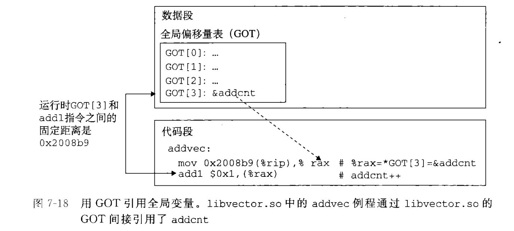

PIC 函数调用依赖过程链接表。

- 访问其他目标模块中的全局函数，由于共享库中的全局函数远远多于全局变量，而一般的程序只会调用少量全局变量，却频繁调用函数，如果仍然采用全局变量的访问模式来调用全局函数（即使用``GOT``进行二次跳转），则需要对极多个``GOT``条目进行重定位，造成严重资源浪费。
- 因此，``GCC``采用延迟绑定策略（思想跟懒删除堆/延迟标记线段树/缓存相同），将函数地址的绑定推迟到第一次调用该过程时，有效避免动态链接器在加载时进行不必要的重定位。
- 若目标模块调用共享库中的函数，则其有自己的``GOT``和``PLT``。
- ``PLT`` 是代码段中的一组跳转入口。具体条目大小和布局属于 ABI 与工具链实现细节，不应依赖它编写普通程序。
- ``PLT``提供模块访问全局函数的固定入口，``GOT``保存实际函数地址，并在函数第一次调用时完成绑定。
``GOT``和``PLT``的配合流程如下图。

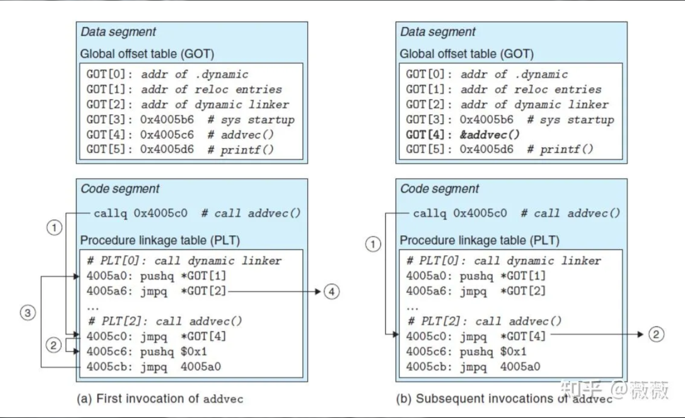

- ``PLT``每个条目是长为``16字节``的代码，第``0``项调用动态链接器，格式为``push+jmp``；第``1``项为调用系统启动函数，之后每一项都用于调用一个函数，格式为``jmp (GOT对应索引)+push(函数信息)+jmp(PLT第0项，调用动态链接器)``。
- ``GOT`` 的前几个条目记录动态链接器解析函数地址时使用的信息；后续条目维护函数地址，延迟绑定完成前先指回对应 PLT 条目的解析路径。
- 第一次调用函数时，跳转到PLT对应条目，条目第一行跳转到``GOT``对应条目指向位置。
- 但 ``GOT`` 尚未保存真实函数地址，所以会跳回 ``PLT`` 条目中的解析路径，把相应重定位信息交给动态链接器。
- 跳转到``PLT``第0项，它将``GOT[1]``指向的重定位条目压栈，调用``GOT[2]``指向的动态链接器。
- 动态链接器根据栈中的两个参数（ID和重定位条目），重写``GOT``对应条目为函数地址，再把控制传递给对应函数。
- 由于全部过程中没有``ret``，对应函数执行完毕后直接``ret``到调用函数的位置。

## 打桩（Interpositioning）

- 即在运行时替换库函数的行为

编译时打桩会在源代码层面替换调用。

- 通过在编译源代码时插入打桩函数实现。
- 使用``-I``选项指定头文件路径。
- 编译命令：``gcc -I. -o intc int.c mymalloc.o``

命令中的``-I``让编译器先在当前目录``.``查找头文件，``-o intc``指定输出文件名，``int.c``是源文件，``mymalloc.o``提供自定义实现。

- 这样，会在搜索``malloc``时，在搜索通常的系统目录之前，优先在当前目录中搜索``malloc.h``。

链接时打桩会在符号解析阶段介入。

- 在链接阶段，用自定义函数替换标准库函数。
- 使用 ``--wrap`` 选项告诉链接器把对标准函数的引用改到自定义包装函数。

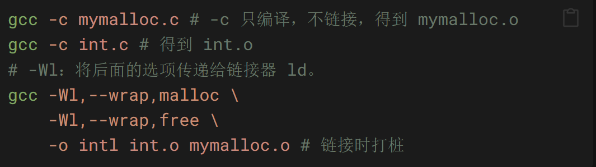

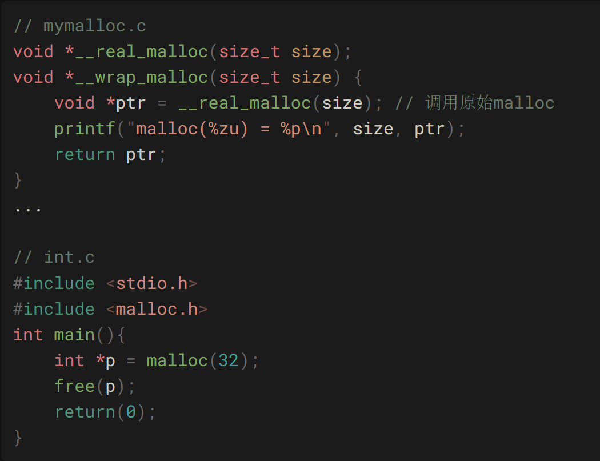

运行时打桩通常借助动态链接器完成。

- 在程序运行时，动态替换库函数。
- 通过使用``LD_PRELOAD``环境变量加载自定义动态库实现。

```bash
gcc -shared -fpic -o mymalloc.so mymalloc.c -ldl
LD_PRELOAD="./mymalloc.so" ./myprogram
```

- ``-shared``：生成共享库
- ``-fpic``：生成位置无关代码，这是共享库必需的，因为共享库可以加载到内存中的任意位置。
- ``-ldl``：链接动态链接器库，``libdl``是动态链接器库。
- ``LD_PRELOAD``：环境变量，指定在运行程序时加载的自定义动态库。
