## 异常控制流（Exceptional Control Flow，ECF）

控制流和异常控制流的定义。

- 控制流：一条条指令的执行顺序
- 从一条指令到下一条指令的过渡称为``控制转移``。
- 控制转移的常见类型：跳转、分支、调用、返回，即对程序状态的变化作出反应。
- 现代系统通过使控制流发生突变，对系统状态的变化产生反应，即异常控制流/ECF。
- ``异常控制流/ECF``：程序执行过程中遇到特殊事件或条件时，改变正常指令执行顺序的机制，它发生在计算机系统的各个层次。
- 一般包括异常、进程控制、信号和非本地跳转。

异常控制流分为三类。

- ``异常/Exceptions``：由硬件和操作系统实现，用于系统事件并改变控制流。
- ``进程上下文切换（Process Context Switch）``：操作系统利用定时器硬件，在多个进程之间快速切换，营造并行执行的假象。
- ``信号/Signals``：由操作系统实现，用于进程间通信或其它系统事件通知。

## 异常（Exception）

- ``内核``：操作系统常驻内存的部分，负责管理计算机硬件和软件资源。
- ``异常``是控制流的突变，用于响应处理器状态中的某些变化。
- 发生异常时，控制流会转移至操作系统内核，以响应某些事件。
- 它一部分由硬件实现，一部分由操作系统实现，因此具体细节会随系统的不同而有所不同。
- 在处理器中，状态被编码为不同的位和信号，状态变化称为``事件/event``。
- 事件可能与当前指令的执行有关，例如虚拟内存缺页、算术溢出、除零。
- 事件也可能与当前指令的执行无关，例如一个系统定时器产生信号、或一个I/O请求完成。
- 当处理器检测到有事件发生时，就会通过一张跳转表（即``异常表``）进行一个间接过程调用，也就是跳转到异常处理程序。
- 处理完成后，可能返回到事件发生时执行的指令，也可能返回到其下一条指令，也可能终止被中断的程序。
- 每种异常类型有一个唯一非负整数异常号，分别由处理器设计者和操作系统内核分配，系统启动时初始化异常表，其起始地址存放于一个特殊CPU寄存器，即异常表基址寄存器中。

异常和过程调用有几个重要区别。

- 过程调用将返回地址压入栈中，异常的返回地址是当前指令或者下一条指令。
- 异常和过程调用都会将处理器状态压入栈中，但是异常会多压一些状态，因为处理程序返回时需要利用它们重新开始执行被中断的程序。
- 大多数异常会转移到内核中处理，此时所有项目会被压入内核栈，而非用户栈中。而过程调用压入用户栈。
- 异常处理程序运行在内核模式下，过程调用运行在用户模式下。
- 如果异常处理程序决定返回，那么会将状态恢复为用户模式。

异常按发生原因分类。

- ``中断``：异步发生，由于来自处理器外部的``I/O信号``的结果。
- 由于不是因为任何一条专门指令产生的，因此它是异步的，需要中断处理程序进行处理。
- 总是将控制返回给下一条指令。
- 除中断外，其它异常类型都是同步发生的，即执行当前指令的结果，称其为``故障指令``。
- 常见类型：I/O设备（磁盘读取完成）、定时器（周期性定时器中断）
- ``陷阱``：同步发生，是有意的异常。
- 总是将控制返回到下一条指令。
- 最重要的用途是，在用户程序和内核之间提供一个像过程一样的接口，称为``系统调用``。
- 用户需要向内核请求服务时，就执行``syscall n``指令，其会导致一个到异常处理程序的陷阱，这个处理程序解析参数，并调用适当的内核程序。
- 系统调用相对函数调用，函数调用因为运行在用户模式中，可以执行的指令类型受限制，而系统调用运行在内核模式中，内核模式允许系统调用执行特权指令，并访问内核栈。
- 常见类型：系统调用，如``write/read``等涉及文件I/O的指令，或者``fork``等涉及进程控制的指令。
- ``故障``：同步发生，是潜在可恢复的错误，由错误情况引起，且可能被故障处理程序修正。
- 若能被故障处理程序修正，则返回到当前指令，若不能则返回到内核中的``abort``进程，会导致其终止。
- 常见：缺页异常、除零错误。
- 缺页异常：当指令引用一个虚拟地址，而与该地址对应的物理页面不在内存中，则必须从磁盘中抽出，会引发故障。
- ``终止``：不可恢复的致命错误，同步，从不返回。
- 常见：非法操作、地址越界、算术溢出、硬件错误

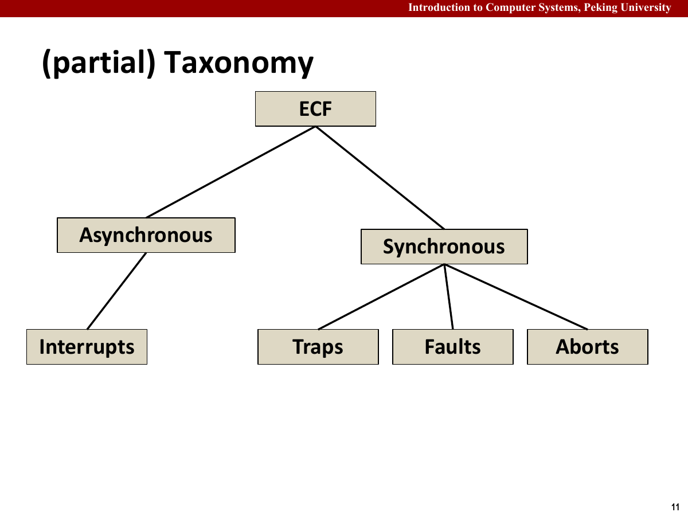

系统调用是用户态进入内核态的受控入口。

- 在``x86-64``上，系统调用通过``syscall``陷阱指令提供。
- 所有Linux系统调用的参数都由``通用寄存器``而不是``栈``传递的
- 系统调用号由``%rax``传递，每个系统调用有唯一的整数号
- 参数寄存器：``%rdi %rsi %rdi %r10 %r8 %r9``
- 注意与过程调用不同的是，第四个参数变成了``%r10``，因为系统调用返回时``%rcx``和``%r11``会被破坏。
- 返回时，``%rax``包含返回值``errno``，意为错误码，一个全局变量，存放最近一次系统调用错误的原因。
- 返回值在``-4095``到``-1``之间的负数表示发生了错误，对应于负的``errno``。
- 例如，异常号为``0``的除法错误，为故障，最终``abort``。
- 例如，异常号为``13``的一般保护故障/段错误，即因为一个程序引用了一个未定义的虚拟内存区域，或者因为程序试图写一个只读的文本段，则进行``abort``。
- 例如，异常号为``14``的缺页，为故障，一般选择``continue``。
- 例如，异常号为``18``的机器检查，即检测到致命的硬件错误，则为终止，直接退出。
- 异常号为``32-255``，是操作系统定义的异常，为中断或者陷阱。

## 进程（Process）

- 异常是允许操作系统内核时提供进程概念的基本构造块。
- 一个假象：好像在跑的程序是系统中唯一运行的程序，独占CPU和内存。
- 它有独立的逻辑控制流：好像程序独占使用处理器（实际由上下文切换机制实现）
- 它有私有的地址空间：好像程序独占使用内存（实际由虚拟内存机制实现）
- 进程：一个执行中程序的实例，系统中的每个程序都运行在某个进程的上下文中。
- 上下文：程序运行时所需的各种状态信息。
  - 程序的代码和数据
  - 栈
  - 通用目的寄存器的内容
  - 程序计数器
  - 环境变量
  - 打开文件描述符的集合
- 逻辑控制流：程序运行时一系列的``PC值``。
- 进程轮流使用处理器，每个进程执行它的流的一部分，然后被抢占（暂时挂起）。
- 对于这些进程之一的上下文中运行的程序，它看上去像是在独占地使用处理器，但是反面例证是，程序中一些指令的执行之间，CPU会周期性地停顿。
- ``并发流``：一个逻辑流的执行在时间上与另一个流重叠。
- 也就是，``A的开始-A的结束``在时间上与``B的开始-B的结束``重叠。
- 多个流并发地执行的一般现象称为``并发``，一个进程与其它进程轮流执行称为``多任务``，一个进程执行它的控制流的一部分的每一时间称为``时间片``，多任务也称为时间分片。
- 并发流之间，可能发生抢占、中断以及上下文切换。
- 并发流于处理器核数、计算机数无关。
- 并行流：并发流的真子集，同一时刻，多个进程在``不同核``上运行。

私有地址空间让每个进程都像是独占内存。

- 每个进程拥有私有地址空间，其他进程不能直接读写其中的内存。
- 进程地址空间由``虚拟内存映射``实现，实际使用的区域通常很稀疏，具体见第九章。

用户模式和内核模式用于隔离权限。

- 用户模式的模式位为0，内核模式的模式位为1。
- 用户模式的权限受限，内核模式的权限不受限。
- 用户模式只能访问用户区的内存，内核模式可以访问任意地址内存。
- 用户模式不能执行特权指令，内核模式可以执行特权指令。
- 但是，用户模式必须通过系统调用接口间接访问内核代码和数据，比如通过``./proc``文件系统访问一部分内核数据结构的内容。
- 如果直接引用地址空间内核区的代码和数据，会引起保护故障并终止进程。
- 进程从用户模式变为内核模式的唯一方法是通过中断、故障、系统调用这样的异常。
- 特权指令一般指的是，修改模式位，执行I/O操作，改变内存中的指令流等。

上下文切换（Context Switch）会保存当前进程状态，并恢复另一个进程状态。

- 即内核抢占一个进程，并重新启动一个被抢占的进程所需的``进程状态转换``。
- 通常由以下步骤组成：
  - 保存当前进程的上下文
  - 恢复下一个进程的山下文
  - 将控制权转移给新进程
- 上下文包括
  - 通用寄存器
  - 浮点寄存器
  - 程序计数器
  - 用户栈
  - 状态寄存器
  - 内核栈
  - 各种内核数据结构
  - 例如描述地址空间的页表、 包含有关当前进程信息的进程表、以及包含进程已打开文件的文件表。
- 调度：内核决定抢占当前进程，并决定哪个进程来重新开始。
- 例如：
  - DMA传输：进程切换等待磁盘数据传输
  - 无阻塞系统调用：内核决定执行上下文切换，而非返回用户态
  - 中断：周期性定时器中断
- 下面是上下文切换的一个例子

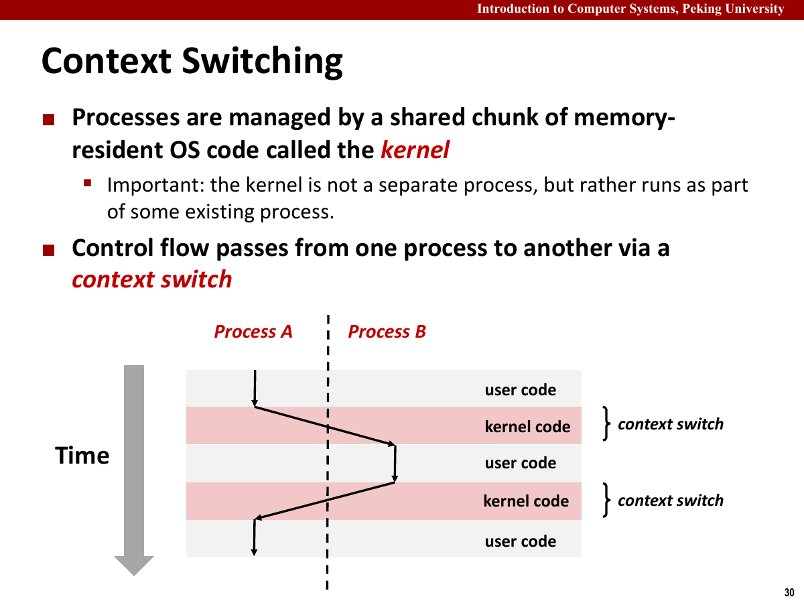

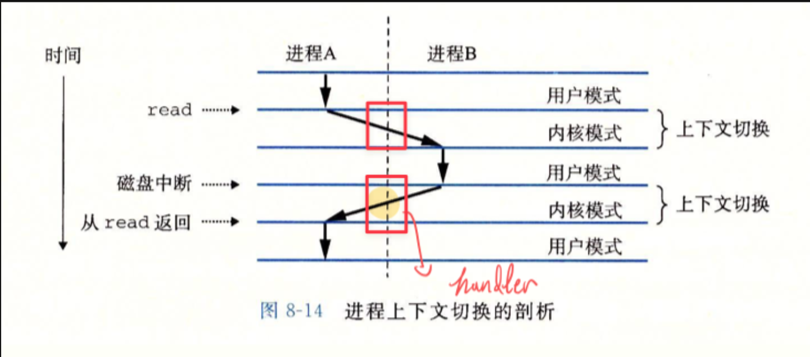

- 首先，进程``A``执行``read``操作，由于其为特权指令，由陷阱机制系统调用陷入内核态。
- 然后，由于DMA直接内存访问要等很久，内核决定抢占进程``A``，调度为进程``B``。
- 接着，``B``正在运行，磁盘中断告知内核已经取出数据，``B``需要处理中断，进入内核态的中断处理程序。
- 中断处理过程中，内核调度为进程``A``。
- 控制流返回到``A``。

系统调用的数据传递主要靠寄存器约定。

- Unix系统级函数遇到错误时，通常返回``-1``，并设置全局整数变量``errno``表示错误码。
- 进行函数包装

```c
pid_t Fork() {
    pid_t pid;
    if ((pid = fork()) < 0) {
        unix_error("fork error");
    }
    return pid;
}
pid = Fork();
```

## 进程控制（Process Control）

获取进程 ID 可以用这两个接口。

- 每个进程都有唯一的正数进程ID，即``PID``。
- ``PID``的数据类型为``pid_t``，在Linux系统中被定义为``int``。
- ``getpid``返回调用进程的PID，``getppid``返回调用进程父进程的PID。

创建和终止进程主要围绕 `fork`、`exit` 和回收展开。

- 进程永远处于下面三种状态之一：
  - ``运行``，要么在CPU上执行，要么等待被执行且最终会被内核调度。
  - ``停止``，执行被挂起，且不会被调度。收到 ``SIGSTOP``、``SIGTSTP``、``SIGTTIN`` 或 ``SIGTTOU`` 后，进程保持停止状态，直到收到 ``SIGCONT`` 才继续运行。
  - ``挂起``和``停止``的区别：挂起是因为等待资源/时间，暂时不能继续执行，但没有被信号强制停住。停止则是进程因为收到了相关信号，完全暂停执行。
  - ``终止``：进程永远地停止了，只会因为三种行为终止，即收到默认行为是终止进程的信号、从主程序返回、或者调用exit函数。
  - 这里的从主程序返回，返回的整数值会被设为进程的退出状态，非0表示异常退出。
  - ``exit``函数以``status``退出状态来终止进程。
- 在``后台``的进程若``想从终端读取输入\写入输出``时，进程会``停止``，直到他们转为``前台进程``，这是为了确保``终端的输入只被前台进程调用``。
- 父进程通过调用``fork``函数创建一个新的运行的子进程。子进程是父进程的独立副本，具有相同但彼此独立的地址空间、栈、变量值和代码，同时继承父进程打开的文件。两个进程并发运行，部分输出顺序无法确定，可能产生``竞争``。
- 父进程调用``fork``后，子进程可以读写父进程已经打开的所有文件。
- ``fork``函数调用一次，返回两次：
  - 一次返回在父进程中，返回子进程的PID。
  - 一次返回在子进程中，返回值为0。
  - 可以据此区分父进程和子进程，它们最大的区别就是PID不同。
- 进程间的调度由操作系统确定，因此父进程和子进程间某些语句的执行顺序不是确定的。
- 通常考虑画``进程图``对应程序语句的偏序，使用``拓扑排序进行``辨别。
- 由于对一张图的拓扑排序可以得到不同的结果，因此可能存在不同的进程图及操作序列。

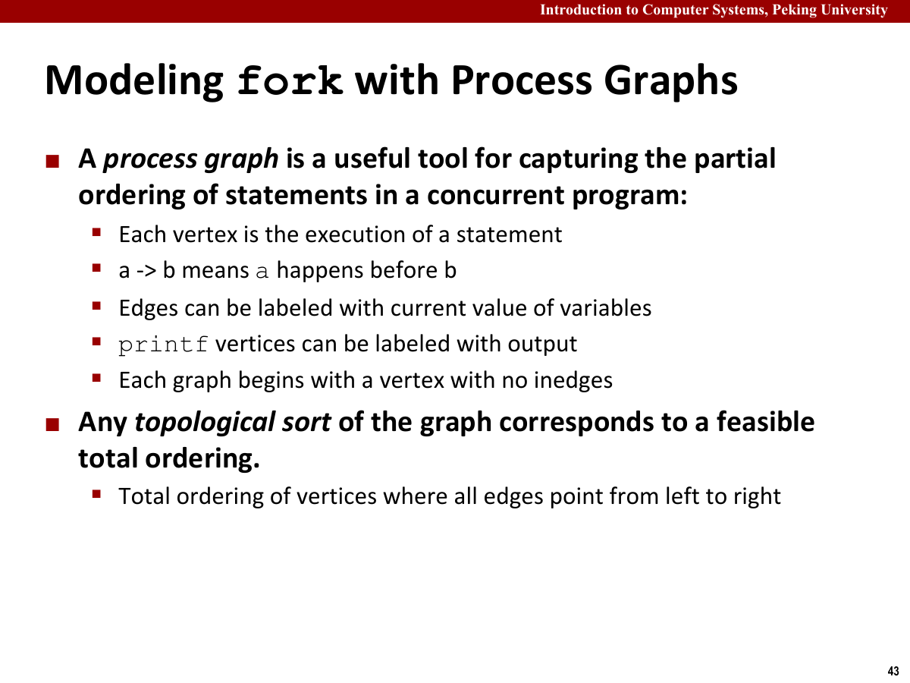

``fork`` 还会复制用户态的标准 I/O 缓冲区。若在 ``fork`` 前执行 ``printf("hello")`` 却没有刷新，父子进程随后都通过 ``exit`` 正常结束，这份缓冲内容可能被输出两次。换行只会在连接终端且采用行缓冲时触发刷新；重定向到文件后通常会变成全缓冲，因此不能把 ``\n`` 当成普遍可靠的刷新手段。需要避免重复输出时，应在 ``fork`` 前显式调用 ``fflush``，或者在子进程执行失败后用 ``_exit`` 退出，避免再次冲刷继承来的缓冲区。

文件描述符表也会被复制，但父子进程的描述符指向同一份内核打开文件表项，因此共享当前文件偏移。父进程读取一段内容后，子进程从同一描述符继续读取时会看到已经推进的偏移；关闭一方的描述符只减少引用计数，不会立刻让另一方失效。

回收子进程时，需要处理僵死进程。

- 一个进程终止后必须被其父进程回收，否则会变为``僵死进程/zombie``。
- 如果父进程已经终止，安排``init``进程作为孤儿进程的养父。
- ``init``进程的``pid=1``，是系统启动时由内核创建的，不会终止，是所有进程的祖先。
- 父进程通过调用``waitpid``函数等待子进程终止或者停止。

```c
pid_t waitpid(pid_t pid, int* statusp, int options);
```

- ``waitpid``函数的三个参数：
  - ``pid``：若大于0，则等待集合是``PID=pid``的子进程；若等于``-1``，则等待集合是该父进程的全部子进程，若等于``-x``，则等待集合是``pid=x``的进程组，若等于``0``，则等待集合是与调用进程在一个进程组的任意子进程。
  - ``options``：表示为下面常量的并集组合
    - ``WNOHANG``：如果所有子进程都没有终止，则立即返回；默认行为为挂起调用进程直到子进程终止。
    - ``WUNTRACED``：挂起调用进程执行，直到等待集合中一个进程变为已终止或者被停止。
    - ``WCONTINUED``：挂起调用进程的执行，直到等待集合中一个正在运行的进程终止或等待集合中一个被停止的进程收到``SIGCONT``信号重新开始执行。
  - 若``options``为0，则挂起调用进程，等待子进程退出。
  - ``statusp``：若放入一个指针，则``waitpid``返回后会将子进程相关状态存储于该指针指向的位置，即将``status``放入其指向的值。
- ``status``的几个宏：
  - ``WIFEXITED(status)``：若子进程通过``exit``或者一个返回正常终止，则返回真。
  - ``WEXITSTATUS(status)``：在``WIFEXITED(status)``返回真时，返回子进程的退出状态。
  - ``WIFSGINALED(status)``：若子进程因为一个未被捕获的信号终止，则返回真。
  - ``WTERMSIG``：在``WIFSGINALED(status)``返回真时，返回导致子进程终止的信号的编号。
  - ``WIFSTOPPED(status)``：若引起返回的子进程当前是停止的，返回真。
  - ``WSTOPSIG(status)``：在``WIFSTOPPED(status)``返回真时，返回导致子进程停止的进程的编号。
  - ``WIFCONTINUED``：如果子进程收到``SIGCONT``信号重新启动，返回真。
- 若调用进程没有子进程，则``waitpid``返回``-1``，设置``errno``为``ECHILD``。
- 若 ``waitpid`` 被信号中断，则返回 ``-1``，并把 ``errno`` 设置为 ``EINTR``。
- ``wait``：简化版本的``pid``

```c
pid_t wait(int *statusp)
```

- 相当于``waitpid(-1,statusp,0)``
- 程序不会按照特定顺序回收子进程，即回收有乱序性。
- 若需要顺序回收，则需要如以下代码所示，指定``waitpid``的``pid``参数。

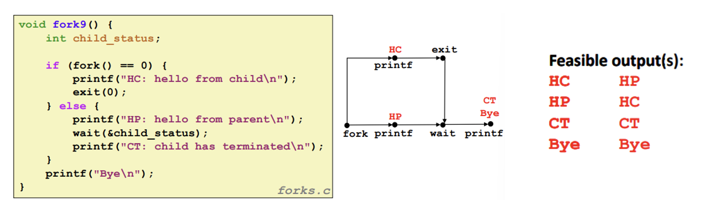

```c
#include "csapp.h"
#define N 2

int main() {
    int status, i;
    pid_t pid;

    /* 父进程创建 N 个子进程 */
    for (i = 0; i < N; i++)
        if ((pid = Fork()) == 0) /* 子进程 */
            exit(100 + i);

    /* 父进程以任意顺序回收 N 个子进程 */
    while ((pid = waitpid(-1, &status, 0)) > 0) {
        if (WIFEXITED(status))
            printf("子进程 %d 正常终止，退出状态=%d\n", pid, WEXITSTATUS(status));
        else
            printf("子进程 %d 异常终止\n", pid);
    }

    /* 唯一的正常终止是没有更多的子进程 */
    if (errno != ECHILD) /* EINTR */
        unix_error("waitpid 错误");

    exit(0);
}
```

- 默认行为下，使用``waitpid``或者``wait``会挂起父进程，直到子进程终止，这使得拓扑排序的可能性受限。

分析 `waitpid` 时，先由参数确定等待集合。

- `waitpid(-1, &status, 0)` 等待任意一个子进程终止。
- `waitpid(pid, &status, 0)` 等待指定 `pid` 的子进程终止。
- `waitpid(-pgid, &status, 0)` 等待指定进程组中的任意子进程。
- `waitpid(-1, &status, WNOHANG)` 不阻塞，若暂时没有子进程结束就返回 `0`。
- `waitpid(-1, &status, WUNTRACED)` 也会在子进程停止时返回。

`waitpid` 需要同时确定等待集合和返回条件。Shell Lab 处理前台任务、后台任务和 stopped job 时都会用到这两部分。

让进程休眠可以交给 `sleep` 或 `pause`。

- ``sleep``：让一个进程挂起一段指定的时间，接受``unsigned int``型变量``secs``，返回``unsigned int``型变量。
- 若时间量到了，则返回``0``；否则返回剩下要休眠的秒数，例如被一个信号中断而过早返回等。
- ``pause``：没有参数，让调用进程休眠，直到该进程收到一个信号，总是返回``-1``。

加载并运行新程序时，会用到 `execve`。

- 通常使用``execve``函数实现，在当前进程的上下文中加载并运行一个新程序。
- 与 ``fork`` 不同，``execve`` 不创建新进程，而是用新程序替换当前地址空间，因此 PID 保持不变。默认情况下，已经打开的文件描述符也会保留；设置了 ``FD_CLOEXEC`` 的描述符会在成功执行 ``execve`` 时自动关闭，创建描述符时也可以直接使用 ``O_CLOEXEC`` 等标志避免泄漏到新程序。

```c
int execve(const char *filename, const char *argv[], const char *envp[]);
```

- ``filename``：执行的目标文件名
- ``argv``：参数列表数组，每个指针指向一个参数字符串，以``NULL``结尾。
- ``envp``：环境变量数组，每个指针指向一个形如``name=value``的环境变量字符串，同样以``NULL``结尾。
- 若成功则不返回，若失败，如找不到``filename``，则返回``-1``，并设置``errno``。
- 当``execve``加载了``filename``后，其调用上一章中的启动代码，其设置栈并将控制传递给新程序的主函数，如``int main(int argc,char argv,char envp)``
- ``main``函数的第一个参数指出``argv[]``中非空指针的数量，``argv``指向``argv[]``中的第一个条目，``envp``指向``envp[]``的第一个条目。
- 在用户栈栈底，首先是参数和环境字符串，接着是以``NULL``结尾的环境数组，其中每个指针都指向栈中的一个环境变量字符串，全局变量``environ``指向这些指针中的第一个``envp[0]``。
- 在其之后，为``NULL``结尾的``argv[]``数组，其中每个元素都指向栈中的一个参数字符串，顶部为系统启动函数``libc_start_main``的栈帧。

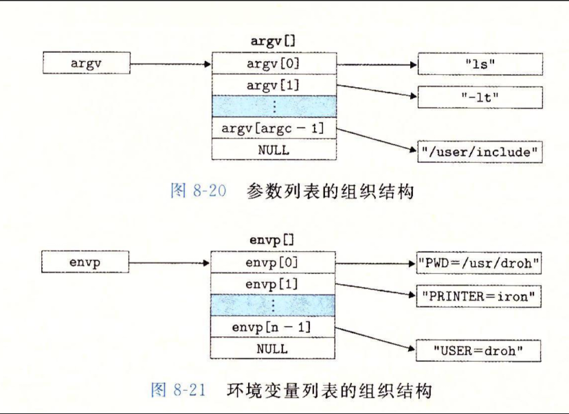

- 对于 ``LD_PRELOAD=/usr/lib/libkdebug.so ls -l /usr/include`` 这样的指令，参数列表和环境变量需要分开看。
- 参数列表保存传递给新程序的参数，其栈布局见图。

```text
argv[0] -> "ls" // 可执行文件名
argv[1] -> "-l" // 参数 1
argv[2] -> "/usr/include" // 参数 2
argv[3] -> NULL
```

- 环境变量，即``key=value``的键值对

```text
envp[0] -> "LD_PRELOAD=/usr/lib/libkdebug.so"
envp[1] -> NULL
```

- ``char* getenv(const char *name)``负责搜索环境变量``name=value``，若找到则返回指向``value``的指针，若找不到返回``NULL``。
- ``void unsetenv(const char *name)``，如果环境变量包含一个形如``name=value``的字符串，``unsetenv``会删除它。
- ``int setenv(const char* name,const char* newvalue,int overwrite)``，如果环境变量中包含``name=value``，当``overwrite``非零时，会用``newvalue``覆写，若不存在则添加``name=newvalue``。

## 信号（Signal）

- 一条小信息，是一种用于通知进程发生了某些事件的机制，属于异步机制。
- 每个信号都对应于一个系统事件，信号提供一种可通知用户进程发生异常的机制。
- 发送：内核（检测到事件）更新目的进程上下文某个状态/进程调用Kill函数
- 接收：目的进程被内核强迫以某种方式对信号发送做出反应，可以忽略它、终止它、或调用信号处理函数捕获它。
- 例如，当按下``Ctrl+C``时，系统会发送一个``SIGINT``信号给正在运行的程序，通知它停止运行，程序可以选择它的行为。
- 注意是返回到下一条指令。

Shell 的核心逻辑是读命令、解析命令，再执行命令。

- Linux系统启动时，首先启动``PID=1``的``init``进程，然后启动登录``Shell``。
- ``Shell``负责解释用户命令，并执行相应的操作。
- ``Shell`` 命令可以是内置命令或外部程序。对于外部程序，Shell 会创建一个子进程来执行；若命令以 ``&`` 结尾，就放到后台执行，否则在前台执行。代码框架可以写成这样。

```text
while (true) {
    读取命令行输入;
    if (命令为空) {
        continue;
    }
    if (命令为内建命令) {
        执行内建命令;
    } else {
        pid_t pid = fork();
        if (pid == 0) { // 子进程
            execve(程序路径, 参数, 环境变量);
        } else if (pid > 0) { // 父进程
            if (前台执行) {
                waitpid(pid, &status, 0);
            } else { // 后台执行
                printf("后台进程 PID: %d\\n", pid);
            }
        } else { // fork 失败
            perror("fork");
        }
    }
}
```

- 后台执行的程序不会阻塞``Shell``，用户可以继续输入其他命令与``Shell``交互。

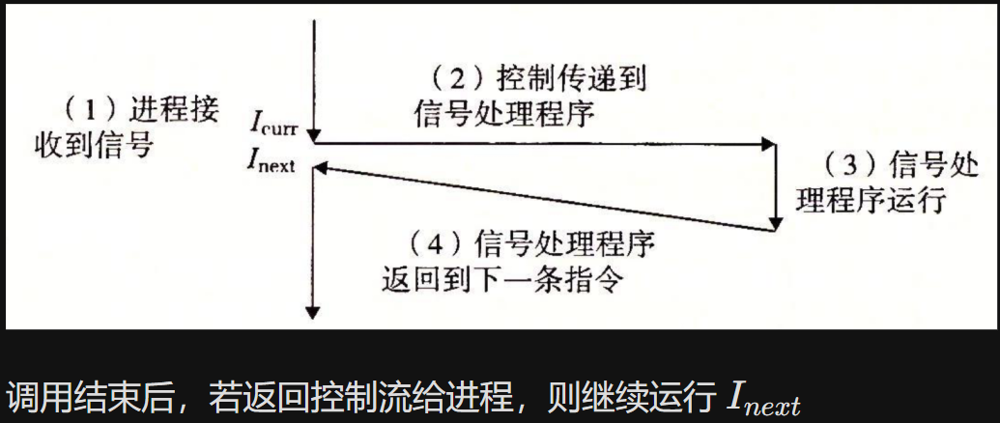

进程组（Process Group）用于把一组相关进程组织在一起。Shell 可以把一个 pipeline 放到同一个进程组里，再把终端产生的 `SIGINT` 或 `SIGTSTP` 发给整个前台进程组。

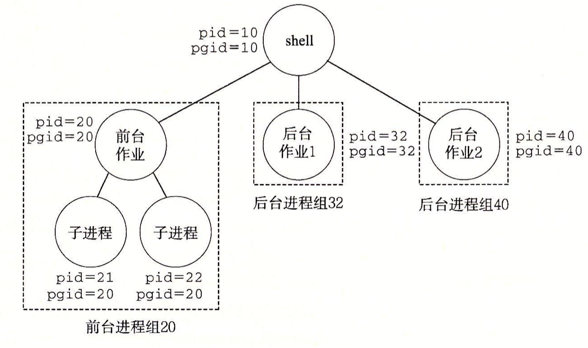

终端键盘信号默认发送给前台进程组。若 Shell 没有正确设置进程组，`Ctrl+C` 可能会终止 Shell 自身，或者无法终止完整的前台作业。

常见信号先记这些。

- 每个信号都有对应编号，但具体数值和范围与平台有关。程序应使用 ``SIGINT``、``SIGCHLD`` 等名字，而不是写死数字；Linux 除标准信号外还提供排队的实时信号。

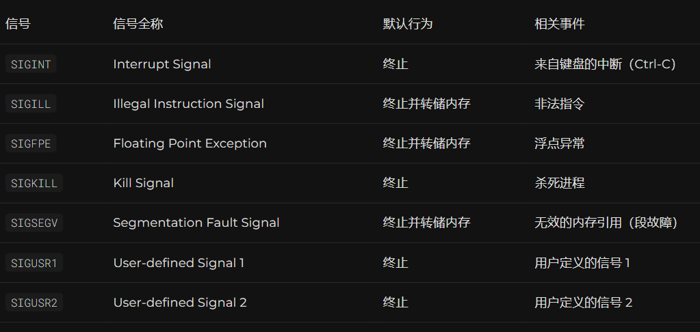

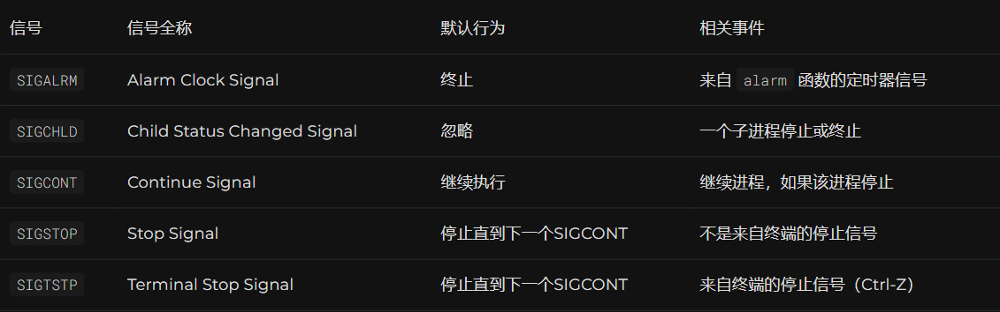

- 需要注意的事，``SIGKILL``和``SIGSTOP``无法被捕获或忽略，它们的行为由操作系统内核直接处理，不依赖于用户空间的代码。
- 这确保了系统管理员和操作系统能在必要时强制控制进程状态，而不受进程本身干扰。

待处理信号表示已经发出但还没被接收的信号。

- 即发生而没有被接受的信号
- 对每一种标准信号，任意时刻至多记录一个待处理实例。不同种类的信号可以同时处于待处理状态。
- 当信号被传送到进程，名为``pending``的位向量被置为1。
- 当信号在对应进程得到接收时，``pending``位向量中对应位置的值被置零。
- 同一种标准信号在阻塞期间到达多次时通常会合并，解除阻塞后只能知道它至少发生过一次，不能由此还原次数。实时信号则可以排队。
- 一个进程可以有选择性地阻塞某种信号，通过位向量``blocked``实现，这种信号之后被发送后不会被接收，直到进程取消对这个信号的阻塞。
- 进程只能知道自己收到过某种信号，但是无法获知收到的次数。
- 若在有``pending``的情况，设置``blocked``，就算当前处理的该种信号结束处理，也需要等到``blocked``被解除后才能开始处理。
- 当内核将控制权传给某个进程时，会检查是否有未被阻塞的``pending``信号，若有则强制其处理。

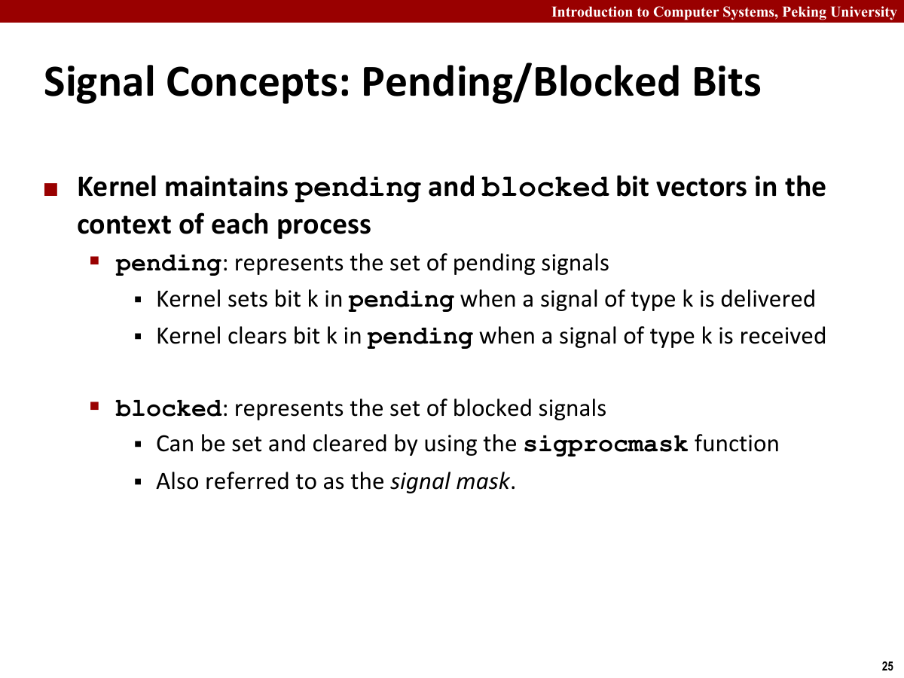

进程组和作业是 Shell 管理前后台任务的基础。

- 由进程组实现。
- ``进程组``：一个进程或多个进程的集合，它们共享一个共同的进程组ID，即``PGID``。
- 进程可以通过``setpgid``函数改变自己或其它进程的进程组。
- 子进程与父进程同属于一个进程组。

```c
int setpgid(pid_t pid, pid_t pgid);
```

- 表示将进程``pid``的进程组改为``pgid``，若``pid``为0，则使用当前进程的``PID``，如果``pgid``为0，则用``pid``指定的进程的``PID``作为``pgid``。
- 当``pid``和``pgid``同时为0，则创建一个```pgid``为当前进程``pid``的进程组。
- ``作业/Job``：一个或多个进程的集合，通常由一个前台进程和若干后台进程组成，由``Shell``创建或管理。
- 一个作业可以包含一个单独的命令或一组通过管道(即``Shell``中的``|``)连接的命令，可以在前台运行，也可以在后台运行。
- 前台作业：占用终端，从用户处接受输入，后台作业通过``fg``命令转换为前台作业。
- 后台作业：终端中启动但不占用终端的作业，不与用户交互下执行，通过``&``或者``bg``启动。

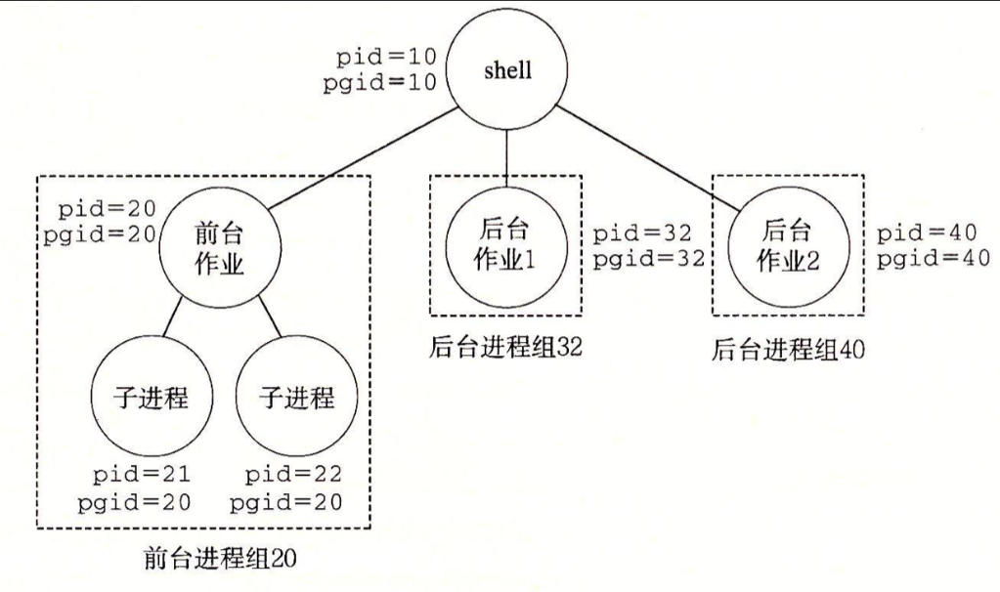

发送信号可以通过键盘、系统调用或 Shell 命令完成。

- 使用``/bin/kill``命令，通常为``/bin/kill -signal -pid``
- ``signal``是信号序号，``pid``为负则发送到``pgid=|pid|``的所有进程。
- 从键盘发送信号
  - ``ctrl+c``发送``SIGINT``信号，终止前台进程。
  - ``ctrl+z``发送``SIGTSTP``信号，挂起（停止）前台进程，同时会发生调度。
  - ``Ctrl+D`` 不发送信号。终端驱动在当前输入行为空时让 ``read`` 返回 0，程序据此观察到文件结束条件。
- 用``kill``函数发送信号

```c
int kill(pid_t pid, int sig)
```

- 若``pid>0``，将信号``sig``发送给``PID``为``pid``的进程。
- 若 ``pid=0``，将信号 ``sig`` 发送给调用进程所在进程组的所有进程。
- 若``pid<0``，将信号``sig``发送给``pgid=|pid|``的所有进程。
- 若成功则返回``0``，若不成功则返回``-1``。
- 用``alarm``函数发送信号

```c
unsigned int alarm(unsigned int secs);
```

- 设置一个定时器，在指定秒数后发送``SIGALRM``信号给当前进程。
- 再次调用 ``alarm`` 会取消并替换先前尚未到期的定时器。
- 若之前有``alarm``，则返回剩余秒数，若无返回``0``。

接收信号时，进程会根据当前处理方式采取动作。

- 内核把进程``p``从内核模式切换到用户模式时，在执行代码前处理信号。
- 接收信号类型：``pending & ~blocked``，若非空，强制进程接收其中之一，通常为最小的。
- 接着，进程会采取``忽略、终止、捕获并调用信号处理函数``三种行为之一进行处理，直到集合为空，将控制转移为下一条指令。
- 信号处理有以下四种默认行为：
  - 进程终止，如``SIGINT、SIGKILL``
  - 进程终止并转储内存，如``SIGILL、SIGFPE、SIGSEGV``
  - 进程停止，直到被``SIGCONT``重新启动：如``SIGSTOP、SIGTSTP``
  - 忽略该信号，如``SIGCHLD``
- 可以使用 ``signal`` 修改除了 ``SIGKILL`` 和 ``SIGSTOP`` 之外的信号处理方式：

```c
typedef void (*sighandler_t)(int);  // 函数指针类型
sighandler_t signal(int signum, sighandler_t handler);
```

- 参数``handler``可以是以下三种情况：
  - ``SIG_IGN``：忽略信号
  - ``SIG_DFL``：采取默认行为
  - 用户自定义的函数地址，即信号处理程序，调用它被称为捕获信号。
- 信号处理程序可以被其他信号处理程序中断

实际程序更常使用 ``sigaction``，因为它能够明确设置处理期间的阻塞集合和重启策略：

```c
struct sigaction sa = {0};
sa.sa_handler = sigchld_handler;
sigemptyset(&sa.sa_mask);
sa.sa_flags = SA_RESTART;

if (sigaction(SIGCHLD, &sa, NULL) < 0) unix_error("sigaction error");
```

``SA_RESTART`` 会让一部分被信号打断的慢速系统调用自动重启，但并非所有接口都受它影响。调用代码仍要知道何时检查 ``errno == EINTR`` 并重试。

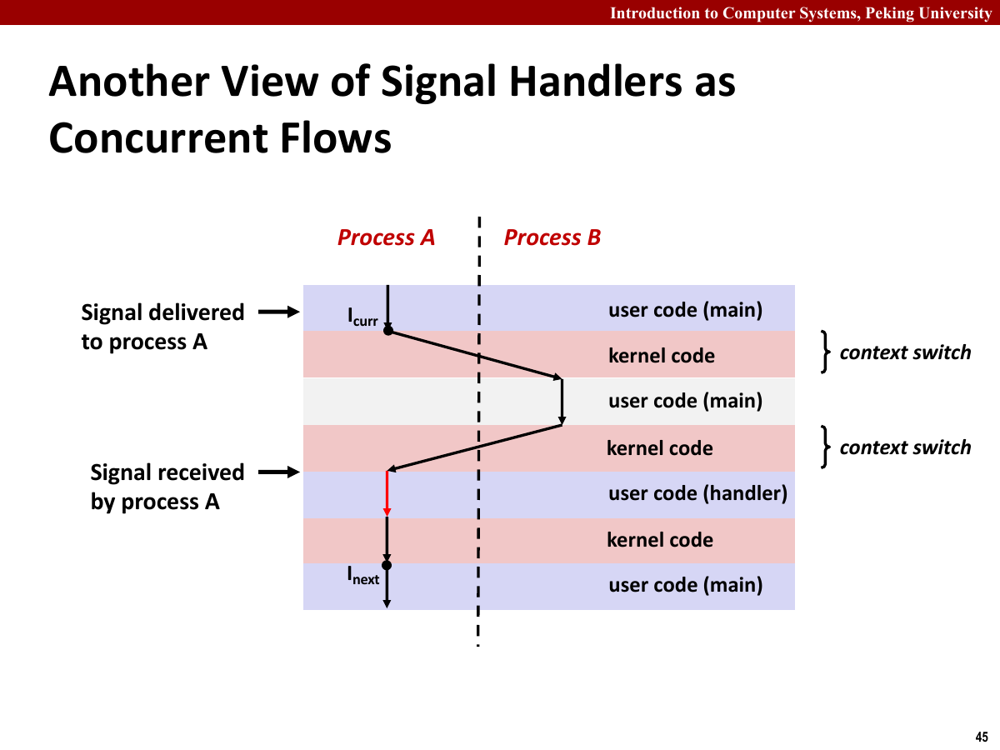

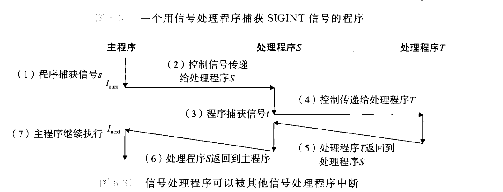

- 信号处理程序时用户态的一部分，当捕获信号并处理时，是在用户态运行的。

阻塞和解除阻塞信号会影响信号能否被立即接收。

- 隐式阻塞机制：内核默认阻塞任何当前处理程序正在处理信号类型的待处理信号。
- 显式阻塞机制：使用``sigprocmask``函数。

```c
int sigprocmask(int how, const sigset_t *set, sigset_t *oldset);  // 改变当前阻塞的信号集合

// 以下操作 sigset_t 的函数本质都是对位向量进行操作
int sigemptyset(sigset_t *set);            // 初始化信号集合为空
int sigfillset(sigset_t *set);             // 将所有信号添加到信号集合中
int sigaddset(sigset_t *set, int signum);  // 将指定信号添加到信号集合中
int sigdelset(sigset_t *set, int signum);  // 从信号集合中删除指定信号

int sigismember(const sigset_t *set, int signum);  // 返回：若 signum 是 set 的成员则为 1，否则为 0。
```

- ``sigprocmask``：改变当前阻塞的信号集合，取决于``how``的值：
  - ``SIG_BLOCK``：将``set``中的信号添加到``blocked``中。
  - ``SIG_UNBLOCK``：从``blocked``中删除``set``中的信号。
  - ``SIG_SETMASK``：``block=set``
- 如果``oldset``非空，那么``blocked``的旧值保存在``oldset``中。

编写信号处理程序时，最重要的是保持简单和可重入。

- 处理程序尽可能简单，因为信号可以在程序执行的任何时候异步发生。
- 只调用异步信号安全函数。这些函数可以重入（例如只访问局部变量），或者执行期间不会被信号处理程序打断；调用其他函数可能破坏主程序状态或造成死锁。
- 保存并恢复``errno``。异步信号安全函数也可能改变它，进而干扰主程序中依赖``errno``的代码。
- 访问共享全局数据结构时，阻塞所有的信号，避免死锁与数据竞争。
- 全局变量使用``volatile``关键字声明，告诉编译器不要缓存这个变量，避免错误的编译器优化。
- 标志使用``sig_atomic_t``声明，保证对全局标志（处理程序读写它来记录是否收到信号）的读写是原子的，即不可中断的。
- 不可以用信号来对其他进程中发生的事件计数，因为有阻塞机制存在。
- 常见的非异步安全函数：
  - 动态内存分配函数：如``malloc``和``free``，它们可能修改全局状态。
  - 标准I/O函数，如``printf/scanf``，它们可能使用内部缓冲区和锁。
  - 非可重入函数，如``strtok``，可能依赖静态数据。
  - 线程相关，如``pthread_mutex_lock``，可能引发死锁。
- 常见的异步安全函数：
  - ``_exit``
  - ``_abort``
  - ``signal``：部分实现
  - ``sigaddset、sigdelset、sigemptyset、sigfillset``
  - ``kill、sigaction、sigprocmask、sigpending``
  - ``write、read``、``lseek``（部分实现）
- 可重入函数：通常只使用局部变量，不访问可变的静态或全局数据，也不调用不可重入函数。
- ``waitpid`` 每次只回收一个子进程，收到一次 ``SIGCHLD`` 不代表只有一个子进程终止。处理程序应循环调用非阻塞 ``waitpid``，直到暂时没有可回收的子进程。
- 存在一个信号代表至少有一个信号到达。
- 竞争：分出子进程后，父子进程并发，顺序不一定与代码顺序一致，只需要满足拓扑排序。
- 请看下面两段代码：

```c
// 错误代码
while (1) {
    if ((pid = Fork()) == 0) {
        Execve("/bin/date", argv, NULL);
    }
    // 关注下一行
    Sigprocmask(SIG_BLOCK, &mask_all, &prev_all);
    addjob(pid);
    Sigprocmask(SIG_SETMASK, &prev_all, NULL);
}
exit(0);

// 正确代码
while (1) {
    // 先阻塞 SIGCHLD
    Sigprocmask(SIG_BLOCK, &mask_one, &prev_one);
    if ((pid = Fork()) == 0) {
        // 分出子进程后解除阻塞
        Sigprocmask(SIG_SETMASK, &prev_one, NULL);
        Execve("/bin/date", argv, NULL);
    }
    Sigprocmask(SIG_BLOCK, &mask_all, NULL);
    addjob(pid);
    Sigprocmask(SIG_SETMASK, &prev_one, NULL);
}
exit(0);
```

- 需要保持``addjob``操作的原子性。
- 错误代码先``Fork()``创建子进程，再阻塞信号。
- 在``Sigprocmask``之前，子进程可能已经终止，向父进程发送``SIGCHLD``信号。
- 此时父进程还没阻塞``SIGCHLD``，信号会立即触发处理函数，但是``addjob``还没执行，导致处理了不存在的``job``。

一个更完整的 ``SIGCHLD`` 处理程序通常写成：

```c
void sigchld_handler(int sig) {
    int olderrno = errno;
    int status;
    pid_t pid;

    while ((pid = waitpid(-1, &status, WNOHANG | WUNTRACED)) > 0) {
        update_job_state(pid, status);
    }

    errno = olderrno;
}
```

这里的 ``update_job_state`` 也必须满足信号处理环境的约束。Shell Lab 中通常会在主程序修改作业表时阻塞相关信号，处理程序再以项目提供的安全输出函数记录状态。

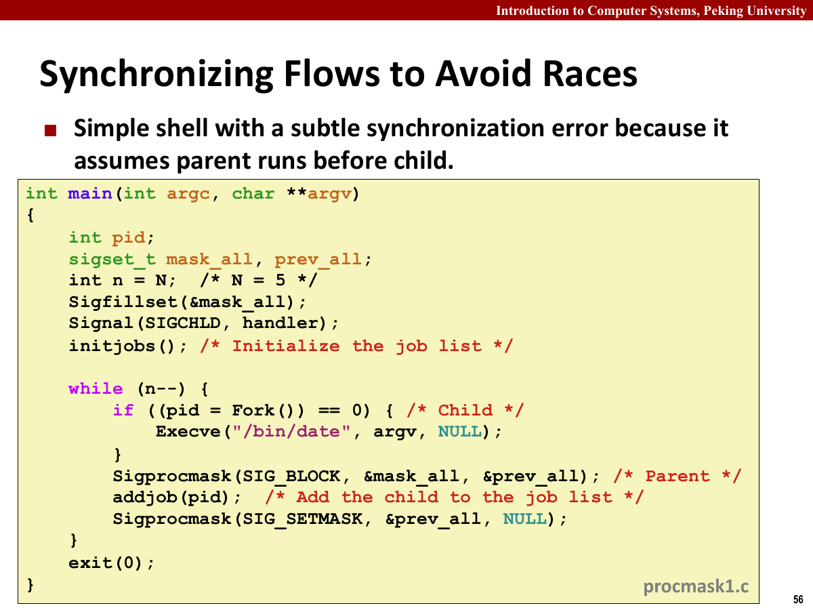

显式等待信号时，需要避免竞态。

- 主程序有时需要显式等待某个信号处理程序运行。例如 Shell 创建前台作业后，在接受下一条命令前，必须等待作业状态发生变化并由 ``SIGCHLD`` 处理程序更新。
- 请看以下代码：

```c
#include "csapp.h"
volatile sig_atomic_t pid;   // 定义一个易失性的原子类型变量 pid
void sigchld_handler(int s)  // 定义一个处理 SIGCHLD 信号的处理函数
{
    int olderrno = errno;        // 保存当前的 errno 值
    pid = waitpid(-1, NULL, 0);  // 等待任意子进程结束，并将其 pid 保存到全局变量 pid 中
    errno = olderrno;            // 恢复之前的 errno 值
}
void sigint_handler(int s) {};

int main(int argc, char **argv) {
    sigset_t mask, prev;

    Signal(SIGCHLD, sigchld_handler);
    Signal(SIGINT, sigint_handler);
    Sigemptyset(&mask);
    Sigaddset(&mask, SIGCHLD);

    while (1) {
        Sigprocmask(SIG_BLOCK, &mask, &prev); /* 阻塞 SIGCHLD */
        if (Fork() == 0)                      /* 子进程 */
            exit(0);

        /* 父进程 */
        pid = 0;
        Sigprocmask(SIG_SETMASK, &prev, NULL); /* 解除阻塞 SIGCHLD */

        /* 等待接收 SIGCHLD (没问题，但是浪费资源) */
        while (!pid);

        /* 接收 SIGCHLD 后做一些工作 */
        printf(".");
    }
    exit(0);
}
```

```c
/* 等待接收 SIGCHLD 信号 (可能引发竞争条件) */
while (!pid) /* 竞争! */
    pause();
```

- 这段代码中，若``SIGCHLD``发生在``while``测试之后，``pause``之前，由于已被处理，``pause``永远不会收到信号被唤醒。

```c
/* 等待接收 SIGCHLD 信号 (速度太慢) */
while (!pid) /* 太慢! */
    sleep(1);
```

- 这段代码逻辑正确，但是间隔不好设置，太短则类似``while(!pid)``，高频运行，一直占用CPU，太长则等太久。

- 正确策略：``int sigsuspend(const sigset_t *mask)``
- 类似于以下代码的原子化版本

```c
sigprocmask(SIG_SETMASK, &mask, &prev);
pause();
sigprocmask(SIG_SETMASK, &prev, NULL);
```

- 即暂时使用提供的信号集替换当前信号屏蔽字，收到信号后恢复原来的信号屏蔽字。

- 以下是完善后的代码：

```c
#include "csapp.h"
volatile sig_atomic_t pid;   // 定义一个易失性的原子类型变量 pid
void sigchld_handler(int s)  // 定义一个处理 SIGCHLD 信号的处理函数
{
    int olderrno = errno;        // 保存当前的 errno 值
    pid = waitpid(-1, NULL, 0);  // 等待任意子进程结束，并将其 pid 保存到全局变量 pid 中
    errno = olderrno;            // 恢复之前的 errno 值
}
void sigint_handler(int s) {};

int main(int argc, char **argv) {
    sigset_t mask, prev;

    Signal(SIGCHLD, sigchld_handler);
    Signal(SIGINT, sigint_handler);
    Sigemptyset(&mask);
    Sigaddset(&mask, SIGCHLD);

    while (1) {
        Sigprocmask(SIG_BLOCK, &mask, &prev); /* 阻塞 SIGCHLD */
        if (Fork() == 0)                      /* 子进程 */
            exit(0);

        /* 等待接收 SIGCHLD */
        pid = 0;
        while (!pid) sigsuspend(&prev);

        /* 可选地解除阻塞 SIGCHLD */
        Sigprocmask(SIG_SETMASK, &prev, NULL);

        /* 接收 SIGCHLD 后做一些工作 */
        printf(".");
    }
    exit(0);
}
```

非本地跳转可以跨过普通函数返回路径。

- 允许程序从一个函数跳转到另一个函数，不需要通过正常的函数调用和返回机制。``setjmp``和``longjmp``提供非本地跳转功能。
- ``setjmp(jmp_buf env)``：保存当前执行环境到``env``中。
- ``longjmp(jmp_buf env,int val)``：恢复之前由``setjmp``保存的执行环境，使``setjmp``返回``val``。

```c
#include <setjmp.h>

jmp_buf env;

if (setjmp(env) == 0) {
    // ... 代码块 1 ...
    longjmp(env, 1);
} else {
    // ... 代码块 2 ...
}
```

- 第一次``setjmp``返回0，进入第一个分支，``longjmp``使程序跳转到``setjmp()``的位置，使其返回1。
