## 虚拟地址空间

每个进程看到一段从低地址到高地址连续排列的地址空间。虚拟页背后可能是物理内存、磁盘文件、共享库、匿名页面，也可能尚未分配物理页。

`Malloc Lab` 管理堆中的块，操作系统管理这些块背后的虚拟页。分配器处理内部碎片和外部碎片，操作系统处理页面映射、缺页和保护。

编译器生成的地址不是最终物理地址。链接器将目标文件组织成虚拟地址布局，加载器根据可执行文件的段信息建立虚拟内存区域；程序运行后，栈、堆、共享库和文件映射还会继续改变地址空间布局。

典型进程的虚拟地址空间从低地址到高地址依次分布为：

- 代码段保存机器指令，通常只读且可执行。
- 只读数据段保存字符串常量、跳转表等不该被修改的数据。
- 已初始化数据段保存有初值的全局变量和静态变量。
- 未初始化数据段保存没有显式初值的全局变量和静态变量，运行时表现为全零。
- 堆从低地址向高地址增长，由动态分配器管理。
- 共享库映射区域放置动态链接库和文件映射。
- 用户栈从高地址向低地址增长，用于函数调用、局部变量和返回地址。
- 内核虚拟内存位于用户进程不可直接访问的区域。

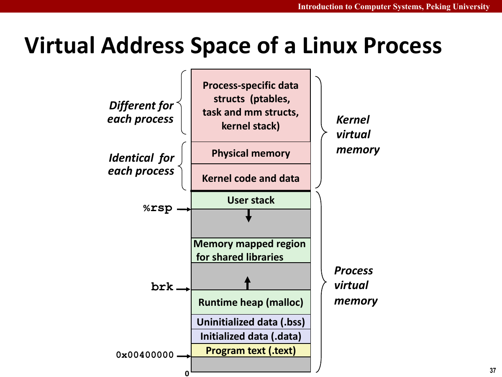

各区域具有不同的生命周期和权限。代码段一般只读，栈变量随函数返回失效，堆对象由 `free` 释放，共享库页面则可以被多个进程映射到同一批物理页。

地址翻译负责建立虚拟地址与物理地址的联系，动态内存分配则管理虚拟堆。`mem_sbrk` 扩展虚拟堆，分配器再在其中切分内存块；越界写可能先破坏分配器元数据，随后才在其他位置触发段错误。

## 寻址与页面缓存

物理寻址（Physical Addressing）和虚拟寻址（Virtual Addressing）的差别在于地址是否需要翻译。

- 物理寻址：CPU 直接生成物理地址，并通过内存总线访问主存。
- 虚拟寻址：CPU 生成虚拟地址，随后由内存管理单元（Memory Management Unit，MMU）将虚拟地址翻译为物理地址。
- 地址翻译需要硬件和操作系统共同完成，硬件负责快速查表和触发异常，操作系统负责维护页表、处理缺页和权限错误。

物理寻址中，CPU 生成的地址直接指出主存中的字节位置。

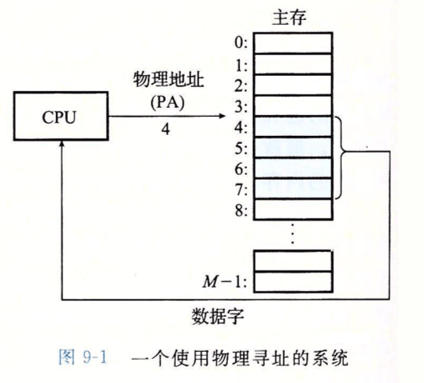

虚拟寻址则多了一层 MMU。CPU 仍然发出地址，但这份地址先被解释为虚拟地址，再通过页表（Page Table）和地址翻译后备缓冲器（Translation Lookaside Buffer，TLB）翻译成物理地址。

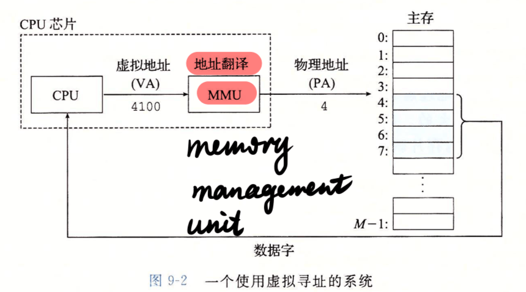

早期简单系统可以直接使用物理寻址，但这会让多个程序共享同一片地址空间，隔离性很差。一个程序写坏内存，就可能影响另一个程序。虚拟内存的一个重要价值就是让每个进程都看到一套独立、连续、规则的地址空间。

虚拟地址空间一般被划分为固定大小的虚拟页，物理内存也被划分为同样大小的物理页。虚拟页可以映射到物理页，也可以暂时不在物理内存中。由于虚拟页和物理页大小相同，地址翻译时页内偏移不需要改变。

在存储层次中，主存缓存磁盘上的页面，Cache 缓存主存中的块。页面比 Cache 块大得多，缺页代价也更高，因此页面调度尤其依赖局部性。

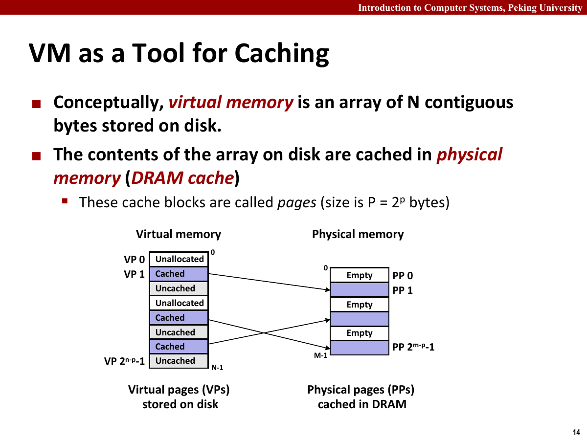

虚拟内存与 Cache 的对应关系：

- 虚拟页相当于缓存中的块。
- 物理页相当于缓存行。
- 缺页相当于 cache miss，只是代价高得多。
- 页表相当于记录虚拟页是否在物理内存中的元数据。

普通 Cache 的替换主要由硬件完成，虚拟内存的缺页处理需要操作系统参与。页面通常至少为 4KB，一次缺页还可能访问磁盘，因此页面替换必须尽量避免抖动。

页面状态主要看它是否已经分配、是否已经在物理内存中。

- 未分配页：虚拟地址空间中还没有任何数据与之关联的页。
- 已缓存页：已经映射到物理内存中的虚拟页。
- 未缓存页：已经分配，但暂时还在磁盘上的虚拟页。

页表就是记录这些状态的结构。每个虚拟页号对应一个页表项，页表项里至少要告诉硬件：这一页是否有效，如果有效，它对应哪一个物理页；如果无效，后续应当由缺页处理程序进一步判断。

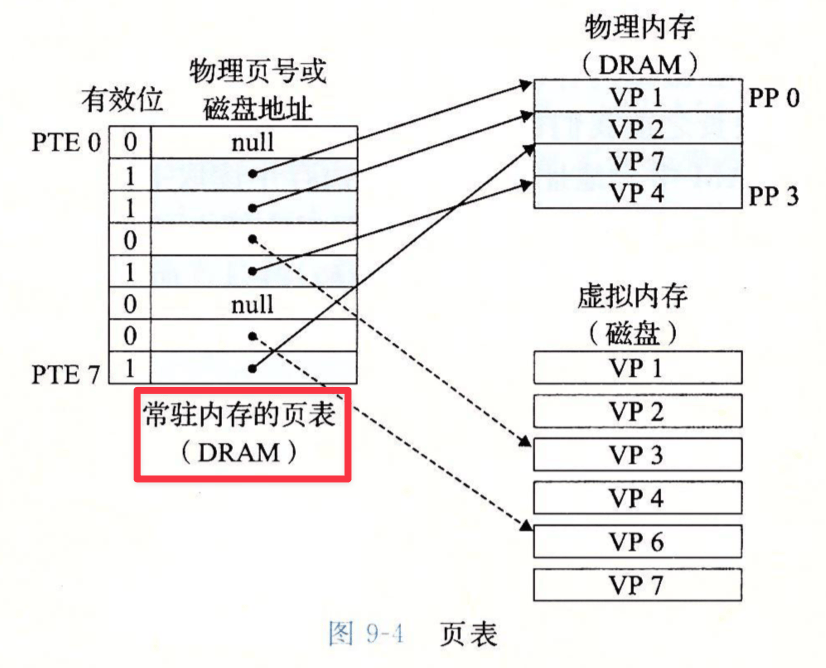

当程序访问一个已缓存页时，地址翻译可以直接得到物理页号。当程序访问一个未缓存页时，就会触发缺页异常（Page Fault）。

内核按以下顺序处理缺页异常。

1. CPU 发现页表项无效，触发缺页异常。
2. 控制流转移到内核中的缺页处理程序。
3. 内核判断该虚拟地址是否合法。
4. 若地址非法或权限不符，则向进程发送段错误。
5. 若地址合法但页面不在内存中，则选择一个牺牲页。
6. 如果牺牲页被修改过，需要写回磁盘。
7. 内核把目标页从磁盘读入物理内存，并更新页表项。
8. 异常处理返回，重新执行导致缺页的指令。

缺页处理完成后，原指令会重新执行；此时目标页已经进入物理内存，访问可以继续。

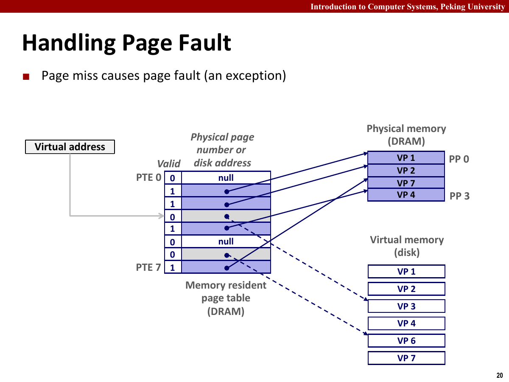

页表项对应三种情况。

- 页表项有效，页面已经在物理内存中，这是页命中（Page Hit）。
- 页表项无效，但虚拟页已经分配，只是暂时在磁盘上，这是正常的缺页异常。
- 页表项无效，且虚拟地址不属于任何合法区域，这是非法访问。

未缓存页可以由操作系统调入，非法地址则无法修复。按需调页、写时复制（Copy-on-write，COW）和栈自动增长都可能由缺页异常触发；地址非法或权限不符时，进程才会收到段错误。

现代系统通常采用按需调页，只在页面第一次被访问时将其调入，避免提前加载从未使用的页面。

工作集较小且局部性良好时，缺页次数较少。工作集超过可用物理内存后，页面会被频繁换入换出，形成抖动（Thrashing），系统的大部分时间被用于搬运页面。

顺序扫描数组能同时利用 Cache 块、页面预取和 TLB 局部性；跨页随机访问则可能增加 Cache miss、TLB miss 和缺页次数。

## 虚拟内存管理与保护

虚拟内存让不同进程的虚拟地址空间可以映射到不同的物理页，也可以映射到同一批物理页。

虚拟内存带来的便利：

- 链接更简单：每个程序都可以假设自己加载在固定虚拟地址范围。
- 加载更简单：代码和数据可以按需调入，不必一次性读入整个可执行文件。
- 共享更简单：多个进程可以共享同一份只读代码页或共享库页。
- 分配更简单：堆可以通过映射新的虚拟页来扩展。

共享库的代码段通常是只读的，因此多个进程可以把对应虚拟页映射到同一组物理页。这样既节省内存，也能让动态链接库在系统中更高效。

页表项不仅记录映射关系，也记录权限信息，因此虚拟内存还能作为保护工具。

- `SUP` 位可以限制页面是否只能由内核模式访问。
- `READ` 位控制是否允许读取。
- `WRITE` 位控制是否允许写入。
- 有的体系还会记录是否允许执行。

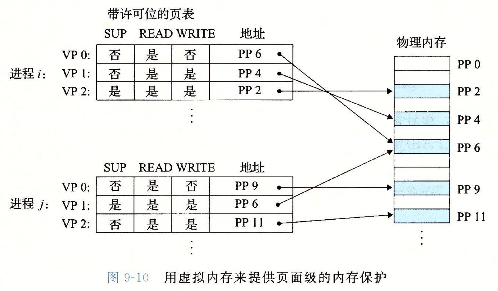

如果用户程序试图写只读页面，或者访问内核专用页面，硬件会触发保护异常。操作系统通常会把它转化为段错误。

因此，段错误不是只有“指针为空”才会发生。访问不存在的虚拟区域、访问权限不符的页面、写只读代码段，都可能导致段错误。

Linux 把进程虚拟地址空间组织成若干区域。每个区域是一段连续虚拟页，具有相同权限和映射来源。代码段、只读数据段、已初始化数据段、堆、共享库映射区、用户栈和内核虚拟内存，都属于这种区域。

内核中，进程的 `task_struct` 指向描述地址空间的 `mm_struct`，其中保存页表基址和区域链表；每个 `vm_area_struct` 描述一段连续虚拟区域，记录起止地址、读写执行权限、共享或私有标志，以及映射对象。

因此，页表只回答“某个虚拟页现在怎么翻译”，虚拟区域还要回答“这个地址本来是否合法”。缺页异常发生后，内核会先查区域，再决定这是非法访问、权限错误，还是一个可以正常修复的按需调页。

当发生缺页异常时，内核会先查找该地址是否落在某个合法区域中。

- 如果不在任何区域内，说明地址非法。
- 如果在某个区域内但权限不符，说明访问非法。
- 如果地址合法且权限正确，说明页面可能只是尚未调入，需要正常缺页处理。

`malloc` 申请大块内存后，程序不一定立即占用同等大小的物理内存。系统可以先建立虚拟区域，等页面被访问时再分配物理页。

程序申请很大的堆空间但不访问对应页面时，物理内存占用不会同步增长；连续写入这些页面后，缺页异常与物理内存占用才会逐步增加。

写字符串字面量、越过栈保护页或访问空指针附近地址都可能触发段错误。段错误通常表示虚拟地址非法或访问权限不符，而不是物理内存损坏。

共享和私有映射的区别也很重要。共享映射允许多个进程看到同一份底层对象的修改，私有映射则让每个进程在写入时得到自己的副本。动态库代码段可以共享，是因为它通常只读；进程自己的数据页需要隔离，是因为写入不能影响别的进程。

## 地址翻译

虚拟地址会被拆成虚拟页号和虚拟页偏移。

- 虚拟页号用于查页表。
- 虚拟页偏移表示页面内的具体字节。

物理地址会被拆成物理页号和物理页偏移。由于虚拟页和物理页大小相同，翻译前后的页内偏移保持不变。

页表基址寄存器保存当前进程页表的位置。进程切换时，内核会切换这个寄存器，使同一个虚拟地址在不同进程中可以翻译到不同物理地址。

若页面大小为 4KB，那么页内偏移占 12 位。地址低 12 位在翻译前后不变，高位才参与页表查询。这个细节很重要，因为它说明页面粒度的映射不会改变页面内部的相对位置。

地址字段及其作用：

| 地址部分 | 作用 |
| --- | --- |
| 虚拟页号 | 查 TLB 或页表 |
| 虚拟页偏移 | 页面内偏移，直接保留 |
| 物理页号 | 查表结果，指出物理页 |
| 物理页偏移 | 与虚拟页偏移相同 |

因此，若两个虚拟地址落在同一个虚拟页内，它们的页号相同，只是页内偏移不同。若程序顺序访问数组，相邻元素通常会先落在同一个页里，这就同时有利于 TLB 局部性和 Cache 局部性。

页表项一般会记录这些信息。

- 有效位：该虚拟页是否已经映射到物理页。
- 物理页号：若有效，给出对应物理页位置。
- 权限位：控制用户态、读、写、执行等权限。
- 脏位：页面是否被修改过，决定换出时是否需要写回。
- 引用位：页面最近是否被访问过，可辅助替换算法。

如果每次访存都要先访问页表，那么一次内存访问可能变成两次内存访问，代价很高。TLB 用来缓存最近的地址翻译结果。

TLB 命中时，硬件可以直接得到物理页号。TLB 不命中时，硬件或内核需要查页表，再把结果填入 TLB。

TLB 也有组、行和标记。虚拟页号的一部分用于索引组，另一部分作为标记。它缓存的是页级映射，而不是普通数据。

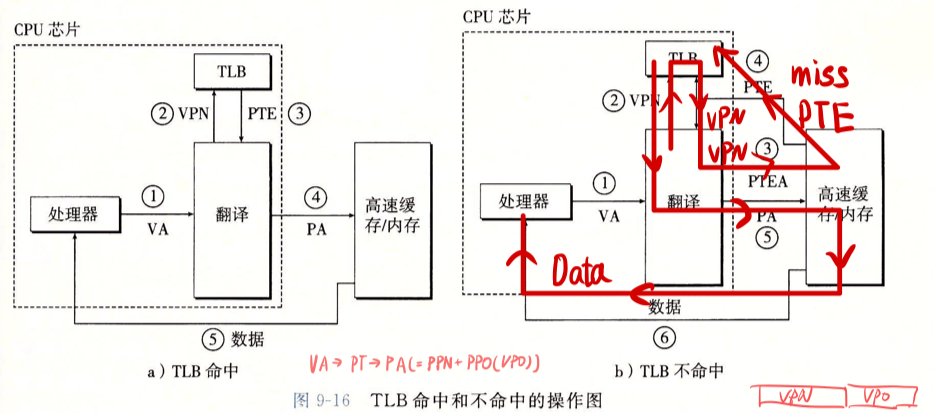

在带 TLB 和高速缓存的系统中，一次访存通常会经过这些步骤。

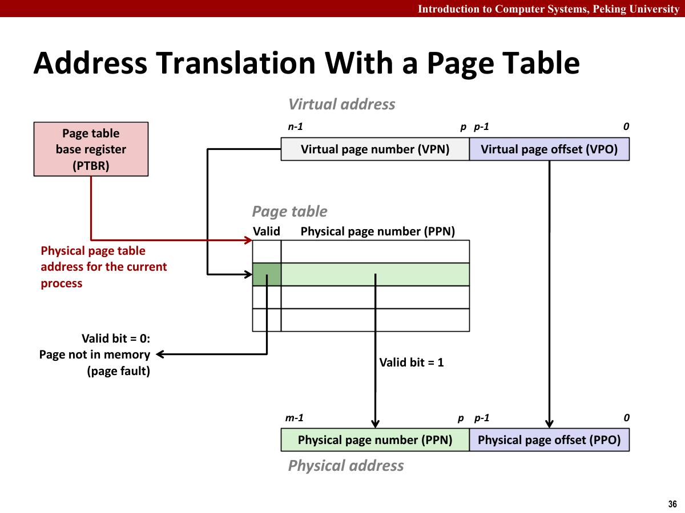

1. CPU 生成虚拟地址。
2. 硬件把虚拟地址拆成虚拟页号和页内偏移。
3. 先查 TLB，若命中则得到物理页号。
4. 若 TLB 不命中，则查页表。
5. 若页表项有效，补充 TLB，并形成物理地址。
6. 若页表项无效，则触发缺页异常。
7. 得到物理地址后，再访问 Cache 或主存。

多级页表要解决的是页表太大的问题。对于 64 位地址空间，如果为每个虚拟页都准备页表项，即使进程只使用很小一部分地址空间，也会浪费大量内存。

多级页表的思路是把页表也分页。只有一级页表中指向的二级页表确实存在时，才为它分配内存。这样一来，未使用的大块虚拟地址范围只需要一个空的高层页表项即可，不需要为每个虚拟页都准备页表项。

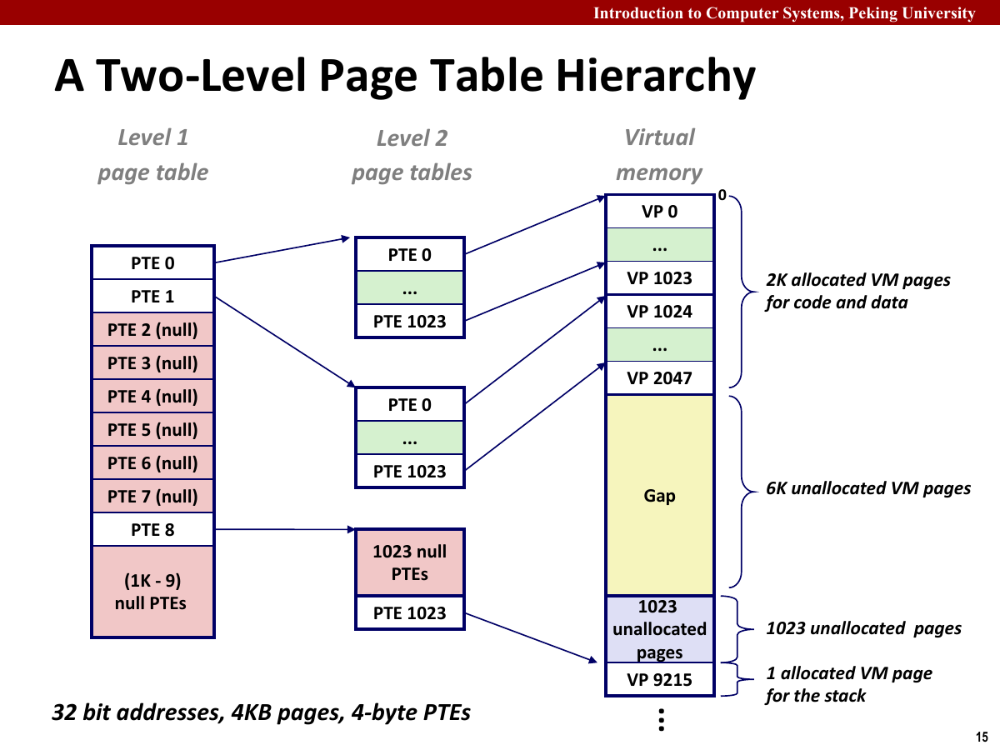

虚拟地址空间通常很稀疏。单级页表仍要为未使用区域保留页表项；多级页表则用高层页表中的空指针表示整片未分配区域，只为实际使用的范围分配底层页表。

多级页表以更长的查表路径换取较小的页表空间，再由 TLB 缓存常用翻译，减少实际查表次数。

多级页表的缺点是查表次数变多。因此实际系统会依赖 TLB 把常用地址翻译缓存下来。如果 TLB 命中率高，多级页表的额外成本就不明显。

页表负责把虚拟地址翻译为物理地址，Cache 保存物理地址对应的数据块。处理器通常先通过 TLB 或页表得到物理地址，再访问 Cache。

TLB 在进程切换时需要特别处理。因为不同进程的同一个虚拟页号可能映射到完全不同的物理页，旧进程留下的 TLB 项不能直接被新进程使用。一种方式是在切换地址空间时刷新 TLB，另一种方式是在 TLB 项中带上地址空间标识，从而区分不同进程的翻译结果。

一次访存包含两层查询。

1. TLB 命中时，硬件直接得到物理页号。
2. TLB 不命中但页表项有效时，系统通过页表补全翻译，再继续访问。
3. 页表项无效但虚拟地址合法时，发生正常缺页。
4. 虚拟地址非法或权限不符时，发生保护异常。

TLB miss 只表示翻译缓存未命中；合法地址上的缺页也能由操作系统修复。只有非法地址或权限错误无法恢复。

TLB 的性能也非常依赖局部性。顺序扫描数组时，一个页内的许多元素共享同一个 TLB 项；若程序在巨大数组上随机跳页访问，就可能频繁 TLB miss。`Cache Lab` 里强调的局部性，在虚拟内存层面仍然成立，只是单位从 cache line 变成了 page。

多级页表与 TLB 对应三层访问代价。

- TLB 命中：只需要很少硬件步骤，正常访问数据。
- TLB 不命中但页表有效：需要查页表，补 TLB，再访问数据。
- 页表无效但地址合法：陷入内核，调入或分配页面，再重试指令。

三种情况的开销相差很大，程序的访存方式不仅影响 Cache miss，也会影响地址翻译成本。

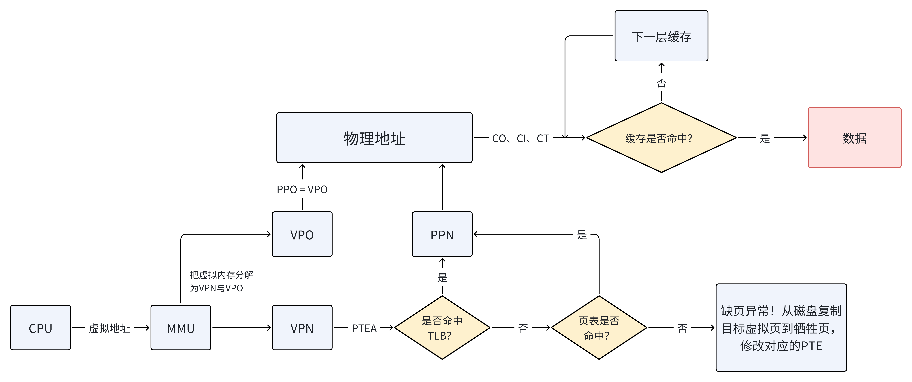

一次访存先检查 TLB，再在必要时查询页表；形成物理地址后，才进入 Cache 的命中判断。TLB 缓存地址翻译，Cache 缓存数据块。

地址翻译题按以下顺序处理。

1. 根据页面大小拆出虚拟页号和页内偏移。
2. 用虚拟页号查 TLB，若命中，直接得到物理页号。
3. 若 TLB 不命中，用虚拟页号查页表。
4. 若页表项有效，把物理页号和页内偏移拼成物理地址。
5. 若页表项无效，判断是合法缺页还是非法访问。
6. 得到物理地址后，再按 Cache 的标记、组索引和块偏移继续判断数据是否命中。

TLB 保存最近的翻译结果，页表保存进程的地址映射，Cache 保存物理地址对应的数据块，三者的索引对象不同。

## Linux 虚拟内存与内存映射

`mmap` 可以把一个对象映射到虚拟内存区域。这个对象可以是普通文件，也可以是匿名对象。

文件映射有两种常见方式。

- 私有映射：写入不会反映到原文件，通常通过 COW 实现。
- 共享映射：写入可能反映到底层文件，也能被其他映射同一对象的进程看到。

`fork` 后，父子进程共享相同的物理页面，并把相关页设置为只读。某个进程写页面时触发异常，内核再复制页面，这就是 COW。

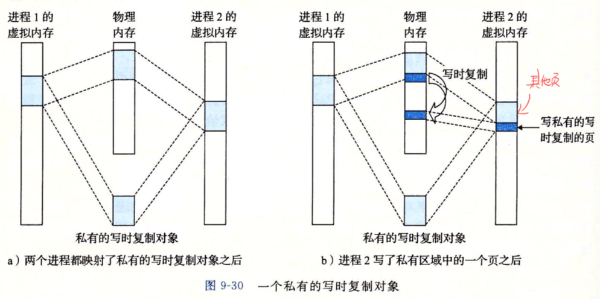

`execve` 则会丢弃当前地址空间，重新创建一套区域，把可执行文件和共享库映射进来，然后跳到新程序入口。

加载器建立用户地址空间时，并不一定把整个可执行文件都立即读进主存。更常见的做法是建立虚拟区域和文件之间的映射，真正访问时再按页调入。

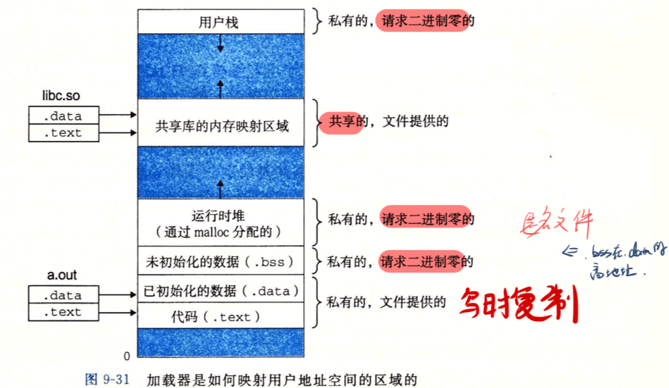

`mmap` 将文件或匿名对象映射到虚拟地址区域。文件映射允许程序通过内存访问文件内容；匿名映射没有底层文件，常用于堆、共享内存或大块临时空间。页面尚未进入物理内存时，访问仍会触发缺页处理。

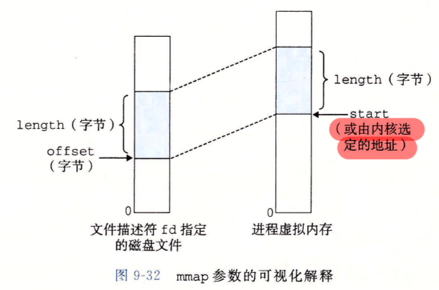

私有映射写入时产生进程自己的副本，共享映射的修改则可以被其他映射者观察到。`fork` 后，父子进程先共享只读页面；某一方写入时，内核通过 COW 复制页面并恢复写权限。

## 动态内存分配

动态内存分配器（Dynamic Memory Allocator）管理进程的堆。堆在逻辑上是一串连续的虚拟内存，分配器通过 `brk`、`sbrk` 或 `mmap` 向内核取得更大的区域，再把这些区域切成应用程序需要的块。

分配器并不知道一块内存保存的是数组、结构体还是字符串。它只记录块的大小、分配状态和空闲块之间的关系。返回给程序的指针指向 payload，块头等元数据位于指针之前，不能被用户代码覆盖。

常用接口的语义并不相同。

| 接口 | 行为 |
| --- | --- |
| `malloc(size)` | 分配至少 `size` 字节，内容未初始化 |
| `calloc(n, size)` | 分配 `n * size` 字节，并将内容清零 |
| `realloc(ptr, size)` | 调整原块大小，必要时搬到新位置 |
| `free(ptr)` | 释放 `ptr` 指向的已分配块 |

`free` 接收的必须是分配器返回的块首地址。传入 payload 中间的地址、栈地址、已经释放过的地址，都会破坏分配器状态。`free(NULL)` 则不做任何事。

一个内存块通常包含以下部分。

- 头部（Header）：保存块大小和分配位。
- 载荷（Payload）：交给应用程序使用的区域。
- 填充（Padding）：满足对齐或最小块大小而留下的空间。
- 尾部（Footer）：空闲块中可选的边界标记，用于向前寻找物理相邻块。

分配器返回的 payload 需要满足对齐要求。例如按 16 字节对齐时，用户申请 13 字节并不代表堆只增加 13 字节；还要计入头部，并把块大小向 16 的倍数取整。显式空闲链表还需要让空闲块至少容纳前驱和后继指针。

分配器需要满足两个目标。

- 吞吐率高，也就是分配和释放尽量快。
- 内存利用率高，也就是碎片尽量少。

在第 $k$ 次请求结束后，令 $P_k$ 表示应用程序历史上同时使用过的最大 payload，令 $H_k$ 表示堆已经扩展到的字节数。峰值利用率记为

$$
U_k=\frac{\max_{i\leq k}P_i}{H_k}
$$

分配器不能移动仍在使用的块，因为应用程序中可能保存着指向这些块的指针。它只能在现有空闲块中寻找位置，或者继续扩展堆。因此吞吐率和利用率很难同时做到最好：搜索更仔细通常能减少碎片，却会让 `malloc` 更慢。

碎片分为内部碎片和外部碎片。内部碎片来自块内部没有被使用的空间，例如对齐和最小块大小带来的浪费。外部碎片来自空闲空间总量足够，但被切成许多小块，无法满足大块请求。

内部碎片可以从当前块直接算出，外部碎片则依赖未来请求。堆里即使还有 1KB 空闲空间，如果它被分成十几个互不相邻的小块，也未必能满足一次 512B 的分配。

一次 `malloc` 大致经过这些步骤。

1. 加上头部开销，并按对齐要求调整请求大小。
2. 在空闲结构中寻找足够大的块。
3. 若块明显大于请求，则切下一部分，把剩余部分留作空闲块。
4. 若没有合适块，则向内核申请更多堆空间。
5. 写入块头并返回 payload 指针。

`free` 不会清空 payload。它只把块标记为空闲，再检查前后物理相邻块是否也为空闲。若相邻块可以合并，就把几块拼成一个大块，避免连续空闲空间被拆散。

隐式空闲链表把堆组织成连续块序列。每个块头部记录大小和分配状态，分配时从头到尾扫描，寻找合适空闲块。

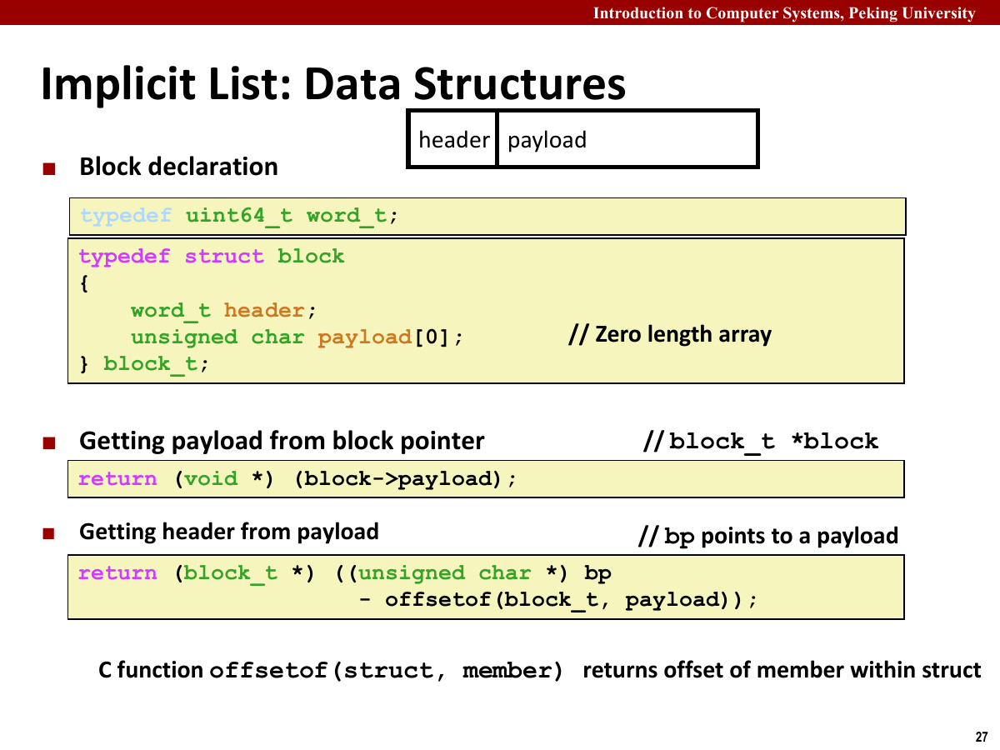

隐式链表的“隐式”指的是：空闲块没有单独串成链表，分配器通过块大小从一个块跳到下一个块。只要每个块头部记录大小，就能沿着整个堆顺序走下去。

隐式链表实现简单，但每次分配可能扫描大量已分配块；堆越大，查找代价越高。

空闲块有三种常见查找策略。

- 首次适配：找到第一个足够大的块就使用。
- 下一次适配：从上次搜索结束位置继续找。
- 最佳适配：搜索所有空闲块，找能容纳请求且最小的块。

首次适配简单且通常速度较好，但可能在堆前部留下很多小碎片。最佳适配利用率可能较好，但搜索代价更高。

释放块后，需要考虑相邻块是否空闲。如果相邻空闲块不合并，外部碎片会越来越严重。

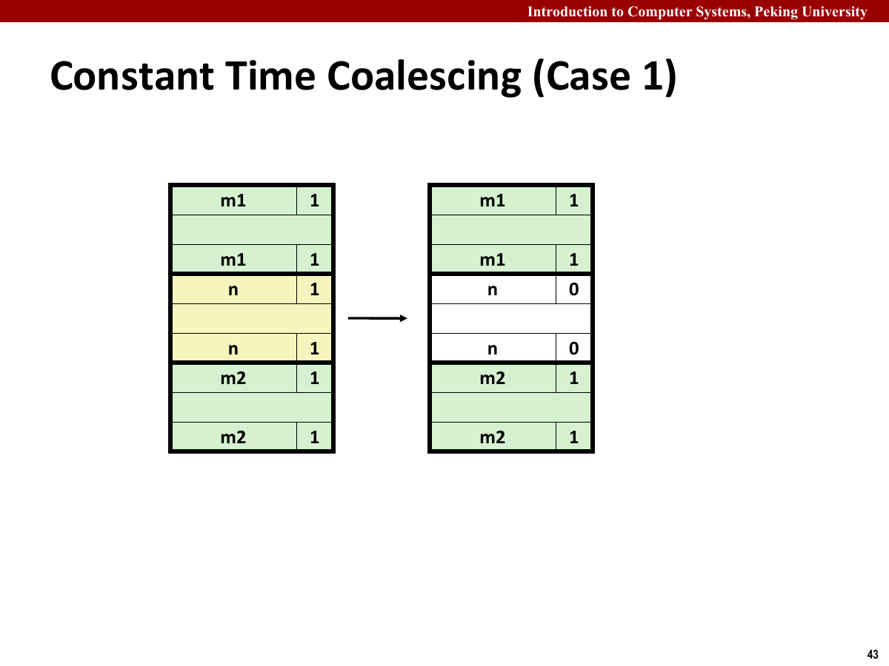

合并空闲块时，分配器关心的是当前块前后两个物理相邻块的分配状态。注意这里说的是物理相邻，也就是它们在堆中挨着，而不是空闲链表中挨着。

边界标记在块尾也保存大小和分配状态，使分配器能在常数时间内找到前一个物理块。这样释放时可以根据前后块状态分四种情况合并。

不过，给每个已分配块都保留 footer 会浪费空间。一种常见优化是在块头里额外保存前一个块是否已分配的标志位。由于块大小按对齐要求本来就会让低位为零，这些低位可以拿来存放 `alloc` 和 `prev_alloc` 之类的信息。这样一来，已分配块可以省掉 footer，只有空闲块需要 footer 来支持向前合并。

如果当前块前后都已分配，只需要标记当前块为空闲。若前块或后块为空闲，则合并对应块。若前后都空闲，则三个块合并为一个更大的空闲块。

显式空闲链表只把空闲块串起来，不扫描已分配块。空闲块内部可以存放前驱和后继指针。

分离空闲链表进一步按块大小分类。每个大小类维护一条空闲链表，分配时优先在对应大小类中寻找，找不到再去更大的大小类。

Malloc Lab 中常见的优化路线就是从隐式链表走向显式链表，再走向分离空闲链表，同时小心处理合并、分裂、对齐和堆检查。

显式空闲链表只遍历空闲块，并利用空闲块的 payload 区域保存前驱和后继指针。

块由空闲变为已分配时要从链表摘除，由已分配变为空闲时要插入链表；发生合并时，原有空闲块也要先摘除。块状态与链表指针必须同步更新。

分离空闲链表按大小为块分桶。大小类可以按 16、32、64 近似指数增长，也可以根据 trace 调整；实现时先保证各链表的不变量正确，再调整分桶策略。

分配器需要同时维护前驱、后继、头部和尾部信息。分裂时要更新新旧块的大小与分配位；合并时要先从原链表摘除被合并的空闲块。

堆检查器应当检查这些性质。

- 每个块是否满足对齐要求。
- 块大小是否不小于最小块大小。
- 连续空闲块是否已经合并。
- 空闲链表中的块是否确实标记为空闲。
- 所有空闲块是否都能从某条空闲链表中找到。
- 空闲链表的前驱和后继关系是否互相一致。
- 块边界是否落在堆范围内。

堆检查分为两遍。

第一遍按物理顺序扫描整个堆，检查每个块的头部、尾部、大小、对齐和连续空闲块。这样能发现块边界被破坏、大小字段异常、合并遗漏等问题。

第二遍沿空闲链表扫描，检查链表节点是否真的空闲，前驱后继是否互相指回，链表中的块是否都落在堆范围内。这样能发现链表指针乱掉、同一空闲块重复入链、已分配块误入链表等问题。

最后比较两遍得到的空闲块集合。物理扫描发现的空闲块都应出现在某条空闲链表中，链表中的块也应位于物理堆内并标记为空闲。这项检查常用于定位 `free` 和 `coalesce` 的错误。

`Malloc Lab` 的 trace 若在后段崩溃，错误可能来自更早的 `free` 或合并。尽早调用堆检查器，才能定位第一次破坏堆结构的操作。

`realloc` 最简单的实现是重新 `malloc` 一块、拷贝旧数据、释放旧块。这种写法容易保证正确性，但性能和利用率一般。进一步优化时可以尝试原地扩展当前块，例如合并后面的空闲块，或者在缩小时分裂出剩余空间。

优化 `realloc` 前要先处理旧块大小、拷贝长度和失败时旧指针仍有效等语义，否则原地扩展很容易破坏堆结构。

`realloc` 至少要守住几条语义。

- `ptr == NULL` 时，它等价于 `malloc`。
- `size == 0` 时，它可以释放旧块并返回 `NULL`。
- 新块比旧块小时，只需要保留前面那部分内容。
- 新块比旧块大时，只能拷贝旧块原有 payload 的长度。
- 若重新分配失败，原块仍然有效，不能提前释放。

这些边界错误通常表现为链表损坏或 payload 被截断。写完 `realloc` 后，应使用小 trace 分别覆盖这些情况。

## 垃圾回收与内存错误

显式分配要求程序在对象不再使用时调用 `free`。隐式分配器（Implicit Allocator）则由垃圾收集器（Garbage Collector，GC）判断哪些块已经失去用途，并自动回收。

这里最容易混淆的是“当前没有使用”和“以后不可能再使用”。前者不能回收，后者才是垃圾。GC 不猜测程序将来的分支，而是从程序现在还能拿到的指针出发，检查对象是否可达。

例如，一个函数申请堆块后直接返回，又没有把指针保存到函数外部。函数返回后，再也没有代码能够取得这块内存，它就已经成为垃圾。问题在于，GC 无法预知某个指针以后会不会经过条件分支再次使用，只能判断某块内存是否已经彻底不可达。

GC 将内存看成一张有向图。

- 每个已分配堆块是一个节点。
- 块中保存的指针是指向其他节点的边。
- 寄存器、线程栈和全局变量中指向堆的指针构成根集合（Root Set）。
- 从任意根节点出发能够到达的块仍可能被程序使用。
- 从根集合无法到达的块才可以安全回收。

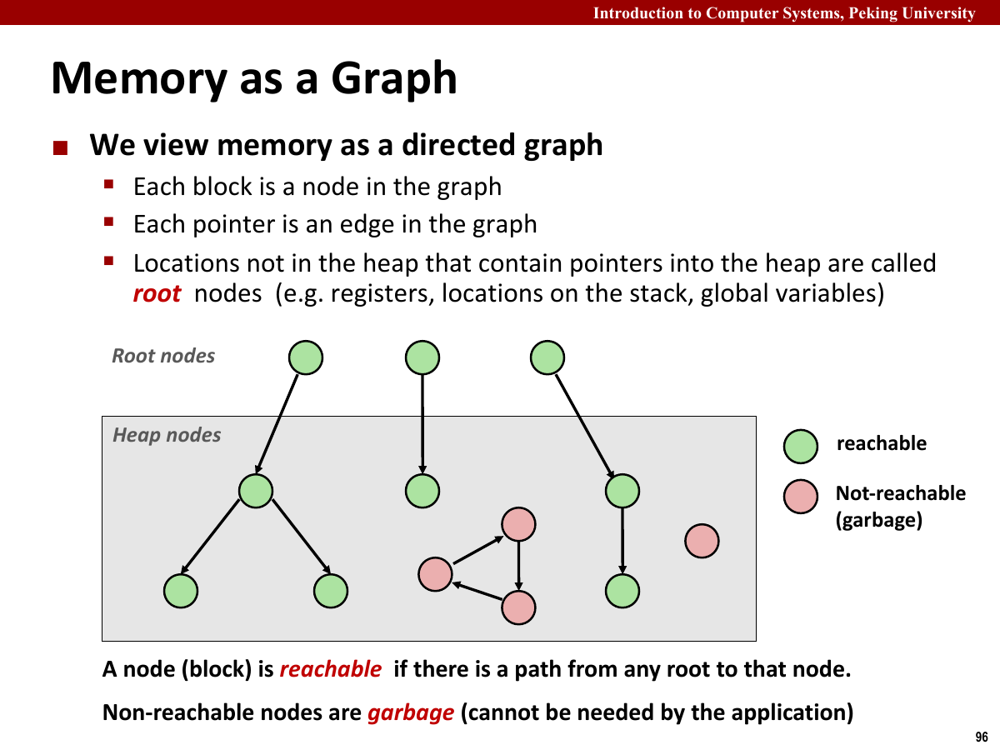

两个对象即使互相保存指针，只要它们都与根集合断开，就仍然是垃圾。这也是单纯引用计数的缺点：环中的每个对象引用计数都不为零，但整个环已经无法被程序访问。

常见回收方法有几类。

| 方法 | 判断方式 | 特点 |
| --- | --- | --- |
| 引用计数 | 记录每个对象被引用的次数 | 回收及时，但不能独立处理引用环 |
| 标记清除 | 从根集合标记可达对象，再扫描整个堆 | 不移动对象，适合建立在 `malloc/free` 之上 |
| 复制回收 | 把存活对象复制到另一片区域 | 能顺便压缩空间，但对象地址会改变 |
| 分代回收 | 按对象年龄划分区域 | 利用多数对象生命周期很短这一现象 |

### 标记与清除

标记清除（Mark and Sweep）可以直接建立在已有分配器之上。分配器照常处理 `malloc`；当剩余空间不足或达到回收阈值时，暂停程序并启动一次回收。

标记阶段从根集合出发遍历对象图。遇到一个堆指针时，先找到它所属块的头部；若该块尚未标记，就设置标记位，并继续检查它的 payload 中是否还包含指向其他块的指针。已经标记过的块不再递归，既避免重复工作，也能处理图中的环。

清除阶段按物理顺序扫描堆。

- 已分配且带标记的块仍然可达，清掉标记位，留给下一轮回收继续使用。
- 已分配但没有标记的块不可达，交给 `free` 回收到空闲链表。
- 原本就是空闲的块保持不变，并按分配器规则参与合并。

标记过程可以写成深度优先遍历。

```c
void mark(ptr p) {
    if (!is_heap_pointer(p) || marked(p)) {
        return;
    }

    set_mark(p);
    for (size_t i = 0; i < payload_words(p); i++) {
        mark(p[i]);
    }
}
```

清除过程不需要沿对象指针走，只要按照块头中的大小依次扫描堆。

```c
void sweep(ptr first, ptr end) {
    for (ptr p = first; p < end; p = next_block(p)) {
        if (allocated(p) && marked(p)) {
            clear_mark(p);
        } else if (allocated(p)) {
            free(payload(p));
        }
    }
}
```

若堆中共有 $H$ 个块，存活对象内部共检查 $E$ 个可能的指针槽位，一轮标记清除需要 $O(H+E)$ 量级的线性工作。它不会移动存活对象，因此已有指针仍然有效；代价是回收期间要扫描堆，而且清除后仍可能留下外部碎片。

### C 语言中的保守回收

Java 等运行时知道对象布局，能够区分哪些字段是指针。C 语言只把内存看成字节：一个机器字可能是整数，也可能是指针；指针还可能经过整数转换，或者指向块的中间位置。因此 C 中很难实现完全精确的 GC。

保守垃圾回收（Conservative Garbage Collection）会把“数值落在某个已分配块地址范围内”的机器字当成潜在指针。这样做首先要解决两个问题。

1. 给定一个可能指向块中间的地址，回收器要找到该块真正的起始位置。可以用平衡树、页表式索引或区间结构记录所有已分配块。
2. 某个普通整数若恰好等于堆地址，回收器会把对应块误认为可达。这个块暂时回收不了，但仍不会错误释放程序可能使用的对象。

保守回收允许假阳性，不允许假阴性。多保留一块垃圾只会浪费空间，漏掉一个真实指针却会释放仍在使用的对象，随后形成悬垂指针。正因如此，C 的保守回收器不保证找回全部垃圾。

GC 只负责回收不可达对象，并不能修复越界写、使用已释放内存或错误的类型转换。手动调用 `free` 的程序仍要单独检查这些问题。

C 程序中常见的内存错误包括：

- `malloc` 后不检查返回值，可能在内存不足时解引用空指针。
- `sizeof` 写错对象类型，可能导致分配空间不足。
- 对已释放块继续读写，会形成悬垂指针。
- 越界写不一定立刻崩溃，但可能破坏分配器元数据。
- 对同一指针重复 `free`，可能破坏空闲链表。
- `free` 的指针不是块起始地址，也会破坏分配器状态。
- 忘记释放不再使用的堆块，会形成内存泄漏。

操作系统负责把虚拟地址映射到物理资源，分配器负责在用户堆中切分和回收块。
